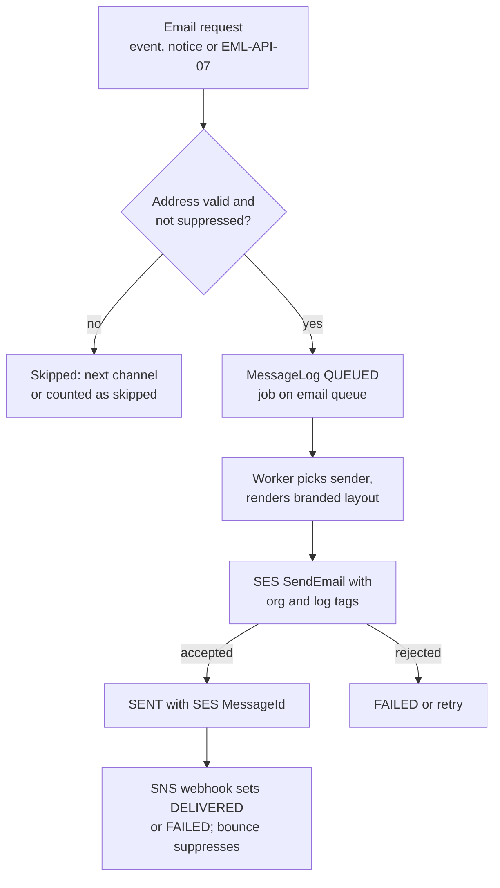
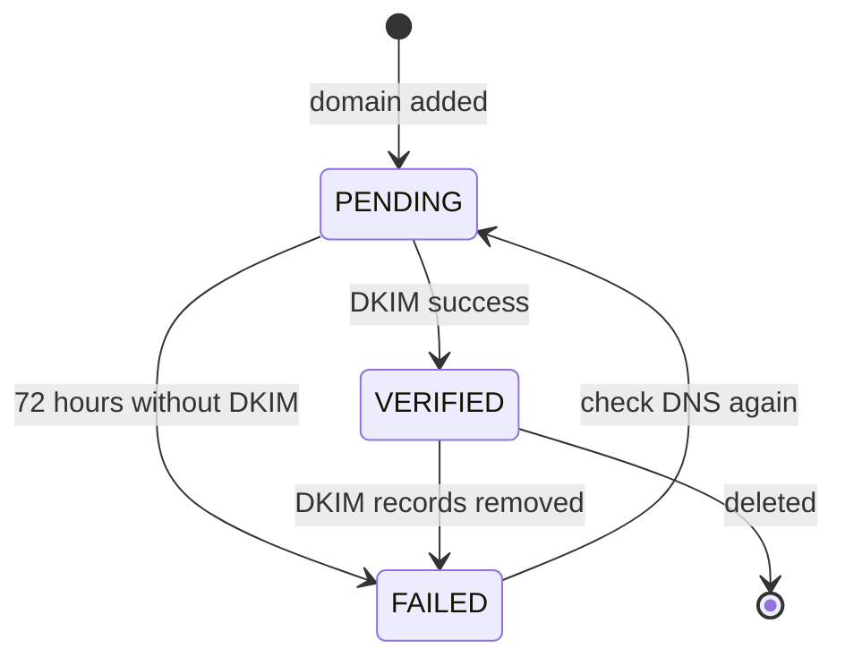
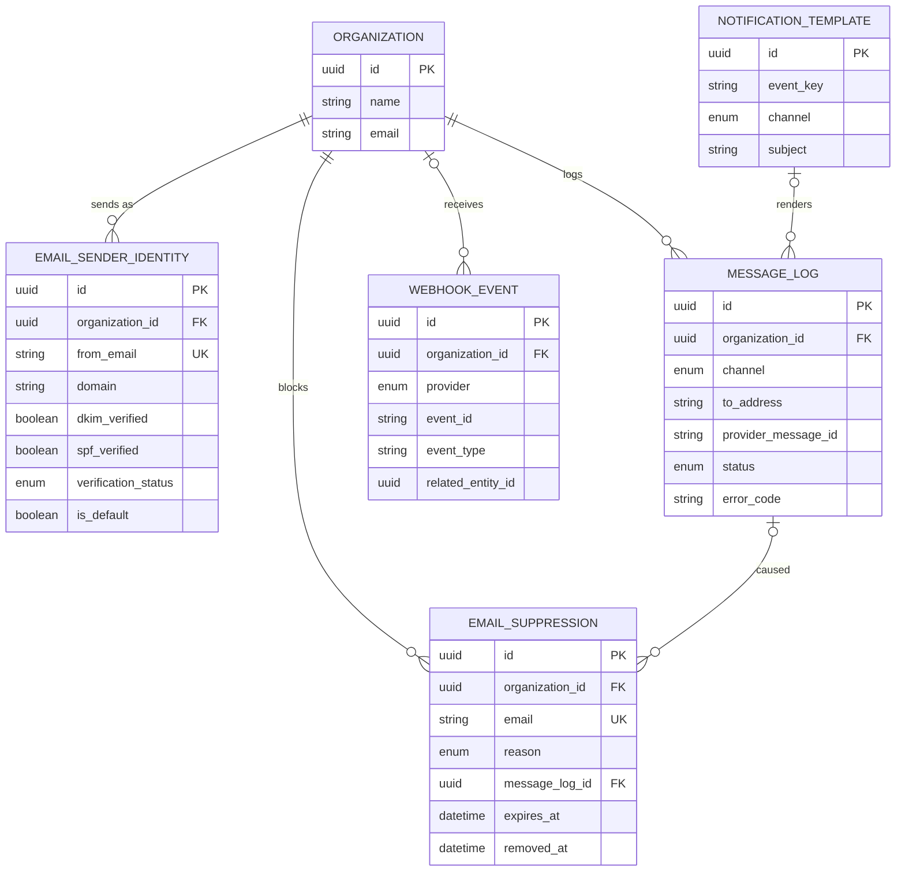

# Email Module

**In simple words:** This module sends every EduFlow email through Amazon SES (Simple Email Service, Amazon's bulk email service), from the shared EduFlow sender or from the institute's own domain. It keeps bad addresses out with a suppression list and gives parents a one-click unsubscribe for notices. Receipts and report cards travel only as secure sign-in links. When an email fails, the admin sees exactly why.

| Item | Value |
|---|---|
| Module code | EML |
| Release phase | Phase 2 (V1.0), built on Days 65 to 68 with prompt P-31. System emails run from Phase 1 on the shared sender |
| Plans | Starter: system and event emails on the shared sender. Growth: full module, 1 own-domain sender. Pro: 5 senders. Enterprise: 25 senders |
| Main users | Organization Admin, Principal; parents and staff receive |
| Depends on | Notifications, Settings (branding, quiet hours), Organizations (plan), Payments, Report Cards, Parent Portal |
| Main tables | `email_sender_identities`, `email_suppressions` (plus `message_logs`, `webhook_events`, `notification_templates`, `notification_preferences`) |

## Objective

1. **Inbox, not spam.** At least 98% of accepted emails reach `DELIVERED`. Each tenant keeps a hard-bounce rate under 2% and a complaint rate under 0.05%.
2. **Speed.** A transactional email (receipt, password reset) is accepted by SES within 60 seconds of the event (p95), outside quiet hours.
3. **The school's own name.** An institute sends from `accounts@brightfuture.edu.in` after about 15 minutes of DNS work.
4. **Clean lists.** No email ever goes to a suppressed address. An unsubscribe takes effect in under 1 minute.
5. **No personal files in mail.** Receipts, invoices and report cards travel only as sign-in links, never as attachments.
6. **Fast answers.** Support sees why Sunita Devi did not get an email in under one minute.

## Scope

### In scope

- The Amazon SES adapter behind the *Notifications Module* email channel.
- The shared sender `no-reply@eduflow.app` for every plan.
- Own-domain senders (`EmailSenderIdentity`) with DKIM, SPF, verification checks and warm-up.
- A branded layout around `NotificationTemplate` email bodies.
- Transactional and bulk mail; bulk mail carries one-click unsubscribe.
- Ad-hoc email (EML-API-07) with secure document links.
- Delivery, bounce and complaint events from SES through SNS (Simple Notification Service, Amazon's push-message service) into the suppression list.
- Sending limits, reputation guard, log, resend, summary and export.

### Out of scope

| Item | Owner |
|---|---|
| Which event goes to which channel, quiet hours, fallback, template texts | *Notifications Module* |
| Logo, colours and the `branding` setting | *Settings Module* |
| Receipt, invoice and report card PDFs | *Payments Module*, *Fees Module*, *Report Cards Module* |
| Parent sign-in and PDF download pages | *Parent Portal Module* |
| Inbound email, shared inboxes, reply tracking | Not planned. Replies go to the school's own mailbox |
| Open and click tracking | Not planned. Privacy first; Apple Mail hides opens anyway |
| Marketing campaigns to leads | Not planned. EduFlow is not a marketing tool |

### Phase notes

| When | What ships |
|---|---|
| Week 2 (12 to 18 Oct 2026), P-07 | `lib/mailer.ts` sends invitations, resets and email OTPs from `no-reply@eduflow.app` |
| Days 65 to 68 (8 to 11 Dec 2026), P-31 | EML-API-01 to 16 and the email channel for all events |
| Phase 4 (by Sep 2027) | SES in the data region of UAE, USA and Australia tenants; layout strings in Arabic |

## User Stories

| ID | As a | I want to | So that | Priority |
|---|---|---|---|---|
| EML-US-01 | Organization Admin | send email from our own domain | parents trust the sender and reply to our office | Must |
| EML-US-02 | Organization Admin on any plan | have receipts and password resets work by email without DNS work | we start on day one | Must |
| EML-US-03 | Parent | get the fee receipt email with a secure link | I can download proof of payment safely | Must |
| EML-US-04 | Parent | unsubscribe from notice emails in one click | my inbox holds only what I want | Must |
| EML-US-05 | Organization Admin | stop mailing addresses that bounce or complain | our sender is not marked as spam | Must |
| EML-US-06 | Principal | email all parents of 10-A with a link to the Term 1 report card | parents read results before the PTM | Must |
| EML-US-07 | Organization Admin | see the exact bounce reason of a failed email | I can fix the address the same day | Must |
| EML-US-08 | Organization Admin | clear a suppression after a parent fixes the mailbox | the parent gets emails again | Should |
| EML-US-09 | Principal | resend a failed email in one click | an important notice is not lost | Should |
| EML-US-10 | Organization Admin | see delivery, bounce and complaint rates each month | I know our lists are healthy | Should |
| EML-US-11 | Organization Admin | have a new domain warmed up slowly | Gmail does not distrust a sudden burst | Should |
| EML-US-12 | Organization Admin | export the email log for 93 days | I can answer an audit or a complaint | Could |

## Workflow

**Figure: One outbound email**



The *Notifications Module* decides that a message goes by email. This module sends it, tracks it and protects the address list.

1. **Request.** An event (`receipt.issued`), a notice or EML-API-07 asks for an email.
2. **Check.** The address must not be blocked for this mail class (EML-BR-07); otherwise the engine tries the next channel.
3. **Queue.** A `QUEUED` log row is written with job ID `eml-{messageLogId}`.
4. **Send.** The worker picks the sender (EML-BR-01), renders the layout and calls SES. The SES `MessageId` is stored and the row becomes `SENT`.
5. **Track.** SNS posts SES events to EML-API-14: delivery sets `DELIVERED`; a bounce sets `FAILED` and may suppress; a complaint suppresses.

**Figure: Sender identity verification**



SES looks for the DKIM records for 72 hours; after that the admin starts a new check with EML-API-05.

| `verificationStatus` | Meaning | Sends from this identity |
|---|---|---|
| `PENDING` | Records shown; checked hourly for 72 hours | No; shared sender |
| `VERIFIED` | DKIM passes; warm-up starts | Yes, within the warm-up cap |
| `FAILED` | DKIM not found, or removed later | No; shared sender |

**Email status in `message_logs`** (status moves forward only, NTF-BR-15)

| Status | Set when | Next |
|---|---|---|
| `QUEUED` | Row written; may wait for quiet hours | `SENT`, `FAILED` |
| `SENT` | SES accepted the message and returned a `MessageId` | `DELIVERED`, `FAILED` |
| `DELIVERED` | SES `Delivery` event: the receiving server took it | End; a late bounce only suppresses |
| `FAILED` | Bounce, reject, or final send error | End; resend makes a new row |
| `READ` | Never used for email | - |

A suppression is active, expired (soft bounces only) or cleared by an admin; EML-BR-07 and EML-BR-11 give the rules.

## Screens and Wireframes

| ID | Screen | Users | Purpose |
|---|---|---|---|
| EML-S01 | Senders | Organization Admin; Principal (view) | Shared sender, own domains, status, warm-up |
| EML-S02 | Add domain and DNS records | Organization Admin | Sender fields, five DNS records, check DNS |
| EML-S03 | Email log | Organization Admin, Principal | Filter by status, event, recipient, campus, date |
| EML-S04 | Email detail | Organization Admin, Principal | Timeline, bounce diagnostics, resend |
| EML-S05 | Compose email | Organization Admin, Principal | Audience, text, document link, send |
| EML-S06 | Suppression list | Organization Admin; Principal (view) | Reasons, expiry, clear, add |
| EML-S07 | Email summary | Organization Admin, Principal | Rates by day and category |
| EML-S08 | Receipt email | Parent (phone) | A branded transactional email |
| EML-S09 | Unsubscribe page | Parent (no login) | Confirm unsubscribe |

**Screen EML-S02 — Add domain and DNS records (Organization Admin, web)**

```text
+--------------------------------------------------------------------------+
| EduFlow | Bright Future Public School      [Search...]            (RS) v |
+------------+-------------------------------------------------------------+
| Dashboard  | Email > Senders > brightfuture.edu.in                       |
| Students   +-------------------------------------------------------------+
| Fees       | From name  [Bright Future Public School    ]                |
| Email    < | From email [accounts@brightfuture.edu.in   ]  Default [x]   |
|  Senders   | Reply-to   [office@brightfuture.edu.in     ]                |
|  Log       | Status: PENDING    Checked 10:42    DKIM: No    SPF: No     |
|  Compose   |-------------------------------------------------------------|
|  Suppress  | Add these 5 records at your DNS provider:                   |
|  Summary   | Type  Name                 Value                    State   |
| Settings   | CNAME k3x7._domainkey      k3x7.dkim.amazonses.com  PENDING |
|            | CNAME p9qa._domainkey      p9qa.dkim.amazonses.com  PENDING |
|            | CNAME z2mw._domainkey      z2mw.dkim.amazonses.com  PENDING |
|            | MX    bounce               feedback-smtp.ap-sou...  PENDING |
|            | TXT   bounce               v=spf1 include:amazo...  PENDING |
|            | Advice: add _dmarc TXT "v=DMARC1; p=none" if you have none  |
|            |                  [Copy all]  [Delete]  [Check DNS now]      |
+------------+-------------------------------------------------------------+
```

- Saving calls EML-API-02, which returns the five records. **Copy all** copies them as plain text for the IT person.
- **Check DNS now** calls EML-API-05 (once per minute). **Delete** calls EML-API-04; mail then goes from the shared sender.

**Screen EML-S04 — Email detail (Organization Admin, web)**

```text
+--------------------------------------------------------------------------+
| EduFlow | Bright Future Public School      [Search...]            (RS) v |
+------------+-------------------------------------------------------------+
| Email    < | Email log > Detail                          [Resend] [Back] |
|  Senders   +-------------------------------------------------------------+
|  Log       | To: sunita.devi82@gmial.com (Sunita Devi, parent of Aarav)  |
|  Compose   | Event: fees.receipt   From: accounts@brightfuture.edu.in    |
|  Suppress  | Subject: Fee receipt RCT-2027-28-00451 - Aarav Sharma       |
|  Summary   | Status: FAILED        Error: EMAIL_HARD_BOUNCE              |
|            |-------------------------------------------------------------|
|            | Timeline (IST)                                              |
|            | 10:15:02  QUEUED     job eml-5b2e8c1a...                    |
|            | 10:15:03  SENT       SES id 0109019a2b3c4d5e...             |
|            | 10:15:05  BOUNCE     Permanent / General                    |
|            |-------------------------------------------------------------|
|            | Diagnostic: smtp; 550 5.1.1 The email account that you      |
|            | tried to reach does not exist.                              |
|            | Suppressed: HARD_BOUNCE since 12 Apr 2027, 10:15            |
|            | Hint: "gmial.com" looks like a typo of "gmail.com"          |
|            |            [Edit guardian email]  [Clear suppression]       |
+------------+-------------------------------------------------------------+
```

- Data comes from EML-API-08. The typo hint checks 40 common misspellings (`gmial.com`, `gmal.com`, `yaho.com`).
- **Edit guardian email** opens the *Student Profile Module* form. **Resend** (EML-API-09) is disabled while the address is suppressed.

**Screen EML-S05 — Compose email (Principal, web)**

```text
+--------------------------------------------------------------------------+
| EduFlow | Bright Future Public School      [Search...]            (AV) v |
+------------+-------------------------------------------------------------+
| Email    < | Compose email                        Campus [Main Campus v] |
|  Senders   +-------------------------------------------------------------+
|  Log       | From    [Bright Future <accounts@brightfuture.edu.in> v]    |
|  Compose   | To      Batches [10-A x] [10-B x]    (o) Parents ( ) Staff  |
|  Suppress  | Subject [Term 1 report card and PTM on Saturday 16 Oct    ] |
|  Summary   | Body    [Dear {{guardianName}},                           ] |
|            |         [The Term 1 report card of {{studentName}} is     ] |
|            |         [ready. PTM: Saturday 16 Oct, 9 am to 1 pm.       ] |
|            | Link    [Report card - Term 1 v]    Variables [Insert v]    |
|            |-------------------------------------------------------------|
|            | Recipients 118 | no email 9 | suppressed 2 | duplicate 3    |
|            | Bulk today: 312 of 5,000.  Quiet hours 21:00 to 07:00       |
|            |           [Preview]  [Send test to me]  [Schedule]  [Send]  |
+------------+-------------------------------------------------------------+
```

- The counts line calls EML-API-07 with `dryRun: true`; **Send test to me** uses `testToSelf: true`.
- **Link** offers `None`, `Report card` (published term or exam) and `Fee dues`, never a raw file for parents (EML-BR-12).

**Screen EML-S08 — Receipt email (Parent, mobile)**

```text
+------------------------------------+
| 9:41                         [==]  |
| < Inbox                            |
|------------------------------------|
| Bright Future Public School        |
| accounts@brightfuture.edu.in       |
| To: me               12 Apr, 10:15 |
|------------------------------------|
| Fee receipt RCT-2027-28-00451      |
| - Aarav Sharma                     |
|------------------------------------|
| [LOGO] BRIGHT FUTURE PUBLIC SCHOOL |
|                                    |
| Dear Sunita Devi,                  |
| We received Rs 12,000 for Aarav    |
| Sharma (10-A) on 12 Apr 2027.      |
| Receipt: RCT-2027-28-00451         |
| Balance due: Rs 3,000              |
|                                    |
|   [ View and download receipt ]    |
|                                    |
| The link opens the parent portal.  |
| Sign in with the OTP on your phone.|
|------------------------------------|
| Bright Future Public School,       |
| Gomti Nagar, Lucknow 226010        |
| You get this as a parent of Aarav. |
| Sent with EduFlow                  |
+------------------------------------+
```

- Transactional: no unsubscribe link; the reason line says why the parent gets it.
- The button opens `https://bright-future.eduflow.app/parent/receipts/{receiptId}`; after OTP sign-in, PP-S09 calls PP-API-19 for a 5-minute PDF link.

**Screen EML-S09 — Unsubscribe page (Parent, mobile)**

```text
+------------------------------------+
| bright-future.eduflow.app          |
|------------------------------------|
| [LOGO] Bright Future Public School |
|                                    |
| Unsubscribe su***82@gmail.com?     |
|                                    |
| You will stop getting notices and  |
| circulars by email from Bright     |
| Future Public School.              |
|                                    |
| You will still get by email:       |
|  * fee receipts and invoices       |
|  * absence and exam alerts         |
|  * login and security messages     |
|                                    |
| Notices stay in the parent app.    |
|                                    |
|          [ Unsubscribe ]           |
|                                    |
| Changed your mind? Ask the school  |
| office to turn emails back on.     |
+------------------------------------+
```

- The footer link of every bulk email opens this page, without login. **Unsubscribe** posts to EML-API-13 and shows "Done."
- Gmail, Apple Mail and Yahoo call EML-API-13 directly through the one-click headers.

## UI Components

| Component | Type | Behaviour |
|---|---|---|
| Shared sender card | `Card` | Always on EML-S01; says when the shared sender is used |
| Sender table | `DataTable` | From, domain, status, DKIM, SPF, default, warm-up day; row menu |
| DNS record list | `Table` with copy `Button` | Monospace values; copy button and state badge per record |
| Status badge | `Badge` | `PENDING` amber, `VERIFIED` green, `FAILED` red |
| Email log | `DataTable` with filter bar | Status, event, campus, dates, search; server paging of 20 |
| Audience picker | `Command` multi-select | Batches, courses, students or staff; live dry-run counts |
| Body editor | `Textarea` with variable menu | Inserts allowed variables; counter up to 20,000 characters |
| Clear suppression | `AlertDialog` | Note required for `COMPLAINT` and `UNSUBSCRIBED` |
| Rate cards, paused banner | `Card`, `Alert` | Rates with the EML-BR-16 limit line; red banner while bulk is paused |
| Loading, empty, error | `Skeleton`, `EmptyState`, `Alert` | Grey rows; "No emails yet."; "Could not load emails." with Retry and request ID |

## Validation Rules

| Field | Rule | Error message shown to user |
|---|---|---|
| `fromName` | 2 to 120 characters; no `<`, `>` or `@` | "Use 2 to 120 characters for the from name, without < > or @." |
| `fromEmail` | Valid address, stored lower-case, at most 255 characters, unique in the organization | "Enter a valid email address such as accounts@yourschool.in." |
| `fromEmail` domain | Not a free-mail domain (`gmail.com`, `yahoo.com`, `outlook.com`, `rediffmail.com`) | "You cannot send as gmail.com. Use an address on your own domain." |
| `domain` | Not `PENDING` or `VERIFIED` in another organization | "This domain is already used by another EduFlow account. Contact support." |
| Sender count | Within the plan limit (EML-BR-05) | "Your plan allows 1 sender. Upgrade to Pro for 5 senders." |
| `subject` | 1 to 200 characters, one line | "Add a subject of up to 200 characters." |
| `body` | 1 to 20,000 characters; only allowed variables | "{{rollNo}} is not a variable here. Use one of: guardianName, studentName, batchName, dueAmount, schoolName." |
| Audience | 1 to 5,000 recipients after de-duplication | "Pick an audience of 1 to 5,000 recipients." |
| `documentLink` | `NONE`, `FEE_DUES`, or `REPORT_CARD` with a published `scopeKey`; parent audiences only | "Pick a published report card to link." |
| `fileIds` | Staff audiences only; at most 3 `ACTIVE` files of 10 MB each | "Files can go only to staff. Send files to parents as a notice." |
| `scheduledAt` | 5 minutes to 30 days ahead | "Pick a time between 5 minutes and 30 days from now." |
| Suppression `email`, `detail` | Valid, no active row; detail 3 to 500 characters | "This address is already suppressed (HARD_BOUNCE since 12 Apr 2027)." |
| Clear `note` | Required for `COMPLAINT` and `UNSUBSCRIBED`; 10 to 500 characters | "Write down how the parent asked to get emails again." |
| Resend | Status `FAILED`, queued in the last 7 days, address not suppressed | "Only failed emails from the last 7 days can be resent." |
| Export range | At most 93 days | "Export at most 93 days at a time." |
| Unsubscribe token | Valid signature, issued in the last 365 days | "This unsubscribe link is no longer valid. Please ask the school office." |

## Business Rules

### Senders and domains

**EML-BR-01 — Sender choice.** The worker picks the sender at send time: the identity chosen in EML-API-07, else the default identity, else the shared sender. An identity counts only when `ACTIVE`, `VERIFIED`, not deleted and inside its warm-up cap. The shared sender is `"{Organization.name} via EduFlow" <no-reply@eduflow.app>` with Reply-To `Organization.email` and MAIL FROM `bounce.eduflow.app`. Enterprise drops "via EduFlow" when `branding.hideEduflowBranding` is true.

```typescript
// server/src/modules/email/sender.ts
import type { EmailSenderIdentity } from '@prisma/client';
import { warmUpCap, warmUpDay, bumpWarmUpCounter } from './warm-up';

export const SHARED_FROM_EMAIL = 'no-reply@eduflow.app';

export interface Sender {
  fromName: string;
  fromEmail: string;
  replyTo: string;
  identityId: string | null;
}

interface OrgBrief { id: string; name: string; email: string; timezone: string; hideBrand: boolean }

export async function chooseSender(
  org: OrgBrief,
  identity: EmailSenderIdentity | null, // requested one, else the default one
): Promise<Sender> {
  if (
    identity && identity.status === 'ACTIVE' && !identity.deletedAt
    && identity.verificationStatus === 'VERIFIED' && identity.verifiedAt
  ) {
    const cap = warmUpCap(warmUpDay(identity.verifiedAt, org.timezone));
    const usedToday = await bumpWarmUpCounter(org.id, identity.id, org.timezone);
    if (cap === null || usedToday <= cap) {
      return {
        fromName: identity.fromName,
        fromEmail: identity.fromEmail,
        replyTo: identity.replyToEmail ?? org.email,
        identityId: identity.id,
      };
    }
  }
  return {
    fromName: org.hideBrand ? org.name : `${org.name} via EduFlow`,
    fromEmail: SHARED_FROM_EMAIL,
    replyTo: org.email,
    identityId: null,
  };
}
```

**EML-BR-02 — Adding a domain.** EML-API-02 creates an SES identity for the whole domain, with Easy DKIM (2048-bit keys), the configuration set and the MAIL FROM domain `bounce.{domain}`. The answer lists five records: three DKIM `CNAME`, one `MX` and one SPF `TXT`. A second address on the same domain reuses the SES identity and its state. A domain that is `PENDING` or `VERIFIED` in another organization gets `409`; otherwise one tenant could send as another.

**EML-BR-03 — Verification checks.** The job `eml-verify-{identityId}` asks SES every hour for 72 hours while `PENDING`, then daily at 03:30 IST once `VERIFIED`. Each check sets `lastCheckedAt`.

- `dkimVerified` = SES DKIM status `SUCCESS`; `spfVerified` = MAIL FROM status `SUCCESS`.
- `VERIFIED` needs DKIM only, because an aligned DKIM signature passes DMARC (the policy that tells inboxes what to do with unsigned mail). Missing SPF shows a warning. `verifiedAt` is set and `email.identity.verified` is emitted.
- `FAILED` follows SES DKIM `FAILED`, 72 hours without success, or two failed daily checks in a row, so one DNS blip does not switch a sender off. `email.identity.failed` is emitted.

**EML-BR-04 — Warm-up.** Gmail and Outlook distrust a new domain that suddenly sends thousands of emails, so a new identity has a daily cap. Day = local date today minus local date of `verifiedAt`, plus 1, in the organization timezone. Emails above the cap go from the shared sender with the same from name and reply-to. The counter is `org:{orgId}:eml:warm:{identityId}:{yyyymmdd}` in Redis (TTL 48 hours).

| Day | Own-domain cap per day |
|---|---|
| 1 to 2 | 300 |
| 3 to 4 | 800 |
| 5 to 7 | 2,000 |
| 8 to 14 | 5,000 |
| 15 onwards | No cap |

> **Example:** Bright Future verifies `brightfuture.edu.in` on Monday 5 April 2027 at 16:20 IST, so 5 April is day 1. Wednesday 7 April is day 3, with a cap of 800. The April invoice run creates 1,380 invoice emails. The first 800 go from `accounts@brightfuture.edu.in`; the other 1,380 - 800 = 580 go from "Bright Future Public School via EduFlow". Replies still reach `office@brightfuture.edu.in`.

**EML-BR-05 — Plan limits.** Senders per organization: Starter 0, Growth 1, Pro 5, Enterprise 25 (assumption; *Release Plan and Plan Gating* holds the final list). The module key is `module.EML` (ORG-BR-10). On Starter every EML endpoint answers `403 PLAN_LIMIT_REACHED` except the suppression list (EML-API-10 to 12) and the public endpoints, because email is Starter's only outside channel. After a downgrade only the default identity stays `ACTIVE`; the others become `INACTIVE`.

### Mail classes and suppression

**EML-BR-06 — Two mail classes.** The class decides footer, headers and which suppressions block an email.

| Class | Sources | Examples | Unsubscribe link and headers | Daily cap |
|---|---|---|---|---|
| Transactional | Event emails except category `ANNOUNCEMENTS`; system emails | Receipt, reminder, absence alert, password reset | No; a reason line instead | No |
| Bulk | Notices by email; EML-API-07 | PTM invitation, circular, report card links | Yes | Yes (EML-BR-15) |

**EML-BR-07 — What a suppression blocks.** A suppression is active when `removedAt` is null and `expiresAt` is null or in the future. User-requested emails are the ones the person asked for a moment ago: password reset and email OTP.

| Reason | Transactional | Bulk | User-requested |
|---|---|---|---|
| `HARD_BOUNCE` | Blocked | Blocked | Blocked |
| `SOFT_BOUNCE_LIMIT` | Blocked until `expiresAt` | Blocked until `expiresAt` | Blocked until `expiresAt` |
| `COMPLAINT` | Blocked | Blocked | Sent |
| `UNSUBSCRIBED` | Sent | Blocked | Sent |
| `MANUAL` | Blocked | Blocked | Blocked |

```typescript
// server/src/modules/email/suppression.ts
import type { EmailSuppression } from '@prisma/client';

export type MailClass = 'TRANSACTIONAL' | 'BULK' | 'USER_REQUESTED';

export function isBlocked(s: EmailSuppression | null, cls: MailClass, now = new Date()): boolean {
  if (!s || s.removedAt) return false;
  if (s.expiresAt && s.expiresAt <= now) return false;
  switch (s.reason) {
    case 'UNSUBSCRIBED':
      return cls === 'BULK';
    case 'COMPLAINT':
      return cls !== 'USER_REQUESTED';
    default: // HARD_BOUNCE, SOFT_BOUNCE_LIMIT, MANUAL
      return true;
  }
}
```

**EML-BR-08 — Bounces.** SES sends a `Bounce` event with a type.

- `Permanent`: row `FAILED` with `EMAIL_HARD_BOUNCE`; a `HARD_BOUNCE` suppression without expiry, `detail` = sub-type and diagnostic code.
- `Transient` (mailbox full, message too large): row `FAILED` with `EMAIL_SOFT_BOUNCE`. The third soft bounce of an address within 14 days writes `SOFT_BOUNCE_LIMIT` with `expiresAt` = now + 7 days.
- `Undetermined` counts as `Transient`.

> **Example:** Sunita Devi's mailbox is full. Emails bounce softly on 12, 15 and 19 April 2027 at 10:00. The third bounce is within 14 days of the first, so the address is blocked until 26 April 10:00. The absence alert of 20 April skips email and goes by WhatsApp. On 27 April email works again without any admin action.

**EML-BR-09 — Complaints.** A `Complaint` event (the parent pressed "Report spam") writes a `COMPLAINT` suppression and emits `email.complained`. The log status stays, because the email was delivered. Gmail reports complaints only as totals in Google Postmaster Tools, so EduFlow also watches that dashboard for the shared domain.

**EML-BR-10 — Unsubscribe.** Every bulk email has a footer link and two headers, as Gmail and Yahoo require from bulk senders (RFC 8058, "one-click unsubscribe"):

```text
List-Unsubscribe: <https://api.eduflow.app/api/v1/email-suppressions/
  unsubscribe?t=eyJ2IjoxLCJvIjoiOWIxZDNmNWEi...>
List-Unsubscribe-Post: List-Unsubscribe=One-Click
```

The token is `base64url(payload).base64url(HMAC-SHA256)` signed with `EMAIL_LINK_SECRET`; the payload holds organization ID, address, user ID if any, log ID and issue time. EML-API-13 acts only on `POST`, because office link scanners open every `GET` link. It writes an `UNSUBSCRIBED` suppression, switches off the `EMAIL` + `ANNOUNCEMENTS` preference of a person with a login, and emits `email.unsubscribed`.

**EML-BR-11 — One row per address.** The unique key (`organization_id`, `email`) keeps one row per address. A new event updates it when the new reason is stronger or the row is not active. Strength: `HARD_BOUNCE` > `COMPLAINT` > `MANUAL` > `SOFT_BOUNCE_LIMIT` > `UNSUBSCRIBED`. An update sets `suppressedAt`, `messageLogId`, `detail` and `expiresAt`, and clears `removedAt`. Clearing (EML-API-12) sets `removedAt` and `removedById` with an audit row; `COMPLAINT` and `UNSUBSCRIBED` need a note of the parent's own request.

### Content and links

**EML-BR-12 — Secure document links.** No email carries an attachment or a pre-signed S3 address. A document is a button to an app page that needs sign-in (OTP for parents) and then creates a 5-minute download link after the ownership check.

| Document | Link in the email | Page and API after sign-in |
|---|---|---|
| Fee receipt | `/parent/receipts/{receiptId}` | PP-S09, PP-API-19 |
| Fee invoice | `/parent/fees/{invoiceId}` | PP-S08, PP-API-15 |
| Report card | `/parent/report-cards/{reportCardId}` | PP-S07, PP-API-11 |
| Notice attachment | `/parent/notices/{announcementId}` | PP-S11, PP-API-24 |
| File to staff (EML-API-07) | `/files/{fileId}` in the staff app | CMN-API-06 (`files.view` and owner check) |

Links hold only a record UUID, so a forwarded email shows nothing without the parent's own sign-in.

**EML-BR-13 — Branded layout.** One layout in code wraps every template body: the logo from `Organization.logoUrl` (alt text = school name) on a `branding.primaryColor` bar; the rendered `NotificationTemplate` text, HTML-escaped, with `{{...Link}}` variables as buttons; a footer with legal name, address, reason line, unsubscribe link (bulk only) and "Sent with EduFlow" (hidden on Enterprise). Every email has a plain-text and an HTML part. The HTML stays under 90 KB, because Gmail cuts messages above about 102 KB.

### Sending and limits

**EML-BR-14 — Throughput.** Assumption: SES production access in `ap-south-1` starts at 50,000 emails per 24 hours and 14 per second; the console shows the real values. The `email` worker uses a BullMQ limiter of 12 jobs per second. Priorities follow NTF-BR-16, so a receipt never waits behind a bulk send. At 80% of the daily quota (40,000) EduFlow staff get an alert.

> **Example:** A bulk email to 5,000 parents needs 5,000 / 12 = 417 seconds, about 7 minutes. A receipt queued in the middle has priority 2 against 10, so the next free worker slot takes it within 1 second.

**EML-BR-15 — Daily bulk cap.** Bulk emails per organization per local day: Starter 500 (notices only), Growth 5,000, Pro 20,000, Enterprise 100,000 (assumption). Counter: `org:{orgId}:eml:bulk:{yyyymmdd}`. EML-API-07 answers `422` when recipients exceed what is left; notices treat email as not ready (`SENDER_READY`) and try the next channel.

> **Example:** At 16:00 Bright Future (Growth) has used 4,700 of 5,000. Dr. Anita Verma sends to 412 parents. 5,000 - 4,700 = 300 are left, so the API answers `422` with "Only 300 bulk emails are left today. Schedule for tomorrow or narrow the audience."

**EML-BR-16 — Reputation guard.** AWS reviews a sending account at a 5% bounce rate or a 0.1% complaint rate (public SES guidance; verify in the console). One careless tenant must not put every tenant at risk. An hourly job checks each tenant with at least 200 emails in the last 7 days:

- hard-bounce rate = hard bounces / sent emails;
- complaint rate = complaints / delivered emails.

At 4% or more, or 0.08% or more, the tenant's bulk email is paused (Redis key `org:{orgId}:eml:bulk_paused`): EML-API-07 answers `422`, notice emails skip to the next channel, transactional email continues. The pause ends at the first hourly check with both rates below the limits. Organization Admins get the alert listed under Notifications and Events below.

> **Example:** Sharma Classes imports 612 guardian emails from an old Excel file and sends a notice. In 7 days it sends 1,020 emails and gets 47 hard bounces: 47 / 1,020 = 4.61%, above 4%. Bulk email pauses at the next hourly check; receipts and OTPs still go out. As receipts continue, the rate falls; at 1,180 sent it is 47 / 1,180 = 3.98%, and bulk email resumes.

**EML-BR-17 — Ad-hoc sends.** EML-API-07 resolves the audience inside the caller's campuses; parent audiences use non-anonymised guardians with `receivesCommunication = true`. It drops empty addresses, lower-cases the rest, removes duplicates and drops addresses blocked for bulk mail. It writes one `QUEUED` row per recipient with `triggeredById`, `campusId` and category `ANNOUNCEMENTS`; quiet hours hold them (NTF-BR-05). The job ID `eml-send-{jobId}` makes a double click one send.

**EML-BR-18 — Resend.** EML-API-09 works only on a `FAILED` email queued in the last 7 days whose address is not blocked now. It writes a new row with the same content and a new job; the old row stays. Each row can be resent once.

**EML-BR-19 — SES events.** EML-API-14 stores each SNS message in `webhook_events` (provider `SES`, `eventId` = SNS `MessageId`) and answers `200`. The `webhooks` worker then finds the log row by (`AMAZON_SES`, `mail.messageId`) and checks that the tag `org_id` matches its tenant. Status moves only forward (NTF-BR-15). A bounce or complaint after `DELIVERED` still writes the suppression. `DeliveryDelay` events only add a timeline entry. An event whose row is not found yet is retried up to 8 times, then set to `IGNORED`.

**EML-BR-20 — Cost record.** SES charges USD 0.10 per 1,000 emails. Each row gets `providerCost` 0.0001, `providerCurrency` `USD`, `cost` 0 and `isBillable` false; email never touches a wallet.

> **Founder note:** At the Year-1 target of 60,000 active students and 6 emails per student per month, EduFlow sends 360,000 emails a month. That costs 360,000 / 1,000 x USD 0.10 = USD 36, about ₹3,060 at ₹85 per dollar.

## Acceptance Criteria

- **EML-AC-01** Given Bright Future has no verified sender, when a receipt email for Aarav Sharma is queued, then it is `SENT` within 60 seconds from `no-reply@eduflow.app` with Reply-To `office@brightfuture.edu.in`.
- **EML-AC-02** Given an Organization Admin on Growth, when she adds `accounts@brightfuture.edu.in`, then EML-API-02 returns `201` with three `CNAME`, one `MX` and one `TXT` record and status `PENDING`.
- **EML-AC-03** Given the DKIM records are live, when the hourly check runs, then the identity is `VERIFIED`, `verifiedAt` is set and `email.identity.verified` is emitted once.
- **EML-AC-04** Given `brightfuture.edu.in` is `VERIFIED` for Bright Future, when another organization adds an address on it, then the API returns `409 CONFLICT`.
- **EML-AC-05** Given an identity on warm-up day 3, when the 801st email of that day is sent, then it goes from the shared sender with the same from name and reply-to.
- **EML-AC-06** Given a sent email, when SES reports a `Permanent` bounce, then within 10 seconds the row is `FAILED` (`EMAIL_HARD_BOUNCE`), a `HARD_BOUNCE` suppression exists and the next email is skipped.
- **EML-AC-07** Given Sunita Devi taps Gmail's unsubscribe button on a notice, when EML-API-13 gets the POST, then an `UNSUBSCRIBED` row exists within 1 minute; her next notice is not emailed, her next receipt is.
- **EML-AC-08** Given a valid unsubscribe link, when a link scanner opens it with `GET`, then no suppression and no preference change is written.
- **EML-AC-09** Given an SNS message with a changed body, when it reaches EML-API-14, then the API returns `401` and writes no `webhook_events` row.
- **EML-AC-10** Given SNS delivers the same `MessageId` twice, when both are processed, then one `webhook_events` row exists and the log changes once.
- **EML-AC-11** Given a receipt or report card email, when its source is inspected, then it has no attachment, no `amazonaws.com` link and only a record UUID in the button link.
- **EML-AC-12** Given a tenant with a 4.61% hard-bounce rate over 7 days, when a Principal calls EML-API-07, then the API returns `422` while receipts still send.
- **EML-AC-13** Given 300 bulk emails are left today, when a send to 412 recipients is requested, then the API returns `422` and queues nothing.
- **EML-AC-14** Given a Starter organization, when its admin calls EML-API-02, then the API returns `403 PLAN_LIMIT_REACHED`, and EML-API-10 still returns `200`.
- **EML-AC-15** Given Dr. Anita Verma has Main Campus only, when she opens the log, then she sees Main Campus rows only, and a City Campus log ID returns `404`.
- **EML-AC-16** Given a `FAILED` email queued 8 days ago, when EML-API-09 is called, then the API returns `422` and no new row is written.

## Edge Cases

| Case | What happens | How the system handles it |
|---|---|---|
| Typo in a parent's address (`gmial.com`) | Hard bounce | Suppressed; EML-S04 shows the typo hint; the corrected address is clean |
| Two guardians share one address | Double email | One email per address per event and per bulk send |
| Bounce arrives after `Delivery` | A relay bounced later | Status stays `DELIVERED`; the suppression is written; the timeline shows both |
| Webhook arrives before the `MessageId` is saved | Row not found | The `webhooks` queue retries up to 8 times (EML-BR-19) |
| SNS sends a message twice | Duplicate event | Unique (`provider`, `eventId`) drops the second |
| School deletes its DKIM records | Signatures stop working | Two failed daily checks set `FAILED`; mail uses the shared sender; admin alerted |
| SES throttles or pauses the account | Send error | Retries (NTF-BR-13), then `FAILED` with `SES_UNAVAILABLE`; `HIGH` emails fall back; staff alerted |
| Link scanner opens the unsubscribe link | Automatic `GET` | Nothing changes; only `POST` acts |
| Plan drops from Pro to Growth with 3 senders | Over the limit | Default stays `ACTIVE`; others `INACTIVE`; nothing is deleted |

## Database Schema

| Table | Purpose | Owner |
|---|---|---|
| `email_sender_identities` | Own-domain "From" addresses with DKIM and SPF state | This module |
| `email_suppressions` | Addresses that must not be mailed, with reason and expiry | This module |
| `message_logs` | One row per email (channel `EMAIL`) | *Notifications Module* |
| `webhook_events` | Raw SES events (provider `SES`) | *Payments Module* |
| `notification_templates`, `notification_preferences` | Email texts; unsubscribe preference | *Notifications Module* |

Both own tables have `id` (uuid PK, `uuid()`), `organization_id` (FK `organizations`, cascade), `created_at` and `updated_at`. They are not repeated below.

### Table email_sender_identities

| Column | Type | Null | Default | Notes |
|---|---|---|---|---|
| `from_name` | varchar(120) | No | | Display name |
| `from_email` | varchar(255) | No | | Lower-case; unique per organization |
| `reply_to_email` | varchar(255) | Yes | | Null = `Organization.email` |
| `domain` | varchar(255) | No | | Indexed across tenants (EML-BR-02) |
| `dkim_verified` | boolean | No | `false` | SES DKIM `SUCCESS` |
| `dkim_records` | jsonb | Yes | | `[{ type, name, value, status }]` of the three CNAMEs |
| `spf_verified` | boolean | No | `false` | MAIL FROM `SUCCESS` |
| `verification_status` | `SenderVerificationStatus` | No | `PENDING` | |
| `verified_at`, `last_checked_at` | timestamptz | Yes | | `verified_at` starts the warm-up |
| `is_default` | boolean | No | `false` | One per organization (service transaction) |
| `status` | `RecordStatus` | No | `ACTIVE` | `INACTIVE` after a downgrade |
| `deleted_at` | timestamptz | Yes | | Soft delete |

Constraints: unique (`organization_id`, `from_email`); indexes (`organization_id`, `status`) and (`domain`).

### Table email_suppressions

| Column | Type | Null | Default | Notes |
|---|---|---|---|---|
| `email` | varchar(255) | No | | Lower-case |
| `reason` | `EmailSuppressionReason` | No | | Strongest active reason (EML-BR-11) |
| `detail` | varchar(500) | Yes | | SES diagnostic or admin text |
| `message_log_id` | uuid | Yes | | FK `message_logs`, set null; the email that caused it |
| `suppressed_at` | timestamptz | No | `now()` | Last activation |
| `expires_at` | timestamptz | Yes | | Only `SOFT_BOUNCE_LIMIT` |
| `removed_at`, `removed_by_id` | timestamptz, uuid | Yes | | Admin clear; user ID without FK |

Constraints: unique (`organization_id`, `email`); index (`organization_id`, `reason`).

**Email values in `message_logs`**

| Column | Email value |
|---|---|
| `channel`, `provider` | `EMAIL`, `AMAZON_SES` |
| `to_address` | Lower-case address |
| `subject`, `body` | Rendered subject and plain-text body; body cleared after 365 days (NTF-BR-20) |
| `variables` | Template values plus `_email: { fromEmail, identityId, mailClass }` |
| `provider_message_id` | SES `MessageId`; unique with `provider` |
| `pricing_category`, `segments` | Null, `1` |
| `cost`, `provider_cost`, `is_billable` | `0`, `0.0001` USD, `false` (EML-BR-20) |
| `error_code` | `EMAIL_HARD_BOUNCE`, `EMAIL_SOFT_BOUNCE`, `EMAIL_REJECTED`, `SES_UNAVAILABLE` |

**Figure: Email tables**



The sender used is kept in `variables._email`, not as a foreign key. A webhook event points to its log row through `related_entity_type` = `MessageLog` and `related_entity_id`.

## Prisma Schema

Copied from `docs/src/_schema/10-communication.prisma` and `00-base.prisma`. `MessageLog`, `NotificationTemplate` and `NotificationPreference` are in the *Notifications Module* chapter; `WebhookEvent` is in the *Payments Module* chapter.

```prisma
// Generic lifecycle for master data (courses, subjects, rooms, leave types ...).
enum RecordStatus {
  ACTIVE
  INACTIVE
  ARCHIVED
}

enum SenderVerificationStatus {
  PENDING
  VERIFIED
  FAILED
}

enum EmailSuppressionReason {
  HARD_BOUNCE
  SOFT_BOUNCE_LIMIT
  COMPLAINT
  UNSUBSCRIBED
  MANUAL
}

// "From" address of a tenant verified in Amazon SES (domain with DKIM).
model EmailSenderIdentity {
  id                 String                   @id @default(uuid()) @db.Uuid
  organizationId     String                   @map("organization_id") @db.Uuid
  fromName           String                   @map("from_name") @db.VarChar(120)
  fromEmail          String                   @map("from_email") @db.VarChar(255)
  replyToEmail       String?                  @map("reply_to_email") @db.VarChar(255)
  domain             String                   @db.VarChar(255)
  dkimVerified       Boolean                  @default(false) @map("dkim_verified")
  dkimRecords        Json?                    @map("dkim_records") // CNAME records the tenant must add to DNS
  spfVerified        Boolean                  @default(false) @map("spf_verified")
  verificationStatus SenderVerificationStatus @default(PENDING) @map("verification_status")
  verifiedAt         DateTime?                @map("verified_at") @db.Timestamptz(6)
  lastCheckedAt      DateTime?                @map("last_checked_at") @db.Timestamptz(6)
  isDefault          Boolean                  @default(false) @map("is_default")
  status             RecordStatus             @default(ACTIVE)
  createdAt          DateTime                 @default(now()) @map("created_at") @db.Timestamptz(6)
  updatedAt          DateTime                 @updatedAt @map("updated_at") @db.Timestamptz(6)
  deletedAt          DateTime?                @map("deleted_at") @db.Timestamptz(6)

  organization Organization @relation(fields: [organizationId], references: [id], onDelete: Cascade)

  @@unique([organizationId, fromEmail])
  @@index([organizationId, status])
  @@index([domain])
  @@map("email_sender_identities")
}

// Email address that must not be mailed again (hard bounce, spam complaint, unsubscribe).
model EmailSuppression {
  id             String                 @id @default(uuid()) @db.Uuid
  organizationId String                 @map("organization_id") @db.Uuid
  email          String                 @db.VarChar(255) // lower-case
  reason         EmailSuppressionReason
  detail         String?                @db.VarChar(500) // bounce sub-type or diagnostic code from SES
  messageLogId   String?                @map("message_log_id") @db.Uuid // message that caused the suppression
  suppressedAt   DateTime               @default(now()) @map("suppressed_at") @db.Timestamptz(6)
  // soft-bounce blocks expire; hard bounces do not
  expiresAt      DateTime?              @map("expires_at") @db.Timestamptz(6)
  removedAt      DateTime?              @map("removed_at") @db.Timestamptz(6) // manually cleared by an admin
  removedById    String?                @map("removed_by_id") @db.Uuid // User id (audit only, no FK)
  createdAt      DateTime               @default(now()) @map("created_at") @db.Timestamptz(6)
  updatedAt      DateTime               @updatedAt @map("updated_at") @db.Timestamptz(6)

  organization Organization @relation(fields: [organizationId], references: [id], onDelete: Cascade)
  messageLog   MessageLog?  @relation(fields: [messageLogId], references: [id], onDelete: SetNull)

  @@unique([organizationId, email])
  @@index([organizationId, reason])
  @@map("email_suppressions")
}
```

## API Endpoints

Paths start with `/api/v1`; the tenant comes from the JWT.

| ID | Method | Path | Permission | Purpose |
|---|---|---|---|---|
| EML-API-01 | GET | `/email-sender-identities` | email.view | List sender identities with DKIM/SPF records and status |
| EML-API-02 | POST | `/email-sender-identities` | email.manage | Add custom domain sender; returns DNS records |
| EML-API-03 | PATCH | `/email-sender-identities/:id` | email.manage | Update from name, reply-to, default flag |
| EML-API-04 | DELETE | `/email-sender-identities/:id` | email.manage | Remove identity (falls back to shared domain) |
| EML-API-05 | POST | `/email-sender-identities/:id/verify` | email.manage | Re-check DKIM and SPF in SES |
| EML-API-06 | GET | `/email-messages` | email.view | Email log (status, event, recipient) |
| EML-API-07 | POST | `/email-messages` | email.send | Send ad-hoc email with secure file links (job) |
| EML-API-08 | GET | `/email-messages/:id` | email.view | Email detail with bounce diagnostics |
| EML-API-09 | POST | `/email-messages/:id/resend` | email.send | Resend a FAILED email |
| EML-API-10 | GET | `/email-suppressions` | email.view | Suppression list (reason, email) |
| EML-API-11 | POST | `/email-suppressions` | email.manage | Add an address manually |
| EML-API-12 | DELETE | `/email-suppressions/:id` | email.manage | Clear a suppression (sets removedAt) |
| EML-API-13 | POST | `/email-suppressions/unsubscribe` | public | One-click unsubscribe (signed token) |
| EML-API-14 | POST | `/webhooks/ses` | public | SES/SNS delivery, bounce and complaint receiver |
| EML-API-15 | GET | `/email-reports/summary` | email.view | Sent, delivered, bounce rate, complaint rate |
| EML-API-16 | POST | `/email-messages/export` | email.export | Export email log (job) |

(job) = runs in a BullMQ worker and answers `202 Accepted`.

### EML-API-02 — Add a custom domain sender

```http
POST /api/v1/email-sender-identities
Authorization: Bearer <accessToken>
Content-Type: application/json
```

```json
{
  "fromName": "Bright Future Public School",
  "fromEmail": "accounts@brightfuture.edu.in",
  "replyToEmail": "office@brightfuture.edu.in"
}
```

```json
{
  "success": true,
  "data": {
    "id": "5e8a1c3f-7b2d-4e9a-8c1f-3d5b7a9c2e14",
    "fromName": "Bright Future Public School",
    "fromEmail": "accounts@brightfuture.edu.in",
    "replyToEmail": "office@brightfuture.edu.in",
    "domain": "brightfuture.edu.in",
    "verificationStatus": "PENDING",
    "dkimVerified": false,
    "spfVerified": false,
    "isDefault": false,
    "status": "ACTIVE",
    "dnsRecords": [
      { "type": "CNAME", "name": "k3x7q2abm9d4r8tw6yh1jc5nv0plx3sf._domainkey.brightfuture.edu.in",
        "value": "k3x7q2abm9d4r8tw6yh1jc5nv0plx3sf.dkim.amazonses.com", "status": "PENDING" },
      { "type": "CNAME", "name": "p9qa4mz7wd2ks6ht0bn3xe8rcl1vyg5u._domainkey.brightfuture.edu.in",
        "value": "p9qa4mz7wd2ks6ht0bn3xe8rcl1vyg5u.dkim.amazonses.com", "status": "PENDING" },
      { "type": "CNAME", "name": "z2mw8rt5yc1hv9dq4ks7nb3xa6pfj0le._domainkey.brightfuture.edu.in",
        "value": "z2mw8rt5yc1hv9dq4ks7nb3xa6pfj0le.dkim.amazonses.com", "status": "PENDING" },
      { "type": "MX", "name": "bounce.brightfuture.edu.in",
        "value": "10 feedback-smtp.ap-south-1.amazonses.com", "status": "PENDING" },
      { "type": "TXT", "name": "bounce.brightfuture.edu.in",
        "value": "v=spf1 include:amazonses.com ~all", "status": "PENDING" }
    ],
    "createdAt": "2027-04-05T10:32:08.000Z"
  }
}
```

The first identity that becomes `VERIFIED` turns into the default when the organization has none.

| Status | Code | When |
|---|---|---|
| 400 | `VALIDATION_ERROR` | Bad address, free-mail domain, name with `<` `>` `@` |
| 403 | `PLAN_LIMIT_REACHED` | Starter, or the sender limit of the plan is used |
| 409 | `CONFLICT` | Same `fromEmail` exists, or the domain belongs to another organization |
| 503 | `SERVICE_UNAVAILABLE` | SES did not answer within 10 seconds; nothing is saved |

### EML-API-05 — Check DNS now

```http
POST /api/v1/email-sender-identities/5e8a1c3f-7b2d-4e9a-8c1f-3d5b7a9c2e14/verify
Authorization: Bearer <accessToken>
```

```json
{
  "success": true,
  "data": {
    "id": "5e8a1c3f-7b2d-4e9a-8c1f-3d5b7a9c2e14",
    "verificationStatus": "VERIFIED",
    "dkimVerified": true,
    "spfVerified": false,
    "verifiedAt": "2027-04-05T10:50:11.000Z",
    "lastCheckedAt": "2027-04-05T10:50:11.000Z",
    "isDefault": true,
    "warnings": ["SPF_MISSING", "DMARC_MISSING"]
  }
}
```

| Status | Code | When |
|---|---|---|
| 404 | `NOT_FOUND` | Identity not in this organization |
| 429 | `RATE_LIMITED` | More than one check per minute for this identity |
| 503 | `SERVICE_UNAVAILABLE` | SES did not answer; the hourly job tries again |

### EML-API-06 — Email log

```http
GET /api/v1/email-messages?status=FAILED&from=2027-04-01&to=2027-04-30&page=1&limit=20
Authorization: Bearer <accessToken>
X-Campus-Id: 4c6e8a0c-2e4a-4c6e-8a0c-2e4a6c8e0a13
```

```json
{
  "success": true,
  "data": [
    {
      "id": "9b3d5f71-2a4c-4e6b-8d0f-1a3c5e7b9d24",
      "toAddress": "sunita.devi82@gmial.com",
      "recipientType": "GUARDIAN",
      "studentName": "Aarav Sharma",
      "eventKey": "fees.receipt",
      "subject": "Fee receipt RCT-2027-28-00451 - Aarav Sharma",
      "mailClass": "TRANSACTIONAL",
      "status": "FAILED",
      "errorCode": "EMAIL_HARD_BOUNCE",
      "queuedAt": "2027-04-12T04:45:02.000Z",
      "failedAt": "2027-04-12T04:45:05.000Z"
    }
  ],
  "meta": { "page": 1, "limit": 20, "total": 7, "totalPages": 1 }
}
```

Filters: `status`, `eventKey`, `mailClass`, `campusId`, `studentId`, `from`, `to` (at most 366 days) and `q` (address or name). Errors: `400 VALIDATION_ERROR` for a bad filter, `403 PLAN_LIMIT_REACHED` on Starter.

### EML-API-07 — Send an ad-hoc email

```http
POST /api/v1/email-messages
Authorization: Bearer <accessToken>
X-Campus-Id: 4c6e8a0c-2e4a-4c6e-8a0c-2e4a6c8e0a13
Content-Type: application/json
```

```json
{
  "senderIdentityId": "5e8a1c3f-7b2d-4e9a-8c1f-3d5b7a9c2e14",
  "audience": {
    "type": "PARENTS",
    "batchIds": ["6a0c2e4f-8b1d-4f3a-9c5e-7d9f1b3d5e70", "7b1d3f5a-9c2e-4a4b-8d6f-8e0a2c4e6f81"]
  },
  "subject": "Term 1 report card and PTM on Saturday 16 Oct",
  "body": "Dear {{guardianName}},\n\nThe Term 1 report card of {{studentName}} is ready.",
  "documentLink": { "type": "REPORT_CARD", "scopeKey": "TERM:8c2e4a6f-0b1d-4c3e-9f5a-7d9b1c3e5a02" },
  "fileIds": [],
  "language": "en",
  "scheduledAt": null,
  "dryRun": false,
  "testToSelf": false
}
```

```json
{
  "success": true,
  "data": {
    "jobId": "eml-send-3f9a2c71",
    "mailClass": "BULK",
    "sender": { "fromEmail": "accounts@brightfuture.edu.in", "warmUpDay": 190, "warmUpCapLeft": null },
    "recipients": 118,
    "skipped": { "noEmail": 9, "suppressed": 2, "duplicate": 3, "noDocument": 0 },
    "bulkUsedToday": 312,
    "bulkCapToday": 5000,
    "queuedFor": "2027-10-11T04:30:00.000Z"
  }
}
```

`dryRun` returns counts only; `testToSelf` sends one copy to the caller; `queuedFor` moves when quiet hours hold the send.

| Status | Code | When |
|---|---|---|
| 400 | `VALIDATION_ERROR` | Unknown variable, empty audience, over 5,000 recipients, files for parents |
| 403 | `PLAN_LIMIT_REACHED` | Starter plan |
| 404 | `NOT_FOUND` | Batch, report card scope or identity outside the caller's scope |
| 422 | `BUSINESS_RULE_VIOLATION` | Bulk paused (EML-BR-16), cap exceeded (EML-BR-15), identity not `VERIFIED` |
| 429 | `RATE_LIMITED` | More than 10 sends per user per minute |

### EML-API-08 — Email detail

```http
GET /api/v1/email-messages/9b3d5f71-2a4c-4e6b-8d0f-1a3c5e7b9d24
Authorization: Bearer <accessToken>
```

```json
{
  "success": true,
  "data": {
    "id": "9b3d5f71-2a4c-4e6b-8d0f-1a3c5e7b9d24",
    "toAddress": "sunita.devi82@gmial.com",
    "from": { "email": "accounts@brightfuture.edu.in", "identityId": "5e8a1c3f-7b2d-4e9a-8c1f-3d5b7a9c2e14" },
    "subject": "Fee receipt RCT-2027-28-00451 - Aarav Sharma",
    "status": "FAILED",
    "errorCode": "EMAIL_HARD_BOUNCE",
    "providerMessageId": "0109019a2b3c4d5e-6f7a8b9c-1d2e-4f3a-9b6c-7d8e9f0a1b2c-000000",
    "timeline": [
      { "at": "2027-04-12T04:45:02.000Z", "event": "QUEUED" },
      { "at": "2027-04-12T04:45:03.000Z", "event": "SENT" },
      { "at": "2027-04-12T04:45:05.000Z", "event": "BOUNCE", "detail": "Permanent/General" }
    ],
    "bounce": {
      "type": "Permanent",
      "subType": "General",
      "status": "5.1.1",
      "diagnosticCode": "smtp; 550 5.1.1 The email account that you tried to reach does not exist."
    },
    "suppression": {
      "id": "c4e6a8b0-1d3f-4a5c-9e7b-2f4a6c8e0b13",
      "reason": "HARD_BOUNCE",
      "suppressedAt": "2027-04-12T04:45:05.000Z",
      "expiresAt": null
    },
    "typoHint": "gmail.com",
    "canResend": false
  }
}
```

Errors: `404 NOT_FOUND` for a row of another organization or of a campus outside the caller's scope.

### EML-API-12 — Clear a suppression

```http
DELETE /api/v1/email-suppressions/d5f7b9c1-2e4a-4b6d-8f0a-3c5e7a9b1d24
Authorization: Bearer <accessToken>
Content-Type: application/json
```

```json
{ "note": "Parent re-opened the mailbox; confirmed by phone on 13 Apr 2027" }
```

```json
{
  "success": true,
  "data": {
    "id": "d5f7b9c1-2e4a-4b6d-8f0a-3c5e7a9b1d24",
    "email": "vikram.verma@rediffmail.com",
    "reason": "HARD_BOUNCE",
    "removedAt": "2027-04-13T06:02:40.000Z",
    "removedById": "2d4f6a8c-0e1b-4c3d-8f5a-6b7c9d1e3f50"
  }
}
```

| Status | Code | When |
|---|---|---|
| 400 | `VALIDATION_ERROR` | Note missing for `COMPLAINT` or `UNSUBSCRIBED` |
| 404 | `NOT_FOUND` | Row not in this organization |
| 409 | `CONFLICT` | Already cleared or expired |

### EML-API-13 — One-click unsubscribe

Mail apps post the RFC 8058 form body. The EML-S09 page posts JSON `{ "token": "..." }` to the same path.

```http
POST /api/v1/email-suppressions/unsubscribe?t=eyJ2IjoxLCJvIjoiOWIxZDNmNWEi.Qm9yZ2F0aW9u
Content-Type: application/x-www-form-urlencoded

List-Unsubscribe=One-Click
```

```json
{
  "success": true,
  "data": {
    "unsubscribed": true,
    "organizationName": "Bright Future Public School",
    "maskedEmail": "su***82@gmail.com"
  }
}
```

A repeat call answers the same `200`, so it is safe to retry.

| Status | Code | When |
|---|---|---|
| 400 | `VALIDATION_ERROR` | Token missing, signature wrong, or older than 365 days |
| 429 | `RATE_LIMITED` | More than 30 calls per minute from one IP address |

### EML-API-14 — SES events through SNS

SES publishes `Delivery`, `Bounce`, `Complaint`, `Reject` and `DeliveryDelay` events of the configuration set to one SNS topic. The topic posts them here with signature version 2. Open and click events are switched off.

```http
POST /api/v1/webhooks/ses
Content-Type: text/plain; charset=UTF-8
x-amz-sns-message-type: Notification
x-amz-sns-message-id: 7f1c2d3e-4a5b-5c6d-8e9f-0a1b2c3d4e5f
```

```json
{
  "Type": "Notification",
  "MessageId": "7f1c2d3e-4a5b-5c6d-8e9f-0a1b2c3d4e5f",
  "TopicArn": "arn:aws:sns:ap-south-1:123456789012:eduflow-ses-events-prod",
  "Message": "{\"eventType\":\"Bounce\",\"bounce\":{\"bounceType\":\"Permanent\"},\"mail\":{}}",
  "Timestamp": "2027-04-12T04:45:05.412Z",
  "SignatureVersion": "2",
  "Signature": "kL9x0VvQh3m2Wq8Zb7Yt1Rc4Ns6Pd5Fg...",
  "SigningCertURL": "https://sns.ap-south-1.amazonaws.com/SimpleNotificationService-9c6465fa.pem"
}
```

```json
{ "success": true, "data": { "received": true } }
```

| Status | Code | When |
|---|---|---|
| 401 | `UNAUTHENTICATED` | Wrong topic, bad certificate host or bad signature; nothing is stored |
| 503 | `SERVICE_UNAVAILABLE` | Database down; SNS retries later |

```typescript
// server/src/modules/email/webhooks.ses.ts
import crypto from 'node:crypto';

interface SnsEnvelope {
  Type: 'Notification' | 'SubscriptionConfirmation' | 'UnsubscribeConfirmation';
  MessageId: string; TopicArn: string; Message: string; Timestamp: string;
  Subject?: string; Token?: string; SubscribeURL?: string;
  SignatureVersion: string; Signature: string; SigningCertURL: string;
}

const CERT_HOST = /^sns\.[a-z0-9-]+\.amazonaws\.com$/;
const certCache = new Map<string, string>();

function stringToSign(m: SnsEnvelope): string {
  const keys: (keyof SnsEnvelope)[] = m.Type === 'Notification'
    ? ['Message', 'MessageId', 'Subject', 'Timestamp', 'TopicArn', 'Type']
    : ['Message', 'MessageId', 'SubscribeURL', 'Timestamp', 'Token', 'TopicArn', 'Type'];
  return keys.filter((k) => m[k] !== undefined).map((k) => `${k}\n${m[k]}\n`).join('');
}

async function verifySns(m: SnsEnvelope): Promise<boolean> {
  if (m.SignatureVersion !== '2' || m.TopicArn !== env.SES_SNS_TOPIC_ARN) return false;
  const url = new URL(m.SigningCertURL);
  if (url.protocol !== 'https:' || !CERT_HOST.test(url.hostname)) return false;
  let pem = certCache.get(url.href);
  if (!pem) {
    const res = await fetch(url, { signal: AbortSignal.timeout(3000) });
    if (!res.ok) return false;
    pem = await res.text();
    certCache.set(url.href, pem);
  }
  return crypto.createVerify('RSA-SHA256').update(stringToSign(m), 'utf8')
    .verify(pem, m.Signature, 'base64');
}

webhookRouter.post('/ses', async (req, res) => {
  // express.raw({ type: '*/*' }) is mounted on /webhooks; SNS posts text/plain
  const sns = parseJsonOrThrow(req.body as Buffer) as SnsEnvelope;
  if (!(await verifySns(sns))) throw new AppError('UNAUTHENTICATED', 'Invalid SNS signature');

  if (sns.Type === 'SubscriptionConfirmation') {
    await fetch(sns.SubscribeURL!, { signal: AbortSignal.timeout(5000) }); // confirms the topic
  } else if (sns.Type === 'Notification') {
    const event = JSON.parse(sns.Message) as { eventType: string };
    const saved = await webhookEvents.insertIfNew({
      organizationId: null, // the worker resolves it from mail.tags.org_id and the MessageLog
      provider: 'SES',
      eventId: sns.MessageId, // SNS may deliver twice; the unique key drops the copy
      eventType: event.eventType, // Delivery, Bounce, Complaint, Reject, DeliveryDelay
      signatureValid: true,
      payload: event,
      status: 'RECEIVED',
    });
    if (saved.isNew) {
      await queues.webhooks.add('process-webhook', { webhookEventId: saved.id },
        { jobId: `webhook-${saved.id}` });
    }
  }
  res.status(200).json({ success: true, data: { received: true } });
});
```

The worker sends with the configuration set and the tags `org_id` and `message_log_id`. Assumption: `SES_SNS_TOPIC_ARN`, `SES_CONFIGURATION_SET` and `EMAIL_LINK_SECRET` are new variables that *Environments and Configuration* should list.

### Other endpoints

| ID | Rules | Main errors |
|---|---|---|
| EML-API-01 | Rows with `dnsRecords`, warm-up day and cap left today | `403` on Starter |
| EML-API-03 | Changes `fromName`, `replyToEmail`, `isDefault`, `status` only | `422` default on a non-`VERIFIED` identity |
| EML-API-04 | Soft delete; SES identity removed with the last row of its domain | `404` |
| EML-API-09 | New row and job (EML-BR-18) | `422` too old, not `FAILED`, still suppressed |
| EML-API-10 | Filters `reason`, `active`, `q`; addresses masked without `email.manage` | `400` bad filter |
| EML-API-11 | Writes a `MANUAL` row with `detail` | `409` address already active |
| EML-API-15 | Counts and rates (Reports and Exports below) | `400` range over 366 days |
| EML-API-16 | XLSX or CSV `ExportJob`, 93 days at most, link expires in 24 hours | `400` range too long |

## Permissions

Copied from the permission registry.

| Permission key | SUPER_ADMIN | ORG_ADMIN | PRINCIPAL | TEACHER | ACCOUNTANT | PARENT | STUDENT |
|---|---|---|---|---|---|---|---|
| `email.view` | Yes | Yes | Campus | No | No | No | No |
| `email.manage` | Yes | Yes | No | No | No | No | No |
| `email.send` | No | Yes | Campus | No | No | No | No |
| `email.export` | No | Yes | No | No | No | No | No |

- SUPER_ADMIN acts only in audited impersonation. Support may fix DNS set-up and suppressions, but never sends in the school's name or exports parents' addresses.
- A Principal sees log rows of assigned campuses. Senders and suppressions have no campus, so they are readable; suppressed addresses are masked without `email.manage`.
- EML-API-13 and EML-API-14 are `public`: a signed token or the SNS signature replaces the login.

## Notifications and Events

| Event | Trigger | Channel | Recipient | Template text |
|---|---|---|---|---|
| `email.identity.verified` | EML-BR-03 | In-app, Email | Organization Admins | "accounts@brightfuture.edu.in is verified. Warm-up runs for 14 days." |
| `email.identity.failed` | EML-BR-03 | In-app, Email | Organization Admins | "DKIM records of brightfuture.edu.in are missing. Emails use the EduFlow sender until DNS is fixed." |
| `email.bounced` | Hard bounce; alert only when the guard trips | In-app, Email | Organization Admins | "Bulk email is paused: hard-bounce rate {{bounceRate}} in 7 days (limit 4%)." |
| `email.complained` | Complaint; alert only when the guard trips | In-app, Email | Organization Admins | "Bulk email is paused: complaint rate {{complaintRate}} in 7 days (limit 0.08%)." |
| `email.unsubscribed` | EML-API-13 | None (audit) | - | - |
| `email.suppression.added` | Bounce, complaint, unsubscribe, EML-API-11 | None; shown on the guardian's timeline | - | - |
| `email.suppression.removed` | EML-API-12 | None (audit) | - | - |

These alerts are transactional, so they still go out while bulk email is paused.

## Reports and Exports

| Report | What it shows | Source | Who |
|---|---|---|---|
| Email summary (EML-S07) | Sent, delivered, bounces, complaints, unsubscribes and three rates by day and category | EML-API-15 | `email.view` |
| Email log export | One row per email: time, address, event, class, status, error | EML-API-16, XLSX or CSV | `email.export` |
| Suppression list | Active and cleared rows by reason | EML-API-10 | `email.view` |
| Platform email health | Quota use, account rates, paused tenants | Platform console | SUPER_ADMIN |

> **Example:** Bright Future, July 2027: 21,640 sent, 21,486 delivered, 96 hard and 58 soft bounces, 3 complaints. Delivery rate = 21,486 / 21,640 = 99.3%. Hard-bounce rate = 96 / 21,640 = 0.44%. Complaint rate = 3 / 21,486 = 0.014%.

## Non-Functional Notes

| Area | Target or rule |
|---|---|
| Speed | Event to SES accept under 60 s (p95); EML-API-07 under 500 ms for 5,000 recipients; one month of log under 1 s |
| Webhook | Stored and answered under 200 ms (p95); processed within 10 s |
| Retries | NTF-BR-13 on throttling and 5xx; bounces and rejects are never retried |
| Caching | Default identity 5 minutes in Redis, cleared by EML-API-02 to 05; SNS certificates in memory; suppressions never cached |
| Scheduled jobs | Pending checks hourly; verified checks 03:30 IST; reputation guard hourly |
| Audit log | Sender changes and checks, suppression add and clear, ad-hoc send, resend, export |
| Security | SNS signature and topic check; HMAC tokens; IAM user limited to send and identity actions; no files in mail |
| Retention | Body cleared after 365 days (NTF-BR-20); suppressions kept while the tenant exists |
| Plan limits | EML-BR-05 and EML-BR-15 |
| Languages | Layout in English and Hindi; dates in the organization timezone |

## Test Scenarios

| ID | Scenario | Steps | Expected result |
|---|---|---|---|
| EML-TS-01 | Shared sender | Starter tenant issues a receipt | `SENT` from `no-reply@eduflow.app`; `DELIVERED` after a mocked SNS event |
| EML-TS-02 | Domain verification | Add identity; mock DKIM `SUCCESS`; run the check | `VERIFIED`, `verifiedAt` set, default set, one event |
| EML-TS-03 | Warm-up overflow | Identity on day 3; queue 1,380 emails | 800 from own domain, 580 from shared sender |
| EML-TS-04 | Hard bounce | Post a signed `Permanent` bounce | Row `FAILED`; `HARD_BOUNCE` row; next send skipped |
| EML-TS-05 | Soft-bounce limit | Transient bounces on 12, 15 and 19 April | Blocked until 26 April; allowed on 27 April |
| EML-TS-06 | One-click unsubscribe | POST with token; GET the same URL; send a notice and a receipt | One `UNSUBSCRIBED` row; GET changes nothing; notice skipped; receipt sent |
| EML-TS-07 | SNS security and replay | Changed body; then one `MessageId` twice | `401`, no row; then one row, one status change |
| EML-TS-08 | Reputation guard | 1,020 sent with 47 hard bounces; call EML-API-07; issue a receipt | `422`; receipt `SENT` |
| EML-TS-09 | Sender validation | Add `principal@gmail.com`; add Bright Future's domain from another tenant | `400`; `409` |
| EML-TS-10 | Isolation | Main Campus Principal reads a City Campus log; another tenant reads a Bright Future suppression | `404` for both |
| EML-TS-11 | No personal files | Render receipt and report card emails; scan the MIME | No attachment, no `amazonaws.com` link, UUID-only links |
