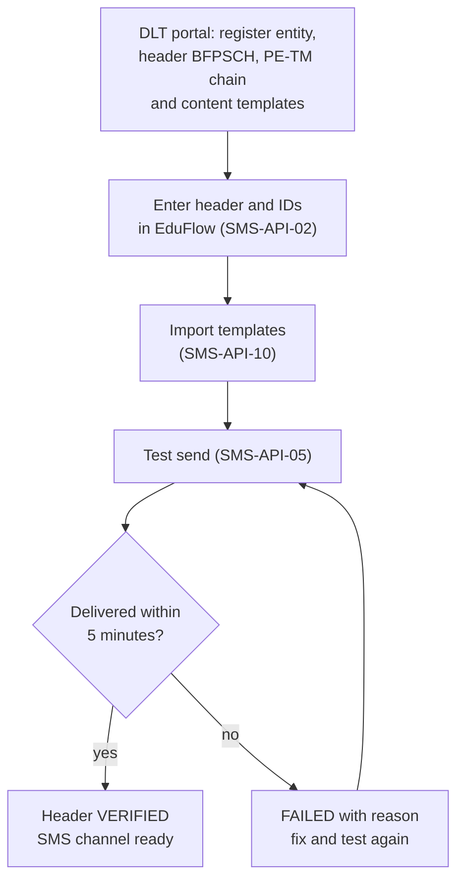
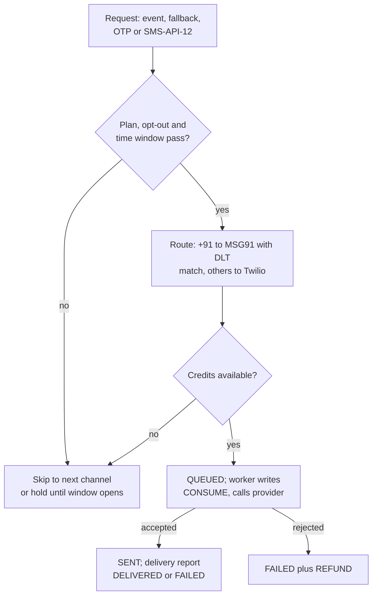
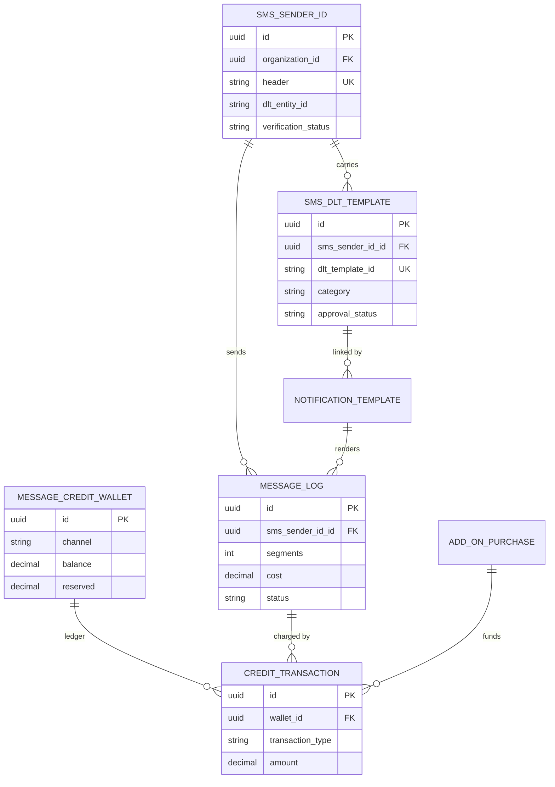

# SMS Module

**In simple words:** SMS reaches every parent, even one with a basic phone and no mobile data. This module sends SMS through MSG91 (India) and Twilio (abroad). It follows India's DLT rules (the telecom registry that approves every sender name and message text), counts SMS parts and credits before sending, and tracks delivery. SMS is also the safety net when WhatsApp fails, and it carries login codes (OTPs).

| Item | Value |
|---|---|
| Module code | SMS |
| Release phase | Phase 2 (V1.0), Days 61 to 120, prompt P-31; the platform OTP sender ships in Phase 1 |
| Plans | Starter: login OTPs only, paid by EduFlow. Growth, Pro, Enterprise: own DLT header and prepaid credits |
| Main users | Organization Admin (setup, wallet), Principal (sending); parents and staff receive |
| Depends on | Notifications, Settings (quiet hours, consent), Organizations (plan, add-ons), Student Profile (guardian phones), WhatsApp (shared wallet design) |
| Main tables | `sms_sender_ids`, `sms_dlt_templates`, `message_credit_wallets`, `credit_transactions` (plus `message_logs`, `webhook_events`, `add_on_purchases`) |

## Objective

1. **Reach.** Every guardian with a valid mobile number gets alerts, with or without internet.
2. **Legal by design.** Every SMS to India uses a registered header and DLT template; EduFlow catches text mismatches before the operator does.
3. **Speed.** OTPs reach MSG91 within 5 seconds (p95); alerts within 60 seconds, outside quiet hours.
4. **Honest cost.** Segments, credits and rupees are shown before every send. One credit = one segment = Rs 0.25.
5. **Safety net.** When WhatsApp fails, SMS takes over within 10 seconds.
6. **Self-service setup.** The EduFlow part of header setup takes under 30 minutes.

## Scope

### In scope

- DLT headers and Twilio senders, with a setup wizard and a test send.
- DLT templates: add, edit, Excel import, text-match check, pause after repeated mismatch.
- Sending by template with a preview of text, encoding, segments and credits.
- The SMS credit wallet: reservations, packs, refunds, expiry, low-balance alerts.
- Delivery reports, failure codes with staff guidance, Twilio STOP replies.
- Fallback and OTP roles, the promotional time window, opt-outs; log, summary and export.

### Out of scope

| Item | Owner |
|---|---|
| Channel choice, fallback order, quiet hours | *Notifications Module* |
| Consent register and notice text | *Settings Module* |
| Selling add-ons and their GST invoices | *Organizations Module* |
| OTP codes, their life and tries | *Authentication and Sessions* |
| Two-way SMS chat, missed-call services | Not planned; WhatsApp covers replies |

### Phase notes

| When | What ships |
|---|---|
| Phase 1, Week 2 (P-07) | Platform sender: EduFlow's own header for OTPs and account messages |
| Phase 2, P-31 (Days 61 to 120) | All tenant features; numbers abroad via the platform Twilio sender, behind a flag |
| Phase 4 | Tenant-owned Twilio senders for UAE, USA and Australia; packs in AED, USD and AUD |

## User Stories

| ID | As a | I want to | So that | Priority |
|---|---|---|---|---|
| SMS-US-01 | Organization Admin | set up our DLT header with a step-by-step wizard | SMS works without calling support | Must |
| SMS-US-02 | Organization Admin | import our approved templates from the DLT portal Excel | 40 templates are copied without typing mistakes | Must |
| SMS-US-03 | Parent with a basic phone | get the absence alert by SMS | I know the same morning | Must |
| SMS-US-04 | Parent | get alerts in Hindi | I understand every word | Must |
| SMS-US-05 | Principal | see segments and credits before a bulk send | no credits are wasted | Must |
| SMS-US-06 | Principal | send an urgent SMS to a whole campus from my phone | parents know about a closure within minutes | Must |
| SMS-US-07 | Organization Admin | buy a 5,000-SMS pack by UPI | messages never stop in admission season | Must |
| SMS-US-08 | Organization Admin | see why an SMS failed and what to do | I fix the cause, not only the symptom | Must |
| SMS-US-09 | Parent | get my login code by SMS when WhatsApp does not work | I can always log in | Must |
| SMS-US-10 | Parent | stop non-essential SMS | my phone is not flooded | Should |
| SMS-US-11 | Organization Admin | have promotional SMS held to 10:00 to 21:00 automatically | we follow TRAI rules | Should |
| SMS-US-12 | Father working in Dubai | get school SMS on my UAE number | I stay informed from abroad | Could |

## Workflow

**Figure: Header setup, from DLT portal to verified sender**



The first box happens on a DLT portal, outside EduFlow; the wizard (SMS-S02) explains it in four short steps. The rest happens in EduFlow.

**Figure: One outbound SMS**



1. **Request.** A *Notifications Module* event, a fallback, a login OTP or SMS-API-12 asks for an SMS.
2. **Checks.** Plan, opt-out and time window (SMS-BR-01, SMS-BR-11, SMS-BR-14).
3. **Route and credits.** MSG91 with a DLT template for India, Twilio elsewhere; segments counted, credits reserved (SMS-BR-07 to SMS-BR-12).
4. **Send and track.** The worker writes `CONSUME` and calls the provider; delivery reports set `DELIVERED` or `FAILED` (SMS-BR-15, SMS-BR-16).

**Message status (`message_logs.status` for SMS)**

| Status | Meaning | Credits |
|---|---|---|
| `QUEUED` | Row written; waiting in the queue, quiet hours or the promotional window | Reserved or checked |
| `SENT` | Provider accepted the message | Consumed |
| `DELIVERED` | Operator confirmed delivery to the handset | Consumed |
| `FAILED` | Rejected, undeliverable or expired; `errorCode` says why | Refunded only for refundable codes |

`READ` is never used for SMS, because operators do not report reads.

**DLT template status (`sms_dlt_templates.approvalStatus`)**

| Status | Meaning | Can send |
|---|---|---|
| `PENDING` | Saved in EduFlow; DLT approval not yet confirmed | No |
| `APPROVED` | Approved on the DLT portal | Yes |
| `REJECTED` | Rejected on the DLT portal | No |
| `PAUSED` | Paused by EduFlow after 3 text-mismatch failures in 1 hour | No; fallback channel |
| `DISABLED` | Switched off on the DLT portal or by the admin | No |

`DRAFT` and `NOT_REQUIRED` are not used for SMS. DLT portals have no public API, so the admin confirms status changes by hand or by import. A header's `verificationStatus` moves from `PENDING` (test only) to `VERIFIED` when the test SMS is delivered, or to `FAILED` with a reason.

## Screens and Wireframes

| ID | Screen | Users | Purpose |
|---|---|---|---|
| SMS-S01 | SMS headers | Organization Admin; Principal (view) | Headers, provider, verification, default flag |
| SMS-S02 | Header setup wizard | Organization Admin | Six steps from DLT entity to test send |
| SMS-S03 | DLT templates | Organization Admin; Principal (view) | List, filter, import, pause warnings |
| SMS-S04 | DLT template editor | Organization Admin | Paste text; live DLT and segment check |
| SMS-S05 | Send SMS (web and mobile) | Organization Admin, Principal | Template, audience, values, preview, cost |
| SMS-S06 | SMS log and message detail | Organization Admin; Principal (campus) | Delivery status, failure help, resend |
| SMS-S07 | SMS wallet | Organization Admin; Principal (view) | Balance, reserved, packs, ledger, threshold |
| SMS-S08 | SMS summary | Organization Admin, Principal | Sent, delivered, failed, credits by day and campus |

**Screen SMS-S02 — Header setup wizard (Organization Admin, web)**

```text
+--------------------------------------------------------------------------+
| EduFlow | Bright Future Public School       [Search...]           (RS) v |
+------------+-------------------------------------------------------------+
| Dashboard  | Settings > SMS > Set up SMS header          Step 5 of 6     |
| Students   | (1) DLT entity  (2) Header  (3) PE-TM chain  (4) Templates  |
| Fees       | [5] Enter in EduFlow   (6) Test send                        |
| Messages < |-------------------------------------------------------------|
|  WhatsApp  | Provider        (o) MSG91 (India)  ( ) Twilio (abroad)      |
|  SMS       | Header (6 letters)      [BFPSCH________]                    |
|  Email     | DLT entity ID (PE ID)   [1201168839205714462]  19 digits    |
| Settings   | Telemarketer ID         [1302157225275643280]  prefilled    |
|            | Country                 [India (IN) v]                      |
|            | [x] Make this the default header for India                  |
|            |-------------------------------------------------------------|
|            | Before you save, confirm on your DLT portal:                |
|            | [x] The header BFPSCH shows "Approved"                      |
|            | [x] MSG91 is added to your PE-TM chain                      |
|            | [ ] At least one content template is approved               |
|            |                              [Back]  [Save and continue]    |
+------------+-------------------------------------------------------------+
```

- Steps 1 to 4 are text guides: documents the DLT portal asks for (PAN, registration certificate, authorisation letter) and ready template texts to copy.
- The telemarketer ID is prefilled from platform configuration; IDs shown are examples.
- [Save and continue] calls SMS-API-02; step 6 calls SMS-API-05. The wizard resumes later, as DLT approval often takes 2 to 7 days (Assumption).

**Screen SMS-S03 — DLT templates (Organization Admin, web)**

```text
+--------------------------------------------------------------------------+
| EduFlow | Bright Future Public School       [Search...]           (RS) v |
+------------+-------------------------------------------------------------+
| Messages < | SMS > DLT templates     Header [BFPSCH v]  Status [All v]   |
|  WhatsApp  |                         [Import DLT Excel]  [+ Add template]|
|  SMS       |-------------------------------------------------------------|
|  Headers   | Name              Lang Category   Seg Status    Used by     |
|  Templates | Absent alert      en   Service-I  1   APPROVED  attendance  |
|  Send      | Absent alert      hi   Service-I  3   APPROVED  attendance  |
|  Log       | Fee due reminder  en   Service-I  2   APPROVED  fees (3)    |
|  Wallet    | Receipt issued    en   Service-I  1   APPROVED  payments    |
|            | School closed     en   Service-I  1   APPROVED  -           |
|            | Exam date sheet   en   Service-E  2   PENDING   -           |
|            | Holiday notice    en   Service-I  1   PAUSED    batches     |
|            |-------------------------------------------------------------|
|            | Holiday notice PAUSED: 3 text mismatches in 1 hour.         |
|            | [Compare with DLT text]                                     |
|            | 7 templates | 5 approved | 1 pending | 1 paused             |
+------------+-------------------------------------------------------------+
```

- The list comes from SMS-API-06. "Seg" uses sample values; SMS-S04 also shows the worst case (`worstCaseSegments`). "Used by" counts linked notification templates.
- [Import DLT Excel] calls SMS-API-10; [+ Add template] opens SMS-S04 (SMS-API-07).
- [Compare with DLT text] opens a side-by-side view; saving the fix calls SMS-API-08 and sets `APPROVED` again.

**Screen SMS-S05 — Send SMS (Principal, web)**

```text
+--------------------------------------------------------------------------+
| EduFlow | Bright Future Public School       [Search...]           (AV) v |
+------------+-------------------------------------------------------------+
| Messages < | SMS > Send SMS                                              |
|  SMS       | Template  [School closed (en) - BFPSCH           v]         |
|   Send     | Audience  [Main Campus - all parents v]  1,150 guardians    |
|   Log      | Value 1   [15 Jul 2027___]   Value 2 [heavy rain______]     |
|   Wallet   | Value 3   [16 Jul 2027___]   Tokens: @studentName ...       |
|            |-------------------------------------------------------------|
|            | Preview for Sunita Devi (Aarav Sharma, 10-A):               |
|            | Dear Parent, the school will remain closed on 15 Jul 2027   |
|            | due to heavy rain. Classes resume on 16 Jul 2027.           |
|            | - Bright Future Public School                               |
|            | [ok] Matches DLT text    GSM    137 chars    1 segment      |
|            |-------------------------------------------------------------|
|            | Skipped: 8 opted out.        Sending to 1,142 guardians     |
|            | Credits 1,142  |  Available 4,210  |  Cost Rs 285.50        |
|            | Service-Implicit: quiet hours 21:00-07:00 apply             |
|            |                           [Cancel]  [Send 1,142 SMS]        |
+------------+-------------------------------------------------------------+
```

- Every change calls SMS-API-13 (debounced 400 ms). The dropdown lists only `APPROVED` templates of `VERIFIED` headers.
- [Send 1,142 SMS] calls SMS-API-12; it is disabled while the text does not match or credits are short.

**Screen SMS-S05 — Send SMS (Principal, mobile)**

```text
+------------------------------------+
| <  Send SMS                BFPSCH  |
+------------------------------------+
| Template                           |
| [School closed (en)             v] |
| Audience                           |
| [Main Campus - all parents      v] |
| 1,150 guardians, 8 opted out       |
| Date closed  [15 Jul 2027        ] |
| Reason       [heavy rain         ] |
| Reopens on   [16 Jul 2027        ] |
|------------------------------------|
| Dear Parent, the school will       |
| remain closed on 15 Jul 2027 due   |
| to heavy rain. Classes resume on   |
| 16 Jul 2027. - Bright Future ...   |
| [ok] DLT match   GSM   1 segment   |
|------------------------------------|
| Credits 1,142 (Rs 285.50)          |
| Available 4,210 credits            |
| [        Send 1,142 SMS         ]  |
+------------------------------------+
```

- Same APIs as the web screen; value fields show labels saved with the template. The send button asks for one confirmation tap.

**Screen SMS-S06 — SMS log and message detail (Organization Admin, web)**

```text
+--------------------------------------------------------------------------+
| EduFlow | Bright Future Public School       [Search...]           (RS) v |
+------------+-------------------------------------------------------------+
| Messages < | SMS > Log  Date [15 Jul 2027 v] Status [All v]  [Export]    |
|  SMS       |-------------------------------------------------------------|
|   Send     | Time   To             Template       Seg Status  Error      |
|   Log      | 07:00  +9198xxxx3210  School closed  1   DELIVD  -          |
|   Wallet   | 07:00  +9194xxxx1187  School closed  1   FAILED  INVALID_N..|
|            | 07:00  +9170xxxx5521  School closed  1   FAILED  ABSENT_SU..|
|            | 07:01  +9199xxxx0034  School closed  1   SENT    -          |
|            |-------------------------------------------------------------|
|            | Message detail  +9194xxxx1187  Father of Rohan Verma        |
|            | Error INVALID_NUMBER   MSG91 report: "Invalid Number"       |
|            | Credits: 1 used, 1 refunded                                 |
|            | What to do: correct the number in Student Profile,          |
|            | then press Resend. A resend is a new message.               |
|            | Queued 07:00:02  Sent 07:00:04  Failed 07:00:39             |
|            |                            [Open student]  [Resend]         |
+------------+-------------------------------------------------------------+
```

- The list comes from SMS-API-11; [Export] calls SMS-API-21. The detail shows the "What to do" text of SMS-BR-16.
- [Resend] calls NTF-API-29 and shows only on `FAILED` rows.

## UI Components

| Component | Type | Behaviour |
|---|---|---|
| `SenderSetupWizard` | Stepper | Saves each step; step 6 polls the test result every 5 s |
| `DltTextCompare` | Side-by-side diff | Marks the first differing character, spaces included |
| `SegmentMeter` | Badge | "GSM 137 / 1 segment"; amber for Unicode, naming the character that forced it |
| `VariableSlots` | Form fields | One per `{#var#}`; text or merge token; 30-character counter |
| `CreditCostBar` | Summary bar | Credits, available, rupees; red "Short by 312 credits" |
| `DeliveryStatusBadge` | Badge | `QUEUED` grey, `SENT` blue, `DELIVERED` green, `FAILED` red |
| `FailureHelpSheet` | Side sheet | Error code, provider text, credits back, what to do |
| `SmsWalletCard` | Card | Balance, reserved, available, [Buy 5,000 SMS], threshold |

States: table skeletons while loading; empty SMS-S01 says "No SMS header yet." with [Set up SMS]; errors show the message, `requestId` and [Try again].

## Validation Rules

| Field | Rule | Error message shown to user |
|---|---|---|
| `header` (MSG91) | 6 letters, or 6 digits for promotional; unique in the organization | "An SMS header has exactly 6 letters, for example BFPSCH." |
| `header` (Twilio) | E.164 number, or 3 to 11 letters and digits | "Enter a number like +971501234567 or a name of 3 to 11 characters." |
| `dltEntityId` | Required for MSG91; 19 digits | "The DLT entity ID has 19 digits. Copy it from your DLT portal." |
| `dltTemplateId` | 19 digits; unique in the organization | "This DLT template ID is already saved as Absent alert (en)." |
| `bodyText` | 1 to 2,000 characters; only `{#var#}` placeholders, at most 10 | "Use {#var#} for each changing value, at most 10 times." |
| `bodyText` size | Fits 6 segments with every variable at 30 characters | "This text can be at most 6 SMS parts. Please shorten it." |
| `category` | `PROMOTIONAL` needs a numeric header; others a letter header | "Promotional templates need a numeric header." |
| Send `values` | Count equals `variableCount`; each 1 to 30 characters after merging | "Value 2 is 34 characters long. DLT allows 30." |
| Rendered text | Matches the DLT text (SMS-BR-05) | "The SMS text must match the registered DLT text exactly." |
| Recipients | 1 to 5,000 unique numbers | "Send to between 1 and 5,000 people at a time." |
| Test phone | `+91` and 10 digits starting 6 to 9 | "Enter a 10-digit Indian mobile number." |
| Import file | `.xlsx` or `.csv`, up to 5 MB, 1,000 rows, required columns | "The file needs the columns Template ID, Template Name, Content, Category, Header and Status." |

> **Note:** DLT formats (19-digit IDs, 6-character headers, numeric promotional headers) are based on public information as of September 2026. Verify them with MSG91 before launch.

## Business Rules

### Setup and compliance

**SMS-BR-01 — Plan gate.** Tenant SMS needs the plan feature `sms_sending` (Growth and higher; trials have Pro features) and an organization that is not `RESTRICTED`. On Starter, SMS-API-02, 07, 10, 12 and 17 answer `403 PLAN_LIMIT_REACHED` and the *Notifications Module* skips SMS. After a downgrade, headers and templates are hidden, never deleted. Login OTPs work on every plan (SMS-BR-13).

**SMS-BR-02 — The DLT chain (India).** TRAI's TCCCPR 2018 (Telecom Commercial Communications Customer Preference Regulations) require four registrations for every business SMS to an Indian number:

| Item | Who registers it | Stored in | Example |
|---|---|---|---|
| Principal Entity (PE) ID | The institute, on a DLT portal (Jio, Airtel, Vi or BSNL) | `dltEntityId` | 1201168839205714462 |
| Header (sender ID) | The institute, under its PE | `header` | BFPSCH, SHRMCL |
| PE-TM chain | The institute adds MSG91 as telemarketer | `dltTelemarketerId` | 1302157225275643280 |
| Content template | The institute, under one header | `sms_dlt_templates` | 1207168839211045317 |

Operators "scrub" (check) each SMS against these records and drop any mismatch. EduFlow is never the PE for tenant messages, because DLT ties a text to the business that registered it. So, unlike WhatsApp, there is no shared sender for tenant alerts. The SMS channel is ready only with an `ACTIVE`, `VERIFIED` header that has at least one `APPROVED` template.

**SMS-BR-03 — Headers.** Headers belong to the whole organization. The service keeps one `isDefault` header per `countryCode`. A new header is `PENDING` and may only send the test; changing `header`, `dltEntityId` or `dltTelemarketerId` sets `PENDING` again. A message always uses the header of its DLT template.

**SMS-BR-04 — Template categories.** DND (Do Not Disturb) is TRAI's register of people who refuse promotional messages.

| Category | Use at a school or institute | Consent in EduFlow | Time window | DND numbers |
|---|---|---|---|---|
| `TRANSACTIONAL` | Bank OTPs; not for tenants | Not used | Any time | Delivered |
| `SERVICE_IMPLICIT` | Absence, fee due, receipt, exam date, closure | None; opt-out respected | Quiet hours | Delivered |
| `SERVICE_EXPLICIT` | Beyond the running service, for example a new course | `COMMUNICATION_SMS` `GRANTED` | Quiet hours | Delivered |
| `PROMOTIONAL` | Admissions open, demo class offers | `COMMUNICATION_SMS`, purpose `PROMOTIONAL` | 10:00 to 21:00 IST | Blocked |

**SMS-BR-05 — Exact text.** Before a row is queued, the rendered SMS must match the registered text: fixed parts character by character (spaces and punctuation too), each `{#var#}` 1 to 30 characters. Automatic events cut long values to 27 characters plus "..." (NTF-BR-08); manual sends refuse them, so staff can shorten. A link must be fixed text on the institute's `eduflow.app` subdomain, whitelisted on the DLT portal; only its final token may be a variable (Assumption: verify with the operator).

```typescript
// server/src/modules/sms/dlt-match.ts
import { AppError } from '../../lib/errors';

const VAR = '{#var#}';
const escapeRe = (s: string) => s.replace(/[.*+?^${}()|[\]\\]/g, '\\$&');

export function buildDltMatcher(bodyText: string): RegExp {
  const parts = bodyText.split(VAR).map(escapeRe);
  return new RegExp(`^${parts.join('([\\s\\S]{1,30})')}$`, 'u');
}

export function renderDlt(bodyText: string, values: string[]): string {
  const parts = bodyText.split(VAR);
  if (values.length !== parts.length - 1) {
    throw new AppError('VALIDATION_ERROR', `This template needs ${parts.length - 1} values.`);
  }
  const text = parts.reduce((out, part, i) => out + (i === 0 ? '' : values[i - 1]) + part, '');
  if (!buildDltMatcher(bodyText).test(text)) {
    const msg = 'The SMS text must match the registered DLT text exactly.';
    throw new AppError('BUSINESS_RULE_VIOLATION', msg);
  }
  return text;
}
```

**SMS-BR-06 — Link to notification templates.** An SMS notification template (NTF-API-02, NTF-API-03) names `smsDltTemplateId` and `smsSenderIdId`. The save is refused unless its body, with each `{{name}}` replaced by `{#var#}`, equals `bodyText`, the languages match and the DLT template belongs to that header.

> **Example:** DLT text "Dear Parent, {#var#} of {#var#} was absent today, {#var#}. Please send a leave note to the class teacher. - Bright Future Public School" matches the `attendance.absent` body "Dear Parent, {{studentName}} of {{batchName}} was absent today, {{date}}. Please send ...".

### Text, segments and cost

**SMS-BR-07 — Encoding and segments.** A long SMS is split into parts (segments) that the phone joins again.

| Encoding | When | One segment | Each part of a longer SMS |
|---|---|---|---|
| GSM-7 | Every character is in the GSM 7-bit set; `^ { } [ ] ~ \| €` count as 2 | 160 | 153 |
| Unicode (UCS-2) | Any other character: Hindi, the rupee sign, curly quotes, emoji | 70 | 67 |

Unicode length counts UTF-16 units: a Devanagari letter or sign is 1, an emoji 2. "नमस्ते" looks like 4 letters but is 6 units. The server sets `isUnicode` from the text. An SMS has at most 6 segments (918 GSM or 402 Unicode units); longer texts belong on WhatsApp.

```typescript
// server/src/modules/sms/segments.ts
const GSM_BASIC =
  '@£$¥èéùìòÇ\nØø\rÅåΔ_ΦΓΛΩΠΨΣΘΞÆæßÉ !"#¤%&\'()*+,-./0123456789:;<=>?' +
  '¡ABCDEFGHIJKLMNOPQRSTUVWXYZÄÖÑܧ¿abcdefghijklmnopqrstuvwxyzäöñüà';
const GSM_EXT = '^{}\\[~]|€';

export interface SegmentInfo {
  encoding: 'GSM7' | 'UCS2';
  units: number;
  segments: number;
}

export function countSegments(text: string): SegmentInfo {
  let units = 0;
  for (const ch of text) {
    if (GSM_BASIC.includes(ch)) units += 1;
    else if (GSM_EXT.includes(ch)) units += 2;
    else {
      const u = text.length; // UTF-16 units
      return { encoding: 'UCS2', units: u, segments: u <= 70 ? 1 : Math.ceil(u / 67) };
    }
  }
  return { encoding: 'GSM7', units, segments: units <= 160 ? 1 : Math.ceil(units / 153) };
}
```

| Rendered text | Encoding | Units | Segments = credits | Cost |
|---|---|---|---|---|
| Absent alert (en), Aarav Sharma, 10-A | GSM-7 | 141 | 1 | Rs 0.25 |
| Fee reminder with "Rs 12,000" and pay link | GSM-7 | 173 | ceil(173 / 153) = 2 | Rs 0.50 |
| Same reminder with "₹12,000" | Unicode | 171 | ceil(171 / 67) = 3 | Rs 0.75 |
| Absent alert (hi), Aarav Sharma | Unicode | 136 | ceil(136 / 67) = 3 | Rs 0.75 |
| Login OTP | GSM-7 | 85 | 1 | Rs 0 to the tenant |

The Hindi DLT text is "प्रिय अभिभावक, {#var#} आज {#var#} को विद्यालय में अनुपस्थित रहे। कृपया कक्षा अध्यापक को सूचित करें। - ब्राइट फ्यूचर पब्लिक स्कूल" (114 fixed units).

> **Tip:** One rupee sign makes a 2-part reminder 3 parts: for 1,150 parents, 3,450 instead of 2,300 credits (Rs 862.50 instead of Rs 575.00). Write "Rs". Cutting 2 units from the Hindi alert makes it 2 segments.

**SMS-BR-08 — Credits and price.** The SMS wallet unit is `MESSAGES`: one credit = one segment to India = Rs 0.25. In `message_logs`, `cost` holds credits and `currency` stays empty; `providerCost` holds the provider's charge. `marginAmount` stays 0 because the wallet is not money; reports compute margin as credits x 0.25 - `providerCost` x `exchangeRate`. Twilio credits per segment = ceil(price x exchange rate x 1.15 / 0.25), from a versioned rate card.

| Country | Provider | Price per segment (Assumption) | Credits per segment |
|---|---|---|---|
| India (IN) | MSG91 | Rs 0.15 | 1 (fixed) |
| UAE (AE) | Twilio | $0.0600 | ceil(0.0600 x 85 x 1.15 / 0.25) = ceil(23.46) = 24 |
| USA (US) | Twilio | $0.0110 with carrier fee | ceil(4.30) = 5 |
| Australia (AU) | Twilio | $0.0520 | ceil(20.33) = 21 |

> **Example:** Aarav's father works in Dubai. The absent alert to his UAE number costs 24 credits = Rs 6.00; on WhatsApp it costs Rs 1.5347 (WA-BR-08), so WhatsApp stays first. At the assumed MSG91 cost, each Indian credit leaves Rs 0.10 gross margin (40%).

**SMS-BR-09 — Wallet, reservation, debit and refund.** Arithmetic is as in WA-BR-10 and WA-BR-11 (`available = balance - reserved`; the CHECK constraint blocks overdraw). SMS specifics:

1. SMS-API-12 reserves the exact total in one `RESERVE` row, key `sms-send-{sendId}-reserve` (`sendId` = the job ID).
2. The worker writes one `CONSUME` per message just before the provider call; the unique key stops a retry from paying twice.
3. Messages skipped after the reservation are never consumed; one `RELEASE` row (`sms-send-{sendId}-release`) returns the rest.
4. A refundable failure (SMS-BR-16) writes one `REFUND` per message. Notices and events work the same way (NTF-BR-11, NTF-BR-12).

> **Example:** Dr. Anita Verma sends the 1-segment closure SMS at 07:00 on 15 Jul 2027. Balance 4,210. Of 1,150 guardians, 8 opted out: 1,142 reserved (available 3,068). Four more opt out before their chunk: 1,138 `CONSUME`, `RELEASE` 4. Reports: 1,112 delivered, 20 `INVALID_NUMBER` (refunded), 6 `ABSENT_SUBSCRIBER` (not refunded). Final balance = 4,210 - 1,138 + 20 = **3,092 credits**.

**SMS-BR-10 — Packs, expiry and alerts.** Pack `SMS_5000` costs Rs 1,250 + 18% GST (Rs 225) = Rs 1,475 and adds 5,000 credits; the payment webhook writes exactly one `PURCHASE` row (ORG-BR-17). No packs during a trial; a trial gets a `BONUS` of 100 credits (Assumption). Packs expire 12 months after purchase, oldest first (`creditsRemaining`). Below `lowBalanceThreshold` (500 when empty), `sms.wallet.low_balance` fires at most once per 24 hours. Below 1 credit, `sms.wallet.exhausted` fires and new SMS skip with `CREDITS_EXHAUSTED`.

> **Example:** Two 5,000 packs, bought 1 Aug 2027 and 1 Mar 2028. By 1 Aug 2028, 4,380 credits of the first are spent, so one `EXPIRY` row of -620 is written.

### Sending and delivery

**SMS-BR-11 — Time windows.**

1. Service SMS follow quiet hours (SET-BR-04: 21:00 to 07:00, campus timezone; `ACCOUNT`, `SYSTEM` and `TRANSPORT` bypass). Held rows stay `QUEUED` with a delayed job.
2. Promotional SMS go only from 10:00 to 21:00 IST (TRAI rule), even with quiet hours off. SMS-API-12 accepts and returns `holdUntil`; the worker re-checks before each chunk.
3. Promotional templates never go to `STUDENT` recipients (DPDP Act 2023: no targeted promotion to children).

> **Example:** Sharma Classes sends a demo-class offer at 21:30 on 3 Jul 2027. Wait = (600 - 1290 + 1440) mod 1440 = 750 minutes, so it goes at 10:00 on 4 Jul.

**SMS-BR-12 — Routing.** The country comes from the E.164 phone (libphonenumber-js) and is stored in `recipientCountryCode`. `IN` goes to MSG91 with the tenant header. Other countries go to Twilio: the tenant's `VERIFIED` `TWILIO` sender for that country (Phase 4), else EduFlow's platform Twilio sender (Assumption). Twilio uses the notification template body; DLT does not apply. A country missing from the rate card is skipped with `COUNTRY_NOT_SUPPORTED`.

**SMS-BR-13 — OTP channel and fallback.**

- **OTP.** `auth.otp.requested` uses EduFlow's own header and DLT template "Your EduFlow code is {#var#}. It is valid for 10 minutes. Do not share it with anyone." The row has `isBillable = false`, cost 0 and a masked code. It works on every plan and ignores quiet hours and opt-outs, because the user asked for it. *Authentication and Sessions* sets the OTP channel order; SMS serves when WhatsApp is not possible and on "Send by SMS".
- **Fallback.** Default `communication.channel_order` is WhatsApp, SMS, email. When NTF-BR-14 re-runs channel choice, SMS is picked if the tenant's SMS channel is ready, an `APPROVED` DLT template is linked for that event and language, and credits are available.

> **Example:** Aarav's absence alert: WhatsApp `FAILED` (131026) at 09:35:06; SMS `QUEUED` 09:35:07, `DELIVERED` 09:35:15; 1 credit.

**SMS-BR-14 — Opt-out.** Each opt-out fires `sms.opted_out` once; jobs re-check just before sending. `ACCOUNT` cannot be switched off (PP-BR-10).

| Way | What is recorded | Effect |
|---|---|---|
| Parent switches a category off (PP-S14, NTF-API-24) | `notification_preferences` row for `SMS` | That category skips SMS |
| Parent asks the school | Staff record `COMMUNICATION_SMS` as withdrawn (SET-API-26, SET-API-28) | All tenant SMS stop; OTPs continue |
| STOP to a Twilio number | SMS-API-19 withdraws `COMMUNICATION_SMS` | Same; Twilio also blocks the number |
| DND registration (India) | Nothing in EduFlow | Operators block promotional SMS |

**SMS-BR-15 — Delivery reports.**

1. The MSG91 worker sends up to 100 messages per call, grouped by template and encoding; `providerMessageId` = `{requestId}:{mobile}`. Twilio gets one call per message (Message SID).
2. SMS-API-18 and SMS-API-19 store a `webhook_events` row and answer 200 within 2 seconds. Event IDs `{requestId}:{mobile}:{status}` and `{MessageSid}:{MessageStatus}` make replays harmless.
3. Status only moves forward (NTF-BR-15). A row still `SENT` after 48 hours becomes `FAILED` (`EXPIRED_UNDELIVERED`). Provider outages retry 5 times (NTF-BR-13), then `PROVIDER_ERROR` and fallback.
4. MSG91 signs nothing, so its report URL carries a secret token (constant-time check) plus an IP allowlist (Assumption). Twilio requests must pass `X-Twilio-Signature` (HMAC-SHA1).

**SMS-BR-16 — Failure codes and what staff should do.** Three `DLT_TEMPLATE_MISMATCH` failures of one template within 1 hour set it `PAUSED` and alert Organization Admins in-app.

| Code | Meaning | Provider signal (example) | Credits back | What staff should do |
|---|---|---|---|---|
| `DLT_TEMPLATE_MISMATCH` | Text differs from the registered text | MSG91 scrubbing reject | Yes | Compare on SMS-S03; fix spaces or punctuation |
| `DLT_TEMPLATE_INACTIVE` | Template not approved on DLT | MSG91 template error | Yes | Check the portal; link another template |
| `SENDER_NOT_REGISTERED` | Header inactive, chain missing, US number unregistered | MSG91 header error; Twilio 30034 | Yes | Check header and PE-TM chain; test again |
| `INVALID_NUMBER` | Number does not exist | MSG91 "Invalid Number"; Twilio 21211 | Yes | Correct the phone; resend |
| `DND_BLOCKED` | Promotional SMS to a DND number | MSG91 NDNC | Yes | Nothing |
| `OPERATOR_REJECTED` | Content refused, for example an unlisted link | MSG91 "Rejected"; Twilio 30007 | Yes | Whitelist the link; send the log ID to support |
| `ABSENT_SUBSCRIBER` | Phone off until expiry | MSG91 "Failed"; Twilio 30003 | No | Call the parent |
| `EXPIRED_UNDELIVERED` | No final report in 48 hours | None | No | Ask whether school SMS are blocked |
| `OPTED_OUT` | Parent opted out | Twilio 21610; EduFlow check | Never charged | Use another channel |
| `PROVIDER_ERROR` | Provider down after 5 tries | Timeout, HTTP 5xx | Yes | Nothing; fallback already ran |
| `CREDITS_EXHAUSTED` | Wallet empty | EduFlow check | Never charged | Buy a pack (SMS-S07) |

> **Note:** The provider column is a planning map, confirmed against MSG91's delivery-report codes in P-31 (`server/src/modules/sms/status-map.ts`).

**SMS-BR-17 — DLT import (SMS-API-10).** Creates an `import_jobs` row (`importType = OTHER`, `options` `{ "kind": "SMS_DLT_TEMPLATES" }`). Columns map Template ID, Template Name, Content, Category ("Service Implicit" to `SERVICE_IMPLICIT`), Header (an existing header) and Status. Unicode text gets `language = hi` unless a Language column says otherwise. Rows upsert by `dltTemplateId`, restoring soft-deleted ones. Row errors: `HEADER_NOT_FOUND`, `DUPLICATE_TEMPLATE_ID`, `BAD_PLACEHOLDER`, `UNKNOWN_CATEGORY`.

> **Example:** Bright Future uploads 42 rows: 38 created, 2 updated, 2 failed with `HEADER_NOT_FOUND` (typo BFPSCT).

**SMS-BR-18 — Privacy and retention.** Phones show masked (`+9198xxxx3210`) without `sms.send`; OTP values are masked. Texts are cleared after `privacy.retention_message_body_days` (365); rows and cost stay. A Principal sees only her campuses' rows.

## Acceptance Criteria

| ID | Given | When | Then |
|---|---|---|---|
| SMS-AC-01 | BFPSCH has one `APPROVED` template | The test SMS is delivered within 5 minutes | Header `VERIFIED`; `sms.sender.verified` fires once |
| SMS-AC-02 | Sharma Classes is on Starter | Any SMS setup or send call | `403 PLAN_LIMIT_REACHED`; no row written |
| SMS-AC-03 | A linked text has a double space where DLT has one | A send is requested | `422` text-mismatch message; nothing reserved |
| SMS-AC-04 | Value 2 has 34 characters in a manual send | Preview or send | `400` "Value 2 is 34 characters long. DLT allows 30." |
| SMS-AC-05 | The Hindi absent alert for Aarav | Preview runs | `UCS2`, 136 units, 3 segments, 3 credits |
| SMS-AC-06 | Balance 4,210; 1,142 eligible guardians | The closure SMS is sent | One `RESERVE` of 1,142; final balance as in SMS-BR-09 |
| SMS-AC-07 | Available 830 credits | A send needing 1,142 is requested | `422` "Short by 312 credits"; nothing reserved |
| SMS-AC-08 | A `SENT` SMS | The `INVALID_NUMBER` report arrives 3 times | `FAILED`; exactly one `REFUND` row |
| SMS-AC-09 | A promotional template | Sent at 21:30 IST | Success with `holdUntil` 10:00 next day; rows stay `QUEUED` |
| SMS-AC-10 | WhatsApp fails with 131026 for an absence alert | The failure webhook arrives | An SMS row is `QUEUED` within 10 seconds |
| SMS-AC-11 | Sunita Devi switched off SMS for `FEES` | A fee reminder is due | No SMS row for her; skip reason `OPTED_OUT` |
| SMS-AC-12 | Wallet has 0 credits | A parent asks for a login code | OTP sent from the platform header; wallet unchanged |
| SMS-AC-13 | A template gets 3 mismatch failures in 40 minutes | The third report arrives | Template `PAUSED`; admins alerted; next events use fallback |
| SMS-AC-14 | A top-up request | Sent twice with one `Idempotency-Key`; payment webhook replayed | One add-on, one checkout, one `PURCHASE` of 5,000 |

## Edge Cases

| Case | What happens | How the system handles it |
|---|---|---|
| Mother and father share one phone | Two recipients, one number | One SMS per phone per send; duplicates dropped before pricing |
| Report arrives before the send call returns | No row has the `providerMessageId` yet | The webhook job retries with backoff until the row exists |
| DLT text edited in EduFlow, not on the portal | Every SMS is scrubbed out | `DLT_TEMPLATE_MISMATCH`, refunds, pause after 3 |
| Header deleted, then added again | Unique key still holds the old row | SMS-API-02 restores it as `PENDING` |
| A Hindi name inside an English template | The whole SMS becomes Unicode | Preview shows extra segments; the reservation uses the real count |
| MSG91 down for 20 minutes | Calls time out | Retries at 30 s, 1, 2, 4 min; then `PROVIDER_ERROR`, refund, fallback |
| Pack expires while a send is reserved | `EXPIRY` would cut reserved credits | Expiry skips the reserved part until the next daily run |
| Plan downgraded to Starter with SMS queued | Feature gone | The worker re-checks; rows fail with `PLAN_FEATURE`, credits released |
| Guardian changes the phone number | Opt-out was set on the old number | Opt-out follows the guardian record, not the number |

## Database Schema

| Table | Purpose | Owner |
|---|---|---|
| `sms_sender_ids` | DLT headers and Twilio senders with registration IDs and verification | This module |
| `sms_dlt_templates` | Registered DLT texts with category, language and status | This module |
| `message_credit_wallets` | One wallet per paid channel; the SMS row has unit `MESSAGES` | This module and *WhatsApp Module* |
| `credit_transactions` | Append-only wallet ledger | This module and *WhatsApp Module* |
| `message_logs`, `webhook_events` | Message log; raw provider webhooks | *Notifications Module*, *Payments Module* |
| `add_on_purchases`, `import_jobs`, `export_jobs` | Packs; DLT import runs; log exports | *Organizations Module*, platform |

Every table has `id` (uuid PK), `organization_id` (FK `organizations`) and `created_at`. They are not repeated below.

### Table sms_sender_ids

| Column | Type | Null | Default | Notes |
|---|---|---|---|---|
| `provider` | `MessageProvider` | No | `MSG91` | `MSG91` or `TWILIO` |
| `header` | varchar(20) | No | | 6-character DLT header or Twilio sender |
| `country_code` | char(2) | No | `IN` | |
| `dlt_entity_id` | varchar(30) | Yes | | PE ID; required for MSG91 |
| `dlt_telemarketer_id` | varchar(30) | Yes | | MSG91 in the PE-TM chain |
| `verification_status` | `SenderVerificationStatus` | No | `PENDING` | |
| `is_default` | boolean | No | `false` | One per country (service rule) |
| `status` | `RecordStatus` | No | `ACTIVE` | |
| `updated_at`, `deleted_at` | timestamptz | No, Yes | | Soft delete |

### Table sms_dlt_templates

| Column | Type | Null | Default | Notes |
|---|---|---|---|---|
| `sms_sender_id_id` | uuid | No | | FK `sms_sender_ids`, cascade |
| `dlt_template_id` | varchar(30) | No | | ID from the DLT portal |
| `name` | varchar(120) | No | | |
| `category` | `DltTemplateCategory` | No | | |
| `language` | varchar(10) | No | `en` | |
| `is_unicode` | boolean | No | `false` | Set by the server |
| `body_text` | text | No | | With `{#var#}` placeholders |
| `variable_count` | smallint | No | `0` | |
| `approval_status` | `TemplateApprovalStatus` | No | `PENDING` | |
| `approved_at`, `updated_at`, `deleted_at` | timestamptz | Yes, No, Yes | | |

### SMS values in shared tables

| Column | SMS value |
|---|---|
| `message_credit_wallets.unit` | `MESSAGES`; `currency` null |
| `message_logs.segments`, `cost` | Parts; credits |
| `message_logs.dlt_template_id`, `dlt_entity_id` | Snapshots at send time |
| `message_logs.provider_message_id` | `{requestId}:{mobile}` or Twilio SID |
| `add_on_purchases` | `SMS_CREDITS`, `creditsGranted` 5000 |

Indexes and constraints: unique (`organization_id`, `header`), which also covers soft-deleted rows; unique (`organization_id`, `dlt_template_id`); index (`organization_id`, `sms_sender_id_id`, `approval_status`). Wallet CHECK and ledger unique keys are as in the *WhatsApp Module*. Both SMS tables have RLS on `app.current_org`.

**Figure: SMS tables and their neighbours**



A header carries many DLT templates; notification templates point at them; each SMS log row can have one `CONSUME` and one `REFUND` ledger row.

## Prisma Schema

Copied from `10-communication.prisma`. `Channel` and `RecordStatus` are in `00-base.prisma`; `MessageLog` is in the *Notifications Module*.

```prisma
enum MessageProvider {
  META_WHATSAPP
  MSG91
  TWILIO
  AMAZON_SES
  FCM
  INTERNAL // in-app only
}

enum SenderVerificationStatus {
  PENDING
  VERIFIED
  FAILED
}

// Approval state of a template at the provider (Meta for WhatsApp, DLT for SMS).
enum TemplateApprovalStatus {
  DRAFT
  PENDING
  APPROVED
  REJECTED
  PAUSED
  DISABLED
  NOT_REQUIRED // in-app, push and email templates
}

enum CreditUnit {
  MESSAGES // SMS packs: one credit = one SMS segment
  MONEY // WhatsApp: prepaid money balance, charged per message at Meta cost + margin
}

enum CreditTransactionType {
  PURCHASE
  CONSUME
  REFUND // failed message credited back
  ADJUSTMENT
  EXPIRY
  BONUS
  RESERVE // hold for a queued bulk campaign; moves balance into reserved
  RELEASE // unused part of a reservation returned
}

// TRAI DLT content template category (India).
enum DltTemplateCategory {
  TRANSACTIONAL
  SERVICE_IMPLICIT
  SERVICE_EXPLICIT
  PROMOTIONAL
}

// SMS header (sender id) with the TRAI DLT registration needed in India;
// Twilio numbers for other countries.
model SmsSenderId {
  id                 String                   @id @default(uuid()) @db.Uuid
  organizationId     String                   @map("organization_id") @db.Uuid
  provider           MessageProvider          @default(MSG91)
  // 6-character DLT header, e.g. BFPSCH, or a phone number for Twilio
  header             String                   @db.VarChar(20)
  countryCode        String                   @default("IN") @map("country_code") @db.Char(2)
  // principal entity id on the DLT portal
  dltEntityId        String?                  @map("dlt_entity_id") @db.VarChar(30)
  // telemarketer id of the PE-TM chain (MSG91)
  dltTelemarketerId  String?                  @map("dlt_telemarketer_id") @db.VarChar(30)
  verificationStatus SenderVerificationStatus @default(PENDING) @map("verification_status")
  isDefault          Boolean                  @default(false) @map("is_default")
  status             RecordStatus             @default(ACTIVE)
  createdAt          DateTime                 @default(now()) @map("created_at") @db.Timestamptz(6)
  updatedAt          DateTime                 @updatedAt @map("updated_at") @db.Timestamptz(6)
  deletedAt          DateTime?                @map("deleted_at") @db.Timestamptz(6)

  organization Organization @relation(fields: [organizationId], references: [id], onDelete: Cascade)
  notificationTemplates NotificationTemplate[]
  dltTemplates          SmsDltTemplate[]
  messageLogs           MessageLog[]

  @@unique([organizationId, header])
  @@index([organizationId, status])
  @@map("sms_sender_ids")
}

// DLT content template registered on the TRAI DLT portal under one header:
// exact text, category, language and approval.
model SmsDltTemplate {
  id             String                 @id @default(uuid()) @db.Uuid
  organizationId String                 @map("organization_id") @db.Uuid
  smsSenderIdId  String                 @map("sms_sender_id_id") @db.Uuid
  // id issued by the DLT portal
  dltTemplateId  String                 @map("dlt_template_id") @db.VarChar(30)
  name           String                 @db.VarChar(120)
  category       DltTemplateCategory
  language       String                 @default("en") @db.VarChar(10)
  // Hindi and other non-Latin scripts
  isUnicode      Boolean                @default(false) @map("is_unicode")
  // registered text with {#var#} placeholders; messages are validated against it before sending
  bodyText       String                 @map("body_text") @db.Text
  variableCount  Int                    @default(0) @map("variable_count") @db.SmallInt
  approvalStatus TemplateApprovalStatus @default(PENDING) @map("approval_status")
  approvedAt     DateTime?              @map("approved_at") @db.Timestamptz(6)
  createdAt      DateTime               @default(now()) @map("created_at") @db.Timestamptz(6)
  updatedAt      DateTime               @updatedAt @map("updated_at") @db.Timestamptz(6)
  deletedAt      DateTime?              @map("deleted_at") @db.Timestamptz(6)

  organization Organization @relation(fields: [organizationId], references: [id], onDelete: Cascade)
  smsSenderId SmsSenderId @relation(fields: [smsSenderIdId], references: [id], onDelete: Cascade)
  notificationTemplates NotificationTemplate[]

  @@unique([organizationId, dltTemplateId])
  @@index([organizationId, smsSenderIdId, approvalStatus])
  @@map("sms_dlt_templates")
}

// Prepaid balance of a tenant for one paid channel (WhatsApp or SMS).
// available = balance - reserved.
// SQL migration adds: CHECK (balance >= 0 AND reserved >= 0)
// so concurrent campaigns cannot overdraw the wallet.
model MessageCreditWallet {
  id                   String     @id @default(uuid()) @db.Uuid
  organizationId       String     @map("organization_id") @db.Uuid
  channel              Channel // WHATSAPP or SMS
  unit                 CreditUnit
  // messages or money, by unit; updated in the same transaction as CreditTransaction
  balance              Decimal    @default(0) @db.Decimal(12, 4)
  currency             String?    @db.Char(3) // set when unit is MONEY
  totalPurchased       Decimal    @default(0) @map("total_purchased") @db.Decimal(12, 4)
  // held for queued campaigns (RESERVE / RELEASE rows)
  reserved             Decimal    @default(0) @db.Decimal(12, 4)
  totalConsumed        Decimal    @default(0) @map("total_consumed") @db.Decimal(12, 4)
  totalRefunded        Decimal    @default(0) @map("total_refunded") @db.Decimal(12, 4)
  lowBalanceThreshold  Decimal?   @map("low_balance_threshold") @db.Decimal(12, 4)
  lowBalanceNotifiedAt DateTime?  @map("low_balance_notified_at") @db.Timestamptz(6)
  createdAt            DateTime   @default(now()) @map("created_at") @db.Timestamptz(6)
  updatedAt            DateTime   @updatedAt @map("updated_at") @db.Timestamptz(6)

  organization Organization @relation(fields: [organizationId], references: [id], onDelete: Restrict)
  transactions CreditTransaction[]

  @@unique([organizationId, channel])
  @@index([organizationId, unit])
  @@map("message_credit_wallets")
}

// Ledger row of a credit wallet. Append-only: no updatedAt / deletedAt.
// Duplicates are impossible by design: one CONSUME and one REFUND per MessageLog,
// one PURCHASE per AddOnPurchase (a BullMQ retry or a replayed payment webhook
// hits the unique keys). A manual resend creates a new MessageLog.
model CreditTransaction {
  id              String                @id @default(uuid()) @db.Uuid
  organizationId  String                @map("organization_id") @db.Uuid
  walletId        String                @map("wallet_id") @db.Uuid
  transactionType CreditTransactionType @map("transaction_type")
  unit            CreditUnit // snapshot of the wallet unit
  currency        String?               @db.Char(3) // snapshot when unit is MONEY
  // positive = credit to the wallet, negative = debit
  amount          Decimal               @db.Decimal(12, 4)
  balanceAfter    Decimal               @map("balance_after") @db.Decimal(12, 4)
  // job id / request key for rows without a messageLogId
  idempotencyKey  String?               @map("idempotency_key") @db.VarChar(100)
  messageLogId    String?               @map("message_log_id") @db.Uuid // CONSUME / REFUND rows
  // RESERVE / RELEASE rows of a bulk campaign (no FK)
  announcementId  String?               @map("announcement_id") @db.Uuid
  // PURCHASE rows: the credit pack that was bought
  addOnPurchaseId String?               @map("add_on_purchase_id") @db.Uuid
  description     String?               @db.VarChar(255)
  // User id (audit only, no FK)
  createdById     String?               @map("created_by_id") @db.Uuid
  createdAt       DateTime              @default(now()) @map("created_at") @db.Timestamptz(6)

  organization Organization @relation(fields: [organizationId], references: [id], onDelete: Restrict)
  wallet MessageCreditWallet @relation(fields: [walletId], references: [id], onDelete: Restrict)
  messageLog MessageLog? @relation(fields: [messageLogId], references: [id], onDelete: SetNull)
  addOnPurchase AddOnPurchase? @relation(fields: [addOnPurchaseId], references: [id], onDelete: SetNull)

  // NULL ids never clash: ADJUSTMENT, BONUS, EXPIRY rows are not affected
  @@unique([organizationId, messageLogId, transactionType])
  @@unique([organizationId, addOnPurchaseId, transactionType])
  @@unique([organizationId, idempotencyKey])
  @@index([organizationId, walletId, createdAt])
  @@index([organizationId, transactionType, createdAt])
  @@index([organizationId, announcementId])
  @@map("credit_transactions")
}
```

## API Endpoints

Paths start with `/api/v1`; the tenant comes from the JWT.

| ID | Method | Path | Permission | Purpose |
|---|---|---|---|---|
| SMS-API-01 | GET | `/sms-sender-ids` | sms.view | List headers and sender numbers (dropdown) |
| SMS-API-02 | POST | `/sms-sender-ids` | sms.manage | Add header with DLT entity and telemarketer IDs |
| SMS-API-03 | PATCH | `/sms-sender-ids/:id` | sms.manage | Update header, default flag, status |
| SMS-API-04 | DELETE | `/sms-sender-ids/:id` | sms.manage | Remove header |
| SMS-API-05 | POST | `/sms-sender-ids/:id/verify` | sms.manage | Test send and set verification status |
| SMS-API-06 | GET | `/sms-dlt-templates` | sms.view | List DLT templates (header, status, language) |
| SMS-API-07 | POST | `/sms-dlt-templates` | sms.manage | Register a DLT template ID with exact text |
| SMS-API-08 | PATCH | `/sms-dlt-templates/:id` | sms.manage | Update text, category, approval status |
| SMS-API-09 | DELETE | `/sms-dlt-templates/:id` | sms.manage | Remove DLT template |
| SMS-API-10 | POST | `/sms-dlt-templates/import` | sms.import | Import templates from the DLT portal Excel (job) |
| SMS-API-11 | GET | `/sms-messages` | sms.view | SMS log with delivery reports |
| SMS-API-12 | POST | `/sms-messages` | sms.send | Send by DLT template to recipients; credit check (job) |
| SMS-API-13 | POST | `/sms-messages/preview` | sms.view | DLT text match, Unicode check, segments, cost |
| SMS-API-14 | GET | `/sms-wallet` | sms.view | Balance, reserved, available, packs on offer |
| SMS-API-15 | PATCH | `/sms-wallet` | sms.manage | Set low-balance threshold |
| SMS-API-16 | GET | `/sms-wallet/transactions` | sms.view | Wallet ledger (type, date) |
| SMS-API-17 | POST | `/sms-wallet/top-ups` | sms.manage | Buy an SMS pack; returns checkout (IK) |
| SMS-API-18 | POST | `/webhooks/msg91` | public | MSG91 delivery report receiver |
| SMS-API-19 | POST | `/webhooks/twilio` | public | Twilio status callback and STOP replies |
| SMS-API-20 | GET | `/sms-reports/summary` | sms.view | Sent, delivered, failed, segments and cost |
| SMS-API-21 | POST | `/sms-messages/export` | sms.export | Export the SMS log (job) |

(IK) = `Idempotency-Key` required; (job) = BullMQ worker. All endpoints can answer `401` and `403 FORBIDDEN`. SMS-API-04 and 09 answer `422` while a notification template links the row.

### SMS-API-02 — Add a header

```http
POST /api/v1/sms-sender-ids
Authorization: Bearer <accessToken>
Content-Type: application/json
```

```json
{
  "provider": "MSG91",
  "header": "BFPSCH",
  "countryCode": "IN",
  "dltEntityId": "1201168839205714462",
  "dltTelemarketerId": "1302157225275643280",
  "isDefault": true
}
```

```json
{
  "success": true,
  "data": {
    "id": "5b8d2f41-7c3a-4e19-9a62-0d4e8b1c7f23",
    "provider": "MSG91",
    "header": "BFPSCH",
    "countryCode": "IN",
    "verificationStatus": "PENDING",
    "isDefault": true,
    "status": "ACTIVE",
    "createdAt": "2027-01-12T05:40:11.000Z"
  }
}
```

| Status | Code | When |
|---|---|---|
| 400 | `VALIDATION_ERROR` | Header not 6 characters; entity ID not 19 digits |
| 403 | `PLAN_LIMIT_REACHED` | Starter plan, or the plan's header limit |
| 409 | `CONFLICT` | BFPSCH is already a live header here |

### SMS-API-05 — Test send

Sends the first `APPROVED` template of the header (or the one named) with sample values. The delivery report sets `VERIFIED`; a failure or 5 minutes of silence sets `FAILED`.

```json
{ "phone": "+919876543210", "smsDltTemplateId": "a3c9e1f7-2b4d-4f86-8e0a-6c1d9b3e5f72" }
```

```json
{
  "success": true,
  "data": {
    "smsSenderIdId": "5b8d2f41-7c3a-4e19-9a62-0d4e8b1c7f23",
    "verificationStatus": "PENDING",
    "messageLogId": "7d3f9b15-2e8a-4c6d-a1f0-5b7e9c3d1a28",
    "checkAgainAfterSeconds": 5
  }
}
```

| Status | Code | When |
|---|---|---|
| 422 | `BUSINESS_RULE_VIOLATION` | The header has no `APPROVED` template |
| 429 | `RATE_LIMITED` | More than 5 tests per header per hour |

### SMS-API-07 — Register a DLT template

```json
{
  "smsSenderIdId": "5b8d2f41-7c3a-4e19-9a62-0d4e8b1c7f23",
  "dltTemplateId": "1207168839211045420",
  "name": "School closed",
  "category": "SERVICE_IMPLICIT",
  "language": "en",
  "bodyText": "Dear Parent, the school will remain closed on {#var#} due to {#var#}. Classes resume on {#var#}. - Bright Future Public School",
  "approvalStatus": "APPROVED"
}
```

```json
{
  "success": true,
  "data": {
    "id": "a3c9e1f7-2b4d-4f86-8e0a-6c1d9b3e5f72",
    "dltTemplateId": "1207168839211045420",
    "isUnicode": false,
    "variableCount": 3,
    "worstCaseSegments": 2,
    "approvalStatus": "APPROVED",
    "approvedAt": "2027-01-12T06:02:45.000Z"
  }
}
```

`worstCaseSegments`: 105 fixed + 3 x 30 = 195 units, so 2 segments.

| Status | Code | When |
|---|---|---|
| 400 | `VALIDATION_ERROR` | Wrong placeholder such as `{#name#}`; more than 6 segments |
| 409 | `CONFLICT` | The DLT template ID is already saved |
| 422 | `BUSINESS_RULE_VIOLATION` | `PROMOTIONAL` under a letter header |

### SMS-API-10 — Import from the DLT Excel

The file is uploaded first through the files API; the body names it.

```json
{ "fileId": "f5a7c9e1-3b5d-4f7a-8c0e-2d4f6a8b0c35", "isDryRun": true }
```

```json
{
  "success": true,
  "data": {
    "importJobId": "2d7e9f1a-3c5b-4d8e-a0f2-6b8c1e3d5a97",
    "status": "QUEUED",
    "isDryRun": true
  }
}
```

| Status | Code | When |
|---|---|---|
| 400 | `VALIDATION_ERROR` | Not `.xlsx` or `.csv`; over 5 MB; required columns missing |
| 403 | `PLAN_LIMIT_REACHED` | Starter plan |

### SMS-API-13 — Preview

```json
{
  "smsDltTemplateId": "a3c9e1f7-2b4d-4f86-8e0a-6c1d9b3e5f72",
  "audience": "PARENTS",
  "audienceFilter": { "campusId": "c2f8a4e6-1d3b-4c5a-9e7f-8b0d2a4c6e19" },
  "values": ["15 Jul 2027", "heavy rain", "16 Jul 2027"]
}
```

```json
{
  "success": true,
  "data": {
    "sampleText": "Dear Parent, the school will remain closed on 15 Jul 2027 due to ...",
    "matchesDlt": true,
    "encoding": "GSM7",
    "units": 137,
    "segmentsPerMessage": 1,
    "recipients": 1150,
    "skipped": { "OPTED_OUT": 8 },
    "eligible": 1142,
    "creditsNeeded": 1142,
    "costInr": "285.50",
    "available": 4210,
    "holdUntil": null,
    "warnings": []
  }
}
```

| Status | Code | When |
|---|---|---|
| 400 | `VALIDATION_ERROR` | Wrong number of values; a value over 30 characters |
| 404 | `NOT_FOUND` | Template of another tenant or deleted |

### SMS-API-12 — Send

Same body as SMS-API-13. The API checks everything again, writes the `RESERVE` row and the `QUEUED` log rows, and adds one job.

```json
{
  "success": true,
  "data": {
    "sendId": "9b2d4f6a-8c0e-4a1c-b3d5-7e9f1a3c5e80",
    "queued": 1142,
    "skipped": { "OPTED_OUT": 8 },
    "creditsReserved": 1142,
    "availableAfter": 3068,
    "holdUntil": null
  }
}
```

| Status | Code | When |
|---|---|---|
| 403 | `PLAN_LIMIT_REACHED` | Starter plan or `RESTRICTED` organization |
| 403 | `FORBIDDEN` | A Principal targets a campus outside her scope |
| 422 | `BUSINESS_RULE_VIOLATION` | Text mismatch; template not `APPROVED`; "Short by 312 credits" |
| 429 | `RATE_LIMITED` | More than 20 sends per user per hour |

### SMS-API-17 — Buy a pack

```http
POST /api/v1/sms-wallet/top-ups
Authorization: Bearer <accessToken>
Idempotency-Key: 5c2e8a1f-topup-sms5000-20270720
Content-Type: application/json
```

```json
{ "packCode": "SMS_5000" }
```

```json
{
  "success": true,
  "data": {
    "addOnPurchase": {
      "id": "6a8c0e2f-4b6d-4f81-9c3e-5a7b9d1f3e26",
      "addOnType": "SMS_CREDITS",
      "status": "PENDING",
      "totalAmount": "1250.00",
      "taxAmount": "225.00",
      "creditsGranted": "5000.0000",
      "currency": "INR"
    },
    "checkout": {
      "gateway": "RAZORPAY",
      "orderId": "order_R4mT2wQx8LpZ3c",
      "amountInSmallestUnit": 147500
    }
  }
}
```

| Status | Code | When |
|---|---|---|
| 400 | `VALIDATION_ERROR` | Unknown `packCode`; `Idempotency-Key` missing |
| 403 | `PLAN_LIMIT_REACHED` | Starter plan or trial |
| 409 | `CONFLICT` | Same key with a different body |

### SMS-API-18 — MSG91 delivery report

The URL set in the MSG91 panel carries the secret token (SMS-BR-15). Payload shape per MSG91's push report (Assumption: confirm in P-31).

```http
POST /api/v1/webhooks/msg91?token=<MSG91_WEBHOOK_TOKEN>
Content-Type: application/json
```

```json
{
  "data": [{
    "requestId": "3567686a6c6f313233343536",
    "senderId": "BFPSCH",
    "report": [
      {
        "date": "2027-07-15 07:00:39",
        "number": "919412341187",
        "status": "2",
        "desc": "Invalid Number"
      }
    ]
  }]
}
```

```json
{ "success": true, "data": { "received": true, "events": 1 } }
```

| Status | Code | When |
|---|---|---|
| 401 | `UNAUTHENTICATED` | Token missing or wrong; stored as `IGNORED` |
| 503 | `SERVICE_UNAVAILABLE` | Database down; MSG91 retries later |

**SMS-API-19 — Twilio.** Form fields: status callbacks carry `MessageSid`, `MessageStatus` and `ErrorCode`; an inbound STOP carries `From` and `OptOutType=STOP` (SMS-BR-14). A bad `X-Twilio-Signature` answers `401`.

## Permissions

Copied from the permission registry.

| Permission key | SUPER_ADMIN | ORG_ADMIN | PRINCIPAL | TEACHER | ACCOUNTANT | PARENT | STUDENT |
|---|---|---|---|---|---|---|---|
| `sms.view` | Yes | Yes | Campus | No | No | No | No |
| `sms.manage` | Yes | Yes | No | No | No | No | No |
| `sms.send` | No | Yes | Campus | No | No | No | No |
| `sms.import` | Yes | Yes | No | No | No | No | No |
| `sms.export` | No | Yes | No | No | No | No | No |

- SUPER_ADMIN uses `sms.manage` and `sms.import` only in audited impersonation, to help with DLT setup.
- Teachers and accountants send no ad-hoc SMS; their alerts reach SMS through the *Notifications Module* (`attendance.mark`, `fees.remind`).

## Notifications and Events

| Event | Trigger | Channel | Recipient | Template text |
|---|---|---|---|---|
| `sms.sender.verified` | Test delivered | In-app | Organization Admins | "SMS header BFPSCH is verified." |
| `sms.sender.failed` | Test failed or silent for 5 minutes | In-app, Email | Organization Admins | "BFPSCH test failed: {{reason}}." |
| `sms.dlt_template.approved` | Status `APPROVED` (edit or import) | In-app | Organization Admins | "DLT template School closed (en) is approved." |
| `sms.dlt_template.rejected` | Status `REJECTED` | In-app, Email | Organization Admins | "DLT template Exam date sheet was rejected." |
| `sms.opted_out` | Preference off, consent withdrawn, STOP | None (audit) | — | — |
| `sms.wallet.topped_up` | `PURCHASE` row | In-app, Email | Organization Admins | "5,000 SMS credits added. Balance: 8,092." |
| `sms.wallet.low_balance` | SMS-BR-10 | In-app, Email, WhatsApp | Organization Admins | "SMS credits low: 480 left." |
| `sms.wallet.exhausted` | SMS-BR-10 | In-app, Email | Organization Admins | "SMS credits are over. Alerts go by WhatsApp or email." |

SMS copies of other modules' events are routed by the *Notifications Module*.

## Reports and Exports

| Report | What it shows | Source | Who |
|---|---|---|---|
| SMS summary (SMS-S08) | Sent, delivered, failed, segments and credits by day, campus, template and error code | SMS-API-20 | `sms.view` |
| SMS log export | One row per SMS: time, masked phone, template, segments, status, error, credits | SMS-API-21, XLSX or CSV, 93 days at most | `sms.export` |
| Wallet statement | Ledger with opening and closing balance for a month | SMS-API-16 | `sms.view` |
| Provider reconciliation | `provider_cost` by country against the MSG91 and Twilio bills; margin | Platform console | SUPER_ADMIN |

> **Example:** Bright Future, July 2027: 3,480 SMS sent, 3,391 delivered (97.4%), 4,120 credits (Rs 1,030.00); Hindi alerts use 3 segments each.

## Non-Functional Notes

| Area | Target or rule |
|---|---|
| Speed | SMS-API-13 under 300 ms, SMS-API-12 under 500 ms (p95) for 5,000 recipients |
| Throughput | `sms` queue: concurrency 5, 100 messages per MSG91 call; 1,142 parents in about 15 s |
| OTP | Own `sms-otp` queue at priority 1, never behind a campaign |
| Webhooks | Answered in under 200 ms, processed within 10 s (p95) |
| Caching | Approved templates and rate card in Redis for 10 minutes, cleared on change; wallet never cached |
| Scheduled jobs | Undelivered sweep 03:00 IST; pack expiry 00:30 IST |
| Audit log | Header and template changes, imports, threshold, top-ups, manual sends |
| Security | Provider keys only in the secrets store; webhook token and signature checks |
| Plan limits | Starter none; Growth 2 headers; Pro 5; Enterprise no limit (Assumption) |
| Languages | English and Hindi DLT texts at launch, one template per language |

## Test Scenarios

| ID | Scenario | Steps | Expected result |
|---|---|---|---|
| SMS-TS-01 | Header setup | Add BFPSCH, import 42 rows, test send | 40 templates; header `VERIFIED` |
| SMS-TS-02 | Mismatch pre-check | Change one space in a linked body; send | `422` before queueing; nothing reserved |
| SMS-TS-03 | Segment counting | Preview the SMS-BR-07 examples | 1, 2, 3 and 3 segments; credits match |
| SMS-TS-04 | Bulk ledger | Closure SMS with 8 opt-outs, 4 late opt-outs, 20 invalid numbers | Balance 3,092 as in SMS-BR-09 |
| SMS-TS-05 | Retry after debit | Kill the worker after `CONSUME`; let the job retry | One `CONSUME`, one MSG91 message |
| SMS-TS-06 | Webhook replay | Post one MSG91 report 3 times | One event processed; one `REFUND` |
| SMS-TS-07 | Promotional window | Send a promotional template at 21:30 IST | Held; sent at 10:00 next day |
| SMS-TS-08 | WhatsApp fallback | Mock Meta error 131026 on an absence alert | SMS `DELIVERED`; one SMS credit |
| SMS-TS-09 | OTP on empty wallet | Wallet 0; parent requests a code | OTP sent; cost 0 |
| SMS-TS-10 | Twilio STOP | Post a signed inbound STOP | Consent `WITHDRAWN`; next SMS skipped |
| SMS-TS-11 | Tenant isolation | Bright Future user calls SMS-API-08 with a Sharma Classes ID | `404 NOT_FOUND` |
