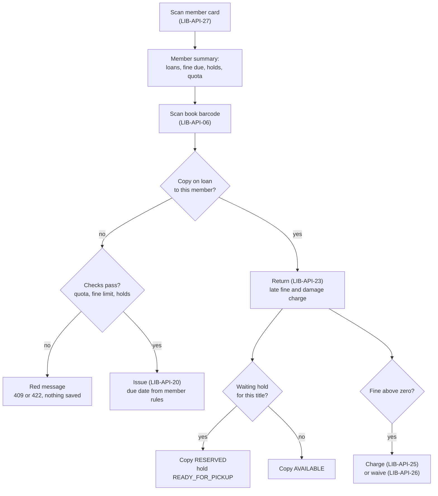
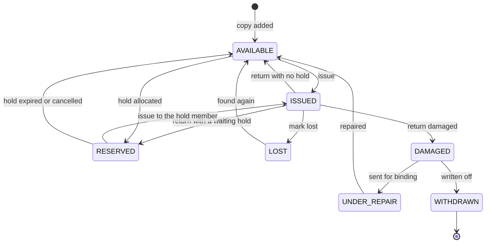
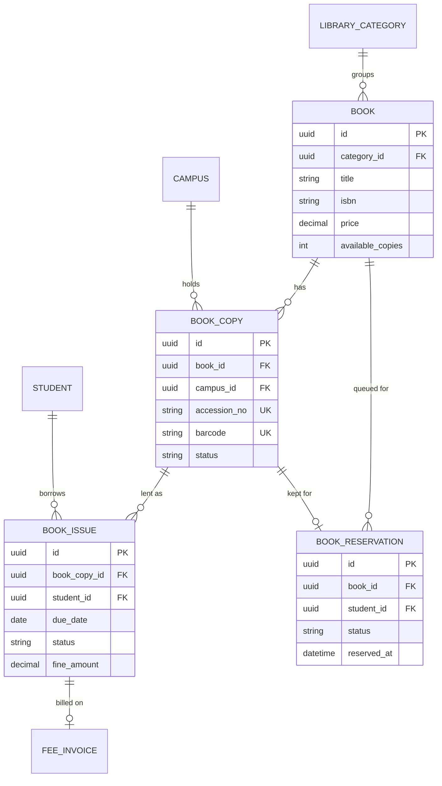

# Library Module

**In simple words:** Most school libraries still run on a paper register, so nobody knows which books are late until the year-end count. This module keeps the catalogue (titles and their physical copies), runs a barcode desk for issue, renew and return, and counts late fines by rule, billing them to the fee invoice or taking them at the counter. It also covers holds, lost and damaged books, stock verification, reminders, and the student and parent views.

| Item | Value |
|---|---|
| Module code | LIB |
| Release phase | Phase 3 (V1.5); built in March 2027 with prompt P-43 |
| Plans | Pro and Enterprise (plan feature `module.LIB`) |
| Main users | Librarian (custom role), Organization Admin, Principal, Accountant, Student, Parent |
| Depends on | Student Profile, Staff, Multi Campus, Subjects, Fees, Payments, Settings, Notifications |
| Used by | Certificates (TC dues), Staff (exit clearance), Student Portal, Parent Portal, Dashboard |
| Main tables | `library_categories`, `books`, `book_copies`, `book_issues`, `book_reservations` |
| Endpoints | LIB-API-01 to LIB-API-37 |

## Objective

1. Issue or return one book in under 10 seconds: scan the member card, scan the book, press one key (target).
2. Every copy has a unique accession number (the running number in the stock register) and a barcode. Numbers are never reused.
3. Fines follow the rules in Settings. Nobody does arithmetic by hand, a fine is billed once, and only the Principal or Organization Admin waives it.
4. Students and parents see due dates in the portals and get reminders, so overdue loans fall by half in the first term (target).
5. Two people with a USB scanner verify 10,000 copies in 3 working days (target).

## Scope

### In scope

- Catalogue: titles (`Book`), copies (`BookCopy`) with accession number, barcode, shelf and price, and a category tree.
- Barcode and spine label printing (PDF sheets).
- Circulation desk: member summary, issue, renew, return, damage charge, mark lost.
- Member rules per group: students, teaching and non-teaching staff each get their own limit, loan days, renewals and fine per day.
- Fines: running late fine, damage charge, lost-book charge; billed to a fee invoice or taken at the counter; waiver with reason.
- Holds with a first-come queue, pickup deadline and expiry.
- Excel import of titles and copies, including a short ISBN list for titles already in the catalogue.
- Stock verification by shelf with a scanner.
- Due-soon and overdue reminders; library pages in both portals.
- Registers and exports: accession, loan, overdue and fine registers, most issued titles, stock value.

### Out of scope

| Item | Why or where |
|---|---|
| E-books and a digital library | Different licensing; Phase 4 idea |
| Title data from online ISBN databases | External dependency; the import needs a title for new ISBNs (assumption: Phase 4) |
| RFID gates and self-checkout kiosks | Hardware cost; barcode is enough for our market |
| Buying books and vendor bills | *Inventory Module* |
| Deducting staff fines from salary | *Payroll Module* does not read library fines in V1.5 |
| Self-renewal from the portals | Renewal happens at the desk |
| Loans between two organizations | Tenants never share data |

### Phase notes

Phase 3 (V1.5) ships everything in scope with English and Hindi screens. Phase 4 (V2.0) adds portal self-renewal, online ISBN data fetch and Arabic screens for UAE (assumption).

## User Stories

| ID | As a | I want to | So that | Priority |
|---|---|---|---|---|
| LIB-US-01 | Librarian | add a title with its copies in one form | numbers and labels are ready the same day | Must |
| LIB-US-02 | Librarian | import my old register, or just ISBNs and copy counts | I do not type 5,000 books again | Must |
| LIB-US-03 | Librarian | print barcode and spine labels | every book can be scanned | Must |
| LIB-US-04 | Librarian | scan a member card, then a book, to issue or return | the desk queue moves fast | Must |
| LIB-US-05 | Librarian | see loans, fines, holds and quota at once | I know if the member can borrow | Must |
| LIB-US-06 | Organization Admin | set limits, loan days, renewals and fine per day | the rules match our library policy | Must |
| LIB-US-07 | Librarian | have fines calculated on return | I never argue about arithmetic | Must |
| LIB-US-08 | Librarian or Accountant | bill a fine to the fee invoice or take cash | the money is tracked with all other fees | Must |
| LIB-US-09 | Principal | waive a fine with a reason | genuine cases are fair and the waiver is recorded | Must |
| LIB-US-10 | Student | see my books, due dates and fines, and reserve a book | I plan my reading and avoid fines | Should |
| LIB-US-11 | Parent | see my child's books and get a WhatsApp when one is late | the book comes back and the fine stays small | Should |
| LIB-US-12 | Librarian | mark a book lost or damaged and charge its price | the library can buy a replacement | Must |
| LIB-US-13 | Librarian | verify stock shelf by shelf with a scanner | the year-end stock report is true | Should |
| LIB-US-14 | Principal | see overdue, most issued and stock value reports | I can plan purchases and follow up | Should |

## Workflow

### Circulation at the desk

**Figure: Issue and return at the circulation desk**



Two scans serve both actions. The second decides: a copy on loan to the scanned member is returned, any other copy is issued. All checks run before anything is written.

1. **Member.** On Wednesday 11 August 2027 Aarav Sharma (10-A, `BF-2027-0142`) reaches the Lucknow Main desk. LIB-API-27 shows 2 of 3 loans, a running fine of ₹12.00 and 1 hold ready.
2. **Return.** She scans `BF-LIB-004512` ("Wings of Fire"), due Thursday 5 August, so 6 days late: 6 × ₹2 = ₹12.00. LIB-API-23 sets the loan `RETURNED` and the copy `AVAILABLE`.
3. **Hold pickup.** She scans `BF-LIB-003215` ("The Alchemist") from the hold shelf. LIB-API-20 issues it, due 25 August; the hold becomes `FULFILLED`.
4. **Fine.** [Charge fine] calls LIB-API-25 and adds ₹12.00 to a fee invoice for Aarav's parent, due in 7 days.
5. **Next day.** At 01:00 the nightly job marks late loans `OVERDUE`, updates running fines, expires old holds and queues reminders.

### Status lifecycles

**Figure: Life of one physical copy**



`ISSUED` and `RESERVED` are set only by circulation, never by hand. `WITHDRAWN` is final, and the accession number stays in the register.

| Record | Status | Meaning | Set by | Next |
|---|---|---|---|---|
| Copy | `AVAILABLE` | On the shelf | Add, return, repair, found | `ISSUED`, `RESERVED`, `DAMAGED`, `LOST`, `WITHDRAWN` |
| Copy | `ISSUED` | With a member | LIB-API-20 | `AVAILABLE`, `RESERVED`, `DAMAGED`, `LOST` |
| Copy | `RESERVED` | On the hold shelf | Hold allocation | `ISSUED`, `AVAILABLE` |
| Copy | `DAMAGED`, `UNDER_REPAIR` | Not lendable | Return, LIB-API-17 | `UNDER_REPAIR`, `AVAILABLE`, `WITHDRAWN` |
| Copy | `LOST`, `WITHDRAWN` | Missing; written off | LIB-API-24, LIB-API-17 | `AVAILABLE` (found); none |
| Loan | `ISSUED` | Out, not late | LIB-API-20, LIB-API-22 | `OVERDUE`, `RETURNED`, `LOST` |
| Loan | `OVERDUE` | Past due; fine runs | Nightly job | `RETURNED`, `LOST` |
| Loan | `RETURNED`, `LOST` | Closed; fine final | LIB-API-23, LIB-API-24 | None; `RETURNED` if found |
| Hold | `WAITING` | In the queue | LIB-API-31, LIB-API-35 | `READY_FOR_PICKUP`, `CANCELLED` |
| Hold | `READY_FOR_PICKUP` | Kept until `expiresAt` | Allocation | `FULFILLED`, `EXPIRED`, `CANCELLED` |
| Hold | `FULFILLED`, `EXPIRED`, `CANCELLED` | Closed | Issue, job, cancel | None |

## Screens and Wireframes

| ID | Screen | Users | Purpose | APIs |
|---|---|---|---|---|
| LIB-S01 | Library dashboard | Librarian, Principal, Org Admin | Counters, overdue top 10, holds ready | LIB-API-07 |
| LIB-S02 | Catalogue | Librarian, Principal, Accountant (view) | Search titles; add, edit, archive | LIB-API-01 to 05 |
| LIB-S03 | Title detail | Librarian | Copies, hold queue, loan history | LIB-API-03, 14 to 17, 30 |
| LIB-S04 | Label printing | Librarian | Pick copies, choose sheet, print PDF | LIB-API-18 |
| LIB-S05 | Categories | Librarian | Tree with drag to move | LIB-API-10 to 13 |
| LIB-S06 | Circulation desk | Librarian | Scan, summary, issue, renew, return | LIB-API-06, 20, 22 to 24, 27 |
| LIB-S07 | Loans and overdue | Librarian, Principal | Tabs by status, reminders, export | LIB-API-19, 21, 28, 29 |
| LIB-S08 | Fine dialog | Librarian, Accountant, Principal | Charge to invoice or counter; waive | LIB-API-25, 26 |
| LIB-S09 | Holds | Librarian | Queue per title; place and cancel | LIB-API-30 to 32 |
| LIB-S10 | Catalogue import | Librarian | Upload, dry run, errors, commit | LIB-API-08, CMN-API-12 to 16 |
| LIB-S11 | Stock verification | Librarian | Scan a shelf; found, misplaced, missing | LIB-API-14, 06, 16, 17 |
| LIB-S12 | My library (Student Portal) | Student | Loans, fines, search, holds | LIB-API-33 to 36 |
| LIB-S13 | Library tab (Parent Portal) | Parent | Child's loans, due dates, fines | LIB-API-37 |

The library rules form lives in *Settings Module* (SET-S18, "Portals and module rules").

**Screen LIB-S06 — Circulation desk (Librarian, web)**

```text
+--------------------------------------------------------------------------+
| EduFlow | Bright Future Public School    [Search...]   Campus [LKO v]    |
+------------+-------------------------------------------------------------+
| Dashboard  | Library > Circulation desk   Scan [BF-LIB-004512______]     |
| Library  < +-------------------------------------------------------------+
|  Desk      | MEMBER  Aarav Sharma   BF-2027-0142   10-A   Student        |
|  Catalogue | Loans 2 of 3    Fine due Rs 12.00    Holds 1 ready          |
|  Loans     |-------------------------------------------------------------|
|  Holds     | Acc. no        Title                 Due          Status    |
|  Import    | BF-LIB-004388  Concepts of Physics 1 19 Aug 2027  ISSUED    |
|  Stock chk | BF-LIB-004512  Wings of Fire         05 Aug 2027  OVERDUE   |
|  Reports   |-------------------------------------------------------------|
| Settings   | Scanned BF-LIB-004512: Wings of Fire, on loan to Aarav      |
|            | Return on Wed 11 Aug 2027: 6 days late x Rs 2 = Rs 12.00    |
|            | Condition (o) Good  ( ) Damaged   Damage charge Rs [_____]  |
|            | Hold queue: 0   [Esc Cancel]  [F2 Renew]  [Enter Return]    |
+------------+-------------------------------------------------------------+
```

- The scan box always has focus. A member card loads LIB-API-27; a book code runs LIB-API-06 and shows the matching action.
- On a copy on loan to the member: Enter returns (LIB-API-23), F2 renews (LIB-API-22), F4 marks lost (LIB-API-24). On a free copy Enter issues (LIB-API-20). Damaged fills the suggested charge (LIB-BR-10); a failed check shows a red banner.

**Screen LIB-S07 — Loans, Overdue tab (Librarian, web)**

```text
+--------------------------------------------------------------------------+
| EduFlow | Bright Future Public School    [Search...]   Campus [LKO v]    |
+------------+-------------------------------------------------------------+
| Dashboard  | Library > Loans   [Open] [Overdue 37] [Returned] [Lost]     |
| Library  < +-------------------------------------------------------------+
|  Desk      | Campus [LKO Main v]  Member [Students v]  Class [10-A v]    |
|  Catalogue |-------------------------------------------------------------|
|  Loans     | [ ] Member          Class Title             Late  Fine Rs   |
|  Holds     | [x] Aarav Sharma    10-A  Wings of Fire      6 d    12.00   |
|  Import    | [x] Riya Singh      10-A  Godaan             9 d    18.00   |
|  Stock chk | [x] Kabir Khan      10-A  Sapiens           31 d    62.00   |
|  Reports   | [ ] Meera Joshi     10-A  Malgudi Days      58 d   116.00   |
| Settings   |-------------------------------------------------------------|
|            | 4 of 4 shown (10-A)      Running fines on page Rs 208.00    |
|            | [Export v]        [Send reminder to 3 selected]             |
+------------+-------------------------------------------------------------+
```

- LIB-API-19 with `status=OVERDUE`, sorted by days late; a row opens the loan (LIB-API-21). [Send reminder] calls LIB-API-28 for the selected ids; [Export v] offers the registers (LIB-API-29).
- The fine shown is the value the nightly job stored. It becomes final on return.

**Screen LIB-S11 — Stock verification (Librarian, web)**

```text
+--------------------------------------------------------------------------+
| EduFlow | Bright Future Public School    [Search...]   Campus [LKO v]    |
+------------+-------------------------------------------------------------+
| Dashboard  | Library > Stock verification   Campus [Lucknow Main v]      |
| Library  < +-------------------------------------------------------------+
|  Desk      | Shelf [R3-S2 v]  Expected 64   Scanned 61   Started 10:05   |
|  Catalogue | Scan [____________]  Last: BF-LIB-004771 Godaan  FOUND      |
|  Loans     |-------------------------------------------------------------|
|  Holds     | Result           Count  Copies                              |
|  Import    | Found               60  BF-LIB-004701 and 59 more [Show]    |
|  Stock chk | Misplaced            1  BF-LIB-003990 is R1-S4   [Move]     |
|  Reports   | Missing              4  BF-LIB-004102 and 3 more [Show]     |
| Settings   | On loan, skipped    11  not expected on the shelf           |
|            |-------------------------------------------------------------|
|            | [x] Second count done: mark the 4 missing copies LOST       |
|            | [Save draft]      [Export sheet]     [Finish verification]  |
+------------+-------------------------------------------------------------+
```

- Choosing a shelf loads the expected copies with LIB-API-14 (LIB-BR-21). Scans are matched in the browser; an unknown code goes to LIB-API-06. [Move] updates the shelf with LIB-API-16.
- [Finish verification] marks missing copies `LOST` with LIB-API-17, only with the second-count box ticked. [Save draft] keeps the scans for 7 days.

**Screen LIB-S12 — My library (Student Portal, mobile)**

```text
+------------------------------------+
| <  Library               Aarav S.  |
+------------------------------------+
| [My books]  [Search]  [Holds]      |
|------------------------------------|
| Wings of Fire                      |
| Due Thu 5 Aug    OVERDUE 4 days    |
| Fine so far Rs 8.00                |
|------------------------------------|
| Concepts of Physics Vol 1          |
| Due Thu 19 Aug   2 renewals left   |
|------------------------------------|
| HOLD  The Alchemist                |
| Ready at the desk until Thu 12 Aug |
|                      [Cancel hold] |
|------------------------------------|
| Fine due in total: Rs 8.00         |
| Billed on the school fee invoice   |
| after you return the book.         |
+------------------------------------+
```

- Aarav opens it on Monday 9 August 2027. [My books] and [Holds] read LIB-API-34; [Search] uses LIB-API-33 and shows "2 on shelf" or "All out, 1 waiting". [Reserve] calls LIB-API-35, [Cancel hold] LIB-API-36.
- The Parent Portal tab (LIB-S13) shows the same card without search or holds (LIB-API-37).

## UI Components

| Component | Type | Behaviour |
|---|---|---|
| `ScanInput` | Input with key listener | Keeps focus; Enter submits; ignores the same scan within 1 second |
| `MemberCard` | Card | Photo, name, code, class, loans x of y, fine due, holds; red border when blocked |
| `LoanTable` | shadcn DataTable | Sort by due date; status badge; days late in red; actions by permission |
| `CopyStatusBadge` | Badge | One colour per `BookCopyStatus`; tooltip with shelf and last change |
| `FineDialog` | Dialog with tabs | Charge to invoice, counter payment, or waive with reason; shows the breakdown |
| `HoldQueue` | List | Position, member, placed on, status; cancel button |
| `CategoryTree` | Tree view | Three levels; drag to move; archive blocked when in use |
| `LabelSheetPicker` | Form | A4 65-up or 24-up, start position, barcode and spine preview |
| `ImportWizard` | Stepper | Upload, map columns, dry-run errors, commit |
| `ShelfScanner` | Page component | Expected list, scan log, result groups, draft in IndexedDB |
| States | Skeleton, empty, error | Skeleton rows while loading; empty desk says "Scan a member card to start"; errors show the API message and Retry |

## Validation Rules

| Field | Rule | Error message shown to user |
|---|---|---|
| `title`, `authors` | Required; 1 to 300 and 1 to 500 characters | "Enter the book title." / "Enter at least one author." |
| `isbn` | Optional; hyphens removed; 10 or 13 characters with a valid check digit | "This ISBN is not valid. Check the last digit." |
| `isbn` (duplicate) | Not used by another active title | "This ISBN is already in the catalogue: {title}. Add copies to it instead." |
| `publicationYear` | 1800 to next year | "Enter a year between 1800 and {nextYear}." |
| `price` | 0 to 99,999.99, two decimals | "Enter a price such as 250.00." |
| `copies.count` | 1 to 100 per request | "Add between 1 and 100 copies at a time." |
| `barcode` | Optional; 4 to 50 of A-Z, 0-9 and hyphen; unique in the organization | "Barcode {code} is already on another copy." |
| `shelfLocation` | Up to 50 characters | "Shelf name is too long (50 characters at most)." |
| Category `name` | 1 to 100 characters; unique in the organization | "A category with this name already exists." |
| Category `parentId` | Not itself or its own child; depth at most 3 | "A category cannot sit under itself, and the tree has at most 3 levels." |
| Issue member | Exactly one of `studentId` or `staffId`, matching `memberType` | "Choose one student or one staff member." |
| Issue `dueDate` override | 1 to 90 days after today | "Due date must be within the next 90 days." |
| Return `returnDate` | Not before the issue date, not in the future, at most 7 days back | "Return date must be between {issueDate} and today, and at most 7 days back." |
| `damageCharge` | 0 to the replacement price | "Damage charge cannot be more than the book price (Rs {price})." |
| Mark lost `fineAmount` | Required when title and copy have no price; 1 to 99,999.99 | "This book has no price. Enter the amount to charge." |
| `withdrawReason`, waive `reason` | 5 to 255 and 10 to 255 characters | "Give a reason for writing off this copy." / "Write why the fine is waived (at least 10 characters)." |
| Charge `method` | Required for `COUNTER`: `CASH`, `UPI` or `CARD` | "Choose how the fine was paid." |
| Import file | XLSX or CSV, up to 5,000 rows | "The file has {n} rows. Split it into files of 5,000 rows or fewer." |

## Business Rules

### Rules, members and numbering

**LIB-BR-01 — Library settings.** The rules live in `OrganizationSetting` rows of the `library` group (SET-API-02, SET-API-03), never as constants. A change applies to the next action, with no deploy. Assumption: these keys and defaults are fixed here.

| Key | Default | Campus row | Meaning |
|---|---|---|---|
| `library.member_rules` | JSON below | Yes | Limit, loan days, renewals, fine per day per group |
| `library.max_unpaid_fine` | `"100.00"` | Yes | Issue blocked above this fine due |
| `library.hold_pickup_days` | `3` | Yes | Days a ready hold waits at the desk |
| `library.max_holds` | `2` | No | Active holds per member |
| `library.due_soon_days` | `2` | No | Reminder days before the due date |
| `library.overdue_reminder_days` | `[1, 7, 14]` | No | Days late that trigger a reminder |
| `library.damage_charge_percent` | `50` | No | Suggested damage charge, percent of price |
| `library.fine_billing` | `{ "feeHeadId": null, "invoiceDueDays": 7 }` | No | Fee head and due days for fine invoices |

```json
{
  "STUDENT":      { "maxBooks": 3, "loanDays": 14, "maxRenewals": 2, "finePerDay": "2.00" },
  "TEACHING":     { "maxBooks": 6, "loanDays": 30, "maxRenewals": 3, "finePerDay": "0.00" },
  "NON_TEACHING": { "maxBooks": 2, "loanDays": 14, "maxRenewals": 1, "finePerDay": "2.00" }
}
```

Sharma Classes has costly JEE books in demand, so it sets students to 2 books for 7 days.

**LIB-BR-02 — Members.** A member is an `ACTIVE` `Student`, or a `Staff` member who is `ACTIVE` or `ON_LEAVE`. The group is `STUDENT`, or the staff member's `staffType`. Assumption: one library per campus. Members borrow at their own campus and may return at any desk that has the copy's campus in scope.

**LIB-BR-03 — Accession number and barcode.** Each copy takes the next `LIBRARY_ACCESSION_NO` value inside the create transaction. Bright Future uses prefix `BF-LIB-` with 6 digits, so copy 4,512 is `BF-LIB-004512`. A number is never reused, even after a withdrawal. With no barcode given, the barcode equals the accession number; old labels are imported as barcodes, and the desk lookup accepts either.

**LIB-BR-04 — Cached counters.** `books.total_copies` counts copies with `deleted_at` empty and status not `LOST` or `WITHDRAWN`; `books.available_copies` counts `AVAILABLE` copies. Both are written in the same transaction as any copy change, and the nightly job recalculates them to repair drift.

### Issue, renew and return

**LIB-BR-05 — Issue checks.** LIB-API-20 locks the copy row (`SELECT ... FOR UPDATE`) in one tenant transaction and checks, in this order:

1. The member is eligible (LIB-BR-02) and belongs to the copy's campus. Else `422`.
2. The copy is `AVAILABLE`, or `RESERVED` for this member. Else `409`: "This copy is kept for Riya Singh until Thu 12 Aug."
3. The member has no open loan of the same title. Else `422`.
4. Open loans across all campuses are fewer than `maxBooks`. Else `422`.
5. Fine due (LIB-BR-13) is not above `library.max_unpaid_fine`. Else `422`.

It then creates the loan, sets the copy `ISSUED`, fulfils the member's hold for that title, and emits `library.book.issued`. The index `uq_book_issue_open` is the second guard: two desks issuing one copy give one `201` and one `409`.

**LIB-BR-06 — Due date.** Due date = issue date + `loanDays` of the member group, in the campus timezone. A day outside `academic.working_days`, or a campus `Holiday`, moves to the next working day. A librarian may set 1 to 90 days instead.

> **Example:** Borrowed Saturday 18 September 2027. 18 Sep + 14 days = Saturday 2 October (Gandhi Jayanti); Sunday 3 October is closed. The due date is Monday 4 October 2027.

**LIB-BR-07 — Renewal.** Allowed while the loan is `ISSUED` (not `OVERDUE`), `renewalCount` is below `maxRenewals`, and no `WAITING` hold exists for the title at that campus. New due date = current due date + `loanDays`, moved to a working day. Aarav's "Concepts of Physics Vol 1", due Thursday 19 August 2027, becomes Thursday 2 September with one renewal left.

**LIB-BR-08 — Late fine.** Days late = the larger of 0 and (return date - due date), in calendar days. Late fine = days late × `finePerDay`, capped at the replacement price. While a loan is `OVERDUE` the nightly job stores the fine up to today; on return it becomes final.

```typescript
import { Prisma } from '@prisma/client';

type Money = Prisma.Decimal;

// LIB-BR-08: calendar days late x fine per day, capped at the replacement price.
export function lateFine(
  dueDate: string, // 'YYYY-MM-DD' in the campus timezone
  onDate: string, // return date, or today for the running fine
  finePerDay: Money,
  replacementPrice: Money | null,
): { daysLate: number; fine: Money } {
  const ms = Date.parse(`${onDate}T00:00:00Z`) - Date.parse(`${dueDate}T00:00:00Z`);
  const daysLate = Math.max(0, Math.round(ms / 86_400_000));
  let fine = finePerDay.mul(daysLate);
  if (replacementPrice && fine.gt(replacementPrice)) fine = replacementPrice;
  return { daysLate, fine: fine.toDecimalPlaces(2) };
}
```

> **Example:** Due Monday 15 March 2027, returned Saturday 20 March: 5 days × ₹2 = ₹10.00. A book 200 days late with a ₹250 replacement price costs ₹250.00, not ₹400.00.

**LIB-BR-09 — Replacement price.** `books.price`, else `book_copies.price`, else none. The title price comes first because a lost book is replaced at today's cost. With no price there is no fine cap, and mark lost needs a typed amount.

**LIB-BR-10 — Return and damage.** LIB-API-23 takes `condition` `GOOD`, `WORN` or `DAMAGED` and writes Good, Worn or Damaged to `book_copies.condition`. For `DAMAGED` the librarian enters 0 to the replacement price; the screen suggests `library.damage_charge_percent` of it. Final fine = late fine + damage charge, capped at the replacement price. The copy becomes `DAMAGED`, else it goes to the hold queue (LIB-BR-17) or `AVAILABLE`.

> **Example:** "Malgudi Days" (₹199) returns 60 days late with water damage. Late fine = min(60 × ₹2, ₹199) = ₹120.00; suggested damage = 50% × ₹199 = ₹99.50; the total of ₹219.50 is capped at ₹199.00.

**LIB-BR-11 — Lost book.** LIB-API-24 works on `ISSUED` or `OVERDUE` loans. Loan and copy become `LOST`, and the fine becomes the replacement price, which replaces the running late fine instead of adding to it. Kabir Khan loses "Sapiens" (₹499) 31 days late with ₹62 running: the fine is ₹499.00, not ₹561.00.

**LIB-BR-12 — Lost book found.** LIB-API-23 also accepts a `LOST` loan. An uncharged fine becomes a late fine to the return date: Kabir returns "Sapiens" 10 days later, min(41 × ₹2, ₹499) = ₹82.00. A charged fine stays, and the response warns "Fine already billed. Give a credit in Fees if the school agrees." EduFlow never refunds by itself.

### Fines

**LIB-BR-13 — Fine due and the borrowing block.** Fine due of a loan = 0 when `fineWaived` is true, else `fineAmount` - `finePaid`. A member's fine due is the sum over all loans, running fines included. Meera's ₹199.00 is above ₹100.00, so she cannot borrow until it is paid or waived.

**LIB-BR-14 — Charging a fine.** LIB-API-25 works on `RETURNED` or `LOST` loans with a fine due above 0 and no earlier charge. A second charge answers `409`; an open loan answers `422`, because the fine is still growing.

| Mode | Members | What happens |
|---|---|---|
| `FEE_INVOICE` | Students | One ad-hoc invoice with one line on the fee head of `library.fine_billing` (else the first active `FINE` head), due in `invoiceDueDays`; sets `fineInvoiceId`. A listener sets `finePaid` when the invoice is paid. |
| `COUNTER` | Students and staff | `collectPayment()` of *Payments Module* records a `Payment` with purpose `LIBRARY_FINE` and prints a receipt; sets `finePaymentId` and `finePaid`. Needs an `Idempotency-Key`. |

Staff fines use `COUNTER` only (`422` for `FEE_INVOICE`), and a counter payment must equal the full fine due. With no `FINE` fee head the invoice mode answers `422` "Create a fee head of type Fine first."

**LIB-BR-15 — Waiving a fine.** Only `library.approve` waives: the Principal on own campuses, or the Organization Admin, never the Librarian. A waiver is always full, needs a reason of 10 characters or more, and is audited with the actor. It is allowed on `RETURNED` or `LOST` loans with `finePaid` = 0. An unpaid fine invoice is cancelled in the same request; a partly paid one answers `422` "Part of this fine is paid. Use a fee adjustment in Fees."

> **Example:** Riya Singh returns "Godaan" 10 days late on 12 August 2027, so the fine is ₹20.00. Dr. Anita Verma waives it: "Hospitalised 2 to 10 August; discharge summary seen." Fine due becomes ₹0.00.

### Holds

**LIB-BR-16 — Placing a hold.** LIB-API-31 at the desk, LIB-API-35 in the portal, always on a title at the member's campus. It needs all of these: the member is eligible; the campus has a copy that is not `LOST` or `WITHDRAWN`; no copy is `AVAILABLE` (else "A copy is on the shelf. Borrow it at the desk."); the member has no open loan and no active hold for the title (`409`); and fewer than `library.max_holds` active holds.

**LIB-BR-17 — Queue, pickup and expiry.** Holds are served by `reservedAt`, oldest first, per title and campus. When a copy of that title becomes `AVAILABLE` (return, repair, new copy, released hold), the oldest `WAITING` hold becomes `READY_FOR_PICKUP` with `bookCopyId` and `readyAt` set, `expiresAt` = 23:59:59 in the campus timezone `hold_pickup_days` later, and the copy becomes `RESERVED`. Issuing it makes the hold `FULFILLED`. The nightly job expires passed holds; a cancel or expiry passes the copy to the next hold, else to `AVAILABLE`.

> **Example:** Aarav reserves "The Alchemist" (one copy, on loan) on Monday 2 August 2027. It returns Monday 9 August at 09:40, so his hold is ready until Thursday 12 August 23:59:59 IST (`expiresAt` = `2027-08-12T18:29:59Z`). He collects it on 11 August.

### Catalogue, import and stock

**LIB-BR-18 — Archiving.** LIB-API-05 answers `422` while any copy is on loan. Otherwise the title gets `deletedAt` and `ARCHIVED`, its copies other than `LOST` become `WITHDRAWN` with reason "Title archived", and its active holds are cancelled with a message. Categories are at most 3 levels deep and cannot be archived while titles or active children use them. Names are unique in the organization, so use "Hindi Fiction", not "Hindi" under two parents.

**LIB-BR-19 — Import and ISBN lists.** LIB-API-08 takes the `LIBRARY_BOOKS` template (CMN-API-09). A dry run always comes first, and CMN-API-16 commits it.

- ISBNs are cleaned to digits and X; 10-digit ISBNs become 13-digit; a bad check digit fails the row with `ISBN_INVALID`.
- A row whose ISBN is already in the catalogue only adds copies, so a sheet of just `isbn` and `copies` works: this is the ISBN list. A new ISBN with no title fails with `TITLE_REQUIRED`.
- The same ISBN on several rows makes one title with the copies added up. A row without an ISBN matches only on the same title, authors and edition, else it creates a title.
- A category path such as "Fiction > Hindi Fiction" is created when missing. Accession numbers go to valid rows in file order without gaps, and given barcodes must match the copy count and be unused (`BARCODE_TAKEN`).

**LIB-BR-20 — Nightly job and reminders.** `library-daily` runs at 01:00 organization time and is safe to run twice. It marks `ISSUED` loans past due as `OVERDUE`, updates running fines (LIB-BR-08), expires ready holds, queues due-soon reminders `due_soon_days` early and overdue reminders on the days in `overdue_reminder_days`, and recalculates the counters. Messages respect the quiet hours in *Settings Module*. LIB-API-28 sends manual reminders, at most one per loan per day.

**LIB-BR-21 — Stock verification.** One campus shelf at a time (LIB-S11). The expected list is the shelf's copies in `AVAILABLE`, `DAMAGED` or `UNDER_REPAIR`; `RESERVED` copies sit on the hold shelf and `ISSUED` copies count as "on loan". A scanned copy from another shelf is misplaced; one never scanned is missing. Missing copies become `LOST` only after a second count, with the reason "Stock verification 2027-28, shelf R3-S2". The draft stays in the browser: V1.5 has no verification table (assumption: a server-side session table is a Phase 4 candidate).

**LIB-BR-22 — Members who leave.** The Transfer Certificate dues check in *Certificates Module* and the exit clearance in *Staff Module* ask the library service for open loans and fine due. A leaver with a book out stays listed until it is returned or marked lost.

**LIB-BR-23 — Stock value.** Sum over copies not `LOST` or `WITHDRAWN` of (`book_copies.price`, else `books.price`, else 0). The copy price comes first because the report shows what the school paid; copies with no price are counted separately. Example: 3 copies of "Wings of Fire" at ₹225 plus 10 copies of "Concepts of Physics Vol 1" priced only on the title at ₹595 = ₹675 + ₹5,950 = ₹6,625.00.

## Acceptance Criteria

| ID | Given | When | Then |
|---|---|---|---|
| LIB-AC-01 | The Librarian adds "Wings of Fire" with 3 copies | LIB-API-02 succeeds | Copies `BF-LIB-004510` to `004512`, barcodes equal to them; `totalCopies` = `availableCopies` = 3 |
| LIB-AC-02 | A file with the same ISBN on 2 rows (4 and 6 copies) | The import is committed | One title with 10 copies and consecutive accession numbers |
| LIB-AC-03 | A new ISBN row with no title | The dry run finishes | Row fails with `TITLE_REQUIRED`; no accession number is used |
| LIB-AC-04 | Aarav has 3 open loans | A fourth copy is issued to him | `422`; the copy stays `AVAILABLE` |
| LIB-AC-05 | A copy `RESERVED` for Riya | It is issued to Aarav | `409 CONFLICT` naming Riya and the pickup date |
| LIB-AC-06 | A loan due 15 March 2027 | It is returned on 20 March | `fineAmount` = 10.00, status `RETURNED`, copy `AVAILABLE` |
| LIB-AC-07 | A loan 200 days late, replacement price ₹250 | It is returned | `fineAmount` = 250.00 |
| LIB-AC-08 | A loan with a `WAITING` hold on its title | Renew is pressed | `422` "Someone is waiting for this book."; due date unchanged |
| LIB-AC-09 | A returned copy whose title has 2 waiting holds | The return is saved | Oldest hold `READY_FOR_PICKUP` with `expiresAt` set; copy `RESERVED`; `library.reservation.ready` sent |
| LIB-AC-10 | Aarav's returned loan with a ₹12.00 fine | Charged with `FEE_INVOICE` | One invoice with one line of ₹12.00; a second charge gives `409` |
| LIB-AC-11 | A Librarian user | Calls LIB-API-26 | `403 FORBIDDEN` |
| LIB-AC-12 | The Principal waives an unpaid invoiced fine | LIB-API-26 succeeds | `fineWaived` true, invoice `CANCELLED`, audit row with the reason |
| LIB-AC-13 | A ready hold whose `expiresAt` has passed | The nightly job runs | Hold `EXPIRED`; the copy goes to the next hold or `AVAILABLE` |
| LIB-AC-14 | `finePerDay` changed from 2.00 to 3.00 | The next late return is saved | The new rate is used; no deploy |
| LIB-AC-15 | Aarav signed in to the Student Portal | He opens LIB-API-34 | Only his own loans, fines and holds |

## Edge Cases

| Case | What happens | How the system handles it |
|---|---|---|
| Copy has no price and is lost | No amount to charge | LIB-API-24 needs `fineAmount`; the screen asks for it |
| Member returns a new copy instead of paying | School accepts it | Mark lost, add the new copy (LIB-API-15), Principal waives with reason "Replaced with new copy" |
| Book returned at the wrong campus desk | Copy far from home | Allowed when the user has the copy's campus in scope; the screen says "Send back to Lucknow Main" |
| Student transferred with a book out | Open loan of a leaver | Blocks the TC unless overridden (LIB-BR-22); the loan stays open until returned or lost |
| Due date falls in a new holiday | Holiday declared after issue | Existing due dates do not move; the librarian can renew |
| Fine invoice cancelled in Fees | Library thinks it is billed | On `fee.invoice.cancelled` the listener clears `fineInvoiceId`, so the fine can be charged again |
| Title archived with holds | Members wait forever | Holds cancelled; `library.reservation.cancelled` sent (LIB-BR-18) |
| Nightly job missed a day | Overdue and fines late | The job is idempotent and fixes all past dates on the next run |
| Settings changed during term | Old loans have old due dates | Due dates never change; only fines and new loans use the new rules |
| Barcode already used in the import | Duplicate label | Row fails with `BARCODE_TAKEN`; other rows continue |
| Student Portal switched off | Student cannot see loans | LIB-API-33 to 36 answer `403`; the parent tab still works |

## Database Schema

| Table | Purpose |
|---|---|
| `library_categories` | Category tree, at most 3 levels |
| `books` | One row per title, with cached copy counters |
| `book_copies` | One physical copy: accession number, barcode, shelf |
| `book_issues` | One loan, with renewals, fine and billing links |
| `book_reservations` | Hold queue per title and campus |

Borrowed tables: `fee_invoices` and `payments` of *Fees Module* and *Payments Module* carry a charged fine, `organization_settings` and `number_sequences` hold the rules and the accession series, and `import_jobs`, `export_jobs` and `audit_logs` serve imports, registers and waivers. Every table below also has `id` (uuid PK), `organization_id` (FK `organizations`), `created_at` and `updated_at`; those four are not repeated.

### Table books

| Column | Type | Null | Default | Notes |
|---|---|---|---|---|
| `category_id`, `subject_id` | uuid | Yes | | FK `library_categories`, `subjects`; SetNull |
| `title`, `subtitle` | varchar(300) | No, Yes | | |
| `authors` | varchar(500) | No | | Comma-separated |
| `isbn` | varchar(20) | Yes | | 13 digits, no hyphens |
| `publisher`, `edition`, `language` | varchar(150/50/30) | Yes | | |
| `publication_year`, `pages` | smallint, int | Yes | | |
| `description`, `tags` | text, text[] | Yes, No | `{}` | Tags feed the search |
| `cover_file_id` | uuid | Yes | | FK `file_assets`, SetNull |
| `price`, `currency` | decimal(12,2), char(3) | Yes | | Replacement price (LIB-BR-09) |
| `total_copies`, `available_copies` | int | No | `0` | Cached (LIB-BR-04) |
| `status`, `deleted_at` | `RecordStatus`, timestamptz | No, Yes | `ACTIVE` | `ARCHIVED` after LIB-API-05 |

### Table book_copies

| Column | Type | Null | Default | Notes |
|---|---|---|---|---|
| `campus_id`, `book_id` | uuid | No | | FK `campuses`, `books`; Restrict |
| `accession_no` | varchar(30) | No | | From `LIBRARY_ACCESSION_NO` (LIB-BR-03) |
| `barcode` | varchar(50) | Yes | | Equals the accession number when not given |
| `status`, `condition` | `BookCopyStatus`, varchar(30) | No, Yes | `AVAILABLE` | New, Good, Worn, Damaged |
| `shelf_location` | varchar(50) | Yes | | Rack and shelf, for example `R3-S2` |
| `purchase_date` | date | Yes | | |
| `price`, `currency` | decimal(12,2), char(3) | Yes | | Copy price wins in the stock value |
| `withdrawn_at`, `withdraw_reason` | timestamptz, varchar(255) | Yes | | Set with `WITHDRAWN` |
| `deleted_at` | timestamptz | Yes | | Soft delete, for wrong entries |

### Table book_issues

| Column | Type | Null | Default | Notes |
|---|---|---|---|---|
| `campus_id`, `book_copy_id`, `book_id` | uuid | No | | FK, Restrict; `book_id` denormalised |
| `member_type` | `LibraryMemberType` | No | | `STUDENT` or `STAFF` |
| `student_id`, `staff_id` | uuid | Yes | | Exactly one is set |
| `issue_date`, `due_date` | date | No | | Campus timezone calendar dates |
| `return_date`, `last_renewed_on` | date | Yes | | Set by LIB-API-23, LIB-API-22 |
| `renewal_count` | smallint | No | `0` | Against `maxRenewals` |
| `status` | `BookIssueStatus` | No | `ISSUED` | |
| `fine_amount`, `fine_paid` | decimal(12,2) | No | `0` | Late, damage or lost charge |
| `fine_waived` | boolean | No | `false` | Only `library.approve` sets it |
| `currency` | char(3) | No | | |
| `fine_invoice_id`, `fine_payment_id` | uuid | Yes | | FK `fee_invoices`, `payments`; SetNull |
| `remarks` | varchar(255) | Yes | | Waiver reason, lost note |
| `issued_by_id`, `returned_to_id` | uuid | Yes | | User ids for audit; no FK |

### Table book_reservations

| Column | Type | Null | Default | Notes |
|---|---|---|---|---|
| `campus_id`, `book_id` | uuid | No | | FK, Restrict; the hold is on a title |
| `book_copy_id` | uuid | Yes | | Copy set aside when `READY_FOR_PICKUP` |
| `member_type`, `student_id`, `staff_id` | enum, uuid | No, Yes, Yes | | Same rule as a loan |
| `status` | `BookReservationStatus` | No | `WAITING` | |
| `reserved_at` | timestamptz | No | `now()` | Queue order (LIB-BR-17) |
| `ready_at`, `expires_at` | timestamptz | Yes | | Pickup window |
| `book_issue_id` | uuid | Yes | | Unique; the loan that fulfilled the hold |

### Table library_categories

| Column | Type | Null | Default | Notes |
|---|---|---|---|---|
| `parent_id` | uuid | Yes | | Self FK, SetNull; at most 3 levels |
| `name`, `code` | varchar(100), varchar(30) | No, Yes | | Name unique in the organization; Dewey code |
| `status`, `deleted_at` | `RecordStatus`, timestamptz | No, Yes | `ACTIVE` | |

Unique keys: (`organization_id`, `accession_no`) and (`organization_id`, `barcode`) on copies, (`organization_id`, `name`) on categories, `book_issue_id` on holds. List indexes: title, ISBN and (`category_id`, `status`) on titles; (`campus_id`, `status`) and (`book_id`, `status`) on copies; (`campus_id`, `status`, `due_date`) for overdue; (`book_id`, `status`, `reserved_at`) for the hold queue; (`campus_id`, `status`, `expires_at`) for the expiry worker. Each one starts with `organization_id`. Loans and holds have no `deleted_at`, because a loan is history. Both carry RLS on `app.current_org`. One open loan per copy is guarded in the database, not only in code:

```sql
CREATE UNIQUE INDEX uq_book_issue_open
  ON book_issues (organization_id, book_copy_id)
  WHERE status IN ('ISSUED', 'OVERDUE');
```

**Figure: Library tables and their neighbours**



A hold points at the title, not at a copy, until it is ready. That is why `book_copy_id` on a hold is optional, and why `book_id` is copied onto the loan: title reports never join through copies.

## Prisma Schema

Copied from `docs/src/_schema/11-operations.prisma`. One self-relation block is shortened to a comment line; no field is renamed or added.

```prisma
enum BookCopyStatus {
  AVAILABLE
  ISSUED
  RESERVED
  LOST
  DAMAGED
  UNDER_REPAIR
  WITHDRAWN
}

enum BookIssueStatus {
  ISSUED
  RETURNED
  OVERDUE
  LOST
}

enum LibraryMemberType {
  STUDENT
  STAFF
}

enum BookReservationStatus {
  WAITING
  READY_FOR_PICKUP
  FULFILLED
  EXPIRED
  CANCELLED
}

model LibraryCategory {
  id             String       @id @default(uuid()) @db.Uuid
  organizationId String       @map("organization_id") @db.Uuid
  parentId       String?      @map("parent_id") @db.Uuid
  name           String       @db.VarChar(100)
  code           String?      @db.VarChar(30) // e.g. a Dewey class
  status         RecordStatus @default(ACTIVE)
  createdAt      DateTime     @default(now()) @map("created_at") @db.Timestamptz(6)
  updatedAt      DateTime     @updatedAt @map("updated_at") @db.Timestamptz(6)
  deletedAt      DateTime?    @map("deleted_at") @db.Timestamptz(6)

  organization Organization      @relation(fields: [organizationId], references: [id], onDelete: Cascade)
  // self relation "LibraryCategoryTree": parent (parentId, SetNull)
  // and children LibraryCategory[]
  books        Book[]

  @@unique([organizationId, name])
  @@index([organizationId, parentId])
  @@map("library_categories")
}

// A title in the library catalogue; physical copies are BookCopy rows.
model Book {
  id              String       @id @default(uuid()) @db.Uuid
  organizationId  String       @map("organization_id") @db.Uuid
  categoryId      String?      @map("category_id") @db.Uuid
  subjectId       String?      @map("subject_id") @db.Uuid // textbook subject link
  title           String       @db.VarChar(300)
  subtitle        String?      @db.VarChar(300)
  authors         String       @db.VarChar(500) // comma-separated
  isbn            String?      @db.VarChar(20)
  publisher       String?      @db.VarChar(150)
  edition         String?      @db.VarChar(50)
  publicationYear Int?         @map("publication_year") @db.SmallInt
  language        String?      @db.VarChar(30)
  pages           Int?
  description     String?      @db.Text
  tags            String[]
  coverFileId     String?      @map("cover_file_id") @db.Uuid
  price           Decimal?     @db.Decimal(12, 2) // replacement price charged when a copy is lost
  currency        String?      @db.Char(3)
  totalCopies     Int          @default(0) @map("total_copies") // cached
  availableCopies Int          @default(0) @map("available_copies") // cached
  status          RecordStatus @default(ACTIVE)
  createdAt       DateTime     @default(now()) @map("created_at") @db.Timestamptz(6)
  updatedAt       DateTime     @updatedAt @map("updated_at") @db.Timestamptz(6)
  deletedAt       DateTime?    @map("deleted_at") @db.Timestamptz(6)

  organization     Organization      @relation(fields: [organizationId], references: [id], onDelete: Restrict)
  category         LibraryCategory?  @relation(fields: [categoryId], references: [id], onDelete: SetNull)
  subject          Subject?          @relation(fields: [subjectId], references: [id], onDelete: SetNull)
  coverFile        FileAsset?        @relation(fields: [coverFileId], references: [id], onDelete: SetNull)
  copies           BookCopy[]
  issues           BookIssue[]
  bookReservations BookReservation[]

  @@index([organizationId, title])
  @@index([organizationId, isbn])
  @@index([organizationId, categoryId, status])
  @@map("books")
}

// One physical copy of a book with its accession number and barcode.
model BookCopy {
  id             String         @id @default(uuid()) @db.Uuid
  organizationId String         @map("organization_id") @db.Uuid
  campusId       String         @map("campus_id") @db.Uuid // library that holds the copy
  bookId         String         @map("book_id") @db.Uuid
  accessionNo    String         @map("accession_no") @db.VarChar(30) // LIBRARY_ACCESSION_NO
  barcode        String?        @db.VarChar(50)
  status         BookCopyStatus @default(AVAILABLE)
  condition      String?        @db.VarChar(30) // New, Good, Worn
  shelfLocation  String?        @map("shelf_location") @db.VarChar(50) // rack / shelf
  purchaseDate   DateTime?      @map("purchase_date") @db.Date
  price          Decimal?       @db.Decimal(12, 2)
  currency       String?        @db.Char(3)
  withdrawnAt    DateTime?      @map("withdrawn_at") @db.Timestamptz(6)
  withdrawReason String?        @map("withdraw_reason") @db.VarChar(255)
  createdAt      DateTime       @default(now()) @map("created_at") @db.Timestamptz(6)
  updatedAt      DateTime       @updatedAt @map("updated_at") @db.Timestamptz(6)
  deletedAt      DateTime?      @map("deleted_at") @db.Timestamptz(6)

  organization     Organization      @relation(fields: [organizationId], references: [id], onDelete: Restrict)
  campus           Campus            @relation(fields: [campusId], references: [id], onDelete: Restrict)
  book             Book              @relation(fields: [bookId], references: [id], onDelete: Restrict)
  issues           BookIssue[]
  bookReservations BookReservation[]

  @@unique([organizationId, accessionNo])
  @@unique([organizationId, barcode])
  @@index([organizationId, campusId, status])
  @@index([organizationId, bookId, status])
  @@map("book_copies")
}

// Loan of a book copy to a student or staff member, with renewals and overdue fine.
// One open loan per copy is enforced by a partial unique index in the SQL migration:
//   uq_book_issue_open (organization_id, book_copy_id) WHERE status IN ('ISSUED','OVERDUE')
model BookIssue {
  id             String            @id @default(uuid()) @db.Uuid
  organizationId String            @map("organization_id") @db.Uuid
  campusId       String            @map("campus_id") @db.Uuid
  bookCopyId     String            @map("book_copy_id") @db.Uuid
  bookId         String            @map("book_id") @db.Uuid // denormalised for title reports
  memberType     LibraryMemberType @map("member_type")
  studentId      String?           @map("student_id") @db.Uuid // set when memberType is STUDENT
  staffId        String?           @map("staff_id") @db.Uuid // set when memberType is STAFF
  issueDate      DateTime          @map("issue_date") @db.Date
  dueDate        DateTime          @map("due_date") @db.Date
  returnDate     DateTime?         @map("return_date") @db.Date
  renewalCount   Int               @default(0) @map("renewal_count") @db.SmallInt
  lastRenewedOn  DateTime?         @map("last_renewed_on") @db.Date
  status         BookIssueStatus   @default(ISSUED)
  fineAmount     Decimal           @default(0) @map("fine_amount") @db.Decimal(12, 2) // fine charge
  finePaid       Decimal           @default(0) @map("fine_paid") @db.Decimal(12, 2)
  fineWaived     Boolean           @default(false) @map("fine_waived")
  currency       String            @db.Char(3)
  fineInvoiceId  String?           @map("fine_invoice_id") @db.Uuid // fine invoice (student)
  finePaymentId  String?           @map("fine_payment_id") @db.Uuid // counter Payment, LIBRARY_FINE
  remarks        String?           @db.VarChar(255)
  issuedById     String?           @map("issued_by_id") @db.Uuid // User id (audit only, no FK)
  returnedToId   String?           @map("returned_to_id") @db.Uuid // User id (audit only, no FK)
  createdAt      DateTime          @default(now()) @map("created_at") @db.Timestamptz(6)
  updatedAt      DateTime          @updatedAt @map("updated_at") @db.Timestamptz(6)

  organization Organization     @relation(fields: [organizationId], references: [id], onDelete: Restrict)
  campus       Campus           @relation(fields: [campusId], references: [id], onDelete: Restrict)
  bookCopy     BookCopy         @relation(fields: [bookCopyId], references: [id], onDelete: Restrict)
  book         Book             @relation(fields: [bookId], references: [id], onDelete: Restrict)
  student      Student?         @relation(fields: [studentId], references: [id], onDelete: Restrict)
  staff        Staff?           @relation(fields: [staffId], references: [id], onDelete: Restrict)
  fineInvoice  FeeInvoice?      @relation(fields: [fineInvoiceId], references: [id], onDelete: SetNull)
  finePayment  Payment?         @relation(fields: [finePaymentId], references: [id], onDelete: SetNull)
  reservation  BookReservation?

  @@index([organizationId, bookCopyId, status])
  @@index([organizationId, studentId, status])
  @@index([organizationId, staffId, status])
  @@index([organizationId, campusId, status, dueDate]) // overdue list
  @@map("book_issues")
}

// Hold placed on a title by a member (Student Portal / librarian); served in queue order by reservedAt.
model BookReservation {
  id             String                @id @default(uuid()) @db.Uuid
  organizationId String                @map("organization_id") @db.Uuid
  campusId       String                @map("campus_id") @db.Uuid
  bookId         String                @map("book_id") @db.Uuid
  bookCopyId     String?               @map("book_copy_id") @db.Uuid // set aside when READY_FOR_PICKUP
  memberType     LibraryMemberType     @map("member_type")
  studentId      String?               @map("student_id") @db.Uuid
  staffId        String?               @map("staff_id") @db.Uuid
  status         BookReservationStatus @default(WAITING)
  reservedAt     DateTime              @default(now()) @map("reserved_at") @db.Timestamptz(6)
  readyAt        DateTime?             @map("ready_at") @db.Timestamptz(6)
  expiresAt      DateTime?             @map("expires_at") @db.Timestamptz(6) // pickup deadline
  bookIssueId    String?               @unique @map("book_issue_id") @db.Uuid // loan that fulfilled the hold
  createdAt      DateTime              @default(now()) @map("created_at") @db.Timestamptz(6)
  updatedAt      DateTime              @updatedAt @map("updated_at") @db.Timestamptz(6)

  organization Organization @relation(fields: [organizationId], references: [id], onDelete: Restrict)
  campus       Campus       @relation(fields: [campusId], references: [id], onDelete: Restrict)
  book         Book         @relation(fields: [bookId], references: [id], onDelete: Restrict)
  bookCopy     BookCopy?    @relation(fields: [bookCopyId], references: [id], onDelete: SetNull)
  student      Student?     @relation(fields: [studentId], references: [id], onDelete: Restrict)
  staff        Staff?       @relation(fields: [staffId], references: [id], onDelete: Restrict)
  bookIssue    BookIssue?   @relation(fields: [bookIssueId], references: [id], onDelete: SetNull)

  @@index([organizationId, bookId, status, reservedAt]) // queue of a title
  @@index([organizationId, studentId, status])
  @@index([organizationId, staffId, status])
  @@index([organizationId, campusId, status, expiresAt]) // expiry worker
  @@map("book_reservations")
}
```

## API Endpoints

Paths start with `/api/v1`. The tenant comes from the JWT; the desk sends `X-Campus-Id`.

| ID | Method | Path | Permission | Purpose |
|---|---|---|---|---|
| LIB-API-01 | GET | `/books` | library.view | Search titles (q, category, ISBN) |
| LIB-API-02 | POST | `/books` | library.create | Add a title with first copies |
| LIB-API-03 | GET | `/books/:id` | library.view | Title, copies, hold queue |
| LIB-API-04 | PATCH | `/books/:id` | library.update | Update details, cover, price |
| LIB-API-05 | DELETE | `/books/:id` | library.delete | Archive; blocked with open loans |
| LIB-API-06 | GET | `/books/lookup` | library.view | Desk lookup by code or text |
| LIB-API-07 | GET | `/books/summary` | library.view | Dashboard counters |
| LIB-API-08 | POST | `/books/import` | library.import | Excel import (job) |
| LIB-API-09 | POST | `/books/export` | library.export | Catalogue or accession register (job) |
| LIB-API-10 | GET | `/library-categories` | library.view | Category tree |
| LIB-API-11 | POST | `/library-categories` | library.manage | Create a category |
| LIB-API-12 | PATCH | `/library-categories/:id` | library.manage | Rename, move, change status |
| LIB-API-13 | DELETE | `/library-categories/:id` | library.manage | Archive; blocked while in use |
| LIB-API-14 | GET | `/book-copies` | library.view | List copies by campus, status, shelf |
| LIB-API-15 | POST | `/book-copies` | library.create | Add N copies |
| LIB-API-16 | PATCH | `/book-copies/:id` | library.update | Update barcode, shelf, condition |
| LIB-API-17 | POST | `/book-copies/:id/change-status` | library.update | Damaged, repair, lost, withdrawn |
| LIB-API-18 | POST | `/book-copies/print-labels` | library.view | Label sheet (job) |
| LIB-API-19 | GET | `/book-issues` | library.view | List loans by status and member |
| LIB-API-20 | POST | `/book-issues` | library.issue | Issue a copy |
| LIB-API-21 | GET | `/book-issues/:id` | library.view | Loan with fine breakdown |
| LIB-API-22 | POST | `/book-issues/:id/renew` | library.issue | Extend the due date |
| LIB-API-23 | POST | `/book-issues/:id/return` | library.issue | Return; fine, damage, next hold |
| LIB-API-24 | POST | `/book-issues/:id/mark-lost` | library.issue | Charge the replacement price |
| LIB-API-25 | POST | `/book-issues/:id/charge-fine` | library.collect_fine | Bill to invoice or counter (IK) |
| LIB-API-26 | POST | `/book-issues/:id/waive-fine` | library.approve | Waive with a reason |
| LIB-API-27 | GET | `/book-issues/member-summary` | library.issue | Loans, fines, holds, quota |
| LIB-API-28 | POST | `/book-issues/send-reminders` | library.manage | Queue reminders (job) |
| LIB-API-29 | POST | `/book-issues/export` | library.export | Loan or fine register (job) |
| LIB-API-30 | GET | `/book-reservations` | library.view | Holds in queue order |
| LIB-API-31 | POST | `/book-reservations` | library.issue | Place a hold |
| LIB-API-32 | POST | `/book-reservations/:id/cancel` | library.issue | Cancel a hold |
| LIB-API-33 | GET | `/portal/student/books` | studentportal.access | Student catalogue search |
| LIB-API-34 | GET | `/portal/student/library-account` | studentportal.access | Own loans, fines, holds |
| LIB-API-35 | POST | `/portal/student/book-reservations` | studentportal.access | Reserve a title |
| LIB-API-36 | POST | `/portal/student/book-reservations/:id/cancel` | studentportal.access | Cancel own hold |
| LIB-API-37 | GET | `/portal/parent/library-account` | parentportal.access | Child's loans and fines |

(IK) = `Idempotency-Key` required. (job) = returns a BullMQ job id. Every endpoint can answer `401`, `403 FORBIDDEN`, `403 PLAN_LIMIT_REACHED` (below Pro) and `429`; those rows are not repeated. Another tenant's or campus's row always answers `404`, never `403`.

### LIB-API-02 — Add a title with copies

```http
POST /api/v1/books
Authorization: Bearer <accessToken>
X-Campus-Id: e1f7b3a9-6d24-4c58-a0e3-5b9f2c7d1e46
Content-Type: application/json
```

```json
{
  "title": "Wings of Fire",
  "subtitle": "An Autobiography",
  "authors": "A. P. J. Abdul Kalam, Arun Tiwari",
  "isbn": "9788173711466",
  "publisher": "Universities Press",
  "publicationYear": 1999,
  "language": "English",
  "categoryId": "7a2d5e91-3c6f-4b08-9e1a-4d8c2f6b0a37",
  "price": "225.00",
  "currency": "INR",
  "copies": { "count": 3, "shelfLocation": "R3-S2", "purchaseDate": "2027-07-28" }
}
```

```json
{
  "success": true,
  "data": {
    "id": "9f2c7a14-5e83-4b16-b0d7-3c6a1e8f4b29",
    "title": "Wings of Fire",
    "isbn": "9788173711466",
    "price": "225.00",
    "currency": "INR",
    "totalCopies": 3,
    "availableCopies": 3,
    "status": "ACTIVE",
    "copies": [
      {
        "id": "2d7e9c31-8a4f-4b6e-9c15-7f3a0d2e6b48",
        "accessionNo": "BF-LIB-004510",
        "barcode": "BF-LIB-004510",
        "status": "AVAILABLE"
      },
      { "id": "4a8c1f63-9d27-4e50-8b31-6c2f7a9e0d54", "accessionNo": "BF-LIB-004511" },
      { "id": "0b6e3d97-5a12-48fc-9e74-1d3b8c5f2a60", "accessionNo": "BF-LIB-004512" }
    ],
    "createdAt": "2027-07-28T05:12:44.000Z"
  }
}
```

| Status | Code | When |
|---|---|---|
| 400 | `VALIDATION_ERROR` | Bad ISBN check digit; `copies.count` outside 1 to 100 |
| 409 | `CONFLICT` | ISBN already on an active title; add copies instead |
| 422 | `BUSINESS_RULE_VIOLATION` | `LIBRARY_ACCESSION_NO` sequence not set up |

### LIB-API-06 — Desk lookup

One call serves the scan box. `code` matches a barcode or accession number; `q` searches title, authors and ISBN.

```http
GET /api/v1/books/lookup?code=BF-LIB-004512
Authorization: Bearer <accessToken>
```

```json
{
  "success": true,
  "data": {
    "matchedOn": "ACCESSION_NO",
    "copy": {
      "id": "0b6e3d97-5a12-48fc-9e74-1d3b8c5f2a60",
      "accessionNo": "BF-LIB-004512",
      "status": "ISSUED",
      "shelfLocation": "R3-S2",
      "condition": "Good"
    },
    "book": { "id": "9f2c7a14-5e83-4b16-b0d7-3c6a1e8f4b29", "title": "Wings of Fire", "price": "225.00" },
    "openIssue": {
      "id": "6a1f4d92-3c7b-45e8-8d0a-9b2e5c7f1a63",
      "memberName": "Aarav Sharma",
      "memberCode": "BF-2027-0142",
      "dueDate": "2027-08-05",
      "daysLate": 6,
      "runningFine": "12.00"
    },
    "waitingHolds": 0,
    "suggestedAction": "RETURN"
  }
}
```

| Status | Code | When |
|---|---|---|
| 400 | `VALIDATION_ERROR` | Neither `code` nor `q` is sent |
| 404 | `NOT_FOUND` | No copy or title with that code here |

### LIB-API-20 — Issue a copy

Runs the five checks of LIB-BR-05 in one transaction with the copy row locked.

```json
{
  "bookCopyId": "0b6e3d97-5a12-48fc-9e74-1d3b8c5f2a60",
  "memberType": "STUDENT",
  "studentId": "c4b8e2f7-1d59-4a36-b7e0-8f2c6a9d3e15",
  "issueDate": "2027-08-11",
  "remarks": ""
}
```

```json
{
  "success": true,
  "data": {
    "id": "6a1f4d92-3c7b-45e8-8d0a-9b2e5c7f1a63",
    "bookCopyId": "0b6e3d97-5a12-48fc-9e74-1d3b8c5f2a60",
    "accessionNo": "BF-LIB-004512",
    "bookTitle": "Wings of Fire",
    "memberType": "STUDENT",
    "studentId": "c4b8e2f7-1d59-4a36-b7e0-8f2c6a9d3e15",
    "issueDate": "2027-08-11",
    "dueDate": "2027-08-25",
    "renewalCount": 0,
    "status": "ISSUED",
    "fineAmount": "0.00",
    "currency": "INR",
    "quota": { "used": 3, "limit": 3 },
    "reservationFulfilledId": null
  }
}
```

| Status | Code | When |
|---|---|---|
| 409 | `CONFLICT` | Copy on loan, or kept for another member's ready hold |
| 422 | `BUSINESS_RULE_VIOLATION` | Book limit reached; fine above the limit; same title out; member not active; other campus |
| 404 | `NOT_FOUND` | Unknown copy, student or staff id |

### LIB-API-22 — Renew a loan

```json
{
  "success": true,
  "data": {
    "id": "6a1f4d92-3c7b-45e8-8d0a-9b2e5c7f1a63",
    "dueDate": "2027-09-08",
    "renewalCount": 1,
    "renewalsLeft": 1,
    "lastRenewedOn": "2027-08-25",
    "status": "ISSUED"
  }
}
```

| Status | Code | When |
|---|---|---|
| 422 | `BUSINESS_RULE_VIOLATION` | Loan `OVERDUE`; renewal limit reached; a `WAITING` hold exists |
| 409 | `CONFLICT` | Loan already closed (`RETURNED` or `LOST`) |

### LIB-API-23 — Return a copy

```json
{
  "returnDate": "2027-08-11",
  "condition": "DAMAGED",
  "damageCharge": "112.50",
  "remarks": "Water stain on pages 40 to 52"
}
```

```json
{
  "success": true,
  "data": {
    "id": "6a1f4d92-3c7b-45e8-8d0a-9b2e5c7f1a63",
    "status": "RETURNED",
    "returnDate": "2027-08-11",
    "daysLate": 6,
    "fine": { "late": "12.00", "damage": "112.50", "total": "124.50", "capped": false, "currency": "INR" },
    "fineAmount": "124.50",
    "copy": { "accessionNo": "BF-LIB-004512", "status": "DAMAGED", "condition": "Damaged" },
    "nextHold": null,
    "memberFineDue": "124.50"
  }
}
```

| Status | Code | When |
|---|---|---|
| 400 | `VALIDATION_ERROR` | `returnDate` in the future or over 7 days back |
| 409 | `CONFLICT` | Loan already `RETURNED` |
| 422 | `BUSINESS_RULE_VIOLATION` | `damageCharge` above the replacement price |

### LIB-API-24 — Mark a book lost

The fine becomes the replacement price and replaces the running late fine (LIB-BR-11). `fineAmount` is needed only when title and copy have no price.

```json
{ "remarks": "Student reported the book lost on 11 Aug 2027", "fineAmount": null }
```

```json
{
  "success": true,
  "data": {
    "id": "7c2e5a80-1b93-4d67-8f04-3a6d9c1e7b52",
    "status": "LOST",
    "fineAmount": "499.00",
    "fineSource": "BOOK_PRICE",
    "copy": { "accessionNo": "BF-LIB-004388", "status": "LOST" },
    "memberFineDue": "499.00"
  }
}
```

| Status | Code | When |
|---|---|---|
| 422 | `BUSINESS_RULE_VIOLATION` | Loan not `ISSUED` or `OVERDUE`; no price and no `fineAmount` |
| 400 | `VALIDATION_ERROR` | `fineAmount` outside 1 to 99,999.99 |

### LIB-API-25 — Charge a fine

```http
POST /api/v1/book-issues/6a1f4d92-3c7b-45e8-8d0a-9b2e5c7f1a63/charge-fine
Authorization: Bearer <accessToken>
Idempotency-Key: 7f1c4b60-2a85-4e39-9d07-5c3b8f2e6a14
Content-Type: application/json
```

```json
{ "mode": "FEE_INVOICE", "invoiceDueDays": 7, "note": "Library fine, Wings of Fire" }
```

```json
{
  "success": true,
  "data": {
    "bookIssueId": "6a1f4d92-3c7b-45e8-8d0a-9b2e5c7f1a63",
    "mode": "FEE_INVOICE",
    "amount": "12.00",
    "currency": "INR",
    "fineInvoiceId": "3e5a9c18-7b2d-4f61-a9c4-2d8e6b1f5a07",
    "invoiceNo": "BF/2027-28/INV/004871",
    "dueDate": "2027-08-18",
    "finePaid": "0.00",
    "receiptUrl": null
  }
}
```

| Status | Code | When |
|---|---|---|
| 409 | `CONFLICT` | Fine already charged (`fineInvoiceId` or `finePaymentId` set) |
| 422 | `BUSINESS_RULE_VIOLATION` | Loan open; fine due 0; `FEE_INVOICE` for staff; no active `FINE` head |
| 400 | `VALIDATION_ERROR` | `COUNTER` without `method`; amount not the full fine due |

With `"mode": "COUNTER"` the body carries `method` (`CASH`, `UPI` or `CARD`) and the response returns `finePaymentId`, `receiptNo` and `receiptUrl` instead of the invoice fields.

### LIB-API-26 — Waive a fine

```json
{ "reason": "Hospitalised 2 to 10 August 2027; discharge summary seen." }
```

```json
{
  "success": true,
  "data": {
    "bookIssueId": "9d4a7e21-6c38-4b95-a0f2-7e1c5d3b8a46",
    "fineAmount": "20.00",
    "fineWaived": true,
    "fineDue": "0.00",
    "cancelledInvoiceId": "b2f8c6a3-4d71-40e9-8c25-9a3f1e7d6b08",
    "waivedBy": { "userId": "5e9b2c74-8f13-4a60-b7d9-2c6e0a4f8b31", "name": "Dr. Anita Verma" },
    "waivedAt": "2027-08-12T06:31:09.000Z"
  }
}
```

| Status | Code | When |
|---|---|---|
| 400 | `VALIDATION_ERROR` | Reason under 10 characters |
| 403 | `FORBIDDEN` | No `library.approve`, or campus outside scope |
| 422 | `BUSINESS_RULE_VIOLATION` | Loan open; fine 0; fine invoice partly paid |

### LIB-API-27 — Member summary

```http
GET /api/v1/book-issues/member-summary?memberType=STUDENT&code=BF-2027-0142
Authorization: Bearer <accessToken>
```

```json
{
  "success": true,
  "data": {
    "member": {
      "type": "STUDENT",
      "id": "c4b8e2f7-1d59-4a36-b7e0-8f2c6a9d3e15",
      "name": "Aarav Sharma",
      "code": "BF-2027-0142",
      "batch": "10-A"
    },
    "rules": {
      "maxBooks": 3,
      "loanDays": 14,
      "maxRenewals": 2,
      "finePerDay": "2.00",
      "maxUnpaidFine": "100.00"
    },
    "quota": { "used": 2, "left": 1 },
    "fineDue": "12.00",
    "canBorrow": false,
    "blockReason": "FINE_LIMIT",
    "openIssues": [
      {
        "id": "8f0d3c65-2a49-4e17-b83c-6d1f9a5e2b70",
        "accessionNo": "BF-LIB-004388",
        "title": "Concepts of Physics Vol 1",
        "dueDate": "2027-08-19",
        "daysLate": 0,
        "renewalsLeft": 2
      },
      {
        "id": "6a1f4d92-3c7b-45e8-8d0a-9b2e5c7f1a63",
        "accessionNo": "BF-LIB-004512",
        "title": "Wings of Fire",
        "dueDate": "2027-08-05",
        "daysLate": 6,
        "runningFine": "12.00"
      }
    ],
    "holds": [
      {
        "id": "8b3d6f21-4e9a-47c5-b1d8-0a7c3e5f9b24",
        "title": "The Alchemist",
        "status": "READY_FOR_PICKUP",
        "expiresAt": "2027-08-12T18:29:59.000Z"
      }
    ]
  }
}
```

| Status | Code | When |
|---|---|---|
| 400 | `VALIDATION_ERROR` | Neither `code` nor a member id sent |
| 404 | `NOT_FOUND` | No active member with that code in scope |

### LIB-API-34 — Student Portal library account

Read-only and scoped to the signed-in student. The same shape without `holds` serves the parent at LIB-API-37.

```json
{
  "success": true,
  "data": {
    "quota": { "used": 2, "left": 1 },
    "fineDue": "8.00",
    "openIssues": [
      {
        "title": "Wings of Fire",
        "dueDate": "2027-08-05",
        "daysLate": 4,
        "runningFine": "8.00",
        "renewalsLeft": 0
      }
    ],
    "holds": [
      { "title": "The Alchemist", "status": "READY_FOR_PICKUP", "expiresAt": "2027-08-12T18:29:59.000Z" }
    ],
    "billing": {
      "mode": "FEE_INVOICE",
      "message": "Fines are added to your fee invoice after you return the book."
    }
  }
}
```

## Permissions

| Permission | SUPER_ADMIN | ORG_ADMIN | PRINCIPAL | TEACHER | ACCOUNTANT | PARENT | STUDENT |
|---|---|---|---|---|---|---|---|
| library.view | Yes | Yes | Campus | No | View | No | No |
| library.create | Yes | Yes | No | No | No | No | No |
| library.update | Yes | Yes | No | No | No | No | No |
| library.delete | Yes | Yes | No | No | No | No | No |
| library.manage | Yes | Yes | No | No | No | No | No |
| library.issue | Yes | Yes | No | No | No | No | No |
| library.collect_fine | No | Yes | No | No | Campus | No | No |
| library.approve | No | Yes | Campus | No | No | No | No |
| library.import | Yes | Yes | No | No | No | No | No |
| library.export | No | Yes | No | No | No | No | No |

Students reach LIB-API-33 to 36 with `studentportal.access` and parents reach LIB-API-37 with `parentportal.access`; the service, not the key, limits both to their own records. The daily work belongs to the **Librarian** custom role, whose preset holds every key above except `library.approve`, scoped to the assigned campus.

> **Rule:** The person who bills a fine does not waive it, and `SUPER_ADMIN` never touches money: that is why `library.collect_fine`, `library.approve` and `library.export` are `No` for the platform role.

## Notifications and Events

| Event | Trigger | Channel | Recipient | Template text |
|---|---|---|---|---|
| `library.book.issued` | LIB-API-20 | In-app | Student, Parent | "{book} issued. Return by {dueDate}." |
| `library.book.due_soon` | Job, 2 days before | WhatsApp, In-app | Parent, Student | "{book} is due on {dueDate}. Please return it." |
| `library.book.overdue` | Job on days 1, 7, 14 | WhatsApp, In-app | Parent, Student | "{book} was due on {dueDate}. Fine so far Rs {fine}." |
| `library.book.lost` | LIB-API-24 | WhatsApp, In-app | Parent | "{book} is marked lost. Charge Rs {amount} raised." |
| `library.fine.charged` | LIB-API-25 | WhatsApp, In-app | Parent, Student | "Library fine Rs {amount} added to invoice {invoiceNo}, due {dueDate}." |
| `library.fine.waived` | LIB-API-26 | In-app | Parent, Librarian | "Library fine of Rs {amount} was waived by {approver}." |
| `library.reservation.ready` | Hold allocation | WhatsApp, In-app | Student | "{book} is ready at the desk. Collect it by {expiresAt}." |
| `library.reservation.expired` | Nightly job | In-app | Student | "Your hold on {book} expired. Reserve it again if needed." |
| `library.reservation.cancelled` | LIB-API-32, archive | In-app | Student | "Your hold on {book} was cancelled. Reason: {reason}." |
| `library.import.completed` | Import worker | In-app, Email | Librarian | "Import finished: {ok} rows added, {failed} failed." |

`library.book.renewed`, `library.book.returned` and `library.reservation.placed` are emitted for the event bus and the audit trail but send no message, because the member is at the desk or in the app when they happen. All messages use `NotificationCategory.LIBRARY` and respect the quiet hours and opt-outs of *Notifications Module*; without WhatsApp credits they fall back to in-app.

## Reports and Exports

| Report | Contents | Filters | Format |
|---|---|---|---|
| Accession register | Accession no, title, author, price, date, status | Campus, dates, category | XLSX, PDF |
| Catalogue list | Title, authors, ISBN, category, total and free copies | Category, subject, language | XLSX |
| Loan register | Member, title, issue, due and return dates, fine | Campus, member type, dates | XLSX, PDF |
| Overdue register | Member, class, title, days late, fine, phone | Campus, class, days late | XLSX, PDF |
| Fine register | Fine, mode, invoice or receipt, paid, waived, approver | Campus, dates, status | XLSX |
| Most issued titles | Title, category, loans, copies, times out of stock | Campus, session, category | XLSX |
| Stock value | Copies and value by category, plus copies with no price | Campus, category, as-on date | XLSX, PDF |
| Dead stock and defaulters | Titles with no loan in the period; members above the fine limit | Campus, months, member type | XLSX |

Exports over 1,000 rows run as a BullMQ job (LIB-API-09, LIB-API-29) and arrive as a pre-signed S3 link valid for 24 hours. LIB-API-07 feeds the operations tile of *Dashboard Module*, and the loan counts feed *Analytics Module*.

## Non-Functional Notes

| Area | Decision |
|---|---|
| Desk speed | LIB-API-06 under 150 ms, LIB-API-20 and 23 under 300 ms at p95 with 50,000 copies |
| List speed | LIB-API-01 and 19 under 400 ms at p95 for 5,000 titles, on the `organization_id` indexes |
| Caching | Member rules and categories in Redis for 10 minutes, cleared on a write; copy status is never cached |
| Background jobs | `library-daily` at 01:00 organization time; reminders, import, export and labels on BullMQ with 3 retries and backoff |
| Concurrency | Issue, renew, return and hold allocation lock the copy row; `uq_book_issue_open` is the final guard |
| Audit logging | Issue, renew, return, lost, status change, charge, waive and import commit write an `AuditLog` row with actor and before/after; waivers kept 7 years |
| Plan limits | Pro and Enterprise only. Pro: 50,000 copies, 10 label jobs a day. Over the limit: `403 PLAN_LIMIT_REACHED` |
| Offline | The stock verification draft lives in IndexedDB for 7 days, so a weak Wi-Fi corner does not lose a count |
| i18n | English and Hindi screens in Phase 3; titles and authors stored as typed (UTF-8), never translated; dates in the organization timezone |
| Retention | Loans are never deleted. A data-deletion request keeps the fine and dates and drops the name link, as in *Privacy and Compliance* |

## Test Scenarios

| ID | Scenario | Steps | Expected result |
|---|---|---|---|
| LIB-TS-01 | Add a title with copies | LIB-API-02 with `copies.count` 3 | Three copies with the next 3 accession numbers; counters both 3 |
| LIB-TS-02 | Duplicate ISBN | LIB-API-02 with an active ISBN | `409 CONFLICT`; no copy, no accession number used |
| LIB-TS-03 | ISBN-list import | 2 rows, same ISBN, 4 + 6 copies; dry run; commit | One title, 10 copies, no gap in the numbers |
| LIB-TS-04 | Issue over the limit | Fourth issue to a student with 3 open loans | `422`; copy stays `AVAILABLE`; no loan row |
| LIB-TS-05 | Race on one copy | Two parallel LIB-API-20 calls on one copy | One `201`, one `409`; exactly one open loan |
| LIB-TS-06 | Due date on a holiday | Issue 18 Sep 2027, 14 loan days, 2 Oct a holiday | `dueDate` = 2027-10-04 |
| LIB-TS-07 | Late return and fine | Return a loan due 15 Mar 2027 on 20 Mar | `fineAmount` 10.00; loan `RETURNED`; copy `AVAILABLE` |
| LIB-TS-08 | Fine cap | Return 200 days late, price 250.00 | `fineAmount` 250.00, `capped` true |
| LIB-TS-09 | Renew blocked by a hold | Place a hold, then renew the open loan | `422`; due date and `renewalCount` unchanged |
| LIB-TS-10 | Hold pickup chain | Return a copy with 2 waiting holds; run the job after the deadline | Oldest hold ready then `EXPIRED`; copy moves to the second hold |
| LIB-TS-11 | Charge twice | LIB-API-25 twice with different keys | First `200` with an invoice; second `409`; one invoice line |
| LIB-TS-12 | Wrong role and wrong tenant | Librarian calls LIB-API-26; Sharma Classes token reads a Bright Future loan | `403 FORBIDDEN` with no audit row; `404 NOT_FOUND`, and RLS blocks the raw query |
