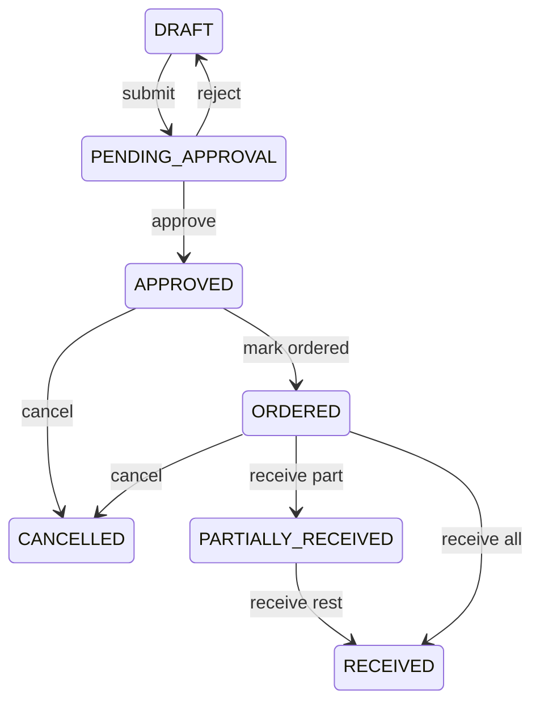
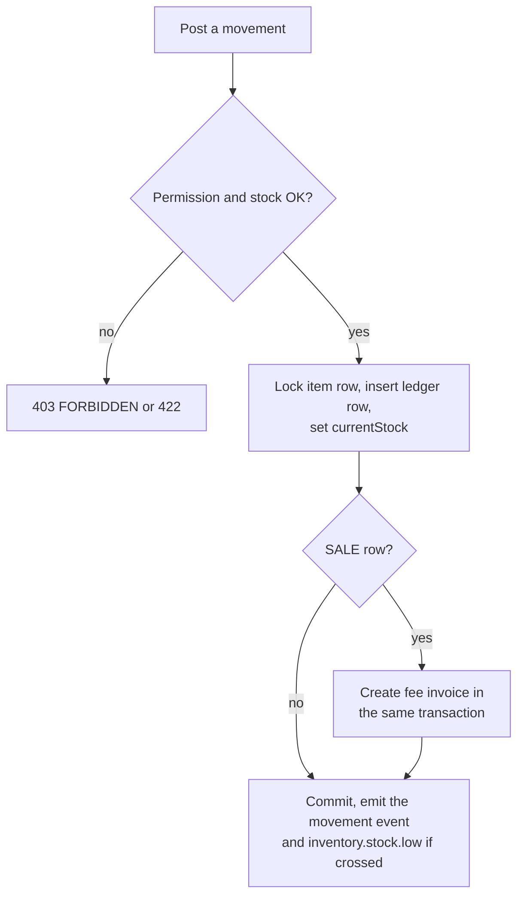
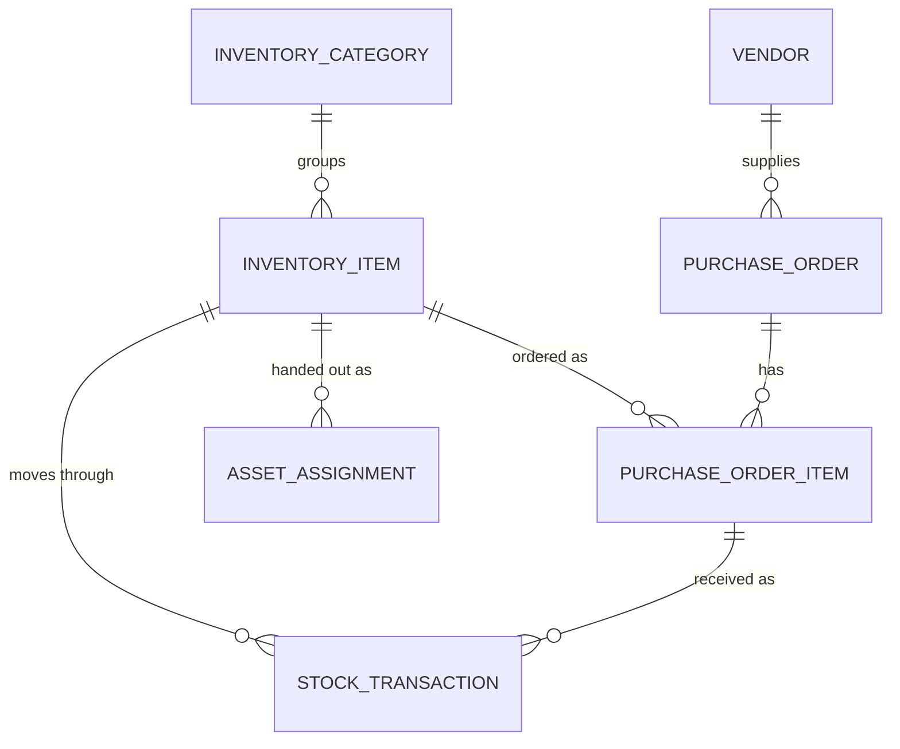

# Inventory Module

**In simple words:** Every school and coaching institute keeps a store room with uniforms, books, stationery, lab kits, projectors and laptops. This module records what the store holds, what was bought, who took what and what was sold to students. Every movement writes one row in a stock ledger, so the stock figure is always explained. Losses need a senior person's approval, and a uniform sale reaches the parent as a fee invoice.

| Item | Value |
|---|---|
| Module code | INV |
| Release phase | Phase 3 (V1.5), by June 2027, prompt P-44 |
| Plans | Pro and Enterprise (plan feature `module.INV`); Starter and Growth see an upgrade screen |
| Main users | Store keeper (custom role), Organization Admin, Principal, Accountant |
| Depends on | Multi Campus, Staff, Student Profile, Fees, Payments, Settings, Notifications |
| Main tables | `inventory_categories`, `inventory_items`, `vendors`, `purchase_orders`, `purchase_order_items`, `stock_transactions`, `asset_assignments` |

## Objective

1. **One true stock figure.** `currentStock` always equals the `balanceAfter` of the item's latest ledger row.
2. **No unapproved spending.** Every purchase order (PO — the written order to a supplier) needs a second person's approval.
3. **Losses are visible.** Every correction and write-off carries a reason, a value in rupees and an approver.
4. **Sales are billed.** A uniform or book sale creates the fee invoice in the same step.
5. **Assets are traceable.** The register shows who holds every laptop or projector and when it is due back.

## Scope

### In scope

- Categories, items (consumables and assets) per campus store, units, reorder levels, selling prices tied to a fee head.
- Vendors with GSTIN and encrypted PAN and bank rows.
- Purchase orders: draft, submit, approve or send back, order, receive in parts, cancel, PDF.
- The ledger: direct IN and OUT, issues, returns, sales, transfers, adjustments, write-offs.
- Reorder alerts; stock count with variance posting by the Principal.
- Asset assignment to staff, a student or a room, with return, damage and loss.
- Excel import with opening stock; valuation, consumption and purchase reports.

### Out of scope

| Item | Owner |
|---|---|
| Collecting money for a sale, receipts, refunds | *Payments Module* |
| Cancelling or crediting a sale invoice | *Fees Module* |
| Paying vendors, accounts payable, TDS returns | Not in EduFlow; the purchase report goes to the CA (chartered accountant) |
| Vehicle spares and repairs | *Transport Module* (same `vendors` table) |
| Staff exit clearance | *Staff Module* (reads open assignments) |

### Phase notes

| When | What ships |
|---|---|
| Phase 3, P-44 (by June 2027) | All 46 endpoints INV-API-01 to INV-API-46, screens INV-S01 to INV-S16 |
| Phase 4 candidates | Uniform pre-order in the Parent Portal, short-closing a part-received PO |

> **Note:** Assumption: "Store keeper" is a custom role built by the Organization Admin. Pro includes custom roles, so every plan with this module can create it.

## User Stories

| ID | As a | I want to | So that | Priority |
|---|---|---|---|---|
| INV-US-01 | Store keeper | import items with opening stock from Excel | the store goes live in one afternoon | Must |
| INV-US-02 | Store keeper | raise a purchase order for approval | nothing is ordered without a second signature | Must |
| INV-US-03 | Principal | see PO lines and tax, then approve or send back | spending stays inside the budget | Must |
| INV-US-04 | Store keeper | receive a delivery in full or in parts | stock and PO status stay correct | Must |
| INV-US-05 | Store keeper | issue stationery to a teacher or department | I know who took what and when | Must |
| INV-US-06 | Accountant | sell a uniform and a book set to a student | the parent pays it like any fee | Must |
| INV-US-07 | Store keeper | get an alert at the reorder level | exam answer sheets never run out | Must |
| INV-US-08 | Principal | post count differences and write-offs with a reason | a senior person approves every loss | Must |
| INV-US-09 | Store keeper | assign a laptop to a teacher, student or room | every asset has a known holder | Must |
| INV-US-10 | Organization Admin | see stock value, consumption and purchase tax | I control costs and give the CA clean numbers | Should |

## Workflow

**Figure: Purchase order lifecycle**



A PO needs one approval. Goods may arrive in several deliveries. A PO can be cancelled only before the first receipt; a draft is deleted instead.

**Figure: Posting one stock movement**



The item row is locked, so two desks cannot sell the last shirt twice. Stock enters by import (INV-API-08) or receipt (INV-API-28) and leaves as a slip (INV-API-33), a sale (INV-API-35), a transfer (INV-API-36) or a direct `OUT` (INV-API-32); assets are assigned (INV-API-40). Twice a year the Principal posts count differences (INV-API-37).

**Purchase order statuses**

| Status | Meaning | Next statuses |
|---|---|---|
| `DRAFT` | Lines editable | `PENDING_APPROVAL`, deleted |
| `PENDING_APPROVAL` | Waiting | `APPROVED`, `DRAFT`, `CANCELLED` |
| `APPROVED` | Not yet sent | `ORDERED`, `PARTIALLY_RECEIVED`, `RECEIVED`, `CANCELLED` |
| `ORDERED` | Sent to the vendor | `PARTIALLY_RECEIVED`, `RECEIVED`, `CANCELLED` |
| `PARTIALLY_RECEIVED` | Some units pending | `RECEIVED` |
| `RECEIVED` | Every line full | None (final) |
| `CANCELLED` | Stopped before any receipt | None (final) |

**Asset assignment statuses**

| Status | Meaning | Stock effect |
|---|---|---|
| `ASSIGNED` | Held now | Stock same, available falls |
| `RETURNED` | Back and usable | Available rises again |
| `DAMAGED` | Back broken | In stock until repair or write-off |
| `LOST` | Cannot be returned | Principal posts a `WRITE_OFF` row (INV-BR-21) |

Items and vendors use the shared `RecordStatus` (`ACTIVE`, `INACTIVE`, `ARCHIVED`). An `INACTIVE` item keeps its stock but takes no new PO, slip or sale.

## Screens and Wireframes

| ID | Screen | Users | Purpose |
|---|---|---|---|
| INV-S01 | Inventory dashboard | Store keeper | Value, low stock, open POs |
| INV-S02 | Item list | Store keeper | Search and filter |
| INV-S03 | Item detail and ledger | Store keeper | Stock and its movements |
| INV-S04 | Item form | Store keeper | Create or edit an item |
| INV-S05 | Item import | Store keeper | Excel upload preview |
| INV-S06 | Categories | Org Admin | Add and archive categories |
| INV-S07 | Vendors | Org Admin | List and detail drawer |
| INV-S08 | Purchase order list | Store keeper | Filter orders |
| INV-S09 | Purchase order builder | Store keeper | Add lines and tax |
| INV-S10 | Purchase order approval | Principal, Org Admin | Approve or send back |
| INV-S11 | Goods receipt | Store keeper | Enter received quantity |
| INV-S12 | Issue slip | Store keeper | Give stock out |
| INV-S13 | Counter sale | Accountant | Sell uniform or books |
| INV-S14 | Stock transfer | Org Admin | Move stock |
| INV-S15 | Stock count and adjust | Principal | Post the variance |
| INV-S16 | Asset register | Store keeper | Who holds what |

**Screen INV-S03 — Item detail and ledger (Store keeper, web)**

```text
+--------------------------------------------------------------------------+
| EduFlow | Bright Future Public School  [Search items...]      (RS) v     |
+------------+-------------------------------------------------------------+
| Dashboard  | Inventory > Items > Shirt size 10 (UNI-SH-10)               |
| Students   +-------------------------------------------------------------+
| Fees       | Category: Uniform    Type: CONSUMABLE    Unit: pcs          |
| Inventory <| Stock: 236 pcs   Reorder: 60   Cost Rs 316.67  Sell Rs 450  |
|  Items   < | Store: Main Campus / Rack B2       Status: [ACTIVE v]       |
|  Vendors   | [Edit] [Issue] [Sell] [Transfer] [Adjust] [Assign asset]    |
|  Orders    +-------------------------------------------------------------+
|  Ledger    | Date       Type       Qty   Balance   Reference             |
|  Assets    | 12 Jun 27  ADJUST      -4     236     Count JUN-27          |
|  Reports   | 10 Jun 27  SALE        -2     240     INV-2027-0912         |
| Settings   | 02 Jun 27  IN        +200     242     PO-2027-0031          |
|            | 28 May 27  ISSUE       -6      42     SLIP-0188             |
|            | 01 Apr 27  IN         +48      48     Opening stock         |
|            | Showing 5 of 34 rows   [Export XLSX]   [Load more]          |
+------------+-------------------------------------------------------------+
```

- The header carries the four numbers asked for daily; `[Sell]` is hidden without `inventory.sell`. Each button posts one ledger row, so the balance column has no gap. Loads with INV-API-03, ledger INV-API-31.

**Screen INV-S11 — Goods receipt (Store keeper, web)**

```text
+--------------------------------------------------------------------------+
| Inventory > Purchase orders > PO-2027-0031         Status: ORDERED       |
+--------------------------------------------------------------------------+
| Vendor: Kumar Uniforms (GSTIN 09AABCK1234M1Z5)   Campus: Main Campus     |
| Ordered 28 May 2027    Expected 05 Jun 2027    Total Rs 92,400           |
+--------------------------------------------------------------------------+
| Vendor bill no [ KU/27-28/114 ]     Bill date [ 02-06-2027 ]             |
+--------------------------------------------------------------------------+
| Item                     Ordered   Already   Receiving   Unit cost       |
| Shirt size 10                200         0   [ 200  ]    Rs 320.00       |
| Lab coat size M               50         0   [  40  ]    Rs 480.00       |
+--------------------------------------------------------------------------+
| Note [______________________________________________]                    |
|                                    [Cancel]   [Receive and post stock]   |
+--------------------------------------------------------------------------+
```

- Part receipts are normal: 200 of 200 shirts and 40 of 50 coats arrive, so the PO becomes `PARTIALLY_RECEIVED`. The button calls INV-API-28: one `IN` row per line and a new average cost (INV-BR-09).

**Screen INV-S12 — Issue slip (Store keeper, mobile)**

```text
+------------------------------------+
| < Issue stock          SLIP-0189   |
+------------------------------------+
| Give to                            |
| (o) Staff  ( ) Student  ( ) Dept   |
| [ Priya Nair - EMP-0042       v ]  |
+------------------------------------+
| Items                              |
| Whiteboard marker   [ 6 ] pcs      |
|   in stock 84                      |
| Duster              [ 2 ] pcs      |
|   in stock 11   LOW                |
| [+ Add item]                       |
+------------------------------------+
| Reason [ Class 10-A supplies    ]  |
| Date   [ 22-06-2027 ]              |
+------------------------------------+
|        [ Save and print slip ]     |
+------------------------------------+
```

- The store keeper works at the window with a phone; the slip is one call, INV-API-33. `LOW` shows when the new balance will touch the reorder level, and saving fires `inventory.stock.low`.

## UI Components

| Component | Type | Behaviour |
|---|---|---|
| `ItemPicker` | Combobox | Searches name and SKU (INV-API-06), blocks `INACTIVE` items |
| `LedgerTable` | Data table | Cursor pages of 50 rows, running balance |
| `POLineEditor` | Repeating row form | Adds lines, recomputes tax and totals live |
| `ApprovalBar` | Sticky bar | `[Approve]` and `[Send back]`, hidden for the creator |
| `VarianceGrid` | Editable grid | System, counted, difference, value, loss total |

Every list has a loading skeleton, an empty state with one action ("No items yet. [Import from Excel]") and an error state.

## Validation Rules

| Field | Rule | Error message |
|---|---|---|
| `name` | 2 to 150 characters | "Enter an item name of at least 2 characters." |
| `sku` | 2 to 40 characters, unique per store | "SKU UNI-SH-10 is already used in this campus store." |
| `reorderLevel` | 0 or more, up to 3 decimals | "Reorder level cannot be negative." |
| `sellingPrice` | Needed when `feeHeadId` is set, and the reverse | "A sale price needs a fee head. Pick one." |
| `receive.quantity` | Not above pending plus 2 percent | "You can receive 50 more, not 60." |
| `issue.quantity` | More than 0, not above `currentStock` | "Only 4 pcs of Duster are in stock." |
| `issue.holder` | Exactly one of staff, student or department | "Choose who is taking the stock." |
| `adjust.reason` | 5 to 255 characters | "Write the reason for this correction." |

## Business Rules

**INV-BR-01 — Stock lives in a campus store.** An item belongs to one `campusId`; `sku` is unique per `(organizationId, campusId)`.

**INV-BR-02 — The ledger is the truth.** `stock_transactions` is append-only. `currentStock` always equals `balanceAfter` of the item's newest row. Mistakes become new `ADJUST` rows.

**INV-BR-03 — Stock never goes below zero.** A movement that would make `balanceAfter` negative is refused with 422 `BUSINESS_RULE_VIOLATION`. Only `ADJUST` may carry a negative quantity.

**INV-BR-04 — One movement, one transaction.** The service locks the item row with `SELECT ... FOR UPDATE`, inserts the ledger row and writes `currentStock` back, all inside one Prisma transaction.

**INV-BR-05 — Purchase order totals.** Per line `taxAmount = round(quantityOrdered x unitPrice x taxRate / 100, 2)` and `lineTotal = quantityOrdered x unitPrice + taxAmount`; header `total = subtotal + taxTotal`. `vendors.stateCode` against the campus state code sets the split: same state gives CGST plus SGST at half the rate each, another state one IGST line.

> **Example:** PO-2027-0031, Kumar Uniforms (Lucknow, 09) to Main Campus (09). 200 shirts x Rs 320 = Rs 64,000 plus 5 percent Rs 3,200; 50 lab coats x Rs 480 = Rs 24,000 plus Rs 1,200. Header: subtotal Rs 88,000, tax Rs 4,400, total Rs 92,400, `taxBreakdown` `[{CGST,2.5,2200},{SGST,2.5,2200}]`. A Delhi vendor (07) gives `[{IGST,5,4400}]`.

**INV-BR-06 — Four eyes on spending.** The user in `requestedById` can never approve that PO. The approver needs `inventory.approve` on the campus.

**INV-BR-07 — Only a draft is editable.** INV-API-22 and INV-API-23 work only while `status` is `DRAFT`. After approval, header and lines are frozen.

**INV-BR-08 — Receiving moves the status.** All lines full gives `RECEIVED` with `receivedDate`; a mix gives `PARTIALLY_RECEIVED`. Over-delivery is accepted up to 2 percent, because vendors round boxes.

**INV-BR-09 — Cost is a moving average.** On receipt `unitCost = (old stock x old cost + received quantity x receipt price) / new stock`, rounded to 2 decimals.

> **Example:** UNI-SH-10 held 40 pcs at Rs 300; 200 pcs arrive at Rs 320. New stock 240, value Rs 76,000, so `unitCost` becomes Rs 316.67.

**INV-BR-10 — Numbers come from sequences.** `poNumber` uses the `PURCHASE_ORDER_NO` sequence of *Settings Module* (`PO-{YYYY}-{0000}`), slips use prefix `SLIP-`, and `vendorInvoiceNo` is required on the first receipt.

**INV-BR-11 — Cancel before the first receipt only.** Once one unit is in, the PO can only be received or left open; a `DRAFT` is soft-deleted instead.

**INV-BR-12 — An issue slip has one holder.** A slip names a staff member, a student or a department, never two, and its lines share slip number, date and reason. Lines write `ISSUE_TO_STAFF`, `ISSUE_TO_STUDENT`, or `OUT` with the department in `reason`.

**INV-BR-13 — A return cannot beat the issue.** `RETURN` rows for one holder and item can never add up past what was issued to that pair.

**INV-BR-14 — A sale always makes a bill.** INV-API-35 writes the `SALE` rows and one ad-hoc `FeeInvoice` in the same transaction. Each line becomes a `FeeInvoiceItem` under the item's `feeHeadId` with `amount = quantity x sellingPrice`. `taxTreatment` comes from the fee head; uniforms and books sold to own students are `EXEMPT` in India, so tax is zero. The parent pays through *Payments Module*.

> **Example:** Aarav Sharma buys 2 shirts at Rs 450 and 1 book set at Rs 1,200. Invoice INV-2027-0912: Rs 900 under UNIFORM, Rs 1,200 under BOOKS, total Rs 2,100, tax Rs 0.

**INV-BR-15 — Undo a sale through the invoice.** Cancelling the invoice in *Fees Module* emits `fee.invoice.cancelled`, and this module posts matching `RETURN` rows. A `SALE` row is never deleted.

**INV-BR-16 — A transfer is two rows.** `TRANSFER_OUT` and `TRANSFER_IN` share one `transferRef` and name each other in `counterCampusId`. A missing item in the receiving campus is created with the same SKU, name, unit, category and cost, at zero stock.

**INV-BR-17 — Alerts fire on crossing.** `inventory.stock.low` is emitted only when the balance was above `reorderLevel` before and is at or below it after. The item then stays quiet for 24 hours; a 07:00 digest lists everything still low.

**INV-BR-18 — A count posts one adjustment per item.** `ADJUST` rows carry `quantity = counted - system`, valued at `unitCost`. Only `inventory.adjust` may post them.

> **Example:** UNI-SH-10 system 240, counted 236: one `ADJUST` row of -4, `balanceAfter` 236, loss 4 x Rs 316.67 = Rs 1,266.68.

**INV-BR-19 — Losses need a reason and an approver.** `WRITE_OFF` and negative `ADJUST` rows must carry `reason` (5 characters or more) and write an `AuditLog` row with user, value and reason.

**INV-BR-20 — Assets are counted, not consumed.** An `ASSET` assignment does not reduce `currentStock`; screens show `available = currentStock - open assigned quantity`, and an `ASSET` cannot be sold.

**INV-BR-21 — Lost and damaged assets.** Closing as `LOST` asks the Principal for a `WRITE_OFF` row at `unitCost`. `DAMAGED` keeps the unit in stock, flagged for repair or a later write-off.

**INV-BR-22 — Archiving is blocked while something is open.** An item with stock or `ASSIGNED` rows, a vendor with an open PO and a category with active items all answer 422 with the blocking count.

**INV-BR-23 — Import is safe to run twice.** INV-API-08 matches by `(campusId, sku)`. A known SKU updates name, unit, reorder level and prices but never stock; a new SKU with opening quantity writes one `IN` row with reason "Opening stock".

## Acceptance Criteria

| ID | Given / When / Then |
|---|---|
| INV-AC-01 | Given `UNI-SH-10` exists in Main Campus, when a second item with that SKU is saved there, then 409 `CONFLICT`; City Campus saves. |
| INV-AC-02 | Given the two PO lines of INV-BR-05, when the PO is read, then `subtotal` is 88000.00, `taxTotal` 4400.00 and `total` 92400.00. |
| INV-AC-03 | Given PO-2027-0031 is `ORDERED`, when 200 shirts and 40 of 50 coats are received, then two `IN` rows exist and status is `PARTIALLY_RECEIVED`. |
| INV-AC-04 | Given that receipt, when the shirt item is read, then `currentStock` is 240 and `unitCost` is 316.67. |
| INV-AC-05 | Given the duster has 11 pcs and level 12, when 2 pcs are issued, then the balance is 9 and `inventory.stock.low` fires once. |
| INV-AC-06 | Given INV-2027-0912 is cancelled in *Fees Module*, when the event is handled, then `RETURN` rows put 2 shirts and 1 book set back. |
| INV-AC-07 | Given 20 pcs go to City Campus, when the ledger is read, then a `TRANSFER_OUT` and a `TRANSFER_IN` row share one `transferRef`. |
| INV-AC-08 | Given laptop LAP-0031 is `ASSIGNED` to Priya Nair, when the item is archived, then 422 naming 1 open assignment. |
| INV-AC-09 | Given that laptop is closed as `LOST`, when the Principal confirms, then a `WRITE_OFF` row of 1 unit at Rs 42,000 is posted. |
| INV-AC-10 | Given the valuation report for Main Campus, when it runs, then the value equals the sum of `currentStock x unitCost` of its `ACTIVE` items. |

## Edge Cases

| Case | What happens | How the system handles it |
|---|---|---|
| Two sales of the last shirt at once | Both desks see stock 1 | The row lock (INV-BR-04) serialises them; the second gets 422 |
| Vendor sends more than ordered | Receipt above the line quantity | Up to 2 percent accepted, more refused; the extra needs a new PO |
| Item archived while on an open PO | PO cannot be received | Receiving an `ARCHIVED` item is allowed once, with a warning |
| Fee head of an item is deleted | `feeHeadId` becomes null | Sale is blocked with "This item has no fee head. Set one first." |
| Stock moves while a count is open | System quantity changed | The count keeps what it saw and shows the new value before posting |
| Transfer to a campus that lacks the item | No target item row | INV-BR-16 creates the item with zero stock and the same SKU |
| Campus closed with stock left | Orphan stock | *Multi Campus Module* blocks the close until stock is moved or written off |
| Negative opening stock in the import file | Impossible balance | Row rejected with "Opening stock cannot be negative." |

## Database Schema

Seven tables, all scoped by `organization_id`. Every column, type and default is in the *Prisma Schema* section below; here are the purposes, keys and the ledger columns that carry the rules.

| Table | Purpose | Key columns |
|---|---|---|
| `inventory_categories` | Groups items: Uniform, Stationery, IT Equipment | `name`, `code`, `status` |
| `inventory_items` | One stock item of one campus store | `campus_id`, `sku`, `item_type`, `current_stock`, `reorder_level`, `unit_cost`, `fee_head_id` |
| `vendors` | Suppliers, GST and encrypted bank rows | `code`, `state_code`, `tax_id`, `pan_encrypted`, `bank_details_encrypted` |
| `purchase_orders` | Order header with status, tax and approval stamps | `po_number`, `status`, `vendor_id`, `total`, `approved_by_id` |
| `purchase_order_items` | One order line and what arrived | `quantity_ordered`, `quantity_received`, `unit_price`, `tax_rate` |
| `stock_transactions` | Append-only ledger, one row per movement | `transaction_type`, `quantity`, `balance_after`, `transfer_ref`, `fee_invoice_id` |
| `asset_assignments` | Returnable asset held by staff, student or room | `asset_tag`, `staff_id`, `student_id`, `room_id`, `status` |

**Table `stock_transactions`, the columns that carry rules**

| Column | Type | Null | Notes |
|---|---|---|---|
| `transaction_type` | enum | No | `StockTransactionType`, 10 values |
| `quantity` | numeric(12,3) | No | Positive, except a negative `ADJUST` |
| `balance_after` | numeric(12,3) | No | Item stock after this row (INV-BR-02) |
| `unit_cost` | numeric(12,2) | Yes | Value used in loss and valuation reports |
| `fee_invoice_id` | uuid | Yes | FK `fee_invoices`, set on `SALE` rows |
| `transfer_ref` | uuid | Yes | Pairs `TRANSFER_OUT` with `TRANSFER_IN` |
| `reason` | varchar(255) | Yes | Required on `ADJUST` and `WRITE_OFF` |
| `created_at` | timestamptz | No | No `updated_at`, no `deleted_at` |

**Constraints and indexes.** Unique per organization: category `name`, item `(campusId, sku)`, vendor `code`, `poNumber`. Indexes serve one item's ledger `(organizationId, itemId, createdAt)`, reports `(organizationId, campusId, transactionType, transactionDate)`, transfer pairs, sale lookups and the item list. Deletes are soft except in `stock_transactions` and `purchase_order_items`.

**Figure: Inventory tables**



The ledger sits in the middle: it points at the item, at the order line that brought the stock in and at the invoice that charged the student.

## Prisma Schema

Copied from `docs/src/_schema/11-operations.prisma`. Scalar fields are exact; `@relation` lines are left out.

```prisma
enum InventoryItemType {
  CONSUMABLE // stationery, chalk, cleaning supplies
  ASSET // projector, laptop, furniture
}

enum PurchaseOrderStatus {
  DRAFT
  PENDING_APPROVAL
  APPROVED
  ORDERED
  PARTIALLY_RECEIVED
  RECEIVED
  CANCELLED
}

enum StockTransactionType {
  IN
  OUT
  ADJUST
  ISSUE_TO_STAFF
  ISSUE_TO_STUDENT
  RETURN // issued stock brought back
  SALE // uniform / books / stationery sold to a student; unitPrice + feeInvoiceId set
  TRANSFER_OUT // stock moved to another campus store
  TRANSFER_IN
  WRITE_OFF // damaged / expired stock
}

enum AssetAssignmentStatus {
  ASSIGNED
  RETURNED
  LOST
  DAMAGED
}
```

```prisma
model InventoryCategory {
  id             String       @id @default(uuid()) @db.Uuid
  organizationId String       @map("organization_id") @db.Uuid
  name           String       @db.VarChar(100)
  code           String?      @db.VarChar(30)
  description    String?      @db.VarChar(255)
  status         RecordStatus @default(ACTIVE)
  createdAt      DateTime     @default(now()) @map("created_at") @db.Timestamptz(6)
  updatedAt      DateTime     @updatedAt @map("updated_at") @db.Timestamptz(6)
  deletedAt      DateTime?    @map("deleted_at") @db.Timestamptz(6)

  items        InventoryItem[]

  @@unique([organizationId, name])
  @@index([organizationId, status])
  @@map("inventory_categories")
}

model InventoryItem {
  id             String            @id @default(uuid()) @db.Uuid
  organizationId String            @map("organization_id") @db.Uuid
  campusId       String            @map("campus_id") @db.Uuid // stock is kept per campus store
  categoryId     String?           @map("category_id") @db.Uuid
  name           String            @db.VarChar(150)
  sku            String            @db.VarChar(40)
  itemType       InventoryItemType @default(CONSUMABLE) @map("item_type")
  unit           String            @db.VarChar(20) // pcs, box, kg, litre
  description    String?           @db.VarChar(500)
  // equals balanceAfter of the latest StockTransaction
  currentStock   Decimal           @default(0) @map("current_stock") @db.Decimal(12, 3)
  // low-stock alert when currentStock falls to this level
  reorderLevel   Decimal?          @map("reorder_level") @db.Decimal(12, 3)
  unitCost       Decimal?          @map("unit_cost") @db.Decimal(12, 2) // latest purchase cost
  // price charged to students for SALE rows
  sellingPrice   Decimal?          @map("selling_price") @db.Decimal(12, 2)
  currency       String?           @db.Char(3)
  // fee head (UNIFORM / BOOKS) used when a sale is invoiced
  feeHeadId      String?           @map("fee_head_id") @db.Uuid
  location       String?           @db.VarChar(100) // store room / rack
  status         RecordStatus      @default(ACTIVE)
  createdAt      DateTime          @default(now()) @map("created_at") @db.Timestamptz(6)
  updatedAt      DateTime          @updatedAt @map("updated_at") @db.Timestamptz(6)
  deletedAt      DateTime?         @map("deleted_at") @db.Timestamptz(6)

  purchaseOrderItems PurchaseOrderItem[]
  stockTransactions  StockTransaction[]
  assetAssignments   AssetAssignment[]

  @@unique([organizationId, campusId, sku])
  @@index([organizationId, campusId, categoryId, status])
  @@index([organizationId, name])
  @@map("inventory_items")
}

model Vendor {
  id                   String       @id @default(uuid()) @db.Uuid
  organizationId       String       @map("organization_id") @db.Uuid
  name                 String       @db.VarChar(150)
  code                 String       @db.VarChar(30)
  contactPerson        String?      @map("contact_person") @db.VarChar(120)
  phone                String?      @db.VarChar(20)
  email                String?      @db.VarChar(255)
  addressLine1         String?      @map("address_line1") @db.VarChar(200)
  city                 String?      @db.VarChar(100)
  state                String?      @db.VarChar(100)
  postalCode           String?      @map("postal_code") @db.VarChar(20)
  countryCode          String?      @map("country_code") @db.Char(2)
  // GST state code; decides CGST+SGST vs IGST on purchases
  stateCode            String?      @map("state_code") @db.VarChar(10)
  taxId                String?      @map("tax_id") @db.VarChar(30) // GSTIN / ABN / TRN
  taxIdType            String?      @map("tax_id_type") @db.VarChar(10) // GSTIN | ABN | TRN | EIN
  // AES-256-GCM; needed for TDS u/s 194C / 194J
  panEncrypted         String?      @map("pan_encrypted") @db.Text
  // AES-256-GCM ciphertext of { accountName, accountNo, ifsc, bankName }
  bankDetailsEncrypted String?      @map("bank_details_encrypted") @db.Text
  bankAccountLast4     String?      @map("bank_account_last4") @db.VarChar(4) // safe to display
  paymentTerms         String?      @map("payment_terms") @db.VarChar(100) // e.g. Net 30
  notes                String?      @db.VarChar(500)
  status               RecordStatus @default(ACTIVE)
  createdAt            DateTime     @default(now()) @map("created_at") @db.Timestamptz(6)
  updatedAt            DateTime     @updatedAt @map("updated_at") @db.Timestamptz(6)
  deletedAt            DateTime?    @map("deleted_at") @db.Timestamptz(6)

  purchaseOrders      PurchaseOrder[]
  vehicleMaintenances VehicleMaintenance[]

  @@unique([organizationId, code])
  @@index([organizationId, status, name])
  @@map("vendors")
}

model PurchaseOrder {
  id              String              @id @default(uuid()) @db.Uuid
  organizationId  String              @map("organization_id") @db.Uuid
  campusId        String              @map("campus_id") @db.Uuid
  vendorId        String              @map("vendor_id") @db.Uuid
  // from NumberSequence PURCHASE_ORDER_NO
  poNumber        String              @map("po_number") @db.VarChar(40)
  status          PurchaseOrderStatus @default(DRAFT)
  orderDate       DateTime            @map("order_date") @db.Date
  expectedDate    DateTime?           @map("expected_date") @db.Date
  receivedDate    DateTime?           @map("received_date") @db.Date // when fully received
  currency        String              @db.Char(3)
  subtotal        Decimal             @default(0) @db.Decimal(12, 2)
  taxTotal        Decimal             @default(0) @map("tax_total") @db.Decimal(12, 2)
  // [{ code: CGST|SGST|IGST|GST|VAT, percent, amount }] for input-tax records
  taxBreakdown    Json?               @map("tax_breakdown")
  total           Decimal             @default(0) @db.Decimal(12, 2)
  // vendor GSTIN frozen at order time
  vendorTaxId     String?             @map("vendor_tax_id") @db.VarChar(30)
  vendorInvoiceNo String?             @map("vendor_invoice_no") @db.VarChar(60)
  notes           String?             @db.VarChar(500)
  // User id (audit only, no FK)
  requestedById   String?             @map("requested_by_id") @db.Uuid
  approvedById    String?             @map("approved_by_id") @db.Uuid
  approvedAt      DateTime?           @map("approved_at") @db.Timestamptz(6)
  createdAt       DateTime            @default(now()) @map("created_at") @db.Timestamptz(6)
  updatedAt       DateTime            @updatedAt @map("updated_at") @db.Timestamptz(6)
  deletedAt       DateTime?           @map("deleted_at") @db.Timestamptz(6)

  items        PurchaseOrderItem[]

  @@unique([organizationId, poNumber])
  @@index([organizationId, campusId, status, orderDate])
  @@index([organizationId, vendorId])
  @@map("purchase_orders")
}

model PurchaseOrderItem {
  id               String   @id @default(uuid()) @db.Uuid
  organizationId   String   @map("organization_id") @db.Uuid
  purchaseOrderId  String   @map("purchase_order_id") @db.Uuid
  itemId           String   @map("item_id") @db.Uuid
  description      String?  @db.VarChar(255)
  quantityOrdered  Decimal  @map("quantity_ordered") @db.Decimal(12, 3)
  quantityReceived Decimal  @default(0) @map("quantity_received") @db.Decimal(12, 3)
  unitPrice        Decimal  @map("unit_price") @db.Decimal(12, 2)
  taxCode          String?  @map("tax_code") @db.VarChar(20) // HSN
  taxRate          Decimal  @default(0) @map("tax_rate") @db.Decimal(5, 2)
  taxAmount        Decimal  @default(0) @map("tax_amount") @db.Decimal(12, 2)
  lineTotal        Decimal  @map("line_total") @db.Decimal(12, 2)
  createdAt        DateTime @default(now()) @map("created_at") @db.Timestamptz(6)
  updatedAt        DateTime @updatedAt @map("updated_at") @db.Timestamptz(6)

  stockTransactions StockTransaction[]

  @@index([organizationId, purchaseOrderId])
  @@index([organizationId, itemId])
  @@map("purchase_order_items")
}

model StockTransaction {
  id                  String               @id @default(uuid()) @db.Uuid
  organizationId      String               @map("organization_id") @db.Uuid
  campusId            String               @map("campus_id") @db.Uuid
  itemId              String               @map("item_id") @db.Uuid
  transactionType     StockTransactionType @map("transaction_type")
  // always positive, except ADJUST which may be negative
  quantity            Decimal              @db.Decimal(12, 3)
  // item stock after this row
  balanceAfter        Decimal              @map("balance_after") @db.Decimal(12, 3)
  unitCost            Decimal?             @map("unit_cost") @db.Decimal(12, 2)
  // selling price for SALE rows
  unitPrice           Decimal?             @map("unit_price") @db.Decimal(12, 2)
  currency            String?              @db.Char(3)
  // SALE rows: invoice that charges the student
  feeInvoiceId        String?              @map("fee_invoice_id") @db.Uuid
  // other side of a TRANSFER_OUT / TRANSFER_IN
  counterCampusId     String?              @map("counter_campus_id") @db.Uuid
  // pairs the OUT and IN rows of one transfer
  transferRef         String?              @map("transfer_ref") @db.Uuid
  transactionDate     DateTime             @map("transaction_date") @db.Date
  // IN rows from a purchase order
  purchaseOrderItemId String?              @map("purchase_order_item_id") @db.Uuid
  staffId             String?              @map("staff_id") @db.Uuid // ISSUE_TO_STAFF / RETURN
  studentId           String?              @map("student_id") @db.Uuid // ISSUE_TO_STUDENT / RETURN
  reference           String?              @db.VarChar(100) // bill number, issue slip number
  reason              String?              @db.VarChar(255)
  // User id (audit only, no FK)
  createdById         String?              @map("created_by_id") @db.Uuid
  createdAt           DateTime             @default(now()) @map("created_at") @db.Timestamptz(6)

  @@index([organizationId, feeInvoiceId])
  @@index([organizationId, transferRef])
  @@index([organizationId, itemId, createdAt])
  @@index([organizationId, campusId, transactionType, transactionDate])
  @@index([organizationId, staffId])
  @@index([organizationId, studentId])
  @@map("stock_transactions")
}

model AssetAssignment {
  id                 String                @id @default(uuid()) @db.Uuid
  organizationId     String                @map("organization_id") @db.Uuid
  campusId           String                @map("campus_id") @db.Uuid
  itemId             String                @map("item_id") @db.Uuid
  // serial number / asset sticker
  assetTag           String?               @map("asset_tag") @db.VarChar(50)
  staffId            String?               @map("staff_id") @db.Uuid
  studentId          String?               @map("student_id") @db.Uuid
  roomId             String?               @map("room_id") @db.Uuid // asset installed in a room
  quantity           Int                   @default(1)
  assignedDate       DateTime              @map("assigned_date") @db.Date
  expectedReturnDate DateTime?             @map("expected_return_date") @db.Date
  returnedDate       DateTime?             @map("returned_date") @db.Date
  status             AssetAssignmentStatus @default(ASSIGNED)
  conditionOnIssue   String?               @map("condition_on_issue") @db.VarChar(100)
  conditionOnReturn  String?               @map("condition_on_return") @db.VarChar(100)
  notes              String?               @db.VarChar(500)
  // User id (audit only, no FK)
  assignedById       String?               @map("assigned_by_id") @db.Uuid
  createdAt          DateTime              @default(now()) @map("created_at") @db.Timestamptz(6)
  updatedAt          DateTime              @updatedAt @map("updated_at") @db.Timestamptz(6)
  deletedAt          DateTime?             @map("deleted_at") @db.Timestamptz(6)

  @@index([organizationId, itemId, status])
  @@index([organizationId, staffId, status])
  @@index([organizationId, studentId, status])
  @@index([organizationId, campusId, status])
  @@map("asset_assignments")
}
```

## API Endpoints

Base URL `/api/v1`, bearer token, tenant from the token, campus from `X-Campus-Id`. Besides the listed errors, any call may answer 401, 403, 429 or 500.

| ID | Method | Path | Permission | Purpose |
|---|---|---|---|---|
| INV-API-01 | GET | `/inventory-items` | inventory.view | List items |
| INV-API-02 | POST | `/inventory-items` | inventory.create | Create item |
| INV-API-03 | GET | `/inventory-items/:id` | inventory.view | Item detail |
| INV-API-04 | PATCH | `/inventory-items/:id` | inventory.update | Update item |
| INV-API-05 | DELETE | `/inventory-items/:id` | inventory.delete | Archive item |
| INV-API-06 | GET | `/inventory-items/lookup` | inventory.view | Item dropdown |
| INV-API-07 | GET | `/inventory-items/summary` | inventory.view | Dashboard tiles |
| INV-API-08 | POST | `/inventory-items/import` | inventory.import | Excel import |
| INV-API-09 | POST | `/inventory-items/export` | inventory.export | Export items |
| INV-API-10 | GET | `/inventory-categories` | inventory.view | List categories |
| INV-API-11 | POST | `/inventory-categories` | inventory.manage | Create category |
| INV-API-12 | PATCH | `/inventory-categories/:id` | inventory.manage | Update category |
| INV-API-13 | DELETE | `/inventory-categories/:id` | inventory.manage | Archive category |
| INV-API-14 | GET | `/vendors` | inventory.view | List vendors |
| INV-API-15 | POST | `/vendors` | inventory.manage | Create vendor |
| INV-API-16 | GET | `/vendors/:id` | inventory.view | Vendor detail |
| INV-API-17 | PATCH | `/vendors/:id` | inventory.manage | Update vendor |
| INV-API-18 | DELETE | `/vendors/:id` | inventory.manage | Archive vendor |
| INV-API-19 | GET | `/purchase-orders` | inventory.view | List orders |
| INV-API-20 | POST | `/purchase-orders` | inventory.create | Create draft order |
| INV-API-21 | GET | `/purchase-orders/:id` | inventory.view | Order detail |
| INV-API-22 | PATCH | `/purchase-orders/:id` | inventory.update | Edit draft |
| INV-API-23 | DELETE | `/purchase-orders/:id` | inventory.delete | Delete draft |
| INV-API-24 | POST | `/purchase-orders/:id/submit` | inventory.create | Send for approval |
| INV-API-25 | POST | `/purchase-orders/:id/approve` | inventory.approve | Approve order |
| INV-API-26 | POST | `/purchase-orders/:id/reject` | inventory.approve | Send back |
| INV-API-27 | POST | `/purchase-orders/:id/mark-ordered` | inventory.update | Mark ordered |
| INV-API-28 | POST | `/purchase-orders/:id/receive` | inventory.receive | Receive goods |
| INV-API-29 | POST | `/purchase-orders/:id/cancel` | inventory.update | Cancel order |
| INV-API-30 | GET | `/purchase-orders/:id/pdf` | inventory.view | Order PDF |
| INV-API-31 | GET | `/stock-transactions` | inventory.view | Stock ledger |
| INV-API-32 | POST | `/stock-transactions` | inventory.update | Direct in or out |
| INV-API-33 | POST | `/stock-transactions/issue` | inventory.issue | Issue slip |
| INV-API-34 | POST | `/stock-transactions/return` | inventory.issue | Take stock back |
| INV-API-35 | POST | `/stock-transactions/sale` | inventory.sell | Sell with invoice |
| INV-API-36 | POST | `/stock-transactions/transfer` | inventory.transfer | Transfer stock |
| INV-API-37 | POST | `/stock-transactions/adjust` | inventory.adjust | Correct or write off |
| INV-API-38 | POST | `/stock-transactions/export` | inventory.export | Export ledger |
| INV-API-39 | GET | `/asset-assignments` | inventory.view | List assignments |
| INV-API-40 | POST | `/asset-assignments` | inventory.issue | Hand out asset |
| INV-API-41 | PATCH | `/asset-assignments/:id` | inventory.issue | Update assignment |
| INV-API-42 | POST | `/asset-assignments/:id/return` | inventory.issue | Close assignment |
| INV-API-43 | POST | `/asset-assignments/export` | inventory.export | Export register |
| INV-API-44 | GET | `/inventory-reports/stock-valuation` | inventory.view | Value by campus |
| INV-API-45 | GET | `/inventory-reports/consumption` | inventory.view | Issues and losses |
| INV-API-46 | GET | `/inventory-reports/purchases` | inventory.view | Purchases and tax |

### Create a purchase order

`POST /purchase-orders` (INV-API-20), header `X-Campus-Id`.

```json
{ "vendorId": "9a2f6c14-5b8d-4e03-9f71-2c6a8d40b153", "orderDate": "2027-05-28",
  "currency": "INR",
  "items": [ { "itemId": "1f7b0c92-3a64-4d18-8b5e-7c2049af6d31",
               "quantityOrdered": 200, "unitPrice": 320.00, "taxRate": 5 },
             { "itemId": "2b8c1d03-4e75-4a29-9c6f-8d3150b07e42",
               "quantityOrdered": 50, "unitPrice": 480.00, "taxRate": 5 } ] }
```

```json
{ "success": true,
  "data": { "id": "7d3e9f21-6a4b-4c58-8e90-1f2a3b4c5d6e", "poNumber": "PO-2027-0031",
            "status": "DRAFT", "subtotal": "88000.00", "taxTotal": "4400.00",
            "total": "92400.00" } }
```

| Status | Code | When |
|---|---|---|
| 400 | `VALIDATION_ERROR` | Quantity 0, or tax rate above 28 |
| 404 | `NOT_FOUND` | Vendor or item not in this organization |
| 422 | `BUSINESS_RULE_VIOLATION` | Item archived, or from another campus |

### Approve a purchase order

`POST /purchase-orders/:id/approve` (INV-API-25).

```json
{ "notes": "Approved in the May budget review." }
```

```json
{ "success": true,
  "data": { "status": "APPROVED", "approvedById": "8c9d0e1f-2a3b-4c5d-8e9f-0a1b2c3d4e5f",
            "approvedAt": "2027-05-28T11:42:07.000Z" } }
```

| Status | Code | When |
|---|---|---|
| 403 | `FORBIDDEN` | The requester is approving her own PO (INV-BR-06) |
| 409 | `CONFLICT` | The PO is no longer `PENDING_APPROVAL` |
| 422 | `BUSINESS_RULE_VIOLATION` | The vendor was archived after the PO was raised |

### Receive goods

`POST /purchase-orders/:id/receive` (INV-API-28).

```json
{ "vendorInvoiceNo": "KU/27-28/114", "receivedDate": "2027-06-02",
  "lines": [ { "purchaseOrderItemId": "a1b2c3d4-e5f6-4071-8293-a4b5c6d7e8f9",
               "quantity": 200 } ] }
```

```json
{ "success": true,
  "data": { "status": "PARTIALLY_RECEIVED",
            "postedTransactions": [ { "quantity": "200.000", "balanceAfter": "240.000",
                                      "unitCost": "316.67" } ] } }
```

| Status | Code | When |
|---|---|---|
| 400 | `VALIDATION_ERROR` | Quantity above pending plus the 2 percent tolerance |
| 409 | `CONFLICT` | The PO is `DRAFT`, `PENDING_APPROVAL` or `CANCELLED` |
| 422 | `BUSINESS_RULE_VIOLATION` | `vendorInvoiceNo` missing on the first receipt |

### Issue stock on a slip

`POST /stock-transactions/issue` (INV-API-33).

```json
{ "staffId": "3c4d5e6f-7a8b-4c9d-8e0f-1a2b3c4d5e6f", "transactionDate": "2027-06-22",
  "reason": "Class 10-A supplies",
  "lines": [ { "itemId": "4d5e6f7a-8b9c-40d1-8e2f-3a4b5c6d7e8f", "quantity": 6 },
             { "itemId": "5e6f7a8b-9c0d-41e2-8f3a-4b5c6d7e8f90", "quantity": 2 } ] }
```

```json
{ "success": true,
  "data": { "reference": "SLIP-0189",
            "transactions": [ { "transactionType": "ISSUE_TO_STAFF",
                                "quantity": "6.000", "balanceAfter": "78.000" } ],
            "lowStockItems": ["5e6f7a8b-9c0d-41e2-8f3a-4b5c6d7e8f90"] } }
```

| Status | Code | When |
|---|---|---|
| 400 | `VALIDATION_ERROR` | Both `staffId` and `studentId` sent, or neither |
| 422 | `BUSINESS_RULE_VIOLATION` | A line asks for more than `currentStock` |

### Sell items to a student

`POST /stock-transactions/sale` (INV-API-35), header `Idempotency-Key`.

```json
{ "studentId": "8b9c0d1e-2f3a-44b5-8c6d-7e8f90123456", "transactionDate": "2027-06-10",
  "lines": [ { "itemId": "1f7b0c92-3a64-4d18-8b5e-7c2049af6d31", "quantity": 2,
               "unitPrice": 450.00 } ] }
```

```json
{ "success": true,
  "data": { "feeInvoice": { "invoiceNo": "INV-2027-0912", "total": "2100.00",
                            "balance": "2100.00", "status": "ISSUED" },
            "transactions": [ { "transactionType": "SALE", "quantity": "2.000",
                                "balanceAfter": "238.000" } ] } }
```

| Status | Code | When |
|---|---|---|
| 409 | `CONFLICT` | Same `Idempotency-Key` with a different body |
| 422 | `BUSINESS_RULE_VIOLATION` | No `feeHeadId`, item is an `ASSET`, or stock is short |

### Transfer stock to another campus

`POST /stock-transactions/transfer` (INV-API-36).

```json
{ "fromCampusId": "c4a1b2c3-d4e5-4f60-8a71-b2c3d4e5f601",
  "toCampusId": "d5b2c3d4-e5f6-4071-9b82-c3d4e5f6a712",
  "transactionDate": "2027-06-18", "reason": "City Campus shortage",
  "lines": [ { "itemId": "1f7b0c92-3a64-4d18-8b5e-7c2049af6d31", "quantity": 20 } ] }
```

```json
{ "success": true,
  "data": { "transferRef": "e6c3d4e5-f6a7-4182-8c93-d4e5f6a71823",
            "out": { "balanceAfter": "218.000" },
            "in": { "balanceAfter": "20.000", "itemCreated": true } } }
```

| Status | Code | When |
|---|---|---|
| 403 | `FORBIDDEN` | The user is not assigned to both campuses |
| 422 | `BUSINESS_RULE_VIOLATION` | Same campus on both sides, or stock is short |

### Post a count correction or write-off

`POST /stock-transactions/adjust` (INV-API-37).

```json
{ "campusId": "c4a1b2c3-d4e5-4f60-8a71-b2c3d4e5f601", "transactionDate": "2027-06-12",
  "reference": "Count JUN-27",
  "lines": [ { "itemId": "1f7b0c92-3a64-4d18-8b5e-7c2049af6d31", "countedQuantity": 236,
               "transactionType": "ADJUST", "reason": "Count JUN-27 shortage" } ] }
```

```json
{ "success": true,
  "data": { "postedRows": 1, "lossValue": "1266.68", "currency": "INR",
            "rows": [ { "quantity": "-4.000", "balanceAfter": "236.000",
                        "unitCost": "316.67" } ] } }
```

| Status | Code | When |
|---|---|---|
| 400 | `VALIDATION_ERROR` | `reason` shorter than 5 characters |
| 403 | `FORBIDDEN` | No `inventory.adjust` key on that campus |
| 422 | `BUSINESS_RULE_VIOLATION` | The correction would make the balance negative |

### Assign an asset

`POST /asset-assignments` (INV-API-40).

```json
{ "itemId": "1e2f3a4b-5c6d-47e8-8f90-123456789abc", "assetTag": "LAP-0031",
  "staffId": "3c4d5e6f-7a8b-4c9d-8e0f-1a2b3c4d5e6f", "assignedDate": "2027-06-20",
  "expectedReturnDate": "2028-03-31", "quantity": 1 }
```

```json
{ "success": true,
  "data": { "id": "2f3a4b5c-6d7e-48f9-8012-3456789abcde", "status": "ASSIGNED",
            "availableQuantity": 4 } }
```

| Status | Code | When |
|---|---|---|
| 409 | `CONFLICT` | `assetTag` LAP-0031 is already on an open assignment |
| 422 | `BUSINESS_RULE_VIOLATION` | The item is `CONSUMABLE`, or no unit is free |

## Permissions

Copied from the permission registry.

| Permission key | SUPER_ADMIN | ORG_ADMIN | PRINCIPAL | TEACHER | ACCOUNTANT | PARENT | STUDENT |
|---|---|---|---|---|---|---|---|
| `inventory.view` | Yes | Yes | Campus | No | View | No | No |
| `inventory.create` | Yes | Yes | No | No | No | No | No |
| `inventory.update` | Yes | Yes | No | No | No | No | No |
| `inventory.delete` | Yes | Yes | No | No | No | No | No |
| `inventory.manage` | Yes | Yes | No | No | No | No | No |
| `inventory.approve` | No | Yes | Campus | No | No | No | No |
| `inventory.receive` | Yes | Yes | No | No | No | No | No |
| `inventory.issue` | Yes | Yes | No | No | No | No | No |
| `inventory.sell` | No | Yes | No | No | Campus | No | No |
| `inventory.transfer` | Yes | Yes | No | No | No | No | No |
| `inventory.adjust` | No | Yes | Campus | No | No | No | No |
| `inventory.import` | Yes | Yes | No | No | No | No | No |
| `inventory.export` | No | Yes | No | No | No | No | No |

The preset holds every key on one campus except `approve` and `adjust`: whoever counts the stock does not sign off the loss. Parents and students see nothing here; a uniform bill reaches them as a fee invoice in the *Parent Portal Module*.

## Notifications and Events

| Event | Trigger | Channel | Recipient | Template text |
|---|---|---|---|---|
| `inventory.stock.low` | Balance crosses `reorderLevel` | In-app | Store keeper, Org Admin | "{{itemName}} is down to {{qty}} {{unit}} at {{campus}}. Level {{level}}." |
| `inventory.purchase_order.submitted` | INV-API-24 | In-app, Email | Campus approvers | "{{poNumber}} for {{vendor}}, {{amount}}, is waiting for your approval." |
| `inventory.purchase_order.approved` | INV-API-25 | In-app | PO creator | "{{poNumber}} was approved by {{approver}}. You can send it to the vendor." |
| `inventory.stock.sold` | INV-API-35 | In-app, WhatsApp | Parent | "Dear {{guardianName}}, bill {{invoiceNo}} of {{amount}} for {{items}} is ready." |
| `inventory.stock.adjusted` | INV-API-37 | In-app, Email | Org Admin | "{{rows}} corrections posted on {{date}}. Loss value {{lossValue}}." |
| `inventory.asset.overdue` | Daily job past `expectedReturnDate` | In-app | Holder, Store keeper | "{{itemName}} ({{assetTag}}) was due back on {{dueDate}}." |

Emitted without a message of their own, for other modules: `inventory.stock.issued`, `inventory.stock.returned`, `inventory.stock.received`, `inventory.stock.transferred`, `inventory.purchase_order.rejected`, `inventory.purchase_order.ordered`, `inventory.purchase_order.cancelled`, `inventory.asset.assigned`, `inventory.asset.returned`, `inventory.import.completed`. Delivery follows *Notifications Module* rules.

## Reports and Exports

| Report | Endpoint | Rows | Use |
|---|---|---|---|
| Stock valuation | INV-API-44 | Campus, category, quantity, `unitCost`, value | Store value on a date |
| Consumption | INV-API-45 | Item, holder, issued, sold, written off | Which department spends what |
| Purchases and input tax | INV-API-46 | Vendor, PO count, subtotal, CGST, SGST, IGST | GST input credit working for the CA |
| Low stock | INV-API-01 with `lowStock=true` | Item, stock, level, last price | The reorder list before a PO |
| Asset register | INV-API-43 | Item, tag, holder, since, due, condition | Audit and exit clearance |

Exports run as background jobs and land as XLSX (asset register also PDF) in S3 behind a 24-hour pre-signed link. The ledger export covers one academic year per file.

## Non-Functional Notes

| Operation | Target (p95) |
|---|---|
| Item list of 2,000 items | Under 300 ms |
| Ledger page of 50 rows | Under 250 ms |
| Issue slip of 5 lines | Under 400 ms |
| Stock valuation, 2 campuses | Under 1.5 s |

**Caching.** Category and vendor dropdowns are cached 10 minutes under `org:{orgId}:inv:cat` and `inv:vendor`. Stock figures are never cached.

**Background jobs.** `inventory` queue on BullMQ: Excel import, XLSX and PDF exports, the 07:00 low-stock digest and the 06:30 overdue-asset check.

**Audit logging.** `AuditLog` rows for PO approve, reject and cancel, every `ADJUST` and `WRITE_OFF` (with value and reason), asset loss, vendor bank changes and item archive.

**Plan limits.** Off below Pro; any endpoint answers 403 `PLAN_LIMIT_REACHED`. Pro allows 5,000 items and 3 stores, Enterprise unlimited. Ledger rows are kept 7 years.

**Internationalization.** Labels are translated (English and Hindi at launch); enum values stay English. Money uses the campus currency and dates the campus timezone. Tax labels follow the country: CGST, SGST, IGST in India, VAT in the UAE.

## Test Scenarios

| ID | Scenario | Steps | Expected result |
|---|---|---|---|
| INV-TS-01 | Store goes live | Import 120 items with opening stock | 120 items and 120 `IN` rows with reason "Opening stock" |
| INV-TS-02 | PO to receipt | Create, submit, approve, order, receive 200 and 40 | `PARTIALLY_RECEIVED`, two `IN` rows, `unitCost` 316.67 |
| INV-TS-03 | Self approval | Creator calls INV-API-25 on her own PO | 403 `FORBIDDEN`, status stays `PENDING_APPROVAL` |
| INV-TS-04 | Race on the last unit | Two parallel sales of the last shirt | One 201, one 422; stock 0 and one `SALE` row |
| INV-TS-05 | Sale to invoice | Sell 2 shirts and 1 book set to Aarav Sharma | Invoice INV-2027-0912 of Rs 2,100; `SALE` rows carry `feeInvoiceId` |
| INV-TS-06 | Low stock | Issue 2 dusters with stock 11 and level 12 | One `inventory.stock.low`; a second issue that hour is quiet |
| INV-TS-07 | Count and loss | Principal posts counted 236 against 240 | One `ADJUST` of -4, `AuditLog` value Rs 1,266.68, balance 236 |
| INV-TS-08 | Tenant and plan | Sharma Classes (Growth) calls INV-API-01; Bright Future reads a Sharma item id | 403 `PLAN_LIMIT_REACHED`, then 404 `NOT_FOUND` |
