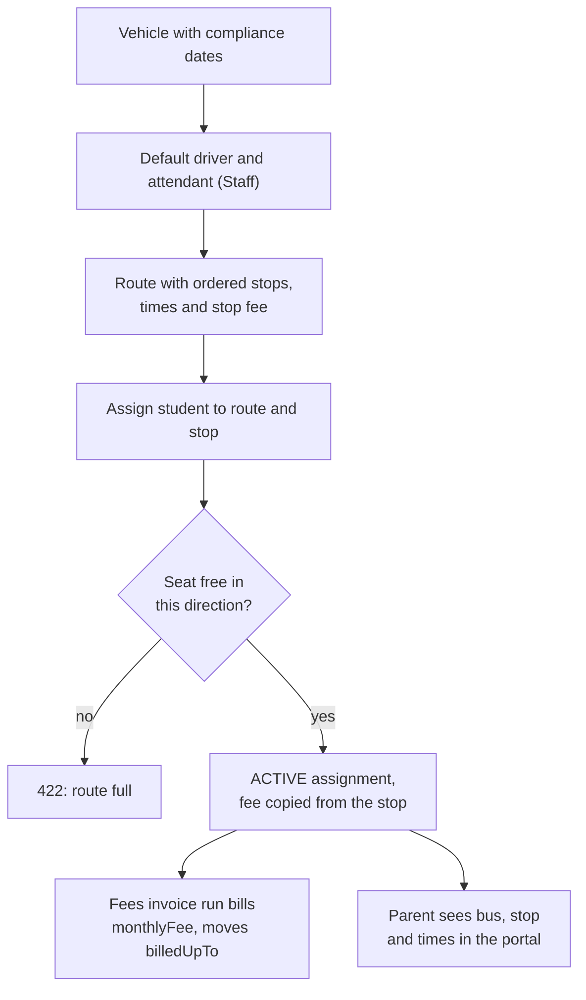
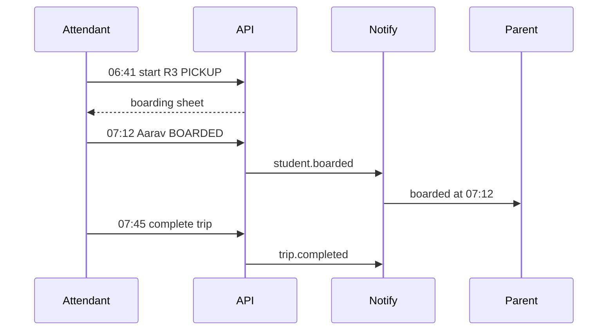
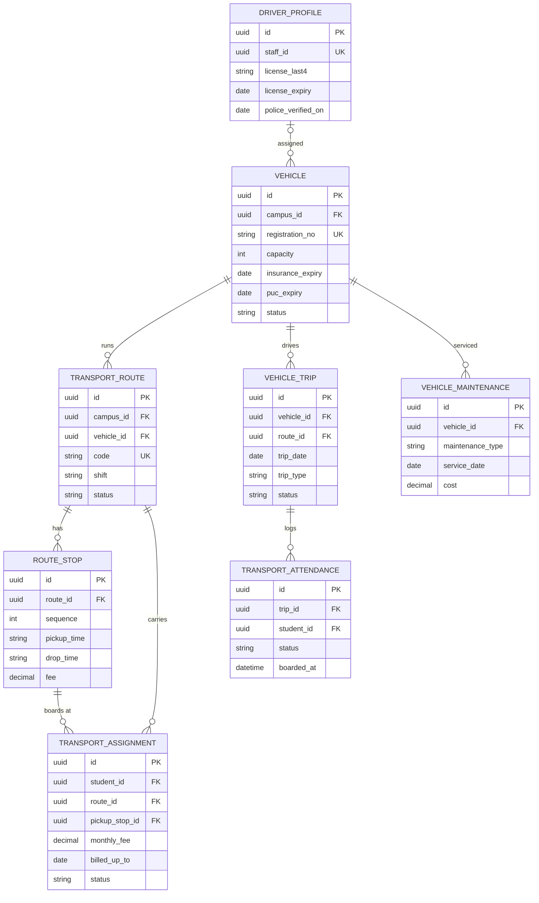

# Transport Module

**In simple words:** Many schools run their own buses and vans. Today the transport in-charge keeps routes in a register, parents phone the office to ask where the bus is, and transport fees are typed by hand on each invoice. This module holds vehicles, drivers, routes, stops and seats in one place, bills the stop fee through the normal fee invoice, logs every trip, and tells the parent the moment the child boards or gets off. It also warns before an insurance, fitness or pollution certificate expires, so no bus runs illegally.

| Item | Value |
|---|---|
| Module code | TRN |
| Release phase | Phase 3 (V1.5), by June 2027 |
| Plans | Pro, Enterprise (feature `module.TRN`); not Starter or Growth |
| Main users | Transport Manager, driver and bus attendant (custom roles), Organization Admin, Principal, Parent, Student |
| Depends on | Multi Campus, Student Profile, Batch, Staff, Fees, Settings, Notifications |
| Used by | Fees, Parent Portal, Student Portal, Dashboard, Analytics |
| Main tables | `vehicles`, `driver_profiles`, `transport_routes`, `route_stops`, `transport_assignments`, `vehicle_trips`, `transport_attendance`, `vehicle_maintenances` |
| Endpoints | TRN-API-01 to TRN-API-50 |
| Build prompt | P-45 |

## Objective

1. Every bus student has a route, stop, pickup time and fee in EduFlow before the first school day, and seat use never crosses the vehicle capacity.
2. A parent gets a "boarded" or "dropped" alert within 60 seconds of the mark (target), and always gets a "not boarded" alert.
3. No trip starts with an expired insurance, fitness certificate, PUC or permit, or with a driver whose licence has expired.
4. Transport fees flow from the assignment into the *Fees Module* invoice run: nobody types them, nothing is billed twice, and a mid-year change is prorated (charged only for the days on each route).
5. A Transport Manager sets up a 10-route school with 400 bus students in one working day.

## Scope

### In scope

- Vehicles with type, capacity, contractor flag, four compliance expiry dates (insurance, fitness, PUC — pollution-under-control certificate, permit), GPS fields and default crew.
- Driver profiles on a Staff record: encrypted licence, licence expiry, badge, police verification, medical check.
- Routes per campus and shift, with ordered stops, pickup and drop times, map point and a monthly fee per stop.
- Student assignments with service type, seat check, suspend, resume, end, bulk assign and Excel import.
- Hand-off to Fees: TRANSPORT fee head, billing frequency, `billedUpTo`, proration of a mid-year change.
- Daily trips from a worker, start and complete with odometer and fuel, boarding marks and parent alerts.
- Maintenance log with bill upload, compliance alerts, rosters, exports, parent and student bus views.

### Out of scope

- Live GPS map and ETA (estimated time of arrival): device fields are stored, the integration comes in Phase 4.
- Automatic route planning from home addresses.
- Collecting the fee (*Payments Module*), driver salaries (*Payroll Module*), fuel stock (*Inventory Module*).
- Staff transport and public-transport passes.

### Phase notes

| Phase | What ships |
|---|---|
| Phase 1 and 2 | Transport is only an item inside a fee structure (see *Fees Module*) |
| Phase 3 (V1.5) | Everything in scope; crew use the responsive web app on their phone |
| Phase 4 (V2.0) | GPS webhooks, live bus position and ETA in the parent app (assumption) |

## User Stories

| ID | As a | I want to | So that | Priority |
|---|---|---|---|---|
| TRN-US-01 | Transport Manager | add vehicles with insurance, fitness, PUC and permit dates | no document expires unseen | Must |
| TRN-US-02 | Transport Manager | add a driver profile with licence and police verification | only checked drivers carry children | Must |
| TRN-US-03 | Transport Manager | create routes with ordered stops, times and a fee per stop | parents and invoices get the right numbers | Must |
| TRN-US-04 | Transport Manager | assign a student to a route and stop with a seat check | a bus is never overfilled | Must |
| TRN-US-05 | Transport Manager | assign a whole batch or import an Excel sheet | 400 students take hours, not days | Should |
| TRN-US-06 | Accountant | see transport charges on the normal fee invoice | I never type transport fees | Must |
| TRN-US-07 | Transport Manager | move a student to another stop mid-year | the difference is prorated, not double billed | Must |
| TRN-US-08 | Bus attendant | mark each child boarded or dropped on my phone | the school knows who is on the bus | Must |
| TRN-US-09 | Parent | get an alert when my child boards and leaves the bus | I stop calling the office | Must |
| TRN-US-10 | Parent | see route, stop, times, vehicle and whom to call | I know where and when to wait | Must |
| TRN-US-11 | Transport Manager | log services, repairs and renewals with the bill | I know each bus's cost and next due date | Should |
| TRN-US-12 | Principal | see today's trips, late starts and missed children | I can act fast on safety | Should |
| TRN-US-13 | Student | see my bus, stop and times | I do not depend on my parent's phone | Could |

## Workflow

### From vehicle to invoice

**Figure: Transport set-up and billing flow**



Set-up runs once per session. After that the assignment drives both the invoice and the parent view, and the seat check counts pickup and drop seats apart (TRN-BR-08).

1. **Vehicle.** Ramesh Yadav, Transport Supervisor at Bright Future Public School, adds bus `UP32 AB 4521` (40 seats, insurance 25 Sep 2027) with TRN-API-02.
2. **Crew.** He adds a profile for Mohan Lal (licence 14 Mar 2029) with TRN-API-09, then sets him and Kamla Devi as the bus default crew.
3. **Route.** He creates "Route 3 - Gomti Nagar" (code `R3`) with five stops, times and fees (TRN-API-13).
4. **Assign.** On 1 April 2027 Aarav Sharma (10-A) gets stop "Patrakarpuram Chauraha", ₹1,800 a month, quarterly (TRN-API-25).
5. **Bill and see.** The quarterly run adds ₹5,400 and sets `billedUpTo`; Sunita Devi sees pickup 07:12 and the crew numbers (TRN-API-49).

### A school day on the bus

**Figure: Daily pickup trip with boarding alert**



The worker creates tomorrow's trips at 20:00, so a bus or driver can still be swapped at night. Each mark sends at most one alert per child per trip.

1. At 06:41 on Monday 16 August 2027 Kamla Devi opens her trips (TRN-API-38) and starts the R3 pickup at 48,210 km (TRN-API-39).
2. At 07:12 she marks Aarav `BOARDED` at stop 4 (TRN-API-41) and Sunita Devi gets the alert.
3. At 07:45 every child carries a mark, so she completes the trip at 48,232 km (TRN-API-42).
4. The 14:00 drop trip runs the same way; each child ends `DROPPED`, `NOT_BOARDED` or `ABSENT`.

### Status lifecycle

| Object | From | To | How | Effect |
|---|---|---|---|---|
| Trip | (none) | `SCHEDULED` | Worker at 20:00, or TRN-API-35 | Crew copied from the vehicle |
| Trip | `SCHEDULED` | `IN_PROGRESS` | TRN-API-39 | Start time, odometer, compliance check |
| Trip | `IN_PROGRESS` | `COMPLETED` | TRN-API-42 | All marked; vehicle odometer updated |
| Assignment | (none) | `ACTIVE` | TRN-API-25, 31, 32 | Seat taken; billing starts at `startDate` |
| Assignment | `ACTIVE` | `SUSPENDED` | TRN-API-28 | Seat kept; off the sheets; no new billing |
| Assignment | `SUSPENDED` | `ACTIVE` | TRN-API-29 | Seat re-checked; billing restarts |
| Assignment | `ACTIVE`, `SUSPENDED` | `ENDED` | TRN-API-30, year close | `endDate` set; future billing stops |
| Vehicle | `ACTIVE` | `UNDER_MAINTENANCE` | TRN-API-04 | No trips generated for its routes |

## Screens and Wireframes

| ID | Screen | Users | Purpose | APIs |
|---|---|---|---|---|
| TRN-S01 | Transport dashboard | Manager, Principal, Org Admin | Counters, seat use, trips, alerts | TRN-API-18 |
| TRN-S02 | Vehicles list | Manager, Principal | Filter by campus, type, status | TRN-API-01, 05 |
| TRN-S03 | Vehicle detail | Manager | Dates, crew, routes, services | TRN-API-03, 04, 45 |
| TRN-S04 | Drivers and attendants | Manager | Licence and verification state | TRN-API-08 to 11 |
| TRN-S05 | Route builder | Manager | Ordered stops, times, fees | TRN-API-13 to 15, 19, 20, 22 |
| TRN-S06 | Assign students | Manager | Student or batch, stop, seat meter | TRN-API-17, 25, 31, 32 |
| TRN-S07 | Assignments and roster | Manager, Accountant (view) | Change, suspend, end, print | TRN-API-21, 24, 26 to 30, 33 |
| TRN-S08 | Trips board | Manager, Principal | Today's trips, late starts, gaps | TRN-API-34 to 37, 43 |
| TRN-S09 | My trips and boarding sheet | Driver, attendant (mobile) | Start, mark, complete | TRN-API-38 to 42 |
| TRN-S10 | Bus tab in Parent Portal | Parent (mobile) | Bus, stop, times, crew, today | TRN-API-49 |
| TRN-S11 | My bus in Student Portal | Student | Own route, stop and times | TRN-API-50 |
| TRN-S12 | Compliance alerts | Manager, Principal, Org Admin | Documents, licences, services due | TRN-API-07 |
| TRN-S13 | Maintenance log | Manager | Services, repairs, renewals, cost | TRN-API-45 to 48 |

Assignment import (TRN-API-32) reuses the shared import wizard. Settings live in *Settings Module* screen SET-S18.

**Screen TRN-S05 — Route builder (Transport Manager, web)**

```text
+--------------------------------------------------------------------------+
| EduFlow | Bright Future Public School   [Search...]   Campus [LKO v]     |
+------------+-------------------------------------------------------------+
| Dashboard  | Transport > Routes > Route 3 - Gomti Nagar  (R3)            |
| Transport <+-------------------------------------------------------------+
|  Vehicles  | Vehicle [UP32 AB 4521 - Bus 40 seats v]  Shift [MORNING v]  |
|  Drivers   | Driver  [Mohan Lal v]    Attendant [Kamla Devi v]           |
|  Routes  < | Start [Gomti Nagar Vistar_]  End [School Gate_____] 14.6 km |
|  Assign    |-------------------------------------------------------------|
|  Trips     | #  Stop name              Pickup  Drop    Fee/mo   Students |
|  Service   | 1  Vikas Khand Gate        06:55  14:55   Rs 2,000     6    |
|  Reports   | 2  Vinay Khand Park        07:02  14:48   Rs 1,900     9    |
| Fees       | 3  Ram Ram Bank Chauraha   07:08  14:41   Rs 1,800    11    |
| Settings   | 4  Patrakarpuram Chauraha  07:12  14:36   Rs 1,800     8    |
|            | 5  Polytechnic Crossing    07:20  14:28   Rs 1,600     4    |
|            |-------------------------------------------------------------|
|            | Seats used: pickup 38 of 40    drop 36 of 40                |
|            | [+ Add stop] [Reorder] [Print roster] [Cancel] [Save route] |
+------------+-------------------------------------------------------------+
```

- [+ Add stop] calls TRN-API-19, [Reorder] TRN-API-20, an inline row edit TRN-API-22, [Save route] TRN-API-15.
- The seat meter reads `seatUse` from TRN-API-14 and turns red at 100 percent. A move to a smaller vehicle is blocked (TRN-BR-08).

**Screen TRN-S06 — Assign students to a route (Transport Manager, web)**

```text
+--------------------------------------------------------------------------+
| EduFlow | Bright Future Public School   [Search...]   Campus [LKO v]     |
+------------+-------------------------------------------------------------+
| Dashboard  | Transport > Assign students          Year [2027-28 v]       |
| Transport <+-------------------------------------------------------------+
|  Vehicles  | Mode (o) One student  ( ) Whole batch  ( ) Excel import     |
|  Drivers   | Student [Aarav Sharma - BF-2027-0142 v]   Class 10-A        |
|  Routes    |-------------------------------------------------------------|
|  Assign  < | Route  [R3 - Route 3 Gomti Nagar v]   Seats: 38 / 40        |
|  Trips     | Service (o) Both ways ( ) Pickup only ( ) Drop only         |
|  Service   | Pickup stop [4 Patrakarpuram Chauraha 07:12 v]              |
|  Reports   | Drop stop   [4 Patrakarpuram Chauraha 14:36 v]              |
| Fees       |-------------------------------------------------------------|
| Settings   | Monthly fee Rs [ 1800.00 ]  (stop fee Rs 1,800) [x] Use fee |
|            | Billing [Quarterly v]   Start date [01 Apr 2027]            |
|            | Fee head [Transport Fee v]     Note [__________________]    |
|            |-------------------------------------------------------------|
|            | First invoice: Apr-Jun 2027 = Rs 5,400 (3 x Rs 1,800)       |
|            |                           [Cancel]  [Assign and save]       |
+------------+-------------------------------------------------------------+
```

- The seat counter refreshes on every route change (TRN-API-17); a full route shows "Full" and the save is refused with `422`.
- Unticking [x] Use fee allows a different fee; the reason goes into Note and the audit log (TRN-BR-07).
- The preview line is what the next invoice run will bill (TRN-BR-11); no invoice is made here. [Assign and save] calls TRN-API-25, or TRN-API-31 for a batch.

**Screen TRN-S09 — Boarding sheet (bus attendant, mobile web)**

```text
+------------------------------------+
| EduFlow Transport      Kamla Devi  |
+------------------------------------+
| R3 PICKUP  Mon 16 Aug 2027         |
| Bus UP32 AB 4521   IN_PROGRESS     |
| Started 06:41   Odo 48,210 km      |
+------------------------------------+
| Stop 4 Patrakarpuram  07:12        |
| Marked 2 of 3                      |
+------------------------------------+
| Aarav Sharma  10-A                 |
|  [BOARDED 07:12]   [Not boarded]   |
| Ishita Verma  8-B                  |
|  [Boarded] [Not boarded] [Absent]  |
| Rohit Singh   6-C                  |
|  [Boarded]  [NOT BOARDED 07:13]    |
+------------------------------------+
| Stop 5 Polytechnic    07:20        |
| Marked 0 of 4                      |
+------------------------------------+
| Left to mark: 5   Queued: 0        |
| [Mark all boarded] [Complete trip] |
+------------------------------------+
```

- The sheet (TRN-API-40) groups children by stop in pickup order, with class and admission number under each name.
- One tap marks a child and shows the time. Taps queue in the browser and go out with TRN-API-41, so weak signal never loses a mark.
- [Complete trip] calls TRN-API-42 and asks for the closing odometer and fuel; it stays disabled while "Left to mark" is above zero.

**Screen TRN-S10 — Bus tab (Parent Portal, mobile)**

```text
+------------------------------------+
| Bright Future  | Aarav Sharma 10-A |
+------------------------------------+
| [Fees] [Attendance] [Bus] [More]   |
+------------------------------------+
| TODAY  Mon 16 Aug 2027             |
| Boarded 07:12 at Patrakarpuram     |
| Dropped 14:38 at Patrakarpuram     |
+------------------------------------+
| MY BUS                             |
| Route   R3 - Gomti Nagar           |
| Bus     UP32 AB 4521 (Bus)         |
| Stop    Patrakarpuram Chauraha     |
| Pickup  07:12     Drop  14:36      |
| Service Both ways                  |
+------------------------------------+
| CREW                               |
| Driver    Mohan Lal      [Call]    |
| Attendant Kamla Devi     [Call]    |
| Transport desk 0522-4001 [Call]    |
+------------------------------------+
| FEE                                |
| Rs 1,800 / month, billed quarterly |
| Billed up to 30 Jun 2027           |
+------------------------------------+
```

- [Call] dials a masked number of the child's own crew (TRN-BR-20).
- A missing pickup mark after the trip closes shows "Not boarded" in red with the office number.

**Screen TRN-S12 — Compliance alerts (Transport Manager, web)**

```text
+--------------------------------------------------------------------------+
| EduFlow | Bright Future Public School   [Search...]   Campus [All v]     |
+------------+-------------------------------------------------------------+
| Dashboard  | Transport > Compliance alerts     Within [30 days v]        |
| Transport <+-------------------------------------------------------------+
|  Vehicles  | Item             What            Due date      Days  Level  |
|  Drivers   |-------------------------------------------------------------|
|  Routes    | UP32 AB 4521     PUC             24 Aug 2027      8   RED   |
|  Assign    | UP32 AB 4521     Insurance       25 Sep 2027     40   OK    |
|  Trips     | UP32 CD 1189     Fitness         02 Sep 2027     17   AMBER |
|  Service < | UP32 CD 1189     Service due     28 Aug 2027     12   AMBER |
|  Reports   | Mohan Lal        Licence HMV     14 Mar 2029    575   OK    |
| Fees       | Sanjay Kumar     Licence LMV     05 Sep 2027     20   AMBER |
| Settings   | Sanjay Kumar     Police check    none on file      -   RED   |
|            |-------------------------------------------------------------|
|            | Expired items block trip start.  2 red, 3 amber.            |
|            | [Record renewal]  [Send to Principal]  [Export XLSX]        |
+------------+-------------------------------------------------------------+
```

- The list comes from TRN-API-07 with `withinDays` from the filter; red is 7 days or fewer, amber 8 to 30.
- [Record renewal] opens the maintenance form with the type filled in; TRN-API-46 then writes the new expiry on the vehicle.

## UI Components

| Component | Type | Behaviour |
|---|---|---|
| `SeatMeter` | Progress bar | Pickup and drop bars side by side; amber above 90 percent, red at 100; tooltip gives free seats |
| `StopEditor` | Sortable list | Drag to re-sequence; inline edit of time, fee, landmark; new rows take the next sequence |
| `RoutePicker` | Combobox | Code, name, shift, free seats; a full route shows "Full" and cannot be picked |
| `ServiceTypeRadio` | Radio group | `PICKUP_ONLY` hides and clears the drop stop; `BOTH` fills both stops alike |
| `ComplianceBadge` | Badge | Green over 30 days, amber 8 to 30, red 7 or fewer or expired, grey when no date |
| `BoardingRow` | Mobile list row | Large tap targets, optimistic mark, grey while queued, long press clears a wrong mark |
| States | Skeleton, empty, error, offline | Skeleton rows while loading; "Add your first route" when empty; offline banner with queue count |

## Validation Rules

| Field | Rule | Error message shown to user |
|---|---|---|
| `registrationNo` | 4 to 20 characters of A-Z, 0-9, space, hyphen; unique in the organization | "Vehicle UP32 AB 4521 is already registered." |
| `capacity` | Required, 1 to 100 seats | "Enter a seat count between 1 and 100." |
| `licenseExpiry` | Required; a future date when the profile is created | "This licence expired on {date}. Such a driver cannot be added." |
| Route `code` | 1 to 20 characters; unique per campus | "Route code R3 is already used at this campus." |
| Stop time order | Pickup times rise with the sequence, drop times fall | "Stop 4 picks up at 07:12, before stop 3 at 07:08." |
| Stop `fee` | 0 to 99,999.99, two decimals | "Enter a monthly fee such as 1800.00." |
| `serviceType` and stops | `BOTH` both stops, `PICKUP_ONLY` pickup, `DROP_ONLY` drop | "Choose a pickup stop for this service type." |
| Assignment stops | Both stops belong to the chosen route | "Stop {name} is not on route {code}." |
| `startDate` | Inside the academic year, at most 60 days ahead | "Start date must be inside the session 01 Apr 2027 to 31 Mar 2028." |
| `monthlyFee` | 0 to 99,999.99; a value unlike the stop fee needs a note | "Write a short reason for the changed fee." |
| Duplicate assignment | One `ACTIVE` assignment per student per year | "Aarav Sharma already uses route R3 this session." |
| Seat capacity | At least one free seat in that direction | "Route R3 is full: 40 of 40 pickup seats are used." |
| `endDate` | Not before `startDate` and not before `billedUpTo` | "End date cannot be before 30 Jun 2027, which is billed." |
| Import file | XLSX or CSV, up to 2,000 rows | "The file has {n} rows. Use files of 2,000 rows or fewer." |

## Business Rules

### Settings, plan and compliance

**TRN-BR-01 — Transport settings.** `OrganizationSetting` rows of the group `transport`, read and written with SET-API-02 and SET-API-03. Assumption: these keys and defaults are fixed.

| Key | Default | Campus row | Meaning |
|---|---|---|---|
| `transport.document_alert_days` | `[30, 15, 7, 1]` | No | Days before expiry an alert fires |
| `transport.trip_generation_time` | `"20:00"` | Yes | When next-day trips are created |
| `transport.not_boarded_alert_minutes` | `10` | Yes | Wait after stop time before "not boarded" |
| `transport.proration_method` | `"DAILY"` | No | `DAILY` or `WHOLE_MONTH` on a mid-period change |
| `transport.fee_head_id` | `null` | No | TRANSPORT fee head used on invoices |
| `transport.default_billing_frequency` | `"QUARTERLY"` | Yes | Default on a new assignment |
| `transport.seat_buffer` | `0` | Yes | Seats kept free for late joiners |
| `transport.crew_contact_visible` | `true` | Yes | Show masked crew phone in the portals |

**TRN-BR-02 — Plan gating.** Pro and Enterprise only. Growth sees a locked menu and every TRN endpoint answers `403 PLAN_LIMIT_REACHED`; Starter sees nothing. After a downgrade the data stays readable for 90 days and no new trip is generated.

**TRN-BR-03 — Compliance alerts.** A daily 07:00 job watches the four expiry dates of every `ACTIVE` vehicle, `licenseExpiry` of every `DriverProfile` and the latest `nextDueDate`. It alerts on each day in `document_alert_days`, then daily once the date has passed. Red is 7 days or fewer and expired, amber 8 to 30, green above 30, grey with no date. An empty `policeVerifiedOn` is red, because Indian school-transport guidelines expect police verification.

**TRN-BR-04 — Vehicle status.** `UNDER_MAINTENANCE` keeps the vehicle on its routes, but the nightly job skips it and raises a task to run a replacement bus (TRN-API-37). `RETIRED` and TRN-API-05 answer `422` while an `ACTIVE` route points at the vehicle.

**TRN-BR-05 — Driver profile.** A driver is a `Staff` row plus one `DriverProfile`; `staffId` is unique. The licence is AES-256-GCM ciphertext in `licenseNoEncrypted` and only `licenseLast4` leaves the server. TRN-API-11 is refused while the profile is a vehicle's default driver.

### Routes, stops and seats

**TRN-BR-06 — Stop order.** Stops run from 1 in pickup order with no gaps; TRN-API-20 rewrites the list in one transaction, so `(organizationId, routeId, sequence)` never breaks. Pickup times rise with the sequence and drop times fall, because the drop run is the pickup run reversed.

**TRN-BR-07 — The stop fee is the price.** `RouteStop.fee` is copied into `TransportAssignment.monthlyFee` when the student is assigned, so a later stop-fee change never moves a running bill. An override (a staff child who pays nothing) needs a note and an audit entry, and the save shows how many running assignments keep the old amount.

**TRN-BR-08 — Seat capacity, counted per direction.** A `PICKUP_ONLY` child uses a morning seat and no afternoon seat, so the directions are counted apart.

```text
usedPickup = count(assignments WHERE routeId = R AND status IN
              ('ACTIVE','SUSPENDED') AND pickupStopId IS NOT NULL)
usedDrop   = count(assignments WHERE routeId = R AND status IN
              ('ACTIVE','SUSPENDED') AND dropStopId IS NOT NULL)
free       = vehicle.capacity - transport.seat_buffer - used<direction>
```

> **Example:** R3 runs bus UP32 AB 4521, 40 seats, buffer 0, with 34 students both ways, 4 pickup only and 2 drop only. `usedPickup` = 38 and `usedDrop` = 36, so 2 morning and 4 afternoon seats are free. One more `BOTH` student fits; the next gets `422`, "Route R3 is full: 40 of 40 pickup seats are used." A `SUSPENDED` student keeps the seat.

**TRN-BR-09 — One assignment per student per year.** The partial unique index `uq_transport_assignment_active` on `(organization_id, student_id, academic_year_id) WHERE status = 'ACTIVE' AND deleted_at IS NULL` enforces it, so two parallel requests cannot both win; the loser gets `409 CONFLICT` with the running id.

**TRN-BR-10 — Service type and stops.** `BOTH` needs both stop ids, `PICKUP_ONLY` only `pickupStopId`, `DROP_ONLY` only `dropStopId`, and both must sit on `routeId`. They may differ — picked up near home, dropped at a grandparent's stop — and the fee then follows the higher stop fee.

### Billing and proration

**TRN-BR-11 — How Fees bills transport.** The invoice worker reads every `ACTIVE` assignment whose `billedUpTo` is before the end of the period. It writes one `FeeInvoiceItem` with the assignment's `feeHeadId`, `transportAssignmentId` and the period, and moves `billedUpTo` in the same transaction, so a retried job cannot bill a period twice.

```text
months  = months in the billing period (MONTHLY 1, QUARTERLY 3,
          HALF_YEARLY 6, ANNUAL 12)
amount  = monthlyFee x months
joining mid-month, DAILY proration:
amount  = round(monthlyFee x daysServed / daysInMonth, 2) + full months
```

> **Example:** Aarav joins R3 on 1 April 2027 at ₹1,800, QUARTERLY. The April run bills ₹5,400 for 01 Apr to 30 Jun and sets `billedUpTo` to 30 Jun 2027. Ishita Verma joins on 18 April and uses 13 of April's 30 days: 1,800 × 13 / 30 = ₹780.00 plus ₹3,600 for May and June, so her first line is ₹4,380.00.

**TRN-BR-12 — Mid-year route or stop change.** TRN-API-27 never creates a second assignment. It updates the running one and books the difference as one adjustment line on the next invoice.

```text
dailyOld = oldMonthlyFee x monthsInPeriod / daysInPeriod
dailyNew = newMonthlyFee x monthsInPeriod / daysInPeriod
daysLeft = days from the change date to billedUpTo, inclusive
adjust   = round((dailyNew - dailyOld) x daysLeft, 2)
```

> **Example:** Aarav moves from stop 4 (₹1,800) to stop 1 (₹2,000) on 12 November 2027. Oct–Dec is invoiced at ₹5,400 and `billedUpTo` is 31 Dec 2027. The quarter has 92 days, so `dailyOld` = ₹58.6957, `dailyNew` = ₹65.2174 and `daysLeft` = 50. `adjust` = ₹326.09. January's invoice shows "Transport stop change 12 Nov 2027, 50 days, Rs 326.09", `monthlyFee` becomes ₹2,000 and `billedUpTo` does not move.

With `WHOLE_MONTH` the new fee starts from the first of the month of the change when it falls on or before the 15th, otherwise from the next month. A cheaper stop gives a credit line.

**TRN-BR-13 — Suspend, resume and end.** `SUSPENDED` keeps the seat, drops the child from future sheets and stops new billing; an invoiced period is not refunded, because the bus did run. Resume re-checks the seat and restarts billing from the resume date with the TRN-BR-12 formula and `dailyOld` = 0. `ENDED` sets `endDate`, and unused days inside a paid period become a credit note in the *Fees Module*.

> **Example:** Rohit Singh is suspended on 5 October 2027 and resumes on 20 October. The ₹5,400 quarter was billed and he is off the bus 15 days, so January carries a credit of 58.6957 × 15 = ₹880.44.

### Trips, boarding and vehicles

**TRN-BR-14 — Nightly trip generation.** A BullMQ repeatable job runs at `trip_generation_time` per campus and creates a `PICKUP` and a `DROP` trip for the next working day for every `ACTIVE` route with an `ACTIVE` vehicle, with the vehicle's default crew. It skips holidays, weekly offs, `UNDER_MAINTENANCE` vehicles and a date that already has a trip, because `(organizationId, vehicleId, routeId, tripDate, tripType)` is unique. `SPECIAL` trips are made by hand with TRN-API-35.

**TRN-BR-15 — Trip start gate.** TRN-API-39 answers `422` when, on the trip date, insurance, fitness, PUC or permit has expired, the driver has no `DriverProfile`, the licence has expired, or `policeVerifiedOn` is empty. Every failing item is listed at once. Only an ORG_ADMIN may override, and the reason goes to `incidentNotes` and the audit log.

**TRN-BR-16 — Marks and alerts.** One `TransportAttendance` row exists per trip and student, and `(organizationId, tripId, studentId)` makes TRN-API-41 idempotent, so a retried tap sends no second alert. The first write of a status sends the alert and sets `notifiedAt`. A correction inside 5 minutes sends a correction message; after that only a Transport Manager may change it. A child unmarked `not_boarded_alert_minutes` past the stop time is set `NOT_BOARDED` by the watcher job.

**TRN-BR-17 — Trip completion.** TRN-API-42 needs a mark on every expected child, otherwise `422` with the count missing. It sets `endedAt`, `endOdometerKm`, `fuelLitres` and `studentsBoarded` (`BOARDED` plus `DROPPED`) and copies the closing reading to `Vehicle.odometerKm`. A trip still `IN_PROGRESS` at 23:00 is closed by the nightly job with the note "auto closed".

**TRN-BR-18 — Maintenance and renewals.** `INSURANCE_RENEWAL`, `FITNESS_RENEWAL` and `PUC_RENEWAL` write their `nextDueDate` onto the matching vehicle field in the same transaction, so the alert clears at once. `SERVICE` sets the next service date and odometer.

```text
costPerKm  = sum(maintenance.cost in period) / sum(trip distance)
kmPerLitre = sum(trip distance) / sum(fuelLitres)
```

> **Example:** UP32 AB 4521 in 2027-28: maintenance ₹84,600, distance 26,400 km, fuel 3,300 litres. Cost per km ₹3.20, mileage 8.0 km per litre. Both let the owner compare an owned bus with a hired one.

**TRN-BR-19 — Year rollover.** Assignments are not copied to a new `AcademicYear` on their own. "Carry forward" on TRN-S07 creates new `ACTIVE` rows at the current stop fee with empty `billedUpTo`, skips students who left, and ends the old rows on the last day of the old session.

**TRN-BR-20 — Safety and privacy.** Parents and students see the crew name and a masked phone (`98XXXXXX21`) only when `crew_contact_visible` is true and only for their own route; [Call] runs through the masked number of the *Notifications Module*. No endpoint returns a licence number. Boarding rows are kept for the session plus three years, because they are a safety register.

## Acceptance Criteria

| ID | Given | When | Then |
|---|---|---|---|
| TRN-AC-01 | Mohan Lal, licence to 14 Mar 2029 | A driver profile is created | `201`, only `licenseLast4` in the response |
| TRN-AC-02 | R3 at 38 of 40 pickup seats | A `BOTH` student is assigned | `201`, `usedPickup` 39, meter shows 1 free |
| TRN-AC-03 | R3 at 40 of 40 pickup seats | A `BOTH` student is assigned | `422`, "Route R3 is full", nothing saved |
| TRN-AC-04 | ₹1,800, quarterly, from 01 Apr 2027 | The Q1 invoice run executes | One line of ₹5,400, `billedUpTo` 30 Jun 2027 |
| TRN-AC-05 | The run is retried after a crash | The quarter is billed again | No second line, `billedUpTo` unchanged |
| TRN-AC-06 | Oct–Dec billed, stop fee ₹1,800 to ₹2,000 | The change is saved on 12 Nov | `200`, one adjustment of ₹326.09 is queued |
| TRN-AC-07 | The PUC expired yesterday | The attendant starts the trip | `422` naming the PUC, trip stays `SCHEDULED` |
| TRN-AC-08 | An `IN_PROGRESS` pickup trip | Aarav is marked `BOARDED` at 07:12 | `200`, one alert to Sunita Devi, `notifiedAt` set |
| TRN-AC-09 | The offline queue resends the mark | The second request arrives | `200`, row unchanged, no second alert |
| TRN-AC-10 | Six of eight children marked | The attendant completes the trip | `422`, "2 students are not marked yet" |
| TRN-AC-11 | All marked, start odometer 48,210 | Complete with 48,232 km, 12.4 litres | `200`, `COMPLETED`, `Vehicle.odometerKm` 48,232 |
| TRN-AC-12 | Sunita Devi opens the Bus tab | TRN-API-49 is called | Route, stop, times, bus, masked crew, today's marks |
| TRN-AC-13 | A Growth tenant | Any TRN endpoint is called | `403 PLAN_LIMIT_REACHED` with the upgrade message |

## Edge Cases

| Case | What happens | How the system handles it |
|---|---|---|
| Bus breaks down at 06:50 with children aboard | The trip cannot finish normally | "Report incident" stores the note, alerts the manager, sends "Bus delayed" to parents of unmarked children; the trip closes with the marks taken |
| A replacement bus runs the route | Trip vehicle differs from route vehicle | TRN-API-37 changes only the `SCHEDULED` trip; the compliance check runs on the new bus |
| No mobile signal for the whole route | Marks cannot reach the API | Marks queue in IndexedDB with device times and are sent on reconnect, clamped to the trip window |
| Route deleted while students use it | Rows would be orphaned | TRN-API-16 answers `422` with the count of assignments to move first |
| Student leaves school mid-quarter | The bus fee is already invoiced | Withdrawal ends the assignment on the leaving date and credits the unused days (TRN-BR-13) |
| Insurance expires on a Sunday | Nobody is at school to renew | Day 7 and day 1 alerts go out on WhatsApp; Monday's start is blocked until the renewal is recorded |
| The same import file is uploaded twice | Duplicates would be created | The key is `(studentId, academicYearId)`; a row with a running assignment is skipped as "already assigned" |
| A driver leaves in mid-session | Vehicles point at a gone driver | The *Staff Module* exit clears `driverId` and `attendantId` and raises "Assign a new driver to UP32 AB 4521" |

## Database Schema

The module owns the eight tables listed in the chapter header. Every one has `id` (uuid PK, `uuid()`), `organization_id` (FK `organizations`), `created_at` and `updated_at`; all but `vehicle_trips` and `transport_attendance` also carry `deleted_at`. These are not repeated below.

### Table vehicles

| Column | Type | Null | Default | Notes |
|---|---|---|---|---|
| `campus_id` | uuid | No | | FK `campuses`, restrict |
| `registration_no` | varchar(20) | No | | Unique per organization |
| `vehicle_type` | `VehicleType` | No | `BUS` | |
| `make`, `model` | varchar(60) | Yes | | Tata, Starbus Ultra |
| `manufacture_year` | smallint | Yes | | |
| `capacity` | smallint | No | | Student seats; drives TRN-BR-08 |
| `fuel_type` | varchar(20) | Yes | | Diesel, CNG, Electric |
| `is_contracted`, `contractor_name` | boolean, varchar(150) | No, Yes | `false` | Hired bus |
| `insurance_expiry`, `fitness_expiry` | date | Yes | | Alerts, start gate |
| `puc_expiry`, `permit_expiry` | date | Yes | | Alerts, start gate |
| `gps_device_id`, `gps_provider` | varchar(60) | Yes | | Used from Phase 4 |
| `driver_id`, `attendant_id` | uuid | Yes | | FK `staff`, set null |
| `odometer_km` | integer | Yes | | Set on trip completion |
| `status` | `VehicleStatus` | No | `ACTIVE` | |

Constraints: unique (`organization_id`, `registration_no`); indexes (`organization_id`, `campus_id`, `status`) and (`organization_id`, `insurance_expiry`).

### Table transport_assignments

| Column | Type | Null | Default | Notes |
|---|---|---|---|---|
| `campus_id`, `student_id` | uuid | No | | FK, restrict |
| `academic_year_id` | uuid | No | | FK `academic_years` |
| `route_id` | uuid | No | | FK `transport_routes` |
| `pickup_stop_id`, `drop_stop_id` | uuid | Yes | | FK `route_stops`; by service type |
| `service_type` | `TransportServiceType` | No | `BOTH` | |
| `start_date`, `end_date` | date | No, Yes | | Billing window |
| `monthly_fee`, `currency` | decimal(12,2), char(3) | No | | Copied from the stop |
| `fee_head_id` | uuid | Yes | | FK `fee_heads`; TRANSPORT head |
| `billing_frequency` | `FeeFrequency` | No | `MONTHLY` | |
| `billed_up_to` | date | Yes | | Last period invoiced |
| `status` | `TransportAssignmentStatus` | No | `ACTIVE` | |
| `notes`, `created_by_id` | varchar(255), uuid | Yes | | Override reason; no FK |

Constraints: partial unique `uq_transport_assignment_active` (`organization_id`, `student_id`, `academic_year_id`) where `status = 'ACTIVE'` and `deleted_at is null`; indexes on student with year and status, on route with status, and on campus with year and status.

### The six other tables

Full columns are in the Prisma section below.

| Table | Shape | Constraints |
|---|---|---|
| `driver_profiles` | Licence (encrypted, last 4, type, expiry), badge, police and medical dates | `staff_id` unique; index on `license_expiry` |
| `transport_routes` | Campus, vehicle, name, code, shift, end points, distance, status | Unique code per campus; indexes on campus status and vehicle |
| `route_stops` | Route, name, sequence, times, landmark, geo, fee, currency, status | Unique sequence per route; index on route status |
| `vehicle_trips` | Campus, vehicle, route, crew, date, type, status, times, odometer pair, boarded count, fuel, notes | Unique vehicle, route, date and type; indexes on campus date and driver date |
| `transport_attendance` | Campus, trip, student, stop, status, times, marked by, notified at | Unique trip and student; indexes on student and campus with `created_at` |
| `vehicle_maintenances` | Campus, vehicle, vendor, type, dates, odometer, cost, bill number, bill file | Indexes on vehicle with service date and on campus with next due date |

**Figure: Transport tables**



The assignment joins a student to a route and two stops; the trip with its boarding rows is the daily safety register.

## Prisma Schema

Copied from `docs/src/_schema/11-operations.prisma`. Back-relation lists are shortened to a comment line; no field is renamed.

```prisma
enum VehicleType {
  BUS
  MINI_BUS
  VAN
  CAR
  AUTO
  OTHER
}

enum VehicleStatus {
  ACTIVE
  UNDER_MAINTENANCE
  RETIRED
}

enum TransportServiceType {
  BOTH
  PICKUP_ONLY
  DROP_ONLY
}

enum TransportAssignmentStatus {
  ACTIVE
  SUSPENDED // e.g. fee hold
  ENDED
}

enum TripType {
  PICKUP
  DROP
  SPECIAL // excursion, event
}

enum TripStatus {
  SCHEDULED
  IN_PROGRESS
  COMPLETED
  CANCELLED
}

enum TransportBoardingStatus {
  BOARDED
  NOT_BOARDED
  DROPPED
  ABSENT
}

enum MaintenanceType {
  SERVICE
  REPAIR
  TYRE
  INSURANCE_RENEWAL
  FITNESS_RENEWAL
  PUC_RENEWAL
  ACCIDENT
  OTHER
}

model Vehicle {
  id              String        @id @default(uuid()) @db.Uuid
  organizationId  String        @map("organization_id") @db.Uuid
  campusId        String        @map("campus_id") @db.Uuid
  registrationNo  String        @map("registration_no") @db.VarChar(20) // e.g. UP32 AB 1234
  vehicleType     VehicleType   @default(BUS) @map("vehicle_type")
  make            String?       @db.VarChar(60)
  model           String?       @db.VarChar(60)
  manufactureYear Int?          @map("manufacture_year") @db.SmallInt
  capacity        Int           @db.SmallInt // seats for students
  fuelType        String?       @map("fuel_type") @db.VarChar(20)
  isContracted    Boolean       @default(false) @map("is_contracted")
  contractorName  String?       @map("contractor_name") @db.VarChar(150)
  insuranceExpiry DateTime?     @map("insurance_expiry") @db.Date
  fitnessExpiry   DateTime?     @map("fitness_expiry") @db.Date
  pucExpiry       DateTime?     @map("puc_expiry") @db.Date
  permitExpiry    DateTime?     @map("permit_expiry") @db.Date
  gpsDeviceId     String?       @map("gps_device_id") @db.VarChar(60)
  gpsProvider     String?       @map("gps_provider") @db.VarChar(60)
  driverId        String?       @map("driver_id") @db.Uuid // default driver (Staff)
  attendantId     String?       @map("attendant_id") @db.Uuid // default attendant (Staff)
  odometerKm      Int?          @map("odometer_km")
  status          VehicleStatus @default(ACTIVE)
  createdAt       DateTime      @default(now()) @map("created_at") @db.Timestamptz(6)
  updatedAt       DateTime      @updatedAt @map("updated_at") @db.Timestamptz(6)
  deletedAt       DateTime?     @map("deleted_at") @db.Timestamptz(6)

  // relations: organization, campus, driver (Staff), attendant (Staff),
  // routes, trips, maintenances

  @@unique([organizationId, registrationNo])
  @@index([organizationId, campusId, status])
  @@index([organizationId, insuranceExpiry]) // expiry alerts
  @@map("vehicles")
}

model DriverProfile {
  id                 String    @id @default(uuid()) @db.Uuid
  organizationId     String    @map("organization_id") @db.Uuid
  staffId            String    @unique @map("staff_id") @db.Uuid
  licenseNoEncrypted String    @map("license_no_encrypted") @db.Text // AES-256-GCM
  licenseLast4       String?   @map("license_last4") @db.VarChar(4) // safe to display
  licenseType        String?   @map("license_type") @db.VarChar(30) // HMV, LMV
  licenseExpiry      DateTime  @map("license_expiry") @db.Date
  badgeNo            String?   @map("badge_no") @db.VarChar(30)
  policeVerifiedOn   DateTime? @map("police_verified_on") @db.Date
  medicalCheckOn     DateTime? @map("medical_check_on") @db.Date
  experienceYears    Int?      @map("experience_years") @db.SmallInt
  createdAt          DateTime  @default(now()) @map("created_at") @db.Timestamptz(6)
  updatedAt          DateTime  @updatedAt @map("updated_at") @db.Timestamptz(6)

  // relations: organization (cascade), staff (cascade)

  @@index([organizationId, licenseExpiry]) // expiry alerts
  @@map("driver_profiles")
}

model TransportRoute {
  id             String       @id @default(uuid()) @db.Uuid
  organizationId String       @map("organization_id") @db.Uuid
  campusId       String       @map("campus_id") @db.Uuid
  vehicleId      String?      @map("vehicle_id") @db.Uuid
  name           String       @db.VarChar(100) // Route 3 - Gomti Nagar
  code           String       @db.VarChar(20)
  shift          Shift        @default(FULL_DAY)
  startPoint     String?      @map("start_point") @db.VarChar(150)
  endPoint       String?      @map("end_point") @db.VarChar(150)
  distanceKm     Decimal?     @map("distance_km") @db.Decimal(6, 2)
  status         RecordStatus @default(ACTIVE)
  createdAt      DateTime     @default(now()) @map("created_at") @db.Timestamptz(6)
  updatedAt      DateTime     @updatedAt @map("updated_at") @db.Timestamptz(6)
  deletedAt      DateTime?    @map("deleted_at") @db.Timestamptz(6)

  // relations: organization, campus, vehicle, stops, assignments, trips

  @@unique([organizationId, campusId, code])
  @@index([organizationId, campusId, status])
  @@index([organizationId, vehicleId])
  @@map("transport_routes")
}

model RouteStop {
  id             String       @id @default(uuid()) @db.Uuid
  organizationId String       @map("organization_id") @db.Uuid
  routeId        String       @map("route_id") @db.Uuid
  name           String       @db.VarChar(120)
  sequence       Int          @db.SmallInt // order from the first pickup
  pickupTime     String?      @map("pickup_time") @db.VarChar(5) // HH:mm, campus tz
  dropTime       String?      @map("drop_time") @db.VarChar(5) // HH:mm, campus tz
  landmark       String?      @db.VarChar(200)
  latitude       Decimal?     @db.Decimal(9, 6)
  longitude      Decimal?     @db.Decimal(9, 6)
  fee            Decimal      @default(0) @db.Decimal(12, 2) // monthly fee from this stop
  currency       String       @db.Char(3)
  status         RecordStatus @default(ACTIVE)
  createdAt      DateTime     @default(now()) @map("created_at") @db.Timestamptz(6)
  updatedAt      DateTime     @updatedAt @map("updated_at") @db.Timestamptz(6)
  deletedAt      DateTime?    @map("deleted_at") @db.Timestamptz(6)

  // relations: organization, route, pickupAssignments, dropAssignments,
  // transportAttendances

  @@unique([organizationId, routeId, sequence])
  @@index([organizationId, routeId, status])
  @@map("route_stops")
}

model TransportAssignment {
  id               String                    @id @default(uuid()) @db.Uuid
  organizationId   String                    @map("organization_id") @db.Uuid
  campusId         String                    @map("campus_id") @db.Uuid
  studentId        String                    @map("student_id") @db.Uuid
  academicYearId   String                    @map("academic_year_id") @db.Uuid
  routeId          String                    @map("route_id") @db.Uuid
  pickupStopId     String?                   @map("pickup_stop_id") @db.Uuid
  dropStopId       String?                   @map("drop_stop_id") @db.Uuid
  serviceType      TransportServiceType      @default(BOTH) @map("service_type")
  startDate        DateTime                  @map("start_date") @db.Date
  endDate          DateTime?                 @map("end_date") @db.Date
  monthlyFee       Decimal                   @map("monthly_fee") @db.Decimal(12, 2)
  currency         String                    @db.Char(3)
  feeHeadId        String?                   @map("fee_head_id") @db.Uuid
  billingFrequency FeeFrequency              @default(MONTHLY) @map("billing_frequency")
  billedUpTo       DateTime?                 @map("billed_up_to") @db.Date
  status           TransportAssignmentStatus @default(ACTIVE)
  notes            String?                   @db.VarChar(255)
  createdById      String?                   @map("created_by_id") @db.Uuid // audit only
  createdAt        DateTime                  @default(now()) @map("created_at") @db.Timestamptz(6)
  updatedAt        DateTime                  @updatedAt @map("updated_at") @db.Timestamptz(6)
  deletedAt        DateTime?                 @map("deleted_at") @db.Timestamptz(6)

  // relations: organization, campus, student, academicYear, route,
  // pickupStop, dropStop, feeHead, feeInvoiceItems
  // partial unique index uq_transport_assignment_active in the SQL migration

  @@index([organizationId, studentId, academicYearId, status])
  @@index([organizationId, routeId, status])
  @@index([organizationId, campusId, academicYearId, status])
  @@map("transport_assignments")
}

model VehicleTrip {
  id              String     @id @default(uuid()) @db.Uuid
  organizationId  String     @map("organization_id") @db.Uuid
  campusId        String     @map("campus_id") @db.Uuid
  vehicleId       String     @map("vehicle_id") @db.Uuid
  routeId         String?    @map("route_id") @db.Uuid // null for SPECIAL trips
  driverId        String?    @map("driver_id") @db.Uuid // Staff who drove
  attendantId     String?    @map("attendant_id") @db.Uuid // Staff attendant on board
  tripDate        DateTime   @map("trip_date") @db.Date
  tripType        TripType   @map("trip_type")
  status          TripStatus @default(SCHEDULED)
  startedAt       DateTime?  @map("started_at") @db.Timestamptz(6)
  endedAt         DateTime?  @map("ended_at") @db.Timestamptz(6)
  startOdometerKm Int?       @map("start_odometer_km")
  endOdometerKm   Int?       @map("end_odometer_km")
  studentsBoarded Int?       @map("students_boarded")
  fuelLitres      Decimal?   @map("fuel_litres") @db.Decimal(6, 2)
  incidentNotes   String?    @map("incident_notes") @db.Text
  createdAt       DateTime   @default(now()) @map("created_at") @db.Timestamptz(6)
  updatedAt       DateTime   @updatedAt @map("updated_at") @db.Timestamptz(6)

  // relations: organization, campus, vehicle, route, driver, attendant, boardings

  @@unique([organizationId, vehicleId, routeId, tripDate, tripType])
  @@index([organizationId, campusId, tripDate])
  @@index([organizationId, driverId, tripDate])
  @@map("vehicle_trips")
}

model TransportAttendance {
  id             String                  @id @default(uuid()) @db.Uuid
  organizationId String                  @map("organization_id") @db.Uuid
  campusId       String                  @map("campus_id") @db.Uuid
  tripId         String                  @map("trip_id") @db.Uuid
  studentId      String                  @map("student_id") @db.Uuid
  stopId         String?                 @map("stop_id") @db.Uuid
  status         TransportBoardingStatus
  boardedAt      DateTime?               @map("boarded_at") @db.Timestamptz(6)
  droppedAt      DateTime?               @map("dropped_at") @db.Timestamptz(6)
  markedById     String?                 @map("marked_by_id") @db.Uuid // audit only
  notifiedAt     DateTime?               @map("notified_at") @db.Timestamptz(6)
  createdAt      DateTime                @default(now()) @map("created_at") @db.Timestamptz(6)
  updatedAt      DateTime                @updatedAt @map("updated_at") @db.Timestamptz(6)

  // relations: organization, campus, trip, student, stop

  @@unique([organizationId, tripId, studentId])
  @@index([organizationId, studentId, createdAt])
  @@index([organizationId, campusId, createdAt])
  @@map("transport_attendance")
}

model VehicleMaintenance {
  id              String          @id @default(uuid()) @db.Uuid
  organizationId  String          @map("organization_id") @db.Uuid
  campusId        String          @map("campus_id") @db.Uuid
  vehicleId       String          @map("vehicle_id") @db.Uuid
  vendorId        String?         @map("vendor_id") @db.Uuid // workshop / insurer
  maintenanceType MaintenanceType @map("maintenance_type")
  description     String?         @db.VarChar(500)
  serviceDate     DateTime        @map("service_date") @db.Date
  nextDueDate     DateTime?       @map("next_due_date") @db.Date
  odometerKm      Int?            @map("odometer_km")
  cost            Decimal         @default(0) @db.Decimal(12, 2)
  currency        String          @db.Char(3)
  billNo          String?         @map("bill_no") @db.VarChar(60)
  billFileId      String?         @map("bill_file_id") @db.Uuid
  createdById     String?         @map("created_by_id") @db.Uuid // audit only
  createdAt       DateTime        @default(now()) @map("created_at") @db.Timestamptz(6)
  updatedAt       DateTime        @updatedAt @map("updated_at") @db.Timestamptz(6)
  deletedAt       DateTime?       @map("deleted_at") @db.Timestamptz(6)

  // relations: organization, campus, vehicle, vendor, billFile

  @@index([organizationId, vehicleId, serviceDate])
  @@index([organizationId, campusId, nextDueDate])
  @@map("vehicle_maintenances")
}
```

## API Endpoints

Paths start with `/api/v1`; the tenant comes from the JWT.

| ID | Method | Path | Permission | Purpose |
|---|---|---|---|---|
| TRN-API-01 | GET | `/vehicles` | transport.view | List vehicles |
| TRN-API-02 | POST | `/vehicles` | transport.create | Create vehicle with dates and crew |
| TRN-API-03 | GET | `/vehicles/:id` | transport.view | Vehicle with routes and services |
| TRN-API-04 | PATCH | `/vehicles/:id` | transport.update | Update vehicle, crew or status |
| TRN-API-05 | DELETE | `/vehicles/:id` | transport.delete | Archive vehicle |
| TRN-API-06 | GET | `/vehicles/lookup` | transport.view | Dropdown list |
| TRN-API-07 | GET | `/vehicles/compliance-alerts` | transport.view | Items due within N days |
| TRN-API-08 | GET | `/driver-profiles` | transport.view | Drivers with licence expiry |
| TRN-API-09 | POST | `/driver-profiles` | transport.manage | Add driver profile |
| TRN-API-10 | PATCH | `/driver-profiles/:id` | transport.manage | Update licence and checks |
| TRN-API-11 | DELETE | `/driver-profiles/:id` | transport.manage | Remove driver profile |
| TRN-API-12 | GET | `/transport-routes` | transport.view | List routes with counts |
| TRN-API-13 | POST | `/transport-routes` | transport.create | Create route with stops |
| TRN-API-14 | GET | `/transport-routes/:id` | transport.view | Route with stops and seat use |
| TRN-API-15 | PATCH | `/transport-routes/:id` | transport.update | Update route or vehicle |
| TRN-API-16 | DELETE | `/transport-routes/:id` | transport.delete | Archive route |
| TRN-API-17 | GET | `/transport-routes/lookup` | transport.view | Routes with stops and fee |
| TRN-API-18 | GET | `/transport-routes/summary` | transport.view | Dashboard counters |
| TRN-API-19 | POST | `/transport-routes/:id/stops` | transport.update | Add a stop |
| TRN-API-20 | POST | `/transport-routes/:id/reorder-stops` | transport.update | Re-sequence stops |
| TRN-API-21 | GET | `/transport-routes/:id/roster` | transport.view | Roster by stop |
| TRN-API-22 | PATCH | `/route-stops/:id` | transport.update | Update a stop |
| TRN-API-23 | DELETE | `/route-stops/:id` | transport.update | Archive a stop |
| TRN-API-24 | GET | `/transport-assignments` | transport.view | List assignments |
| TRN-API-25 | POST | `/transport-assignments` | transport.assign | Assign with seat check |
| TRN-API-26 | GET | `/transport-assignments/:id` | transport.view | Assignment with billing state |
| TRN-API-27 | PATCH | `/transport-assignments/:id` | transport.assign | Change stops, service or fee |
| TRN-API-28 | POST | `/transport-assignments/:id/suspend` | transport.assign | Suspend service |
| TRN-API-29 | POST | `/transport-assignments/:id/resume` | transport.assign | Resume service |
| TRN-API-30 | POST | `/transport-assignments/:id/end` | transport.assign | End with `endDate` |
| TRN-API-31 | POST | `/transport-assignments/bulk` | transport.assign | Assign many students |
| TRN-API-32 | POST | `/transport-assignments/import` | transport.import | Excel import (job) |
| TRN-API-33 | POST | `/transport-assignments/export` | transport.export | Export assignments (job) |
| TRN-API-34 | GET | `/vehicle-trips` | transport.view | List trips |
| TRN-API-35 | POST | `/vehicle-trips` | transport.update | Schedule a special trip |
| TRN-API-36 | GET | `/vehicle-trips/:id` | transport.view | Trip with crew and counts |
| TRN-API-37 | PATCH | `/vehicle-trips/:id` | transport.update | Change crew or vehicle |
| TRN-API-38 | GET | `/vehicle-trips/my` | transport.mark | Today's trips of the crew |
| TRN-API-39 | POST | `/vehicle-trips/:id/start` | transport.mark | Start with odometer |
| TRN-API-40 | GET | `/vehicle-trips/:id/attendance` | transport.mark | Boarding sheet by stop |
| TRN-API-41 | PUT | `/vehicle-trips/:id/attendance` | transport.mark | Mark students; parent alert |
| TRN-API-42 | POST | `/vehicle-trips/:id/complete` | transport.mark | Complete with odometer, fuel |
| TRN-API-43 | POST | `/vehicle-trips/:id/cancel` | transport.update | Cancel and notify parents |
| TRN-API-44 | POST | `/vehicle-trips/export` | transport.export | Export trip log (job) |
| TRN-API-45 | GET | `/vehicle-maintenances` | transport.view | List service records |
| TRN-API-46 | POST | `/vehicle-maintenances` | transport.manage | Record service or renewal |
| TRN-API-47 | PATCH | `/vehicle-maintenances/:id` | transport.manage | Update record |
| TRN-API-48 | DELETE | `/vehicle-maintenances/:id` | transport.manage | Soft delete record |
| TRN-API-49 | GET | `/portal/parent/transport` | parentportal.access | Child's bus and status |
| TRN-API-50 | GET | `/portal/student/transport` | studentportal.access | Own route and timings |

(job) = runs in a BullMQ worker, answers `202 Accepted`.

### TRN-API-02 — Create a vehicle

```http
POST /api/v1/vehicles
Authorization: Bearer <accessToken>
X-Campus-Id: 4c6e8a0c-2e4a-4c6e-8a0c-2e4a6c8e0a13
Content-Type: application/json
```

```json
{
  "registrationNo": "UP32 AB 4521",
  "vehicleType": "BUS",
  "make": "Tata",
  "model": "Starbus Ultra",
  "manufactureYear": 2023,
  "capacity": 40,
  "fuelType": "Diesel",
  "isContracted": false,
  "insuranceExpiry": "2027-09-25",
  "fitnessExpiry": "2028-03-31",
  "pucExpiry": "2027-08-24",
  "permitExpiry": "2028-06-30",
  "driverId": "9b1d4f22-5c73-4a0e-8f61-2d7a9c4b3e51",
  "attendantId": "3f7c2a18-6b94-4d52-9e03-8a1f5c6d2b74",
  "odometerKm": 41260
}
```

```json
{
  "success": true,
  "data": {
    "id": "7d2a5e91-4c68-4b3f-9a27-1e5c8d0f6b42",
    "registrationNo": "UP32 AB 4521",
    "vehicleType": "BUS",
    "capacity": 40,
    "status": "ACTIVE",
    "compliance": [
      { "item": "PUC", "expiry": "2027-08-24", "daysLeft": 8, "level": "RED" },
      { "item": "INSURANCE", "expiry": "2027-09-25", "daysLeft": 40, "level": "OK" },
      { "item": "FITNESS", "expiry": "2028-03-31", "daysLeft": 228, "level": "OK" },
      { "item": "PERMIT", "expiry": "2028-06-30", "daysLeft": 319, "level": "OK" }
    ],
    "driver": { "id": "9b1d4f22-5c73-4a0e-8f61-2d7a9c4b3e51", "name": "Mohan Lal" },
    "attendant": { "id": "3f7c2a18-6b94-4d52-9e03-8a1f5c6d2b74", "name": "Kamla Devi" },
    "createdAt": "2027-08-16T04:30:11.000Z"
  }
}
```

| Status | Code | When |
|---|---|---|
| 403 | `PLAN_LIMIT_REACHED` | Tenant on Starter or Growth |
| 409 | `CONFLICT` | `registrationNo` already exists |

### TRN-API-07 — Compliance alerts

```http
GET /api/v1/vehicles/compliance-alerts?withinDays=30
Authorization: Bearer <accessToken>
```

```json
{
  "success": true,
  "data": {
    "counts": { "red": 2, "amber": 3, "expired": 0 },
    "items": [
      { "subjectType": "VEHICLE", "subjectId": "7d2a5e91-4c68-4b3f-9a27-1e5c8d0f6b42",
        "label": "UP32 AB 4521", "item": "PUC", "dueDate": "2027-08-24",
        "daysLeft": 8, "level": "RED" },
      { "subjectType": "VEHICLE", "subjectId": "1a8f3c60-9d24-4e7b-b512-6c0a4f8e2d39",
        "label": "UP32 CD 1189", "item": "FITNESS", "dueDate": "2027-09-02",
        "daysLeft": 17, "level": "AMBER" },
      { "subjectType": "DRIVER", "subjectId": "5e6b9d47-2f81-4c35-a09e-7b3d1a6f8c02",
        "label": "Sanjay Kumar", "item": "POLICE_CHECK", "dueDate": null,
        "daysLeft": null, "level": "RED" }
    ]
  }
}
```

| Status | Code | When |
|---|---|---|
| 400 | `VALIDATION_ERROR` | `withinDays` outside 1 to 365 |
| 403 | `FORBIDDEN` | No `transport.view` on the campus |

### TRN-API-25 — Assign a student to a route

```http
POST /api/v1/transport-assignments
Authorization: Bearer <accessToken>
Content-Type: application/json
```

```json
{
  "studentId": "b4e17a93-0c58-4d26-9f31-8e2a5c7b6d40",
  "academicYearId": "2c9d6f41-7b03-4e85-a1d7-5f8c3b2e9a16",
  "routeId": "8a3e5c71-6d92-4f08-b47a-1c9e2d6f5b83",
  "pickupStopId": "d61c8f05-3a72-4b94-8e2d-7f0a5c1b9e64",
  "dropStopId": "d61c8f05-3a72-4b94-8e2d-7f0a5c1b9e64",
  "serviceType": "BOTH",
  "startDate": "2027-04-01",
  "billingFrequency": "QUARTERLY"
}
```

```json
{
  "success": true,
  "data": {
    "id": "f39b7d24-8c15-4a60-93e7-2b4d6f8a1c05",
    "student": { "id": "b4e17a93-0c58-4d26-9f31-8e2a5c7b6d40",
      "name": "Aarav Sharma", "admissionNo": "BF-2027-0142", "batch": "10-A" },
    "route": { "id": "8a3e5c71-6d92-4f08-b47a-1c9e2d6f5b83", "code": "R3",
      "name": "Route 3 - Gomti Nagar" },
    "pickupStop": { "name": "Patrakarpuram Chauraha", "sequence": 4,
      "pickupTime": "07:12" },
    "dropStop": { "name": "Patrakarpuram Chauraha", "sequence": 4,
      "dropTime": "14:36" },
    "serviceType": "BOTH",
    "monthlyFee": "1800.00",
    "currency": "INR",
    "billingFrequency": "QUARTERLY",
    "billedUpTo": null,
    "status": "ACTIVE",
    "seatUse": { "capacity": 40, "usedPickup": 39, "usedDrop": 37 },
    "nextInvoicePreview": { "period": "2027-04-01 to 2027-06-30",
      "amount": "5400.00" }
  }
}
```

| Status | Code | When |
|---|---|---|
| 400 | `VALIDATION_ERROR` | Stop not on the route, or wrong for the service type |
| 409 | `CONFLICT` | Student already `ACTIVE` this year |
| 422 | `BUSINESS_RULE_VIOLATION` | No free seat, or the route has no vehicle |

### TRN-API-27 — Change stop in the middle of the year

```http
PATCH /api/v1/transport-assignments/f39b7d24-8c15-4a60-93e7-2b4d6f8a1c05
Authorization: Bearer <accessToken>
Content-Type: application/json
```

```json
{
  "pickupStopId": "a07f4b62-9e13-4d58-8c06-3b5d7a2f1e94",
  "dropStopId": "a07f4b62-9e13-4d58-8c06-3b5d7a2f1e94",
  "effectiveFrom": "2027-11-12",
  "reason": "Family moved to Vikas Khand"
}
```

```json
{
  "success": true,
  "data": {
    "id": "f39b7d24-8c15-4a60-93e7-2b4d6f8a1c05",
    "pickupStop": { "name": "Vikas Khand Gate", "sequence": 1,
      "pickupTime": "06:55" },
    "monthlyFee": "2000.00",
    "billedUpTo": "2027-12-31",
    "proration": {
      "method": "DAILY",
      "periodDays": 92,
      "daysCharged": 50,
      "dailyOld": "58.6957",
      "dailyNew": "65.2174",
      "adjustmentAmount": "326.09",
      "appliesToNextInvoice": true
    }
  }
}
```

| Status | Code | When |
|---|---|---|
| 400 | `VALIDATION_ERROR` | `effectiveFrom` outside the assignment window |
| 404 | `NOT_FOUND` | Assignment not in this organization |
| 422 | `BUSINESS_RULE_VIOLATION` | New route or direction has no free seat |

### TRN-API-39 — Start a trip

```http
POST /api/v1/vehicle-trips/6b2f8d50-1a47-4c93-85e6-9d0c3f7a2b18/start
Authorization: Bearer <accessToken>
Content-Type: application/json
```

```json
{ "startOdometerKm": 48210 }
```

```json
{
  "success": true,
  "data": {
    "id": "6b2f8d50-1a47-4c93-85e6-9d0c3f7a2b18",
    "status": "IN_PROGRESS",
    "tripDate": "2027-08-16",
    "tripType": "PICKUP",
    "startedAt": "2027-08-16T01:11:00.000Z",
    "startOdometerKm": 48210,
    "vehicle": { "registrationNo": "UP32 AB 4521", "capacity": 40 },
    "driver": { "name": "Mohan Lal" },
    "attendant": { "name": "Kamla Devi" },
    "expectedStudents": 38,
    "complianceCheck": { "passed": true, "failedItems": [] }
  }
}
```

A failed check answers `422` and lists every blocking item at once.

| Status | Code | When |
|---|---|---|
| 403 | `FORBIDDEN` | Caller is not this trip's crew |
| 409 | `CONFLICT` | Trip is not `SCHEDULED` |
| 422 | `BUSINESS_RULE_VIOLATION` | Expired document or licence, missing police check |

### TRN-API-41 — Mark boarding

```http
PUT /api/v1/vehicle-trips/6b2f8d50-1a47-4c93-85e6-9d0c3f7a2b18/attendance
Authorization: Bearer <accessToken>
Content-Type: application/json
```

```json
{
  "marks": [
    { "studentId": "b4e17a93-0c58-4d26-9f31-8e2a5c7b6d40",
      "stopId": "d61c8f05-3a72-4b94-8e2d-7f0a5c1b9e64",
      "status": "BOARDED", "markedAt": "2027-08-16T01:42:00.000Z" },
    { "studentId": "e58c2b70-4d19-4a36-b9f2-6c0a8e3d1f57",
      "stopId": "d61c8f05-3a72-4b94-8e2d-7f0a5c1b9e64",
      "status": "NOT_BOARDED", "markedAt": "2027-08-16T01:43:00.000Z" }
  ]
}
```

```json
{
  "success": true,
  "data": {
    "tripId": "6b2f8d50-1a47-4c93-85e6-9d0c3f7a2b18",
    "saved": 2,
    "unchanged": 0,
    "alertsQueued": 2,
    "progress": { "expected": 38, "marked": 24, "boarded": 22, "notBoarded": 2 }
  }
}
```

| Status | Code | When |
|---|---|---|
| 409 | `CONFLICT` | Trip is not `IN_PROGRESS` |
| 422 | `BUSINESS_RULE_VIOLATION` | Student not expected, or mark older than 5 minutes |

### TRN-API-42 — Complete a trip

```http
POST /api/v1/vehicle-trips/6b2f8d50-1a47-4c93-85e6-9d0c3f7a2b18/complete
Authorization: Bearer <accessToken>
Content-Type: application/json
```

```json
{ "endOdometerKm": 48232, "fuelLitres": 12.4, "incidentNotes": "" }
```

```json
{
  "success": true,
  "data": {
    "id": "6b2f8d50-1a47-4c93-85e6-9d0c3f7a2b18",
    "status": "COMPLETED",
    "endedAt": "2027-08-16T02:15:00.000Z",
    "startOdometerKm": 48210,
    "endOdometerKm": 48232,
    "distanceKm": 22,
    "fuelLitres": "12.40",
    "studentsBoarded": 36,
    "notBoarded": 2,
    "vehicleOdometerKm": 48232
  }
}
```

| Status | Code | When |
|---|---|---|
| 400 | `VALIDATION_ERROR` | Closing reading below the opening one |
| 422 | `BUSINESS_RULE_VIOLATION` | Students still unmarked; the count is given |

### TRN-API-49 — Parent bus view

```http
GET /api/v1/portal/parent/transport?studentId=b4e17a93-0c58-4d26-9f31-8e2a5c7b6d40
Authorization: Bearer <accessToken>
```

```json
{
  "success": true,
  "data": {
    "student": { "name": "Aarav Sharma", "batch": "10-A" },
    "route": { "code": "R3", "name": "Route 3 - Gomti Nagar" },
    "vehicle": { "registrationNo": "UP32 AB 4521", "vehicleType": "BUS" },
    "pickupStop": { "name": "Patrakarpuram Chauraha", "time": "07:12" },
    "dropStop": { "name": "Patrakarpuram Chauraha", "time": "14:36" },
    "serviceType": "BOTH",
    "crew": [
      { "role": "DRIVER", "name": "Mohan Lal", "phone": "98XXXXXX21" },
      { "role": "ATTENDANT", "name": "Kamla Devi", "phone": "94XXXXXX08" }
    ],
    "today": [
      { "tripType": "PICKUP", "status": "BOARDED",
        "at": "2027-08-16T01:42:00.000Z" },
      { "tripType": "DROP", "status": "DROPPED",
        "at": "2027-08-16T09:08:00.000Z" }
    ],
    "fee": { "monthlyFee": "1800.00", "billingFrequency": "QUARTERLY",
      "billedUpTo": "2027-06-30" }
  }
}
```

| Status | Code | When |
|---|---|---|
| 403 | `FORBIDDEN` | The student is not a child of this guardian |
| 404 | `NOT_FOUND` | No transport assignment this year |

## Permissions

Copied from the permission registry.

| Permission key | SUPER_ADMIN | ORG_ADMIN | PRINCIPAL | TEACHER | ACCOUNTANT | PARENT | STUDENT |
|---|---|---|---|---|---|---|---|
| `transport.view` | Yes | Yes | Campus | No | No | No | No |
| `transport.create` | Yes | Yes | No | No | No | No | No |
| `transport.update` | Yes | Yes | No | No | No | No | No |
| `transport.delete` | Yes | Yes | No | No | No | No | No |
| `transport.manage` | Yes | Yes | No | No | No | No | No |
| `transport.assign` | Yes | Yes | No | No | No | No | No |
| `transport.mark` | Yes | Yes | No | No | No | No | No |
| `transport.import` | Yes | Yes | No | No | No | No | No |
| `transport.export` | No | Yes | No | No | No | No | No |

- The daily work belongs to the *Transport Manager* preset, a custom role of the Pro and Enterprise plans (see *RBAC and Permissions Matrix* chapter). A driver or attendant holds only `transport.mark` with scope `Own`, so TRN-API-38 to 42 show that person's trips alone.
- Parents and students reach TRN-API-49 and TRN-API-50 through `parentportal.access` and `studentportal.access`; they hold no `transport.*` key. SUPER_ADMIN has no `transport.export`, so support can never pull a roster of children with guardian phones.

## Notifications and Events

| Event | Trigger | Channel | Recipient | Template text |
|---|---|---|---|---|
| `transport.student.boarded` | TRN-API-41 | In-app, WhatsApp | Parent | "Aarav boarded bus UP32 AB 4521 at 07:12." |
| `transport.student.dropped` | TRN-API-41 | In-app, WhatsApp | Parent | "Aarav got off the bus at 14:38 at Patrakarpuram." |
| `transport.student.not_boarded` | Mark or watcher job | In-app, WhatsApp, SMS | Parent, Transport Manager | "Aarav did not board the bus today at 07:12. Call 0522-4001." |
| `transport.trip.completed` | TRN-API-42 | In-app | Transport Manager | "R3 PICKUP completed 07:45. 36 of 38 boarded." |
| `transport.trip.cancelled` | TRN-API-43 | In-app, WhatsApp | Parents of the route | "Today's R3 bus is cancelled. Please arrange other transport." |
| `transport.assignment.created` | TRN-API-25, 31, 32 | In-app, WhatsApp | Parent | "Aarav's bus R3, stop Patrakarpuram, pickup 07:12, Rs 1,800 a month." |
| `transport.assignment.changed` | TRN-API-27 | In-app, WhatsApp | Parent | "From 12 Nov the stop is Vikas Khand Gate, 06:55, Rs 2,000." |
| `transport.vehicle.document_expiring` | TRN-BR-03 | In-app, WhatsApp, Email | Manager, Principal | "PUC of UP32 AB 4521 expires 24 Aug 2027 (8 days)." |
| `transport.driver.licence_expiring` | TRN-BR-03 | In-app, Email | Transport Manager | "Licence of Sanjay Kumar expires 05 Sep 2027." |
| `transport.maintenance.due` | TRN-BR-03 | In-app | Transport Manager | "Service of UP32 CD 1189 is due 28 Aug 2027." |
| `transport.trip.started`, `.assignment.suspended`, `.resumed`, `.ended` | TRN-API-39, 28, 29, 30 | In-app only | Manager, Parent | Short status line; no WhatsApp cost |

Boarding alerts are transactional, so they go out even when bulk messaging is paused. A parent may switch off boarded and dropped alerts, never `not_boarded`.

## Reports and Exports

| Report | What it shows | Source | Who |
|---|---|---|---|
| Route roster | Students by stop with class and guardian phone | TRN-API-21, PDF | `transport.view` |
| Assignment register | Route, stop, fee, `billedUpTo` | TRN-API-33, XLSX | `transport.export` |
| Trip and fuel log | Date, route, crew, odometer, distance, fuel | TRN-API-44, XLSX | `transport.export` |
| Vehicle cost sheet | Cost, distance, cost per km, mileage | TRN-API-45 | `transport.view` |
| Seat use and revenue | Seats per route, revenue, empty seats | TRN-API-18 | `transport.view` |

> **Example:** Bright Future 2027-28: 10 routes, 392 of 420 seats sold, occupancy 93.3 percent, transport revenue ₹7,05,600 a month at an average ₹1,800. Two free seats on R3 and eight on R7 show where the next admissions should go.

## Non-Functional Notes

| Area | Target or rule |
|---|---|
| Speed | Boarding sheet under 400 ms for 60 students (p95); mark to alert under 60 s |
| Offline | The boarding sheet works offline for a full trip; queued marks survive a restart and replay in order |
| Caching | Route and stop lookups 10 minutes in Redis, cleared by TRN-API-13, 15, 19, 20, 22, 23; seat counts never cached |
| Background jobs | Trip generation at `trip_generation_time`; watcher every 5 minutes; compliance scan 07:00; auto-close 23:00 |
| Audit log | Vehicle status, driver profile writes, fee override, assignment changes, start-gate override, late mark edits |
| Security | Licence numbers AES-256-GCM at rest; crew phones masked; bill files via pre-signed S3 URLs |
| Plan limits | Pro up to 50 vehicles and 100 routes; Enterprise unlimited |
| Languages | Screens and parent messages in English and Hindi; times in campus timezone |

## Test Scenarios

| ID | Scenario | Steps | Expected result |
|---|---|---|---|
| TRN-TS-01 | Seat check | Fill R3 to 40 pickup seats, assign one more | `422`, `usedPickup` stays 40 |
| TRN-TS-02 | Parallel assign | Post two assignments for Aarav at once | One `201`, one `409`; index holds |
| TRN-TS-03 | Quarterly billing | Run the Q1 invoice job twice | One ₹5,400 line, `billedUpTo` 30 Jun |
| TRN-TS-04 | Proration | Change stop 12 Nov with Oct–Dec billed | Adjustment ₹326.09, fee ₹2,000 |
| TRN-TS-05 | Start gate | Expire the PUC, start; renew, start again | `422` naming the PUC; then `200` |
| TRN-TS-06 | Idempotent marks | Send the same `BOARDED` mark three times | One row, one alert |
| TRN-TS-07 | Offline replay | Mark 8 children offline, then reconnect | 8 rows with device times, 8 alerts |
| TRN-TS-08 | Watcher | Leave one child unmarked 11 minutes late | `NOT_BOARDED`, parent alerted once |
| TRN-TS-09 | Complete trip | Complete with all marks at 48,232 km | Distance 22 km, vehicle odometer moved |
| TRN-TS-10 | Isolation | Sharma Classes reads a Bright Future route | `404`; RLS blocks the direct query too |
