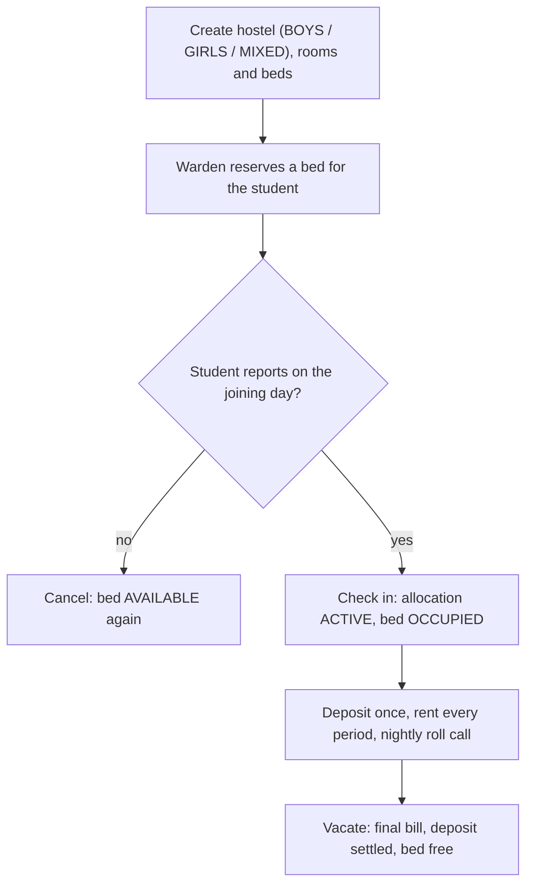
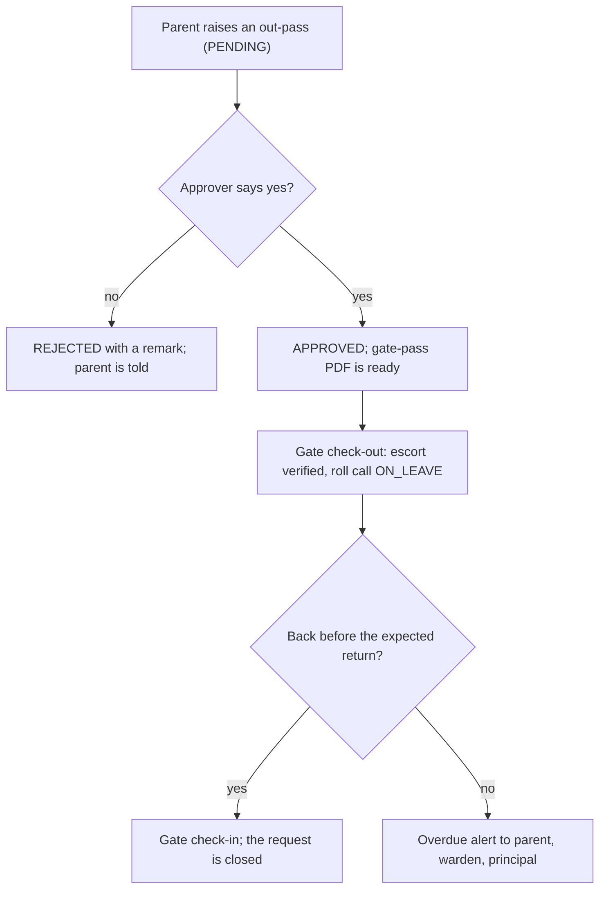
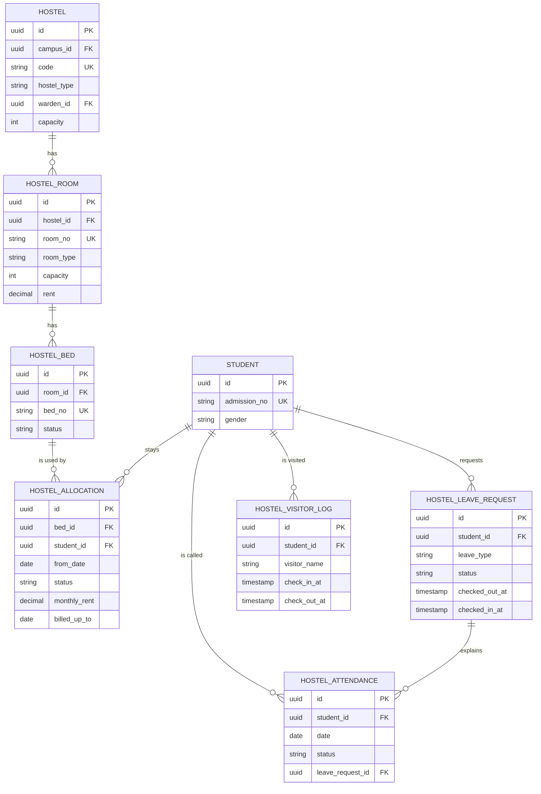

# Hostel Module

**In simple words:** A hostel is a building where students live during the session. Today the bed register sits in a notebook, the night roll call is on a loose sheet, and a parent must phone the office to ask whether the child returned from the weekend out-pass. This module keeps every hostel, room and bed inside EduFlow, gives a bed to a student, pushes the rent into the normal fee invoice, records the roll call, logs every visitor at the gate, and lets the parent ask for an out-pass from the Parent Portal and see when the child left and came back.

| Item | Value |
|---|---|
| Module code | HST |
| Release phase | Phase 3 (V1.5), by June 2027 |
| Plans | Pro, Enterprise (plan feature `module.HST`); not on Starter or Growth |
| Main users | Hostel Warden (custom role), Organization Admin, Principal, Parent, Student |
| Depends on | Multi Campus, Student Profile, Staff, Fees, Settings, Notifications |
| Used by | Fees (invoice lines), Parent Portal, Student Portal, Dashboard, Analytics |
| Main tables | `hostels`, `hostel_rooms`, `hostel_beds`, `hostel_allocations`, `hostel_attendance`, `hostel_visitor_logs`, `hostel_leave_requests` |
| Endpoints | HST-API-01 to HST-API-47 |
| Build prompt | P-46 |

## Objective

1. Every resident has a named bed in EduFlow before the first night of the session, and no bed ever holds two students.
2. Rent and deposit reach the fee invoice with nobody typing them; a mid-month join, transfer or vacate is charged only for the days stayed.
3. The night roll call of a 96-bed hostel is done on a phone in under three minutes, and the parent of an absent resident knows within fifteen minutes.
4. A parent asks for an out-pass from the phone and sees the approval and the gate times. No child leaves without a named escort.
5. The warden can answer "who is inside right now": residents, residents on leave, visitors not yet checked out.

## Scope

### In scope

- Hostels per campus with type (`BOYS`, `GIRLS`, `MIXED`), code, warden, phone, address and cached bed capacity.
- Rooms with floor, type, bed capacity, rent per bed, currency and amenities; single and bulk floor create.
- Beds as the allocated unit, with status `AVAILABLE`, `OCCUPIED`, `RESERVED` or `MAINTENANCE`.
- Allocation life: reserve, check in, transfer, vacate, cancel; deposit, monthly rent, `billedUpTo` for the invoice worker.
- Night roll call with `PRESENT`, `ABSENT`, `ON_LEAVE`, `LATE_ENTRY` and an absence alert to the parent.
- Visitor register at the gate, keeping only the last four characters of the ID proof.
- Out-pass: parent request, approval, gate check-out with escort, return check-in, overdue flag, gate-pass PDF.

### Out of scope

- Mess and food: mess money is a separate `MESS` fee head in the *Fees Module*; menus and mess attendance are not built.
- Collecting money (*Payments Module*), warden salary (*Payroll Module*), buying furniture (*Inventory Module*).
- Biometric or RFID gates, CCTV and electronic locks; gate screens are manual in Phase 3.
- Cleaning rosters, laundry, complaint tickets, day scholars (they never get a `HostelAllocation`).

### Phase notes

| Phase | What ships |
|---|---|
| Phase 1 and 2 | Hostel is only a fee head inside a fee structure (see *Fees Module*) |
| Phase 3 (V1.5) | Everything in scope; the warden works on the web app on a phone |
| Phase 4 (V2.0) | RFID gate posts, mess attendance, hostel complaint desk (assumption) |

## User Stories

| ID | As a | I want to | So that | Priority |
|---|---|---|---|---|
| HST-US-01 | Organization Admin | create a hostel with type and warden | the building exists once, under one campus | Must |
| HST-US-02 | Organization Admin | create a whole floor in one form | 40 rooms take two minutes | Must |
| HST-US-03 | Hostel Warden | see a bed map with a name per bed | I find a free bed without a register | Must |
| HST-US-04 | Hostel Warden | reserve a bed before arrival | a promised bed is not given away | Must |
| HST-US-05 | Hostel Warden | check a resident in on joining day | billing and roll call start correctly | Must |
| HST-US-06 | Hostel Warden | move a resident to another bed | billing follows the move on its own | Must |
| HST-US-07 | Hostel Warden | vacate a bed with date and reason | the final bill is right, the bed is free | Must |
| HST-US-08 | Accountant | have rent and deposit bill themselves | nobody types one amount 88 times | Must |
| HST-US-09 | Hostel Warden | mark the roll call on my phone | the register is done before lights out | Must |
| HST-US-10 | Parent | know when my child misses roll call | I hear the same night | Must |
| HST-US-11 | Parent | ask for an out-pass from the app | I need not drive over for a signature | Must |
| HST-US-12 | Principal | approve or reject with a remark | letting a child out stays a decision | Must |
| HST-US-13 | Hostel Warden | log every visitor and their exit | I can show who was inside | Must |
| HST-US-14 | Hostel Warden | print a gate pass | the guard has paper proof | Should |
| HST-US-15 | Organization Admin | see occupancy and vacancy | I know how many seats I can sell | Should |

## Workflow

### From an empty building to a billed resident

**Figure: Hostel set-up, allocation and billing**



1. The admin creates **Tagore Boys Hostel** (`BH1`) on the Gomti Nagar campus of Bright Future Public School, warden Ramesh Yadav (HST-API-02).
2. Bulk create makes floor 1, rooms 101 to 140, `DOUBLE`, rent ₹4,500: 40 rooms and 80 beds (HST-API-13).
3. The warden reserves bed `101-B` for Aarav Sharma from 12 October 2027 with a ₹10,000 deposit (HST-API-19).
4. Aarav reports on 12 October, so check-in sets the allocation `ACTIVE` and the bed `OCCUPIED` (HST-API-22).
5. The nightly *Fees Module* worker finds allocations whose `billedUpTo` is behind, writes a `FeeInvoiceItem` with `hostelAllocationId` under the `HOSTEL` fee head, and moves `billedUpTo` on.
6. Each night the warden saves the roll call (HST-API-28, 29); parents of absent residents get a message.
7. On 31 March 2028 Aarav vacates: the last part period is billed, the bed is freed (HST-API-24).

### The life of an out-pass

**Figure: Out-pass from parent request to return**



1. Sunita Devi asks for a `HOME_VISIT`, Friday 19:00 to Sunday 20:00, escort "Sunita Devi, 98xxxxxx21" (HST-API-45).
2. It reaches the warden inbox as `PENDING`; `hostel_outpass_approver` decides who may approve.
3. Dr. Anita Verma approves (HST-API-37), which stamps `approvedAt` and opens the gate-pass PDF (HST-API-42).
4. The warden checks the escort and presses check-out (HST-API-40), stamping `checkedOutAt`.
5. Friday and Saturday rosters pre-fill Aarav as `ON_LEAVE`, linked through `leaveRequestId`.
6. On return the warden presses check-in (HST-API-41); past the grace minutes it is a late return.

### Status lifecycle

| Object | Status | What it means | Moves to | Moved by |
|---|---|---|---|---|
| Bed | `AVAILABLE` | Free and rentable | `RESERVED`, `MAINTENANCE` | HST-API-19, 16 |
| Bed | `RESERVED` | Held for a named student | `OCCUPIED`, `AVAILABLE` | HST-API-22, 25 |
| Bed | `OCCUPIED` | A resident sleeps here | `AVAILABLE` | HST-API-23, 24 |
| Bed | `MAINTENANCE` | Broken or being painted | `AVAILABLE` | HST-API-16 |
| Allocation | `RESERVED` | Promised, not yet in | `ACTIVE`, `CANCELLED` | HST-API-22, 25 |
| Allocation | `ACTIVE` | Living here and billed | `VACATED` | HST-API-23, 24 |
| Allocation | `VACATED` | Stay over, final bill made | none | HST-API-24 |
| Allocation | `CANCELLED` | Never started, no bill | none | HST-API-25 |
| Out-pass | `PENDING` | Waiting for the approver | `APPROVED`, `REJECTED` | HST-API-37, 38 |
| Out-pass | `APPROVED` | May leave; pass ready | `CANCELLED` before gate out | HST-API-39, 46 |
| Out-pass | `REJECTED` | Refused with a remark | none | HST-API-38 |
| Out-pass | `CANCELLED` | Dropped before leaving | none | HST-API-39, 46 |
| Roll call | `PRESENT` | Seen at roll call | any, same night | HST-API-29 |
| Roll call | `ABSENT` | Not seen, no out-pass | any, same night | HST-API-29 |
| Roll call | `ON_LEAVE` | An out-pass covers it | any, same night | HST-API-28 |
| Roll call | `LATE_ENTRY` | In after the cut-off | any, same night | HST-API-29 |

> **Rule:** A roll-call row may be corrected until 06:00 next morning. After that it needs `hostel.approve` and is audited with the old and new value.

## Screens and Wireframes

| ID | Screen | Users | Purpose |
|---|---|---|---|
| HST-S01 | Hostel list | Admin, Principal, Warden | Capacity, occupancy, warden |
| HST-S02 | Hostel set-up | Admin | Name, code, type, warden, phone |
| HST-S03 | Occupancy map | Warden, Admin, Principal | Bed grid with a name per bed |
| HST-S04 | Rooms and beds | Admin | Room list, single and bulk create |
| HST-S05 | Allocate bed | Warden, Admin | Reserve with rent and deposit |
| HST-S06 | Resident register | Warden, Admin, Principal | Allocations, status, billing state |
| HST-S07 | Night roll call | Warden | Mark tonight's roster on a phone |
| HST-S08 | Roll-call history | Warden, Principal | Past nights and absences |
| HST-S09 | Visitor gate register | Warden | Check a visitor in and out |
| HST-S10 | Out-pass inbox | Warden, Principal | Approve, reject, gate in and out |
| HST-S11 | Parent hostel view | Parent | Room, bed, roll call, out-pass |
| HST-S12 | Student hostel view | Student | Own room, bed, out-passes |

**Screen HST-S03 — Occupancy map (Hostel Warden, web)**

```text
+--------------------------------------------------------------------------+
| EduFlow | Bright Future Public School   [Search residents...]   (RY) v   |
+------------+-------------------------------------------------------------+
| Dashboard  | Hostel > Tagore Boys Hostel (BH1) > Occupancy               |
| Students   +-------------------------------------------------------------+
| Fees       | Floor [ 1 v ]  Room type [ All v ]  Bed [ All v ]  [Refresh]|
| Hostel   < | Capacity 96  Occupied 88  Reserved 3  Repair 2  Free 3      |
|  Hostels   |-------------------------------------------------------------|
|  Rooms     | 101 DOUBLE Rs 4,500  [A] Aarav Sharma 10-A   [B] FREE       |
|  Allocate  | 102 DOUBLE Rs 4,500  [A] Kabir Khan 9-B      [B] Ishan Roy  |
|  Roll call | 103 DOUBLE Rs 4,500  [A] RESERVED Vivek S    [B] REPAIR     |
|  Visitors  | 104 TRIPLE Rs 3,800  [A] Rohan M [B] Neel K  [C] Arjun D    |
|  Out-pass  |-------------------------------------------------------------|
| Reports    | Legend: FREE = vacant, REPAIR = maintenance                 |
| Settings   |            [Bulk add rooms]  [Allocate bed]  [Export list]  |
+------------+-------------------------------------------------------------+
```

- `FREE` is vacant, `REPAIR` is maintenance, a name means the bed is taken. The grid comes from HST-API-08 and the counters from HST-API-07; `[Allocate bed]` opens HST-S05 with that bed chosen, `[Bulk add rooms]` calls HST-API-13, `[Export list]` calls HST-API-26.

**Screen HST-S05 — Allocate bed (Hostel Warden, web)**

```text
+--------------------------------------------------------------------------+
| Hostel > Allocate bed                                       [X] Close    |
+--------------------------------------------------------------------------+
| Student  [ Aarav Sharma - BF-2027-0142 v ]   Gender: Male  Class 10-A    |
| Hostel   [ Tagore Boys Hostel (BH1) v ]      Type: BOYS  Free beds: 3    |
| Room     [ 101 - DOUBLE - Rs 4,500 v ]       Bed [ 101-B v ]             |
|--------------------------------------------------------------------------|
| Year     [ 2027-28 v ]   From date [ 12-10-2027 ]  To date [ 31-03-2028 ]|
| Monthly rent [ 4500.00 ]  Deposit [ 10000.00 ]   Currency INR            |
| Fee head [ Hostel Rent (HOSTEL) v ]   Billing [ MONTHLY v ]              |
| Notes    [ Lower bunk advised - knee injury __________________________ ] |
|--------------------------------------------------------------------------|
| First invoice preview                                                    |
|   12 Oct to 31 Oct 2027 (20 of 31 days)          Rs  2,903.23            |
|   Caution deposit (one time)                     Rs 10,000.00            |
|   Total on the first invoice                     Rs 12,903.23            |
|--------------------------------------------------------------------------|
| (o) Reserve only    ( ) Reserve and check in now                         |
|                                        [Cancel]  [Save allocation]       |
+--------------------------------------------------------------------------+
```

- Gender and hostel type sit on neighbouring lines, so a mismatch is seen before saving. The preview uses the same service as the fee worker, so the screen number is the bill number. `[Save allocation]` calls HST-API-19; the second radio also calls HST-API-22 in one transaction.

**Screen HST-S07 — Night roll call (Hostel Warden, mobile)**

```text
+------------------------------------+
| BH1 Roll call   Tue 09 Nov 2027    |
| 21:30 cut-off        Saved 0 of 91 |
+------------------------------------+
| [All present]   [Only absent v]    |
+------------------------------------+
| 101-A Aarav Sharma   10-A          |
|   (o) P  ( ) A  ( ) L  [ON LEAVE]  |
| 101-B Kabir Khan     9-B           |
|   (o) P  ( ) A  ( ) L              |
| 102-A Ishan Roy      10-B          |
|   ( ) P  (o) A  ( ) L              |
|   Remark [ Not in room at 21:30 ]  |
| 102-B Vivek Singh    9-A           |
|   ( ) P  ( ) A  ( ) L   <- not set |
+------------------------------------+
| 88 present  2 absent  1 on leave   |
|            [Save roll call]        |
+------------------------------------+
```

- `P`, `A` and `L` are present, absent and late entry; an `[ON LEAVE]` chip cannot be set to present. `[All present]` fills every unset row in one tap. The sheet loads from HST-API-28, saves with one call to HST-API-29, and works offline.

**Screen HST-S11 — Hostel and out-pass (Parent, mobile)**

```text
+------------------------------------+
| Aarav Sharma        Hostel         |
+------------------------------------+
| Tagore Boys Hostel (BH1)           |
| Room 101, Bed B, Floor 1           |
| Warden Ramesh Yadav  0522-4001     |
| Monthly rent Rs 4,500              |
+------------------------------------+
| Last 7 nights                      |
|  08 Nov Present   07 Nov Present   |
|  06 Nov On leave  05 Nov On leave  |
|  04 Nov Present   03 Nov Late      |
|  02 Nov Present                    |
+------------------------------------+
| Out-pass requests                  |
| 05-07 Nov Home visit     APPROVED  |
|   Out 19:04  Back 20:12            |
| 12-14 Nov Home visit     PENDING   |
|                  [Cancel request]  |
+------------------------------------+
|        [Ask for a new out-pass]    |
+------------------------------------+
```

- Room, bed and warden phone without calling the office: roll call from HST-API-43, requests from HST-API-44. `[Ask for a new out-pass]` opens a small form (type, dates, reason, escort) and calls HST-API-45.

**Screen HST-S09 — Visitor gate register (Hostel Warden, web)**

```text
+--------------------------------------------------------------------------+
| Hostel > Tagore Boys Hostel > Visitors     Tue 09 Nov 2027  20:41        |
+--------------------------------------------------------------------------+
| Inside now: 2     [Date 09-11-2027]  [Still inside [x]]   [Search]       |
|--------------------------------------------------------------------------|
| Visitor          Meets          Relation  In      Out      Action        |
| Sunita Devi      Aarav Sharma   Mother    18:32   --       [Check out]   |
| Rakesh Verma     Neel Kapoor    Uncle     19:05   --       [Check out]   |
| Anjali Roy       Ishan Roy      Mother    16:10   17:22    Closed        |
|--------------------------------------------------------------------------|
| New visitor                                                              |
| Name [ ____________________ ]  Phone [ __________ ]                      |
| Meets [ Search resident... v ]  Relation [ Mother v ]                    |
| ID proof [ Aadhaar v ]  Last 4 [ ____ ]  Purpose [ ______________ ]      |
|                                     [Clear]  [Check in visitor]          |
+--------------------------------------------------------------------------+
```

- Only the last four ID characters are typed, which keeps the register inside the DPDP Act 2023 rule of collecting the least data needed. `[Check in visitor]` calls HST-API-32 and links `guardianId` when a registered guardian is picked; `[Check out]` calls HST-API-33.

## UI Components

| Component | Type | Behaviour |
|---|---|---|
| Bed grid | shadcn/ui `Card` tiles | One tile per bed, colour by status, click to allocate |
| Occupancy strip | Counter row | Capacity, occupied, reserved, repair, free; click filters |
| Resident picker | `Combobox`, server search | Name and admission number; shows gender and class |
| Bed picker | Dependent `Select` | Reloads from HST-API-14; only `AVAILABLE` beds |
| Invoice preview | Read-only `Table` | Part-period line and deposit before saving |
| Roll-call row | `RadioGroup` plus `Input` | Three options and a remark; locked when `ON_LEAVE` |
| Confirm sheet | `AlertDialog` | Vacate, cancel, transfer; repeats the money effect |
| Empty, loading, error | `EmptyState`, `Skeleton`, `Alert` | "Add your first hostel building"; 24 grey tiles; `error.message` with `[Try again]` |

## Validation Rules

| Field | Rule | Error message shown to user |
|---|---|---|
| `Hostel.code` | 2 to 20 characters, unique per campus | "This hostel code is already used on this campus." |
| `Hostel.wardenId` | Active Staff of the same campus | "Pick a staff member of this campus as warden." |
| `HostelRoom.roomNo` | 1 to 20 characters, unique per hostel | "Room 101 already exists in this hostel." |
| `HostelRoom.capacity` | Whole number 1 to 20 | "A room can have 1 to 20 beds." |
| `HostelRoom.capacity` on edit | Never below the beds in use | "3 beds are in use. You cannot set capacity below 3." |
| `HostelBed.bedNo` | 1 to 10 characters, unique per room | "Bed B already exists in room 101." |
| Allocation gender | Must match the hostel type | "Tagore Boys Hostel takes boys only." |
| Allocation bed | Status must be `AVAILABLE` | "This bed is not free. Pick another bed." |
| Allocation duplicate | No other live allocation | "Aarav Sharma already has bed 101-B in BH1." |
| `fromDate` | Inside the academic year | "The from date must be inside 2027-28." |
| `depositAmount` | 0 or more, max 12 times rent | "The deposit looks too high. Check the amount." |
| `feeHeadId` | Fee head type `HOSTEL` | "Pick a fee head of type Hostel." |
| Roll-call date | Not future, not older than 7 days | "You can mark the roll call only up to 7 days back." |
| Roll-call rows | One row per resident | "Mark every resident before you save." |
| `idProofLast4` | Exactly 4 characters | "Type the last 4 characters of the ID number." |
| Out-pass dates | 30 days ahead at most, return after start | "The return time must be after the leaving time." |
| Out-pass escort | Needed for `HOME_VISIT`, `DAY_OUT` | "Enter who will collect the student and a phone number." |
| Out-pass overlap | No other live request | "This student already has an out-pass for those hours." |

## Business Rules

### Set-up, plan and safety

**HST-BR-01 Plan gate.** Hostel needs the plan feature `module.HST` (Pro and Enterprise); other plans get `403 PLAN_LIMIT_REACHED`. Pro allows 10 hostels and 2,000 beds.

**HST-BR-02 Gender rule.** A `BOYS` hostel takes only `Student.gender = MALE`, a `GIRLS` hostel only `FEMALE`. A `MIXED` hostel takes both, but one room is never mixed: the first live resident fixes that room until it is empty. Gender `OTHER` or not set goes only into a `SINGLE` room. Breaking this gives `422 BUSINESS_RULE_VIOLATION`.

**HST-BR-03 One bed, one resident.** A bed holds at most one `RESERVED` or `ACTIVE` allocation, checked in the service transaction and again by a partial unique index. The loser gets `409 CONFLICT`.

**HST-BR-04 One live allocation per student.** A student holds one `RESERVED` or `ACTIVE` allocation across all hostels. A transfer closes the old row and opens the new one in one transaction.

**HST-BR-05 Capacity is counted, never typed.** `Hostel.capacity` caches the beds that are not soft-deleted. HST-API-10, 13, 15 and 17 recount it in the same transaction; a 02:30 job re-counts and logs any drift.

**HST-BR-06 Maintenance beds are invisible.** A `MAINTENANCE` bed never shows in the picker and never counts as a vacancy, but still counts in capacity, so occupied plus reserved plus repair plus free equals capacity.

**HST-BR-07 Room inventory pointer.** Furniture lives in the *Inventory Module* as an `AssetAssignment`, whose `roomId` points at the campus `Room` table. So for each hostel room that needs asset tracking, create one `Room` with `roomType = OTHER`, `building` = hostel name and `name` = room number; items handed to one resident use `studentId`. This is a convention, not a foreign key; a real `hostelRoomId` column is a Phase 4 change.

### Money

**HST-BR-08 Rent copy and override.** The room rent is copied into `HostelAllocation.monthlyRent` at allocation; a later room-rent change never touches it. A warden override is audited with old and new value.

**HST-BR-09 Billing period and proration.** The worker bills whole periods from `billedUpTo + 1 day`. A part month costs `monthlyRent x days stayed / days in that calendar month`, rounded to two decimals, half up.

> **Example:** Aarav joins 12 October 2027 at ₹4,500, `MONTHLY`. October has 31 days and he stays 20: 4500 x 20 / 31 = ₹2,903.23, and `billedUpTo` becomes 31 October 2027. November bills ₹4,500. `QUARTERLY` billing instead covers 12 October to 31 December: 2,903.23 + 4,500 + 4,500 = ₹11,903.23.

**HST-BR-10 Deposit is billed once.** `depositAmount` goes on the first invoice after check-in under a `CAUTION_DEPOSIT` fee head, never under `HOSTEL`, and a transfer never bills it again. On vacate it returns as a *Fees Module* credit note minus the damages typed in the vacate form; `hostel_deposit_refund_days` (default 15) sets the promised date.

**HST-BR-11 Transfer keeps billing running.** A transfer vacates the old bed and opens a new `ACTIVE` allocation from the transfer date with `billedUpTo` copied, so no day is billed twice or missed. A rent difference inside a billed period is corrected next invoice.

> **Example:** Aarav moves on 15 November 2027 from a ₹4,500 bed to a ₹6,000 bed. Old bed, 14 of 30 days: 4500 x 14 / 30 = ₹2,100.00. New bed, 16 days: 6000 x 16 / 30 = ₹3,200.00. True rent ₹5,300.00 against ₹4,500 billed, so December carries ₹800.00 noted "Room change 15 Nov 2027".

**HST-BR-12 Vacate bills up to the last night.** Vacate bills from `billedUpTo + 1 day` to `vacatedOn` with the same formula, sets `VACATED`, writes `vacatedOn` and `vacateReason`, and frees the bed.

> **Example:** `billedUpTo` is 28 February 2028 and Aarav vacates 20 March 2028: 4500 x 20 / 31 = ₹2,903.23. With a ₹1,200 chair charge against the ₹10,000 deposit the credit note is ₹8,800, so the family gets ₹5,896.77 back.

**HST-BR-13 Cancel bills nothing.** Cancelling a `RESERVED` allocation sets `CANCELLED` and frees the bed with no invoice line; a deposit item already raised is cancelled in the *Fees Module*.

### Night, gate and safety

**HST-BR-14 Roll-call roster.** The roster holds every allocation `ACTIVE` on that date. A resident with an `APPROVED` out-pass covering the roll-call moment is pre-filled `ON_LEAVE` with `leaveRequestId` set, and cannot be marked `PRESENT` before a gate check-in.

**HST-BR-15 Roll-call time and the absent alert.** `hostel_roll_call_time` (default 21:30 campus time) is the cut-off; `hostel_absence_alert_delay_min` (default 15) is the wait before the parent alert, so a late walk-in can still be corrected. `notifiedAt` is stamped when the alert goes, so a re-save sends no second message.

> **Example:** 09 November 2027 in Tagore Boys Hostel: 91 residents `ACTIVE`, 1 on an out-pass. The warden saves 88 `PRESENT` and 2 `ABSENT` at 21:38, and at 21:53 two parents get a WhatsApp message. Bed occupancy that night is 88 of 96 = 91.7 percent.

**HST-BR-16 Unmarked is not absent.** With no saved roll call EduFlow writes no `ABSENT` rows by itself; at 23:00 a job reminds the warden and the principal. A missing roll call is reported, never guessed.

**HST-BR-17 Late entry.** A resident back after the cut-off but before 06:00 is `LATE_ENTRY`, not `ABSENT`. Three such marks in one calendar month alert the principal in-app.

**HST-BR-18 Who approves an out-pass.** `hostel_outpass_approver` is `WARDEN` (anyone with `hostel.approve`) or `PRINCIPAL`. Every request needs an approval, and nobody may approve an out-pass they raised.

**HST-BR-19 Escort check at the gate.** Check-out is refused unless `escortName` is filled for `HOME_VISIT` and `DAY_OUT`. For `MEDICAL` and `EMERGENCY` the warden may skip the escort but must type a remark; remark and user id are audited.

**HST-BR-20 Overdue return.** Every 15 minutes a worker looks for an `APPROVED` request with `checkedOutAt` set, `checkedInAt` empty and `expectedReturnAt` more than `hostel_late_return_grace_min` minutes past (default 60), and raises `hostel.leave.overdue` to parent, warden and principal, then every 6 hours.

**HST-BR-21 Visitor privacy.** Only `idProofLast4` is stored, in a `varchar(4)` column, so a full ID number cannot be saved by mistake. Rows are kept 2 years. This follows the DPDP Act 2023 rule of collecting the least data needed.

**HST-BR-22 Visitors are closed every night.** At 22:00 campus time a job sets `checkOutAt` to 22:00 on every open row, adds the note "Auto-closed at 22:00" and lists them for the warden next morning, so the "inside now" counter stays honest.

## Acceptance Criteria

| ID | Given | When | Then |
|---|---|---|---|
| HST-AC-01 | A Pro organization, no hostel | Admin posts hostel code `BH1` | `201`, capacity 0 |
| HST-AC-02 | Hostel `BH1`, no rooms | Bulk create 101 to 140, `DOUBLE` | 40 rooms, 80 beds, capacity 80 |
| HST-AC-03 | Bed 101-B is `AVAILABLE` | Warden allocates it from 12 Oct | `201`, allocation and bed `RESERVED` |
| HST-AC-04 | Bed 101-B is `RESERVED` | A second warden takes it | `409 CONFLICT`, one allocation |
| HST-AC-05 | Aarav is male, `GH1` is girls | Warden tries a bed in `GH1` | `422` "takes girls only" |
| HST-AC-06 | The allocation is `RESERVED` | Warden checks the resident in | `200` `ACTIVE`, bed `OCCUPIED` |
| HST-AC-07 | Check-in 12 Oct, ₹4,500 monthly | The fee worker runs 1 Nov | ₹2,903.23, `billedUpTo` 31 Oct |
| HST-AC-08 | The worker runs twice a night | It reads the allocation again | No second item, same `billedUpTo` |
| HST-AC-09 | ₹4,500 bed, November billed | Transfer to ₹6,000 on 15 Nov | Old bed free, ₹800 adjustment |
| HST-AC-10 | `ACTIVE`, ₹10,000 deposit | Vacate 20 Mar, ₹1,200 damage | ₹2,903.23 rent, ₹8,800 credit |
| HST-AC-11 | 91 residents, 1 on out-pass | Warden opens tonight's roster | 91 rows, that row `ON_LEAVE` |
| HST-AC-12 | The roster is open | Save 88 present, 2 absent | `200`, 91 rows, 2 alerts queued |
| HST-AC-13 | Parent has a child in `BH1` | Parent posts an out-pass | `201` `PENDING`, warden alerted |
| HST-AC-14 | An out-pass is `PENDING` | Principal approves it | `200` `APPROVED`, approver stamped |
| HST-AC-15 | `APPROVED`, escort empty | Warden tries a gate check-out | `422` "Enter who will collect" |
| HST-AC-16 | Checked out, return due 20:00 | 21:05 passes, no check-in | `hostel.leave.overdue` to three |
| HST-AC-17 | A visitor checked in 18:32 | The 22:00 job finds it open | `checkOutAt` 22:00, note added |
| HST-AC-18 | A Growth-plan organization | Any `hostel.*` endpoint is called | `403 PLAN_LIMIT_REACHED` |

## Edge Cases

| Case | What happens | How the system handles it |
|---|---|---|
| Two wardens take one bed at once | Both reads see it free | The partial unique index rejects the second; `409` and the grid reloads |
| A student leaves the school mid-year | The allocation stays `ACTIVE` | `student.exited` vacates the bed as "Student left" and bills to that date |
| A room is repainted with residents in | Beds cannot go to `MAINTENANCE` | `422` listing the names; transfer them first |
| A resident changes gender | The hostel type no longer matches | The nightly check lists it for the admin; nothing moves on its own |
| Roll call opened at 00:30 | The date could read as a new day | Before 06:00 belongs to the previous hostel night |
| Roll call marked with no network | The save would fail | Kept in the browser and replayed; `markedAt` holds device time |
| Parent cancels after gate check-out | The child is already outside | `422`; only a gate check-in closes a started out-pass |
| A visitor never leaves | The counter drifts | HST-BR-22 closes it at 22:00 and flags it for the morning |
| Downgrade from Pro to Growth | Data could be lost | Data stays; endpoints answer `403`, no new hostel fee line is raised |
| Two out-passes overlap | Gate times become unclear | The overlap check blocks the second with `422` |

## Database Schema

| Table | Purpose |
|---|---|
| `hostels` | Building of a campus with type, warden and cached capacity |
| `hostel_rooms` | Room with floor, type, bed capacity, rent and amenities |
| `hostel_beds` | One bed, the allocated unit; carries the vacancy status |
| `hostel_allocations` | One stay in one bed, with rent, deposit and billing state |
| `hostel_attendance` | One night roll-call row per resident per date |
| `hostel_visitor_logs` | One visitor entry with in and out times |
| `hostel_leave_requests` | Out-pass with approval, escort and gate timestamps |

### Table hostel_allocations

| Column | Type | Null | Default | Notes |
|---|---|---|---|---|
| `id` | uuid | No | `uuid()` | PK |
| `organization_id` | uuid | No | | FK `organizations` |
| `campus_id` | uuid | No | | FK `campuses` |
| `hostel_id` | uuid | No | | FK `hostels` |
| `bed_id` | uuid | No | | FK `hostel_beds` |
| `student_id` | uuid | No | | FK `students` |
| `academic_year_id` | uuid | No | | FK `academic_years` |
| `from_date` | date | No | | First night |
| `to_date` | date | Yes | | Planned or actual end |
| `status` | enum | No | `ACTIVE` | `HostelAllocationStatus` |
| `monthly_rent` | decimal(12,2) | No | | Copied from the room |
| `deposit_amount` | decimal(12,2) | No | `0` | Billed once |
| `currency` | char(3) | No | | `INR` |
| `fee_head_id` | uuid | Yes | | FK `fee_heads`, type `HOSTEL` |
| `billing_frequency` | enum | No | `MONTHLY` | `FeeFrequency` |
| `billed_up_to` | date | Yes | | Last period invoiced |
| `vacated_on` | date | Yes | | Set by HST-API-24 |
| `vacate_reason` | varchar(255) | Yes | | "Session over" |
| `notes` | varchar(500) | Yes | | Medical or room note |
| `allocated_by_id` | uuid | Yes | | User id, audit only |
| `created_at` | timestamptz | No | `now()` | |
| `updated_at` | timestamptz | No | | On write |
| `deleted_at` | timestamptz | Yes | | Soft delete |

### The six other tables

| Table | Columns beyond tenant, timestamps and soft delete |
|---|---|
| `hostels` | `campus_id`, `name`, `code`, `hostel_type`, `warden_id`, `phone`, `address`, `capacity`, `status` |
| `hostel_rooms` | `hostel_id`, `room_no`, `floor`, `room_type`, `capacity`, `rent`, `currency`, `amenities`, `status` |
| `hostel_beds` | `hostel_id`, `room_id`, `bed_no`, `status` |
| `hostel_attendance` | `campus_id`, `hostel_id`, `student_id`, `date`, `status`, `leave_request_id`, `marked_at`, `remark`, `marked_by_id`, `notified_at` |
| `hostel_visitor_logs` | `campus_id`, `hostel_id`, `student_id`, `guardian_id`, `visitor_name`, `relation`, `phone`, `id_proof_type`, `id_proof_last4`, `purpose`, `check_in_at`, `check_out_at`, `approved_by_id`, `notes` |
| `hostel_leave_requests` | `campus_id`, `hostel_id`, `student_id`, `allocation_id`, `leave_type`, `from_at`, `expected_return_at`, `reason`, `requested_by_guardian_id`, `escort_name`, `escort_phone`, `status`, `approved_by_id`, `approved_at`, `checked_out_at`, `checked_in_at` |

`warden_id` is a `staff` FK with `SetNull`, `amenities` is a text array, `hostel_beds.hostel_id` is copied from the room so vacancy counts need no join, and `hostel_attendance` has no soft delete.

### Indexes and constraints

- Unique: `hostels (organization_id, campus_id, code)`, `hostel_rooms (organization_id, hostel_id, room_no)`, `hostel_beds (organization_id, room_id, bed_no)`, `hostel_attendance (organization_id, hostel_id, student_id, date)`.
- Hot paths: `hostel_beds (organization_id, hostel_id, status)`, `hostel_allocations (organization_id, bed_id, status)` and `(organization_id, student_id, status)`, `hostel_attendance (organization_id, hostel_id, date, status)`.
- Prisma 6 cannot express the partial unique indexes behind HST-BR-03 and HST-BR-04, so they live in a raw migration:

```sql
CREATE UNIQUE INDEX hostel_allocations_live_bed_uq
  ON hostel_allocations (organization_id, bed_id)
  WHERE status IN ('RESERVED', 'ACTIVE') AND deleted_at IS NULL;

CREATE UNIQUE INDEX hostel_allocations_live_student_uq
  ON hostel_allocations (organization_id, student_id)
  WHERE status IN ('RESERVED', 'ACTIVE') AND deleted_at IS NULL;
```

- Row-Level Security is on for all seven tables with the usual `app.current_org` policy.

**Figure: Hostel tables and their links**



The bed is the centre: money hangs on `HOSTEL_ALLOCATION`, safety hangs on the student.

## Prisma Schema

Copied from `docs/src/_schema/11-operations.prisma`. Long relation blocks keep their exact field names; only the alignment spacing is tightened so the lines fit the page.

```prisma
enum HostelType {
  BOYS
  GIRLS
  MIXED
}

enum HostelRoomType {
  SINGLE
  DOUBLE
  TRIPLE
  DORMITORY
}

enum HostelBedStatus {
  AVAILABLE
  OCCUPIED
  RESERVED
  MAINTENANCE
}

enum HostelAllocationStatus {
  RESERVED
  ACTIVE
  VACATED
  CANCELLED
}

enum HostelAttendanceStatus {
  PRESENT
  ABSENT
  ON_LEAVE // approved leave / home visit
  LATE_ENTRY
}

enum HostelLeaveType {
  HOME_VISIT
  DAY_OUT
  MEDICAL
  EMERGENCY
}

model Hostel {
  id             String       @id @default(uuid()) @db.Uuid
  organizationId String       @map("organization_id") @db.Uuid
  campusId       String       @map("campus_id") @db.Uuid
  name           String       @db.VarChar(100)
  code           String       @db.VarChar(20)
  hostelType     HostelType   @map("hostel_type")
  wardenId       String?      @map("warden_id") @db.Uuid // Staff
  phone          String?      @db.VarChar(20)
  address        String?      @db.VarChar(300)
  capacity       Int          @default(0) // cached number of beds
  status         RecordStatus @default(ACTIVE)
  createdAt      DateTime     @default(now()) @map("created_at") @db.Timestamptz(6)
  updatedAt      DateTime     @updatedAt @map("updated_at") @db.Timestamptz(6)
  deletedAt      DateTime?    @map("deleted_at") @db.Timestamptz(6)

  organization Organization @relation(fields: [organizationId], references: [id], onDelete: Restrict)
  campus Campus @relation(fields: [campusId], references: [id], onDelete: Restrict)
  warden Staff? @relation(fields: [wardenId], references: [id], onDelete: SetNull)
  rooms               HostelRoom[]
  beds                HostelBed[]
  allocations         HostelAllocation[]
  attendances         HostelAttendance[]
  visitorLogs         HostelVisitorLog[]
  hostelLeaveRequests HostelLeaveRequest[]

  @@unique([organizationId, campusId, code])
  @@index([organizationId, campusId, status])
  @@map("hostels")
}

model HostelRoom {
  id             String         @id @default(uuid()) @db.Uuid
  organizationId String         @map("organization_id") @db.Uuid
  hostelId       String         @map("hostel_id") @db.Uuid
  roomNo         String         @map("room_no") @db.VarChar(20)
  floor          String?        @db.VarChar(20)
  roomType       HostelRoomType @default(DOUBLE) @map("room_type")
  capacity       Int            @db.SmallInt // number of beds
  rent           Decimal        @default(0) @db.Decimal(12, 2) // monthly rent per bed
  currency       String         @db.Char(3)
  amenities      String[] // AC, attached bath, balcony
  status         RecordStatus   @default(ACTIVE)
  createdAt      DateTime       @default(now()) @map("created_at") @db.Timestamptz(6)
  updatedAt      DateTime       @updatedAt @map("updated_at") @db.Timestamptz(6)
  deletedAt      DateTime?      @map("deleted_at") @db.Timestamptz(6)

  organization Organization @relation(fields: [organizationId], references: [id], onDelete: Cascade)
  hostel       Hostel       @relation(fields: [hostelId], references: [id], onDelete: Restrict)
  beds         HostelBed[]

  @@unique([organizationId, hostelId, roomNo])
  @@index([organizationId, hostelId, status])
  @@map("hostel_rooms")
}

model HostelBed {
  id             String          @id @default(uuid()) @db.Uuid
  organizationId String          @map("organization_id") @db.Uuid
  hostelId String @map("hostel_id") @db.Uuid // denormalised from the room for vacancy counts
  roomId         String          @map("room_id") @db.Uuid
  bedNo          String          @map("bed_no") @db.VarChar(10)
  status         HostelBedStatus @default(AVAILABLE)
  createdAt      DateTime        @default(now()) @map("created_at") @db.Timestamptz(6)
  updatedAt      DateTime        @updatedAt @map("updated_at") @db.Timestamptz(6)
  deletedAt      DateTime?       @map("deleted_at") @db.Timestamptz(6)

  organization Organization @relation(fields: [organizationId], references: [id], onDelete: Cascade)
  hostel Hostel @relation(fields: [hostelId], references: [id], onDelete: Restrict)
  room HostelRoom @relation(fields: [roomId], references: [id], onDelete: Restrict)
  allocations  HostelAllocation[]

  @@unique([organizationId, roomId, bedNo])
  @@index([organizationId, hostelId, status])
  @@map("hostel_beds")
}

model HostelAllocation {
  id               String                 @id @default(uuid()) @db.Uuid
  organizationId   String                 @map("organization_id") @db.Uuid
  campusId         String                 @map("campus_id") @db.Uuid
  hostelId         String                 @map("hostel_id") @db.Uuid
  bedId            String                 @map("bed_id") @db.Uuid
  studentId        String                 @map("student_id") @db.Uuid
  academicYearId   String                 @map("academic_year_id") @db.Uuid
  fromDate         DateTime               @map("from_date") @db.Date
  toDate DateTime? @map("to_date") @db.Date // planned or actual end of stay
  status           HostelAllocationStatus @default(ACTIVE)
  monthlyRent Decimal @map("monthly_rent") @db.Decimal(12, 2)
  depositAmount    Decimal                @default(0) @map("deposit_amount") @db.Decimal(12, 2)
  currency         String                 @db.Char(3)
  feeHeadId String? @map("fee_head_id") @db.Uuid // HOSTEL fee head used on invoices
  billingFrequency FeeFrequency           @default(MONTHLY) @map("billing_frequency")
  billedUpTo DateTime? @map("billed_up_to") @db.Date // last period already invoiced
  vacatedOn        DateTime?              @map("vacated_on") @db.Date
  vacateReason     String?                @map("vacate_reason") @db.VarChar(255)
  notes            String?                @db.VarChar(500)
  allocatedById String? @map("allocated_by_id") @db.Uuid // User id (audit only, no FK)
  createdAt        DateTime               @default(now()) @map("created_at") @db.Timestamptz(6)
  updatedAt        DateTime               @updatedAt @map("updated_at") @db.Timestamptz(6)
  deletedAt        DateTime?              @map("deleted_at") @db.Timestamptz(6)

  organization Organization @relation(fields: [organizationId], references: [id], onDelete: Restrict)
  campus Campus @relation(fields: [campusId], references: [id], onDelete: Restrict)
  hostel Hostel @relation(fields: [hostelId], references: [id], onDelete: Restrict)
  bed HostelBed @relation(fields: [bedId], references: [id], onDelete: Restrict)
  student Student @relation(fields: [studentId], references: [id], onDelete: Restrict)
  academicYear AcademicYear @relation(fields: [academicYearId], references: [id], onDelete: Restrict)
  feeHead FeeHead? @relation(fields: [feeHeadId], references: [id], onDelete: Restrict)
  feeInvoiceItems     FeeInvoiceItem[]
  hostelLeaveRequests HostelLeaveRequest[]

  @@index([organizationId, bedId, status])
  @@index([organizationId, studentId, status])
  @@index([organizationId, hostelId, academicYearId, status])
  @@map("hostel_allocations")
}

model HostelAttendance {
  id             String                 @id @default(uuid()) @db.Uuid
  organizationId String                 @map("organization_id") @db.Uuid
  campusId       String                 @map("campus_id") @db.Uuid
  hostelId       String                 @map("hostel_id") @db.Uuid
  studentId      String                 @map("student_id") @db.Uuid
  date           DateTime               @db.Date
  status         HostelAttendanceStatus
  leaveRequestId String? @map("leave_request_id") @db.Uuid
  markedAt       DateTime?              @map("marked_at") @db.Timestamptz(6)
  remark         String?                @db.VarChar(255)
  markedById String? @map("marked_by_id") @db.Uuid // User id (audit only, no FK)
  notifiedAt DateTime? @map("notified_at") @db.Timestamptz(6)
  createdAt      DateTime               @default(now()) @map("created_at") @db.Timestamptz(6)
  updatedAt      DateTime               @updatedAt @map("updated_at") @db.Timestamptz(6)

  organization Organization @relation(fields: [organizationId], references: [id], onDelete: Restrict)
  campus Campus @relation(fields: [campusId], references: [id], onDelete: Restrict)
  hostel Hostel @relation(fields: [hostelId], references: [id], onDelete: Restrict)
  student Student @relation(fields: [studentId], references: [id], onDelete: Restrict)
  leaveRequest HostelLeaveRequest? @relation(fields: [leaveRequestId], references: [id], onDelete: SetNull)

  @@unique([organizationId, hostelId, studentId, date])
  @@index([organizationId, campusId, date, status]) // nightly roll-call dashboard per campus
  @@index([organizationId, hostelId, date, status])
  @@index([organizationId, studentId, date])
  @@map("hostel_attendance")
}

model HostelVisitorLog {
  id             String    @id @default(uuid()) @db.Uuid
  organizationId String    @map("organization_id") @db.Uuid
  campusId       String    @map("campus_id") @db.Uuid
  hostelId       String    @map("hostel_id") @db.Uuid
  studentId      String    @map("student_id") @db.Uuid // resident visited
  guardianId String? @map("guardian_id") @db.Uuid
  visitorName    String    @map("visitor_name") @db.VarChar(160)
  relation       String?   @db.VarChar(40) // relation to the student as stated at the gate
  phone          String?   @db.VarChar(20)
  idProofType    String?   @map("id_proof_type") @db.VarChar(40)
  idProofLast4 String? @map("id_proof_last4") @db.VarChar(4)
  purpose        String?   @db.VarChar(255)
  checkInAt      DateTime  @map("check_in_at") @db.Timestamptz(6)
  checkOutAt     DateTime? @map("check_out_at") @db.Timestamptz(6)
  approvedById String? @map("approved_by_id") @db.Uuid
  notes          String?   @db.VarChar(500)
  createdAt      DateTime  @default(now()) @map("created_at") @db.Timestamptz(6)
  updatedAt      DateTime  @updatedAt @map("updated_at") @db.Timestamptz(6)

  organization Organization @relation(fields: [organizationId], references: [id], onDelete: Restrict)
  hostel       Hostel       @relation(fields: [hostelId], references: [id], onDelete: Restrict)
  student      Student      @relation(fields: [studentId], references: [id], onDelete: Restrict)
  guardian     Guardian?    @relation(fields: [guardianId], references: [id], onDelete: SetNull)
  campus       Campus       @relation(fields: [campusId], references: [id], onDelete: Restrict)

  @@index([organizationId, campusId, checkInAt])
  @@index([organizationId, hostelId, checkInAt])
  @@index([organizationId, studentId, checkInAt])
  @@map("hostel_visitor_logs")
}

model HostelLeaveRequest {
  id                    String          @id @default(uuid()) @db.Uuid
  organizationId        String          @map("organization_id") @db.Uuid
  campusId              String          @map("campus_id") @db.Uuid
  hostelId              String          @map("hostel_id") @db.Uuid
  studentId             String          @map("student_id") @db.Uuid
  allocationId          String?         @map("allocation_id") @db.Uuid
  leaveType             HostelLeaveType @map("leave_type")
  fromAt                DateTime        @map("from_at") @db.Timestamptz(6)
  expectedReturnAt      DateTime        @map("expected_return_at") @db.Timestamptz(6)
  reason                String          @db.VarChar(500)
  requestedByGuardianId String?         @map("requested_by_guardian_id") @db.Uuid
  escortName String? @map("escort_name") @db.VarChar(160) // who collects the student
  escortPhone           String?         @map("escort_phone") @db.VarChar(20)
  status                ApprovalStatus  @default(PENDING)
  approvedById String? @map("approved_by_id") @db.Uuid
  approvedAt            DateTime?       @map("approved_at") @db.Timestamptz(6)
  checkedOutAt DateTime? @map("checked_out_at") @db.Timestamptz(6)
  checkedInAt DateTime? @map("checked_in_at") @db.Timestamptz(6) // actual return
  createdAt             DateTime        @default(now()) @map("created_at") @db.Timestamptz(6)
  updatedAt             DateTime        @updatedAt @map("updated_at") @db.Timestamptz(6)

  organization Organization @relation(fields: [organizationId], references: [id], onDelete: Restrict)
  campus Campus @relation(fields: [campusId], references: [id], onDelete: Restrict)
  hostel Hostel @relation(fields: [hostelId], references: [id], onDelete: Restrict)
  student Student @relation(fields: [studentId], references: [id], onDelete: Restrict)
  allocation HostelAllocation? @relation(fields: [allocationId], references: [id], onDelete: SetNull)
  requestedByGuardian Guardian? @relation(fields: [requestedByGuardianId], references: [id],
    onDelete: SetNull)
  attendances         HostelAttendance[]

  @@index([organizationId, hostelId, status, fromAt])
  @@index([organizationId, studentId, fromAt])
  @@index([organizationId, campusId, status])
  @@map("hostel_leave_requests")
}
```

## API Endpoints

Paths start with `/api/v1`; the tenant comes from the JWT, the campus from `X-Campus-Id`.

| ID | Method | Path | Permission | Purpose |
|---|---|---|---|---|
| HST-API-01 | GET | `/hostels` | hostel.view | List with occupancy |
| HST-API-02 | POST | `/hostels` | hostel.create | Create with warden |
| HST-API-03 | GET | `/hostels/:id` | hostel.view | One hostel, rooms |
| HST-API-04 | PATCH | `/hostels/:id` | hostel.update | Update or archive |
| HST-API-05 | DELETE | `/hostels/:id` | hostel.delete | Archive if free |
| HST-API-06 | GET | `/hostels/lookup` | hostel.view | Dropdown with vacancies |
| HST-API-07 | GET | `/hostels/summary` | hostel.view | Dashboard counters |
| HST-API-08 | GET | `/hostels/:id/occupancy` | hostel.view | Bed map |
| HST-API-09 | GET | `/hostel-rooms` | hostel.view | Rooms by floor |
| HST-API-10 | POST | `/hostel-rooms` | hostel.create | Create room and beds |
| HST-API-11 | PATCH | `/hostel-rooms/:id` | hostel.update | Update type and rent |
| HST-API-12 | DELETE | `/hostel-rooms/:id` | hostel.delete | Archive room |
| HST-API-13 | POST | `/hostel-rooms/bulk` | hostel.create | Bulk rooms and beds |
| HST-API-14 | GET | `/hostel-beds` | hostel.view | Beds for the picker |
| HST-API-15 | POST | `/hostel-beds` | hostel.update | Add a bed |
| HST-API-16 | PATCH | `/hostel-beds/:id` | hostel.update | Rename or repair |
| HST-API-17 | DELETE | `/hostel-beds/:id` | hostel.update | Remove a free bed |
| HST-API-18 | GET | `/hostel-allocations` | hostel.view | List allocations |
| HST-API-19 | POST | `/hostel-allocations` | hostel.allocate | Reserve a bed |
| HST-API-20 | GET | `/hostel-allocations/:id` | hostel.view | One with billing state |
| HST-API-21 | PATCH | `/hostel-allocations/:id` | hostel.allocate | Update rent or notes |
| HST-API-22 | POST | `/hostel-allocations/:id/check-in` | hostel.allocate | Check in |
| HST-API-23 | POST | `/hostel-allocations/:id/transfer` | hostel.allocate | Move to another bed |
| HST-API-24 | POST | `/hostel-allocations/:id/vacate` | hostel.allocate | Vacate and free |
| HST-API-25 | POST | `/hostel-allocations/:id/cancel` | hostel.allocate | Cancel a reservation |
| HST-API-26 | POST | `/hostel-allocations/export` | hostel.export | Resident or vacancy list |
| HST-API-27 | GET | `/hostel-attendance` | hostel.view | Roll-call rows |
| HST-API-28 | GET | `/hostel-attendance/roster` | hostel.mark | Roll-call sheet |
| HST-API-29 | PUT | `/hostel-attendance` | hostel.mark | Save the roll call |
| HST-API-30 | POST | `/hostel-attendance/export` | hostel.export | Roll-call register |
| HST-API-31 | GET | `/hostel-visitor-logs` | hostel.view | Visitor entries |
| HST-API-32 | POST | `/hostel-visitor-logs` | hostel.mark | Check a visitor in |
| HST-API-33 | POST | `/hostel-visitor-logs/:id/check-out` | hostel.mark | Check a visitor out |
| HST-API-34 | GET | `/hostel-leave-requests` | hostel.view | List out-passes |
| HST-API-35 | POST | `/hostel-leave-requests` | hostel.mark | Staff raises one |
| HST-API-36 | GET | `/hostel-leave-requests/:id` | hostel.view | One with gate times |
| HST-API-37 | POST | `/hostel-leave-requests/:id/approve` | hostel.approve | Approve |
| HST-API-38 | POST | `/hostel-leave-requests/:id/reject` | hostel.approve | Reject with remarks |
| HST-API-39 | POST | `/hostel-leave-requests/:id/cancel` | hostel.mark | Cancel |
| HST-API-40 | POST | `/hostel-leave-requests/:id/check-out` | hostel.mark | Gate out |
| HST-API-41 | POST | `/hostel-leave-requests/:id/check-in` | hostel.mark | Gate in |
| HST-API-42 | GET | `/hostel-leave-requests/:id/pdf` | hostel.view | Gate-pass PDF |
| HST-API-43 | GET | `/portal/parent/hostel` | parentportal.access | Child room and bed |
| HST-API-44 | GET | `/portal/parent/hostel-leave-requests` | parentportal.access | Child out-passes |
| HST-API-45 | POST | `/portal/parent/hostel-leave-requests` | parentportal.access | Parent asks |
| HST-API-46 | POST | `/portal/parent/hostel-leave-requests/:id/cancel` | parentportal.access | Parent cancels |
| HST-API-47 | GET | `/portal/student/hostel` | studentportal.access | Own room and bed |


### HST-API-07 — Hostel dashboard summary

```http
GET /api/v1/hostels/summary?date=2027-11-09
Authorization: Bearer <accessToken>
X-Campus-Id: 4c6e8a0c-2e4a-4c6e-8a0c-2e4a6c8e0a13
```

```json
{
  "success": true,
  "data": {
    "date": "2027-11-09",
    "hostels": [
      {
        "id": "9b1f7d26-53a8-4c1e-9f02-6d4b8e3a17c5",
        "name": "Tagore Boys Hostel",
        "code": "BH1",
        "capacity": 96,
        "occupied": 88,
        "reserved": 3,
        "maintenance": 2,
        "available": 3,
        "occupancyPercent": 91.67,
        "rollCallSaved": false,
        "onLeave": 1,
        "visitorsInside": 2
      }
    ],
    "totals": { "capacity": 168, "occupied": 152, "available": 11 }
  }
}
```

| Status | Code | When |
|---|---|---|
| 400 | `VALIDATION_ERROR` | `date` is not a real date |
| 403 | `PLAN_LIMIT_REACHED` | The plan has no `module.HST` |
| 403 | `FORBIDDEN` | No `hostel.view` on this campus |

### HST-API-13 — Bulk create rooms and beds

```http
POST /api/v1/hostel-rooms/bulk
Authorization: Bearer <accessToken>
Content-Type: application/json
```

```json
{
  "hostelId": "9b1f7d26-53a8-4c1e-9f02-6d4b8e3a17c5",
  "floor": "1",
  "roomNoFrom": 101,
  "roomNoTo": 140,
  "roomType": "DOUBLE",
  "capacity": 2,
  "rent": 4500.00,
  "currency": "INR",
  "amenities": ["Attached bath", "Study table"],
  "bedLabels": ["A", "B"]
}
```

```json
{
  "success": true,
  "data": { "roomsCreated": 40, "bedsCreated": 80, "hostelCapacity": 96, "skipped": [] }
}
```

| Status | Code | When |
|---|---|---|
| 400 | `VALIDATION_ERROR` | Bad range, or more than 200 rooms |
| 409 | `CONFLICT` | Every room number already exists |
| 422 | `BUSINESS_RULE_VIOLATION` | `bedLabels` count is not `capacity` |


### HST-API-19 — Reserve or allocate a bed

```http
POST /api/v1/hostel-allocations
Authorization: Bearer <accessToken>
X-Campus-Id: 4c6e8a0c-2e4a-4c6e-8a0c-2e4a6c8e0a13
Content-Type: application/json
```

```json
{
  "hostelId": "9b1f7d26-53a8-4c1e-9f02-6d4b8e3a17c5",
  "bedId": "3f5a9c17-8b62-4d0e-a41c-7e2d95b06f38",
  "studentId": "c2d81a45-6f39-4b7a-9e10-84f2c6d3b591",
  "academicYearId": "5a7c3e91-2b48-4f6d-8c05-1d9e7a4b2f60",
  "fromDate": "2027-10-12",
  "toDate": "2028-03-31",
  "monthlyRent": 4500.00,
  "depositAmount": 10000.00,
  "currency": "INR",
  "feeHeadId": "7e4b2d80-9a16-4c53-b2f7-30e8d5169ac4",
  "billingFrequency": "MONTHLY",
  "checkInNow": false,
  "notes": "Lower bunk advised - knee injury"
}
```

```json
{
  "success": true,
  "data": {
    "id": "d81c4a67-35e2-49b0-8f7a-6c1b20d9e453",
    "status": "RESERVED",
    "hostel": { "code": "BH1", "name": "Tagore Boys Hostel" },
    "room": { "roomNo": "101", "floor": "1", "roomType": "DOUBLE" },
    "bed": { "bedNo": "B", "status": "RESERVED" },
    "student": { "admissionNo": "BF-2027-0142", "name": "Aarav Sharma" },
    "monthlyRent": "4500.00",
    "depositAmount": "10000.00",
    "billedUpTo": null,
    "firstInvoicePreview": { "rent": "2903.23", "deposit": "10000.00", "total": "12903.23" }
  }
}
```

| Status | Code | When |
|---|---|---|
| 404 | `NOT_FOUND` | Bed, student or fee head in another tenant |
| 409 | `CONFLICT` | The bed already has a live allocation |
| 422 | `BUSINESS_RULE_VIOLATION` | Gender mismatch, bed in repair, student housed |

### HST-API-23 — Transfer a resident to another bed

```http
POST /api/v1/hostel-allocations/d81c4a67-35e2-49b0-8f7a-6c1b20d9e453/transfer
Authorization: Bearer <accessToken>
Content-Type: application/json
```

```json
{
  "toBedId": "a04e6b39-71d5-4c82-9367-5f8ab1e24d70",
  "transferDate": "2027-11-15",
  "monthlyRent": 6000.00,
  "reason": "Moved to AC room on parent request"
}
```

```json
{
  "success": true,
  "data": {
    "oldAllocation": {
      "id": "d81c4a67-35e2-49b0-8f7a-6c1b20d9e453", "status": "VACATED", "vacatedOn": "2027-11-14"
    },
    "newAllocation": {
      "id": "4b9e17c3-08da-4f25-91b6-e73c5a2d0846", "status": "ACTIVE", "fromDate": "2027-11-15"
    },
    "billingAdjustment": { "period": "2027-11", "amount": "800.00", "note": "Room change 15 Nov 2027" }
  }
}
```

| Status | Code | When |
|---|---|---|
| 404 | `NOT_FOUND` | The target bed is not in this tenant |
| 409 | `CONFLICT` | The target bed was taken meanwhile |
| 422 | `BUSINESS_RULE_VIOLATION` | Not `ACTIVE`, other campus, or gender mismatch |

### HST-API-24 — Vacate a bed

```http
POST /api/v1/hostel-allocations/4b9e17c3-08da-4f25-91b6-e73c5a2d0846/vacate
Authorization: Bearer <accessToken>
Content-Type: application/json
```

```json
{
  "vacatedOn": "2028-03-20",
  "vacateReason": "Session over",
  "damages": [{ "label": "Broken chair", "amount": 1200.00 }],
  "refundDeposit": true
}
```

```json
{
  "success": true,
  "data": {
    "id": "4b9e17c3-08da-4f25-91b6-e73c5a2d0846",
    "status": "VACATED",
    "vacatedOn": "2028-03-20",
    "finalBilling": { "period": "2028-03-01 to 2028-03-20", "days": 20, "amount": "2903.23" },
    "depositSettlement": {
      "held": "10000.00", "damages": "1200.00", "creditNote": "8800.00", "promisedBy": "2028-04-04"
    },
    "bed": { "bedNo": "A", "status": "AVAILABLE" }
  }
}
```

| Status | Code | When |
|---|---|---|
| 400 | `VALIDATION_ERROR` | `vacatedOn` before `fromDate` or in the future |
| 422 | `BUSINESS_RULE_VIOLATION` | Already `VACATED` or `CANCELLED` |
| 422 | `BUSINESS_RULE_VIOLATION` | An out-pass is still open at the gate |

### HST-API-29 — Save the night roll call

```http
PUT /api/v1/hostel-attendance
Authorization: Bearer <accessToken>
Content-Type: application/json
```

```json
{
  "hostelId": "9b1f7d26-53a8-4c1e-9f02-6d4b8e3a17c5",
  "date": "2027-11-09",
  "rows": [
    { "studentId": "c2d81a45-6f39-4b7a-9e10-84f2c6d3b591", "status": "PRESENT",
      "markedAt": "2027-11-09T16:08:00Z" },
    { "studentId": "6e0f7b52-94a3-41cd-8207-b5d3f1c68a29", "status": "ABSENT",
      "remark": "Not in room at 21:30" },
    { "studentId": "1a9d3c68-27fe-4b05-93a1-c84e70b2f5d6", "status": "LATE_ENTRY", "remark": "Back 22:10" }
  ]
}
```

```json
{
  "success": true,
  "data": { "saved": 91, "present": 88, "absent": 2, "onLeave": 1, "lateEntry": 1, "alertsQueued": 2 }
}
```

| Status | Code | When |
|---|---|---|
| 400 | `VALIDATION_ERROR` | Date in the future or older than 7 days |
| 403 | `FORBIDDEN` | The warden is not on this hostel campus |
| 422 | `BUSINESS_RULE_VIOLATION` | A row is missing, or `ON_LEAVE` set to present |


### HST-API-32 — Check a visitor in

```http
POST /api/v1/hostel-visitor-logs
Authorization: Bearer <accessToken>
Content-Type: application/json
```

```json
{
  "hostelId": "9b1f7d26-53a8-4c1e-9f02-6d4b8e3a17c5",
  "studentId": "c2d81a45-6f39-4b7a-9e10-84f2c6d3b591",
  "guardianId": "b7f26a81-4c09-4d3e-85ba-92d1e60c3745",
  "visitorName": "Sunita Devi",
  "relation": "Mother",
  "phone": "9876543221",
  "idProofType": "Aadhaar",
  "idProofLast4": "4821",
  "purpose": "Monthly visit",
  "checkInAt": "2027-11-09T13:02:00Z"
}
```

```json
{
  "success": true,
  "data": {
    "id": "e571b930-6cd4-42a8-b017-3f9a24e8c5d1",
    "visitorName": "Sunita Devi",
    "student": { "admissionNo": "BF-2027-0142", "name": "Aarav Sharma" },
    "checkInAt": "2027-11-09T13:02:00Z",
    "checkOutAt": null,
    "insideNow": 2
  }
}
```

| Status | Code | When |
|---|---|---|
| 400 | `VALIDATION_ERROR` | `idProofLast4` is not 4 characters |
| 404 | `NOT_FOUND` | No live allocation in this hostel |
| 422 | `BUSINESS_RULE_VIOLATION` | The resident is out on an out-pass |

### HST-API-37 — Approve an out-pass

```http
POST /api/v1/hostel-leave-requests/f3a8d514-27b9-4e60-8c3d-95a1e7f20b46/approve
Authorization: Bearer <accessToken>
Content-Type: application/json
```

```json
{ "remarks": "Parent will collect at the gate. Return by Sunday 20:00." }
```

```json
{
  "success": true,
  "data": {
    "id": "f3a8d514-27b9-4e60-8c3d-95a1e7f20b46",
    "status": "APPROVED",
    "leaveType": "HOME_VISIT",
    "fromAt": "2027-11-12T13:30:00Z",
    "expectedReturnAt": "2027-11-14T14:30:00Z",
    "approvedById": "8c2e5f71-13b6-4a09-97de-2f5c81b34e0a",
    "approvedAt": "2027-11-10T05:12:44Z",
    "gatePassUrl": "/api/v1/hostel-leave-requests/f3a8d514-27b9-4e60-8c3d-95a1e7f20b46/pdf"
  }
}
```

| Status | Code | When |
|---|---|---|
| 403 | `FORBIDDEN` | Setting says `PRINCIPAL`, caller is a warden |
| 422 | `BUSINESS_RULE_VIOLATION` | Not `PENDING`, or the approver raised it |
| 422 | `BUSINESS_RULE_VIOLATION` | No live allocation on those dates |

### HST-API-45 — Parent asks for an out-pass

```http
POST /api/v1/portal/parent/hostel-leave-requests
Authorization: Bearer <accessToken>
Content-Type: application/json
```

```json
{
  "studentId": "c2d81a45-6f39-4b7a-9e10-84f2c6d3b591",
  "leaveType": "HOME_VISIT",
  "fromAt": "2027-11-12T13:30:00Z",
  "expectedReturnAt": "2027-11-14T14:30:00Z",
  "reason": "Family function at home in Barabanki",
  "escortName": "Sunita Devi",
  "escortPhone": "9876543221"
}
```

```json
{
  "success": true,
  "data": {
    "id": "f3a8d514-27b9-4e60-8c3d-95a1e7f20b46",
    "status": "PENDING",
    "hostel": { "code": "BH1", "name": "Tagore Boys Hostel" },
    "approver": "PRINCIPAL",
    "createdAt": "2027-11-09T17:41:02Z"
  }
}
```

| Status | Code | When |
|---|---|---|
| 403 | `FORBIDDEN` | The child is not linked in `StudentGuardian` |
| 422 | `BUSINESS_RULE_VIOLATION` | Another request covers those hours |
| 422 | `BUSINESS_RULE_VIOLATION` | Escort name or phone missing for a home visit |

## Permissions

Copied from the permission registry.

| Permission key | SUPER_ADMIN | ORG_ADMIN | PRINCIPAL | TEACHER | ACCOUNTANT | PARENT | STUDENT |
|---|---|---|---|---|---|---|---|
| `hostel.view` | Yes | Yes | Campus | No | No | No | No |
| `hostel.create` | Yes | Yes | No | No | No | No | No |
| `hostel.update` | Yes | Yes | No | No | No | No | No |
| `hostel.delete` | Yes | Yes | No | No | No | No | No |
| `hostel.allocate` | Yes | Yes | No | No | No | No | No |
| `hostel.mark` | Yes | Yes | No | No | No | No | No |
| `hostel.approve` | No | Yes | Campus | No | No | No | No |
| `hostel.export` | No | Yes | No | No | No | No | No |

- The daily work belongs to the *Hostel Warden* preset (a Pro and Enterprise custom role): every key above except `hostel.create` and `hostel.delete` at scope `Campus`, plus `students.view`, `students.view_medical` and `leave.view_student` as `View`. See the *RBAC and Permissions Matrix* chapter.
- Building set-up stays with the ORG_ADMIN. SUPER_ADMIN holds neither `hostel.approve` nor `hostel.export`, so platform staff can never let a child out or pull a resident list with guardian phones.
- Parents and students reach HST-API-43 to 47 through `parentportal.access` and `studentportal.access` only.

## Notifications and Events

| Event | Trigger | Channel | Recipient | Template text |
|---|---|---|---|---|
| `hostel.allocation.reserved` | HST-API-19 | In-app, WhatsApp | Parent | "Bed 101-B in Tagore Boys Hostel is held for Aarav from 12 Oct 2027." |
| `hostel.allocation.checked_in` | HST-API-22 | In-app, WhatsApp | Parent | "Aarav moved into room 101, bed B. Warden Ramesh Yadav, 0522-4001." |
| `hostel.allocation.transferred` | HST-API-23 | In-app, WhatsApp | Parent | "From 15 Nov Aarav is in room 214, bed A. Rent Rs 6,000 a month." |
| `hostel.allocation.vacated` | HST-API-24 | In-app, WhatsApp | Parent | "Aarav vacated on 20 Mar 2028. Deposit refund Rs 8,800 by 04 Apr." |
| `hostel.allocation.cancelled` | HST-API-25 | In-app | Parent | "The hostel bed held for Aarav has been released." |
| `hostel.attendance.marked` | HST-API-29 | In-app | Principal | "BH1 roll call done 21:38: 88 present, 2 absent, 1 on leave." |
| `hostel.student.absent` | HST-BR-15 | In-app, WhatsApp, SMS | Parent, Principal | "Aarav was not in the hostel at the 21:30 roll call on 09 Nov. Call 0522-4001." |
| `hostel.student.late_entry` | HST-API-29 | In-app, WhatsApp | Parent | "Aarav returned to the hostel at 22:10, after the 21:30 roll call." |
| `hostel.leave.requested` | HST-API-35, 45 | In-app | Warden, Principal | "Out-pass request: Aarav, home visit, 12-14 Nov." |
| `hostel.leave.approved` | HST-API-37 | In-app, WhatsApp | Parent, Student | "Out-pass approved for 12 to 14 Nov. Show the gate pass at the gate." |
| `hostel.leave.rejected` | HST-API-38 | In-app, WhatsApp | Parent | "Out-pass for 12 to 14 Nov was not approved. Reason: exams week." |
| `hostel.leave.cancelled` | HST-API-39, 46 | In-app | Warden, Parent | "The out-pass for 12 to 14 Nov has been cancelled." |
| `hostel.leave.checked_out` | HST-API-40 | In-app, WhatsApp | Parent | "Aarav left the hostel at 19:04 with Sunita Devi." |
| `hostel.leave.returned` | HST-API-41 | In-app, WhatsApp | Parent | "Aarav returned to the hostel at 20:12 on 14 Nov." |
| `hostel.leave.overdue` | HST-BR-20 | In-app, WhatsApp, SMS | Parent, Warden, Principal | "Aarav has not returned. Expected 14 Nov 20:00. Please call 0522-4001." |
| `hostel.visitor.checked_in` | HST-API-32 | In-app | Parent | "Sunita Devi met Aarav in the hostel at 18:32." |
| `hostel.visitor.checked_out` | HST-API-33 | In-app | Warden | "Visitor Sunita Devi left at 19:40." |

Absent and overdue alerts are transactional: they go out even when bulk messaging is paused, and a parent cannot switch them off. Templates come from the *Notifications Module*.

## Reports and Exports

| Report | What it shows | Source | Who |
|---|---|---|---|
| Resident register | Hostel, room, bed, student, class, rent | HST-API-26, XLSX | `hostel.export` |
| Vacancy list | Free beds by floor, room type and rent | HST-API-26, PDF | `hostel.export` |
| Occupancy dashboard | Capacity, occupied, reserved, repair, free | HST-API-07 | `hostel.view` |
| Roll-call register | One row per resident per night | HST-API-30, XLSX | `hostel.export` |
| Absence summary | Most `ABSENT` and `LATE_ENTRY` nights | HST-API-27 | `hostel.view` |
| Visitor register | Visitors of a date range with in and out | HST-API-31, XLSX | `hostel.export` |
| Out-pass register | Approver, gate times, late returns | HST-API-34, XLSX | `hostel.export` |
| Gate pass | One approved out-pass as a PDF | HST-API-42 | `hostel.view` |

> **Example:** Bright Future 2027-28 runs two hostels with 168 beds; 152 are occupied, so occupancy is 90.5 percent and monthly revenue at an average ₹4,300 is ₹6,53,600. Of the 11 free beds, 8 are in the girls hostel.

## Non-Functional Notes

| Area | Target or rule |
|---|---|
| Speed | Bed map of 96 beds under 350 ms (p95); roster under 300 ms; saving 91 rows under 600 ms |
| Offline | The roll-call sheet works with no network and replays on reconnect; `markedAt` holds device time |
| Caching | Hostel and room lookups 10 minutes in Redis, cleared by HST-API-02, 04, 10, 11, 13; bed status and vacancy counts are never cached |
| Background jobs | Billing 01:00, absence alerts every 5 minutes, overdue check every 15 minutes, visitor auto-close 22:00, capacity re-count 02:30 |
| Audit log | Allocation writes, rent overrides, vacate damages, roll-call fixes after 06:00, out-pass approvals, warden reads of a medical note |
| Security | Guardian phones masked in lists; gate-pass PDFs are pre-signed S3 URLs valid 15 minutes; only `idProofLast4` stored |
| Retention | Roll-call rows for the session plus 3 years; visitor rows 2 years; allocations 7 years |
| Plan limits | Pro and Enterprise only; Pro up to 10 hostels and 2,000 beds, Enterprise unlimited |
| Languages | Screens and parent messages in English and Hindi; times shown in campus timezone, stored UTC |
| Scale | A 200-bed hostel writes about 73,000 roll-call rows a year |

## Test Scenarios

| ID | Scenario | Steps | Expected result |
|---|---|---|---|
| HST-TS-01 | Double allocation | Two allocations for bed 101-B at once | One `201`, one `409`; the index holds |
| HST-TS-02 | Gender rule | Allocate a male student in `GH1` | `422` "takes girls only" |
| HST-TS-03 | Part month | Check in 12 Oct, run billing twice | One ₹2,903.23 line, `billedUpTo` 31 Oct |
| HST-TS-04 | Transfer money | Transfer 15 Nov, ₹4,500 to ₹6,000 | ₹800.00 adjustment in December |
| HST-TS-05 | Vacate and deposit | Vacate 20 Mar with ₹1,200 damage | ₹2,903.23 rent, ₹8,800 credit, bed free |
| HST-TS-06 | Roll-call upsert | Save the same sheet three times | 91 rows, 2 alerts, `notifiedAt` once |
| HST-TS-07 | On-leave lock | Mark an `ON_LEAVE` row `PRESENT` | `422`; only a gate check-in changes it |
| HST-TS-08 | Offline replay | Mark 91 rows offline, reconnect | All rows with device times, alerts once |
| HST-TS-09 | Escort check | Gate check-out with escort empty | `422`; works after the escort is filled |
| HST-TS-10 | Overdue | Pass the return time by 61 minutes | `hostel.leave.overdue` to three people |
| HST-TS-11 | Isolation | Sharma Classes reads a BFPS hostel | `404`; RLS blocks the direct query too |
| HST-TS-12 | Plan gate | Downgrade to Growth, call HST-API-19 | `403 PLAN_LIMIT_REACHED`; data untouched |
