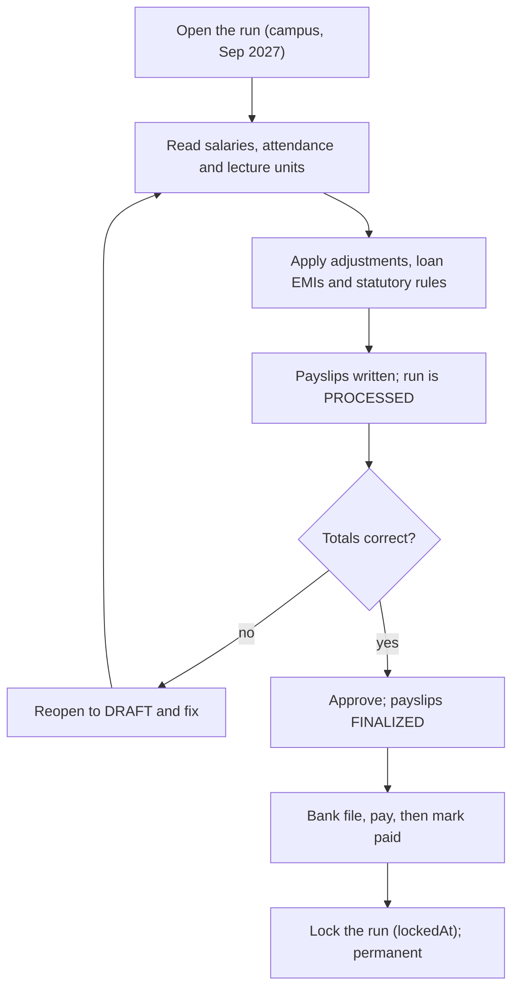
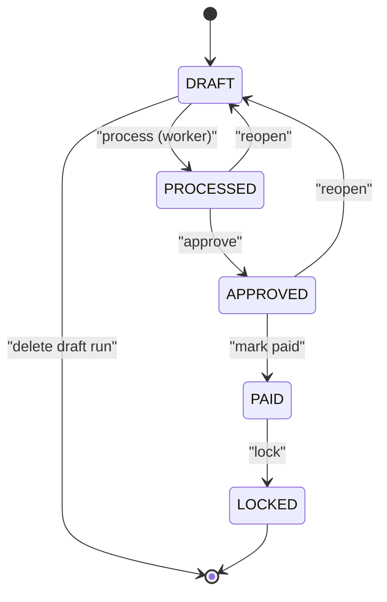
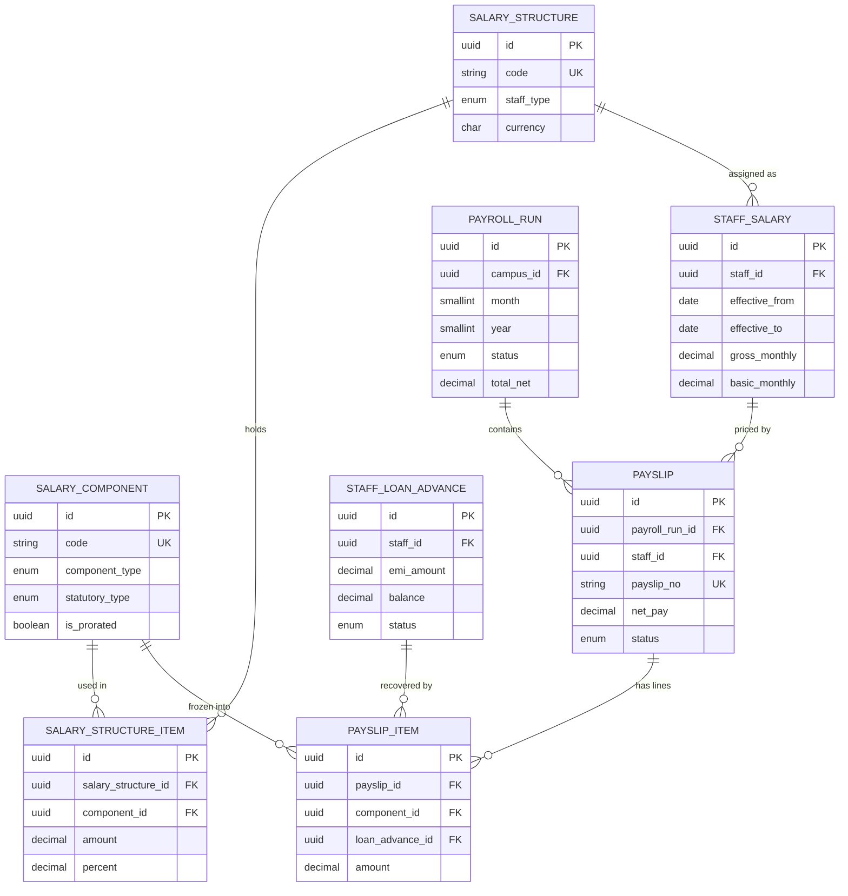

# Payroll Module

**In simple words:** Payroll is the money the institute pays its own people. Today Suresh Gupta keeps an Excel sheet, copies last month's figures and subtracts unpaid leave by hand. This module keeps the pay heads, the salary of every staff member with its revision history, and one monthly payroll run per campus that walks through draft, processed, approved, paid and locked. It reads attendance for loss-of-pay days, applies bonuses, fines and loan instalments, calculates the Indian statutory deductions the organization has switched on, makes the payslip PDF and the bank file, and lets every staff member open the own payslip from a phone.

| Item | Value |
|---|---|
| Module code | PRL |
| Release phase | Phase 3 (V1.5), by June 2027 |
| Plans | Pro, Enterprise (plan feature `module.PRL`); not on Starter or Growth |
| Main users | Organization Admin, Accountant, HR Manager (custom role), staff |
| Depends on | Staff, Attendance, Leave, Multi Campus, Settings, Notifications |
| Used by | Dashboard, Analytics, Timetable (lecture counts), Certificates |
| Main tables | `salary_components`, `salary_structures`, `staff_salaries`, `payroll_runs`, `payslips`, `staff_loan_advances` |
| Endpoints | PRL-API-01 to PRL-API-62 |
| Build prompt | P-47 |

> **Warning:** EduFlow calculates statutory deductions from rates that the organization enters. EduFlow is not a tax adviser and does not file returns. Every rate, ceiling and slab in this chapter is a starting value that the institute must confirm with its chartered accountant before the first live run. The product shows this same line on the statutory settings screen.

## Objective

1. Sharma Classes finishes the monthly payroll of 28 staff in under 20 minutes, from opening the run to the bank file, instead of two days in Excel.
2. Loss-of-pay days come from attendance and leave data that already exists, so the salary always matches the register.
3. The user who processes a run can never approve the same run.
4. Every staff member sees the own payslip in the app within a minute of approval, and no colleague can see it.
5. A locked run is permanent. Once ORG_ADMIN locks September 2027, no API call can change a rupee of it.
6. Salary data never leaks through a list API. Gross, net and bank details appear only where `payroll.view` allows it, or on the person's own payslip.

## Scope

### In scope

- Pay heads (`SalaryComponent`): earning, deduction or employer contribution; fixed, percent of basic, percent of gross or formula; with taxable, prorate and visibility flags.
- Salary structures such as "Teaching Staff Grade A" with their component items, plus a preview that breaks a CTC or gross figure into lines before anybody is assigned to it.
- Staff salary with effective dates: one row per revision, CTC, gross, basic, pay basis (monthly, per lecture, per hour, per day), component overrides, statutory flags and bulk revision.
- Monthly payroll run per campus with the statuses `DRAFT`, `PROCESSED`, `APPROVED`, `PAID` and `LOCKED`, plus off-cycle, full-and-final, bonus and arrears runs.
- Payslips with frozen lines, hold, release, cancel, PDF and delivery to the staff member.
- Loss of pay: paid days, LOP days and per-lecture units read from attendance, approved unpaid leave and completed class sessions.
- Indian statutory items as configurable components: PF, EPS, ESI, professional tax, TDS and labour welfare fund, with employer registrations per organization or campus.
- Loans and salary advances with an EMI plan, approval, disbursal and automatic recovery from payslips.
- One-off adjustments: bonus, incentive, arrears, reimbursement, overtime, substitution pay, leave encashment, fine and recovery, with approval and Excel import.
- Annual tax declarations, proof verification by ORG_ADMIN, and the monthly TDS they drive.
- Bank transfer file, statutory files, salary register, payslip ZIP and the payroll dashboard summary.

### Out of scope

- Filing returns with EPFO, ESIC or the income-tax department. EduFlow makes the file; a human uploads it.
- Form 16 and the 24Q quarterly return. Phase 4.
- Capturing attendance (*Attendance Module*) and approving leave (*Leave Module*). Payroll only reads approved unpaid leave.
- Moving money. The institute uploads the bank file to its bank portal.
- Gratuity provisioning, pension fund accounting and employee stock plans.

### Phase notes

- Phase 3 (June 2027) ships the whole list above for India, plus the international escape hatch: outside India the statutory components are switched off and the salary register exports in the layout the local payroll provider expects.
- Phase 4 adds Form 16 and 24Q preparation, and a rate pack that EduFlow updates centrally after a budget change.

## User Stories

| ID | As a | I want to | So that | Priority |
|---|---|---|---|---|
| PRL-US-01 | Organization Admin | create pay heads such as Basic, HRA and PF | salary lines match how we already talk about pay | Must |
| PRL-US-02 | Organization Admin | build a salary structure for teaching staff | a new teacher is set up in one click | Must |
| PRL-US-04 | Organization Admin | assign a salary with an effective date | an old month is still calculated on the old salary | Must |
| PRL-US-07 | Accountant | process the run so payslips are calculated | I do not add up anything by hand | Must |
| PRL-US-08 | Accountant | see paid days and LOP days pulled from attendance | unpaid leave is deducted without a second register | Must |
| PRL-US-11 | Organization Admin | approve the run and see who processed it | two pairs of eyes see every rupee | Must |
| PRL-US-12 | Accountant | download the bank transfer file | I upload one file instead of 28 payments | Must |
| PRL-US-13 | Organization Admin | record a loan and let EMIs come off the salary | I never chase a recovery again | Should |
| PRL-US-14 | Teacher | open my payslip on my phone | I can show it for a loan application | Must |
| PRL-US-15 | Teacher | submit my investment declaration online | my TDS is right from April, not from January | Should |
| PRL-US-16 | Organization Admin | lock a paid month | nobody can quietly change an old salary | Must |

## Workflow

**Figure: Monthly payroll run, from draft to locked**



The run never calculates inside the request. `POST /payroll-runs/:id/process` answers `202 Accepted` and a BullMQ worker does the work, because 500 staff across three campuses take longer than an HTTP request should last. The worker writes an exception list next to the totals: staff with no salary row, staff with no bank account, and payslips where net pay would go below zero.

**Figure: Payroll run status lifecycle**



### Status lifecycle

| Status | Set by | What is possible in it | Next |
|---|---|---|---|
| `DRAFT` | create or reopen | Process, delete the run, edit payslips | `PROCESSED` |
| `PROCESSED` | process worker | Edit draft payslips, hold, reopen, approve | `APPROVED`, `DRAFT` |
| `APPROVED` | `payroll.approve` | Bank file, payslip PDFs, send, reopen, mark paid | `PAID`, `DRAFT` |
| `PAID` | `payroll.process` | Statutory files, cancel a payslip, lock | `LOCKED` |
| `LOCKED` | `payroll.approve` | Read and export only. No write ever | none |

| Payslip status | When it happens | Effect |
|---|---|---|
| `DRAFT` | run is `DRAFT` or `PROCESSED` | Editable, recalculated on every process |
| `FINALIZED` | run approved | Frozen; the PDF can be made and sent |
| `PAID` | run marked paid | Loan recovery counted; visible in `/my-payslips` |
| `ON_HOLD` | held before approval | Left out of the run totals and the bank file |
| `CANCELLED` | cancelled after approval | Reversed; reason and user written to the audit log |

A loan walks `PENDING` to `APPROVED` to `ACTIVE` to `CLOSED`. Only an `ACTIVE` loan is deducted; `REJECTED` and `CANCELLED` loans never are.

## Screens and Wireframes

| ID | Screen | Users | Purpose |
|---|---|---|---|
| PRL-S02 | Salary Structures | ORG_ADMIN | Build templates and preview a CTC breakup |
| PRL-S03 | Staff Salaries | ORG_ADMIN | Assign, revise and see revision history |
| PRL-S04 | Assign Salary drawer | ORG_ADMIN | One salary revision with effective date |
| PRL-S05 | Payroll Runs | Accountant, ORG_ADMIN | List runs by campus, month and status |
| PRL-S06 | Payroll Run Detail | Accountant, ORG_ADMIN | Process, review, approve, pay, lock |
| PRL-S07 | Payslip Detail | Accountant, ORG_ADMIN | Earning and deduction lines, hold, PDF |
| PRL-S08 | Adjustments | Accountant, ORG_ADMIN | Bonus, arrears, fine; approve and import |
| PRL-S09 | Loans and Advances | ORG_ADMIN | EMI plan, approve, disburse, close |
| PRL-S10 | Statutory Settings | ORG_ADMIN | PF, ESI, PT, TAN registrations and ceilings |
| PRL-S11 | My Payslips (mobile) | Every staff member | Own payslips, PDF, loan balance |

**Screen PRL-S06 — Payroll Run Detail (Accountant, web)**

```text
+--------------------------------------------------------------------------+
| EduFlow  Bright Future Public School      Main Campus, Lucknow   (SG) v  |
+--------------------------------------------------------------------------+
| Payroll > Runs > September 2027    Type: REGULAR      Status: PROCESSED  |
+--------------------------------------------------------------------------+
| Staff 42 | Gross Rs 18,64,200 | Deductions Rs 2,41,700 | Net 16,22,500   |
| Employer cost Rs 19,41,900          Processed 28 Sep 2027 by S. Gupta    |
+--------------------------------------------------------------------------+
| Exceptions (3)   [ ] hide resolved                                       |
|  ! 2 staff have no salary row effective in Sep 2027      [Fix]           |
|  ! 1 staff has no bank account; payment mode set to CASH [Open]          |
+--------------------------------------------------------------------------+
| Filter [All staff v] [All status v]  Search [______________]             |
|--------------------------------------------------------------------------|
| Code       Name            Paid/LOP  Gross      Deduct    Net    Status  |
| BF-EMP-042 Priya Nair      28 / 2    49,800.00  4,800.00  45,000 DRAFT   |
| BF-EMP-051 Rakesh Yadav    30 / 0    36,400.00  2,184.00  34,216 DRAFT   |
| BF-EMP-063 Meena Joshi     30 / 0    28,000.00  1,680.00  26,320 HOLD    |
| BF-EMP-077 Imran Qureshi   15 / 0    22,000.00  1,320.00  20,680 DRAFT   |
|--------------------------------------------------------------------------|
| Showing 4 of 42                                    < 1 2 ... 11 >        |
+--------------------------------------------------------------------------+
| [Reopen to Draft] [Recalculate]            [Send for Approval]           |
+--------------------------------------------------------------------------+
```

- The cards read `staffCount`, `totalGross`, `totalDeductions`, `totalNet` and `totalEmployerCost` from the run; the browser sums nothing.
- Exceptions come from `GET /payroll-runs/:id` (PRL-API-18) and each one links to the screen that fixes it.
- `[Recalculate]` calls PRL-API-21 again and is disabled once the run is `APPROVED`. `[Send for Approval]` is hidden without `payroll.approve`.
- A held payslip shows `HOLD`, is greyed out, and its amounts are left out of the cards.

**Screen PRL-S04 — Assign Salary (Organization Admin, web)**

```text
+--------------------------------------------------------------------------+
| Assign salary - Priya Nair (BF-EMP-0042, TGT Science)             [x]    |
+--------------------------------------------------------------------------+
| Structure     [Teaching Staff Grade A (TCH-A) v]                         |
| Pay basis     (o) Monthly ( ) Per lecture ( ) Per hour ( ) Per day       |
| Effective from [ 01-04-2027 ]   Reason [Annual increment           ]     |
| Gross monthly  [ 48000.00 ]     Basic  [ 24000.00 ]   Currency INR       |
|--------------------------------------------------------------------------|
| Component            Rule                 Monthly     Override           |
| Basic                50% of gross         24,000.00   [_________]        |
| HRA                  40% of basic          9,600.00   [_________]        |
| Conveyance           Fixed                 1,600.00   [_________]        |
| Special Allowance    Balance of gross     12,800.00   [_________]        |
| PF Employee          min(BASIC,15000)*12%  1,800.00   locked             |
|--------------------------------------------------------------------------|
| Gross Rs 48,000.00   Employer PF Rs 1,800.00   CTC/yr Rs 5,97,600.00     |
|--------------------------------------------------------------------------|
| Statutory  [x] PF   [ ] ESI   [ ] Professional tax   [x] TDS             |
| Tax regime [New v]   Payment mode [Bank transfer v]  A/c ****4417        |
| Note: the revision from 01-04-2026 will be closed on 31-03-2027.         |
+--------------------------------------------------------------------------+
|                                     [Cancel]  [Save revision]            |
+--------------------------------------------------------------------------+
```

- The component table is the answer of `POST /salary-structures/:id/preview` (PRL-API-10), recomputed whenever gross or basic changes.
- `Override` writes `StaffSalary.componentOverrides` as `[{ componentId, amount }]`; an empty box keeps the structure rule.
- ESI is disabled because gross Rs 48,000 is above `esiWageCeiling` of Rs 21,000.
- `[Save revision]` calls PRL-API-12, which closes the previous row on 31-03-2027.

**Screen PRL-S07 — Payslip Detail (Accountant, web)**

```text
+--------------------------------------------------------------------------+
| Payslip PS-2027-09-0042   Priya Nair   September 2027     [FINALIZED]    |
+--------------------------------------------------------------------------+
| Working days 30 | Paid days 28 | LOP days 2 | Structure TCH-A            |
+--------------------------------------------------------------------------+
| Earnings                     Amount | Deductions              Amount     |
| Basic (28/30)             22,400.00 | PF Employee           1,800.00     |
| HRA (28/30)                8,960.00 | ESI Employee                  -    |
| Conveyance (28/30)         1,493.33 | Professional tax              -    |
| Special Allowance (28/30) 11,946.67 | TDS                           -    |
| Festival Bonus             5,000.00 | Advance EMI 3 of 6    3,000.00     |
|--------------------------------------------------------------------------|
| Gross earnings            49,800.00 | Total deductions      4,800.00     |
|                                     | Net pay              45,000.00     |
+--------------------------------------------------------------------------+
| Employer PF Rs 1,800.00 (EPS 1,249.50 + EPF 550.50). Not paid to staff.  |
| PF wages Rs 15,000.00   Paid by BANK_TRANSFER to A/c ****4417            |
+--------------------------------------------------------------------------+
| [Hold] [Cancel payslip] [Download PDF] [Send to staff]                   |
+--------------------------------------------------------------------------+
```

- Lines come from `payslip_items` in `sortOrder` and are frozen, so a later change to a pay head never moves an old payslip. A deduction that does not apply prints `-`, not `0.00`.
- `[Hold]` (PRL-API-32) is hidden once the run is `PAID`; `[Cancel payslip]` needs `payroll.approve`.

**Screen PRL-S11 — My Payslips (staff, mobile)**

```text
+------------------------------------+
| < My Payslips          Priya Nair  |
+------------------------------------+
| Financial year [2027-28 v]         |
+------------------------------------+
| Sep 2027            Net Rs 45,000  |
| Paid 30 Sep  Bank ****4417   [PDF] |
|------------------------------------|
| Aug 2027            Net Rs 48,000  |
| Paid 31 Aug  Bank ****4417   [PDF] |
|------------------------------------|
| Jul 2027            Net Rs 48,000  |
| Paid 31 Jul  Bank ****4417   [PDF] |
+------------------------------------+
| My advance                         |
| Rs 18,000 taken, Rs 9,000 left     |
| Next EMI Rs 3,000 in Oct 2027      |
|                     [View details] |
+------------------------------------+
| Tax declaration FY 2027-28         |
| Status: VERIFIED   Regime: New     |
|                          [Open]    |
+------------------------------------+
```

- The list is `GET /my-payslips` (PRL-API-57) and returns only `FINALIZED` and `PAID` payslips, so no draft figure leaks.
- `[PDF]` calls PRL-API-58 and opens a pre-signed S3 link that expires in 15 minutes. The advance card is PRL-API-61 and shows the balance only.

## UI Components

| Component | Type | Behaviour |
|---|---|---|
| RunStatusBadge | Badge | Colour per status; grey `DRAFT`, blue `PROCESSED`, amber `APPROVED`, green `PAID`, black `LOCKED` |
| MoneyCell | Table cell | Right aligned, two decimals, Indian grouping, `-` when null |
| ComponentBuilder | Form list | Drag to reorder, rule picker, live preview from PRL-API-10 |
| EffectiveDateField | Date input | Blocks a date inside a locked month; names the revision it closes |
| ExceptionList | Alert list | One row per exception with a deep link; collapses when empty |
| PayslipSheet | Two-column panel | Earnings left, deductions right; totals row always visible |
| PayrollEmptyState | Empty state | "No run for September 2027 yet" plus `[Create run]` |
| SalaryMaskedText | Inline text | Renders `****` for a user without `payroll.view` |

All tables use the shared `DataTable` with skeleton rows while loading and an error state that prints `error.code` and the `requestId`. Every destructive button (`Reopen`, `Cancel payslip`, `Lock`) opens a confirm dialog that repeats the amount or the count that will change.

## Validation Rules

| Field | Rule | Error message shown to user |
|---|---|---|
| `SalaryComponent.code` | 2 to 20 chars, `A-Z`, digits and `_`, unique in the organization | "This code is already used by another pay head." |
| `SalaryComponent.formula` | Only `+ - * / ( ) min max round` and known component codes | "The formula uses an unknown name or symbol." |
| `StaffSalary.effectiveFrom` | Not before `Staff.joiningDate`; not inside a locked month | "Choose a date on or after the joining date." |
| `StaffSalary.grossMonthly` | Greater than 0 and not less than `basicMonthly` | "Gross salary cannot be less than basic salary." |
| `StaffSalary.ratePerUnit` | Required when `payBasis` is not `MONTHLY` | "Enter the rate per lecture, hour or day." |
| `PayrollRun.month` | 1 to 12; the run must not already exist for the campus | "A regular run for this month already exists." |
| `Payslip.paidDays` | 0 to `workingDays`, one decimal | "Paid days cannot be more than working days." |
| `Payslip.lopDays` | `paidDays + lopDays` equals `workingDays` | "Paid days plus LOP days must equal working days." |
| `PayrollAdjustment.amount` | Greater than 0, up to 99,99,999.99 | "Enter an amount greater than zero." |
| `StaffLoanAdvance.emiAmount` | `emiAmount * installments` within 1 rupee of `totalPayable` | "EMI times instalments does not match the total payable." |

## Business Rules

### Set-up and salary

**PRL-BR-01. A pay head code is a formula variable.** `SalaryComponent.code` is written in capitals and is the variable name inside a formula. `BASIC`, `HRA`, `GROSS` and `CTC` are reserved. A formula is read by a safe expression parser, never by `eval`, and may use only `+ - * / ( )` and the functions `min`, `max` and `round`.

**PRL-BR-02. The structure is a template; the salary row is the truth.** Changing a `SalaryStructure` never changes an existing `StaffSalary` or any payslip. It changes only what happens the next time somebody is assigned to it.

**PRL-BR-03. One open salary row per staff member.** `effectiveTo` is `null` on the current row. A new revision from 01-04-2027 sets the previous row's `effectiveTo` to 31-03-2027 in the same transaction. Rows never overlap, and the unique key `(organizationId, staffId, effectiveFrom)` blocks a duplicate date.

**PRL-BR-04. A run uses the revision effective on the last day of the period.** For September 2027 it picks the row where `effectiveFrom <= 2027-09-30` and `effectiveTo` is null or `>= 2027-09-30`. An older month is never recalculated; the difference is paid as an `ARREARS` adjustment (PRL-BR-16), which keeps one payslip per staff member per month.

**PRL-BR-05. Working days, paid days and LOP days.** `workingDays` is the number of calendar days in the period, so September 2027 is 30. `lopDays` is unpaid-leave days (`LeaveType.isPaid` false) plus days marked `ABSENT` with no approved leave; half days count as 0.5. `paidDays = workingDays - lopDays`. A weekly off or a declared holiday is never an LOP day.

**PRL-BR-06. Proration.** A component with `isProrated = true` is multiplied by `paidDays / workingDays`. A component with `isProrated = false`, such as a fixed reimbursement, is paid in full.

> **Example:** Priya Nair has gross Rs 48,000 with basic Rs 24,000, HRA Rs 9,600, conveyance Rs 1,600 and special allowance Rs 12,800. September 2027 has 30 working days, 2 LOP days, so the factor is 28/30 = 0.933333. Basic 22,400.00, HRA 8,960.00, conveyance 1,493.33, special allowance 11,946.67. The four lines add up to exactly Rs 44,800.00.

**PRL-BR-07. Non-monthly pay basis.** When `payBasis` is `PER_LECTURE`, `PER_HOUR` or `PER_DAY` there is no proration: earnings are `unitsWorked * ratePerUnit`. `unitsWorked` is counted from `ClassSession` rows with status `COMPLETED`, and the Accountant may correct it on the draft payslip.

> **Example:** A visiting physics faculty at Sharma Classes has `ratePerUnit = 800.00`. The timetable shows 46 completed sessions in September 2027, so gross earnings are 46 x 800 = Rs 36,800.00 and LOP days stay 0.

### Adjustments, loans and statutory deductions

**PRL-BR-08. Only approved adjustments enter a run.** An adjustment is picked up when its `status` is `APPROVED`, its `year` and `month` match the run, and its staff member is in the run's campus. Adjustments are never prorated. Once applied, the run writes `payrollRunId` and `payslipId` on it, so it can never be counted twice.

**PRL-BR-09. Loan EMI recovery.** For every `ACTIVE` loan whose `recoveryStartDate` is on or before the period end, the run adds a deduction line of `emiAmount` with `loanAdvanceId` set. The last instalment is `balance` when `balance < emiAmount`, so recovery never overshoots. If net pay would fall below zero the EMI is cut to what is left and the rest moves to next month. `amountRecovered` and `balance` are written only when the run is marked `PAID`, so a reopened run never double counts.

**PRL-BR-10. Provident Fund.** PF applies when `StaffSalary.pfApplicable` is true. `pfWages = min(prorated basic, PayrollStatutorySetting.pfWageCeiling)`. Employee PF is 12 percent of `pfWages`. Employer PF is also 12 percent, split into EPS at 8.33 percent of `epsWages` and EPF at the remainder. The employer part is an `EMPLOYER_CONTRIBUTION` component: it is part of CTC and never reduces net pay.

> **Example:** Priya's prorated basic is Rs 22,400.00 and the ceiling is Rs 15,000.00, so PF wages are Rs 15,000.00. Employee PF = 15,000 x 12% = Rs 1,800.00. Employer = Rs 1,800.00, of which EPS = 15,000 x 8.33% = Rs 1,249.50 and EPF = Rs 550.50.

**PRL-BR-11. Employees' State Insurance.** ESI applies when `esiApplicable` is true and gross earnings are at or below `esiWageCeiling`. Employee share is 0.75 percent of `esiWages`, employer share 3.25 percent, both rounded up to the next rupee. Somebody who crosses the ceiling mid-period keeps paying to the end of the contribution period, so `esiApplicable` is a flag on the salary row, not a live comparison.

> **Example:** Rakesh Yadav, a lab assistant, earns gross Rs 18,600.00, below the Rs 21,000.00 ceiling. Employee ESI = 18,600 x 0.75% = 139.50, rounded up to Rs 140.00. Employer ESI = 18,600 x 3.25% = 604.50, rounded up to Rs 605.00.

**PRL-BR-12. Professional tax is a state matter.** PT applies when `ptApplicable` is true and `ptStateCode` is set for the campus. The amount comes from a slab table the organization enters, keyed by monthly or annual salary. A state that does not levy PT has no setting, and the payslip shows `-`.

> **Example:** Lucknow is in Uttar Pradesh, which levies no professional tax, so Priya's PT line is empty. Sharma Classes is in Patna, Bihar, where the organization has entered a yearly PT of Rs 2,500 for salaries above Rs 10,00,000. EduFlow deducts Rs 208.00 in eleven months and Rs 212.00 in March, exactly Rs 2,500.00.

**PRL-BR-13. TDS is projected, not guessed.** For a staff member with `tdsApplicable`, the worker projects annual taxable income as: income already paid this financial year, plus the current month, plus the same figure for each remaining month, plus `previousEmployerIncome`, minus the exemptions the chosen `TaxRegime` and the verified rows of `StaffTaxDeclaration` allow. It applies the slab table the organization entered, subtracts `tdsYtd` and `previousEmployerTds`, and divides by the remaining months.

> **Example (assumption, confirm with a CA):** For FY 2027-28 the organization has entered the new-regime pack: standard deduction Rs 75,000; nil up to Rs 4,00,000; 5 percent to Rs 8,00,000; 10 percent to Rs 12,00,000; 15 percent to Rs 16,00,000; cess 4 percent; rebate under section 87A up to total income of Rs 12,00,000. Priya's projected income is Rs 5,77,800, so after standard deduction Rs 5,02,800 falls inside the rebate and her monthly TDS is Rs 0.00. Manoj Kumar at Sharma Classes earns Rs 1,10,000 a month. Projected income Rs 13,20,000 less Rs 75,000 is Rs 12,45,000. Tax = 0 + 20,000 + 40,000 + 6,750 = Rs 66,750, plus 4 percent cess Rs 2,670, which is Rs 69,420 a year, or Rs 5,785.00 a month.

**PRL-BR-14. Rounding.** Every component is rounded half-up to two decimals as it is written to `payslip_items`, and totals are the sum of the rounded lines, so the payslip always adds up. Statutory employee shares are rounded up to the next whole rupee, which is what the EPFO and ESIC files expect.

**PRL-BR-15. Net pay can never be negative.** If deductions exceed earnings, the worker cuts voluntary deductions in this order until net pay reaches zero: loan EMI, then fines, then other voluntary lines. Statutory deductions are never cut. The payslip is flagged in the exceptions and the Accountant decides whether to hold it.

### Runs, arrears and locking

**PRL-BR-16. Arrears from a back-dated revision.** When a revision starts inside a month that is already `PAID` or `LOCKED`, EduFlow does not touch that run. It offers one `ARREARS` adjustment per affected month for the difference.

> **Example:** Priya's revision from Rs 44,000 to Rs 48,000 is effective 01-07-2027 but is entered on 20-09-2027. July and August are locked. EduFlow creates an arrears adjustment of 2 x Rs 4,000 = Rs 8,000.00 in the September run, taxable, with the reason "Arrears for Jul-Aug 2027 revision".

**PRL-BR-17. Off-cycle runs stand alone.** A `FULL_AND_FINAL`, `BONUS`, `ARREARS` or `OFF_CYCLE` run has its own `runNo` and does not disturb the regular run. The partial unique index `uq_payslip_staff_month` allows only one live `REGULAR` payslip per staff member per month, so a mid-month campus transfer can never produce two salaries.

**PRL-BR-18. Separation of duties and locking.** A user with both keys still cannot approve a run the same user processed; the API compares `processedById` with the caller. The role builder warns when a custom role is given `payroll.process` and `payroll.approve` together. After `lock`, every write endpoint on the run, its payslips and its adjustments answers `422 BUSINESS_RULE_VIOLATION`.

**PRL-BR-19. Outside India, EduFlow exports instead of calculating.** When `PayrollStatutorySetting.countryCode` is not `IN`, every component with a `statutoryType` other than `NONE` is switched off. The run still computes gross, adjustments and loan recovery, and the salary register exports in a provider layout (Xero or KeyPay for Australia, Gusto or ADP for the USA, a WPS SIF file for the UAE). The provider computes the local tax, and the screen says so in one line.

**PRL-BR-20. Plan and history limits.** Payroll is a Pro and Enterprise feature. A Growth organization that opens the screen gets `403 PLAN_LIMIT_REACHED` with an upgrade link. Payroll history is never auto-deleted, because these records must survive statutory retention.

## Acceptance Criteria

| ID | Given | When | Then |
|---|---|---|---|
| PRL-AC-03 | Priya has a salary from 01-04-2026 | A revision from 01-04-2027 is saved | The old row gets `effectiveTo` 31-03-2027 in the same transaction |
| PRL-AC-04 | September 2027 is `LOCKED` | A revision with `effectiveFrom` 10-09-2027 is saved | The salary is stored and an `ARREARS` adjustment is offered |
| PRL-AC-06 | A draft run for 42 staff | `POST /payroll-runs/:id/process` | `202 Accepted` with a `jobId`; run becomes `PROCESSED` |
| PRL-AC-07 | Priya has 2 unpaid leave days | The run is processed | `paidDays` 28, `lopDays` 2, basic Rs 22,400.00 |
| PRL-AC-09 | An `ACTIVE` advance with balance Rs 2,000 and EMI Rs 3,000 | The run is processed | The deduction is Rs 2,000 and the loan closes when the run is paid |
| PRL-AC-10 | Suresh processed the run | Suresh calls approve with both keys | `403 FORBIDDEN`, "The user who processed a run cannot approve it." |
| PRL-AC-11 | A run is `PROCESSED` with one `ON_HOLD` payslip | The run is approved | The held payslip stays `ON_HOLD` and is not in `totalNet` |
| PRL-AC-14 | A run is `PAID` | ORG_ADMIN locks it | `lockedAt` is set and every later write answers `422` |
| PRL-AC-15 | A run is `LOCKED` | The Accountant tries to reopen it | `422 BUSINESS_RULE_VIOLATION`, "A locked run can never be reopened." |
| PRL-AC-17 | Priya opens `/my-payslips` | She asks for a colleague's payslip id | `404 NOT_FOUND`, never `403`, so no salary existence leaks |

## Edge Cases

| Case | What happens | How the system handles it |
|---|---|---|
| Staff joins on 18 Sep 2027 | Only part of the month is worked | `workingDays` 30, `lopDays` 17, paid from the joining date |
| Staff resigns on 12 Sep 2027 | Salary due for 12 days | `FULL_AND_FINAL` run with leave encashment and notice recovery |
| Transfer from Main to City campus on 15 Sep | Two campuses claim the staff member | The partial unique index allows one regular payslip; it stays with the campus on `periodEnd` |
| No bank account on file | Bank file row impossible | `paymentMode` falls back to `CASH` and the run shows an exception |
| Deductions exceed earnings | Net pay would be negative | Voluntary deductions are cut in order (PRL-BR-15) and the payslip is flagged |
| Loan EMI larger than remaining balance | Over-recovery risk | The last EMI equals the balance; the loan is closed when the run is paid |
| Two users approve at the same moment | Double state change | Optimistic lock on `PayrollRun.status`; the second call gets `409 CONFLICT` |
| Process job crashes halfway | Half-written payslips | The worker writes inside one transaction per run; a failed job leaves the run in `DRAFT` and raises `payroll.run.process_failed` |
| Statutory rate changed mid-year | Old months must not move | Rates live in `PayrollStatutorySetting` and every payslip freezes its own figures in `statutorySummary` |

## Database Schema

| Table | Purpose |
|---|---|
| `salary_components` | Pay heads with their rule and statutory type |
| `salary_structures` | Reusable salary templates per staff type |
| `salary_structure_items` | The components inside one structure |
| `staff_salaries` | One row per salary revision, with dates |
| `payroll_runs` | One run per campus and month, with totals and status |
| `payslips` | One staff member in one run, with frozen totals |
| `payslip_items` | The earning and deduction lines of a payslip |
| `staff_loan_advances` | Loans and advances with EMI plan and balance |
| `payroll_adjustments` | One-off earnings and deductions for a month |
| `payroll_statutory_settings` | Employer registrations and wage ceilings |
| `staff_tax_declarations` | Annual declaration and previous-employer income |

### Table payroll_runs

| Column | Type | Null | Default | Notes |
|---|---|---|---|---|
| `id` | uuid | No | `uuid()` | PK |
| `organization_id`, `campus_id`, `month`, `year` | uuid, smallint | No | | Tenant, campus and payroll month |
| `run_type`, `run_no` | enum, smallint | No | `REGULAR`, `1` | `run_no` counts up for off-cycle runs |
| `period_start`, `period_end` | date | No | | Normally the first and last day of the month |
| `status` | enum | No | `DRAFT` | `PayrollRunStatus` |
| `total_gross`, `total_deductions`, `total_net` | decimal(12,2) | No | `0` | Sums over the payslips of the run |
| `total_employer_cost` | decimal(12,2) | No | `0` | Employer PF and ESI on top of gross |
| `approved_by_id`, `approved_at` | uuid, timestamptz | Yes | | FK `users`, set null on delete |
| `paid_at`, `locked_at` | timestamptz | Yes | | `locked_at` makes the run permanent |

### Table payslips

| Column | Type | Null | Default | Notes |
|---|---|---|---|---|
| `id` | uuid | No | `uuid()` | PK |
| `payroll_run_id`, `staff_id` | uuid | No | | FK `payroll_runs`, `staff`; restrict |
| `staff_salary_id` | uuid | Yes | | Revision used for the calculation |
| `working_days`, `paid_days`, `lop_days` | decimal(4,1) | No | | Half days allowed |
| `pf_wages`, `eps_wages`, `esi_wages`, `pt_wages` | decimal(12,2) | Yes | | Wage bases frozen for the returns |
| `statutory_summary` | jsonb | Yes | | `{ pfEmployee, pfEmployer, eps, esiEmployee, esiEmployer, pt, tds, lwf }` |
| `gross_earnings`, `total_deductions`, `net_pay` | decimal(12,2) | No | | `net_pay` is gross minus deductions |
| `status`, `payment_mode` | enum | No | `DRAFT`, `BANK_TRANSFER` | `PayslipStatus`, `SalaryPaymentMode` |
| `snapshot` | jsonb | Yes | | Frozen name, code, designation and attendance for the PDF |
| `pdf_file_id`, `sent_at` | uuid, timestamptz | Yes | | FK `file_assets`; `sent_at` records delivery |

### Indexes and constraints

- Unique keys: `salary_components (organization_id, code)`, `salary_structures (organization_id, code)`, `salary_structure_items (organization_id, salary_structure_id, component_id)`, `staff_salaries (organization_id, staff_id, effective_from)`, `payroll_runs (organization_id, campus_id, year, month, run_type, run_no)`, `payslips (organization_id, payroll_run_id, staff_id)` and `(organization_id, payslip_no)`.
- Every index starts with `organization_id`. The hot ones are `payroll_runs (organization_id, status, year, month)`, `payslips (organization_id, staff_id, year, month)` and `staff_salaries (organization_id, staff_id, effective_to)`.
- Partial unique index written by hand in the SQL migration: `uq_payslip_staff_month (organization_id, staff_id, year, month) WHERE run_type = 'REGULAR' AND status <> 'CANCELLED'`.
- `payroll_statutory_settings`: unique `(organization_id, campus_key)`; `campus_key` is `ALL` or the campus id, so the key needs no nulls. `staff_tax_declarations`: unique `(organization_id, staff_id, financial_year)`.
- Row-Level Security is on for all eleven tables with the standard `organization_id = current_setting('app.current_org')::uuid` policy.

**Figure: Payroll tables and how they join**



`PAYROLL_ADJUSTMENT`, `PAYROLL_STATUTORY_SETTING` and `STAFF_TAX_DECLARATION` are left out to keep the picture readable. An adjustment points at the run and payslip that consumed it; the other two are read during processing.

## Prisma Schema

Copied from `docs/src/_schema/12-payroll.prisma`. No field is renamed and nothing is added.

```prisma
// 12-payroll: salary components and structures, staff salary assignments, monthly payroll runs,
// payslips with line items, staff loans / advances and one-off payroll adjustments.

enum SalaryComponentType {
  EARNING
  DEDUCTION
  EMPLOYER_CONTRIBUTION // employer PF / ESI: part of CTC, not of take-home pay
}

enum SalaryCalculationType {
  FIXED
  PERCENT_OF_BASIC
  PERCENT_OF_GROSS
  FORMULA
}

// Statutory scheme a component belongs to (India first, then the Phase 2 markets).
enum StatutoryType {
  NONE
  PF // Provident Fund (India)
  ESI // Employees' State Insurance (India)
  PT // Professional Tax (India)
  TDS // income tax deducted at source (India)
  LWF // Labour Welfare Fund (India)
  SUPERANNUATION // Australia
  PAYG_WITHHOLDING // Australia
  FEDERAL_INCOME_TAX // USA
  STATE_INCOME_TAX // USA
  SOCIAL_SECURITY // USA FICA
  MEDICARE // USA FICA
  GRATUITY // UAE end-of-service / India gratuity
  PENSION_GPSSA // UAE nationals
  OTHER_STATUTORY
}

// How a staff member is paid. Visiting / part-time faculty are paid per lecture or hour.
enum PayBasis {
  MONTHLY
  PER_LECTURE
  PER_HOUR
  PER_DAY
}

// India income-tax regime of the employee.
enum TaxRegime {
  OLD
  NEW
  NOT_APPLICABLE
}

enum PayrollRunType {
  REGULAR
  OFF_CYCLE
  FULL_AND_FINAL
  BONUS
  ARREARS
}

enum PayrollRunStatus {
  DRAFT
  PROCESSED
  APPROVED
  PAID
  LOCKED
}

enum PayslipStatus {
  DRAFT
  FINALIZED
  PAID
  ON_HOLD
  CANCELLED
}

enum SalaryPaymentMode {
  BANK_TRANSFER
  CASH
  CHEQUE
  UPI
}

enum LoanAdvanceType {
  LOAN
  SALARY_ADVANCE
}

enum LoanAdvanceStatus {
  PENDING
  APPROVED
  REJECTED
  ACTIVE // disbursed; recovery in progress
  CLOSED
  CANCELLED
}

enum PayrollAdjustmentType {
  BONUS
  INCENTIVE
  ARREARS
  REIMBURSEMENT
  OVERTIME
  SUBSTITUTION_PAY // covered periods (Substitution.status = COMPLETED)
  LEAVE_ENCASHMENT // LeaveBalance.encashed days paid out
  OTHER_EARNING
  FINE
  RECOVERY
  OTHER_DEDUCTION
}

// Pay head: Basic, HRA, Conveyance, PF, Professional Tax, TDS ...
model SalaryComponent {
  id              String                @id @default(uuid()) @db.Uuid
  organizationId  String                @map("organization_id") @db.Uuid
  name            String                @db.VarChar(100)
  code            String                @db.VarChar(20) // BASIC, HRA, PF_EE ... also used as the variable name in formulas
  componentType   SalaryComponentType   @map("component_type")
  calculationType SalaryCalculationType @default(FIXED) @map("calculation_type")
  defaultAmount   Decimal?              @map("default_amount") @db.Decimal(12, 2) // FIXED
  currency        String?               @db.Char(3) // currency of defaultAmount; required when calculationType is FIXED
  countryCode     String?               @map("country_code") @db.Char(2) // null = usable in every country; else limits the component to one payroll country
  defaultPercent  Decimal?              @map("default_percent") @db.Decimal(5, 2) // PERCENT_OF_BASIC / PERCENT_OF_GROSS
  formula         String?               @db.VarChar(500) // FORMULA, e.g. "min(BASIC, 15000) * 0.12"; evaluated by a safe expression parser
  statutoryType   StatutoryType         @default(NONE) @map("statutory_type")
  isTaxable       Boolean               @default(true) @map("is_taxable")
  isProrated      Boolean               @default(true) @map("is_prorated") // reduced for loss-of-pay days
  showOnPayslip   Boolean               @default(true) @map("show_on_payslip")
  sortOrder       Int                   @default(0) @map("sort_order")
  status          RecordStatus          @default(ACTIVE)
  createdAt       DateTime              @default(now()) @map("created_at") @db.Timestamptz(6)
  updatedAt       DateTime              @updatedAt @map("updated_at") @db.Timestamptz(6)
  deletedAt       DateTime?             @map("deleted_at") @db.Timestamptz(6)

  organization   Organization          @relation(fields: [organizationId], references: [id], onDelete: Restrict)
  structureItems SalaryStructureItem[]
  payslipItems   PayslipItem[]

  @@unique([organizationId, code])
  @@index([organizationId, componentType, status])
  @@map("salary_components")
}

// Reusable salary template, e.g. "Teaching staff - Grade A".
model SalaryStructure {
  id             String       @id @default(uuid()) @db.Uuid
  organizationId String       @map("organization_id") @db.Uuid
  name           String       @db.VarChar(120)
  code           String       @db.VarChar(30)
  description    String?      @db.VarChar(500)
  staffType      StaffType?   @map("staff_type") // null = usable for all staff
  currency       String       @db.Char(3)
  status         RecordStatus @default(ACTIVE)
  createdAt      DateTime     @default(now()) @map("created_at") @db.Timestamptz(6)
  updatedAt      DateTime     @updatedAt @map("updated_at") @db.Timestamptz(6)
  deletedAt      DateTime?    @map("deleted_at") @db.Timestamptz(6)

  organization  Organization          @relation(fields: [organizationId], references: [id], onDelete: Restrict)
  items         SalaryStructureItem[]
  staffSalaries StaffSalary[]

  @@unique([organizationId, code])
  @@index([organizationId, status])
  @@map("salary_structures")
}

// A component inside a salary structure with its rule for this structure.
model SalaryStructureItem {
  id                String                @id @default(uuid()) @db.Uuid
  organizationId    String                @map("organization_id") @db.Uuid
  salaryStructureId String                @map("salary_structure_id") @db.Uuid
  componentId       String                @map("component_id") @db.Uuid
  calculationType   SalaryCalculationType @map("calculation_type")
  amount            Decimal?              @db.Decimal(12, 2)
  percent           Decimal?              @db.Decimal(5, 2)
  formula           String?               @db.VarChar(500)
  sortOrder         Int                   @default(0) @map("sort_order")
  createdAt         DateTime              @default(now()) @map("created_at") @db.Timestamptz(6)
  updatedAt         DateTime              @updatedAt @map("updated_at") @db.Timestamptz(6)

  organization    Organization    @relation(fields: [organizationId], references: [id], onDelete: Cascade)
  salaryStructure SalaryStructure @relation(fields: [salaryStructureId], references: [id], onDelete: Cascade)
  component       SalaryComponent @relation(fields: [componentId], references: [id], onDelete: Restrict)

  @@unique([organizationId, salaryStructureId, componentId])
  @@index([organizationId, componentId])
  @@map("salary_structure_items")
}

// Salary of a staff member for a date range (a new row for every revision).
model StaffSalary {
  id                 String            @id @default(uuid()) @db.Uuid
  organizationId     String            @map("organization_id") @db.Uuid
  campusId           String            @map("campus_id") @db.Uuid // staff campus when the revision was made; history survives a later transfer
  staffId            String            @map("staff_id") @db.Uuid
  salaryStructureId  String            @map("salary_structure_id") @db.Uuid
  payBasis           PayBasis          @default(MONTHLY) @map("pay_basis")
  ratePerUnit        Decimal?          @map("rate_per_unit") @db.Decimal(12, 2) // per lecture / hour / day when payBasis is not MONTHLY
  effectiveFrom      DateTime          @map("effective_from") @db.Date
  effectiveTo        DateTime?         @map("effective_to") @db.Date // null = current
  ctcAnnual          Decimal           @map("ctc_annual") @db.Decimal(12, 2) // cost to company per year
  grossMonthly       Decimal           @map("gross_monthly") @db.Decimal(12, 2)
  basicMonthly       Decimal           @map("basic_monthly") @db.Decimal(12, 2)
  currency           String            @db.Char(3)
  componentOverrides Json?             @map("component_overrides") // [{ componentId, amount | percent }] values that differ from the structure
  paymentMode        SalaryPaymentMode @default(BANK_TRANSFER) @map("payment_mode")
  pfApplicable       Boolean           @default(false) @map("pf_applicable")
  esiApplicable      Boolean           @default(false) @map("esi_applicable")
  ptApplicable       Boolean           @default(false) @map("pt_applicable")
  tdsApplicable      Boolean           @default(false) @map("tds_applicable")
  // PF UAN, PF member id and ESI number are lifetime ids of the employee and live on Staff (uan, pfMemberId, esiIpNumber)
  taxRegime          TaxRegime?        @map("tax_regime") // India
  revisionReason     String?           @map("revision_reason") @db.VarChar(255) // joining, increment, promotion
  approvedById       String?           @map("approved_by_id") @db.Uuid // User id (audit only, no FK)
  createdAt          DateTime          @default(now()) @map("created_at") @db.Timestamptz(6)
  updatedAt          DateTime          @updatedAt @map("updated_at") @db.Timestamptz(6)
  deletedAt          DateTime?         @map("deleted_at") @db.Timestamptz(6)

  organization    Organization    @relation(fields: [organizationId], references: [id], onDelete: Restrict)
  campus          Campus          @relation(fields: [campusId], references: [id], onDelete: Restrict)
  staff           Staff           @relation(fields: [staffId], references: [id], onDelete: Restrict)
  salaryStructure SalaryStructure @relation(fields: [salaryStructureId], references: [id], onDelete: Restrict)
  payslips        Payslip[]

  @@unique([organizationId, staffId, effectiveFrom])
  @@index([organizationId, campusId, effectiveTo])
  @@index([organizationId, staffId, effectiveTo])
  @@index([organizationId, salaryStructureId])
  @@map("staff_salaries")
}

// Monthly payroll of a campus. LOCKED runs can never be changed; off-cycle runs (full-and-final, bonus, arrears) get their own row.
model PayrollRun {
  id                String           @id @default(uuid()) @db.Uuid
  organizationId    String           @map("organization_id") @db.Uuid
  campusId          String           @map("campus_id") @db.Uuid
  runType           PayrollRunType   @default(REGULAR) @map("run_type")
  runNo             Int              @default(1) @map("run_no") @db.SmallInt // 1 for the regular run; counts up for off-cycle runs of the same type and month
  month             Int              @db.SmallInt // 1-12
  year              Int              @db.SmallInt
  periodStart       DateTime         @map("period_start") @db.Date
  periodEnd         DateTime         @map("period_end") @db.Date
  status            PayrollRunStatus @default(DRAFT)
  currency          String           @db.Char(3)
  staffCount        Int              @default(0) @map("staff_count")
  totalGross        Decimal          @default(0) @map("total_gross") @db.Decimal(12, 2)
  totalDeductions   Decimal          @default(0) @map("total_deductions") @db.Decimal(12, 2)
  totalNet          Decimal          @default(0) @map("total_net") @db.Decimal(12, 2)
  totalEmployerCost Decimal          @default(0) @map("total_employer_cost") @db.Decimal(12, 2) // employer PF / ESI contributions
  paymentDate       DateTime?        @map("payment_date") @db.Date
  processedAt       DateTime?        @map("processed_at") @db.Timestamptz(6)
  processedById     String?          @map("processed_by_id") @db.Uuid // User id (audit only, no FK)
  approvedById      String?          @map("approved_by_id") @db.Uuid
  approvedAt        DateTime?        @map("approved_at") @db.Timestamptz(6)
  paidAt            DateTime?        @map("paid_at") @db.Timestamptz(6)
  lockedAt          DateTime?        @map("locked_at") @db.Timestamptz(6)
  notes             String?          @db.VarChar(500)
  createdAt         DateTime         @default(now()) @map("created_at") @db.Timestamptz(6)
  updatedAt         DateTime         @updatedAt @map("updated_at") @db.Timestamptz(6)

  organization Organization        @relation(fields: [organizationId], references: [id], onDelete: Restrict)
  campus       Campus              @relation(fields: [campusId], references: [id], onDelete: Restrict)
  approvedBy   User?               @relation(fields: [approvedById], references: [id], onDelete: SetNull)
  payslips     Payslip[]
  adjustments  PayrollAdjustment[]

  @@unique([organizationId, campusId, year, month, runType, runNo])
  @@index([organizationId, status, year, month])
  @@map("payroll_runs")
}

// Salary slip of one staff member in one payroll run.
// A staff member transferred mid-month must not get two regular payslips: partial unique index in the SQL migration,
//   uq_payslip_staff_month (organization_id, staff_id, year, month) WHERE run_type = 'REGULAR' AND status <> 'CANCELLED'
model Payslip {
  id                   String            @id @default(uuid()) @db.Uuid
  organizationId       String            @map("organization_id") @db.Uuid
  campusId             String            @map("campus_id") @db.Uuid
  payrollRunId         String            @map("payroll_run_id") @db.Uuid
  staffId              String            @map("staff_id") @db.Uuid
  staffSalaryId        String?           @map("staff_salary_id") @db.Uuid // salary revision used for the calculation
  payslipNo            String            @map("payslip_no") @db.VarChar(40) // from NumberSequence PAYSLIP_NO
  runType              PayrollRunType    @default(REGULAR) @map("run_type") // denormalised from the run for the partial unique index
  month                Int               @db.SmallInt
  year                 Int               @db.SmallInt
  financialYear        String?           @map("financial_year") @db.VarChar(9) // 2027-28
  workingDays          Decimal           @map("working_days") @db.Decimal(4, 1)
  paidDays             Decimal           @map("paid_days") @db.Decimal(4, 1)
  lopDays              Decimal           @default(0) @map("lop_days") @db.Decimal(4, 1) // loss-of-pay days from unpaid leave and absence
  unitsWorked          Decimal?          @map("units_worked") @db.Decimal(6, 2) // lectures / hours / days counted from COMPLETED ClassSession rows when payBasis is not MONTHLY
  ratePerUnit          Decimal?          @map("rate_per_unit") @db.Decimal(12, 2) // frozen from StaffSalary
  pfWages              Decimal?          @map("pf_wages") @db.Decimal(12, 2) // statutory wage bases frozen for ECR / returns
  epsWages             Decimal?          @map("eps_wages") @db.Decimal(12, 2)
  esiWages             Decimal?          @map("esi_wages") @db.Decimal(12, 2)
  ptWages              Decimal?          @map("pt_wages") @db.Decimal(12, 2)
  taxableIncome        Decimal?          @map("taxable_income") @db.Decimal(12, 2)
  tdsYtd               Decimal?          @map("tds_ytd") @db.Decimal(12, 2) // TDS deducted so far in the financial year (Form 16 / 24Q)
  statutorySummary     Json?             @map("statutory_summary") // { pfEmployee, pfEmployer, eps, esiEmployee, esiEmployer, pt, tds, lwf }
  grossEarnings        Decimal           @map("gross_earnings") @db.Decimal(12, 2)
  totalDeductions      Decimal           @map("total_deductions") @db.Decimal(12, 2)
  netPay               Decimal           @map("net_pay") @db.Decimal(12, 2) // grossEarnings - totalDeductions
  employerContribution Decimal           @default(0) @map("employer_contribution") @db.Decimal(12, 2)
  currency             String            @db.Char(3)
  status               PayslipStatus     @default(DRAFT)
  paymentMode          SalaryPaymentMode @default(BANK_TRANSFER) @map("payment_mode")
  paymentReference     String?           @map("payment_reference") @db.VarChar(100) // UTR / cheque number
  paidAt               DateTime?         @map("paid_at") @db.Timestamptz(6)
  bankAccountLast4     String?           @map("bank_account_last4") @db.VarChar(4)
  snapshot             Json? // frozen staff name, code, designation, department and attendance summary for the PDF
  holdReason           String?           @map("hold_reason") @db.VarChar(255)
  cancelledAt          DateTime?         @map("cancelled_at") @db.Timestamptz(6)
  cancelledById        String?           @map("cancelled_by_id") @db.Uuid // User id (audit only, no FK)
  cancelReason         String?           @map("cancel_reason") @db.VarChar(255)
  pdfFileId            String?           @map("pdf_file_id") @db.Uuid
  sentAt               DateTime?         @map("sent_at") @db.Timestamptz(6) // emailed / shared with the staff member
  createdAt            DateTime          @default(now()) @map("created_at") @db.Timestamptz(6)
  updatedAt            DateTime          @updatedAt @map("updated_at") @db.Timestamptz(6)

  organization Organization        @relation(fields: [organizationId], references: [id], onDelete: Restrict)
  campus       Campus              @relation(fields: [campusId], references: [id], onDelete: Restrict)
  payrollRun   PayrollRun          @relation(fields: [payrollRunId], references: [id], onDelete: Restrict)
  staff        Staff               @relation(fields: [staffId], references: [id], onDelete: Restrict)
  staffSalary  StaffSalary?        @relation(fields: [staffSalaryId], references: [id], onDelete: SetNull)
  pdfFile      FileAsset?          @relation(fields: [pdfFileId], references: [id], onDelete: SetNull)
  items        PayslipItem[]
  adjustments  PayrollAdjustment[]

  @@unique([organizationId, payrollRunId, staffId])
  @@unique([organizationId, payslipNo])
  @@index([organizationId, staffId, year, month])
  @@index([organizationId, campusId, status])
  @@map("payslips")
}

// One earning or deduction line of a payslip (values are frozen at processing time).
model PayslipItem {
  id             String              @id @default(uuid()) @db.Uuid
  organizationId String              @map("organization_id") @db.Uuid
  payslipId      String              @map("payslip_id") @db.Uuid
  componentId    String?             @map("component_id") @db.Uuid // null for loan recovery and ad-hoc adjustment lines
  loanAdvanceId  String?             @map("loan_advance_id") @db.Uuid // EMI recovery line
  name           String              @db.VarChar(100)
  code           String?             @db.VarChar(20)
  componentType  SalaryComponentType @map("component_type")
  statutoryType  StatutoryType       @default(NONE) @map("statutory_type")
  amount         Decimal             @db.Decimal(12, 2)
  sortOrder      Int                 @default(0) @map("sort_order")
  createdAt      DateTime            @default(now()) @map("created_at") @db.Timestamptz(6)
  updatedAt      DateTime            @updatedAt @map("updated_at") @db.Timestamptz(6)

  organization Organization      @relation(fields: [organizationId], references: [id], onDelete: Cascade)
  payslip      Payslip           @relation(fields: [payslipId], references: [id], onDelete: Cascade)
  component    SalaryComponent?  @relation(fields: [componentId], references: [id], onDelete: Restrict)
  loanAdvance  StaffLoanAdvance? @relation(fields: [loanAdvanceId], references: [id], onDelete: Restrict)

  @@index([organizationId, payslipId, sortOrder])
  @@index([organizationId, componentId])
  @@index([organizationId, loanAdvanceId])
  @@map("payslip_items")
}

// Loan or salary advance given to a staff member and recovered through payslip deductions.
model StaffLoanAdvance {
  id                String            @id @default(uuid()) @db.Uuid
  organizationId    String            @map("organization_id") @db.Uuid
  campusId          String            @map("campus_id") @db.Uuid // staff campus when the loan was given
  staffId           String            @map("staff_id") @db.Uuid
  loanType          LoanAdvanceType   @map("loan_type")
  principalAmount   Decimal           @map("principal_amount") @db.Decimal(12, 2)
  interestRate      Decimal           @default(0) @map("interest_rate") @db.Decimal(5, 2) // % per year; 0 for advances
  totalPayable      Decimal           @map("total_payable") @db.Decimal(12, 2)
  emiAmount         Decimal           @map("emi_amount") @db.Decimal(12, 2) // monthly deduction
  installments      Int               @db.SmallInt
  installmentsPaid  Int               @default(0) @map("installments_paid") @db.SmallInt
  amountRecovered   Decimal           @default(0) @map("amount_recovered") @db.Decimal(12, 2)
  balance           Decimal           @db.Decimal(12, 2) // totalPayable - amountRecovered
  currency          String            @db.Char(3)
  status            LoanAdvanceStatus @default(PENDING)
  reason            String?           @db.VarChar(500)
  disbursedOn       DateTime?         @map("disbursed_on") @db.Date
  recoveryStartDate DateTime?         @map("recovery_start_date") @db.Date // first payroll month that deducts the EMI
  approvedById      String?           @map("approved_by_id") @db.Uuid
  approvedAt        DateTime?         @map("approved_at") @db.Timestamptz(6)
  closedAt          DateTime?         @map("closed_at") @db.Timestamptz(6)
  createdById       String?           @map("created_by_id") @db.Uuid // User id (audit only, no FK)
  createdAt         DateTime          @default(now()) @map("created_at") @db.Timestamptz(6)
  updatedAt         DateTime          @updatedAt @map("updated_at") @db.Timestamptz(6)
  deletedAt         DateTime?         @map("deleted_at") @db.Timestamptz(6)

  organization Organization  @relation(fields: [organizationId], references: [id], onDelete: Restrict)
  campus       Campus        @relation(fields: [campusId], references: [id], onDelete: Restrict)
  staff        Staff         @relation(fields: [staffId], references: [id], onDelete: Restrict)
  approvedBy   User?         @relation(fields: [approvedById], references: [id], onDelete: SetNull)
  payslipItems PayslipItem[]

  @@index([organizationId, campusId, status])
  @@index([organizationId, staffId, status])
  @@index([organizationId, status])
  @@map("staff_loan_advances")
}

// One-off earning or deduction for a staff member in a payroll month (bonus, arrears, fine).
model PayrollAdjustment {
  id             String                @id @default(uuid()) @db.Uuid
  organizationId String                @map("organization_id") @db.Uuid
  campusId       String                @map("campus_id") @db.Uuid
  staffId        String                @map("staff_id") @db.Uuid
  month          Int                   @db.SmallInt // payroll month the adjustment belongs to
  year           Int                   @db.SmallInt
  adjustmentType PayrollAdjustmentType @map("adjustment_type")
  componentType  SalaryComponentType   @map("component_type") // EARNING or DEDUCTION
  amount         Decimal               @db.Decimal(12, 2)
  currency       String                @db.Char(3)
  isTaxable      Boolean               @default(true) @map("is_taxable")
  reason         String                @db.VarChar(500)
  status         ApprovalStatus        @default(PENDING)
  payrollRunId   String?               @map("payroll_run_id") @db.Uuid // run that picked the adjustment up
  payslipId      String?               @map("payslip_id") @db.Uuid // payslip it was applied to
  approvedById   String?               @map("approved_by_id") @db.Uuid
  approvedAt     DateTime?             @map("approved_at") @db.Timestamptz(6)
  createdById    String?               @map("created_by_id") @db.Uuid // User id (audit only, no FK)
  createdAt      DateTime              @default(now()) @map("created_at") @db.Timestamptz(6)
  updatedAt      DateTime              @updatedAt @map("updated_at") @db.Timestamptz(6)
  deletedAt      DateTime?             @map("deleted_at") @db.Timestamptz(6)

  organization Organization @relation(fields: [organizationId], references: [id], onDelete: Restrict)
  campus       Campus       @relation(fields: [campusId], references: [id], onDelete: Restrict)
  staff        Staff        @relation(fields: [staffId], references: [id], onDelete: Restrict)
  payrollRun   PayrollRun?  @relation(fields: [payrollRunId], references: [id], onDelete: SetNull)
  payslip      Payslip?     @relation(fields: [payslipId], references: [id], onDelete: SetNull)
  approvedBy   User?        @relation(fields: [approvedById], references: [id], onDelete: SetNull)

  @@index([organizationId, staffId, year, month])
  @@index([organizationId, campusId, status, year, month])
  @@index([organizationId, payrollRunId])
  @@map("payroll_adjustments")
}

// Employer statutory registrations per organization or campus: PF establishment, ESI, TAN, PT, LWF (India) and ids for other countries.
model PayrollStatutorySetting {
  id                  String   @id @default(uuid()) @db.Uuid
  organizationId      String   @map("organization_id") @db.Uuid
  campusId            String?  @map("campus_id") @db.Uuid // null = whole organization
  campusKey           String   @default("ALL") @map("campus_key") @db.VarChar(36) // "ALL" or the campusId; makes the unique key work without NULLs
  countryCode         String   @map("country_code") @db.Char(2)
  pfEstablishmentCode String?  @map("pf_establishment_code") @db.VarChar(30)
  esiEmployerCode     String?  @map("esi_employer_code") @db.VarChar(30)
  tan                 String?  @db.VarChar(15) // needed for TDS 24Q and Form 16
  ptRegistrationNo    String?  @map("pt_registration_no") @db.VarChar(30)
  ptStateCode         String?  @map("pt_state_code") @db.VarChar(10)
  lwfRegistrationNo   String?  @map("lwf_registration_no") @db.VarChar(30)
  pfWageCeiling       Decimal? @map("pf_wage_ceiling") @db.Decimal(12, 2) // e.g. 15000.00
  esiWageCeiling      Decimal? @map("esi_wage_ceiling") @db.Decimal(12, 2)
  currency            String   @db.Char(3)
  otherRegistrations  Json?    @map("other_registrations") // { abn, paygWithholdingNo, wpsEstablishmentId, ein, stateUnemploymentId }
  createdAt           DateTime @default(now()) @map("created_at") @db.Timestamptz(6)
  updatedAt           DateTime @updatedAt @map("updated_at") @db.Timestamptz(6)

  organization Organization @relation(fields: [organizationId], references: [id], onDelete: Restrict)
  campus       Campus?      @relation(fields: [campusId], references: [id], onDelete: Restrict)

  @@unique([organizationId, campusKey])
  @@index([organizationId, countryCode])
  @@map("payroll_statutory_settings")
}

// A staff member's annual investment / HRA declaration and previous-employer income; drives monthly TDS and Form 12BB.
model StaffTaxDeclaration {
  id                     String         @id @default(uuid()) @db.Uuid
  organizationId         String         @map("organization_id") @db.Uuid
  staffId                String         @map("staff_id") @db.Uuid
  financialYear          String         @map("financial_year") @db.VarChar(9) // 2027-28
  regime                 TaxRegime
  declarations           Json // [{ section: "80C", declared, verified, proofFileId }]
  hraRentAnnual          Decimal?       @map("hra_rent_annual") @db.Decimal(12, 2)
  previousEmployerIncome Decimal?       @map("previous_employer_income") @db.Decimal(12, 2)
  previousEmployerTds    Decimal?       @map("previous_employer_tds") @db.Decimal(12, 2)
  currency               String         @db.Char(3)
  status                 ApprovalStatus @default(PENDING)
  verifiedById           String?        @map("verified_by_id") @db.Uuid // User id (audit only, no FK)
  verifiedAt             DateTime?      @map("verified_at") @db.Timestamptz(6)
  createdAt              DateTime       @default(now()) @map("created_at") @db.Timestamptz(6)
  updatedAt              DateTime       @updatedAt @map("updated_at") @db.Timestamptz(6)

  organization Organization @relation(fields: [organizationId], references: [id], onDelete: Restrict)
  staff        Staff        @relation(fields: [staffId], references: [id], onDelete: Restrict)

  @@unique([organizationId, staffId, financialYear])
  @@index([organizationId, financialYear, status])
  @@map("staff_tax_declarations")
}
```

## API Endpoints

Paths start with `/api/v1`; the tenant comes from the JWT. `(job)` means a BullMQ worker does the work and the call answers `202 Accepted`.

| ID | Method | Path | Permission | Purpose |
|---|---|---|---|---|
| PRL-API-01 | GET | `/salary-components` | payroll.view | List pay heads |
| PRL-API-02 | POST | `/salary-components` | payroll.manage | Create pay head |
| PRL-API-03 | PATCH | `/salary-components/:id` | payroll.manage | Update pay head or status |
| PRL-API-04 | DELETE | `/salary-components/:id` | payroll.manage | Archive pay head |
| PRL-API-05 | GET | `/salary-structures` | payroll.view | List structures |
| PRL-API-06 | POST | `/salary-structures` | payroll.manage | Create structure with items |
| PRL-API-07 | GET | `/salary-structures/:id` | payroll.view | Structure with items |
| PRL-API-08 | PATCH | `/salary-structures/:id` | payroll.manage | Update and replace items |
| PRL-API-09 | DELETE | `/salary-structures/:id` | payroll.manage | Archive structure |
| PRL-API-10 | POST | `/salary-structures/:id/preview` | payroll.view | Break a CTC into lines |
| PRL-API-11 | GET | `/staff-salaries` | payroll.view | Current salary or history |
| PRL-API-12 | POST | `/staff-salaries` | payroll.manage | Assign salary or revision |
| PRL-API-13 | GET | `/staff-salaries/:id` | payroll.view | Revision with breakup |
| PRL-API-14 | PATCH | `/staff-salaries/:id` | payroll.manage | Correct an unused revision |
| PRL-API-15 | POST | `/staff-salaries/bulk-revise` | payroll.manage | Increment many staff |
| PRL-API-16 | GET | `/payroll-runs` | payroll.view | List runs |
| PRL-API-17 | POST | `/payroll-runs` | payroll.process | Create draft run |
| PRL-API-18 | GET | `/payroll-runs/:id` | payroll.view | Run, totals and exceptions |
| PRL-API-19 | DELETE | `/payroll-runs/:id` | payroll.process | Delete a draft run |
| PRL-API-20 | GET | `/payroll-runs/summary` | payroll.view | Dashboard counters |
| PRL-API-21 | POST | `/payroll-runs/:id/process` | payroll.process | Calculate payslips (job) |
| PRL-API-22 | POST | `/payroll-runs/:id/approve` | payroll.approve | Approve the run |
| PRL-API-23 | POST | `/payroll-runs/:id/reopen` | payroll.approve | Send back to draft |
| PRL-API-24 | POST | `/payroll-runs/:id/mark-paid` | payroll.process | Mark the run paid |
| PRL-API-25 | POST | `/payroll-runs/:id/lock` | payroll.approve | Lock the run for ever |
| PRL-API-26 | POST | `/payroll-runs/:id/send-payslips` | payroll.process | Make and send PDFs (job) |
| PRL-API-27 | POST | `/payroll-runs/:id/bank-file` | payroll.export | Bank transfer sheet (job) |
| PRL-API-28 | POST | `/payroll-runs/:id/statutory-reports` | payroll.export | PF, ESI, PT, TDS file (job) |
| PRL-API-29 | GET | `/payslips` | payroll.view | List payslips |
| PRL-API-30 | GET | `/payslips/:id` | payroll.view | Payslip with its lines |
| PRL-API-31 | PATCH | `/payslips/:id` | payroll.process | Edit a draft payslip |
| PRL-API-32 | POST | `/payslips/:id/hold` | payroll.process | Hold with a reason |
| PRL-API-33 | POST | `/payslips/:id/release` | payroll.process | Release a held payslip |
| PRL-API-34 | POST | `/payslips/:id/cancel` | payroll.approve | Cancel with a reason |
| PRL-API-35 | GET | `/payslips/:id/pdf` | payroll.view | Payslip PDF link |
| PRL-API-36 | POST | `/payslips/export` | payroll.export | Salary register or ZIP (job) |
| PRL-API-37 | GET | `/payroll-adjustments` | payroll.view | List adjustments |
| PRL-API-38 | POST | `/payroll-adjustments` | payroll.manage | Create an adjustment |
| PRL-API-39 | PATCH | `/payroll-adjustments/:id` | payroll.manage | Update a pending one |
| PRL-API-40 | DELETE | `/payroll-adjustments/:id` | payroll.manage | Soft delete an unused one |
| PRL-API-41 | POST | `/payroll-adjustments/:id/approve` | payroll.approve | Approve an adjustment |
| PRL-API-42 | POST | `/payroll-adjustments/:id/reject` | payroll.approve | Reject an adjustment |
| PRL-API-43 | POST | `/payroll-adjustments/import` | payroll.import | Excel import (job) |
| PRL-API-44 | GET | `/staff-loan-advances` | payroll.view | List loans with balance |
| PRL-API-45 | POST | `/staff-loan-advances` | payroll.manage | Create loan or advance |
| PRL-API-46 | GET | `/staff-loan-advances/:id` | payroll.view | Loan with recovery history |
| PRL-API-47 | PATCH | `/staff-loan-advances/:id` | payroll.manage | Update or reschedule |
| PRL-API-48 | POST | `/staff-loan-advances/:id/approve` | payroll.approve | Approve a loan |
| PRL-API-49 | POST | `/staff-loan-advances/:id/reject` | payroll.approve | Reject a loan |
| PRL-API-50 | POST | `/staff-loan-advances/:id/disburse` | payroll.process | Disburse and start recovery |
| PRL-API-51 | POST | `/staff-loan-advances/:id/close` | payroll.process | Close or cancel a loan |
| PRL-API-52 | GET | `/staff-tax-declarations` | payroll.view | List declarations |
| PRL-API-53 | GET | `/staff-tax-declarations/:id` | payroll.view | Declaration with proofs |
| PRL-API-54 | POST | `/staff-tax-declarations/:id/verify` | payroll.approve | Verify proofs per section |
| PRL-API-55 | GET | `/payroll-statutory-settings` | payroll.view | Employer registrations |
| PRL-API-56 | PUT | `/payroll-statutory-settings/:campusKey` | payroll.manage | Upsert registrations |
| PRL-API-57 | GET | `/my-payslips` | self | Own payslips |
| PRL-API-58 | GET | `/my-payslips/:id/pdf` | self | Own payslip PDF |
| PRL-API-59 | GET | `/my-tax-declarations` | self | Own declarations |
| PRL-API-60 | PUT | `/my-tax-declarations/:financialYear` | self | Submit own declaration |
| PRL-API-61 | GET | `/my-loan-advances` | self | Own loans with balance |
| PRL-API-62 | POST | `/my-loan-advances` | self | Request a loan or advance |

These errors can come from every endpoint above and are not repeated below. `UNAUTHENTICATED` and `RATE_LIMITED` behave as in the *API Standards and Conventions* chapter.

| Status | Code | When |
|---|---|---|
| 400 | `VALIDATION_ERROR` | A field breaks a rule in *Validation Rules* |
| 403 | `FORBIDDEN` | The role lacks the permission key, or the campus is not assigned |
| 403 | `PLAN_LIMIT_REACHED` | The organization is not on Pro or Enterprise |
| 404 | `NOT_FOUND` | The id does not exist inside this organization |

These errors are specific to the endpoints shown in detail below.

| Endpoint | Status | Code | When |
|---|---|---|---|
| PRL-API-12 | 409 | `CONFLICT` | A revision already starts on this date |
| PRL-API-12 | 422 | `BUSINESS_RULE_VIOLATION` | Date before joining, or inside a locked month |
| PRL-API-17 | 409 | `CONFLICT` | A regular run for this campus and month exists |
| PRL-API-21 | 409 | `CONFLICT` | A process job for this run is already running |
| PRL-API-21 | 422 | `BUSINESS_RULE_VIOLATION` | The run is not `DRAFT` or `PROCESSED` |
| PRL-API-22 | 403 | `FORBIDDEN` | The caller is the user who processed this run |
| PRL-API-22 | 422 | `BUSINESS_RULE_VIOLATION` | The run is not `PROCESSED`, or an exception is open |
| PRL-API-24 | 422 | `BUSINESS_RULE_VIOLATION` | The run is not `APPROVED` |
| PRL-API-27 | 422 | `BUSINESS_RULE_VIOLATION` | The run is still `DRAFT` or `PROCESSED` |
| PRL-API-31 | 400 | `VALIDATION_ERROR` | `paidDays` plus `lopDays` is not `workingDays` |
| PRL-API-31 | 422 | `BUSINESS_RULE_VIOLATION` | The payslip is not `DRAFT` |
| PRL-API-38 | 422 | `BUSINESS_RULE_VIOLATION` | The month is already `LOCKED` |
| PRL-API-50 | 422 | `BUSINESS_RULE_VIOLATION` | The loan is not `APPROVED` |
| PRL-API-57 | 404 | `NOT_FOUND` | A payslip of another staff member is asked for |

### PRL-API-12 — Assign a salary revision

```http
POST /api/v1/staff-salaries
Authorization: Bearer <accessToken>
X-Campus-Id: 4c6e8a0c-2e4a-4c6e-8a0c-2e4a6c8e0a13
Content-Type: application/json
```

```json
{
  "staffId": "a3f19c7e-5b28-4d61-9e0a-72c4b8d5163f",
  "salaryStructureId": "2f5a8c31-6d47-4b09-9e13-8a7c40d2b615",
  "payBasis": "MONTHLY",
  "effectiveFrom": "2027-04-01",
  "ctcAnnual": "597600.00",
  "grossMonthly": "48000.00",
  "basicMonthly": "24000.00",
  "currency": "INR",
  "componentOverrides": [
    { "componentId": "6b1d9e42-8c07-4a53-9f16-2e8b4d70c395", "amount": "1600.00" }
  ],
  "paymentMode": "BANK_TRANSFER",
  "pfApplicable": true,
  "esiApplicable": false,
  "ptApplicable": false,
  "tdsApplicable": true,
  "taxRegime": "NEW",
  "revisionReason": "Annual increment 2027-28"
}
```

```json
{
  "success": true,
  "data": {
    "id": "b7c40e18-5d92-4f6b-a3c8-91e07d2b4a56",
    "staffId": "a3f19c7e-5b28-4d61-9e0a-72c4b8d5163f",
    "effectiveFrom": "2027-04-01",
    "effectiveTo": null,
    "grossMonthly": "48000.00",
    "basicMonthly": "24000.00",
    "currency": "INR",
    "closedRevisionId": "e2a86c74-1f30-45d8-b09e-6c53a7418dbf",
    "closedRevisionEffectiveTo": "2027-03-31"
  }
}
```

### PRL-API-17 — Create a draft run

```http
POST /api/v1/payroll-runs
Authorization: Bearer <accessToken>
Content-Type: application/json
```

```json
{
  "campusId": "4c6e8a0c-2e4a-4c6e-8a0c-2e4a6c8e0a13",
  "runType": "REGULAR",
  "month": 9,
  "year": 2027,
  "periodStart": "2027-09-01",
  "periodEnd": "2027-09-30",
  "currency": "INR"
}
```

```json
{
  "success": true,
  "data": {
    "id": "7d2e4b10-9c33-4f87-b1a6-0e5d8c21af94",
    "runType": "REGULAR",
    "runNo": 1,
    "status": "DRAFT",
    "staffCount": 0,
    "totalNet": "0.00",
    "currency": "INR"
  }
}
```

### PRL-API-21 — Process the run

```http
POST /api/v1/payroll-runs/7d2e4b10-9c33-4f87-b1a6-0e5d8c21af94/process
Authorization: Bearer <accessToken>
Content-Type: application/json
```

```json
{ "recalculate": true, "staffIds": null }
```

```json
{
  "success": true,
  "data": {
    "jobId": "prl_process_01J9X4K2QH7T",
    "status": "QUEUED",
    "runId": "7d2e4b10-9c33-4f87-b1a6-0e5d8c21af94",
    "expectedPayslips": 42,
    "pollUrl": "/api/v1/jobs/prl_process_01J9X4K2QH7T"
  }
}
```

### PRL-API-22 — Approve the run

```http
POST /api/v1/payroll-runs/7d2e4b10-9c33-4f87-b1a6-0e5d8c21af94/approve
Authorization: Bearer <accessToken>
Content-Type: application/json
```

```json
{ "note": "Checked against the attendance register for September." }
```

```json
{
  "success": true,
  "data": {
    "id": "7d2e4b10-9c33-4f87-b1a6-0e5d8c21af94",
    "status": "APPROVED",
    "approvedAt": "2027-09-28T11:42:05.000Z",
    "staffCount": 41,
    "totalGross": "1864200.00",
    "totalDeductions": "241700.00",
    "totalNet": "1622500.00",
    "totalEmployerCost": "1941900.00",
    "heldPayslips": 1
  }
}
```

### PRL-API-24 — Mark the run paid

```http
POST /api/v1/payroll-runs/7d2e4b10-9c33-4f87-b1a6-0e5d8c21af94/mark-paid
Authorization: Bearer <accessToken>
Content-Type: application/json
```

```json
{
  "paymentDate": "2027-09-30",
  "paymentReference": "HDFC-BULK-20270930-0071",
  "paymentMode": "BANK_TRANSFER"
}
```

```json
{
  "success": true,
  "data": {
    "id": "7d2e4b10-9c33-4f87-b1a6-0e5d8c21af94",
    "status": "PAID",
    "paidAt": "2027-09-30T05:10:44.000Z",
    "payslipsPaid": 41,
    "loansUpdated": 6,
    "loansClosed": 1
  }
}
```

### PRL-API-27 — Bank transfer file

```http
POST /api/v1/payroll-runs/7d2e4b10-9c33-4f87-b1a6-0e5d8c21af94/bank-file
Authorization: Bearer <accessToken>
Content-Type: application/json
```

```json
{ "format": "XLSX", "bankLayout": "HDFC_BULK", "valueDate": "2027-09-30" }
```

```json
{
  "success": true,
  "data": {
    "exportJobId": "exp_01J9X5M7C4B2",
    "status": "QUEUED",
    "rows": 40,
    "excludedRows": 1,
    "excludedReason": "1 payslip is ON_HOLD",
    "totalAmount": "1577500.00"
  }
}
```

### PRL-API-31 — Edit a draft payslip

```http
PATCH /api/v1/payslips/c81b6f52-3a4d-47e9-8b20-5f6e9d14c703
Authorization: Bearer <accessToken>
Content-Type: application/json
```

```json
{ "paidDays": 28, "lopDays": 2, "paymentMode": "BANK_TRANSFER" }
```

```json
{
  "success": true,
  "data": {
    "id": "c81b6f52-3a4d-47e9-8b20-5f6e9d14c703",
    "payslipNo": "PS-2027-09-0042",
    "workingDays": "30.0",
    "paidDays": "28.0",
    "lopDays": "2.0",
    "grossEarnings": "49800.00",
    "totalDeductions": "4800.00",
    "netPay": "45000.00",
    "employerContribution": "1800.00",
    "status": "DRAFT"
  }
}
```

### PRL-API-38 — Create an adjustment

```http
POST /api/v1/payroll-adjustments
Authorization: Bearer <accessToken>
Content-Type: application/json
```

```json
{
  "staffId": "a3f19c7e-5b28-4d61-9e0a-72c4b8d5163f",
  "campusId": "4c6e8a0c-2e4a-4c6e-8a0c-2e4a6c8e0a13",
  "year": 2027,
  "month": 9,
  "adjustmentType": "BONUS",
  "componentType": "EARNING",
  "amount": "5000.00",
  "currency": "INR",
  "isTaxable": true,
  "reason": "Festival bonus 2027"
}
```

```json
{
  "success": true,
  "data": {
    "id": "5e7a91c4-2b68-4d35-ae70-93f1c6b804d2",
    "status": "PENDING",
    "amount": "5000.00",
    "payrollRunId": null,
    "payslipId": null
  }
}
```

### PRL-API-50 — Disburse a loan

```http
POST /api/v1/staff-loan-advances/9b4c2d68-7e51-4a03-bf29-16d8e5c73904/disburse
Authorization: Bearer <accessToken>
Content-Type: application/json
```

```json
{ "disbursedOn": "2027-07-05", "recoveryStartDate": "2027-07-31" }
```

```json
{
  "success": true,
  "data": {
    "id": "9b4c2d68-7e51-4a03-bf29-16d8e5c73904",
    "loanType": "SALARY_ADVANCE",
    "status": "ACTIVE",
    "principalAmount": "18000.00",
    "totalPayable": "18000.00",
    "emiAmount": "3000.00",
    "installments": 6,
    "installmentsPaid": 0,
    "balance": "18000.00"
  }
}
```

### PRL-API-57 — My payslips

```http
GET /api/v1/my-payslips?financialYear=2027-28&page=1&limit=20
Authorization: Bearer <accessToken>
```

```json
{
  "success": true,
  "data": [
    {
      "id": "c81b6f52-3a4d-47e9-8b20-5f6e9d14c703",
      "payslipNo": "PS-2027-09-0042",
      "month": 9,
      "year": 2027,
      "netPay": "45000.00",
      "currency": "INR",
      "status": "PAID",
      "paidAt": "2027-09-30T05:10:44.000Z",
      "bankAccountLast4": "4417"
    }
  ],
  "meta": { "page": 1, "limit": 20, "total": 6, "totalPages": 1 }
}
```

## Permissions

Copied from the permission registry. `manage` configures pay heads, structures, salaries and statutory settings and creates adjustments and loans; `process` prepares and pays a run; `approve` approves, reopens and locks.

| Permission key | SUPER_ADMIN | ORG_ADMIN | PRINCIPAL | TEACHER | ACCOUNTANT | PARENT | STUDENT |
|---|---|---|---|---|---|---|---|
| payroll.view | Yes | Yes | No | No | Campus | No | No |
| payroll.manage | Yes | Yes | No | No | No | No | No |
| payroll.process | No | Yes | No | No | Campus | No | No |
| payroll.approve | No | Yes | No | No | No | No | No |
| payroll.import | Yes | Yes | No | No | Campus | No | No |
| payroll.export | No | Yes | No | No | Campus | No | No |

- Salaries are confidential, so the Principal and teachers hold no payroll key. The *HR Manager* preset in the *RBAC and Permissions Matrix* chapter gets everything except `payroll.approve`.
- The user who processed a run, created an adjustment or created a loan can never approve it, even holding both keys.
- `self` is not a permission key. On `/my-payslips`, `/my-tax-declarations` and `/my-loan-advances` the API matches the caller's own `Staff` record.

## Notifications and Events

| Event | Trigger | Channel | Recipient | Template text |
|---|---|---|---|---|
| `payroll.run.process_failed` | Job throws | In-app, Email | Accountant | "September 2027 payroll could not be calculated. Reason: {reason}." |
| `payroll.run.approved` | PRL-API-22 | In-app | Accountant | "{approver} approved the September 2027 payroll." |
| `payroll.run.paid` | PRL-API-24 | In-app | ORG_ADMIN | "September 2027 salary of Rs 16,22,500 marked paid on 30 Sep." |
| `payroll.payslip.published` | PRL-API-26 | In-app, Email | The staff member | "Your September 2027 payslip is ready. Net pay Rs 45,000. Open the app to download it." |
| `payroll.salary.revised` | PRL-API-12 | In-app | The staff member | "Your salary has been revised with effect from 1 April 2027." |
| `payroll.loan.approved` | PRL-API-48 | In-app, WhatsApp | The staff member | "Your advance of Rs 18,000 is approved. Six EMIs of Rs 3,000 start from September." |
| `payroll.tax_declaration.verified` | PRL-API-54 | In-app, Email | The staff member | "Your FY 2027-28 declaration is verified. Your monthly TDS is now Rs {tds}." |

Payroll messages never go on SMS, because salary figures should not sit in a phone inbox. Every event carries `organizationId`, `campusId`, `runId` and the actor's user id; the full list is in the *Background Jobs and Events* chapter.

## Reports and Exports

| Report | Contents | Format | Who |
|---|---|---|---|
| Salary register | One row per staff member with every component column | XLSX, PDF | Accountant, ORG_ADMIN |
| Bank transfer sheet | Name, account, IFSC, amount, narration, value date | XLSX, CSV | Accountant, ORG_ADMIN |
| Payslip ZIP | One PDF per staff member for the run | ZIP | Accountant, ORG_ADMIN |
| PF ECR file | UAN, member name, gross, PF wages, EPS wages, shares | TXT | ORG_ADMIN |
| ESI contribution file | IP number, days, wages, employee and employer share | XLSX | ORG_ADMIN |
| TDS working (24Q input) | PAN, taxable income, TDS this month, TDS to date | XLSX | ORG_ADMIN |
| Payroll cost report | Month by month gross, deductions, net and employer cost | XLSX, PDF | ORG_ADMIN |

Every export runs in a worker and lands in an `ExportJob` row, so a 500-staff register never blocks the browser. The file is a private S3 object, the pre-signed link lives 15 minutes, and every salary export writes an audit entry.

## Non-Functional Notes

| Area | Target and how |
|---|---|
| Processing speed | 500 payslips in under 90 seconds; components are computed in memory and written with `createMany` in batches |
| Read speed | `GET /payroll-runs/:id` under 400 ms at p95 for 500 payslips, because the totals are stored on the run |
| Caching | Pay heads, structures and statutory settings are cached in Redis for 10 minutes per organization and cleared on any write |
| Background jobs | `payroll-process`, `payslip-pdf`, `payroll-export`, `payroll-import`; three retries with exponential backoff, then a dead-letter queue |
| Audit logging | Every salary write, run status change, payslip hold or cancel, and every export writes an `AuditLog` row with old and new values |
| Data protection | Bank and tax numbers stay encrypted on `staff`; payroll APIs return only `bankAccountLast4`. Only the bank-file worker decrypts, inside the server |
| Plan limits | Pro and Enterprise only. Growth and Starter get `403 PLAN_LIMIT_REACHED` |
| Retention | Payslips and runs are never soft-deleted by a user; they are kept for the statutory retention period set in *Privacy and Compliance* |
| i18n | Amounts use the organization's locale and currency; Indian grouping for `en-IN`. Payslip PDFs support English and Hindi labels |

## Test Scenarios

| ID | Scenario | Steps | Expected result |
|---|---|---|---|
| PRL-TS-01 | Happy path month | Create run, process, approve, bank file, mark paid, lock | Run reaches `LOCKED`; 42 payslips `PAID`; totals unchanged |
| PRL-TS-02 | Loss of pay | Mark 2 unpaid leave days for Priya, then process | `lopDays` 2, basic Rs 22,400.00, gross Rs 49,800.00, net Rs 45,000.00 |
| PRL-TS-04 | ESI boundary | Process one staff member at gross Rs 18,600 and one at Rs 21,400 | First gets ESI Rs 140.00, second gets no ESI line |
| PRL-TS-05 | Separation of duties | Suresh processes, then Suresh approves with both keys | `403 FORBIDDEN` with the message about the processing user |
| PRL-TS-06 | Locked month | Lock September, then patch a payslip of September | `422 BUSINESS_RULE_VIOLATION`; no row changes |
| PRL-TS-07 | Back-dated revision | Save a revision from 01-07-2027 while July is locked | Salary saved and an arrears adjustment of Rs 8,000 is offered |
| PRL-TS-08 | Last EMI | Process a run where the advance balance is Rs 2,000 and EMI is Rs 3,000 | Deduction Rs 2,000; loan `CLOSED` after mark-paid |
| PRL-TS-09 | Own data only | Priya calls `/my-payslips/:id/pdf` with a colleague's id | `404 NOT_FOUND`; the audit log records the attempt |
| PRL-TS-10 | Reopen and recalculate | Approve, reopen, change paid days, process again | Payslips return to `DRAFT`, totals change, loan balances untouched |
