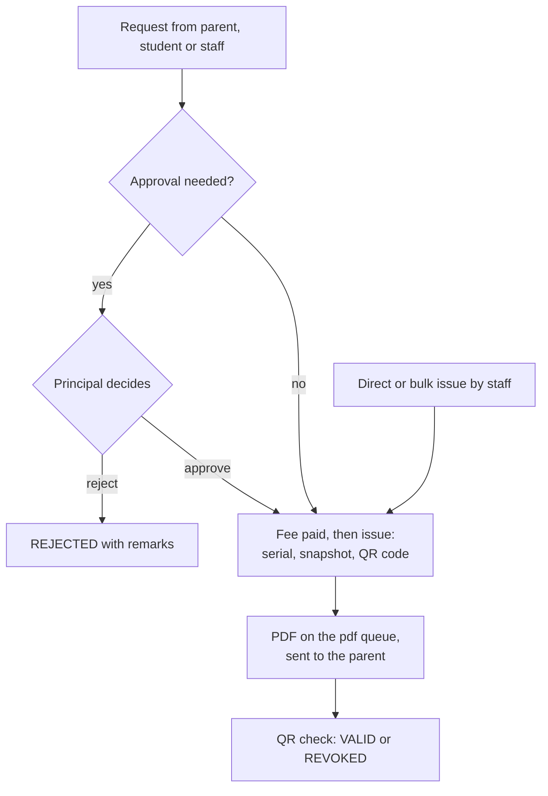
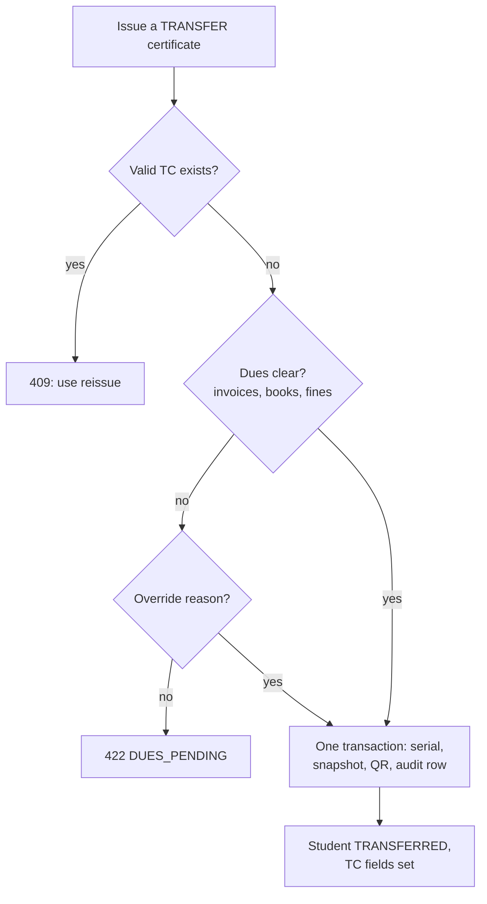
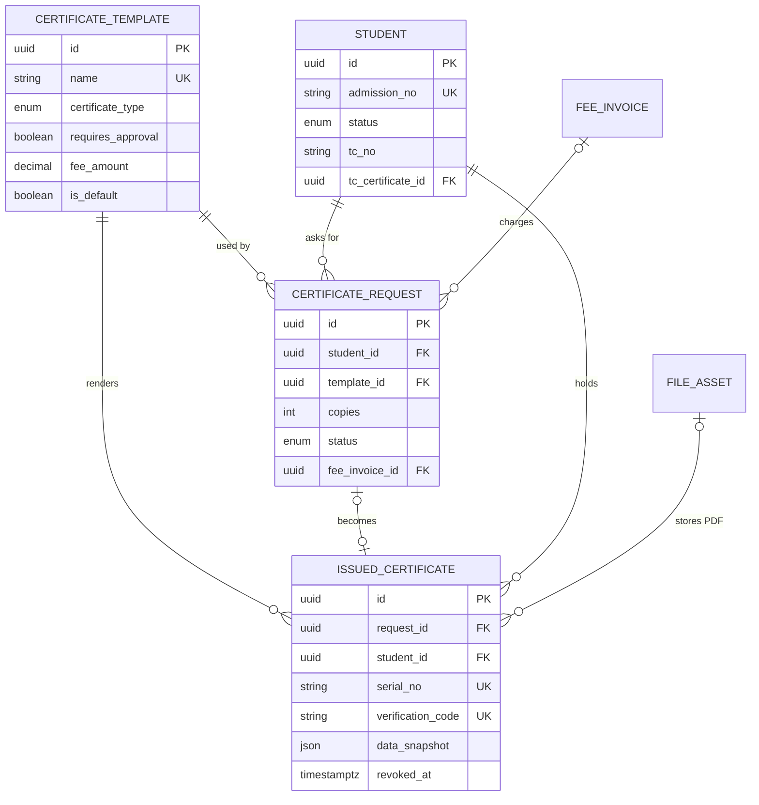

# Certificates Module

**In simple words:** Schools and coaching institutes write the same papers again and again: bonafide, transfer (TC), character, course completion, merit and fee certificates. Today the office types them in Word, signs by hand and writes the number in a paper register, and anyone with a printer can fake one. This module turns each certificate into a template with merge fields, runs a request, approve and issue flow, and gives every paper a gap-free serial number and a QR code that anyone can check online. It also blocks a TC while fees or library books are open.

| Item | Value |
|---|---|
| Module code | CRT |
| Release phase | Phase 2 (V1.0), Day 61 to 120 (4 Dec 2026 to 1 Feb 2027) |
| Plans | Growth, Pro, Enterprise (plan feature `module.CRT`); not on Starter |
| Main users | Principal, Organization Admin, Front Desk, Teacher, Parent, Student, outside verifiers |
| Depends on | Student Profile, Batch, Attendance, Fees, Payments, Library, Settings, Notifications, WhatsApp, Email |
| Used by | Student Profile (TC fields), Parent Portal, Student Portal, Dashboard, Analytics |
| Main tables | `certificate_templates`, `certificate_requests`, `issued_certificates` |
| Endpoints | CRT-API-01 to CRT-API-31; portal side PP-API-29, PP-API-30, SP-API-17, SP-API-18 |
| Build prompt | P-41 |

## Objective

1. A bonafide certificate reaches the parent's phone within 1 working day of the request (target).
2. Every certificate has a gap-free serial and a QR code; a bank or the next school checks it in under 10 seconds, without an account.
3. No TC while fees are due or books are out, unless the Principal overrides with an audited reason.
4. An issued certificate never changes; a mistake is fixed by revoke and reissue.
5. One bulk job prints a whole batch: 200 certificates in under 5 minutes.

## Scope

### In scope

- Templates for the seven `CertificateType` values; requests from both portals and from staff; approval and fee invoice.
- Issue from a request, directly or in bulk, with serial, frozen snapshot, QR code and a queued PDF.
- TC rules, revoke, reissue, send, public verification and the issue register.

| Type | Typical use | Parent asks | Student asks | Staff asks or issues | Seeded template |
|---|---|---|---|---|---|
| `BONAFIDE` | Bus pass, bank account, passport | Yes | Yes | Yes | No approval, free |
| `TRANSFER` | Leaving; the next school needs it | Yes | Partial | Yes | Approval, free |
| `CHARACTER` | Conduct during the stay | Yes | Yes | Yes | Approval, free |
| `COURSE_COMPLETION` | Class or coaching course finished | Yes | Partial | Yes | Approval, free |
| `MERIT` | Rank, prize, competition | No | No | Yes | None |
| `FEE` | Fees paid in a financial year | Yes | Partial | Yes | No approval, free |
| `CUSTOM` | Any other paper | No | No | Yes | None |

`Partial` = students aged 18 or older only (SP-BR-11 in *Student Portal Module*). Seeded templates are English samples; fee and approval are the school's choice.

### Out of scope

- Legal digital signatures (DSC) and DigiLocker push; staff experience letters.
- Government portal filings such as the UDISE+ student exit.
- Collecting the fee (*Fees Module*, *Payments Module*).

### Phase notes

| Phase | What ships |
|---|---|
| Phase 2 (V1.0) | Everything in scope; English and Hindi templates |
| Phase 4 (V2.0) | Arabic templates for UAE, DigiLocker, digital signature (assumption) |

## User Stories

| ID | As a | I want to | So that | Priority |
|---|---|---|---|---|
| CRT-US-01 | Organization Admin | design templates with merge fields, seal, signatories and QR | papers look official and nobody retypes data | Must |
| CRT-US-02 | Parent | ask for a certificate from my phone and track it | I do not visit the office twice | Must |
| CRT-US-03 | Front Desk or Teacher | raise a request for a student | families without the app are served | Must |
| CRT-US-04 | Principal | approve or reject with a remark | only correct papers go out | Must |
| CRT-US-05 | Parent | pay the certificate fee online | I carry no cash | Should |
| CRT-US-06 | Principal | issue with an automatic serial and QR code | the register has no gaps | Must |
| CRT-US-07 | Principal | be stopped from issuing a TC with dues open | the school loses no money by mistake | Must |
| CRT-US-08 | Principal | have the student marked transferred by the TC | records need no second step | Must |
| CRT-US-09 | Principal | issue certificates for a whole batch | prize day needs no late typing | Should |
| CRT-US-10 | Principal | revoke and reissue a wrong certificate | history is never deleted | Must |
| CRT-US-11 | Outside verifier | scan the QR without an account | I can trust the paper | Must |
| CRT-US-12 | Parent or Student | download certificates at any time | a lost paper is no problem | Must |
| CRT-US-13 | Organization Admin | export the issue and TC registers | inspections take minutes | Should |

## Workflow

### From request to verified certificate

**Figure: Certificate flow from request to QR check**



Every path ends in the same issue step (CRT-API-16, CRT-API-19 or CRT-API-25), so serial, snapshot and QR rules apply to all certificates. A fee invoice exists only when the template has a fee.

1. **Template.** Rajesh Sharma sets Bright Future's "Bonafide Certificate (English)" to ₹50 per copy, approval on (CRT-API-04).
2. **Request.** On Monday 12 July 2027 Sunita Devi asks for Aarav Sharma's bonafide, 2 copies, for a passport (PP-API-30).
3. **Approve.** On 13 July Dr. Anita Verma approves (CRT-API-13); invoice `BF/27/000812` for ₹100 is raised. Sunita pays by UPI that evening.
4. **Issue.** On 14 July the Principal issues (CRT-API-16): serial `BF/CRT/2027-28/0042`, code `7KQ2M9XD4TPAR8VC`. The PDF reaches Sunita on WhatsApp seconds later; the office hands over 2 stamped prints.
5. **Verify.** On 2 August the passport officer scans the QR and sees `VALID`.

### Transfer certificate

**Figure: Checks and effects when a TC is issued**




Certificate, status change and TC fields are saved in one transaction, so a TC never exists for a student still on the rolls.

> **Example:** Sunita asks for Aarav's TC on 28 March 2028 (fee ₹200, paid). On 31 March the check shows invoice `BF/27/002291` with ₹10,800 due and one library book out. She pays and returns the book on 1 April. On Monday 3 April the Principal issues the TC with leaving date 31 March 2028: `BF/CRT/2028-29/0001`, the first certificate of session 2028-29.

### Status lifecycle

| Record | Status | Set by | Can move to |
|---|---|---|---|
| Request | `PENDING` | PP-API-30, SP-API-18, CRT-API-11 | `APPROVED`, `REJECTED`, `CANCELLED` |
| Request | `APPROVED` | CRT-API-13, or on submit without approval | `ISSUED`, `CANCELLED` |
| Request | `REJECTED`, `CANCELLED`, `ISSUED` | CRT-API-14; CRT-API-15, -28, -30; CRT-API-16 | None |
| Certificate | Valid (`revokedAt` null) | CRT-API-16, -19, -23, -25 | Revoked |
| Certificate | Revoked | CRT-API-22, CRT-API-23 | None |
| Template | `ACTIVE`, `INACTIVE` | CRT-API-02, CRT-API-04 | Each other; archived by CRT-API-05 |

The PDF state is derived: "Preparing" while `pdfFileId` is null, then "Ready".

## Screens and Wireframes

| ID | Screen | Users | Purpose |
|---|---|---|---|
| CRT-S01 | Requests inbox | Principal, Organization Admin, Front Desk, Teacher | Counters, lists, review panel |
| CRT-S02 | Templates | Organization Admin | List, duplicate, set default, archive |
| CRT-S03 | Template editor | Organization Admin | Body, merge fields, layout, signatories, fee |
| CRT-S04 | Issue certificate | Principal, Organization Admin | Manual values; TC dues check |
| CRT-S05 | Issue register | Principal, Organization Admin, Teacher | Search, filter, export |
| CRT-S06 | Certificate detail | Principal, Organization Admin | PDF, scans; send, revoke, reissue |
| CRT-S07 | Bulk issue (dialog) | Principal, Organization Admin | Batch or list, progress, ZIP |
| CRT-S08 | Certificates (mobile) | Parent | Ask, track, pay, download (in PP-S15) |
| CRT-S09 | Public verification | Anyone | VALID or REVOKED |

Students see CRT-S08 for their own record (SP-S11).

**Screen CRT-S01 — Requests inbox (Principal, web)**

```text
+--------------------------------------------------------------------------+
| EduFlow | Bright Future Public School      [Search students...]  (AV) v  |
+------------+-------------------------------------------------------------+
| Dashboard  | Certificates > Requests                 [Issue certificate] |
| Students   +-------------------------------------------------------------+
| Exams      | Pending 6   Ready to issue 3   Issued in July 9    Scans 88 |
| Fees       | [Pending] [Ready to issue] [All]   Type [All v]  [Export]   |
| Certific. <+-------------------------------------------------------------+
|  Requests  | Date    Student        Class  Type       Copies  Fee        |
|  Issued    | 12 Jul  Aarav Sharma   10-A   Bonafide   2       Rs 100     |
|  Templates | 12 Jul  Kavya Rao      10-B   Character  1       Free       |
|  Bulk      | 11 Jul  Rohan Das      9-C    Transfer   1       Rs 200     |
| Settings   | 10 Jul  Neha Pal       8-A    Fee        1       Free       |
|            | ... 2 more                                    Page 1 of 1   |
|            |-------------------------------------------------------------|
|            | Aarav Sharma, Bonafide, 2 copies, by Sunita Devi (parent)   |
|            | Purpose: Passport application at Passport Seva Kendra       |
|            | Template [Bonafide Certificate (English) v]  Fee Rs 50 x 2  |
|            | Earlier: Character BF/CRT/2027-28/0007 on 02-05-2027        |
|            | Remarks [_________________________]   [Reject]  [Approve]   |
+------------+-------------------------------------------------------------+
```

- Counters from CRT-API-17, rows from CRT-API-10; a row opens the review panel (CRT-API-12).
- "Approve" calls CRT-API-13, "Reject" CRT-API-14. "Earlier" shows the student's certificates of the last 12 months, so duplicates stand out.

**Screen CRT-S03 — Template editor (Organization Admin, web)**

```text
+--------------------------------------------------------------------------+
| EduFlow | Bright Future Public School      [Search students...]  (RS) v  |
+--------------------------------------------------------------------------+
| Certificates > Templates > Bonafide Certificate (English)                |
| Name [Bonafide Certificate (English)]  Type [Bonafide v]  [Active v]     |
| Title on page [BONAFIDE CERTIFICATE___]   Language (o) English ( ) Hindi |
+--------------------------------------------------------------------------+
| Body                                          | Merge fields (Bonafide)  |
| This is to certify that {{studentName}},      | [Search fields...]       |
| {{sonDaughter}} of {{fatherName}}, is a       | [studentName]            |
| bonafide student of Class {{className}} of    | [admissionNo]            |
| {{orgName}} in the session {{academicYear}}   | [className]              |
| (Adm. No. {{admissionNo}}). {{hisHer}} date   | [fatherName]             |
| of birth is {{dateOfBirth}}. Issued for:      | [dateOfBirth]            |
| {{purpose}}.                                  | ... 16 more (click adds) |
+--------------------------------------------------------------------------+
| Page [A4 v] [Portrait v]  Margins [20] mm  Font [Noto Serif v] [12] pt   |
| Logo [Top centre v]   QR [Bottom right v] [24] mm   [ ] Student photo    |
| Background [bf-letterhead.png]  [Change]        Signatories 1 of 3       |
|  1. Dr. Anita Verma, Principal   [signature.png]   [+ Add signatory]     |
| [x] Needs approval   Fee Rs [ 50.00 ] per copy   [x] Default for type    |
+--------------------------------------------------------------------------+
|              [Preview with a student]   [Cancel]   [Save template]       |
+--------------------------------------------------------------------------+
```

- Fields come from CRT-API-06; a click inserts `{{field}}` at the cursor.
- "Preview" calls CRT-API-09; "Save template" calls CRT-API-02 or CRT-API-04, then CRT-API-08 when "Default for type" is ticked.

**Screen CRT-S04 — Issue transfer certificate (Principal, web)**

```text
+--------------------------------------------------------------------------+
| EduFlow | Bright Future Public School      [Search students...]  (AV) v  |
+------------+-------------------------------------------------------------+
| Dashboard  | Certificates > Issue > Transfer certificate                 |
| Students   +-------------------------------------------------------------+
| Certific. <| Student [Aarav Sharma - BF-2027-0142 v]  10-A  ACTIVE       |
|  Requests  | From request of Sunita Devi, 28-03-2028, fee Rs 200 paid    |
|  Issued    | Template [Transfer Certificate (CBSE) v]  Date 31-03-2028   |
|  Templates | Leaving date [31-03-2028]  Reason [Family moving to Pune]   |
|  Bulk      | Serial on issue: BF/CRT/2027-28/0311 (next in series)       |
| Settings   |-------------------------------------------------------------|
|            | DUES CHECK                                      [Recheck]   |
|            | [x] Invoice BF/27/002291 Q4 fees 2027-28    Rs 10,800 due   |
|            | [x] Library: Concepts of Physics Vol 1 not returned         |
|            | [ ] Issue with dues pending   Reason [________________]     |
|            |-------------------------------------------------------------|
|            | Fill in: Conduct [Very good v]  Promotion [Qualified v]     |
|            | Working days 221   Days present 204   (from attendance)     |
|            | On issue: ACTIVE -> TRANSFERRED; enrollment 10-A ends       |
|            |             [Cancel]  [Preview PDF]  [Issue certificate]    |
+------------+-------------------------------------------------------------+
```

- State on 31 March 2028: dues are open, so "Issue certificate" stays disabled unless an allowed user ticks the override with a reason (CRT-BR-16).
- It calls CRT-API-16 or CRT-API-19. The serial shown is a preview; the real one is taken in the transaction.

**Screen CRT-S08 — Certificates (Parent, mobile)**

```text
+------------------------------------+
| < Requests         Certificates    |
| Child [Aarav Sharma - 10-A v]      |
+------------------------------------+
| ASK FOR A CERTIFICATE              |
| Type [Bonafide v]  Copies [2 v]    |
| Purpose [Passport application___]  |
| Fee Rs 50 per copy = Rs 100        |
|                  [Send request]    |
+------------------------------------+
| MY REQUESTS                        |
| Bonafide, 2 copies    12 Jul 2027  |
| [x] Sent              12 Jul       |
| [x] Approved          13 Jul       |
| [x] Fee paid Rs 100   13 Jul       |
| [x] Ready             14 Jul       |
| BF/CRT/2027-28/0042  [Download]    |
+------------------------------------+
| ISSUED CERTIFICATES                |
| Bonafide   0042  14 Jul 2027 [PDF] |
| Character  0007  02 May 2027 [PDF] |
+------------------------------------+
```

- "Send request" posts to PP-API-30; lists come from PP-API-29 and CRT-API-29. An unpaid fee shows [Pay Rs 100], the normal payment flow of *Parent Portal Module*.

**Screen CRT-S09 — Public verification (anyone, mobile web)**

```text
+------------------------------------+
| app.eduflow.app/verify             |
+------------------------------------+
|                                    |
|   +------------------------------+ |
|   |   VALID CERTIFICATE          | |
|   +------------------------------+ |
|                                    |
| Issued by  Bright Future Public    |
|            School, Lucknow         |
| Campus     Main Campus             |
| Type       Bonafide Certificate    |
| Serial no. BF/CRT/2027-28/0042     |
| Issued on  14 July 2027            |
| Student    Aa*** Sh***             |
|                                    |
| Compare these details with the     |
| paper. The school has not          |
| cancelled this certificate.        |
|                                    |
| Code 7KQ2-M9XD-4TPA-R8VC           |
| [Check another code]               |
+------------------------------------+
```

- A Next.js server page calling CRT-API-27; no login, cookies or analytics. A revoked certificate shows a red "REVOKED on {date}" box.

## UI Components

| Component | Type | Behaviour |
|---|---|---|
| `MergeFieldPicker` | Popover with command list | Fields of the type; manual ones marked "typed at issue" |
| `TemplateBodyEditor` | Textarea with token highlight | Unknown fields underlined red |
| `SignatoryListEditor` | Repeating rows | 1 to 3 rows with PNG signature upload |
| `DuesCheckPanel` | Alert with list | Open invoices, books, fines; override box for allowed users |
| `ManualValuesForm` | React Hook Form + Zod | One input per manual or empty field |
| `RequestStatusBadge` | Badge | Grey pending, blue approved, green issued, red rejected |
| `BulkIssueProgress` | Progress bar | Polls CMN-API-19 every 2 seconds |

Lists show skeletons while loading, an empty state ("No certificate requests yet.") and an error toast with the `requestId`.

## Validation Rules

| Field | Rule | Error message shown to user |
|---|---|---|
| Template `name` | 3 to 120 characters; unique | "A template with this name already exists." |
| Template `body` | 20 to 5,000 characters; only known `{{field}}` tokens | "Unknown field {{studentFullName}}. Pick a field from the list." |
| `signatories` | 1 to 3; PNG signature up to 500 KB | "Add at least one signatory." |
| `feeAmount` | Empty, or 1.00 to 10,000.00 | "The fee must be between Rs 1 and Rs 10,000." |
| Request `purpose` | 10 to 500 characters | "Tell us why you need it (at least 10 characters)." |
| Request `copies` | 1 to 5 | "You can ask for 1 to 5 copies." |
| Second request | No `PENDING` request of the same type | "A request for this certificate is already waiting." |
| `reviewRemarks` | Reject and staff cancel; 10 to 500 characters | "Give a reason (at least 10 characters)." |
| Manual `values` | Every manual or empty body field; up to 500 characters | "Fill in: Conduct, Promotion status." |
| TC `leavingDate` | From the admission date to today | "Leaving date must be between 01-04-2019 and today." |
| `overrideDuesReason`, revoke `reason` | 10 to 255 characters | "Give a reason (at least 10 characters)." |
| Bulk students | 1 to 500 | "Pick between 1 and 500 students." |
| Public `code` | 16 characters after removing spaces and "-" | "This code is not valid. Check the code under the QR." |

## Business Rules

### Templates and merge fields

**CRT-BR-01 — Templates.** Templates belong to the whole organization and only `certificates.manage` edits them. CRT-API-08 swaps the default of a type in one transaction. The portals offer a type only when it has an `ACTIVE` default template (else `422` "This certificate is not offered by the school."). Archiving is refused while an `APPROVED` request uses the template.

**CRT-BR-02 — Merge fields.** CRT-API-06 serves this catalogue from code. Study fields read the current enrollment, or the last one for a student who left. Fields marked * are typed by the issuer.

| Group | Fields | Source |
|---|---|---|
| Student (all types) | `studentName`, `admissionNo`, `dateOfBirth`, `dateOfBirthInWords`, `heShe`, `hisHer`, `sonDaughter` | `students`; words from `gender` ("they", "their", "child" for `OTHER` and `UNDISCLOSED`) |
| Family (all) | `fatherName`, `motherName`, `guardianName` | Guardian with relation `FATHER`, `MOTHER`; primary guardian |
| Study (all) | `className`, `batchName`, `academicYear` | `courses`, `batches`, `academic_years` |
| Institute (all) | `orgName`, `orgAddress`, `registrationNo`, `campusName` | `organizations`, `campuses` |
| Issue (all) | `serialNo`, `issueDate`, `purpose` | The issue step |
| `TRANSFER` | `admissionDate`, `admittedClass`, `lastClass`, `leavingDate`, `leavingReason`, `workingDays`, `daysPresent`, `duesCleared`, `penNumber`, `apaarId`, `nationality`, `category`, `conduct`*, `promotionStatus`* | Student, enrollments, attendance, dues check |
| `CHARACTER` | `periodFrom`, `periodTo`, `conduct`* | Admission date; leaving date or issue date |
| `COURSE_COMPLETION` | `courseName`, `completionDate`*, `result`* | Course of the enrollment |
| `MERIT` | `achievement`*, `eventName`*, `eventDate`* | Typed at issue |
| `FEE` | `financialYear`, `tuitionFeePaid`, `totalFeePaid`, `tuitionFeePaidInWords`, `totalFeePaidInWords` | Payments (CRT-BR-19) |
| `CUSTOM` | All common fields plus `custom.<key>`* | Typed at issue; key 2 to 40 letters or digits |

**CRT-BR-03 — Body text.** Plain text; a blank line starts a paragraph and `**bold**` is the only formatting. `{{{`, `{{#` and `{{/` are refused. The server stores the tokens it finds in `variables`. Handlebars renders in strict mode with HTML escaping, so a value like `<b>` prints as text.

**CRT-BR-04 — Layout and signatories.** The QR code is always printed; the layout only picks its corner and size.

```typescript
import { z } from 'zod';

export const layoutSchema = z.object({
  title: z.string().min(3).max(80), // "TRANSFER CERTIFICATE"
  language: z.enum(['en', 'hi']), // words for dates and amounts
  pageSize: z.enum(['A4', 'A5', 'LETTER']),
  orientation: z.enum(['PORTRAIT', 'LANDSCAPE']),
  marginsMm: z.object({
    top: z.number().min(5).max(40), right: z.number().min(5).max(40),
    bottom: z.number().min(5).max(40), left: z.number().min(5).max(40),
  }),
  font: z.enum(['NOTO_SANS', 'NOTO_SERIF', 'NOTO_SANS_DEVANAGARI']),
  fontSizePt: z.number().int().min(10).max(16),
  logoPosition: z.enum(['NONE', 'TOP_LEFT', 'TOP_CENTER', 'TOP_RIGHT']),
  qrPosition: z.enum(['BOTTOM_LEFT', 'BOTTOM_RIGHT']),
  qrSizeMm: z.number().int().min(18).max(40),
  showPhoto: z.boolean(),
}).strict();

export const signatoriesSchema = z.array(z.object({
  name: z.string().min(2).max(80),
  designation: z.string().min(2).max(60),
  signatureFileId: z.string().uuid().nullable(),
}).strict()).min(1).max(3);
```

**CRT-BR-05 — Record and manual values.** A record field with a value cannot be typed over; fix the source record instead. Manual fields and empty record fields (a missing `penNumber`) must come in `values`, else `422` lists them. "NA" is accepted.

### Requests and approval

**CRT-BR-06 — Who may ask.** Parents and students follow the type table in Scope. Staff may ask for any type, for example a teacher asking for a `MERIT` certificate. One `PENDING` request per student and type (`409`). A `TRANSFER` request needs a student on the rolls, or one who left without a valid TC.

**CRT-BR-07 — Approval.** With `requiresApproval = false` the request is saved as `APPROVED` ("Approved automatically") and CRT-BR-08 runs at once. Otherwise a user with `certificates.approve` for the campus decides. The template is the request's `templateId`, else the type's default; it must be `ACTIVE` and of the same type. Rejection remarks are shown to the parent.

**CRT-BR-08 — Certificate fee.** Fee = `feeAmount` × `copies`. On approval the Fees service raises an ad-hoc invoice (FEE-API-25 logic) on the active fee head of type `CERTIFICATE`, due in 7 days, for the fee-payer guardian; tax follows that head. No such head: `422` "Add a fee head of type Certificate in Fees first." "Waive fee" with a remark raises no invoice.

> **Example:** Bonafide at ₹50 per copy, 2 copies: ₹50 × 2 = ₹100. TC at ₹200, 1 copy: ₹200.

**CRT-BR-09 — Ready to issue and cancel.** Ready = `APPROVED` with no invoice, or an invoice `PAID` or `WRITTEN_OFF`; else `422` "The fee of Rs 100 is not paid yet." Staff cancel `PENDING` or `APPROVED` requests with a reason; an unpaid invoice is cancelled in the same transaction, a paid one blocks the cancel. Parents and students cancel only `PENDING` requests.

### Issue

**CRT-BR-10 — Date and campus.** `issueDate` is today in the organization's timezone; no back-dating, so serial order and dates agree. `campusId` is the student's campus. A `BONAFIDE` says the child "is a student", so it needs status `ACTIVE`, `INACTIVE` or `SUSPENDED`.

**CRT-BR-11 — Serial number.** The next `CERTIFICATE_NO` number is taken inside the issue transaction with `SELECT ... FOR UPDATE` on the series row (CAMP-BR-10 in *Multi Campus Module*); a failed issue rolls back, so no number is lost. All types share one series (campus rows optional, *Settings Module*). Default: prefix `CRT`, format `{PREFIX}/{AY}/{SEQ}`, pad 4, reset `ACADEMIC_YEAR`. Revoked serials are never reused.

> **Example:** Bright Future uses prefix `BF`, format `{PREFIX}/CRT/{AY}/{SEQ}`. On 14 July 2027 `nextValue` is 42: `BF/CRT/2027-28/0042`, then 43. On 3 April 2028 the 2028-29 row does not exist yet; it is created with `nextValue` 1: `BF/CRT/2028-29/0001`.

**CRT-BR-12 — Data snapshot.** `dataSnapshot` freezes everything the PDF needs. The worker renders only from it, so later edits to student, template or organization never change an issued certificate.

```json
{
  "v": 1,
  "values": { "studentName": "Aarav Sharma", "admissionNo": "BF-2027-0142",
              "className": "10", "purpose": "Passport application at Passport Seva Kendra" },
  "manualKeys": [],
  "text": "This is to certify that Aarav Sharma (Adm. No. BF-2027-0142) is a bonafide ...",
  "template": { "id": "8d2f4a6c-1b3e-4c5d-9e7f-2a4b6c8d0e13", "name": "Bonafide Certificate (English)",
                "layout": { "title": "BONAFIDE CERTIFICATE", "pageSize": "A4" },
                "signatories": [{ "name": "Dr. Anita Verma", "designation": "Principal",
                                  "signatureFileId": "6a8c0e2f-3b5d-4f7a-9c1e-4d6f8a0c2e14" }] },
  "maskedName": "Aa*** Sh***",
  "org": { "name": "Bright Future Public School", "city": "Lucknow", "registrationNo": "2130456" },
  "transfer": null,
  "reissueOf": null
}
```

**CRT-BR-13 — Verification code and QR.** 16 characters of Crockford Base32 (no I, L, O or U) from 80 random bits, never derived from the serial, so nobody can guess one. A rare clash on the unique index retries once. The QR holds `https://app.eduflow.app/verify/{code}` (Enterprise: its custom domain); the code is also printed as `7KQ2-M9XD-4TPA-R8VC`.

**CRT-BR-14 — PDF on the queue.** After commit, job `certificate-pdf-{certificateId}` goes to the `pdf` queue (priority 1, bulk 5). The worker renders with puppeteer-core (*System Architecture*) and sets `pdfFileId` only while it is null, so retries are safe. A 10-minute sweep re-queues certificates without a PDF after 2 minutes. Until then CRT-API-21 answers `422` "The PDF is being prepared."

```typescript
// server/src/modules/certificates/issue.service.ts (shortened)
export async function issueCertificate(ctx: Ctx, input: IssueInput): Promise<IssuedCertificate> {
  const cert = await ctx.db.$transaction(async (tx) => {
    const student = await lockStudent(tx, input.studentId); // SELECT ... FOR UPDATE
    const template = await tx.certificateTemplate.findFirstOrThrow({
      where: { id: input.templateId, status: 'ACTIVE', deletedAt: null },
    });
    const issueDate = ctx.todayInOrgTimezone();
    const isTc = template.certificateType === 'TRANSFER';
    const dues = isTc ? await assertTcAllowed(tx, ctx, student, input.transfer) : null;
    const snapshot = await buildSnapshot(tx, ctx, { student, template, issueDate, input, dues });
    const serialNo = await nextNumber(tx, 'CERTIFICATE_NO', { campusId: student.campusId, date: issueDate });
    const created = await tx.issuedCertificate.create({
      data: {
        organizationId: ctx.orgId, campusId: student.campusId, templateId: template.id,
        requestId: input.requestId ?? null, studentId: student.id,
        certificateType: template.certificateType, serialNo, issueDate,
        purpose: input.purpose ?? null, dataSnapshot: snapshot,
        verificationCode: newVerificationCode(), issuedById: ctx.userId,
      },
    });
    if (isTc) await closeStudentRecord(tx, ctx, student, created, input.transfer); // CRT-BR-17
    if (input.requestId) {
      await tx.certificateRequest.update({ where: { id: input.requestId }, data: { status: 'ISSUED' } });
    }
    return created;
  }, { timeout: 10_000 });

  await queues.pdf.add('certificate-pdf', { organizationId: ctx.orgId, recordId: cert.id },
    { jobId: `certificate-pdf-${cert.id}`, priority: input.bulk ? 5 : 1 });
  await ctx.events.publish('certificate.issued', { certificateId: cert.id, requestId: input.requestId });
  return cert;
}
```

### Transfer certificate rules

**CRT-BR-15 — Who can get a TC.** A student on the rolls or with a leaving status. One valid TC per student: when `tc_certificate_id` points to a valid certificate, a new TC answers `409` (use reissue). Refused while a `PENDING` batch or campus transfer exists (STU-BR-08).

**CRT-BR-16 — Dues check.** Runs inside the issue transaction. Library rows count only with `module.LIB` on the plan; `DRAFT` invoices only raise a warning.

```sql
-- Open dues of one student for the TC check ($1 = organization id, $2 = student id)
SELECT
  (SELECT COALESCE(SUM(balance), 0) FROM fee_invoices
    WHERE organization_id = $1 AND student_id = $2 AND deleted_at IS NULL
      AND status IN ('ISSUED', 'PARTIALLY_PAID', 'OVERDUE') AND balance > 0) AS fee_balance,
  (SELECT COUNT(*) FROM book_issues
    WHERE organization_id = $1 AND student_id = $2
      AND status IN ('ISSUED', 'OVERDUE')) AS books_out,
  (SELECT COALESCE(SUM(fine_amount - fine_paid), 0) FROM book_issues
    WHERE organization_id = $1 AND student_id = $2 AND fine_invoice_id IS NULL
      AND fine_waived = false AND fine_amount > fine_paid) AS unpaid_fines;
```

All three values 0 = clear, and `duesCleared` prints "Yes" (Aarav on 3 April 2028). Otherwise `422` with detail `DUES_PENDING`. An override needs `transfer.overrideDuesReason` and a caller holding `certificates.approve` besides `certificates.issue`; it writes audit row `certificates.tc.dues_override` with the amounts, the dues stay open, and `duesCleared` prints "No".

> **Note:** Assumption: some state rules may not let a school hold back a TC for unpaid fees. The override covers that case; each school confirms its local rule.

**CRT-BR-17 — Effects on the student.** In the same transaction:

1. A student on the rolls goes through the status service of *Student Profile Module*: `TRANSFERRED` from `leavingDate` with `leavingReason`. STU-BR-08 applies (enrollments `WITHDRAWN`, student login off) and that service publishes `student.status_changed` and `student.withdrawn`.
2. A student who already left keeps the status; leaving date and reason come from the record.
3. Always: `tcNo` = serial, `tcIssuedOn` = issue date, `tcCertificateId` = the new certificate.

**CRT-BR-18 — TC attendance.** `workingDays` = days with attendance taken for the student's batches in the leaving year, up to the leaving date; `daysPresent` uses the formula of *Attendance Module* (Aarav: 221 and 204).

### Calculations

**CRT-BR-19 — Fee certificate amounts.** The year starts in `financialYearStartMonth` (April in India). `totalFeePaid` = sum of the student's active payment allocation items with `allocatedAt` in the year (organization timezone); `tuitionFeePaid` = the same for `TUITION` heads. A refunded allocation counts item × (1 − `amountRefunded` ÷ allocation amount). Amounts include tax.

> **Example:** Aarav, 2027-28. Q1 (10 April), Q2 (8 July) and Q3 (12 October 2027) were each ₹12,000 tuition + ₹3,000 transport. Q4 was paid on 1 April 2028, so it falls in 2028-29. `tuitionFeePaid` = 3 × 12,000 = ₹36,000; `totalFeePaid` = 3 × 15,000 = ₹45,000.

**CRT-BR-20 — Words.** 14-08-2012 prints "Fourteenth August Two Thousand Twelve". ₹45,000 prints "Rupees Forty-Five Thousand Only"; ₹1,23,500 prints "Rupees One Lakh Twenty-Three Thousand Five Hundred Only". With `layout.language = "hi"` the words are Hindi.

### After issue

**CRT-BR-21 — Revoke.** Needs a reason. Sets `revokedAt`, `revokedById`, `revokeReason`, writes audit row `certificates.revoke` and clears the verification cache. The public page shows `REVOKED` with the date, never the reason. The PDF stays for the register; portals hide the download. For a TC the three TC fields are cleared but the status stays (readmission belongs to *Student Profile Module*). A revoke cannot be undone.

**CRT-BR-22 — Reissue.** Only for a valid certificate, with a reason. One transaction revokes it and issues a new one from the same template: new serial, new code, fresh snapshot, `reissueOf` recorded. Manual values default to the old ones. The request link and, for a TC, the TC fields move to the new certificate; dues are not checked again.

**CRT-BR-23 — Send.** To the primary guardian (default) or a student aged 18 or older. WhatsApp sends a utility template with the PDF as document header and uses credits (*WhatsApp Module*); email attaches the PDF. Revoked or PDF missing: `422`. At most 3 sends per certificate per day (`429`).

**CRT-BR-24 — Bulk issue.** CRT-API-25 creates an `ExportJob` (`certificates.bulk_issue`, `ZIP`) and answers `202`. The `exports` worker issues chunks of 25 students per transaction in roll-number order. It skips students who fail a rule (dues are never overridden in bulk) or already hold a valid certificate of the template this academic year. The ZIP holds the PDFs and `register.csv`. One bulk job per campus at a time (`409`).

> **Example:** Sharma Classes (series `{PREFIX}/{YYYY}/{SEQ}`, prefix `SC`) issues course completion certificates to "JEE Main 2028, Morning Batch M1" on 5 April 2028. Of 58 students one is `DROPPED_OUT` and one already holds it: 56 issued, `SC/2028/0117` to `SC/2028/0172`.

**CRT-BR-25 — Public verification.** No login. The code is cleaned (spaces and "-" removed, upper case, O read as 0, I and L as 1). It is unique across tenants, so one narrow lookup finds the organization and the rest runs in that tenant's context. The answer holds status, institute, city, campus, type, serial, dates and the masked name only. Limits: 30 checks a minute per IP; 20 unknown codes in an hour block the IP for an hour (`429`). Answers are cached 5 minutes; revoke and reissue clear the cache.

```typescript
// Masked name: first two letters of each word (one for short words), then ***
export function maskName(fullName: string): string {
  const seg = new Intl.Segmenter('en', { granularity: 'grapheme' });
  return fullName.trim().split(/\s+/).map((word) => {
    const chars = [...seg.segment(word)].map((s) => s.segment);
    return chars.slice(0, chars.length > 2 ? 2 : 1).join('') + '***';
  }).join(' ');
}

// A check counts once per IP per 10 minutes; the IP is stored only as a salted hash
export async function isNewCheck(code: string, ip: string): Promise<boolean> {
  const ipHash = createHash('sha256').update(`${env.VERIFY_SALT}:${ip}`).digest('hex').slice(0, 16);
  return (await redis.set(`crt:vseen:${code}:${ipHash}`, '1', 'EX', 600, 'NX')) === 'OK';
}
```

> **Example:** "Aarav Sharma" prints as "Aa*** Sh***". The passport office scans at 11:02 and again at 11:05 from the same IP: `verificationCount` goes from 0 to 1. A bank scans the next day: 2.

## Acceptance Criteria

| ID | Given | When | Then |
|---|---|---|---|
| CRT-AC-01 | A body contains `{{studentFullName}}` | the admin saves it | `400` names the unknown field |
| CRT-AC-02 | Bonafide needs no approval and is free | Sunita submits | request `APPROVED` at once; no invoice |
| CRT-AC-03 | Fee ₹50 per copy, approval on | the Principal approves 2 copies | invoice of ₹100, due in 7 days, linked |
| CRT-AC-04 | That invoice is unpaid | the Principal issues | `422` "The fee of Rs 100 is not paid yet." |
| CRT-AC-05 | The invoice is paid | the Principal issues on 14 July 2027 | `BF/CRT/2027-28/0042`, 16-character code, request `ISSUED`, one PDF job |
| CRT-AC-06 | Two users issue at the same second | both commit | serials 0042 and 0043; no gap |
| CRT-AC-07 | Aarav has ₹10,800 due and a book out | a TC is issued without override | `422 DUES_PENDING`; nothing saved; no serial used |
| CRT-AC-08 | Same dues; caller holds `certificates.approve` | a TC is issued with an override reason | TC issued, `duesCleared` "No", audit row |
| CRT-AC-09 | Aarav is `ACTIVE` | a TC is issued, leaving date 31 March 2028 | `TRANSFERRED`, enrollment `WITHDRAWN`, TC fields set |
| CRT-AC-10 | Aarav holds a valid TC | another TC is issued | `409 CONFLICT` |
| CRT-AC-11 | A valid certificate | it is revoked | public page `REVOKED` on the next check; portals hide the download |
| CRT-AC-12 | A TC with a date of birth now fixed | it is reissued | old revoked; new serial and code; TC fields point to the new one |
| CRT-AC-13 | Batch M1: 58 students, 2 not eligible | bulk issue runs | `202`; 56 issued in roll order; 2 skipped; ZIP ready |
| CRT-AC-14 | Anyone, not logged in | opens `/verify/7kq2-m9xd-4tpa-r8vc` twice in 10 minutes | `VALID` with masked name; count grows once |
| CRT-AC-15 | Teacher Priya Nair | lists requests | only students of her batches |
| CRT-AC-16 | A Sharma Classes login | reads a Bright Future certificate | `404 NOT_FOUND` |

## Edge Cases

| Case | What happens | How the system handles it |
|---|---|---|
| No active default template for a type | Parent cannot ask | Type hidden; PP-API-30 answers `422` |
| Session 2028-29 not created on 3 April | `{AY}` has no label | `422` "Create academic year 2028-29 first."; nothing saved |
| PDF worker down | PDF missing | Retries and the sweep; downloads say "being prepared" |
| Student readmitted after a TC | TC still shows `VALID` | On `student.status_changed` to `ACTIVE`, the TC is revoked ("Student readmitted") and TC fields cleared |
| Date of birth corrected after issue | Paper shows the old date | Reissue; the old serial stays as revoked |
| Principal leaves | Old papers show the old signatory | Correct: snapshot; new papers use the new template |
| Fee paid, then the family cancels | Money is held | Cancel blocked; issue, or refund in *Payments Module* |
| Parent loses the paper | Needs a copy | Download again; same serial, no new number |
| Organization suspended | Verifiers still scan | The public page keeps answering |
| Student anonymised after retention | Personal data must go | Personal values in `dataSnapshot` blanked, PDF deleted; page shows serial and `maskedName` |
| Two bulk jobs on one campus | Serials would interleave | The second answers `409` |

## Database Schema

| Table | Purpose |
|---|---|
| `certificate_templates` | Body, merge fields, layout, signatories, fee, approval switch |
| `certificate_requests` | Request with decision and fee invoice |
| `issued_certificates` | Serial, snapshot, PDF, verification code, revocation |

Every table has `id` (uuid, PK), `organization_id` (uuid, FK `organizations`), `created_at` and `updated_at`; templates and requests also have `deleted_at`. In key lists, org = `organization_id`. The module also writes `students.tc_no`, `tc_issued_on` and `tc_certificate_id` and uses the `CERTIFICATE_NO` row of `number_sequences`.

### certificate_templates

| Column | Type | Null | Default | Notes |
|---|---|---|---|---|
| `name` | varchar(120) | No | | Unique per organization |
| `certificate_type` | CertificateType | No | | Seven types |
| `body` | text | No | | Text with `{{fields}}` (CRT-BR-03) |
| `variables` | text[] | No | | Fields used in the body; set by the server |
| `layout` | jsonb | No | | CRT-BR-04 |
| `signatories` | jsonb | Yes | | `[{ name, designation, signatureFileId }]` |
| `background_file_id` | uuid | Yes | | FK `file_assets`, set null |
| `requires_approval` | boolean | No | true | CRT-BR-07 |
| `fee_amount`, `currency` | decimal(12,2), char(3) | Yes | | Fee per copy; null = free |
| `is_default` | boolean | No | false | One per type (CRT-BR-01) |
| `status` | RecordStatus | No | ACTIVE | |

Keys: unique (org, `name`); index (org, `certificate_type`, `status`).

### certificate_requests

| Column | Type | Null | Default | Notes |
|---|---|---|---|---|
| `campus_id`, `student_id` | uuid | No | | FKs, restrict on delete |
| `certificate_type` | CertificateType | No | | |
| `template_id` | uuid | Yes | | FK, set null; fixed at approval |
| `purpose` | varchar(500) | No | | |
| `copies` | smallint | No | 1 | 1 to 5 |
| `status` | CertificateRequestStatus | No | PENDING | Lifecycle table |
| `requested_by_user_id` | uuid | Yes | | FK `users`, set null |
| `reviewed_by_id`, `reviewed_at`, `review_remarks` | uuid, timestamptz, varchar(500) | Yes | | Decision; also the cancel reason |
| `fee_invoice_id` | uuid | Yes | | FK `fee_invoices`, set null |

Keys: indexes (org, `campus_id`, `status`, `created_at`) and (org, `student_id`, `created_at`).

### issued_certificates

| Column | Type | Null | Default | Notes |
|---|---|---|---|---|
| `campus_id`, `template_id`, `student_id` | uuid | No | | FKs, restrict on delete |
| `request_id` | uuid | Yes | | Unique; FK, set null |
| `certificate_type` | CertificateType | No | | Copied from the template |
| `serial_no` | varchar(40) | No | | CRT-BR-11 |
| `issue_date` | date | No | | CRT-BR-10 |
| `purpose` | varchar(255) | Yes | | |
| `data_snapshot` | jsonb | No | | CRT-BR-12 |
| `pdf_file_id` | uuid | Yes | | FK `file_assets`; null while queued |
| `verification_code` | varchar(32) | No | | Unique across all tenants |
| `verification_count`, `last_verified_at` | integer, timestamptz | No, Yes | 0 | CRT-BR-25 |
| `issued_by_id` | uuid | Yes | | FK `users`, set null |
| `revoked_at`, `revoked_by_id`, `revoke_reason` | timestamptz, uuid, varchar(255) | Yes | | `revoked_by_id` audit only, no FK |

Keys: unique (org, `serial_no`), unique `verification_code`, unique `request_id`; indexes (org, `student_id`, `certificate_type`) and (org, `campus_id`, `issue_date`).

**Figure: Certificate tables and their neighbours**



A template is used by requests and renders certificates. A request becomes at most one certificate and may carry one fee invoice. The student row points back to the TC that closed it through `tc_certificate_id`.

## Prisma Schema

Copied from `13-certificates-analytics-ai.prisma`. Long end-of-line comments sit on the line above the field; nothing is renamed or left out. `RecordStatus` is in `00-base.prisma`.

```prisma
enum CertificateType {
  BONAFIDE
  TRANSFER
  CHARACTER
  COURSE_COMPLETION
  MERIT
  FEE // fee-paid certificate for income-tax or bank purposes
  CUSTOM
}

enum CertificateRequestStatus {
  PENDING
  APPROVED
  REJECTED
  ISSUED
  CANCELLED
}

// Certificate design: body text with merge variables, layout and signatories.
model CertificateTemplate {
  id               String          @id @default(uuid()) @db.Uuid
  organizationId   String          @map("organization_id") @db.Uuid
  name             String          @db.VarChar(120)
  certificateType  CertificateType @map("certificate_type")
  // text with {{variables}}, e.g. "This is to certify that {{studentName}} ..."
  body             String          @db.Text
  variables        String[] // merge variables used in the body
  layout           Json // page size, orientation, margins, fonts, logo / seal / QR positions
  signatories      Json? // [{ name, designation, signatureFileId }]
  backgroundFileId String?         @map("background_file_id") @db.Uuid // letterhead / border image
  // requests need approval before issue
  requiresApproval Boolean         @default(true) @map("requires_approval")
  // charge for issuing; null = free
  feeAmount        Decimal?        @map("fee_amount") @db.Decimal(12, 2)
  currency         String?         @db.Char(3)
  // default template of its certificateType
  isDefault        Boolean         @default(false) @map("is_default")
  status           RecordStatus    @default(ACTIVE)
  createdAt        DateTime        @default(now()) @map("created_at") @db.Timestamptz(6)
  updatedAt        DateTime        @updatedAt @map("updated_at") @db.Timestamptz(6)
  deletedAt        DateTime?       @map("deleted_at") @db.Timestamptz(6)

  organization       Organization @relation(fields: [organizationId], references: [id], onDelete: Restrict)
  backgroundFile     FileAsset?   @relation(fields: [backgroundFileId], references: [id], onDelete: SetNull)
  issuedCertificates IssuedCertificate[]
  requests           CertificateRequest[]

  @@unique([organizationId, name])
  @@index([organizationId, certificateType, status])
  @@map("certificate_templates")
}

// Certificate issued to a student. The data snapshot and PDF never change;
// a wrong certificate is revoked and re-issued.
model IssuedCertificate {
  id                String          @id @default(uuid()) @db.Uuid
  organizationId    String          @map("organization_id") @db.Uuid
  campusId          String          @map("campus_id") @db.Uuid
  templateId        String          @map("template_id") @db.Uuid
  // request that led to this certificate
  requestId         String?         @unique @map("request_id") @db.Uuid
  studentId         String          @map("student_id") @db.Uuid
  certificateType   CertificateType @map("certificate_type") // denormalised from the template
  serialNo          String          @map("serial_no") @db.VarChar(40) // from NumberSequence CERTIFICATE_NO
  issueDate         DateTime        @map("issue_date") @db.Date
  purpose           String?         @db.VarChar(255)
  dataSnapshot      Json            @map("data_snapshot") // merge values frozen at issue time
  pdfFileId         String?         @map("pdf_file_id") @db.Uuid
  // random code in the QR; public page /verify/{code} works without login
  verificationCode  String          @unique @map("verification_code") @db.VarChar(32)
  verificationCount Int             @default(0) @map("verification_count")
  lastVerifiedAt    DateTime?       @map("last_verified_at") @db.Timestamptz(6)
  issuedById        String?         @map("issued_by_id") @db.Uuid
  revokedAt         DateTime?       @map("revoked_at") @db.Timestamptz(6)
  revokedById       String?         @map("revoked_by_id") @db.Uuid // User id (audit only, no FK)
  revokeReason      String?         @map("revoke_reason") @db.VarChar(255)
  createdAt         DateTime        @default(now()) @map("created_at") @db.Timestamptz(6)
  updatedAt         DateTime        @updatedAt @map("updated_at") @db.Timestamptz(6)

  organization Organization        @relation(fields: [organizationId], references: [id], onDelete: Restrict)
  campus       Campus              @relation(fields: [campusId], references: [id], onDelete: Restrict)
  template     CertificateTemplate @relation(fields: [templateId], references: [id], onDelete: Restrict)
  request      CertificateRequest? @relation(fields: [requestId], references: [id], onDelete: SetNull)
  student      Student             @relation(fields: [studentId], references: [id], onDelete: Restrict)
  pdfFile      FileAsset?          @relation(fields: [pdfFileId], references: [id], onDelete: SetNull)
  issuedBy     User?               @relation(fields: [issuedById], references: [id], onDelete: SetNull)
  // student whose record this transfer certificate closed
  tcForStudent Student?            @relation("StudentTransferCertificate")

  @@unique([organizationId, serialNo])
  @@index([organizationId, studentId, certificateType])
  @@index([organizationId, campusId, issueDate])
  @@map("issued_certificates")
}

// Request for a certificate raised by a parent or student in the portal (or by staff), with approval.
model CertificateRequest {
  id                String                   @id @default(uuid()) @db.Uuid
  organizationId    String                   @map("organization_id") @db.Uuid
  campusId          String                   @map("campus_id") @db.Uuid
  studentId         String                   @map("student_id") @db.Uuid
  certificateType   CertificateType          @map("certificate_type")
  templateId        String?                  @map("template_id") @db.Uuid
  purpose           String                   @db.VarChar(500)
  copies            Int                      @default(1) @db.SmallInt
  status            CertificateRequestStatus @default(PENDING)
  // parent, student or staff login
  requestedByUserId String?                  @map("requested_by_user_id") @db.Uuid
  reviewedById      String?                  @map("reviewed_by_id") @db.Uuid
  reviewedAt        DateTime?                @map("reviewed_at") @db.Timestamptz(6)
  reviewRemarks     String?                  @map("review_remarks") @db.VarChar(500)
  // invoice for the certificate fee, when charged
  feeInvoiceId      String?                  @map("fee_invoice_id") @db.Uuid
  createdAt         DateTime                 @default(now()) @map("created_at") @db.Timestamptz(6)
  updatedAt         DateTime                 @updatedAt @map("updated_at") @db.Timestamptz(6)
  deletedAt         DateTime?                @map("deleted_at") @db.Timestamptz(6)

  organization Organization @relation(fields: [organizationId], references: [id], onDelete: Restrict)
  campus       Campus       @relation(fields: [campusId], references: [id], onDelete: Restrict)
  student      Student      @relation(fields: [studentId], references: [id], onDelete: Restrict)
  template     CertificateTemplate? @relation(fields: [templateId], references: [id], onDelete: SetNull)
  requestedByUser User? @relation("CertificateRequestRequestedBy", fields: [requestedByUserId], references: [id], onDelete: SetNull)
  reviewedBy User? @relation("CertificateRequestReviewedBy", fields: [reviewedById], references: [id], onDelete: SetNull)
  feeInvoice   FeeInvoice?  @relation(fields: [feeInvoiceId], references: [id], onDelete: SetNull)
  issuedCertificate IssuedCertificate?

  @@index([organizationId, campusId, status, createdAt])
  @@index([organizationId, studentId, createdAt])
  @@map("certificate_requests")
}
```

## API Endpoints

Paths are relative to `/api/v1`. Parents and students raise requests with PP-API-30 and SP-API-18 and list them with PP-API-29 and SP-API-17 (see their portal chapters). The static paths `/certificate-templates/variables` and `/certificate-requests/summary` are registered before the `/:id` routes.

| ID | Method | Path | Permission | Purpose |
|---|---|---|---|---|
| CRT-API-01 | GET | `/certificate-templates` | certificates.view | List templates; also dropdown |
| CRT-API-02 | POST | `/certificate-templates` | certificates.manage | Create a template |
| CRT-API-03 | GET | `/certificate-templates/:id` | certificates.view | Template detail |
| CRT-API-04 | PATCH | `/certificate-templates/:id` | certificates.manage | Update template or status |
| CRT-API-05 | DELETE | `/certificate-templates/:id` | certificates.manage | Archive (soft delete) |
| CRT-API-06 | GET | `/certificate-templates/variables` | certificates.view | Merge fields per type |
| CRT-API-07 | POST | `/certificate-templates/:id/duplicate` | certificates.manage | Copy a template |
| CRT-API-08 | POST | `/certificate-templates/:id/set-default` | certificates.manage | Make it the default of its type |
| CRT-API-09 | POST | `/certificate-templates/:id/preview` | certificates.view | Sample PDF with a student or dummy data |
| CRT-API-10 | GET | `/certificate-requests` | certificates.view | List requests |
| CRT-API-11 | POST | `/certificate-requests` | certificates.create | Staff raises a request |
| CRT-API-12 | GET | `/certificate-requests/:id` | certificates.view | Request with invoice and certificate |
| CRT-API-13 | POST | `/certificate-requests/:id/approve` | certificates.approve | Approve; raise the fee invoice |
| CRT-API-14 | POST | `/certificate-requests/:id/reject` | certificates.approve | Reject with remarks |
| CRT-API-15 | POST | `/certificate-requests/:id/cancel` | certificates.create | Cancel a pending or approved request |
| CRT-API-16 | POST | `/certificate-requests/:id/issue` | certificates.issue | Issue from an approved request |
| CRT-API-17 | GET | `/certificate-requests/summary` | certificates.view | Dashboard counters |
| CRT-API-18 | GET | `/issued-certificates` | certificates.view | List issued certificates |
| CRT-API-19 | POST | `/issued-certificates` | certificates.issue | Direct issue |
| CRT-API-20 | GET | `/issued-certificates/:id` | certificates.view | Certificate with snapshot and scan count |
| CRT-API-21 | GET | `/issued-certificates/:id/pdf` | certificates.view | 5-minute PDF link |
| CRT-API-22 | POST | `/issued-certificates/:id/revoke` | certificates.revoke | Revoke with a reason |
| CRT-API-23 | POST | `/issued-certificates/:id/reissue` | certificates.issue | Revoke and issue a corrected one |
| CRT-API-24 | POST | `/issued-certificates/:id/send` | certificates.issue | Send the PDF by WhatsApp or email |
| CRT-API-25 | POST | `/issued-certificates/bulk` | certificates.issue | Bulk issue (job, ZIP) |
| CRT-API-26 | POST | `/issued-certificates/export` | certificates.export | Export the issue register |
| CRT-API-27 | GET | `/public/certificates/:verificationCode` | public | Verify a certificate |
| CRT-API-28 | POST | `/portal/parent/certificate-requests/:id/cancel` | parentportal.access | Parent cancels a pending request |
| CRT-API-29 | GET | `/portal/parent/certificates` | parentportal.access | Child's certificates with PDF links |
| CRT-API-30 | POST | `/portal/student/certificate-requests/:id/cancel` | studentportal.access | Student cancels a pending request |
| CRT-API-31 | GET | `/portal/student/certificates` | studentportal.access | Own certificates with PDF links |

Every endpoint except CRT-API-27 answers `403 PLAN_LIMIT_REACHED` when `module.CRT` is not on the plan, and `404 NOT_FOUND` for a record outside the caller's campuses.

### CRT-API-02 Create template

```http
POST /api/v1/certificate-templates
Authorization: Bearer <accessToken>
Content-Type: application/json

{
  "name": "Bonafide Certificate (Passport)",
  "certificateType": "BONAFIDE",
  "body": "This is to certify that {{studentName}}, {{sonDaughter}} of {{fatherName}}, ...",
  "layout": { "title": "BONAFIDE CERTIFICATE", "language": "en", "pageSize": "A4",
              "orientation": "PORTRAIT", "marginsMm": { "top": 20, "right": 20, "bottom": 20, "left": 20 },
              "font": "NOTO_SERIF", "fontSizePt": 12, "logoPosition": "TOP_CENTER",
              "qrPosition": "BOTTOM_RIGHT", "qrSizeMm": 24, "showPhoto": false },
  "signatories": [{ "name": "Dr. Anita Verma", "designation": "Principal",
                    "signatureFileId": "6a8c0e2f-3b5d-4f7a-9c1e-4d6f8a0c2e14" }],
  "backgroundFileId": "7b9d1f3a-4c6e-4a8b-8d2f-5e7a9b1d3f25",
  "requiresApproval": true,
  "feeAmount": "50.00"
}
```

```json
{
  "success": true,
  "data": {
    "id": "0a2c4e6f-7b9d-4f1a-8c3e-5d7f9a1b3c52",
    "name": "Bonafide Certificate (Passport)",
    "certificateType": "BONAFIDE",
    "variables": ["studentName", "sonDaughter", "fatherName", "className", "orgName",
                  "academicYear", "admissionNo", "hisHer", "dateOfBirth", "purpose"],
    "requiresApproval": true,
    "feeAmount": "50.00",
    "currency": "INR",
    "isDefault": false,
    "status": "ACTIVE",
    "createdAt": "2027-04-10T06:12:00.000Z"
  }
}
```

| Status | Code | When |
|---|---|---|
| 400 | `VALIDATION_ERROR` | Unknown merge field, helper syntax, bad layout or signatories |
| 403 | `PLAN_LIMIT_REACHED` | Module not on the plan, or 20 active templates on Growth |
| 409 | `CONFLICT` | Name already used |

### CRT-API-11 Staff raises a request

```http
POST /api/v1/certificate-requests
Authorization: Bearer <accessToken>
Content-Type: application/json

{
  "studentId": "4f9c2b7e-1d3a-4c58-a6e0-9b8f7d2c5a31",
  "certificateType": "MERIT",
  "purpose": "First place in the inter-school science quiz on 18 August 2027.",
  "copies": 1
}
```

```json
{
  "success": true,
  "data": {
    "id": "a1c3e5a7-9b1d-4f3a-8c5e-7a9c1e3b5d61",
    "certificateType": "MERIT",
    "copies": 1,
    "status": "PENDING",
    "campusId": "c4a1e7d2-3b5f-4a6c-9d8e-1f2a3b4c5d60",
    "requestedByUserId": "3c5e7a9b-1d3f-4a5b-9c7d-2e4f6a8b0c35",
    "createdAt": "2027-08-19T04:40:00.000Z"
  }
}
```

| Status | Code | When |
|---|---|---|
| 400 | `VALIDATION_ERROR` | Purpose or copies out of range |
| 404 | `NOT_FOUND` | Student not in the caller's scope (a teacher's own batches) |
| 409 | `CONFLICT` | A `PENDING` request of this type exists |
| 422 | `BUSINESS_RULE_VIOLATION` | No active template of the type; TC not allowed for this student |

### CRT-API-13 Approve a request

```http
POST /api/v1/certificate-requests/b2d4f6a8-3c5e-4a7b-9d1f-6e8a0c2e4b68/approve
Authorization: Bearer <accessToken>
Content-Type: application/json

{ "templateId": "8d2f4a6c-1b3e-4c5d-9e7f-2a4b6c8d0e13", "waiveFee": false,
  "reviewRemarks": "Checked with the admission register." }
```

```json
{
  "success": true,
  "data": {
    "id": "b2d4f6a8-3c5e-4a7b-9d1f-6e8a0c2e4b68",
    "status": "APPROVED",
    "reviewedById": "1a3c5e7f-8b0d-4f2a-9c4e-6b8d0f2a4c13",
    "reviewedAt": "2027-07-13T05:30:00.000Z",
    "feeInvoice": { "id": "f6b8d0e2-7a9c-4ebf-9b5d-0c2e4a6c8fa2", "invoiceNo": "BF/27/000812",
                    "total": "100.00", "currency": "INR", "dueDate": "2027-07-20", "status": "ISSUED" }
  }
}
```

| Status | Code | When |
|---|---|---|
| 404 | `NOT_FOUND` | Request not in the caller's campuses |
| 409 | `CONFLICT` | Request is no longer `PENDING` (someone decided first) |
| 422 | `BUSINESS_RULE_VIOLATION` | Template inactive or of another type; no `CERTIFICATE` fee head; waiver without remarks |

### CRT-API-16 Issue from a request

```http
POST /api/v1/certificate-requests/c3e5a7b9-4d6f-4b8c-8e2a-7f9b1d3f5c79/issue
Authorization: Bearer <accessToken>
Content-Type: application/json

{
  "values": { "conduct": "Very good", "promotionStatus": "Qualified for promotion to Class 11" },
  "transfer": { "leavingDate": "2028-03-31", "leavingReason": "Family moving to Pune",
                "overrideDuesReason": null }
}
```

```json
{
  "success": true,
  "data": {
    "certificate": {
      "id": "e5a7c9d1-6f8b-4dae-8a4c-9b1d3f5b7e91", "serialNo": "BF/CRT/2028-29/0001",
      "certificateType": "TRANSFER", "issueDate": "2028-04-03",
      "verificationCode": "H3WN8QZ5C2RJ6TKB", "pdfStatus": "PREPARING"
    },
    "request": { "id": "c3e5a7b9-4d6f-4b8c-8e2a-7f9b1d3f5c79", "status": "ISSUED" },
    "student": { "status": "TRANSFERRED", "leavingDate": "2028-03-31",
                 "tcNo": "BF/CRT/2028-29/0001", "tcIssuedOn": "2028-04-03" }
  }
}
```

Blocked by dues (the same call on 31 March 2028):

```json
{
  "success": false,
  "error": {
    "code": "BUSINESS_RULE_VIOLATION",
    "message": "Dues are pending. Clear them or give an override reason.",
    "details": [
      { "field": "dues.fees", "issue": "DUES_PENDING: Rs 10,800.00 due on 1 invoice" },
      { "field": "dues.library", "issue": "DUES_PENDING: 1 book not returned" }
    ]
  },
  "requestId": "req_5c1e9a7b3d2f"
}
```

| Status | Code | When |
|---|---|---|
| 403 | `FORBIDDEN` | Override sent by a user without `certificates.approve` |
| 409 | `CONFLICT` | Request not `APPROVED`; student already holds a valid TC |
| 422 | `BUSINESS_RULE_VIOLATION` | Fee unpaid; `DUES_PENDING`; missing values; no academic year for the date; pending student transfer |

### CRT-API-19 Direct issue

A fee certificate for the income-tax return, issued at the counter without a request.

```http
POST /api/v1/issued-certificates
Authorization: Bearer <accessToken>
Content-Type: application/json

{
  "studentId": "4f9c2b7e-1d3a-4c58-a6e0-9b8f7d2c5a31",
  "templateId": "2b4e6a8c-0d1f-4a3b-9c5d-7e9f1a3b5c28",
  "purpose": "Income-tax return for 2027-28",
  "values": { "financialYear": "2027-28" }
}
```

```json
{
  "success": true,
  "data": {
    "id": "d4f6b8c0-5e7a-4c9d-9f3b-8a0c2e4a6d80",
    "serialNo": "BF/CRT/2028-29/0057",
    "certificateType": "FEE",
    "issueDate": "2028-07-05",
    "values": { "tuitionFeePaid": "36000.00", "totalFeePaid": "45000.00",
                "totalFeePaidInWords": "Rupees Forty-Five Thousand Only" },
    "verificationCode": "M4XR7D2KQ9PB3VNA",
    "pdfStatus": "PREPARING"
  }
}
```

| Status | Code | When |
|---|---|---|
| 400 | `VALIDATION_ERROR` | Unknown key in `values`; `financialYear` not in `YYYY-YY` form |
| 404 | `NOT_FOUND` | Student or template not found |
| 422 | `BUSINESS_RULE_VIOLATION` | Template inactive; status not allowed for the type; missing values |

### CRT-API-22 Revoke

```http
POST /api/v1/issued-certificates/d4f6b8c0-5e7a-4c9d-9f3b-8a0c2e4a6d80/revoke
Authorization: Bearer <accessToken>
Content-Type: application/json

{ "reason": "Wrong financial year selected; correct certificate to follow." }
```

```json
{
  "success": true,
  "data": {
    "id": "d4f6b8c0-5e7a-4c9d-9f3b-8a0c2e4a6d80",
    "serialNo": "BF/CRT/2028-29/0057",
    "revokedAt": "2028-07-05T09:14:22.000Z",
    "revokeReason": "Wrong financial year selected; correct certificate to follow."
  }
}
```

| Status | Code | When |
|---|---|---|
| 400 | `VALIDATION_ERROR` | Reason shorter than 10 characters |
| 409 | `CONFLICT` | Already revoked |

### CRT-API-23 Reissue

```http
POST /api/v1/issued-certificates/e5a7c9d1-6f8b-4dae-8a4c-9b1d3f5b7e91/reissue
Authorization: Bearer <accessToken>
Content-Type: application/json

{ "reason": "Date of birth corrected in the admission register.", "values": {} }
```

```json
{
  "success": true,
  "data": {
    "revoked": { "id": "e5a7c9d1-6f8b-4dae-8a4c-9b1d3f5b7e91", "serialNo": "BF/CRT/2028-29/0001" },
    "issued": { "id": "5e7a9c1d-2f4b-4d6e-9a8c-0f2b4d6e8a57", "serialNo": "BF/CRT/2028-29/0003",
                "verificationCode": "Q8TC4NW2HX6RB9DZ", "pdfStatus": "PREPARING" }
  }
}
```

| Status | Code | When |
|---|---|---|
| 409 | `CONFLICT` | The certificate is already revoked |
| 422 | `BUSINESS_RULE_VIOLATION` | A record field is now empty and no value was sent; template archived |

### CRT-API-25 Bulk issue

```http
POST /api/v1/issued-certificates/bulk
Authorization: Bearer <accessToken>
X-Campus-Id: 9d1f3b5c-7e9a-4b2d-8f4a-6c8e0a2b4d97
Content-Type: application/json

{
  "templateId": "4d6f8b0c-1e3a-4c5d-8f7b-9e1a3c5d7f46",
  "batchId": "3c5e7a9b-0d2f-4b4c-9e6a-8d0f2b4c6e35",
  "purpose": "Completion of JEE Main 2028 classroom program",
  "values": { "completionDate": "31-03-2028", "result": "Completed" },
  "sendToGuardians": true
}
```

```json
{
  "success": true,
  "data": { "exportJobId": "7f3b0d5a-2e8c-4f4b-9a6d-0c3e7b5f2d69", "status": "QUEUED", "studentCount": 58 }
}
```

| Status | Code | When |
|---|---|---|
| 400 | `VALIDATION_ERROR` | Neither or both of `batchId` and `studentIds`; more than 500 students |
| 409 | `CONFLICT` | Another bulk job of this campus is running |
| 422 | `BUSINESS_RULE_VIOLATION` | Manual fields of the body missing in `values`; template inactive |

### CRT-API-27 Verify a certificate (public)

```http
GET /api/v1/public/certificates/7KQ2M9XD4TPAR8VC
```

```json
{
  "success": true,
  "data": {
    "status": "VALID",
    "organization": "Bright Future Public School",
    "city": "Lucknow",
    "campus": "Main Campus",
    "certificateType": "BONAFIDE",
    "serialNo": "BF/CRT/2027-28/0042",
    "issueDate": "2027-07-14",
    "revokedOn": null,
    "studentName": "Aa*** Sh***"
  }
}
```

| Status | Code | When |
|---|---|---|
| 400 | `VALIDATION_ERROR` | Not 16 valid characters after cleaning |
| 404 | `NOT_FOUND` | No certificate with this code |
| 429 | `RATE_LIMITED` | More than 30 checks a minute, or 20 unknown codes in an hour, from one IP |

## Permissions

| Permission key | SUPER_ADMIN | ORG_ADMIN | PRINCIPAL | TEACHER | ACCOUNTANT | PARENT | STUDENT |
|---|---|---|---|---|---|---|---|
| `certificates.view` | Yes | Yes | Campus | Own | No | No | No |
| `certificates.manage` | Yes | Yes | No | No | No | No | No |
| `certificates.create` | Yes | Yes | Campus | Own | No | No | No |
| `certificates.approve` | No | Yes | Campus | No | No | No | No |
| `certificates.issue` | No | Yes | Campus | No | No | No | No |
| `certificates.revoke` | No | Yes | Campus | No | No | No | No |
| `certificates.export` | No | Yes | Campus | No | No | No | No |

SUPER_ADMIN acts only in an audited impersonation session and never approves, issues, revokes or exports. Parents and students use `parentportal.access` and `studentportal.access`; the Front Desk preset holds `certificates.view` and `certificates.create` at campus scope.

## Notifications and Events

Events are published after commit; *Notifications Module* picks the language and channel.

| Event | Trigger | Channel | Recipient | Template text |
|---|---|---|---|---|
| `certificate.requested` | PP-API-30, SP-API-18 | In-app, Email | Campus approvers | "Sunita Devi asked for a Bonafide certificate for Aarav Sharma (10-A), 2 copies." |
| `certificate.request.submitted` | CRT-API-11 | In-app | Campus approvers | "{{staffName}} asked for a {{type}} certificate for {{studentName}}." |
| `certificate.request.approved` | CRT-API-13 | In-app, WhatsApp | Requester | "Your {{type}} request for {{studentName}} is approved. Fee Rs {{amount}}: pay in the app." |
| `certificate.request.rejected` | CRT-API-14 | In-app, WhatsApp | Requester | "Your {{type}} request for {{studentName}} was not approved: {{remarks}}" |
| `certificate.request.cancelled` | CRT-API-15, CRT-API-28, CRT-API-30 | In-app | The other side | "The {{type}} request for {{studentName}} was cancelled." |
| `certificate.issued` | CRT-API-16, CRT-API-19, CRT-API-25 | In-app; WhatsApp for portal requests | Primary guardian; student 18+ | "{{type}} certificate {{serialNo}} for {{studentName}} is ready. Download it in the app." |
| `certificate.reissued` | CRT-API-23 | In-app, WhatsApp | Primary guardian | "Certificate {{oldSerialNo}} is replaced by {{serialNo}}. Please use the new one." |
| `certificate.revoked` | CRT-API-22 | In-app, Email | Primary guardian; ORG_ADMIN | "Certificate {{serialNo}} of {{studentName}} was cancelled by the school on {{date}}." |
| `certificate.bulk_issue.completed` | Bulk worker | In-app | User who started it | "{{issued}} certificates issued, {{skipped}} skipped. Download the ZIP." |

`certificate.sent` only writes the message log, and `certificate.verified` only feeds the dashboard counter. The `certificate.issued` message waits for the PDF: the notification job retries until `pdfFileId` is set.


## Reports and Exports

| Report | Endpoint | Shows |
|---|---|---|
| Issue register | CRT-API-18, CRT-API-26 | Serial, date, type, student, class, issuer, valid or revoked |
| TC register | CRT-API-26 `?certificateType=TRANSFER` | Serial, admission number, class, leaving date, reason, dues override |
| Pending requests | CRT-API-10 `?status=PENDING&sort=createdAt` | Waiting requests; older than 2 working days in red |
| Verification activity | CRT-API-17, CRT-API-18 `?sort=-verificationCount` | Scans per month and the most-checked certificates |

CRT-API-26 creates an `ExportJob` (XLSX or PDF, audited); track it with CMN-API-19 and download with CMN-API-20. Certificate fee income appears in the head-wise collection report of *Fees Module*.

## Non-Functional Notes

| Topic | Requirement |
|---|---|
| Performance | Issue p95 under 700 ms without the PDF; PDF ready p95 under 10 s; 200 bulk certificates under 5 minutes; public check p95 under 300 ms |
| Locking | Series row, student row and request row locked with `FOR UPDATE` inside the issue transaction |
| Caching | `crt:verify:{code}` for 5 minutes, cleared on revoke and reissue; merge-field catalogue held in memory |
| Background jobs | `certificate-pdf-{id}` on `pdf` (3 attempts, backoff from 10 s); bulk run and ZIP on `exports`; PDF sweep every 10 minutes |
| Audit logging | Template changes, approve, reject, issue, dues override, revoke, reissue, send, staff PDF downloads and exports, with actor and `requestId` |
| Privacy | Public page shows no date of birth, parents, class or photo; PDFs in private S3 with 5-minute links; IPs kept only as salted hashes |
| Plan limits | `module.CRT` on Growth, Pro and Enterprise; 20 active templates on Growth, no limit above (assumption); 500 students per bulk job |
| i18n | English and Hindi templates; Noto fonts; Indian digit grouping; dates in the organization's timezone |

## Test Scenarios

| ID | Scenario | Steps | Expected result |
|---|---|---|---|
| CRT-TS-01 | Template check | Save a body with `{{studentFullName}}` | `400`; nothing saved |
| CRT-TS-02 | Auto-approval | Parent asks for a Bonafide on a no-approval, free template | `APPROVED`, no invoice |
| CRT-TS-03 | Fee flow | Approve 2 copies at ₹50; issue before and after payment | Invoice ₹100; first issue `422`, second `201` |
| CRT-TS-04 | Serial race | 20 parallel direct issues | 20 different, consecutive serials |
| CRT-TS-05 | Period reset | Issue on 31 March 2028, then on 3 April 2028 | `BF/CRT/2027-28/0311`, then `BF/CRT/2028-29/0001` |
| CRT-TS-06 | TC dues | ₹10,800 open and a book out; issue; pay and return; issue again | `422 DUES_PENDING`; then `201`, student `TRANSFERRED` |
| CRT-TS-07 | Override rights | User with `certificates.issue` only sends an override reason | `403 FORBIDDEN`; no serial used |
| CRT-TS-08 | Revoke and verify | Check the code, revoke, check again | `VALID`, then `REVOKED`; portal hides the download |
| CRT-TS-09 | Reissue TC | Fix the date of birth; reissue | New serial and code; `tcCertificateId` points to the new one; old one revoked |
| CRT-TS-10 | Bulk | M1 with 58 students, 1 dropped out, 1 holder | 56 issued in roll order, 2 skipped, ZIP ready |
| CRT-TS-11 | Enumeration guard | 21 unknown codes from one IP in an hour | 21st answer `429` |
| CRT-TS-12 | Isolation | Sharma Classes token reads a Bright Future certificate | `404 NOT_FOUND` |
