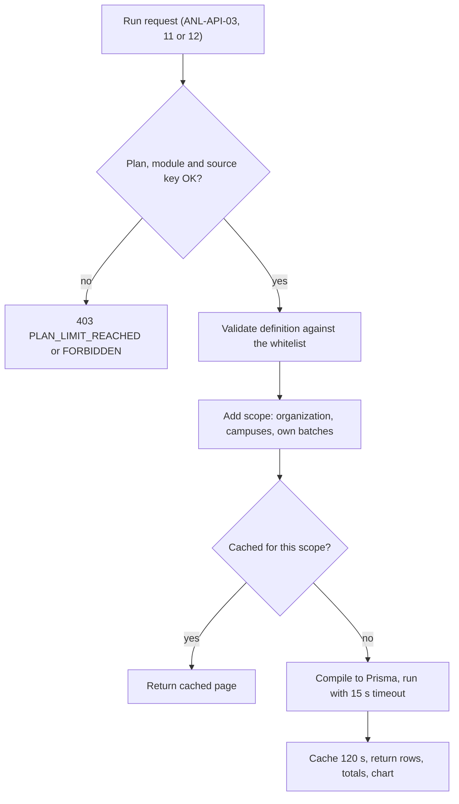
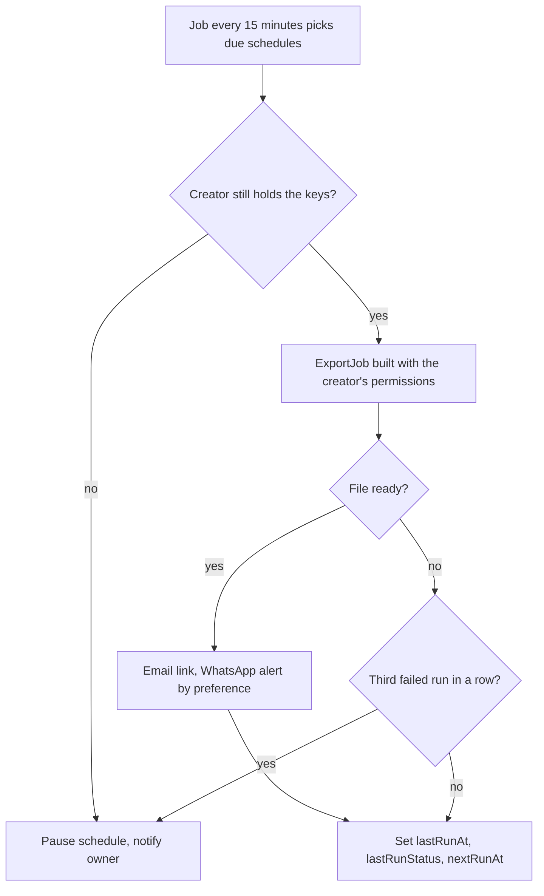
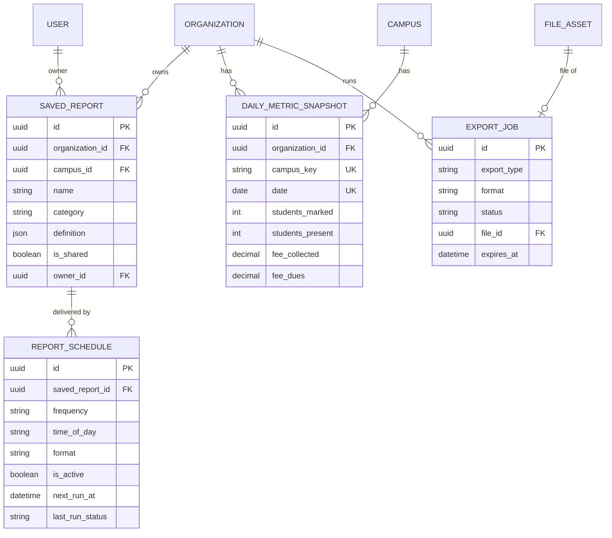

# Analytics Module

**In simple words:** Analytics turns data that other modules already hold into answers: 43 ready reports, a report builder, scheduled email reports, and exports to Excel, CSV and PDF. Each KPI (key performance indicator, a number that shows how the institute is doing) is defined once, so screen, export and email always agree. A report never shows a user more than the source module would.

| Item | Value |
|---|---|
| Module code | ANL |
| Release phase | Phase 2 (V1.0), built Days 113 to 116 (25 to 28 Jan 2027) |
| Plans | Growth: library, KPIs, analyses, exports. Pro, Enterprise: plus builder, sharing, schedules, campus comparison |
| Main users | Organization Admin, Principal, Accountant, Teacher (own batches) |
| Depends on | Dashboard (snapshots), every source module, Notifications, Email, WhatsApp |
| Main tables | `saved_reports`, `report_schedules`, `daily_metric_snapshots`, `export_jobs` |
| Endpoints | ANL-API-01 to ANL-API-32; Blueprint prompt P-42 |

## Objective

Today Rajesh Sharma waits a day for a hand-made Excel sheet, and two staff members give two different totals. Goals:

1. **One formula per number** (ANL-BR-07); fee totals match the *Fees Module* to the paisa.
2. **Fast:** a standard report runs in under 2 seconds on a 1,200-student tenant.
3. **Self-service:** Dr. Anita Verma builds a new report in under 5 minutes.
4. **Hands-free:** the Monday digest arrives within 15 minutes of 07:00.
5. **Safe for the fee counter:** row, time and concurrency limits on a separate connection pool.
6. **Honest:** every result says when its numbers were computed.

## Scope

### In scope

- A library of 43 code-defined reports and a builder over 10 datasets (ANL-API-01 to 05, 11).
- Saved, shared and scheduled reports; email delivery with a WhatsApp alert (ANL-API-06 to 22).
- Exports to XLSX, CSV and PDF through `ExportJob`.
- KPIs, trends and campus comparison from snapshots (ANL-API-23 to 25).
- Analyses of admissions, attendance, fees, academics and communication (ANL-API-26 to 30).
- Raw snapshot rows and a rebuild (ANL-API-31, 32).

### Out of scope

- Role dashboards and the 15-minute snapshot job: *Dashboard Module*.
- Working lists with actions, such as the defaulter list with reminders: the owning module.
- Predictions and plain-language questions: *AI Insights Module*.
- Platform metrics (tenant MRR, churn): the Super Admin console.
- Direct SQL or BI tool access: not in V1.0.

### Phase notes

- **Phase 2 (V1.0):** all 32 endpoints and 38 reports.
- **Phase 3 (V1.5):** 5 more reports (payroll, library, transport, hostel, inventory); read replica.
- **Phase 4 (V2.0):** *AI Insights Module* explains unusual KPI changes.

> **Rule:** If P-42 runs late, ship the library, KPIs and exports first and move the builder to February 2027.

### Standard report library

A standard report is code, not a database row: one file per report in `server/src/modules/analytics/reports/` with key, parameters, columns, default chart (returned by ANL-API-02), source key and `run()`. The key prefix sets the `ReportCategory`. (P3) marks Phase 3.

| Key | Report | Source key |
|---|---|---|
| `students.strength` | Strength by course and batch | `students.view` |
| `students.admissions_withdrawals` | Admissions and withdrawals | `students.view` |
| `students.gender_mix` | Gender mix by course | `students.view` |
| `students.sibling_families` | Families with 2 or more children | `students.view` |
| `admissions.inquiry_register` | Inquiry register | `admissions.view` |
| `admissions.funnel` | Admission funnel by stage | `admissions.view` |
| `admissions.source_performance` | Lead source performance | `admissions.view` |
| `admissions.counsellor_performance` | Counsellor performance | `admissions.view` |
| `admissions.overdue_followups` | Overdue follow-ups | `admissions.view` |
| `admissions.lost_reasons` | Lost leads by reason | `admissions.view` |
| `admissions.demo_conversion` | Demo class conversion (coaching) | `admissions.view` |
| `attendance.daily_summary` | Daily attendance by batch | `attendance.view` |
| `attendance.monthly_register` | Monthly register | `attendance.view` |
| `attendance.chronic_absentees` | Chronic absentees below 75% | `attendance.view` |
| `attendance.batch_comparison` | Attendance percent by batch | `attendance.view` |
| `attendance.weekday_pattern` | Attendance by weekday | `attendance.view` |
| `attendance.late_arrivals` | Late arrivals by student | `attendance.view` |
| `attendance.staff_monthly` | Staff attendance by month | `attendance.view_staff` |
| `fees.collection_by_month` | Fee collection by month | `payments.view` |
| `fees.daily_collection` | Day-wise collection by method | `payments.view` |
| `fees.dues_ageing` | Dues ageing by batch | `fees.view` |
| `fees.defaulters` | Defaulters by amount or age | `fees.view` |
| `fees.head_wise` | Billed and collected by fee head | `fees.view` |
| `fees.online_share` | Online versus counter collection | `payments.view` |
| `fees.concessions` | Discounts and scholarships given | `discounts.view` |
| `fees.refunds` | Refund register | `payments.view` |
| `exams.result_summary` | Pass percent by batch | `exams.view` |
| `exams.subject_performance` | Subject average, high, low | `exams.view` |
| `exams.grade_distribution` | Grade distribution | `exams.view` |
| `exams.toppers` | Toppers by batch and subject | `exams.view` |
| `exams.student_progress` | One student across exams | `exams.view` |
| `staff.strength` | Staff by department | `staff.view` |
| `staff.leave_summary` | Leave taken by type and month | `leave.view` |
| `staff.teacher_workload` | Teacher periods per week | `timetable.view` |
| `communication.channel_summary` | Delivery and cost by channel | `notifications.view` |
| `communication.whatsapp_spend` | WhatsApp spend by month | `whatsapp.view` |
| `operations.homework_completion` | Homework submission rate by batch | `homework.view` |
| `operations.certificates_issued` | Certificates issued by type | `certificates.view` |
| `payroll.salary_cost` (P3) | Salary cost by department | `payroll.view` |
| `operations.library_circulation` (P3) | Books issued and overdue | `library.view` |
| `operations.transport_occupancy` (P3) | Seat occupancy by route | `transport.view` |
| `operations.hostel_occupancy` (P3) | Bed occupancy by hostel | `hostel.view` |
| `operations.low_stock` (P3) | Items below reorder level | `inventory.view` |

## User Stories

| ID | As a | I want to | So that | Priority |
|---|---|---|---|---|
| ANL-US-01 | Organization Admin | see this month's KPIs against last month | I know at once if we are on track | Must |
| ANL-US-02 | Organization Admin | compare Main Campus and City Campus | I see which branch needs help | Must |
| ANL-US-03 | Principal | open a ready report such as "Chronic absentees" | I act without building anything | Must |
| ANL-US-04 | Accountant | export dues ageing to Excel | I can send it to the auditor | Must |
| ANL-US-05 | Principal | build a report from fields, filters and a chart | I answer new questions myself | Must |
| ANL-US-06 | Principal | share a saved report with the Accountant role | we all read the same numbers | Should |
| ANL-US-07 | Organization Admin | get a PDF digest every Monday at 07:00 | I read the week before the staff meeting | Must |
| ANL-US-08 | Organization Admin | email a monthly summary to a trustee | the trust sees results | Could |
| ANL-US-09 | Teacher | see my batches' attendance and marks on my phone | I spot weak students early | Should |
| ANL-US-10 | Organization Admin | see the funnel by lead source and counsellor | I spend on sources that convert | Must |
| ANL-US-11 | Organization Admin | rebuild snapshots after a correction | past months show corrected numbers | Should |

## Workflow

### How a report run works

**Figure: Running a standard or saved report**



1. The router checks the plan. The builder, sharing, schedules and ANL-API-25 also need the feature `analytics.advanced` (Pro, Enterprise).
2. The service checks `analytics.view` and the source key (ANL-BR-01), validates the definition (ANL-BR-05) and adds the scope itself (ANL-BR-02).
3. `compile-query.ts` turns the definition into Prisma calls on the reporting client. No SQL text is built from user input.

### How a scheduled report is delivered

**Figure: Scheduled report delivery**



1. A repeatable BullMQ job on the `exports` queue runs at minutes 0, 15, 30 and 45 and reads due rows through the index `(isActive, nextRunAt)`.
2. Per row it opens the tenant context, checks the creator (`createdById`) and creates an `ExportJob` with `exportType = analytics.schedule.{scheduleId}`. The file is a `FileAsset` that expires after 7 days.
3. Delivery follows ANL-BR-16; timing follows ANL-BR-14.

### Data freshness

| Endpoints | Reads | Fresh within | Label |
|---|---|---|---|
| ANL-API-23 to 25, 31 | Snapshots only | 15 minutes; final after the 00:30 close | "Updated 6 min ago" |
| ANL-API-26 to 30 | Source tables plus snapshot totals | Live, cached 5 minutes | "Live, cached at 10:42" |
| ANL-API-03, 11, 12, exports | Source tables, reporting client | Live, cached 2 minutes | "Data as of 10:42" |

At launch the reporting client is a second Prisma client on the primary database with 3 connections, so reports cannot starve the fee counter. Later `REPORTING_DATABASE_URL` points it at the read replica (a read-only database copy, lever 7 of *System Architecture*).

### Status lifecycles

A schedule has no status column. Its state comes from `isActive` and `lastRunStatus` (enum `JobStatus`).

| State | `isActive` | `lastRunStatus` | Meaning |
|---|---|---|---|
| New | true | null | Created, never run |
| Queued or Running | true | `QUEUED`, `PROCESSING` | The export job exists or is building the file |
| Healthy | true | `COMPLETED` | The last delivery worked |
| Failing | true | `FAILED` | One or two failed runs in a row |
| Paused | false | any | By a user, auto-pause or report deletion; ANL-API-21 resumes |

An `ExportJob` moves `QUEUED`, `PROCESSING`, then `COMPLETED` or `FAILED`; it becomes `CANCELLED` when its report is deleted first. After `expiresAt` the file is purged.

## Screens and Wireframes

| ID | Screen | Users | Purpose |
|---|---|---|---|
| ANL-S01 | Analytics overview | All analytics users | KPIs, trend, campus table |
| ANL-S02 | Report library | All analytics users | Permitted reports by category |
| ANL-S03 | Report runner | All analytics users | Parameters, table, chart, export |
| ANL-S04 | Report builder | Org Admin, Principal | Dataset, fields, filters, preview, save |
| ANL-S05 | Saved reports | All analytics users | Run, duplicate, share, delete |
| ANL-S06 | Schedule dialog and list | Org Admin, Principal | Timing, format, recipients |
| ANL-S07 | Campus comparison | Org Admin, multi-campus Principal | One row per campus plus total |
| ANL-S08 | Deep-dive analyses | Org Admin, Principal, Accountant | Five analysis tabs |
| ANL-S09 | My batch reports (mobile) | Teacher | Own batches on a phone |
| ANL-S10 | Snapshot health | Org Admin | Missing days, rebuild |

**Screen ANL-S01 — Analytics overview (Organization Admin, web)**

```text
+--------------------------------------------------------------------------+
| EduFlow | Bright Future Public School    [Search students...]   (RS) v   |
+------------+-------------------------------------------------------------+
| Dashboard  | Analytics > Overview          Campus [All campuses v]       |
| Students   | Period [Aug 2027 v]  compared with Jul 2027   Updated 6m    |
| Attendance +-------------------------------------------------------------+
| Fees       | Active students | Attendance | Collected    | Dues          |
| Analytics< |      1,196      |   91.5%    | Rs 16,83,000 | Rs 14,02,500  |
|  Overview  |  -0.3% vs Jul   | +0.7 pp    |   -15.0%     |   -8.2%       |
|  Library   +-------------------------------------------------------------+
|  Saved     | Fee collection by month       [Day] [Week] (Month)          |
|  Schedules | Rs lakh 20 |      ##                                        |
|  Compare   |         15 | ##   ##   ##                                   |
|  Analyses  |         10 | ##   ##   ##                                   |
| Settings   |          0 +---------------                                 |
|            |              Jun  Jul  Aug                                  |
|            +-------------------------------------------------------------+
|            | Campus        Students  Attend.   Collected   Coll. rate    |
|            | Main Campus        790    92.4%   11,20,000       58.0%     |
|            | City Campus        406    89.5%    5,63,000       48.7%     |
|            | Total            1,196    91.5%   16,83,000       54.5%     |
|            |                      [Open library]  [Compare campuses]     |
+------------+-------------------------------------------------------------+
```

- Pickers call ANL-API-23 and 24; "Compare campuses" opens ANL-S07 (ANL-API-25).
- Money cards need `fees.view` or `payments.view`; a Teacher sees only attendance of own batches.

**Screen ANL-S03 — Report runner: Dues ageing by batch (Accountant, web)**

```text
+--------------------------------------------------------------------------+
| EduFlow | Bright Future Public School    [Search students...]   (SG) v   |
+------------+-------------------------------------------------------------+
| Fees       | Library > Fees > Dues ageing by batch      [Save as copy]   |
| Analytics< | Campus [Main Campus v]  Course [Class 10 v]                 |
|  Overview  | As of [31-08-2027]  Amounts in Rs      [Run] [Export v]     |
|  Library   +-------------------------------------------------------------+
|  Saved     | Class    Not due     1-30    31-60   61-90    90+     Total |
|            | 10-A    1,20,000   36,000   21,000   6,000      0  1,83,000 |
|            | 10-B    1,08,000   30,000   12,000   9,000  3,000  1,62,000 |
|            | 10-C      96,000   24,000   15,000       0      0  1,35,000 |
|            | 10-D    1,14,000   18,000    9,000   3,000  6,000  1,50,000 |
|            |-------------------------------------------------------------|
|            | Total   4,38,000 1,08,000   57,000  18,000  9,000  6,30,000 |
|            | Rows 1-4 of 4   Data as of 31 Aug 2027, 10:42 IST (live)    |
|            +-------------------------------------------------------------+
|            | Chart [Stacked bar v]     # not due  = 1-60  * over 60      |
|            | 10-A |##########=====*                                      |
|            | 10-B |#########===**                                        |
|            | 10-C |########===*                                          |
|            | 10-D |#########==**                                         |
+------------+-------------------------------------------------------------+
```

- Parameters come from ANL-API-02; Run calls ANL-API-03; Export calls ANL-API-04. Buckets follow ANL-BR-10.
- Dr. Anita Verma gets no Export button (ANL-BR-03). "Save as copy" needs Pro.

**Screen ANL-S04 — Report builder (Organization Admin, web)**

```text
+--------------------------------------------------------------------------+
| EduFlow | Sharma Classes, Patna                                   (RS) v |
+--------------------------------------------------------------------------+
| Analytics > Report builder              [Cancel] [Preview] [Save]        |
+----------------------+---------------------------------------------------+
| 1 Dataset            | Name [Dues by batch - JEE 2028_______________]    |
|  (o) Fee invoices    | Category [Fees v]      Campus [All campuses v]    |
|  ( ) Payments        | ------------------------------------------------- |
|  ( ) Attendance      | Filters (max 10)                 [+ Add filter]   |
|  ( ) Exam marks      | Status    in       [Issued, Part paid, Overdue]   |
| 2 Fields             | Course    equals   [JEE Main 2028 v]              |
|  [x] Batch           | Due date  last     [90] days                      |
|  [x] Student (count) | Group by [Batch v]   Sort [Balance, high first v] |
|  [x] Balance (sum)   | Chart (o) Bar  ( ) Line  ( ) Pie  ( ) Table only  |
|  [ ] Late fee (sum)  | ------------------------------------------------- |
|  [ ] Invoice no      | Preview, first 100 rows          as of 10:42      |
| 3 Chart              | Batch        Students       Balance (Rs)          |
|  [Bar v]             | JEE-M1             14             72,000          |
|                      | JEE-E2             11             65,500          |
|                      | JEE-W3              6             27,000          |
|                      | Total              31           1,64,500          |
+----------------------+---------------------------------------------------+
```

- Datasets and fields come from ANL-API-05. Preview calls ANL-API-11; Save calls ANL-API-07.
- An invalid chart choice shows an inline error and disables Save.

**Screen ANL-S06 — Schedule dialog (Organization Admin, web)**

```text
+--------------------------------------------------------------------------+
| Schedule report: Weekly owner digest                            [x]      |
+--------------------------------------------------------------------------+
| Frequency  ( ) Daily  (o) Weekly  ( ) Monthly  ( ) Quarterly             |
| Day        [Monday v]        Time [07:00 v]   Timezone Asia/Kolkata      |
| Format     (o) PDF  ( ) Excel  ( ) CSV                                   |
| Send to    [x] Rajesh Sharma (Organization Admin)                        |
|            [x] Dr. Anita Verma (Principal)                               |
|            [ ] Suresh Gupta (Accountant) - no access to Attendance       |
|            [+ Add user]                                                  |
| Extra      [trustee@bfps-trust.org______________]  max 5 addresses       |
| emails     Allowed because this report is grouped (no student rows)      |
| WhatsApp   Users who chose WhatsApp also get an alert with a link        |
|--------------------------------------------------------------------------|
| Next runs  Mon 6 Sep 07:00, Mon 13 Sep 07:00, Mon 20 Sep 07:00           |
| Last run   Mon 30 Aug 07:00  COMPLETED  PDF, 4 pages, 3 recipients       |
|                                                                          |
|                   [Run now]  [Pause]  [Cancel]  [Save schedule]          |
+--------------------------------------------------------------------------+
```

- Save calls ANL-API-17 or ANL-API-18; "Run now" calls ANL-API-22; "Pause" calls ANL-API-20.
- Suresh Gupta is greyed out: the digest reads attendance (ANL-BR-15). "Next runs" follows ANL-BR-14.

**Screen ANL-S09 — My batch attendance (Teacher, mobile)**

```text
+------------------------------------+
| EduFlow               Priya Nair   |
+------------------------------------+
| < Reports    My batch attendance   |
| Batch [10-A v]  Month [Aug 2027 v] |
|------------------------------------|
| Class average              91.8%   |
| Working days                  24   |
| Below 75%              3 students  |
|------------------------------------|
| Student            Present      %  |
| Rohan Mehta          16/24   66.7  |
| Kavya Singh          17/24   70.8  |
| Aditya Rao         17.5/24   72.9  |
| Aarav Sharma         23/24   95.8  |
| [Show all 42]                      |
|------------------------------------|
| Data as of 10:42 today             |
| [Marks report]    [Homework rate]  |
+------------------------------------+
```

- The picker lists only Priya Nair's batches. The screen runs `attendance.chronic_absentees` (ANL-API-03, ANL-BR-11).
- No export button: a Teacher holds no `analytics.export`.

## UI Components

| Component | Type | Behaviour |
|---|---|---|
| `KpiCard`, `FreshnessBadge` | shadcn `Card`, `Badge` | Value, change in percent or pp; "Updated 6 min ago", amber after 30 minutes |
| `TrendChart` | Recharts | Day, week, month; a missing day is a gap, never zero |
| `ReportCatalog` | `Accordion`, `Input` | Permitted reports; plan-locked items show "Pro" |
| `ParameterForm` | React Hook Form, Zod | Built from ANL-API-02; campuses limited to scope |
| `ReportResultTable` | TanStack Table | Server paging of 100 rows; totals row; column hide |
| `FieldPicker`, `FilterRow` | `Checkbox`, `Select`, `DatePicker` | Whitelisted fields; operators change with field type |
| `ExportMenu` | `DropdownMenu` | Excel, CSV, PDF; disabled with a reason for `View` users |
| `ScheduleDialog`, `ShareDialog` | `Dialog`, `Combobox` | Next three runs; users or roles without access are disabled |

Every data component has four states: skeleton, empty ("No rows match these filters"), error with `requestId` and Retry, and a lock that names the missing permission or plan.

## Validation Rules

| Field | Rule | Error message shown to user |
|---|---|---|
| `name` | 3 to 150 characters; unique among the owner's live reports | Name must be 3 to 150 characters. / You already have a report with this name. |
| `definition.dataset` | A dataset whose source key the caller holds | This dataset is not available to you. |
| `definition.columns` | 1 to 20 whitelisted fields | Pick between 1 and 20 columns. / Field {field} is not part of this dataset. |
| `definition.filters` | At most 10; operator fits the field type; `contains` needs 2 characters | Operator {op} cannot be used on {field}. |
| `definition.groupBy`, `sort` | At most 2 groupings and 3 sort keys | You can group by at most 2 fields. |
| `definition.chart` | Pie: one grouping and one number. Line: a date grouping | This chart type does not fit the selected columns. |
| Ungrouped date range | Required, at most 366 days | Pick a date range of up to 366 days. |
| `from` | Inside the plan history window | Your plan keeps {days} days of history. Upgrade to see older data. |
| `sharedRoleKeys` | Role keys of this organization; never `PARENT` or `STUDENT` | Reports cannot be shared with parents or students. |
| `dayOfWeek`, `dayOfMonth` | Weekday for `WEEKLY`; 1 to 28 for `MONTHLY` and `QUARTERLY` | Pick a day of the week. / Pick a day from 1 to 28. |
| `timeOfDay` | `HH:mm` with minutes 00, 15, 30 or 45 | Pick a time on the quarter hour, for example 07:00. |
| `recipientUserIds` | Active users who can see the whole report; 1 to 20 recipients in total | {name} cannot see this report. Remove them or give access first. |
| `recipientEmails` | At most 5 valid addresses; grouped reports only | Extra emails are allowed only for summary reports without student rows. |
| Export size | 1,00,000 rows (XLSX, CSV) or 5,000 (PDF) | This report has {n} rows. Narrow the filters to {max} rows or fewer. |

## Business Rules

**ANL-BR-01 — Analytics never widens access.** Every report and dataset names a source key. Opening or running it needs `analytics.view` plus that key. ANL-API-01 lists only reports the caller may open; a direct call to any other answers `403 FORBIDDEN`.

**ANL-BR-02 — The server adds the scope.** The effective scope is the narrower of the `analytics.view` and source key scopes. `Campus` adds `campusId IN (assigned campuses)`. `Own` adds `batchId IN (batches the Teacher teaches)`. A `campusId` outside the scope answers `403 FORBIDDEN`.

**ANL-BR-03 — View-only data is never exported.** Exports (ANL-API-04, 15 and schedules) need `analytics.export`, and no source key may be held only as `View`. This follows *RBAC and Permissions Matrix*.

> **Example:** Dr. Anita Verma (`fees.view` = `View`) runs "Dues ageing by batch", but ANL-API-04 answers `403 FORBIDDEN`: "You can view this report but not export it." Suresh Gupta (`Campus`) exports it.

**ANL-BR-04 — A shared report runs with the viewer's permissions.** Sharing (ANL-API-14) shares the definition, never the data; a viewer without a source key does not see it. Empty `sharedRoleKeys` means every role with `analytics.view`.

**ANL-BR-05 — The builder knows only whitelisted fields.** Datasets are code in `analytics/datasets/`: fields, types, operators, groupings and the source key. Phone, email, address, date of birth and identity numbers are in no whitelist, so they cannot leave through a report.

| Dataset key | Source key | Date field | Example fields |
|---|---|---|---|
| `students` | `students.view` | admission date | course, batch, gender, status |
| `admission_inquiries` | `admissions.view` | `createdAt` | source, stage, course, counsellor |
| `attendance_records` | `attendance.view` | `date` | batch, student, status |
| `staff_attendance` | `attendance.view_staff` | `date` | department, staff, status |
| `fee_invoices` | `fees.view` | `dueDate` | batch, status, total, balance |
| `payments` | `payments.view` | `paidAt` | method, gateway, amount |
| `exam_marks` | `exams.view` | exam start date | exam, subject, marks, grade |
| `message_logs` | `notifications.view` | `createdAt` | channel, status, cost |
| `staff` | `staff.view` | joining date | department, designation |
| `daily_metrics` | `analytics.view` | `date` | snapshot metrics; money needs `fees.view` |

Operators depend on the field type (the Zod schema under Non-Functional Notes lists them). Date filters also accept presets such as `this_month` and `last_n_days`; dates group by day, week, month, quarter or year.

**ANL-BR-06 — Limits.** A definition holds 1 to 20 columns, 10 filters, 2 groupings and 3 sort keys. A grouped result has at most 5,000 groups; a pie shows 12 slices plus "Other". Preview returns 100 rows; runs page by 100 rows. Each query has a 15-second timeout. At most 3 heavy queries run at once per organization (a Redis semaphore); a fourth waits 5 seconds, then gets `429 RATE_LIMITED`. Exports allow 1,00,000 rows (XLSX, CSV) or 5,000 (PDF).

> **Example:** An attendance register for 1,200 students over 220 days has 2,64,000 rows and is refused; one 75-day term (90,000 rows) is accepted.

### KPI definitions

**ANL-BR-07 — One formula per KPI.** KPIs come from `daily_metric_snapshots`. Flows are summed over the days. Balances take the last day. Ratios are recomputed from summed counters, never averaged, and show one decimal. Money stays `Decimal`.

| KPI | Formula over a period |
|---|---|
| `activeStudents` | Value on the last day |
| `newAdmissions`, `newInquiries`, `withdrawals`, `messagesSent` | Sum over the days |
| `withdrawalRate` | `withdrawals` / `activeStudents` of the day before the period x 100 |
| `attendancePercent` | Sum `studentsPresent` / sum `studentsMarked` x 100; holiday rows skipped |
| `staffAttendancePercent` | Sum `staffPresent` / sum `staffTotal` x 100 |
| `feeInvoiced`, `feeCollected`, `feeCollectedOnline` | Sum over the days |
| `onlineShare` | Sum `feeCollectedOnline` / sum `feeCollected` x 100 |
| `feeDues`, `feeOverdue` | Value on the last day |
| `collectionRate` | `feeCollected` / (`feeCollected` + last-day `feeDues`) x 100 |
| `overdueShare` | Last-day `feeOverdue` / last-day `feeDues` x 100 |

> **Example:** Bright Future, all campuses, August 2027: collected ₹16,83,000, dues on 31 August ₹14,02,500. Collection rate = 16,83,000 / 30,85,500 = 54.5%. Online ₹7,40,520 gives 7,40,520 / 16,83,000 = 44.0%. Attendance = 25,120 / 27,456 = 91.5%. Withdrawals 6 of 1,200 = 0.5%.

**ANL-BR-08 — Change against the previous period.** A calendar preset compares with the previous period of the same kind; a custom range with the same number of days just before it. Counts and money show (current − previous) / previous x 100. Percent KPIs show the difference in percentage points (pp). A previous zero shows "New".

> **Example:** July ₹19,80,000, August ₹16,83,000: −15.0%. Attendance 90.8% to 91.5%: +0.7 pp. A custom 10 to 23 August (14 days) compares with 27 July to 9 August.

**ANL-BR-09 — Campus totals are recomputed.** ANL-API-25 returns one row per campus plus a total read from the `ALL` snapshot row. A user who reaches one campus gets no total row. With mixed currencies the total's money cells stay empty, as in *Dashboard Module*.

> **Example:** Main Campus 17,519 / 18,960 = 92.4%; City Campus 7,601 / 8,496 = 89.5%; total 25,120 / 27,456 = 91.5%. Averaging the two percentages gives 91.0%, which is wrong.

**ANL-BR-10 — Dues ageing.** Age = "as of" date − `dueDate`, for invoices with `balance` above zero and status `ISSUED`, `PARTIALLY_PAID` or `OVERDUE`. Buckets: Not due (0 or less), 1–30, 31–60, 61–90, over 90. The amount is the `balance`.

> **Example:** Aarav Sharma's invoice INV-0977 (Transport Q2) was due on 10 July 2027 with ₹3,000 open. On 31 August the age is 21 + 31 = 52 days: bucket 31–60.

**ANL-BR-11 — Chronic absentees.** A student is listed when attendance over the range is below the threshold (default 75%, from 50% to 95%) with at least 10 marked days. `PRESENT` and `LATE` count 1, `HALF_DAY` 0.5; `HOLIDAY` rows are skipped. This is the snapshot rule, so the list and the batch average agree.

> **Example:** Aditya Rao was marked on 24 days in August: 17 present and 1 half day. (17 + 0.5) / 24 = 72.9%, so he is listed.

**ANL-BR-12 — Live analysis formulas (ANL-API-26 to 30).**

| Measure | Formula |
|---|---|
| Conversion rate | Inquiries created in the range and now `CONVERTED` / all inquiries created in the range x 100 |
| Pass percent | Students who passed every non-exempt paper / students with a non-absent mark x 100; `PUBLISHED` exams only |
| Delivery rate | `DELIVERED` or `READ` / `SENT`, `DELIVERED`, `READ` or `FAILED` x 100 |
| Homework submission rate | Submissions / (assigned students x homework items) x 100 |

> **Example:** Unit Test 2 of 10-A: 42 students, 1 absent in every paper, 38 passed all papers. Pass percent = 38 / 41 = 92.7%. The absent student shows as "Absent", not as a fail.

**ANL-BR-13 — Money matches the Fees module.** Money is summed as PostgreSQL `numeric` and rounded only for display. Collection follows the snapshot rule of *Dashboard Module*: successful payments by `paidAt` date. Refunds have their own report and are never netted silently.

### Saved reports and schedules

**ANL-BR-14 — Schedule timing.** `timeOfDay` is local time in the organization timezone; `nextRunAt` is stored in UTC. `QUARTERLY` runs on `dayOfMonth` of January, April, July and October. A slot that has passed at save time moves to the next one. Resume recomputes from now, so runs missed while paused are not sent. A worker outage sends one late run, never a backlog.

> **Example:** On Wednesday 1 September 2027 at 10:00 IST a weekly Monday 07:00 schedule is saved: `nextRunAt` = `2027-09-06T01:30:00Z`. A monthly day-1 08:00 schedule saved the same morning first runs on 1 October (`2027-10-01T02:30:00Z`).

**ANL-BR-15 — Who may receive a scheduled report.** The file is built once with the creator's permissions and the report's `campusId`. Each internal recipient must be active, hold `analytics.view` and every source key with a scope covering that campus, and be able to open the report (owner, or a role in `sharedRoleKeys`). This is checked at save (`422 BUSINESS_RULE_VIOLATION`) and at each run, which drops and audits users who lost access. `recipientEmails` (at most 5) are allowed only for grouped or snapshot reports, so no student-level row reaches a person without a login.

**ANL-BR-16 — Delivery channels.** Every recipient gets an email through the *Email Module* with a pre-signed S3 link valid for 72 hours (as CMN-API-20). Internal users also get an "Open in EduFlow" link that needs a login and runs live with their own permissions (ANL-API-12). Users who prefer WhatsApp get the utility template `analytics_report_ready` with that in-app link only, never the file, paid from the organization's credits.

**ANL-BR-17 — Failure and auto-pause.** An export job gets 3 attempts, 60 seconds apart. When the last three jobs of a schedule all `FAILED`, the schedule gets `isActive = false` and the creator and owner get `analytics.schedule.failed`. A bounced email is not a failed run.

**ANL-BR-18 — Cache keys.** The key is `anl:{orgId}:{endpoint}:{paramsHash}:{scopeHash}`. `scopeHash` is the first 12 characters of a SHA-256 hash of the user's keys, scopes, campuses and own batches, so two scopes never share an answer. TTL: 300 seconds (ranges with today, analyses), 3,600 seconds (closed ranges), 120 seconds (report runs). Both snapshot events delete every key of the organization, listed in the Redis set `anl:idx:{orgId}`.

**ANL-BR-19 — Snapshot rebuild.** ANL-API-32 accepts a past range of at most 366 days. One rebuild runs per organization at a time, at most 3 a day. The worker queues one job per campus key and month, with job id `snapshot-rebuild-{orgId}-{campusKey}-{yyyy-mm}` (BullMQ forbids `:` in custom ids), and reuses the snapshot service of *Dashboard Module*. A changed `FINAL` day writes an audit entry.

> **Example:** Bright Future rebuilds 1 April to 31 August 2027: 5 months x 3 campus keys (Main, City, `ALL`) = 15 jobs writing 153 x 3 = 459 rows.

**ANL-BR-20 — History follows the plan.** Growth reads 400 days back; Pro and Enterprise 1,100 days, the windows of *Dashboard Module*. An older `from` answers `403 PLAN_LIMIT_REACHED`.

**ANL-BR-21 — Ownership and delete.** Only the owner updates, shares or deletes a saved report; when the owner's user is removed (`ownerId` null), any ORG_ADMIN may. Delete is soft: `deletedAt` is set, schedules get `isActive = false` and `nextRunAt = null`, and queued export jobs are cancelled.

## Acceptance Criteria

| ID | Criterion |
|---|---|
| ANL-AC-01 | **Given** Priya Nair (TEACHER), **when** she opens the library, **then** no Fees category is listed and ANL-API-03 for `fees.dues_ageing` returns `403 FORBIDDEN`. |
| ANL-AC-02 | **Given** Dr. Anita Verma (`fees.view` = `View`), **when** she runs `fees.dues_ageing`, **then** rows show and ANL-API-04 returns `403 FORBIDDEN`. |
| ANL-AC-03 | **Given** Bright Future's August 2027 snapshots, **when** ANL-API-23 runs, **then** `collectionRate` is 54.5, `attendancePercent` 91.5 and the collection change −15.0. |
| ANL-AC-04 | **Given** the campus counts of ANL-BR-09, **when** ANL-API-25 runs, **then** total attendance is 91.5, and a one-campus Principal gets no total row. |
| ANL-AC-05 | **Given** a definition with the field `guardian.phone`, **when** ANL-API-11 is called, **then** it returns `400 VALIDATION_ERROR` before any query. |
| ANL-AC-06 | **Given** a Growth organization, **when** ANL-API-07 or ANL-API-17 is called, **then** it returns `403 PLAN_LIMIT_REACHED`. |
| ANL-AC-07 | **Given** a weekly Monday 07:00 IST schedule, **when** it is saved on 1 September 2027, **then** `nextRunAt` is `2027-09-06T01:30:00Z`, and after that run `2027-09-13T01:30:00Z`. |
| ANL-AC-08 | **Given** two failed runs in a row, **when** the third run fails, **then** `isActive` becomes false and the creator gets `analytics.schedule.failed`. |
| ANL-AC-09 | **Given** a CSV export of 1,24,300 rows, **when** ANL-API-04 is called, **then** it returns `422 BUSINESS_RULE_VIOLATION` and no `ExportJob` is created. |
| ANL-AC-10 | **Given** payments from October 2026 to January 2027, **when** "Fee collection by month" runs, **then** each month equals the day book to the paisa. |
| ANL-AC-11 | **Given** a report shared with `ACCOUNTANT`, **when** Suresh Gupta runs it, **then** only rows of his campus appear. |
| ANL-AC-12 | **Given** two campuses, **when** ANL-API-32 rebuilds 1 April to 31 August 2027, **then** 459 rows are upserted and a second call meanwhile gets `409 CONFLICT`. |

## Edge Cases

| Case | What happens | How the system handles it |
|---|---|---|
| Aarav Sharma moves to City Campus on 16 August | August attendance in two campuses | Records keep their `campusId`; the total uses the `ALL` row |
| A snapshot day is missing | A hole in the trend | The trend shows a gap, the answer lists `missingDays`, ANL-S10 offers a rebuild |
| A field used by a saved report leaves its dataset | The definition fails validation | `422` names the field; the builder marks it "no longer available" |
| The report owner leaves | `ownerId` becomes null | Shared runs continue; the creator check pauses schedules |
| An Australian tenant enters daylight saving | Local 07:00 moves in UTC | `nextRunAt` is recomputed with the IANA zone on every run |
| The same export is asked twice within 60 seconds | Duplicate work | The second call returns the first `ExportJob` |
| A query passes the 15-second timeout | No result | `422`: "Narrow the date range or add a filter" |
| The plan drops from Pro to Growth | Builder and schedules leave the plan | Schedules pause; saved reports lock; the library works |

## Database Schema

| Table | Purpose |
|---|---|
| `saved_reports` | Builder definitions with owner, sharing and last run |
| `report_schedules` | Delivery plan of a saved report, with next and last run |
| `daily_metric_snapshots` | One row per organization, campus key and day; filled by *Dashboard Module*, read and rebuilt here |
| `export_jobs` | Shared export rows; this module writes `exportType` values `analytics.report.{key}`, `analytics.saved.{id}` and `analytics.schedule.{id}` |

### Table saved_reports

| Column | Type | Null | Default | Notes |
|---|---|---|---|---|
| `id` | uuid | No | `uuid()` | PK |
| `organization_id` | uuid | No | | FK `organizations`, cascade |
| `campus_id` | uuid | Yes | | FK `campuses`; null = all campuses the viewer may see |
| `name` | varchar(150) | No | | |
| `description` | varchar(500) | Yes | | |
| `category` | `ReportCategory` | No | | |
| `definition` | jsonb | No | | Checked by the Zod schema |
| `is_shared` | boolean | No | `false` | |
| `shared_role_keys` | text[] | No | empty list | Empty = every role with `analytics.view` |
| `owner_id` | uuid | Yes | | FK `users`, set null |
| `last_run_at` | timestamptz | Yes | | |
| `created_at`, `updated_at` | timestamptz | No | `now()` | |
| `deleted_at` | timestamptz | Yes | | Soft delete |

### Table report_schedules

| Column | Type | Null | Default | Notes |
|---|---|---|---|---|
| `id` | uuid | No | `uuid()` | PK |
| `organization_id` | uuid | No | | FK `organizations`, cascade |
| `saved_report_id` | uuid | No | | FK `saved_reports`, cascade |
| `frequency` | `ScheduleFrequency` | No | | |
| `day_of_week` | `WeekDay` | Yes | | `WEEKLY` only |
| `day_of_month` | smallint | Yes | | 1 to 28; `MONTHLY`, `QUARTERLY` |
| `time_of_day` | varchar(5) | No | | `HH:mm` local time |
| `format` | `FileFormat` | No | `PDF` | |
| `recipient_user_ids` | uuid[] | No | empty list | |
| `recipient_emails` | text[] | No | empty list | At most 5 |
| `is_active` | boolean | No | `true` | |
| `next_run_at`, `last_run_at` | timestamptz | Yes | | |
| `last_run_status` | `JobStatus` | Yes | | |
| `last_error` | varchar(500) | Yes | | |
| `created_by_id` | uuid | Yes | | User id, audit only, no FK |
| `created_at`, `updated_at` | timestamptz | No | `now()` | |

The column table of `daily_metric_snapshots` is in *Dashboard Module*, which fills it; the model is copied under Prisma Schema, and ANL-BR-07 names every metric column.

### Indexes and constraints

```sql
-- saved_reports
CREATE INDEX ON saved_reports (organization_id, category, is_shared);
CREATE INDEX ON saved_reports (organization_id, owner_id);
-- report_schedules
CREATE INDEX ON report_schedules (organization_id, saved_report_id);
CREATE INDEX ON report_schedules (is_active, next_run_at); -- the 15-minute scheduler
-- daily_metric_snapshots
CREATE UNIQUE INDEX ON daily_metric_snapshots (organization_id, campus_key, date);
CREATE INDEX ON daily_metric_snapshots (organization_id, date);
-- Row-Level Security, the second tenant safety net
ALTER TABLE saved_reports ENABLE ROW LEVEL SECURITY;
CREATE POLICY tenant_isolation ON saved_reports
  USING (organization_id = current_setting('app.current_org')::uuid);
```

`report_schedules` gets the same policy. The scheduler's due-row query is the only cross-tenant read: it selects ids only and opens each tenant context before touching a row.

**Figure: Analytics tables and their neighbours**



A saved report has one owner and zero or more schedules. Snapshots hang on the organization and, except the roll-up, on a campus. A schedule reaches its export jobs through `exportType`, not a foreign key.

## Prisma Schema

Copied from `docs/src/_schema/13-certificates-analytics-ai.prisma`. The shared enums and `ExportJob` follow from `00-base.prisma` and `01-platform.prisma`.

```prisma
enum ReportCategory {
  STUDENTS
  ADMISSIONS
  ATTENDANCE
  FEES
  EXAMS
  STAFF
  PAYROLL
  COMMUNICATION
  OPERATIONS
  CUSTOM
}

enum ScheduleFrequency {
  DAILY
  WEEKLY
  MONTHLY
  QUARTERLY
}

// Report built in the report builder and saved for reuse; may be shared and scheduled.
model SavedReport {
  id             String         @id @default(uuid()) @db.Uuid
  organizationId String         @map("organization_id") @db.Uuid
  campusId       String?        @map("campus_id") @db.Uuid // null = all campuses the viewer may see
  name           String         @db.VarChar(150)
  description    String?        @db.VarChar(500)
  category       ReportCategory
  definition     Json // { dataset, columns, filters, groupBy, sort, chart }
  isShared       Boolean        @default(false) @map("is_shared") // false = visible to the owner only
  sharedRoleKeys String[]       @map("shared_role_keys") // role keys that may open a shared report; empty = every role with analytics.view
  ownerId        String?        @map("owner_id") @db.Uuid
  lastRunAt      DateTime?      @map("last_run_at") @db.Timestamptz(6)
  createdAt      DateTime       @default(now()) @map("created_at") @db.Timestamptz(6)
  updatedAt      DateTime       @updatedAt @map("updated_at") @db.Timestamptz(6)
  deletedAt      DateTime?      @map("deleted_at") @db.Timestamptz(6)

  organization Organization     @relation(fields: [organizationId], references: [id], onDelete: Cascade)
  campus       Campus?          @relation(fields: [campusId], references: [id], onDelete: Cascade)
  owner        User?            @relation(fields: [ownerId], references: [id], onDelete: SetNull)
  schedules    ReportSchedule[]

  @@index([organizationId, category, isShared])
  @@index([organizationId, ownerId])
  @@map("saved_reports")
}

// Automatic delivery of a saved report by email (daily, weekly, monthly).
model ReportSchedule {
  id               String            @id @default(uuid()) @db.Uuid
  organizationId   String            @map("organization_id") @db.Uuid
  savedReportId    String            @map("saved_report_id") @db.Uuid
  frequency        ScheduleFrequency
  dayOfWeek        WeekDay?          @map("day_of_week") // WEEKLY
  dayOfMonth       Int?              @map("day_of_month") @db.SmallInt // MONTHLY / QUARTERLY; 1-28
  timeOfDay        String            @map("time_of_day") @db.VarChar(5) // HH:mm in the organization timezone
  format           FileFormat        @default(PDF)
  recipientUserIds String[]          @map("recipient_user_ids") @db.Uuid
  recipientEmails  String[]          @map("recipient_emails") // extra addresses, e.g. a trustee
  isActive         Boolean           @default(true) @map("is_active")
  nextRunAt        DateTime?         @map("next_run_at") @db.Timestamptz(6)
  lastRunAt        DateTime?         @map("last_run_at") @db.Timestamptz(6)
  lastRunStatus    JobStatus?        @map("last_run_status")
  lastError        String?           @map("last_error") @db.VarChar(500)
  createdById      String?           @map("created_by_id") @db.Uuid // User id (audit only, no FK)
  createdAt        DateTime          @default(now()) @map("created_at") @db.Timestamptz(6)
  updatedAt        DateTime          @updatedAt @map("updated_at") @db.Timestamptz(6)

  organization Organization @relation(fields: [organizationId], references: [id], onDelete: Cascade)
  savedReport  SavedReport  @relation(fields: [savedReportId], references: [id], onDelete: Cascade)

  @@index([organizationId, savedReportId])
  @@index([isActive, nextRunAt]) // scheduler
  @@map("report_schedules")
}

// Pre-computed daily numbers per organization and campus; dashboards read this table instead of scanning raw data.
model DailyMetricSnapshot {
  id                 String   @id @default(uuid()) @db.Uuid
  organizationId     String   @map("organization_id") @db.Uuid
  campusId           String?  @map("campus_id") @db.Uuid // null = roll-up of the whole organization
  campusKey          String   @default("ALL") @map("campus_key") @db.VarChar(36) // "ALL" or the campusId; makes the unique key work without NULLs
  date               DateTime @db.Date
  activeStudents     Int      @default(0) @map("active_students")
  newAdmissions      Int      @default(0) @map("new_admissions")
  newInquiries       Int      @default(0) @map("new_inquiries")
  withdrawals        Int      @default(0)
  studentsMarked     Int      @default(0) @map("students_marked") // students with attendance marked on the date
  studentsPresent    Int      @default(0) @map("students_present")
  attendancePercent  Decimal? @map("attendance_percent") @db.Decimal(5, 2) // null on holidays
  staffTotal         Int      @default(0) @map("staff_total")
  staffPresent       Int      @default(0) @map("staff_present")
  currency           String   @db.Char(3)
  feeInvoiced        Decimal  @default(0) @map("fee_invoiced") @db.Decimal(14, 2) // invoices issued on the date
  feeCollected       Decimal  @default(0) @map("fee_collected") @db.Decimal(14, 2) // successful payments on the date
  feeCollectedOnline Decimal  @default(0) @map("fee_collected_online") @db.Decimal(14, 2)
  feeDues            Decimal  @default(0) @map("fee_dues") @db.Decimal(14, 2) // total outstanding balance at the end of the day
  feeOverdue         Decimal  @default(0) @map("fee_overdue") @db.Decimal(14, 2) // part of feeDues past the due date
  messagesSent       Int      @default(0) @map("messages_sent")
  extra              Json? // module-specific counters (library issues, transport trips ...)
  computedAt         DateTime @default(now()) @map("computed_at") @db.Timestamptz(6)
  createdAt          DateTime @default(now()) @map("created_at") @db.Timestamptz(6)
  updatedAt          DateTime @updatedAt @map("updated_at") @db.Timestamptz(6)

  organization Organization @relation(fields: [organizationId], references: [id], onDelete: Cascade)
  campus       Campus?      @relation(fields: [campusId], references: [id], onDelete: Cascade)

  @@unique([organizationId, campusKey, date])
  @@index([organizationId, date])
  @@map("daily_metric_snapshots")
}
```

```prisma
// From 00-base.prisma
enum WeekDay {
  MONDAY
  TUESDAY
  WEDNESDAY
  THURSDAY
  FRIDAY
  SATURDAY
  SUNDAY
}

// Lifecycle of a background job processed by BullMQ workers (imports, exports, PDFs).
enum JobStatus {
  QUEUED
  PROCESSING
  COMPLETED
  COMPLETED_WITH_ERRORS
  FAILED
  CANCELLED
}

// Output format of generated files (exports, reports).
enum FileFormat {
  XLSX
  CSV
  PDF
  JSON
  ZIP
}

// From 01-platform.prisma
// Asynchronous export of a list or report to Excel/CSV/PDF; file link expires.
model ExportJob {
  id             String     @id @default(uuid()) @db.Uuid
  organizationId String     @map("organization_id") @db.Uuid
  campusId       String?    @map("campus_id") @db.Uuid
  exportType     String     @map("export_type") @db.VarChar(80) // e.g. students.list, fees.defaulters, attendance.monthly
  format         FileFormat @default(XLSX)
  filters        Json? // the list filters that were active when the export was requested
  columns        Json? // selected columns
  status         JobStatus  @default(QUEUED)
  fileId         String?    @map("file_id") @db.Uuid
  rowCount       Int?       @map("row_count")
  errorMessage   String?    @map("error_message") @db.Text
  startedAt      DateTime?  @map("started_at") @db.Timestamptz(6)
  finishedAt     DateTime?  @map("finished_at") @db.Timestamptz(6)
  expiresAt      DateTime?  @map("expires_at") @db.Timestamptz(6) // file is purged after this time
  requestedById  String?    @map("requested_by_id") @db.Uuid
  createdAt      DateTime   @default(now()) @map("created_at") @db.Timestamptz(6)
  updatedAt      DateTime   @updatedAt @map("updated_at") @db.Timestamptz(6)

  organization Organization @relation(fields: [organizationId], references: [id], onDelete: Cascade)
  campus       Campus?      @relation(fields: [campusId], references: [id], onDelete: SetNull)
  file         FileAsset?   @relation(fields: [fileId], references: [id], onDelete: SetNull)
  requestedBy  User?        @relation(fields: [requestedById], references: [id], onDelete: SetNull)

  @@index([organizationId, requestedById, createdAt])
  @@index([organizationId, status])
  @@map("export_jobs")
}
```

The back-relations `savedReports`, `reportSchedules`, `dailyMetricSnapshots` and `exportJobs` live on `Organization`, `Campus` and `User` in their own files. This module adds no field and no table.

## API Endpoints

| ID | Method | Path | Permission | Purpose |
|---|---|---|---|---|
| ANL-API-01 | GET | `/report-library` | `analytics.view` | Standard reports the caller may open |
| ANL-API-02 | GET | `/report-library/:reportKey` | `analytics.view` | Parameters, columns, default chart |
| ANL-API-03 | POST | `/report-library/:reportKey/run` | `analytics.view` | Run; rows, totals, chart |
| ANL-API-04 | POST | `/report-library/:reportKey/export` | `analytics.export` | Export XLSX, CSV or PDF |
| ANL-API-05 | GET | `/report-datasets` | `analytics.build` | Datasets, fields, operators, groupings |
| ANL-API-06 | GET | `/saved-reports` | `analytics.view` | Own and shared reports |
| ANL-API-07 | POST | `/saved-reports` | `analytics.build` | Save a definition |
| ANL-API-08 | GET | `/saved-reports/:id` | `analytics.view` | Definition with schedules |
| ANL-API-09 | PATCH | `/saved-reports/:id` | `analytics.build` | Update own report |
| ANL-API-10 | DELETE | `/saved-reports/:id` | `analytics.build` | Soft delete; schedules stop |
| ANL-API-11 | POST | `/saved-reports/preview` | `analytics.build` | Run an unsaved definition, 100 rows |
| ANL-API-12 | POST | `/saved-reports/:id/run` | `analytics.view` | Run; sets `lastRunAt` |
| ANL-API-13 | POST | `/saved-reports/:id/duplicate` | `analytics.build` | Copy to the caller |
| ANL-API-14 | POST | `/saved-reports/:id/share` | `analytics.build` | Set `isShared`, `sharedRoleKeys` |
| ANL-API-15 | POST | `/saved-reports/:id/export` | `analytics.export` | Export a saved report |
| ANL-API-16 | GET | `/report-schedules` | `analytics.view` | Schedules with last run status |
| ANL-API-17 | POST | `/report-schedules` | `analytics.schedule` | Create a schedule |
| ANL-API-18 | PATCH | `/report-schedules/:id` | `analytics.schedule` | Update; recompute `nextRunAt` |
| ANL-API-19 | DELETE | `/report-schedules/:id` | `analytics.schedule` | Delete a schedule |
| ANL-API-20 | POST | `/report-schedules/:id/pause` | `analytics.schedule` | Set `isActive` false |
| ANL-API-21 | POST | `/report-schedules/:id/resume` | `analytics.schedule` | Set `isActive` true; recompute `nextRunAt` |
| ANL-API-22 | POST | `/report-schedules/:id/run-now` | `analytics.schedule` | Deliver once now |
| ANL-API-23 | GET | `/analytics/kpis` | `analytics.view` | KPIs with previous-period change |
| ANL-API-24 | GET | `/analytics/trends` | `analytics.view` | Metric time series by day, week, month |
| ANL-API-25 | GET | `/analytics/campus-comparison` | `analytics.view` | KPIs per campus plus total |
| ANL-API-26 | GET | `/analytics/admissions` | `analytics.view` | Funnel by source, course, counsellor |
| ANL-API-27 | GET | `/analytics/attendance` | `analytics.view` | By course, batch, weekday; absentees |
| ANL-API-28 | GET | `/analytics/fees` | `analytics.view` | Billed versus collected, ageing, methods |
| ANL-API-29 | GET | `/analytics/academics` | `analytics.view` | Pass percent, subjects, grades |
| ANL-API-30 | GET | `/analytics/communication` | `analytics.view` | Messages by channel, delivery, cost |
| ANL-API-31 | GET | `/daily-metric-snapshots` | `analytics.view` | Raw snapshot rows |
| ANL-API-32 | POST | `/daily-metric-snapshots/rebuild` | `analytics.manage` | Recompute a past date range |

Every router checks the plan, the key above, the source keys and the Zod schema. Another organization's report or schedule answers `404 NOT_FOUND`.

### ANL-API-03 — Run a standard report

```http
POST /api/v1/report-library/fees.dues_ageing/run?page=1&limit=100
Authorization: Bearer <accessToken>
X-Campus-Id: 7d3b5e21-9a4c-4f60-8b17-e2c5a9d04f38
Content-Type: application/json
```

```json
{ "params": { "asOf": "2027-08-31", "courseId": "4e8a2c17-5b39-4d06-a1f2-93c7d5e0b814" } }
```

```json
{
  "success": true,
  "data": {
    "reportKey": "fees.dues_ageing",
    "currency": "INR",
    "asOf": "2027-08-31T05:12:40.000Z",
    "freshness": "LIVE",
    "columns": ["batch", "notDue", "d1to30", "d31to60", "d61to90", "d90plus", "total"],
    "rows": [
      { "batch": "10-A", "notDue": "120000.00", "d1to30": "36000.00", "d31to60": "21000.00",
        "d61to90": "6000.00", "d90plus": "0.00", "total": "183000.00" },
      { "batch": "10-B", "notDue": "108000.00", "d1to30": "30000.00", "d31to60": "12000.00",
        "d61to90": "9000.00", "d90plus": "3000.00", "total": "162000.00" },
      { "batch": "10-C", "notDue": "96000.00", "d1to30": "24000.00", "d31to60": "15000.00",
        "d61to90": "0.00", "d90plus": "0.00", "total": "135000.00" },
      { "batch": "10-D", "notDue": "114000.00", "d1to30": "18000.00", "d31to60": "9000.00",
        "d61to90": "3000.00", "d90plus": "6000.00", "total": "150000.00" }
    ],
    "totals": { "notDue": "438000.00", "d1to30": "108000.00", "d31to60": "57000.00",
      "d61to90": "18000.00", "d90plus": "9000.00", "total": "630000.00" },
    "chart": { "type": "stacked_bar", "x": "batch",
      "series": ["notDue", "d1to30", "d31to60", "d61to90", "d90plus"] }
  },
  "meta": { "page": 1, "limit": 100, "total": 4, "totalPages": 1 }
}
```

| Status | Code | When |
|---|---|---|
| 400 | `VALIDATION_ERROR` | Unknown parameter or future `asOf` |
| 403 | `FORBIDDEN` | No `fees.view` or campus out of scope |
| 422 | `BUSINESS_RULE_VIOLATION` | Query passed the 15-second limit |
| 429 | `RATE_LIMITED` | Three heavy queries running |

### ANL-API-04 — Export a standard report

```http
POST /api/v1/report-library/fees.dues_ageing/export
Authorization: Bearer <accessToken>
Content-Type: application/json
```

```json
{ "format": "XLSX", "params": { "asOf": "2027-08-31", "courseId": "4e8a2c17-5b39-4d06-a1f2-93c7d5e0b814" } }
```

```json
{
  "success": true,
  "data": {
    "exportJobId": "6e0a3c95-1f47-4b28-9d6c-c3b8f2e5a710",
    "exportType": "analytics.report.fees.dues_ageing",
    "format": "XLSX",
    "status": "QUEUED",
    "estimatedRows": 4
  }
}
```

The call answers `202 Accepted`. The client polls CMN-API-19 and downloads through CMN-API-20.

| Status | Code | When |
|---|---|---|
| 403 | `FORBIDDEN` | No `analytics.export`, or a `View` source key |
| 403 | `PLAN_LIMIT_REACHED` | Daily export limit used up |
| 422 | `BUSINESS_RULE_VIOLATION` | Row count above the format limit |

### ANL-API-07 — Save a report definition

```http
POST /api/v1/saved-reports
Authorization: Bearer <accessToken>
Content-Type: application/json
```

```json
{
  "name": "Dues by batch - JEE 2028",
  "category": "FEES",
  "campusId": null,
  "definition": {
    "dataset": "fee_invoices",
    "columns": [
      { "field": "batch.name", "label": "Batch" },
      { "field": "studentId", "agg": "count_distinct", "label": "Students" },
      { "field": "balance", "agg": "sum", "label": "Balance" }
    ],
    "filters": [
      { "field": "status", "op": "in", "value": ["ISSUED", "PARTIALLY_PAID", "OVERDUE"] },
      { "field": "course.id", "op": "eq", "value": "0b6f4d28-93e1-4c57-a8d2-6e1f9b3c7a45" },
      { "field": "dueDate", "op": "relative", "value": { "preset": "last_n_days", "n": 90 } }
    ],
    "groupBy": ["batch.name"],
    "sort": [{ "field": "balance", "dir": "desc" }],
    "chart": { "type": "bar", "x": "batch.name", "y": "balance" }
  }
}
```

```json
{
  "success": true,
  "data": {
    "id": "5c7e1a93-2d48-4b6f-9e05-8a3d7c2f1b60",
    "name": "Dues by batch - JEE 2028",
    "category": "FEES",
    "isShared": false,
    "sharedRoleKeys": [],
    "ownerId": "3a9c7e15-6d2b-4f80-9c41-b7e5d0a2f836",
    "lastRunAt": null,
    "createdAt": "2027-08-31T05:20:03.000Z"
  }
}
```

| Status | Code | When |
|---|---|---|
| 400 | `VALIDATION_ERROR` | Field outside the whitelist or ANL-BR-06 limits |
| 403 | `PLAN_LIMIT_REACHED` | Growth plan, or the saved-report limit reached |
| 409 | `CONFLICT` | The owner already has a report with this name |

### ANL-API-11 — Preview an unsaved definition

The body holds `definition` exactly as in ANL-API-07. The answer has the shape of ANL-API-03 without `meta`, plus `truncated: true` when more than 100 rows exist.

| Status | Code | When |
|---|---|---|
| 400 | `VALIDATION_ERROR` | Invalid definition; no query runs |
| 403 | `FORBIDDEN` | No source key for the dataset |
| 422 | `BUSINESS_RULE_VIOLATION` | Ungrouped run without a date range |

### ANL-API-17 — Create a schedule

```json
{
  "savedReportId": "9f2d6b81-47c3-4a5e-b0d8-1e6c3a7f5294",
  "frequency": "WEEKLY",
  "dayOfWeek": "MONDAY",
  "timeOfDay": "07:00",
  "format": "PDF",
  "recipientUserIds": [
    "3a9c7e15-6d2b-4f80-9c41-b7e5d0a2f836",
    "e81b4f60-2c97-4d3a-8f15-5a0c9e7d2b43"
  ],
  "recipientEmails": ["trustee@bfps-trust.org"]
}
```

```json
{
  "success": true,
  "data": {
    "id": "2b5d8f41-7e03-4c69-a1b8-d4f6e0c3a927",
    "savedReportId": "9f2d6b81-47c3-4a5e-b0d8-1e6c3a7f5294",
    "frequency": "WEEKLY",
    "dayOfWeek": "MONDAY",
    "timeOfDay": "07:00",
    "format": "PDF",
    "isActive": true,
    "nextRunAt": "2027-09-06T01:30:00.000Z",
    "lastRunStatus": null
  }
}
```

| Status | Code | When |
|---|---|---|
| 400 | `VALIDATION_ERROR` | Time not on a quarter hour, missing `dayOfWeek` |
| 403 | `PLAN_LIMIT_REACHED` | Growth plan, or active-schedule limit reached |
| 422 | `BUSINESS_RULE_VIOLATION` | Recipient without access; extra email on an ungrouped report |

### ANL-API-23 — Headline KPIs

```http
GET /api/v1/analytics/kpis?campusId=ALL&from=2027-08-01&to=2027-08-31
Authorization: Bearer <accessToken>
```

```json
{
  "success": true,
  "data": {
    "campusId": "ALL",
    "currency": "INR",
    "range": { "from": "2027-08-01", "to": "2027-08-31" },
    "previousRange": { "from": "2027-07-01", "to": "2027-07-31" },
    "asOf": "2027-08-31T19:00:12.000Z",
    "freshness": "FINAL",
    "missingDays": [],
    "kpis": [
      { "key": "activeStudents", "value": 1196, "previous": 1200, "change": -0.3, "unit": "percent" },
      { "key": "attendancePercent", "value": 91.5, "previous": 90.8, "change": 0.7, "unit": "pp" },
      { "key": "feeCollected", "value": "1683000.00", "previous": "1980000.00", "change": -15.0,
        "unit": "percent" },
      { "key": "feeDues", "value": "1402500.00", "previous": "1528000.00", "change": -8.2,
        "unit": "percent" },
      { "key": "collectionRate", "value": 54.5, "previous": 56.4, "change": -1.9, "unit": "pp" },
      { "key": "onlineShare", "value": 44.0, "previous": 41.0, "change": 3.0, "unit": "pp" }
    ]
  }
}
```

Money KPIs are left out when the caller holds neither `fees.view` nor `payments.view`.

| Status | Code | When |
|---|---|---|
| 400 | `VALIDATION_ERROR` | `from` after `to`, or `to` in the future |
| 403 | `FORBIDDEN` | Campus outside the caller's scope |
| 403 | `PLAN_LIMIT_REACHED` | `from` older than the plan history window |

### ANL-API-25 — Campus comparison

```http
GET /api/v1/analytics/campus-comparison?from=2027-08-01&to=2027-08-31
Authorization: Bearer <accessToken>
```

```json
{
  "success": true,
  "data": {
    "currency": "INR",
    "asOf": "2027-08-31T19:00:12.000Z",
    "rows": [
      { "campusId": "7d3b5e21-9a4c-4f60-8b17-e2c5a9d04f38", "name": "Main Campus",
        "activeStudents": 790, "attendancePercent": 92.4, "feeCollected": "1120000.00",
        "feeDues": "810000.00", "collectionRate": 58.0 },
      { "campusId": "c2a41f08-6b7d-4e39-9f15-3a8d2e6c7b90", "name": "City Campus",
        "activeStudents": 406, "attendancePercent": 89.5, "feeCollected": "563000.00",
        "feeDues": "592500.00", "collectionRate": 48.7 }
    ],
    "total": { "activeStudents": 1196, "attendancePercent": 91.5, "feeCollected": "1683000.00",
      "feeDues": "1402500.00", "collectionRate": 54.5 }
  }
}
```

| Status | Code | When |
|---|---|---|
| 403 | `PLAN_LIMIT_REACHED` | Plan without `analytics.advanced` |
| 403 | `FORBIDDEN` | No `analytics.view` |
| 400 | `VALIDATION_ERROR` | Unknown metric in `metrics` |

### ANL-API-32 — Rebuild snapshots

```json
{ "from": "2027-04-01", "to": "2027-08-31", "campusId": "ALL" }
```

```json
{
  "success": true,
  "data": {
    "status": "QUEUED",
    "jobCount": 15,
    "rowsExpected": 459,
    "jobIdPrefix": "snapshot-rebuild-a1f4c9d2-3b6e-47a8-9d51-2c7e8b0f4a63"
  }
}
```

The call answers `202 Accepted`; `analytics.snapshot.rebuilt` reports completion.

| Status | Code | When |
|---|---|---|
| 400 | `VALIDATION_ERROR` | Future date or more than 366 days |
| 409 | `CONFLICT` | A rebuild of this organization is running |
| 429 | `RATE_LIMITED` | Fourth rebuild on the same day |

Other endpoints: lists (ANL-API-06, 16, 31) page with `meta`; ANL-API-24 returns `points: [{ date, value }]` with `null` for a missing day; ANL-API-26 to 30 return one object per tab with `asOf` and `freshness`.

## Permissions

| Permission key | SUPER_ADMIN | ORG_ADMIN | PRINCIPAL | TEACHER | ACCOUNTANT | PARENT | STUDENT |
|---|---|---|---|---|---|---|---|
| `analytics.view` | Yes | Yes | Campus | Own | Campus | No | No |
| `analytics.build` | Yes | Yes | Campus | No | No | No | No |
| `analytics.schedule` | Yes | Yes | Campus | No | No | No | No |
| `analytics.export` | No | Yes | Campus | No | Campus | No | No |
| `analytics.manage` | Yes | Yes | No | No | No | No | No |

- An `analytics.*` key is never enough alone; the source keys of ANL-BR-01 to 03 apply.
- SUPER_ADMIN acts only through audited impersonation and never exports tenant data.
- A custom "Front Desk" role with `analytics.view` and `admissions.view` sees only admission reports.

## Notifications and Events

| Event | Trigger | Channel | Recipient | Template text |
|---|---|---|---|---|
| `analytics.report.saved` | ANL-API-07, 09 | None | - | Audit and cache only |
| `analytics.report.shared` | ANL-API-14 | In-app | Shared roles | "{owner} shared {name} with you." |
| `analytics.schedule.created` | ANL-API-17 | In-app | Internal recipients | "You will get {name} every {frequency} at {time}." |
| `analytics.schedule.delivered` | Run finished | Email; WhatsApp by preference | Recipients | "Your report {name} for {period} is ready: {link}" |
| `analytics.schedule.failed` | Failed run or auto-pause | Email, In-app | Creator, owner | "{name} could not be sent: {reason}." |
| `analytics.snapshot.computed` | Rebuild job wrote rows | None | - | Clears the analytics cache |
| `analytics.snapshot.rebuilt` | Rebuild finished | In-app | Requester | "Numbers from {from} to {to} were recomputed." |

The module listens to `metrics.snapshot.computed` to clear its cache. Interactive exports reuse the common `export.completed` and `export.failed` events.

## Reports and Exports

The reports are listed under Scope. Export formats:

- **XLSX:** a data sheet plus an "About" sheet with filters, `asOf`, user and row count.
- **CSV:** UTF-8 with a byte-order mark, so Excel shows Hindi names correctly.
- **PDF:** A4, landscape above 6 columns; logo, filters, "Page x of y", footer "Confidential: {organization}".
- Money cells are numbers with 2 decimals. A cell starting with `=`, `+`, `-` or `@` gets a leading quote, so it cannot run as a formula.
- File name `{reportKey}_{campus}_{yyyy-mm-dd}.{ext}`; files expire after 7 days.

ANL-API-16 is the delivery log; CMN-API-18 lists a user's exports.

## Non-Functional Notes

**Performance targets (p95).** ANL-API-23 to 25: 300 ms warm, 800 ms cold. ANL-API-03 and 12: 2 seconds for one year of a 1,200-student tenant. ANL-API-11: 3 seconds. Export of 1,00,000 rows: 60 seconds. Delivery: within 15 minutes of `timeOfDay`.

**Background jobs.** The `exports` queue runs exports and the repeatable scheduler (job id `report-scheduler`, every 15 minutes). The `snapshots` queue runs rebuilds. Both follow the retry policy of *System Architecture*.

**Audit logging.** `audit_logs` gets report save, update, share and delete; schedule changes and run-now; every export with report key, filter hash and row count; rebuilds; denied calls. Plain runs are not audited.

**Plan limits.**

| Limit | Growth | Pro | Enterprise |
|---|---|---|---|
| Library, KPIs, analyses, exports | Yes | Yes | Yes |
| Builder, sharing, schedules, campus comparison | No | Yes | Yes |
| Saved reports per organization | 0 | 200 | 1,000 |
| Active schedules per organization | 0 | 25 | 100 |
| Exports per day per organization | 50 | 200 | 1,000 |
| History window in days | 400 | 1,100 | 1,100 |

**Internationalization.** English and Hindi labels from *Internationalization and Localization*; Indian grouping for INR (₹16,83,000); dates and week start follow the organization; PDFs embed a Devanagari font.

**Definition schema and whitelist guard.**

```typescript
// shared/src/schemas/analytics.ts
import { z } from 'zod';

const field = z.string().regex(/^[a-zA-Z][a-zA-Z0-9_.]{0,59}(:(day|week|month|quarter|year))?$/);

export const reportDefinitionSchema = z.object({
  dataset: z.string().regex(/^[a-z_]{3,40}$/),
  columns: z
    .array(z.object({
      field,
      agg: z.enum(['count', 'count_distinct', 'sum', 'avg', 'min', 'max']).optional(),
      label: z.string().max(60).optional(),
    }))
    .min(1)
    .max(20),
  filters: z
    .array(z.object({
      field,
      op: z.enum(['eq', 'neq', 'in', 'not_in', 'contains', 'gt', 'gte', 'lt', 'lte',
        'between', 'relative', 'is_null', 'is_not_null']),
      value: z.unknown(),
    }))
    .max(10),
  groupBy: z.array(field).max(2),
  sort: z.array(z.object({ field, dir: z.enum(['asc', 'desc']) })).max(3),
  chart: z.object({
    type: z.enum(['table', 'bar', 'stacked_bar', 'line', 'pie', 'number']),
    x: field.optional(),
    y: field.optional(),
  }),
});

export type ReportDefinition = z.infer<typeof reportDefinitionSchema>;
```

```typescript
// server/src/modules/analytics/compile-query.ts (whitelist guard)
import { AppError } from '../../lib/app-error';
import type { ReportDefinition } from '@eduflow/shared';
import type { DatasetSpec } from './datasets/types';

export function assertWhitelisted(def: ReportDefinition, ds: DatasetSpec): void {
  const used = [
    ...def.columns.map((c) => c.field),
    ...def.filters.map((f) => f.field),
    ...def.groupBy,
  ].map((f) => f.split(':')[0]);
  const unknown = used.filter((f) => !(f in ds.fields));
  if (unknown.length > 0) {
    throw new AppError(
      'VALIDATION_ERROR',
      'Some fields are not part of this dataset.',
      unknown.map((f) => ({ field: f, issue: `Field ${f} is not part of this dataset.` })),
    );
  }
}
```

## Test Scenarios

| ID | Scenario | Steps | Expected result |
|---|---|---|---|
| ANL-TS-01 | Teacher scope | As Priya Nair run `attendance.batch_comparison`, then `fees.dues_ageing` | Only her batches; the fee report gives `403` |
| ANL-TS-02 | View-only export | Dr. Anita Verma calls ANL-API-04 for `fees.dues_ageing` | `403 FORBIDDEN`; no `ExportJob` row |
| ANL-TS-03 | Injection | Preview with field `id; drop table students` and a quote in a value | `400` before any query; tables intact |
| ANL-TS-04 | Tenant isolation | As Sharma Classes run `students`; open a Bright Future report id | No Bright Future row; `404 NOT_FOUND` |
| ANL-TS-05 | Weekly schedule | Save Monday 07:00 IST; move the clock to 6 Sep 2027 07:00 IST | One export, one email per recipient, next run 13 Sep |
| ANL-TS-06 | Auto-pause | Make three runs in a row fail | `isActive` false; one `analytics.schedule.failed` |
| ANL-TS-07 | Fees match | Run "Fee collection by month", Oct 2026 to Jan 2027 | Equal to the day book |
| ANL-TS-08 | Plan gate | As a Growth organization call ANL-API-07, 17 and 25 | Each gives `403 PLAN_LIMIT_REACHED` |
