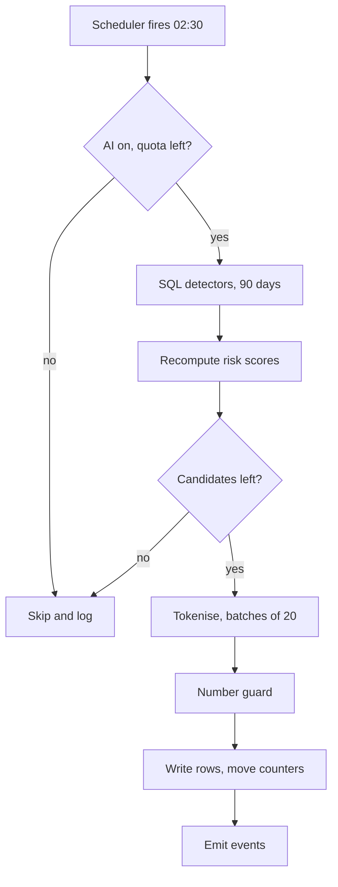
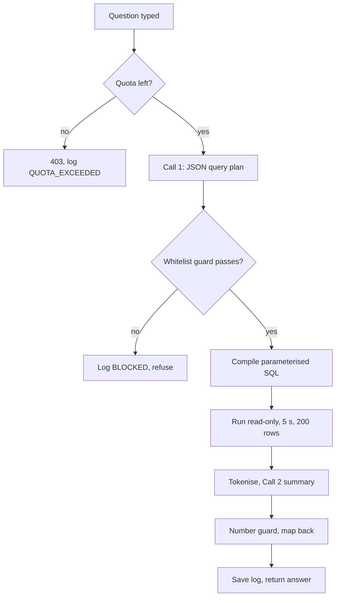
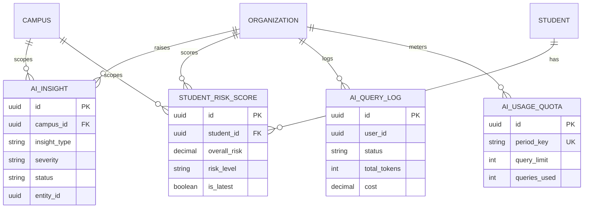

# AI Insights Module

**In simple words:** AI Insights watches the data EduFlow already holds and says what needs attention today: which students are slipping away, which families may miss the next fee, where a discount looks wrong. It also lets a user ask in plain English ("how much fee is pending in Class 10?") and get an answer built from the organization's own rows. Every number comes from SQL the server writes; the Claude API only explains, and a human always decides what to do.

| Item | Value |
|---|---|
| Module code | AI |
| Release phase | Phase 4 (V2.0), built Jul to Sep 2027 |
| Plans | Growth and Pro: paid add-on ₹1,499/mo. Enterprise: included. Starter: not available |
| Main users | Organization Admin, Principal, Accountant, Teacher (own batches) |
| Depends on | Attendance, Fees, Payments, Exams, Report Cards, Analytics, Notifications, Settings |
| Main tables | `ai_insights`, `student_risk_scores`, `ai_query_logs`, `ai_usage_quotas` |
| Endpoints | AI-API-01 to AI-API-20; Blueprint prompt P-48 |

## Objective

Rajesh Sharma already has 43 reports from the *Analytics Module*, but a report only answers the question you thought of. A student stops coming for nine days and nobody notices until the parent calls. Goals:

1. **Find it first.** A band that rises to HIGH raises an insight the same night (AI-BR-05).
2. **Always explain why.** Every score carries its factors and numbers (AI-BR-03). No black box.
3. **Never invent a number.** Figures come from SQL; an unmatched figure is stripped (AI-BR-14).
4. **Answer in 8 seconds** at p95, summary plus table.
5. **Keep children safe.** No name, phone or admission number leaves the server (AI-BR-12), and nothing reaches a parent without a staff member pressing a button (AI-BR-13).
6. **Stay profitable.** Plan quotas hold the add-on above 70% gross margin (AI-BR-19).

## Scope

### In scope

- An insight feed with severity, status, evidence and a suggested action (AI-API-01 to 09).
- Risk scores for dropout, fee default and academic decline, with factors and history (AI-API-10 to 13).
- The "Ask EduFlow" assistant over whitelisted read-only views (AI-API-14 to 18).
- Monthly usage and cost quotas per organization (AI-API-19, 20).
- Draft report-card remarks, as a service to the *Report Cards Module* (AI-BR-16), the best-hour reminder insight used by the *Fees Module* scheduler (AI-BR-17), and the weekly owner digest delivered by the *Notifications Module* (AI-BR-18). None of the three has an endpoint of its own.

### Out of scope

- Ready reports, the report builder and scheduled emails: *Analytics Module*.
- Sending a message to a parent: *Notifications Module*, *WhatsApp Module*.
- Any automatic action on money, marks or attendance. The AI writes into no other module's tables.
- A chat that remembers earlier turns. Each question is independent in V2.0.
- Training or fine-tuning a model on customer data (AI-BR-11); file upload, voice input, image reading.

### Phase notes

- **Phase 4 (V2.0), Jul to Sep 2027:** all 20 endpoints, all detectors, the assistant, quotas.
- **Phase 4.1 (Oct 2027):** Hindi questions and summaries; a fourth risk kind for staff attrition.
- **Not planned:** a model trained per tenant. Good rules plus a good explainer beat it.

> **Founder note:** Ship the risk scores first. They are pure SQL and work with no Claude call, so the module still helps when the API is down (AI-BR-15).

## User Stories

| ID | As a | I want to | So that | Priority |
|---|---|---|---|---|
| AI-US-01 | Principal | see which students got riskier this week | I call the parents before the student leaves | Must |
| AI-US-02 | Principal | see the numbers behind a risk score | I trust it and can explain it to a parent | Must |
| AI-US-03 | Teacher | see only my own batch students | I am not shown children I do not teach | Must |
| AI-US-04 | Accountant | know which families may miss the next fee | I call them before the due date | Must |
| AI-US-05 | Accountant | know the best hour to send reminders | more parents pay after one message | Should |
| AI-US-06 | Organization Admin | be alerted on an unusual discount or undeposited cash | I catch mistakes and misuse early | Must |
| AI-US-07 | Accountant | ask "how much fee is pending in Class 10?" | I do not have to build a report | Must |
| AI-US-08 | Teacher | get a draft remark for a report card | 40 remarks take 20 minutes, not 2 hours | Should |
| AI-US-09 | Organization Admin | get one digest email every Monday | I know my institute without opening the app | Should |
| AI-US-10 | Organization Admin | see our AI questions and cost | I know if the add-on is worth ₹1,499 | Must |
| AI-US-11 | Organization Admin | mark an insight acted or dismissed | the feed stays short and the engine learns | Must |
| AI-US-12 | Organization Admin | switch the AI off for the organization | I can stop it if my board says no | Must |
| AI-US-13 | Principal | export the at-risk list to Excel | I hand it to class teachers in a meeting | Should |
| AI-US-14 | Organization Admin | know no child's name reaches the provider | I stay inside the DPDP Act 2023 | Must |

## Workflow

### How the nightly insight run works

**Figure: Nightly insight run for one campus**



1. **Trigger and gate.** The repeatable job `ai-insight-scheduler` runs every 30 minutes and queues one `ai-insight-run` per campus whose local hour matches `ai.insightRunHour`; AI-API-09 queues it on demand. The worker checks `ai.enabled`, the plan and the current `AiUsageQuota` row.
2. **Detect and score.** Ten SQL detectors read at most 90 days of rows and never call the model. Score rows are recomputed for every active student; the previous row gets `isLatest = false`.
3. **Candidates.** Each hit carries `insightType`, `severity`, `entityType`, `entityId`, `evidence` and `confidence`. A repeat of an open insight is dropped (AI-BR-06).
4. **Explain and guard.** Candidates are tokenised and sent in batches of 20; the model returns `title`, `explanation` and `suggestedAction` per id. Every number in that text must exist in the candidate's `evidence`, else the template sentence is used.
5. **Write and notify.** Rows are inserted with `status = NEW`, `modelVersion`, `generatedAt` and `validUntil`, the three counters move in the same transaction, and `ai.insight.generated` fires per row.

### How a plain-language question is answered

**Figure: Ask EduFlow question flow**



1. The client posts the question to AI-API-15 with the active campus; the quota check runs first (AI-BR-20).
2. **Call 1** sends the question, the caller's role and the catalogue of views that role may read (column names and types only, no rows). It returns a JSON plan, never SQL. The guard then checks the view, every column, every operator and `limit` at most 200.
3. The server compiles the plan into a parameterised query, adds `organization_id` and the campus filter, and runs it as the read-only role `eduflow_ai_ro` with `statement_timeout = 5s`.
4. Rows are tokenised; at most 30 go into **Call 2**, which writes two to four sentences. The number guard checks every figure, then tokens map back to names for display only.
5. `AiQueryLog` stores the question, plan, summary, tokens, cost and latency.

### Status lifecycles

| Status | Meaning | Set by | Next allowed |
|---|---|---|---|
| `NEW` | Just generated, nobody opened it | Insight worker | `SEEN`, `DISMISSED` |
| `SEEN` | A user opened or bulk-marked it | AI-API-04, 08 | `ACTED`, `DISMISSED` |
| `ACTED` | A user did something and wrote what | AI-API-05 | Final |
| `DISMISSED` | A user rejected it with a reason | AI-API-06 | Final |

A row whose `validUntil` has passed is hidden from AI-API-01 but is kept for the accuracy report (AI-BR-07).

`AiQueryStatus` has four values: `SUCCESS` (summary produced), `FAILED` (model or database error after the first call), `BLOCKED` (plan broke the whitelist or the role scope) and `QUOTA_EXCEEDED` (limit reached, no call made). AI-BR-20 says which cost a query and which cost tokens.

| Risk band | `overallRisk` | Colour in UI | What staff should do |
|---|---|---|---|
| `LOW` | 0.00 to 29.99 | Green | Nothing |
| `MEDIUM` | 30.00 to 54.99 | Amber | Class teacher watches for two weeks |
| `HIGH` | 55.00 to 74.99 | Orange | Call the parent within 3 working days |
| `CRITICAL` | 75.00 to 100.00 | Red | Principal calls the same day, meeting in a week |

## Screens and Wireframes

| ID | Screen | Users | Purpose |
|---|---|---|---|
| AI-S01 | Insight feed | Org Admin, Principal, Accountant, Teacher | Cards by severity, act and dismiss |
| AI-S02 | Insight detail | Same as AI-S01 | Explanation, evidence chart, action |
| AI-S03 | At-risk students | Org Admin, Principal, Teacher | Ranked list with factors, export |
| AI-S04 | Student risk detail | Org Admin, Principal, Teacher | Score history and factor bars |
| AI-S05 | Ask EduFlow | Org Admin, Principal, Accountant, Teacher | Question box, summary, table |
| AI-S06 | AI usage and quota | Org Admin | Questions, tokens, cost, limits |
| AI-S07 | AI settings | Org Admin | Enable, consent, thresholds, roles |
| AI-S08 | My batch alerts (mobile) | Teacher | Own batch insights and risk list |

**Screen AI-S01 — Insight feed (Organization Admin, web)**

```text
+--------------------------------------------------------------------------+
| EduFlow | Bright Future Public School    [Search...]          (RS) v     |
+------------+-------------------------------------------------------------+
| Dashboard  | AI Insights > Feed       Last run 22 Sep 2027 02:34 IST     |
| Students   +-------------------------------------------------------------+
| Attendance | Campus [Main Campus v]  Type [All v]  Severity [All v]      |
| Fees       | Status [New + Seen v]                          [Run now]    |
| Analytics  |-------------------------------------------------------------|
| AI       < | (!) CRITICAL  Discount anomaly  Receipt RC-2027-0881        |
|  Feed      |     Rs 27,500 given, slab allows Rs 2,500, by Suresh Gupta  |
|  At risk   |     Do this: open the receipt and check the approval note   |
|  Ask       |     [Open] [Mark seen] [Acted] [Dismiss]  Helpful? [y] [n]  |
|  Usage     |-------------------------------------------------------------|
| Settings   | (!) HIGH      Dropout risk    Aarav Sharma 10-A   2 h ago   |
|            |     Attendance fell 86% to 58% in 30 days; fee 38 days late |
|            |     Do this: Principal calls Sunita Devi today              |
|            |     [Open] [Mark seen] [Acted] [Dismiss]  Helpful? [y] [n]  |
|            |-------------------------------------------------------------|
|            | ( ) MEDIUM    Attendance drop   Batch 9-C        yesterday  |
|            |     7-day average 71%, 60-day average 84%, 31 students      |
|            |     [Open] [Mark seen] [Acted] [Dismiss]  Helpful? [y] [n]  |
|            |-------------------------------------------------------------|
|            | Showing 3 of 14   [x] Hide dismissed        [Load more]     |
+------------+-------------------------------------------------------------+
```

- One card per insight, most severe and newest first; the filters call AI-API-01, the counts AI-API-03, and `[Run now]` calls AI-API-09 (disabled during a run or at quota end).
- `[Mark seen]` calls AI-API-04, `[Acted]` opens a note box and calls AI-API-05, `[Dismiss]` asks for a reason and calls AI-API-06, `Helpful?` calls AI-API-07.

**Screen AI-S03 — At-risk students (Principal, web)**

```text
+--------------------------------------------------------------------------+
| EduFlow | Bright Future Public School    [Search...]          (AV) v     |
+------------+-------------------------------------------------------------+
| Dashboard  | AI Insights > At-risk students  Computed 22 Sep 02:41 IST   |
| Students   +-------------------------------------------------------------+
| Attendance | Batch [All v]  Risk [High + Critical v]  Kind [Overall v]   |
| Fees       | Rows 26                       [Recompute]  [Export XLSX]    |
| Analytics  |-------------------------------------------------------------|
| AI       < | Student           Batch  Drop  Fee  Acad  Overall  Band     |
|  Feed      |-------------------------------------------------------------|
|  At risk < | Aarav Sharma      10-A   74.8  55.1  57.6   64.6   HIGH     |
|  Ask       |   Top: attendance -28 pts, fee 38 days late, marks -17 pts  |
|  Usage     | Neha Verma        10-A   69.2  41.0  62.4   59.2   HIGH     |
| Settings   |   Top: marks -21 pts, homework 5 of 16, attendance 68%      |
|            | Imran Qureshi      9-C   66.5  72.3  38.9   59.5   HIGH     |
|            |   Top: fee 61 days late, 4 reminders, attendance 73%        |
|            | Kavya Iyer        10-B   58.0  33.4  55.2   50.4   MEDIUM   |
|            |   Top: marks -12 pts, 3 absent days in a row                |
|            |-------------------------------------------------------------|
|            | Legend: Drop = dropout, Fee = fee default, Acad = academic  |
|            | [< Prev]   Page 1 of 2                        [Next >]      |
+------------+-------------------------------------------------------------+
```

- The list comes from AI-API-10 sorted by `overallRisk` descending, with the three top factors per row; a name opens AI-S04, which calls AI-API-11.
- `[Recompute]` calls AI-API-12; `[Export XLSX]` calls AI-API-13 and needs `ai.export`, so a Teacher does not see it.

**Screen AI-S05 — Ask EduFlow (Accountant, web)**

```text
+--------------------------------------------------------------------------+
| EduFlow | Bright Future Public School    [Search...]          (SG) v     |
+------------+-------------------------------------------------------------+
| Dashboard  | AI Insights > Ask EduFlow         38 of 300 questions used  |
| Students   +-------------------------------------------------------------+
| Attendance | Ask about your own data. No personal detail leaves EduFlow. |
| Fees       | [How much fee is pending in Class 10 right now?___________] |
| Analytics  |                                        [Clear]  [Ask]       |
| AI       < |-------------------------------------------------------------|
|  Feed      | Try: "Which batches are below 75% attendance this month?"   |
|  At risk   |      "Top 10 students by pending fee in Class 9"            |
|  Ask     < |      "How much cash did we collect last week?"              |
|  Usage     |-------------------------------------------------------------|
| Settings   | Answer (2.6 s, 4 rows, cost Rs 0.98)                        |
|            | Class 10 has Rs 6,30,000 pending across 4 sections. Section |
|            | 10-A owes the most at Rs 1,83,000. Rs 9,000 is more than 90 |
|            | days old, all of it in 10-B and 10-D.                       |
|            |-------------------------------------------------------------|
|            | Batch   Students  Pending      Over 90 days                 |
|            | 10-A          42  Rs 1,83,000  Rs 0                         |
|            | 10-B          40  Rs 1,62,000  Rs 3,000                     |
|            | 10-C          38  Rs 1,35,000  Rs 0                         |
|            | 10-D          41  Rs 1,50,000  Rs 6,000                     |
|            | [Copy table] [Open in Analytics]  Helpful? [1][2][3][4][5]  |
+------------+-------------------------------------------------------------+
```

- The box calls AI-API-15, the sample questions AI-API-17 (by role), the quota counter AI-API-20 (amber at 80%).
- `Helpful?` calls AI-API-18; `[Open in Analytics]` hands the same filter to the *Analytics Module*. A blocked plan shows a plain refusal and no table.

**Screen AI-S08 — My batch alerts (Teacher, mobile)**

```text
+------------------------------------+
| EduFlow             (PN) v         |
+------------------------------------+
| My batch alerts          10-A v    |
+------------------------------------+
| HIGH                               |
| Aarav Sharma                       |
| Attendance 86% to 58% in 30 days.  |
| Marks down 17 points.              |
| Do this: inform the Principal.     |
| [Seen]   [Acted]   [Dismiss]       |
+------------------------------------+
| HIGH                               |
| Neha Verma                         |
| Homework 5 of 16 submitted.        |
| Marks down 21 points.              |
| Do this: meet her after class.     |
| [Seen]   [Acted]   [Dismiss]       |
+------------------------------------+
| At-risk in my batches          4   |
| [See the full list >]              |
+------------------------------------+
| Feed   Batches   Marks   Profile   |
+------------------------------------+
```

- She sees only insights whose `entityId` is a student of her own batches (AI-BR-09); `[Seen]` calls AI-API-04, `[Acted]` AI-API-05, `[Dismiss]` AI-API-06 with a reason picker.
- `[See the full list >]` opens AI-S03 through AI-API-10. There is no export and no run button, because a Teacher holds neither `ai.export` nor `ai.manage`.

## UI Components

| Component | Type | Behaviour |
|---|---|---|
| `InsightCard` | Card | Severity stripe, title, explanation, action row; collapses after ACTED |
| `SeverityBadge` | Badge | INFO grey, LOW blue, MEDIUM amber, HIGH orange, CRITICAL red |
| `EvidenceChart` | Chart | Sparkline or bar from `evidence`; falls back to a table |
| `FactorBar` | Progress bar | One bar per factor, width = weight, tooltip with value and direction |
| `AskBox` | Textarea | 400 characters, counter, Ctrl+Enter submits, off at quota end |
| `QuotaMeter` | Meter | Used against limit, amber at 80%, red at 100%, reset date in tooltip |
| `DismissDialog` | Dialog | Reason picker plus free text, 255 characters, required |
| `AiDisabledState` | Empty state | Shown when AI is off or unbought, with an upgrade link |

List states: **loading** (three skeleton cards), **empty** ("No open insights. Good news."), **error** (retry plus `requestId`), **stale** (grey banner when the last run is older than 36 hours).

## Validation Rules

| Field | Rule | Error message shown to user |
|---|---|---|
| `question` | 8 to 400 characters after trim | "Write a question between 8 and 400 characters." |
| `question` | No database command such as `drop table` | "Please ask in plain language, not in database commands." |
| `actionTaken` | AI-API-05, 3 to 500 characters | "Write in one line what you did." |
| `dismissReason` | AI-API-06, 3 to 255 characters | "Tell us why you are dismissing this insight." |
| `feedbackRating` | Whole number 1 to 5 | "Rating must be between 1 and 5." |
| `insightIds` | AI-API-08, 1 to 200 UUIDs, no duplicates | "Select between 1 and 200 insights." |
| `campusId` | A campus the caller is assigned to | "You do not have access to this campus." |
| `batchId` | AI-API-12, inside the chosen campus | "This batch is not in the selected campus." |
| `riskLevel` | LOW, MEDIUM, HIGH or CRITICAL | "Choose a valid risk level." |
| `from`, `to` | AI-API-19, ordered, at most 24 months | "Choose a period of 24 months or less." |
| `scope` | AI-API-14, `all` needs `ai.manage` | "Only an admin can see everyone's questions." |

## Business Rules

**AI-BR-01 Plan and consent gate.** Every endpoint checks three things first: AI is in the plan (Enterprise) or the add-on is active (Growth, Pro); `ai.enabled` is true; `ai.dataProcessingConsent` was accepted by an Organization Admin. A plan failure answers `403 PLAN_LIMIT_REACHED`, missing consent `422 BUSINESS_RULE_VIOLATION`. Starter always fails the first check.

**AI-BR-02 Risk score formula.** The three sub-scores come from SQL only. Each factor is normalised to 0 to 100, where 100 is worst, then multiplied by its fixed weight. Weights inside a sub-score add up to 100.

```typescript
// server/src/modules/ai/risk/weights.ts
export const clamp = (n: number): number => Math.min(100, Math.max(0, n));

export const RISK_WEIGHTS = {
  dropout: {
    attendance_30d: 35,          // clamp((85 - pct) * 2.5)
    attendance_drop: 20,         // min(100, dropPoints * 4)
    consecutive_absent: 15,      // min(100, longestRun * 15)
    fee_overdue_days: 10,        // min(100, days * 1.5)
    marks_trend: 10,             // min(100, dropPoints * 5)
    homework_submission: 5,      // 100 - submittedPct
    parent_engagement: 5,        // 0 logins 100, 1 -> 60, 2 -> 30, 3+ -> 0
  },
  feeDefault: {
    late_payment_history: 30,    // lateInvoices / last6 * 100
    current_overdue_days: 25,    // min(100, days * 1.5)
    overdue_amount_ratio: 20,    // min(100, overdue / annualFee * 200)
    partial_payment_pattern: 10, // partialInvoices / last6 * 100
    reminder_no_response: 10,    // min(100, reminders * 25)
    sibling_default: 5,          // sibling overdue 30 days or more ? 100 : 0
  },
  academic: {
    marks_percent_latest: 30,    // clamp((75 - pct) * 2)
    marks_trend: 25,             // min(100, dropPoints * 5)
    subject_failures: 20,        // min(100, failedSubjects * 40)
    homework_submission: 15,     // 100 - submittedPct
    attendance_30d: 10,          // clamp((85 - pct) * 2.5)
  },
} as const;

// overallRisk, rounded to 2 decimals
export const BLEND = { dropout: 0.45, feeDefault: 0.3, academic: 0.25 } as const;
```

> **Example:** Aarav Sharma, 10-A, run of 22 Sep 2027. Attendance 58% against 86% before; absent run 4 days; INV-0912 is 38 days late; overdue ₹12,000 of ₹48,000 annual fee; marks 71% to 54%; 1 of 6 subjects failed; homework 6 of 15; 0 parent logins; 4 of 6 invoices paid late; 2 of 6 in parts; 3 reminders unanswered; no sibling.
>
> Dropout = 0.35(67.5) + 0.20(100) + 0.15(60) + 0.10(57) + 0.10(85) + 0.05(60) + 0.05(100) = **74.83**.
> Fee default = 0.30(66.67) + 0.25(57) + 0.20(50) + 0.10(33.33) + 0.10(75) + 0.05(0) = **55.08**.
> Academic = 0.30(42) + 0.25(85) + 0.20(40) + 0.15(60) + 0.10(67.5) = **57.60**.
> Overall = 0.45(74.83) + 0.30(55.08) + 0.25(57.60) = 33.67 + 16.52 + 14.40 = **64.60**, band HIGH.

**AI-BR-03 Every score is explainable.** `factors` stores one object per factor that scored above 0, shaped `{ "factor": "attendance_30d", "weight": 35, "value": 58, "unit": "percent", "score": 67.5, "direction": "down" }`. The UI shows the top three by `weight * score`. A score row without factors fails the nightly self-check.

**AI-BR-04 Bands.** `riskLevel` comes from `overallRisk` using the band table in Workflow. The cut-offs are the settings `ai.riskThresholdHigh` (default 55) and `ai.riskThresholdCritical` (default 75). An organization may raise them but never lower HIGH below 40.

**AI-BR-05 Detector triggers.** A detector fires only when its rule and its minimum sample size are both met.

| Detector | Insight type | Rule | Minimum sample |
|---|---|---|---|
| Batch attendance drop | `ATTENDANCE_DROP` | 7-day average 8 points below the 60-day average | 10 students, 20 days |
| Student dropout risk | `DROPOUT_RISK` | Band HIGH or above and the band rose since the last run | 30 days of history |
| Fee default risk | `FEE_DEFAULT_RISK` | `feeDefaultRisk` 60 or above, open invoice 15 days late | 2 past invoices |
| Subject decline | `ACADEMIC_DECLINE` | Average fell 10 points for 3 or more students in a subject | 2 graded exams |
| Admission trend | `ADMISSION_TREND` | Inquiries in 14 days differ 25% from the same period last year | 20 inquiries last year |
| Collection forecast | `COLLECTION_FORECAST` | Projected month-end collection below 80% of billed | 3 months of history |
| Staff workload | `STAFF_WORKLOAD` | Weekly periods 1.3 times the campus median, two weeks | 5 teachers |
| Discount anomaly | `ANOMALY` | ₹2,500 above the approved slab, or above the 90-day 95th percentile | 40 discounts |
| Cash handling anomaly | `ANOMALY` | Cash undeposited 48 hours, or a receipt cancelled after deposit | None |
| Best reminder hour | `OTHER` | Best hour slot beats the current slot by 5 points | 150 messages per slot |

**AI-BR-06 No duplicates, and insights go stale.** A candidate is dropped when an `AiInsight` already exists with the same `organizationId`, `insightType`, `entityType`, `entityId` and status `NEW` or `SEEN`. `validUntil` is `generatedAt` plus 7 days for risk and anomaly types, 30 days for trend and forecast types. AI-API-01 hides expired rows; they stay for the accuracy report.

**AI-BR-07 Accuracy is measured.** A monthly job compares insights older than 60 days with what happened: a `DROPOUT_RISK` insight is correct if the student left or attendance stayed below 70% for 30 more days. Precision per detector and the `wasHelpful` share go into the platform metrics. A detector below 55% precision for two months is switched off by EduFlow, not by the tenant.

**AI-BR-08 Severity mapping.** `CRITICAL` for band CRITICAL, money above ₹25,000, or cash undeposited over 72 hours. `HIGH` for band HIGH, ₹10,000 to ₹25,000, or 48 to 72 hours. `MEDIUM` for band MEDIUM, below ₹10,000, or a trend change of 25% to 40%. `LOW` and `INFO` for the rest. Severity never depends on the model.

**AI-BR-09 The feed never widens access.** An insight is visible only if the caller may already see its subject. A Teacher sees a `Student` insight only for her own batches, and no `STAFF_WORKLOAD` or `ANOMALY` row. An Accountant sees no `ACADEMIC_DECLINE` row, because she holds no `exams.view`.

**AI-BR-10 The model never writes SQL.** AI-API-15 accepts only a JSON query plan against one of eight read-only views.

| View | One row is | Needs source permission |
|---|---|---|
| `v_ai_students` | Active student with batch, course, join date | `students.view` |
| `v_ai_attendance_daily` | One student on one day | `attendance.view` |
| `v_ai_fee_invoices` | Invoice with billed, paid, due date, overdue days | `fees.view` |
| `v_ai_payments` | Receipt line with method, amount, date | `payments.view` |
| `v_ai_exam_marks` | Student in one subject of one exam | `exams.view` |
| `v_ai_batches` | Batch with strength and class teacher | `batches.view` |
| `v_ai_admissions` | Inquiry with stage, source, counsellor | `admissions.view` |
| `v_ai_communication` | Sent message with channel, status, cost | `notifications.view` |

Every view carries `organization_id` and `campus_id`, is granted to the read-only role `eduflow_ai_ro`, and holds no phone number, email, address, date of birth, guardian name or document link. A plan may use the operators `eq`, `neq`, `in`, `gt`, `gte`, `lt`, `lte`, `between`, `is_null`, `is_not_null`, the aggregations `count`, `sum`, `avg`, `min`, `max`, at most two `groupBy` fields, and `limit` at most 200. Anything else is `BLOCKED`.

**AI-BR-11 No training on customer data.** EduFlow calls the Claude API under Anthropic commercial terms with zero data retention. Customer data is never used to train or fine-tune a model, never kept after the request, never mixed between tenants. The same sentence appears in the privacy notice and on AI-S07.

**AI-BR-12 PII minimisation.** Before a prompt leaves the server the redactor tokenises people: students `S1`, `S2`, staff `T1`, `T2`, guardians `G1`. Batch labels such as "10-A", amounts, dates, percentages and counts stay, because alone they identify nobody. Admission numbers, phones, emails, addresses, dates of birth and free-text staff notes are removed. `metadata.user_id` is a salted SHA-256 hash. The token map lives in memory for one request and never reaches `ai_query_logs`. `ai.minorNameRedaction` is true by default and cannot be switched off for an Indian organization, because the DPDP Act 2023 treats every student under 18 as a child.

**AI-BR-13 Human in the loop.** The AI never sends a message, changes a mark, waives a fee or blocks a login. It suggests; a person acts in the owning module. A parent or student never sees AI output in V2.0.

**AI-BR-14 Number guard.** The guard pulls every number out of the summary, normalises it (drops ₹, commas, lakh, percent) and requires a match in the result rows, a server-computed total, or the row count. One unmatched number drops the whole summary and only the table is shown. The row keeps status `SUCCESS` with `errorMessage = "number_guard_failed"`, so the rate shows in the weekly quality report.

**AI-BR-15 Graceful failure.** On a Claude API timeout (8 seconds) or error the worker retries twice with backoff, then writes the insight anyway with a template sentence built from the evidence, for example "Attendance of batch 9-C fell from 84% to 71% in the last 7 days.", and `modelVersion` gains the suffix `+template`. A question instead answers `503 SERVICE_UNAVAILABLE` and logs `FAILED`. Scores are never affected; they need no model.

**AI-BR-16 Report-card remarks are drafts.** The *Report Cards Module* calls `aiRemarkService.draft(reportCardId)`, which sends only tokenised marks, grade, attendance percent and subject names and asks for two sentences of at most 200 characters. The draft lands in that module's `remarksDraft` field; the teacher must accept or edit it and save, and an unapproved draft never prints. Each draft costs 1 query.

**AI-BR-17 Best hour for fee reminders.** For each two-hour slot the engine counts reminders sent in the last 90 days and how many of those invoices were paid within 48 hours. A slot with fewer than 150 messages is ignored.

> **Example:** Bright Future Public School, last 90 days. 09:00 to 10:59: 412 sent, 149 paid, 36.2%. 11:00 to 12:59 (current slot): 508 sent, 168 paid, 33.1%. 17:00 to 18:59: 466 sent, 201 paid, 43.1%. 19:00 to 20:59: 390 sent, 182 paid, 46.7%. The best slot beats the current one by 13.6 points, above the 5-point rule, so an `OTHER` insight is raised. The Accountant approves the change in the *Fees Module*; the AI does not touch the schedule.

**AI-BR-18 Weekly owner digest.** Every Monday at 07:00 in the organization timezone one job per organization collects the week's insights, how many students moved to a higher band, collection against target, and the top three anomalies. One Claude call turns this into six short lines, which the *Notifications Module* delivers by Email and In-app to every user holding `ai.manage`. It costs 1 query.

**AI-BR-19 Cost model and quotas.** Claude API prices are a planning assumption of September 2026 and must be re-checked before launch: fast model $0.80 per million input and $4.00 per million output tokens; main model $3.00 and $15.00; cached input is billed at 10% of the input price. Planning rate US$1 = ₹85.

Call 1 (fast model) reads 3,200 cached plus 400 fresh input tokens and writes 200, costing $0.0014. Call 2 (main model) reads 1,200 cached plus 1,500 fresh and writes 350, costing $0.0101. One question is therefore $0.0115, which is ₹0.98. One nightly run makes at most three calls of 20 candidates and costs $0.0432, which is ₹3.67.

| Plan | Questions per month | Tokens per month | Insight runs per month |
|---|---|---|---|
| Starter | 0 | 0 | 0 |
| Growth with add-on | 300 | 2,000,000 | 40 |
| Pro with add-on | 1,000 | 6,000,000 | 120 |
| Enterprise | Unlimited, fair use 5,000 | Unlimited | Unlimited, fair use 200 |

> **Example:** A Growth tenant using the whole allowance spends 300 × ₹0.98 + 40 × ₹3.67 = ₹441 against ₹1,499 revenue, a gross margin of 71%. The pilot average of 66 questions and 30 runs costs ₹175, a margin of 88%. Without the quota one heavy tenant alone could spend more than ₹1,499.

**AI-BR-20 Quota counting.** `queriesUsed` rises by 1 for `SUCCESS` and `FAILED`, never for `BLOCKED` or `QUOTA_EXCEEDED`. `tokensUsed` and `costAccrued` rise whenever a call really ran, a blocked plan included. `insightRunsUsed` rises once per completed run. All counters move with `increment` inside the transaction that writes the log row, so two questions in one second cannot both slip past. At 80% `ai.quota.threshold_reached` fires once per period; at 100% `limitReachedAt` is stamped and `ai.quota.exhausted` fires. Counters reset with the next `periodKey` row; unused allowance never carries over.

## Acceptance Criteria

| ID | Given / When / Then |
|---|---|
| AI-AC-01 | Given a Starter organization, when any AI endpoint is called, then `403 PLAN_LIMIT_REACHED` and no Claude call runs |
| AI-AC-02 | Given consent is not accepted, when AI-API-15 is called, then `422 BUSINESS_RULE_VIOLATION`, code `AI_CONSENT_REQUIRED` |
| AI-AC-03 | Given Aarav's inputs in AI-BR-02, when the run ends, then `overallRisk` is 64.60 and `riskLevel` is HIGH |
| AI-AC-04 | Given a new score row, when it is written, then exactly one row per student has `isLatest = true` |
| AI-AC-05 | Given a band rise from MEDIUM to HIGH, when the run ends, then one `DROPOUT_RISK` insight exists and `ai.student.risk_level_changed` fired |
| AI-AC-06 | Given an open insight of the same type and entity, when the next run repeats it, then no second row is created |
| AI-AC-07 | Given a Teacher, when AI-API-01 runs, then only her own batch students appear and no `ANOMALY` row does |
| AI-AC-08 | Given AI-API-05 with `actionTaken`, when it succeeds, then status is `ACTED` and `actedAt` and `handledById` are set |
| AI-AC-09 | Given an Accountant asks about salaries, when AI-API-15 runs, then status is `BLOCKED` and `queriesUsed` is unchanged |
| AI-AC-10 | Given a prompt about to be sent, when it is inspected, then it holds no name, phone, email or admission number |
| AI-AC-11 | Given a summary figure that is in no row, when the guard runs, then the summary is dropped and only the table shows |
| AI-AC-12 | Given `queriesUsed` equals `queryLimit`, when AI-API-15 runs, then `403 PLAN_LIMIT_REACHED` and a `QUOTA_EXCEEDED` row |
| AI-AC-13 | Given the Claude API is down, when the nightly run executes, then scores are written and `modelVersion` ends `+template` |
| AI-AC-14 | Given a Sharma Classes user opens a Bright Future insight id, when AI-API-02 runs, then `404 NOT_FOUND` |

## Edge Cases

| Case | What happens | How the system handles it |
|---|---|---|
| Student joined 9 days ago | Too little history for a fair score | No score row until 30 days of data exist |
| Attendance not marked for a week | Factors would read the gap as absent | Days with no `AttendanceRecord` are excluded |
| Exam results not published | `marks_trend` has no value | Academic factors drop out; remaining weights rescale to 100 |
| Student on approved long leave | Risk would jump wrongly | Leave days leave `attendance_30d` and the absent run |
| Two questions at the last free slot | Both could pass the quota check | `increment` inside the transaction; the second gets `403` |
| Claude returns invalid plan JSON | Nothing to execute | One stricter retry, then `FAILED` and `503` |
| Plan names a view the caller cannot read | Data leak risk | Guard rejects it, `BLOCKED`, answer names the missing module |
| Plan would return 12,000 rows | Slow and useless | `limit` forced to 200; answer says "first 200 of 12,000" |
| Student erased under a DPDP request | Scores and insights hold the id | The erase job deletes those rows and blanks `userId` in logs |

## Database Schema

| Table | Purpose |
|---|---|
| `ai_insights` | One finding with explanation, evidence, suggested action and handling status |
| `student_risk_scores` | Score history per student; `isLatest` marks the current row |
| `ai_query_logs` | Append-only log of every plain-language question, its plan, cost and result |
| `ai_usage_quotas` | One row per organization per calendar month with limits and counters |

All four tables carry `created_at timestamptz NOT NULL DEFAULT now()`, and all but the append-only `ai_query_logs` also carry `updated_at` (Prisma `@updatedAt`). Those columns are left out of the tables below.

### Table ai_insights

| Column | Type | Null | Default | Notes |
|---|---|---|---|---|
| `id` | uuid | No | `uuid()` | PK |
| `organization_id` | uuid | No | | FK `organizations` |
| `campus_id` | uuid | Yes | | FK `campuses`; null = org level |
| `insight_type` | `AiInsightType` | No | | Nine values |
| `severity` | `AiInsightSeverity` | No | `INFO` | AI-BR-08 |
| `title` | varchar(200) | No | | Model or template |
| `explanation` | text | No | | Why it was raised |
| `suggested_action` | text | Yes | | One next step |
| `entity_type` | varchar(60) | Yes | | `Student`, `Batch`, `Campus` |
| `entity_id` | uuid | Yes | | No FK, see below |
| `evidence` | jsonb | Yes | | Numbers behind it |
| `confidence` | decimal(4,3) | Yes | | 0.000 to 1.000 |
| `status` | `AiInsightStatus` | No | `NEW` | Lifecycle table |
| `model_version` | varchar(60) | No | | `insight-3.0` |
| `generated_at` | timestamptz | No | `now()` | Run time |
| `valid_until` | timestamptz | Yes | | AI-BR-06 |
| `seen_at` | timestamptz | Yes | | AI-API-04, 08 |
| `acted_at` | timestamptz | Yes | | AI-API-05 |
| `action_taken` | varchar(500) | Yes | | What was done |
| `dismissed_at` | timestamptz | Yes | | AI-API-06 |
| `dismiss_reason` | varchar(255) | Yes | | Required |
| `handled_by_id` | uuid | Yes | | User id, no FK |
| `was_helpful` | boolean | Yes | | AI-API-07 |

### Table student_risk_scores

| Column | Type | Null | Default | Notes |
|---|---|---|---|---|
| `id` | uuid | No | `uuid()` | PK |
| `organization_id` | uuid | No | | FK `organizations` |
| `campus_id` | uuid | No | | FK `campuses` |
| `student_id` | uuid | No | | FK `students` |
| `academic_year_id` | uuid | Yes | | FK, set null |
| `dropout_risk` | decimal(5,2) | No | | 0 to 100 |
| `fee_default_risk` | decimal(5,2) | No | | 0 to 100 |
| `academic_risk` | decimal(5,2) | No | | 0 to 100 |
| `overall_risk` | decimal(5,2) | No | | AI-BR-02 blend |
| `risk_level` | `RiskLevel` | No | | Band |
| `factors` | jsonb | No | | AI-BR-03 array |
| `model_version` | varchar(60) | No | | `risk-2.1` |
| `is_latest` | boolean | No | `true` | One per student |
| `computed_at` | timestamptz | No | `now()` | Run time |

### Table ai_query_logs

| Column | Type | Null | Default | Notes |
|---|---|---|---|---|
| `id` | uuid | No | `uuid()` | PK |
| `organization_id` | uuid | No | | FK `organizations` |
| `campus_id` | uuid | Yes | | Campus filter, no FK |
| `user_id` | uuid | Yes | | FK `users`, set null |
| `question` | text | No | | As typed |
| `query_plan` | jsonb | Yes | | Plan, never raw SQL |
| `summary` | text | Yes | | Answer shown |
| `result_row_count` | int | Yes | | Rows returned |
| `status` | `AiQueryStatus` | No | `SUCCESS` | Four values |
| `model_version` | varchar(60) | No | | Fast and main ids |
| `prompt_tokens` | int | No | `0` | Both calls |
| `completion_tokens` | int | No | `0` | Both calls |
| `total_tokens` | int | No | `0` | Quota counter |
| `cost` | decimal(12,4) | No | `0` | Fraction of a unit |
| `currency` | char(3) | No | `USD` | Provider currency |
| `latency_ms` | int | Yes | | End to end |
| `feedback_rating` | smallint | Yes | | AI-API-18, 1 to 5 |
| `error_message` | varchar(500) | Yes | | FAILED or BLOCKED |

### Table ai_usage_quotas

| Column | Type | Null | Default | Notes |
|---|---|---|---|---|
| `id` | uuid | No | `uuid()` | PK |
| `organization_id` | uuid | No | | FK `organizations` |
| `period_key` | varchar(7) | No | | `2027-09`, UK with org |
| `period_start` | date | No | | First day |
| `period_end` | date | No | | Last day |
| `query_limit` | int | Yes | | Null = unlimited |
| `queries_used` | int | No | `0` | AI-BR-20 |
| `token_limit` | int | Yes | | Null = unlimited |
| `tokens_used` | int | No | `0` | Calls that ran |
| `insight_runs_used` | int | No | `0` | One per run |
| `cost_accrued` | decimal(12,4) | No | `0` | Provider cost |
| `currency` | char(3) | No | `USD` | |
| `limit_reached_at` | timestamptz | Yes | | Stamped at 100% |

### Indexes and constraints

- `ai_insights`: `(organization_id, campus_id, status, severity)` for the feed, `(organization_id, insight_type, generated_at)` for the accuracy job, `(organization_id, entity_type, entity_id)` for AI-BR-06.
- `student_risk_scores`: `(organization_id, student_id, computed_at)` and `(organization_id, campus_id, is_latest, risk_level)`. `ai_query_logs`: `(organization_id, created_at)` and `(organization_id, user_id, created_at)`. `ai_usage_quotas`: unique `(organization_id, period_key)`.
- Row-Level Security is on for all four tables with the `app.current_org` policy of *Multi-Tenancy and Data Isolation*. Check constraints: risk columns 0 to 100, `feedback_rating` 1 to 5, counters not negative. One latest row is enforced by `CREATE UNIQUE INDEX ON student_risk_scores (organization_id, student_id) WHERE is_latest`.

**Figure: AI Insights tables and their neighbours**



`AI_INSIGHT.entity_id` has no foreign key on purpose: it may point at a student, batch, campus or payment, and the insight must survive a soft delete.

## Prisma Schema

```prisma
enum AiInsightType {
  ATTENDANCE_DROP
  DROPOUT_RISK
  FEE_DEFAULT_RISK
  ACADEMIC_DECLINE
  ADMISSION_TREND
  COLLECTION_FORECAST
  STAFF_WORKLOAD
  ANOMALY
  OTHER
}

enum AiInsightSeverity {
  INFO
  LOW
  MEDIUM
  HIGH
  CRITICAL
}

enum AiInsightStatus {
  NEW
  SEEN
  ACTED
  DISMISSED
}

enum RiskLevel {
  LOW
  MEDIUM
  HIGH
  CRITICAL
}

enum AiQueryStatus {
  SUCCESS
  FAILED
  BLOCKED // question outside the user's permissions or the allowed scope
  QUOTA_EXCEEDED
}

// Finding produced by the AI engine with a plain-language explanation and a suggested action.
model AiInsight {
  id              String            @id @default(uuid()) @db.Uuid
  organizationId  String            @map("organization_id") @db.Uuid
  campusId        String?           @map("campus_id") @db.Uuid // null = organization-level insight
  insightType     AiInsightType     @map("insight_type")
  severity        AiInsightSeverity @default(INFO)
  title           String            @db.VarChar(200)
  explanation     String            @db.Text // why the engine raised it, in simple words
  suggestedAction String?           @map("suggested_action") @db.Text
  entityType      String?           @map("entity_type") @db.VarChar(60) // model name the insight is about
  entityId        String?           @map("entity_id") @db.Uuid
  evidence        Json? // numbers and trends behind the insight
  confidence      Decimal?          @db.Decimal(4, 3) // 0.000 - 1.000
  status          AiInsightStatus   @default(NEW)
  modelVersion    String            @map("model_version") @db.VarChar(60)
  generatedAt     DateTime          @default(now()) @map("generated_at") @db.Timestamptz(6)
  validUntil      DateTime?         @map("valid_until") @db.Timestamptz(6) // stale insights are hidden
  seenAt          DateTime?         @map("seen_at") @db.Timestamptz(6)
  actedAt         DateTime?         @map("acted_at") @db.Timestamptz(6)
  actionTaken     String?           @map("action_taken") @db.VarChar(500)
  dismissedAt     DateTime?         @map("dismissed_at") @db.Timestamptz(6)
  dismissReason   String?           @map("dismiss_reason") @db.VarChar(255)
  handledById     String?           @map("handled_by_id") @db.Uuid // User id (audit only, no FK)
  wasHelpful      Boolean?          @map("was_helpful") // user feedback, used to tune the engine
  createdAt       DateTime          @default(now()) @map("created_at") @db.Timestamptz(6)
  updatedAt       DateTime          @updatedAt @map("updated_at") @db.Timestamptz(6)

  organization Organization @relation(fields: [organizationId], references: [id], onDelete: Cascade)
  campus       Campus?      @relation(fields: [campusId], references: [id], onDelete: Cascade)

  @@index([organizationId, campusId, status, severity])
  @@index([organizationId, insightType, generatedAt])
  @@index([organizationId, entityType, entityId])
  @@map("ai_insights")
}

// Risk scores of a student (0-100) with the contributing factors; isLatest marks the current row.
model StudentRiskScore {
  id             String    @id @default(uuid()) @db.Uuid
  organizationId String    @map("organization_id") @db.Uuid
  campusId       String    @map("campus_id") @db.Uuid
  studentId      String    @map("student_id") @db.Uuid
  academicYearId String?   @map("academic_year_id") @db.Uuid
  dropoutRisk    Decimal   @map("dropout_risk") @db.Decimal(5, 2)
  feeDefaultRisk Decimal   @map("fee_default_risk") @db.Decimal(5, 2)
  academicRisk   Decimal   @map("academic_risk") @db.Decimal(5, 2)
  overallRisk    Decimal   @map("overall_risk") @db.Decimal(5, 2)
  riskLevel      RiskLevel @map("risk_level") // band of overallRisk
  factors        Json // [{ factor, weight, value, direction }]
  modelVersion   String    @map("model_version") @db.VarChar(60)
  isLatest       Boolean   @default(true) @map("is_latest")
  computedAt     DateTime  @default(now()) @map("computed_at") @db.Timestamptz(6)
  createdAt      DateTime  @default(now()) @map("created_at") @db.Timestamptz(6)
  updatedAt      DateTime  @updatedAt @map("updated_at") @db.Timestamptz(6)

  organization Organization  @relation(fields: [organizationId], references: [id], onDelete: Cascade)
  campus       Campus        @relation(fields: [campusId], references: [id], onDelete: Cascade)
  student      Student       @relation(fields: [studentId], references: [id], onDelete: Cascade)
  academicYear AcademicYear? @relation(fields: [academicYearId], references: [id], onDelete: SetNull)

  @@index([organizationId, studentId, computedAt])
  @@index([organizationId, campusId, isLatest, riskLevel])
  @@map("student_risk_scores")
}

// One natural-language question asked to the AI assistant. Append-only: no updatedAt / deletedAt.
model AiQueryLog {
  id               String        @id @default(uuid()) @db.Uuid
  organizationId   String        @map("organization_id") @db.Uuid
  campusId         String?       @map("campus_id") @db.Uuid // active campus filter (no FK)
  userId           String?       @map("user_id") @db.Uuid
  question         String        @db.Text
  queryPlan        Json?         @map("query_plan") // permission-checked plan, never raw SQL
  summary          String?       @db.Text // generated answer shown to the user
  resultRowCount   Int?          @map("result_row_count")
  status           AiQueryStatus @default(SUCCESS)
  modelVersion     String        @map("model_version") @db.VarChar(60)
  promptTokens     Int           @default(0) @map("prompt_tokens")
  completionTokens Int           @default(0) @map("completion_tokens")
  totalTokens      Int           @default(0) @map("total_tokens")
  cost             Decimal       @default(0) @db.Decimal(12, 4)
  currency         String        @default("USD") @db.Char(3)
  latencyMs        Int?          @map("latency_ms")
  feedbackRating   Int?          @map("feedback_rating") @db.SmallInt // 1 = not helpful, 5 = very helpful
  errorMessage     String?       @map("error_message") @db.VarChar(500)
  createdAt        DateTime      @default(now()) @map("created_at") @db.Timestamptz(6)

  organization Organization @relation(fields: [organizationId], references: [id], onDelete: Cascade)
  user         User?        @relation(fields: [userId], references: [id], onDelete: SetNull)

  @@index([organizationId, createdAt])
  @@index([organizationId, userId, createdAt])
  @@map("ai_query_logs")
}

// AI allowance of an organization for one calendar month (queries and tokens) with usage counters.
model AiUsageQuota {
  id              String    @id @default(uuid()) @db.Uuid
  organizationId  String    @map("organization_id") @db.Uuid
  periodKey       String    @map("period_key") @db.VarChar(7) // "2027-04"
  periodStart     DateTime  @map("period_start") @db.Date
  periodEnd       DateTime  @map("period_end") @db.Date
  queryLimit      Int?      @map("query_limit") // null = unlimited (Enterprise)
  queriesUsed     Int       @default(0) @map("queries_used")
  tokenLimit      Int?      @map("token_limit")
  tokensUsed      Int       @default(0) @map("tokens_used")
  insightRunsUsed Int       @default(0) @map("insight_runs_used")
  costAccrued     Decimal   @default(0) @map("cost_accrued") @db.Decimal(12, 4)
  currency        String    @default("USD") @db.Char(3)
  limitReachedAt  DateTime? @map("limit_reached_at") @db.Timestamptz(6)
  createdAt       DateTime  @default(now()) @map("created_at") @db.Timestamptz(6)
  updatedAt       DateTime  @updatedAt @map("updated_at") @db.Timestamptz(6)

  organization Organization @relation(fields: [organizationId], references: [id], onDelete: Cascade)

  @@unique([organizationId, periodKey])
  @@index([organizationId, periodStart])
  @@map("ai_usage_quotas")
}
```

## API Endpoints

| ID | Method | Path | Permission | Purpose |
|---|---|---|---|---|
| AI-API-01 | GET | `/ai-insights` | `ai.view` | Feed by campus, type, severity, status |
| AI-API-02 | GET | `/ai-insights/:id` | `ai.view` | One insight with evidence |
| AI-API-03 | GET | `/ai-insights/summary` | `ai.view` | Counts by severity and type |
| AI-API-04 | POST | `/ai-insights/:id/mark-seen` | `ai.view` | NEW to SEEN |
| AI-API-05 | POST | `/ai-insights/:id/act` | `ai.update` | ACTED with `actionTaken` |
| AI-API-06 | POST | `/ai-insights/:id/dismiss` | `ai.update` | DISMISSED with reason |
| AI-API-07 | POST | `/ai-insights/:id/feedback` | `ai.view` | Save `wasHelpful` |
| AI-API-08 | POST | `/ai-insights/bulk-mark-seen` | `ai.view` | Mark many SEEN |
| AI-API-09 | POST | `/ai-insights/generate` | `ai.manage` | Run the engine now |
| AI-API-10 | GET | `/student-risk-scores` | `ai.view` | Latest scores, top factors |
| AI-API-11 | GET | `/students/:id/risk-scores` | `ai.view` | History of one student |
| AI-API-12 | POST | `/student-risk-scores/recompute` | `ai.manage` | Recompute campus or batch |
| AI-API-13 | POST | `/student-risk-scores/export` | `ai.export` | At-risk list (XLSX) |
| AI-API-14 | GET | `/ai-queries` | `ai.query` | Own history; `scope=all` needs `ai.manage` |
| AI-API-15 | POST | `/ai-queries` | `ai.query` | Ask; plan, summary, rows |
| AI-API-16 | GET | `/ai-queries/:id` | `ai.query` | One question and result |
| AI-API-17 | GET | `/ai-queries/suggestions` | `ai.query` | Questions for the role |
| AI-API-18 | POST | `/ai-queries/:id/feedback` | `ai.query` | Save `feedbackRating` |
| AI-API-19 | GET | `/ai-usage-quotas` | `ai.manage` | Monthly usage history |
| AI-API-20 | GET | `/ai-usage-quotas/current` | `ai.view` | This month's limits |

Every router runs the AI-BR-01 gate, the permission key, the campus scope and a Zod schema. Another tenant's id gives `404 NOT_FOUND`.

### AI-API-01 — Insight feed

```http
GET /api/v1/ai-insights?severity=HIGH,CRITICAL&status=NEW,SEEN&page=1&limit=20
Authorization: Bearer <accessToken>
X-Campus-Id: 7d3b5e21-9a4c-4f60-8b17-e2c5a9d04f38
```

```json
{
  "success": true,
  "data": [
    {
      "id": "b41f8c02-6d3a-4e19-9f52-7ac0e6d13b48",
      "insightType": "DROPOUT_RISK",
      "severity": "HIGH",
      "title": "Aarav Sharma may stop coming",
      "explanation": "Attendance fell from 86% to 58% in 30 days and fee INV-0912 is 38 days late.",
      "suggestedAction": "Principal calls the guardian today and records the reason.",
      "entityType": "Student",
      "entityId": "3f6b1d40-82ae-4c71-b0d9-5e47a2c98613",
      "confidence": "0.860",
      "status": "NEW",
      "generatedAt": "2027-09-22T02:34:11.000Z",
      "validUntil": "2027-09-29T02:34:11.000Z"
    }
  ],
  "meta": { "page": 1, "limit": 20, "total": 14, "totalPages": 1 }
}
```

| Status | Code | When |
|---|---|---|
| 403 | `PLAN_LIMIT_REACHED` | Starter plan, or the add-on is not active |
| 403 | `FORBIDDEN` | Campus outside the caller's scope |

### AI-API-02 — One insight

```http
GET /api/v1/ai-insights/b41f8c02-6d3a-4e19-9f52-7ac0e6d13b48
Authorization: Bearer <accessToken>
```

```json
{
  "success": true,
  "data": {
    "id": "b41f8c02-6d3a-4e19-9f52-7ac0e6d13b48",
    "insightType": "DROPOUT_RISK",
    "severity": "HIGH",
    "status": "NEW",
    "modelVersion": "insight-3.0",
    "evidence": {
      "attendance30d": 58.0,
      "attendancePrev30d": 86.0,
      "longestAbsentRun": 4,
      "feeOverdueDays": 38,
      "marksLatestPct": 54.0,
      "marksPrevPct": 71.0,
      "overallRisk": 64.6
    },
    "entityType": "Student",
    "entityId": "3f6b1d40-82ae-4c71-b0d9-5e47a2c98613"
  }
}
```

| Status | Code | When |
|---|---|---|
| 404 | `NOT_FOUND` | Unknown id, or the row belongs to another organization |
| 403 | `FORBIDDEN` | Teacher asking about a student outside her batches |

### AI-API-05 — Mark an insight acted

```http
POST /api/v1/ai-insights/b41f8c02-6d3a-4e19-9f52-7ac0e6d13b48/act
Authorization: Bearer <accessToken>
Content-Type: application/json
```

```json
{ "actionTaken": "Called Sunita Devi at 11:20, meeting fixed for 24 Sep." }
```

```json
{
  "success": true,
  "data": {
    "id": "b41f8c02-6d3a-4e19-9f52-7ac0e6d13b48",
    "status": "ACTED",
    "actedAt": "2027-09-22T05:52:40.000Z",
    "handledById": "9c2e7b15-4d80-4a36-8f1c-06be53d7a294"
  }
}
```

| Status | Code | When |
|---|---|---|
| 400 | `VALIDATION_ERROR` | `actionTaken` missing or under 3 characters |
| 422 | `BUSINESS_RULE_VIOLATION` | The insight is already `DISMISSED` |

### AI-API-09 — Run the insight engine now

```http
POST /api/v1/ai-insights/generate
Authorization: Bearer <accessToken>
Content-Type: application/json
```

```json
{ "campusId": "7d3b5e21-9a4c-4f60-8b17-e2c5a9d04f38", "detectors": ["ALL"] }
```

```json
{
  "success": true,
  "data": {
    "jobId": "ai-insight-run:7d3b5e21:20270922T0930",
    "status": "QUEUED",
    "campusId": "7d3b5e21-9a4c-4f60-8b17-e2c5a9d04f38",
    "insightRunsUsed": 17,
    "insightRunLimit": 40
  }
}
```

The call answers `202 Accepted`; one run per campus per hour.

| Status | Code | When |
|---|---|---|
| 403 | `PLAN_LIMIT_REACHED` | `insightRunsUsed` has reached the plan limit |
| 409 | `CONFLICT` | A run for this campus is already queued or working |

### AI-API-10 — At-risk students

```http
GET /api/v1/student-risk-scores?riskLevel=HIGH,CRITICAL&kind=overall&limit=20
Authorization: Bearer <accessToken>
X-Campus-Id: 7d3b5e21-9a4c-4f60-8b17-e2c5a9d04f38
```

```json
{
  "success": true,
  "data": [
    {
      "studentId": "3f6b1d40-82ae-4c71-b0d9-5e47a2c98613",
      "studentName": "Aarav Sharma",
      "admissionNo": "BF-2027-0142",
      "batchName": "10-A",
      "dropoutRisk": "74.83",
      "feeDefaultRisk": "55.08",
      "academicRisk": "57.60",
      "overallRisk": "64.60",
      "riskLevel": "HIGH",
      "topFactors": [
        { "factor": "attendance_drop", "value": 28, "unit": "points", "direction": "down" },
        { "factor": "fee_overdue_days", "value": 38, "unit": "days", "direction": "up" },
        { "factor": "marks_trend", "value": 17, "unit": "points", "direction": "down" }
      ],
      "computedAt": "2027-09-22T02:41:06.000Z"
    }
  ],
  "meta": { "page": 1, "limit": 20, "total": 26, "totalPages": 2 }
}
```

| Status | Code | When |
|---|---|---|
| 403 | `FORBIDDEN` | Teacher asking for a batch she does not teach |
| 400 | `VALIDATION_ERROR` | `kind` is not `overall`, `dropout`, `fee` or `academic` |

### AI-API-12 — Recompute risk scores

```http
POST /api/v1/student-risk-scores/recompute
Authorization: Bearer <accessToken>
Content-Type: application/json
```

```json
{ "campusId": "7d3b5e21-9a4c-4f60-8b17-e2c5a9d04f38", "batchId": "5a92c4e8-1b73-4f05-9d62-84c1e70af3d9" }
```

```json
{
  "success": true,
  "data": { "jobId": "ai-risk-recompute:5a92c4e8", "status": "QUEUED", "studentsQueued": 42 }
}
```

| Status | Code | When |
|---|---|---|
| 422 | `BUSINESS_RULE_VIOLATION` | The batch is not in the given campus |
| 429 | `RATE_LIMITED` | More than 3 recomputes in one hour |

### AI-API-15 — Ask a question

```http
POST /api/v1/ai-queries
Authorization: Bearer <accessToken>
X-Campus-Id: 7d3b5e21-9a4c-4f60-8b17-e2c5a9d04f38
Content-Type: application/json
```

```json
{ "question": "How much fee is pending in Class 10 right now?" }
```

```json
{
  "success": true,
  "data": {
    "id": "e7c91a48-30d5-4b62-8a07-f19d62c4b035",
    "status": "SUCCESS",
    "summary": "Class 10 has Rs 6,30,000 pending in 4 sections. 10-A owes the most at Rs 1,83,000.",
    "queryPlan": {
      "view": "v_ai_fee_invoices",
      "select": ["batch_name", "count:student_id", "sum:balance_amount", "sum:balance_over_90d"],
      "where": [["course_name", "eq", "Class 10"], ["balance_amount", "gt", 0]],
      "groupBy": ["batch_name"],
      "orderBy": [["sum:balance_amount", "desc"]],
      "limit": 200
    },
    "columns": ["batch", "students", "pending", "over90Days"],
    "rows": [
      { "batch": "10-A", "students": 42, "pending": "183000.00", "over90Days": "0.00" },
      { "batch": "10-B", "students": 40, "pending": "162000.00", "over90Days": "3000.00" },
      { "batch": "10-C", "students": 38, "pending": "135000.00", "over90Days": "0.00" },
      { "batch": "10-D", "students": 41, "pending": "150000.00", "over90Days": "6000.00" }
    ],
    "resultRowCount": 4,
    "totalTokens": 6850,
    "cost": "0.0115",
    "currency": "USD",
    "latencyMs": 2614
  }
}
```

| Status | Code | When |
|---|---|---|
| 400 | `VALIDATION_ERROR` | Question under 8 or over 400 characters |
| 403 | `PLAN_LIMIT_REACHED` | `queriesUsed` or `tokensUsed` at the limit |
| 422 | `BUSINESS_RULE_VIOLATION` | Guard blocked the plan; body names the missing module |
| 503 | `SERVICE_UNAVAILABLE` | Claude API failed after two retries |

### AI-API-20 — This month's quota

```http
GET /api/v1/ai-usage-quotas/current
Authorization: Bearer <accessToken>
```

```json
{
  "success": true,
  "data": {
    "periodKey": "2027-09",
    "periodStart": "2027-09-01",
    "periodEnd": "2027-09-30",
    "queryLimit": 300,
    "queriesUsed": 38,
    "tokenLimit": 2000000,
    "tokensUsed": 241900,
    "insightRunsUsed": 17,
    "costAccrued": "0.4381",
    "currency": "USD",
    "limitReachedAt": null,
    "resetsOn": "2027-10-01"
  }
}
```

| Status | Code | When |
|---|---|---|
| 403 | `FORBIDDEN` | Caller has no `ai.view` |
| 404 | `NOT_FOUND` | AI was never switched on, so no period row exists |

## Permissions

| Permission key | SUPER_ADMIN | ORG_ADMIN | PRINCIPAL | TEACHER | ACCOUNTANT | PARENT | STUDENT |
|---|---|---|---|---|---|---|---|
| `ai.view` | Yes | Yes | Campus | Own | Campus | No | No |
| `ai.update` | Yes | Yes | Campus | Own | Campus | No | No |
| `ai.query` | Yes | Yes | Campus | Own | Campus | No | No |
| `ai.manage` | Yes | Yes | No | No | No | No | No |
| `ai.export` | No | Yes | Campus | No | No | No | No |

- An `ai.*` key alone is never enough. The assistant answers only from modules the caller may read (AI-BR-10): an Accountant may ask about dues, a Teacher about her own students, neither about salaries.
- Parents and students hold no AI key in V2.0. SUPER_ADMIN acts only through audited impersonation and never exports tenant data.

## Notifications and Events

| Event | Trigger | Channel | Recipient | Template text |
|---|---|---|---|---|
| `ai.insight.generated` | Row written | None | - | Feed and cache only |
| `ai.insight.critical` | Severity CRITICAL | In-app, WhatsApp | `ai.manage` holders | "Urgent: {title}. Open EduFlow to see why." |
| `ai.insight.acted` | AI-API-05 | In-app | Org Admin | "{user} acted on {title}." |
| `ai.insight.dismissed` | AI-API-06 | None | - | Audit and accuracy job |
| `ai.student.risk_level_changed` | Band moved | In-app | Class teacher, Principal | "{student} moved from {old} to {new} risk." |
| `ai.risk_scores.computed` | Recompute done | In-app | Requester | "Risk scores for {scope} are updated." |
| `ai.quota.threshold_reached` | 80% of a limit | Email, In-app | Org Admin | "You have used 80% of this month's AI allowance." |
| `ai.quota.exhausted` | 100% of a limit | Email, In-app | Org Admin | "AI questions are paused until {resetDate}." |

The AI-BR-18 digest uses a normal Email template, not a separate event.

## Reports and Exports

- **At-risk students (XLSX, AI-API-13).** Columns: admission no, student, batch, dropout, fee, academic, overall, band, top three factors, computed at. An "About" sheet holds the filters, model version and caller.
- **Insight register.** Counts by type, severity and outcome come from the *Analytics Module* dataset `ai_insights`. **AI usage (AI-API-19).** Month, questions, tokens, runs, cost in USD and INR.
- Files use the common `ExportJob` flow, expire after 7 days, and carry the footer "Confidential: {organization}".

## Non-Functional Notes

**Performance (p95).** AI-API-01, 03, 10, 20: 400 ms warm, 900 ms cold. AI-API-11: 600 ms. AI-API-15: 8 seconds end to end, with the database part under 5 seconds. A nightly run for a 1,200-student campus: under 4 minutes.

**Caching.** Redis holds the feed summary for 5 minutes per campus, the suggestion list for 1 hour per role, and the quota row for 60 seconds. Any insight write clears the summary key. Query results are never cached, because two users may have different scopes.

**Background jobs.** Queue `ai` with four workers: `ai-insight-scheduler` (repeatable, 30 minutes), `ai-insight-run`, `ai-risk-recompute`, `ai-weekly-digest`. Retries follow *System Architecture*: three attempts, backoff, then dead letter and a Sentry event.

**Audit logging.** `audit_logs` records act, dismiss, bulk mark-seen, manual runs, recomputes, exports with row count, `ai` settings changes and denied calls. Reading the feed is not audited; questions live in the append-only `ai_query_logs`.

**Plan limits.** The AI-BR-19 quota is the limit. Starter has no access, the Growth and Pro add-on is ₹1,499 per month, Enterprise includes AI.

**Internationalization.** Labels come from *Internationalization and Localization*; amounts use Indian grouping (₹6,30,000). Questions and summaries are English only in V2.0, Hindi in Phase 4.1. The nightly run uses campus local time.

## Test Scenarios

| ID | Scenario | Steps | Expected result |
|---|---|---|---|
| AI-TS-01 | Score maths | Seed Aarav's AI-BR-02 inputs, recompute | `overallRisk` 64.60, band HIGH, 7 factors stored |
| AI-TS-02 | One latest row | Recompute twice for one student | Two rows, one `isLatest`; the partial index holds |
| AI-TS-03 | No duplicate insight | Run the engine twice in a day | One `DROPOUT_RISK` row for that student |
| AI-TS-04 | Teacher scope | As Priya Nair call AI-API-01 and 13 | Own batches only; export gives `403 FORBIDDEN` |
| AI-TS-05 | Tenant isolation | As Sharma Classes open a Bright Future id | `404 NOT_FOUND`, empty body |
| AI-TS-06 | Blocked question | Ask an Accountant "salary of Priya Nair?" | `BLOCKED`, no SQL run, `queriesUsed` unchanged |
| AI-TS-07 | No PII in prompt | Capture the outbound prompt of AI-API-15 | Only `S1` tokens, no name, phone or admission no |
| AI-TS-08 | Number guard | Make the model add an invented total | Summary dropped, `number_guard_failed` logged |
| AI-TS-09 | Quota race | Fire 2 questions with 1 query left | One `SUCCESS`, one `403`, used equals limit |
| AI-TS-10 | API outage | Block the Claude host, run the night job | Scores written, `+template` suffix, no crash |
