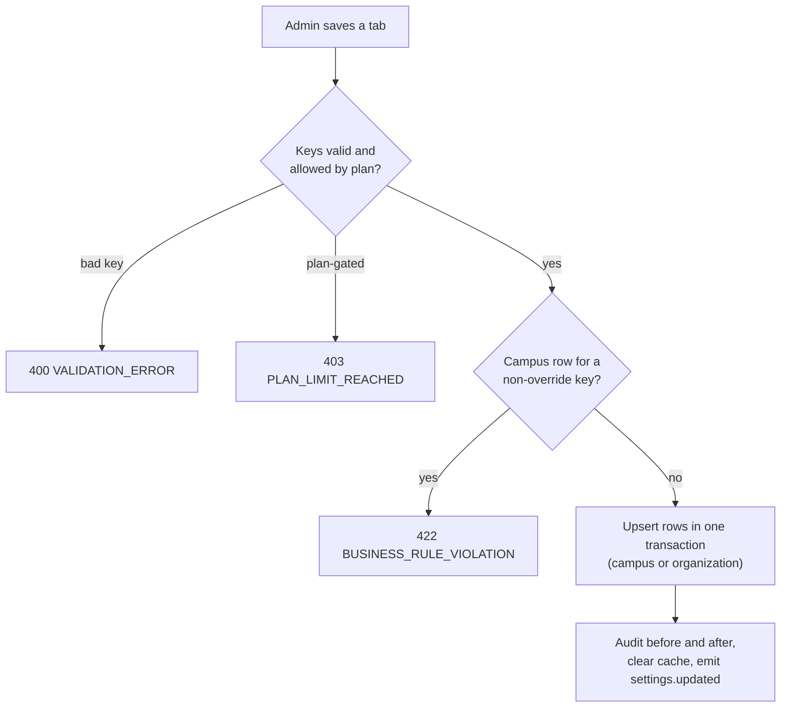
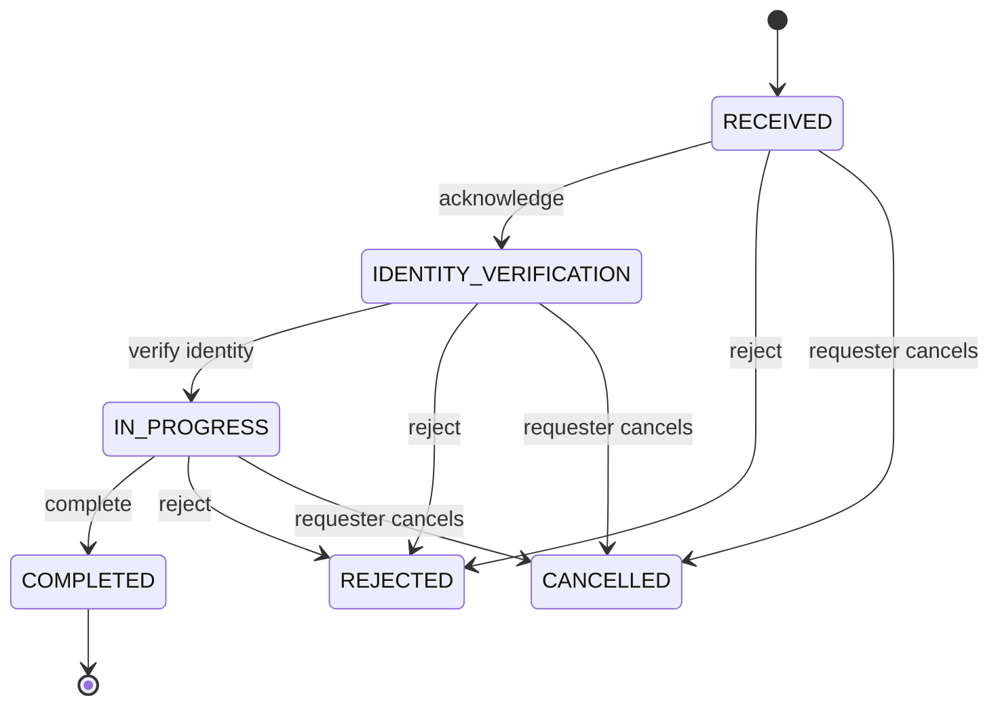
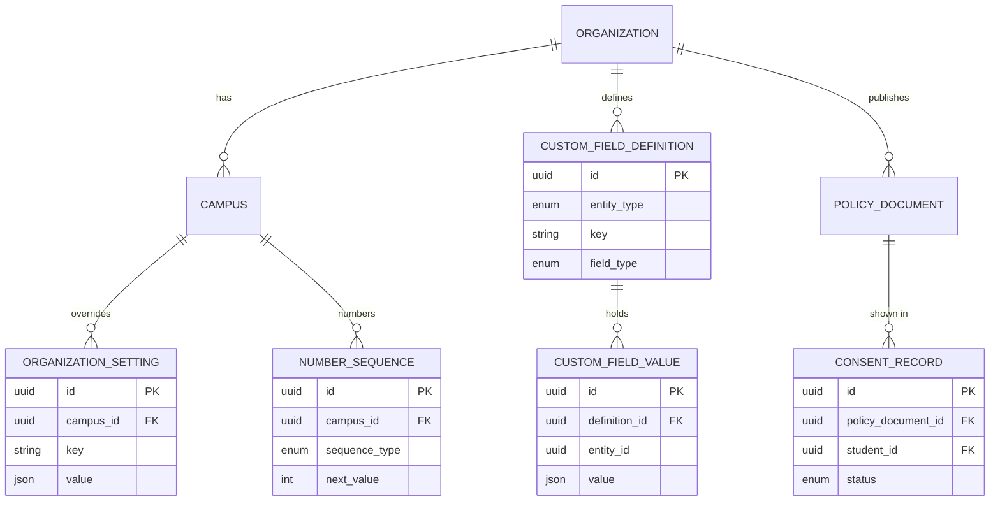

# Settings Module

**In simple words:** Settings is the control room of an institute. The Organization Admin sets the rules once: name and logo, working days, receipt numbers, quiet hours, password rules and privacy notices. Every other module then reads those rules. This chapter defines the settings screens, the 55 SET endpoints, the tables behind them, and the privacy tools (consents, data requests, breach register) that the law expects from an institute that holds children's data.

| Item | Value |
|---|---|
| Module code | SET |
| Release phase | Phase 1 (MVP); API keys and custom domain in Phase 2 |
| Plans | All plans; custom roles from Pro; API keys, IP allow-list, custom domain and hidden branding on Enterprise |
| Main users | Organization Admin; Principal and Accountant read only; parents, students and staff on "My privacy" |
| Depends on | Organizations, Multi Campus, RBAC and Permissions Matrix, Authentication and Sessions, Notifications |
| Main tables | organization_settings, number_sequences, custom_field_definitions, custom_field_values, api_keys, policy_documents, consent_records, data_subject_requests, data_breach_incidents |

## Objective

A new institute works on day one without opening Settings; a grown one changes any rule in one place, safely. Goals:

1. **One home for every rule.** Each setting is a key in a group (`attendance.mode`), stored in `organization_settings` or on the `organizations` row.
2. **Safe defaults.** Every key has a default in code, so a missing row never breaks a screen.
3. **Campus override only where it makes sense.** Attendance mode may differ by campus; security, privacy and billing rules never do.
4. **No silent change.** Every write is audited (before and after), clears the cache and emits an event.
5. **Compliance built in.** Versioned notices, verifiable parental consent, legal due dates and a 72-hour breach clock.

| Measure | Target |
|---|---|
| A saved setting is live in the API | Under 5 seconds |
| `GET /settings/effective` | p95 (95% of calls finish faster) under 50 ms |
| Privacy requests closed by the due date | 100% |
| Students with valid child-data consent 30 days after go-live | 95% or more |

## Scope

### In scope

- All 55 SET endpoints: setting groups, branding, number series, custom fields, the default gateway, API keys, and privacy. Privacy covers notices, consents, data-subject requests (DSR — a person's request to see, copy, correct or delete own data) and breaches.
- The Settings shell, which also hosts screens whose endpoints belong to other modules (see the screen list).

### Out of scope

| Topic | Where it lives |
|---|---|
| Non-SET endpoints in the screen list | Their module chapters |
| MFA enrolment, own sessions, lockout mechanics | *Authentication and Sessions* (`AUTH-API-19` to `AUTH-API-26`) |
| Academic years, terms, grade scales | *Batch Module* (`BAT-API-01` to `BAT-API-10`), *Exams Module* |
| Outbound webhooks to the institute | No table yet; Phase 4 public API |

### Phase notes

| Phase | What ships |
|---|---|
| Phase 1 (sprint week 3, prompt P-19) | Groups, branding, series, custom fields, privacy registers, audit viewer, shell |
| Phase 2 | API keys and custom domain for Enterprise; rule tabs of Phase 2 modules; consent-request campaigns |
| Phase 3 | Rule tabs for Library, Inventory, Transport, Hostel and Payroll |
| Phase 4 | AI rules tab; privacy defaults for international tenants |

## User Stories

| ID | As a | I want to | So that | Priority |
|---|---|---|---|---|
| SET-US-01 | Organization Admin | set the name, logo, colours and receipt footer | receipts and portal pages look like our school | Must |
| SET-US-02 | Organization Admin | set timezone, language, week start and financial year | dates, reports and GST periods are right | Must |
| SET-US-03 | Organization Admin | switch City Campus to period-wise attendance | each campus works its own way | Must |
| SET-US-04 | Organization Admin | define a receipt series with a live preview | numbers are gap-free and fit the GST limit | Must |
| SET-US-05 | Organization Admin | add a "Uniform size" field to students | our forms need no developer | Must |
| SET-US-06 | Organization Admin | create a Front Desk role from a preset | the receptionist sees inquiries, not collections | Should |
| SET-US-07 | Organization Admin | require MFA for admins and shorten sessions | a stolen password alone cannot open the fee counter | Must |
| SET-US-08 | Organization Admin | publish a Hindi and English notice and send OTP consent requests | we hold verifiable parental consent under the DPDP Act | Must |
| SET-US-09 | Parent (Sunita Devi) | manage consents and ask for Aarav's data on my phone | I control my child's data | Must |
| SET-US-10 | Organization Admin | log a privacy request and see its due date | we answer within the legal time | Must |
| SET-US-11 | Organization Admin | record a breach and see the 72-hour deadline | we notify the regulator on time | Must |
| SET-US-12 | Organization Admin (Enterprise) | create an API key limited to our office network | our accounting system reads fee data safely | Could |

## Workflow

**Figure: Saving a settings group**



1. The tab sends only changed keys to `SET-API-03` with `version` (the newest `updatedAt` it read). An older `version` answers `409 CONFLICT`.
2. The group's Zod schema (a TypeScript validation schema) checks every key and value. Plan-gated keys are checked against `plan_features`.
3. With `campusId`, only keys marked "campus override" are accepted.
4. Rows are upserted in one transaction. One `audit_logs` row stores before and after; the Redis key is deleted and `settings.updated` is emitted.

**Figure: Privacy request (DSR) life cycle**



No data leaves before identity is verified. A portal request (OTP login) passes the first two steps automatically; both still appear in the timeline.

| Record | Statuses in order | Set by | Terminal |
|---|---|---|---|
| Data-subject request | RECEIVED, IDENTITY_VERIFICATION, IN_PROGRESS, COMPLETED | `SET-API-32` or `SET-API-54`, then `SET-API-35` to `SET-API-37` | COMPLETED, REJECTED (`SET-API-38`), CANCELLED (`SET-API-55`) |
| Breach incident | DETECTED, INVESTIGATING, CONTAINED, NOTIFIED, CLOSED | `SET-API-41`, then `SET-API-43` | CLOSED |
| Consent | GRANTED, then WITHDRAWN or EXPIRED | `SET-API-26`, `SET-API-51`; withdraw `SET-API-28`, `SET-API-52`; expiry job | WITHDRAWN, EXPIRED |
| API key | ACTIVE, INACTIVE | `SET-API-45`; revoke `SET-API-48` or expiry job | INACTIVE |
| Custom field | ACTIVE, INACTIVE, ARCHIVED | `SET-API-14`, `SET-API-15`, `SET-API-16` | ARCHIVED |

## Screens and Wireframes

| ID | Screen | Users | Purpose | Endpoints |
|---|---|---|---|---|
| SET-S01 | Settings home | Org Admin; Principal, Accountant read only | Tabs, search, recent changes, alerts | `SET-API-01`, `CMN-API-22` |
| SET-S02 | Organization and branding | Org Admin | Profile, logo, colours, footer, domain | `ORG-API-09`, `SET-API-06` to `SET-API-08` |
| SET-S03 | Localization | Org Admin | Timezone, language, week start, financial year | `SET-API-03` (group `general`) |
| SET-S04 | Academic | Org Admin | Working days, promotion, roll numbers, attendance mode | `SET-API-03`, `EXM-API-05` |
| SET-S05 | Finance | Org Admin; Accountant read only | Fee and payment rules, tax, late fee, gateways | `SET-API-19`, `SET-API-20`, `FEE-API-05` to `FEE-API-10` |
| SET-S06 | Number series | Org Admin | Series per type and campus | `SET-API-09` to `SET-API-12` |
| SET-S07 | Communication | Org Admin | Channel order, quiet hours, templates, sender IDs | `SET-API-03`, `NTF-API-01` to `NTF-API-07` |
| SET-S08 | Users and roles | Org Admin; Principal read only | Users, invitations, custom roles | `USR-API-01` to `USR-API-31` |
| SET-S09 | Custom fields | Org Admin | Add, edit, reorder, archive | `SET-API-13` to `SET-API-18` |
| SET-S10 | Import and export centre | Org Admin; staff with import keys | Templates, jobs, error files | `CMN-API-08` to `CMN-API-21` |
| SET-S11 | Integrations | Org Admin (Enterprise) | API keys, provider webhook URLs | `SET-API-44` to `SET-API-48`, `SET-API-19` |
| SET-S12 | Security | Org Admin | Password, MFA, sessions, IP allow-list | `SET-API-03` (group `security`) |
| SET-S13 | Privacy: notices and consents | Org Admin | Notices, consent register, coverage | `SET-API-21` to `SET-API-30` |
| SET-S14 | Privacy: requests and breaches | Org Admin | Request queue, breach register | `SET-API-31` to `SET-API-43` |
| SET-S15 | Audit log | Org Admin | Search, diff, export, chain check | `CMN-API-22` to `CMN-API-26` |
| SET-S16 | Danger zone | Organization owner | Reset group, transfer ownership, close account | `SET-API-04`, `ORG-API-13`, `ORG-API-14` |
| SET-S17 | My privacy (mobile) | Parent, Student, staff | Own consents and requests | `SET-API-50` to `SET-API-55` |
| SET-S18 | Portals and module rules | Org Admin | Portal switches; library, transport, hostel, payroll, AI rules | `SET-API-02`, `SET-API-03` |

**Screen SET-S01 — Settings home (Organization Admin, web)**

```text
+--------------------------------------------------------------------------+
| EduFlow | Bright Future Public School      [Search settings...]   (RS) v |
+------------------+-------------------------------------------------------+
| Settings         | Settings > Home              Campus: [All campuses v] |
|   Organization   +-------------------------------------------------------+
|   Localization   | Find a setting: [quiet hours_______________] [Search] |
|   Academic       |                                                       |
|   Finance        | Recently changed                                      |
|   Numbering      | 08 Feb  attendance.mode = PERIOD (City Campus)  RS    |
|   Communication  | 05 Feb  RECEIPT_NO series of LKO2 changed       RS    |
|   Users, roles   | 02 Feb  Custom field "Uniform size" added        RS   |
|   Custom fields  |                                                       |
|   Import/Export  | Needs attention                                       |
|   Integrations   | (!) 38 students have no child-data consent  [Fix]     |
|   Security       | (!) DSR-2027-0004 is due in 3 days             [Open] |
|   Privacy        | (!) MFA is off for 1 Accountant              [Review] |
|   Audit log      |                                                       |
|   Danger zone    | Plan: Enterprise   Custom roles: Yes   API keys: Yes  |
+------------------+-------------------------------------------------------+
```

- Only tabs the user may open are listed; plan-locked tabs show a lock and "Upgrade". "Find a setting" searches labels on the client.
- "Recently changed" reads `CMN-API-22` (`entityType=OrganizationSetting`); "Needs attention" reads `SET-API-27`, `SET-API-31` and `USR-API-01`.

**Screen SET-S06 — Number series (Organization Admin, web)**

```text
+--------------------------------------------------------------------------+
| EduFlow | Bright Future Public School      [Search settings...]   (RS) v |
+------------------+-------------------------------------------------------+
| Settings         | Settings > Number series              [+ New series]  |
|   Organization   +-------------------------------------------------------+
|   Localization   | Type [All v]   Campus [All v]   Period [Current v]    |
|   Academic       | Type            Campus  Sample                  Next  |
|   Finance        | ADMISSION_NO    All     BF-2027-0143             143  |
|   Numbering <    | RECEIPT_NO      LKO1    RCT-LKO1-2026-27-00412   412  |
|   Communication  | RECEIPT_NO      LKO2    RCT-LKO2-2026-27-00087    87  |
|   Users, roles   | FEE_INVOICE_NO  All     BF/26/000233             233  |
|   Custom fields  | ----------------------------------------------------- |
|   Import/Export  | Edit series: RECEIPT_NO - City Campus (LKO2)          |
|   Integrations   | Prefix [RCT]  Format [{PREFIX}-{CAMPUS}-{AY}-{SEQ}]   |
|   Security       | Pad length [5]  Reset [Academic year v]  Next [87__]  |
|   Privacy        | Preview: RCT-LKO2-2026-27-00087   (21 characters)     |
|   Audit log      |                              [Cancel]  [Save series]  |
+------------------+-------------------------------------------------------+
```

- The list reads `SET-API-09`; "Sample" is the next number. Each edit calls `SET-API-12` after 300 ms.
- "Save series" calls `SET-API-11`; "New series" calls `SET-API-10`.

**Screen SET-S08 — Custom role editor (Organization Admin, web, Pro and Enterprise)**

```text
+--------------------------------------------------------------------------+
| EduFlow | Bright Future Public School      [Search settings...]   (RS) v |
+------------------+-------------------------------------------------------+
| Settings         | Roles > Front Desk (custom)      Users: 2   [Clone]   |
|   Organization   +-------------------------------------------------------+
|   Academic       | Preset [Front Desk v]  Name [Front Desk____________]  |
|   Finance        | Module        Permission key         Scope            |
|   Numbering      | Admissions    admissions.view        [Campus v]       |
|   Communication  | Admissions    admissions.create      [Campus v]       |
|   Users, roles < | Admissions    admissions.approve     [No v]           |
|   Custom fields  | Students      students.view          [View v]         |
|   Import/Export  | Fees          fees.view              [View v]         |
|   Integrations   | Fees          fees.collect           [No v]           |
|   Security       | WhatsApp      whatsapp.send          [Campus v]       |
|   Privacy        | (i) Preset has no approval, export or money keys.     |
|   Audit log      |     18 of 269 keys granted.                           |
|   Danger zone    |                                [Cancel]  [Save role]  |
+------------------+-------------------------------------------------------+
```

- The grid lists `USR-API-23` by module; keys the editor does not hold are greyed out.
- "Save role" calls `USR-API-17` (new) or `USR-API-21` (grants); "Clone" calls `USR-API-22`.

**Screen SET-S14 — Privacy request detail (Organization Admin, web)**

```text
+--------------------------------------------------------------------------+
| EduFlow | Bright Future Public School      [Search settings...]   (RS) v |
+------------------+-------------------------------------------------------+
| Settings         | Privacy > Requests > DSR-2027-0004   [IN_PROGRESS]    |
|   Organization   +-------------------------------------------------------+
|   Security       | Type: EXPORT         Subject: Aarav Sharma (Student)  |
|   Privacy <      | Asked by: Sunita Devi (Parent)     Channel: PORTAL    |
|    Notices       | Received 14 Jan 2027   Due 13 Feb 2027 (3 days left)  |
|    Consents      | Regulation: DPDP     Handler [Rajesh Sharma v]        |
|    Requests <    | Timeline                                              |
|    Breaches      | 14 Jan 10:58  RECEIVED  portal, OTP +91 98xxx x4210   |
|   Audit log      | 14 Jan 10:58  IDENTITY_VERIFICATION  automatic        |
|   Danger zone    | 14 Jan 10:58  IN_PROGRESS  identity verified by OTP   |
|                  | 09 Feb 17:20  Note: fee ledger checked, no dues       |
|                  | Notes [____________________________________________]  |
|                  | [Extend due date] [Reject] [Complete, build package]  |
+------------------+-------------------------------------------------------+
```

- The due date turns amber 7 days before and red when overdue.
- "Complete, build package" calls `SET-API-37`, then "Download" uses `SET-API-39`. "Extend due date" and the handler use `SET-API-34`; "Reject" calls `SET-API-38`.

**Screen SET-S17 — My privacy (Parent, mobile)**

```text
+------------------------------------+
| < My privacy         Bright Future |
+------------------------------------+
| Child [Aarav Sharma - 10-A     v]  |
|                                    |
| Consents                           |
| [x] Child data processing   v2.1   |
|     Given 12 Dec 2026 by OTP       |
|     [Read notice]   [Withdraw]     |
| [x] WhatsApp messages       v1.0   |
| [ ] Photos on website       v1.0   |
|     [Read notice]   [Allow]        |
|                                    |
| My requests                        |
| DSR-2027-0004   Copy of data       |
| IN_PROGRESS     Due 13 Feb 2027    |
| [+ New request]                    |
| Language  (o) English  ( ) Hindi   |
+------------------------------------+
| Home    Fees    Notices    More    |
+------------------------------------+
```

- The screen reads `SET-API-50`. "Allow" calls `SET-API-51` with an OTP to the guardian phone; "Withdraw" confirms, then calls `SET-API-52`.
- "New request" offers copy, correction and deletion (`SET-API-54`). "Read notice" opens the exact version the consent refers to.

## UI Components

| Component | Type | Behaviour |
|---|---|---|
| `SettingsShell` | Sidebar and `Tabs` | Hides tabs without the key; plan-locked tabs show a lock badge |
| `SettingField` | Form row (React Hook Form and Zod) | Shows value, default and a "Campus override" chip with a reset link (`SET-API-04`) |
| `SequencePreview` | `Card` | Debounced call to `SET-API-12`; next three numbers and length; red above `maxLength` |
| `PermissionGrid` | `Table` with a `Select` per row | Scope per key; keys the editor lacks are disabled with a tooltip |
| `CustomFieldBuilder` | `Dialog` and drag list | Options by field type; drag to reorder (`SET-API-17`) |
| `SecretOnceDialog` | `AlertDialog` | Shows a new API key once with "Copy"; closing needs the tick "I have saved it" |
| `TypedConfirmDialog` | `AlertDialog` | Danger actions need the organization slug typed |
| States | `Skeleton`, `EmptyState`, `Alert` | Skeleton while loading; "No custom fields yet" when empty; errors show the message and `requestId` |

## Validation Rules

| Field | Rule | Error message shown to user |
|---|---|---|
| `communication.quiet_hours` | `HH:mm`; start and end differ | "Quiet hours need a start and an end time that are different." |
| `branding.primaryColor` | `#RRGGBB`; contrast 4.5:1 on white | "This colour is too light for buttons. Pick a darker one." |
| `customDomain` | Valid host name, not under `eduflow.app` | "Enter a domain such as erp.brightfuture.edu.in." |
| Series `format` | Contains `{SEQ}`; only known tokens | "Unknown token {X}. Use PREFIX, CAMPUS, YYYY, YY, AY, MM, SEQ or SUFFIX." |
| Series `format` with a reset | Contains a year token; `{MM}` too for MONTHLY | "Numbers would repeat after the reset. Add a year or month token." |
| `nextValue` | Not lower than the stored value | "The next number can only go up. It is now {n}." |
| Rendered number | Length up to `maxLength` | "The number would have {n} characters. This series allows {max}." |
| Custom field `key` | `^[a-z][a-z0-9_]{1,59}$`; unique per entity | "Use lower-case letters, digits and _ (for example uniform_size)." |
| `security.password_min_length` | 8 to 64 | "Minimum length must be between 8 and 64." |
| `security.ip_allowlist.cidrs` | Valid CIDR; caller's IP inside when enabled | "Your IP {ip} is not in the list. Add it first or you will be locked out." |
| API key `scopes` | Inside the creator's own keys; no blocked keys | "You cannot give an API key a permission you do not hold." |
| DSR `extendedDueDate` | After `dueDate`, at most 60 days later, with a reason | "Give a reason and a date within 60 days of the due date." |
| Offline consent | Evidence file required for `SIGNED_FORM` | "Attach the scanned signed form." |

## Business Rules

### Settings groups and keys

**SET-BR-01 — Resolution.** A key resolves in three steps: the row for the caller's campus, else the organization row, else the default in code. The SQL is in *Multi Campus Module* (CAMP-BR-09). Group `general` is not a row: it reads and writes the `organizations` columns `timezone`, `locale`, `financialYearStartMonth` and `weekStartsOn`.

**SET-BR-02 — Groups and campus override.** Each group has one Zod schema; "Per key" means it marks which keys accept a campus row.

| Group | Owner chapter | Campus override |
|---|---|---|
| `general`, `academic`, `communication`, `portal`, `privacy`, `security` | *Settings Module* | `academic` and `communication` per key; the others No |
| `attendance`, `batches`, `admissions` | *Attendance Module*, *Batch Module*, *Student Admission Module* | Per key |
| `fees`, `payments` | *Fees Module*, *Payments Module* | Per key |
| `library`, `inventory`, `transport`, `hostel`, `certificates` | Their module chapters | Per key |
| `payroll`, `ai` | *Payroll Module*, *AI Insights Module* | No |
| `onboarding`, `billing` | *Organizations Module* | System only; `SET-API-03` refuses them |

**SET-BR-03 — Keys owned by this chapter.** Assumption: names and defaults are fixed here.

| Key | Default | Meaning |
|---|---|---|
| `academic.working_days` | Monday to Saturday | Days that count for attendance and timetables |
| `academic.promotion_requires_pass` | `true` | Promotion offers only students who passed |
| `communication.channel_order` | `["WHATSAPP", "SMS", "EMAIL"]` | Fallback order of channels |
| `communication.quiet_hours` | `{ "enabled": true, "start": "21:00", "end": "07:00", "bypassCategories": ["ACCOUNT", "SYSTEM", "TRANSPORT"] }` | Held messages go out when the window ends |
| `portal.parent_enabled` | `true` | Parent Portal on |
| `portal.student_enabled` | `false` | Student Portal on (Growth and higher) |
| `portal.show_fee_dues` | `true` | Parents see dues and can pay online |
| `privacy.dsr_due_days` | `{ "DPDP": 30, "GDPR": 30, "APP": 30, "PDPL": 30, "FERPA": 45 }` | Calendar days to answer a request |
| `privacy.grievance_contact` | Owner name, email and phone | Shown in every notice |
| `privacy.retention_exited_student_years` | `7` | Years after exit before anonymising |
| `privacy.retention_message_body_days` | `365` | Days before message texts are cleared |
| `security.password_min_length` | `10` | Minimum password length |
| `security.mfa_required_roles` | `["ORG_ADMIN"]` | Roles that must use MFA |
| `security.session_lifetime_days` | `30` | Refresh token life, 1 to 30 |
| `security.idle_logout_minutes` | `{ "ACCOUNTANT": 30 }` | Idle logout on shared counter PCs |
| `security.ip_allowlist` | `{ "enabled": false, "cidrs": [], "roles": [] }` | Enterprise: listed roles log in only from these networks |

> **Note:** Assumption: the due days are planning values. *Privacy and Compliance* owns the legal check of each deadline.

**SET-BR-04 — Quiet hours.** Bulk and scheduled messages wait while the window is open. Categories in `bypassCategories` go at once, and so does a receipt for a payment the parent just made.

```typescript
type QuietHours = { enabled: boolean; start: string; end: string; bypassCategories: string[] };

const toMinutes = (hhmm: string): number => {
  const [h, m] = hhmm.split(':').map(Number);
  return h * 60 + m;
};

// null = send now; otherwise the UTC time when the quiet window ends
export function holdUntil(q: QuietHours, category: string, nowUtc: Date, tz: string): Date | null {
  if (!q.enabled || q.bypassCategories.includes(category)) return null;
  const local = new Intl.DateTimeFormat('en-GB', {
    timeZone: tz, hour: '2-digit', minute: '2-digit', hourCycle: 'h23',
  }).format(nowUtc);
  const now = toMinutes(local);
  const start = toMinutes(q.start);
  const end = toMinutes(q.end);
  const inQuiet = start > end ? now >= start || now < end : now >= start && now < end;
  if (!inQuiet) return null;
  const waitMinutes = (end - now + 1440) % 1440;
  return new Date(nowUtc.getTime() + waitMinutes * 60_000);
}
```

> **Example:** Sharma Classes sends a fee reminder batch at 21:30 IST. The window 21:00 to 07:00 crosses midnight, so 21:30 is inside it. Wait = (420 - 1290 + 1440) mod 1440 = 570 minutes. The batch goes at 07:00 IST the next morning.

### Number series

**SET-BR-05 — Period key and tokens.** The period key follows `resetPolicy`: `NEVER` = empty, `CALENDAR_YEAR` = `"2027"`, `ACADEMIC_YEAR` and `FINANCIAL_YEAR` = `"2026-27"`, `MONTHLY` = `"2027-02"`. The financial year starts in `financialYearStartMonth`. `{AY}` prints the academic year label. `{YYYY}` and `{YY}` print the start year of the period when the series resets yearly, else the year of the document date. `{MM}` is the month of the document date. The row lock and gap-free issue are defined in *Multi Campus Module* (CAMP-BR-10).

> **Example:** Bright Future's invoice series is `{PREFIX}/{YY}/{SEQ}`, prefix `BF`, pad 6, reset `FINANCIAL_YEAR`, `maxLength` 16. An invoice dated 10 Feb 2027 falls in financial year 2026-27, so it prints `BF/26/000233` (12 characters). On 2 Apr 2027 a new period starts and prints `BF/27/000001`.

**SET-BR-06 — Changing a series.** `nextValue` may jump forward, for example to continue after an old paper receipt book; the jump is audited. It never goes down (`422 BUSINESS_RULE_VIOLATION`), because numbers could repeat. A new format applies to the next number only; issued documents keep their numbers. A series that resets must carry a period token. A campus series must contain `{CAMPUS}` or a prefix no other series of the type uses (`409 CONFLICT`). The preview never uses up a number.

### Custom fields

**SET-BR-07 — Definitions and values.** Assumption: active fields per entity type are limited to 5 on Starter, 20 on Growth and 50 on Pro and Enterprise (`403 PLAN_LIMIT_REACHED`). Once any value exists, `key` and `fieldType` are fixed (`422`). An option in use cannot be removed; its label can change. Archived fields leave forms and import templates, but their values stay and appear in data packages. `isRequired` is checked on create, on edit and on import. `visibleToParent` shows the value read only in the Parent Portal. Values are JSON by type: `"M"`, `42`, `true`, `"2027-04-01"`, `["chess", "cricket"]`, `{ "fileId": "..." }` for FILE.

### Branding, gateways and integrations

**SET-BR-08 — Branding.** Logo, colours, favicon and receipt footer work on every plan. `hideEduflowBranding` and `customDomain` need Enterprise (`403 PLAN_LIMIT_REACHED`). `SET-API-08` checks a TXT record and a CNAME record to `{slug}.eduflow.app`. The edge serves the domain only after both pass and the TLS certificate (the HTTPS certificate) is issued. A domain used by another tenant answers `409 CONFLICT`.

**SET-BR-09 — Default gateway.** One default account per organization (partial unique index). `SET-API-20` unsets the old default and sets the new one in one transaction. The account must be `ACTIVE`, in `LIVE` mode and verified (`lastVerifiedAt` set), else `422`. A campus with its own live account uses it; other campuses use the default. `SET-API-19` returns the public key and the webhook URL `https://api.eduflow.app/api/v1/webhooks/razorpay/{accountId}`, never a secret reference.

**SET-BR-10 — API keys (Enterprise).** Plan feature `api_access`. The key is `ef_live_` plus 40 random base62 characters. Only the SHA-256 hash and the first 12 characters (`keyPrefix`) are stored. Scopes must be inside the creator's own keys and may never contain `platform.*`, the portal keys, `users.*`, `roles.*`, `billing.manage` or `settings.manage_api_keys`. `rateLimitPerMin` is 1 to 1,000; the organization limit still applies. `expiresAt` is at most 365 days away. Assumption: at most 10 active keys per organization. Rotation replaces hash and prefix on the same row, so the old secret stops at once.

```typescript
import { createHash, randomBytes } from 'node:crypto';

const BASE62 = '0123456789ABCDEFGHIJKLMNOPQRSTUVWXYZabcdefghijklmnopqrstuvwxyz';

export function newApiKey(): { fullKey: string; keyPrefix: string; keyHash: string } {
  const body = Array.from(randomBytes(40), (b) => BASE62[b % 62]).join('');
  const fullKey = `ef_live_${body}`;
  return {
    fullKey, // returned once in the POST response, never stored
    keyPrefix: fullKey.slice(0, 12),
    keyHash: createHash('sha256').update(fullKey).digest('hex'),
  };
}
```

### Security and localization

**SET-BR-11 — Security settings.** The password length applies to the next password set; the admin can force a change with `USR-API-09`. A user in a role listed in `security.mfa_required_roles` without MFA gets only the MFA setup screen after login. The session lifetime applies to new sessions. With the IP allow-list on, staff of the listed roles log in and refresh only from the listed networks; parents and students are never restricted.

> **Example:** Bright Future allows `49.36.12.0/24` for role `ACCOUNTANT`. Suresh Gupta logs in from the counter PC `49.36.12.20` and gets in. From home Wi-Fi `106.51.3.7` he gets `403 FORBIDDEN` "Login from this network is not allowed for your role."

**SET-BR-12 — Localization.** Date format follows the locale: `en-IN`, `en-AU` and `en-AE` show 21/09/2026; `en-US` shows 09/21/2026; `hi-IN` shows Hindi labels with the Indian date order. A new timezone moves future day boundaries (attendance day, day close, reminders); stored UTC data does not change. The currency comes from the country at signup; after the first invoice only EduFlow support can change it. `financialYearStartMonth` cannot change once a `FINANCIAL_YEAR` series has issued a number in the current period (`422`).

### Privacy

**SET-BR-13 — Notices.** `contentHash` is the SHA-256 of the body. The body is Markdown without HTML. A published version is never edited; a fix is a new version. When a version takes effect, the activation job retires the older version of the same type and language. Existing consents stay valid under a new version; `SET-API-27` shows how many rest on an older one.

**SET-BR-14 — Consent.** `CHILD_DATA_PROCESSING` for a student under 18 needs verification: OTP to the guardian phone, a signed form or an in-person record with evidence, or DigiLocker. `subjectIsMinor` is true when the student is under 18 on `grantedAt`. A consent is valid when `status = GRANTED` and `expiresAt` is empty or in the future. Withdrawing a channel consent stops that channel within one minute. Withdrawing child-data consent pauses the Student Portal and optional processing (photos, analytics) and creates a task for the Organization Admin.

> **Example:** Bright Future has 1,200 active students and 1,162 valid child-data consents. Coverage = 1,162 / 1,200 = 96.8%. The 38 missing students appear on SET-S01 with a "Fix" button that opens `SET-API-29`.

**SET-BR-15 — Request deadlines.** `dueDate` = local date of `receivedAt` + `privacy.dsr_due_days` for the regulation. The regulation defaults from the country: IN = DPDP, AE = PDPL, AU = APP, US = FERPA. An extension of up to 60 days needs a reason. Alerts go 7 days and 2 days before the due date. `requestNo` comes from the `DSR_REQUEST_NO` series, default `DSR-{YYYY}-{SEQ}`, pad 4, reset `CALENDAR_YEAR`.

> **Example:** Sunita Devi asks for a copy of Aarav's data on 14 Jan 2027 at 10:58 IST. DPDP gives 30 days, so the due date is 13 Feb 2027 and the number is `DSR-2027-0004`.

**SET-BR-16 — Completing a request.** For ACCESS and EXPORT a worker builds a private ZIP (one JSON file per table plus files). The `SET-API-39` link lives 15 minutes; each download is audited with `isSensitiveRead = true`. The package holds only the subject's rows; sibling and family data is removed. For DELETION, `actionsTaken` lists each entity as ERASED, ANONYMISED or RETAINED with a legal basis; invoices, receipts and GST records are RETAINED. For CORRECTION the changes are made in the owning module and listed at completion.

**SET-BR-17 — Breach clock.** `regulatorNotifyDueAt` = `detectedAt` + 72 hours. While `regulatorNotifiedAt` is empty, `data_breach.notification_due` fires at 48 and 66 hours. Status moves only forward. CLOSED needs `containedAt`, `rootCause` and `remediation`; HIGH and CRITICAL also need `regulatorNotifiedAt` and `subjectsNotifiedAt`. `incidentNo` is `INC-` plus the year plus 6 random hex characters, unique across the platform.

> **Example:** A teacher's laptop with an exported marks sheet is stolen. The admin records it on 10 Mar 2027 at 16:40 IST, severity HIGH, children's data involved. The regulator notice is due on 13 Mar 2027 at 16:40 IST; reminders fire on 12 Mar at 16:40 and 13 Mar at 10:40.

**SET-BR-18 — Retention.** A nightly job at 02:00 local time anonymises students who left more than `privacy.retention_exited_student_years` ago and clears message texts older than `privacy.retention_message_body_days`. Money records stay.

### Safety

**SET-BR-19 — Audit, cache and impersonation.** Every write stores before and after values with secrets shown as `***`, clears the Redis key and emits an event. SUPER_ADMIN during impersonation may change groups and branding but never gateways, API keys or privacy registers.

**SET-BR-20 — Danger zone.** "Reset group" deletes the group's rows (or one campus's rows) after the slug is typed; defaults apply at once. Ownership transfer and account closure follow *Organizations Module*: password and MFA, never with an impersonation token.

## Acceptance Criteria

| ID | Given | When | Then |
|---|---|---|---|
| SET-AC-01 | City Campus has `attendance.mode = PERIOD`; Main Campus has no row | Teachers of each campus load attendance | City Campus gets `PERIOD`; Main Campus `DAILY` |
| SET-AC-02 | Another admin saved the tab first | A save arrives with the old `version` | `409 CONFLICT`; the tab reloads |
| SET-AC-03 | The LKO2 receipt series has `nextValue` 87 | The admin sets 80 | `422` "The next number can only go up. It is now 87." |
| SET-AC-04 | A Growth tenant has 20 active STUDENT fields | One more is created | `403 PLAN_LIMIT_REACHED` |
| SET-AC-05 | `uniform_size` has saved values | `fieldType` changes to TEXT | `422`; a label change succeeds |
| SET-AC-06 | A Pro tenant | `SET-API-45` is called | `403 PLAN_LIMIT_REACHED`; Enterprise gets `201` |
| SET-AC-07 | Sunita Devi grants child-data consent for Aarav (15) | She enters the right OTP | GRANTED, method OTP, `subjectIsMinor = true`, notice version stored |
| SET-AC-08 | She withdraws WhatsApp consent | A reminder goes 5 minutes later | No WhatsApp; the next channel in `channel_order` is used |
| SET-AC-09 | A DPDP export request arrives 14 Jan 2027, 10:58 IST | It is saved | `DSR-2027-0004`, due `2027-02-13`, alerts on 6 and 11 Feb |
| SET-AC-10 | An EXPORT request is IN_PROGRESS | It is completed | ZIP of Aarav's rows only; 15-minute link; each download audited |
| SET-AC-11 | A HIGH breach has no `regulatorNotifiedAt` | It is moved to CLOSED | `422` naming the missing fields |
| SET-AC-12 | SUPER_ADMIN impersonates Sharma Classes | It calls `SET-API-28` or `SET-API-45` | `403 FORBIDDEN`; audit outcome DENIED |

## Edge Cases

| Case | What happens | How the system handles it |
|---|---|---|
| Plan drops from Enterprise to Pro | Enterprise features lose their plan | Keys go INACTIVE; allow-list, custom domain and hidden branding switch off; data stays |
| 30 active fields after a drop to Growth (limit 20) | Over the limit | All 30 keep working; new ones are refused |
| A field becomes required; 1,200 students have no value | Old rows stay valid | Checked at the next edit or import |
| A parent of two withdraws for one child | Consent is per student | The sibling's consent stays GRANTED |
| Deletion request for a student with receipts | Money records must stay | Personal fields anonymised; invoices and receipts RETAINED ("GST and tax law") |
| A former parent writes a letter | No login | Logged with `SET-API-32`, `channel = LETTER`; identity by SIGNED_FORM or IN_PERSON |
| An API key is used outside `allowedIps` | Wrong network | `403 FORBIDDEN`; audit outcome DENIED |
| Consent OTP is wrong 5 times | Possible guessing | The OTP is burned; a new one after 15 minutes (*Authentication and Sessions*) |

## Database Schema

| Table | Purpose | Key columns | Keys and indexes |
|---|---|---|---|
| `organization_settings` | One value per key and scope | `campus_id`, `key`, `value` jsonb | UK (org, campus, key) |
| `number_sequences` | Gap-free counter per type, campus and period | `sequence_type`, `period_key`, `format`, `pad_length` 4, `max_length`, `next_value` 1, `reset_policy` | UK (org, campus, type, period) |
| `custom_field_definitions` | Extra fields per entity type | `entity_type`, `key`, `field_type`, `options`, `is_required`, `status` | UK (org, entity, key) |
| `custom_field_values` | One value per field per entity row | `definition_id` FK, `entity_type`, `entity_id` (no FK), `value` jsonb | UK (org, definition, entity) |
| `api_keys` | Enterprise keys, hash only | `key_prefix`, `key_hash` char(64), `scopes`, `allowed_ips`, `rate_limit_per_min` 100, `status`, `expires_at` | UK `key_hash`; UK (org, name) |
| `policy_documents` | Notice versions per type and language | `consent_type`, `version`, `language`, `content_hash`, `effective_from`, `retired_at` | UK (org, type, version, language) |
| `consent_records` | Proof of each consent | `consent_type`, `status`, `student_id`, `policy_document_id`, `verification_method` | IX (org, student, type) |
| `data_subject_requests` | Privacy requests | `request_no`, `request_type`, `status`, `subject_type`, `subject_id`, `due_date` date, `actions_taken` | UK (org, `request_no`); IX (org, status, due) |
| `data_breach_incidents` | Breach register | `incident_no`, `severity`, `status`, `detected_at`, `regulator_notify_due_at`, `regulator_notified_at` | UK `incident_no`; IX (org, status, detected) |

The module also writes `organizations` (group `general`, branding), `payment_gateway_accounts.is_default` and `audit_logs`. Full columns are in the Prisma Schema below and in *Data Dictionary: Platform and People*.

### Table organization_settings

| Column | Type | Null | Default | Notes |
|---|---|---|---|---|
| `id` | uuid | No | `uuid()` | PK |
| `organization_id` | uuid | No | | FK `organizations`, cascade |
| `campus_id` | uuid | Yes | | FK `campuses`; empty = organization value |
| `key` | varchar(100) | No | | `<group>.<key>` |
| `value` | jsonb | No | | Checked by the group's Zod schema |
| `updated_by_id` | uuid | Yes | | User id, no FK |

### Indexes and constraints

- Partial unique indexes where `campus_id` is empty: `organization_settings (organization_id, key)`, `number_sequences (organization_id, sequence_type, period_key)`; platform notices: `policy_documents (consent_type, version, language)`.
- One default gateway: `payment_gateway_accounts (organization_id) WHERE is_default AND deleted_at IS NULL`.
- RLS on all nine tables; tenants may also read platform notices. Privacy tables use `onDelete: Restrict`, so legal proof is never deleted by accident.

**Figure: Settings and custom-field tables with consents**



A row without a campus is the organization value; a campus row overrides it. A consent points to the exact notice version shown, so the proof survives later changes.

## Prisma Schema

Copied from `00-base.prisma` (`RecordStatus`), `01-platform.prisma` and `02-auth.prisma`. Only the layout differs: long trailing comments sit on the line above their field so the code fits the page.

```prisma
enum RecordStatus {
  ACTIVE
  INACTIVE
  ARCHIVED
}

enum NumberSequenceType {
  ADMISSION_NO
  APPLICATION_NO
  INQUIRY_NO
  ROLL_NO
  EMPLOYEE_CODE
  FEE_INVOICE_NO
  RECEIPT_NO
  REFUND_NO
  CERTIFICATE_NO
  PAYSLIP_NO
  PURCHASE_ORDER_NO
  LIBRARY_ACCESSION_NO
  CREDIT_NOTE_NO
  DSR_REQUEST_NO
  OTHER
}

enum SequenceResetPolicy {
  NEVER
  CALENDAR_YEAR
  ACADEMIC_YEAR
  FINANCIAL_YEAR
  MONTHLY
}

enum CustomFieldEntity {
  STUDENT
  GUARDIAN
  STAFF
  ADMISSION_INQUIRY
  ADMISSION_APPLICATION
  COURSE
  BATCH
}

enum CustomFieldType {
  TEXT
  TEXTAREA
  NUMBER
  DATE
  BOOLEAN
  SELECT
  MULTI_SELECT
  PHONE
  EMAIL
  URL
  FILE
}

// Key/value settings per organization, with an optional campus-level override.
model OrganizationSetting {
  id             String   @id @default(uuid()) @db.Uuid
  organizationId String   @map("organization_id") @db.Uuid
  campusId       String?  @map("campus_id") @db.Uuid // null = organization-wide value
  key            String   @db.VarChar(100) // e.g. attendance.lock_after_hours, fees.late_fee_policy
  value          Json
  updatedById    String?  @map("updated_by_id") @db.Uuid // User id (audit only, no FK)
  createdAt      DateTime @default(now()) @map("created_at") @db.Timestamptz(6)
  updatedAt      DateTime @updatedAt @map("updated_at") @db.Timestamptz(6)

  organization Organization @relation(fields: [organizationId], references: [id], onDelete: Cascade)
  campus       Campus?      @relation(fields: [campusId], references: [id], onDelete: Cascade)

  // NULL campus_id rows are kept unique by a partial unique index added in the SQL migration:
  // UNIQUE (organization_id, key) WHERE campus_id IS NULL
  @@unique([organizationId, campusId, key])
  @@index([organizationId, key])
  @@map("organization_settings")
}

// Gap-free counters for admission, receipt, invoice and other document numbers.
model NumberSequence {
  id             String              @id @default(uuid()) @db.Uuid
  organizationId String              @map("organization_id") @db.Uuid
  // null = one series for the whole organization
  campusId       String?             @map("campus_id") @db.Uuid
  sequenceType   NumberSequenceType  @map("sequence_type")
  // "2027", "2027-28", "2027-04" or "" when never reset
  periodKey      String              @default("") @map("period_key") @db.VarChar(20)
  prefix         String?             @db.VarChar(20)
  suffix         String?             @db.VarChar(20)
  // tokens: {PREFIX} {CAMPUS} {YYYY} {YY} {AY} {MM} {SEQ} {SUFFIX}
  format         String              @default("{PREFIX}-{YYYY}-{SEQ}") @db.VarChar(100)
  padLength      Int                 @default(4) @map("pad_length") @db.SmallInt
  // 16 for GST tax-invoice series; validated when the format is saved
  maxLength      Int?                @map("max_length") @db.SmallInt
  // incremented with SELECT ... FOR UPDATE inside the business transaction
  nextValue      Int                 @default(1) @map("next_value")
  resetPolicy    SequenceResetPolicy @default(NEVER) @map("reset_policy")
  createdAt      DateTime            @default(now()) @map("created_at") @db.Timestamptz(6)
  updatedAt      DateTime            @updatedAt @map("updated_at") @db.Timestamptz(6)

  organization Organization @relation(fields: [organizationId], references: [id], onDelete: Cascade)
  campus       Campus?      @relation(fields: [campusId], references: [id], onDelete: Cascade)

  // NULL campus_id rows are kept unique by a partial unique index added in the SQL migration.
  @@unique([organizationId, campusId, sequenceType, periodKey])
  @@index([organizationId, sequenceType])
  @@map("number_sequences")
}

// Tenant-defined extra field for students, staff, inquiries and other entities.
model CustomFieldDefinition {
  id              String            @id @default(uuid()) @db.Uuid
  organizationId  String            @map("organization_id") @db.Uuid
  entityType      CustomFieldEntity @map("entity_type")
  key             String            @db.VarChar(60) // machine name, e.g. aadhaar_seeded
  label           String            @db.VarChar(120)
  fieldType       CustomFieldType   @map("field_type")
  options         Json? // choices for SELECT / MULTI_SELECT: [{ value, label }]
  validation      Json? // { min, max, regex, maxLength }
  defaultValue    Json?             @map("default_value")
  helpText        String?           @map("help_text") @db.VarChar(255)
  isRequired      Boolean           @default(false) @map("is_required")
  showInList      Boolean           @default(false) @map("show_in_list")
  visibleToParent Boolean           @default(false) @map("visible_to_parent")
  sortOrder       Int               @default(0) @map("sort_order")
  status          RecordStatus      @default(ACTIVE)
  createdAt       DateTime          @default(now()) @map("created_at") @db.Timestamptz(6)
  updatedAt       DateTime          @updatedAt @map("updated_at") @db.Timestamptz(6)
  deletedAt       DateTime?         @map("deleted_at") @db.Timestamptz(6)

  organization Organization @relation(fields: [organizationId], references: [id], onDelete: Cascade)
  values       CustomFieldValue[]

  @@unique([organizationId, entityType, key])
  @@index([organizationId, entityType, status, sortOrder])
  @@map("custom_field_definitions")
}

// Value of a custom field for one entity row (polymorphic: entityType + entityId).
model CustomFieldValue {
  id             String            @id @default(uuid()) @db.Uuid
  organizationId String            @map("organization_id") @db.Uuid
  definitionId   String            @map("definition_id") @db.Uuid
  entityType     CustomFieldEntity @map("entity_type")
  entityId       String            @map("entity_id") @db.Uuid // id of the Student, Staff ... row
  value          Json
  createdAt      DateTime          @default(now()) @map("created_at") @db.Timestamptz(6)
  updatedAt      DateTime          @updatedAt @map("updated_at") @db.Timestamptz(6)

  organization Organization @relation(fields: [organizationId], references: [id], onDelete: Cascade)
  definition CustomFieldDefinition @relation(fields: [definitionId], references: [id], onDelete: Cascade)

  @@unique([organizationId, definitionId, entityId])
  @@index([organizationId, entityType, entityId])
  @@map("custom_field_values")
}
```

```prisma
enum ConsentType {
  TERMS_OF_SERVICE
  PRIVACY_POLICY
  DATA_PROCESSING
  CHILD_DATA_PROCESSING // verifiable parental consent (DPDP Act s.9, COPPA)
  COMMUNICATION_WHATSAPP
  COMMUNICATION_SMS
  COMMUNICATION_EMAIL
  PHOTO_MEDIA
  THIRD_PARTY_SHARING
}

enum ConsentStatus {
  GRANTED
  WITHDRAWN
  EXPIRED
}

enum ConsentVerificationMethod {
  OTP
  EMAIL_LINK
  SIGNED_FORM
  IN_PERSON
  DIGILOCKER
}

enum DataSubjectRequestType {
  ACCESS
  EXPORT
  CORRECTION
  DELETION
  RESTRICT_PROCESSING
  WITHDRAW_CONSENT
  OBJECTION // GDPR right to object
  NOMINATION // DPDP: nominate a person to exercise rights
  GRIEVANCE // DPDP grievance redressal
}

enum BreachSeverity {
  LOW
  MEDIUM
  HIGH
  CRITICAL
}

enum BreachStatus {
  DETECTED
  INVESTIGATING
  CONTAINED
  NOTIFIED
  CLOSED
}

enum DataSubjectRequestStatus {
  RECEIVED
  IDENTITY_VERIFICATION
  IN_PROGRESS
  COMPLETED
  REJECTED
  CANCELLED
}

enum DataSubjectType {
  USER
  STUDENT
  GUARDIAN
  STAFF
}

// API key for Enterprise integrations; only the hash is stored, the prefix identifies the key.
model ApiKey {
  id              String       @id @default(uuid()) @db.Uuid
  organizationId  String       @map("organization_id") @db.Uuid
  name            String       @db.VarChar(100)
  // first characters shown in the UI, e.g. ef_live_8f3a
  keyPrefix       String       @map("key_prefix") @db.VarChar(16)
  keyHash         String       @unique @map("key_hash") @db.Char(64) // SHA-256 hex of the full key
  scopes          String[] // permission keys the key may use
  allowedIps      String[]     @map("allowed_ips") // optional CIDR allow-list
  rateLimitPerMin Int          @default(100) @map("rate_limit_per_min")
  status          RecordStatus @default(ACTIVE)
  lastUsedAt      DateTime?    @map("last_used_at") @db.Timestamptz(6)
  lastUsedIp      String?      @map("last_used_ip") @db.VarChar(45)
  expiresAt       DateTime?    @map("expires_at") @db.Timestamptz(6)
  revokedAt       DateTime?    @map("revoked_at") @db.Timestamptz(6)
  createdById     String?      @map("created_by_id") @db.Uuid
  createdAt       DateTime     @default(now()) @map("created_at") @db.Timestamptz(6)
  updatedAt       DateTime     @updatedAt @map("updated_at") @db.Timestamptz(6)

  organization Organization @relation(fields: [organizationId], references: [id], onDelete: Cascade)
  createdBy    User?        @relation(fields: [createdById], references: [id], onDelete: SetNull)
  auditLogs    AuditLog[]

  @@unique([organizationId, name])
  @@index([organizationId, status])
  @@map("api_keys")
}

// Versioned text of a privacy notice / policy per language; the exact notice a consent refers to.
model PolicyDocument {
  id             String      @id @default(uuid()) @db.Uuid
  // null = EduFlow platform policy shown to every tenant
  organizationId String?     @map("organization_id") @db.Uuid
  consentType    ConsentType @map("consent_type")
  version        String      @db.VarChar(20)
  language       String      @default("en") @db.VarChar(10)
  title          String      @db.VarChar(200)
  body           String      @db.Text
  contentHash    String      @map("content_hash") @db.Char(64) // SHA-256 of body
  effectiveFrom  DateTime    @map("effective_from") @db.Timestamptz(6)
  retiredAt      DateTime?   @map("retired_at") @db.Timestamptz(6)
  createdAt      DateTime    @default(now()) @map("created_at") @db.Timestamptz(6)
  updatedAt      DateTime    @updatedAt @map("updated_at") @db.Timestamptz(6)

  organization Organization? @relation(fields: [organizationId], references: [id], onDelete: Restrict)
  consentRecords ConsentRecord[]

  // Platform rows (organization_id IS NULL) are kept unique by a partial unique index
  // in the SQL migration.
  @@unique([organizationId, consentType, version, language])
  @@index([organizationId, consentType, effectiveFrom])
  @@map("policy_documents")
}

// Personal-data breach register: scope, containment and notification times
// (GDPR 72 h, NDB scheme, DPDP Board).
model DataBreachIncident {
  id                   String         @id @default(uuid()) @db.Uuid
  // null = platform-wide incident
  organizationId       String?        @map("organization_id") @db.Uuid
  incidentNo           String         @unique @map("incident_no") @db.VarChar(30)
  title                String         @db.VarChar(200)
  description          String         @db.Text
  severity             BreachSeverity
  status               BreachStatus   @default(DETECTED)
  dataCategories       String[]       @map("data_categories")
  affectedSubjectCount Int?           @map("affected_subject_count")
  involvesChildrenData Boolean        @default(false) @map("involves_children_data")
  occurredAt           DateTime?      @map("occurred_at") @db.Timestamptz(6)
  detectedAt           DateTime       @map("detected_at") @db.Timestamptz(6)
  containedAt          DateTime?      @map("contained_at") @db.Timestamptz(6)
  regulatorNotifyDueAt DateTime?      @map("regulator_notify_due_at") @db.Timestamptz(6)
  regulatorNotifiedAt  DateTime?      @map("regulator_notified_at") @db.Timestamptz(6)
  tenantNotifiedAt     DateTime?      @map("tenant_notified_at") @db.Timestamptz(6)
  subjectsNotifiedAt   DateTime?      @map("subjects_notified_at") @db.Timestamptz(6)
  regulations          String[] // DPDP, GDPR, NDB, PDPL ...
  rootCause            String?        @map("root_cause") @db.Text
  remediation          String?        @db.Text
  reportedById         String?        @map("reported_by_id") @db.Uuid // User id (audit only, no FK)
  createdAt            DateTime       @default(now()) @map("created_at") @db.Timestamptz(6)
  updatedAt            DateTime       @updatedAt @map("updated_at") @db.Timestamptz(6)

  organization Organization? @relation(fields: [organizationId], references: [id], onDelete: Restrict)

  @@index([organizationId, status, detectedAt])
  @@map("data_breach_incidents")
}

// Proof of consent (DPDP / GDPR / COPPA): who agreed to what, for which child, and how it was verified.
model ConsentRecord {
  id                    String                     @id @default(uuid()) @db.Uuid
  organizationId        String                     @map("organization_id") @db.Uuid
  consentType           ConsentType                @map("consent_type")
  status                ConsentStatus              @default(GRANTED)
  // login that gave the consent
  givenByUserId         String?                    @map("given_by_user_id") @db.Uuid
  // parent giving consent for a child
  guardianId            String?                    @map("guardian_id") @db.Uuid
  // the child whose data is covered
  studentId             String?                    @map("student_id") @db.Uuid
  // version of the notice shown
  policyVersion         String                     @map("policy_version") @db.VarChar(20)
  // exact notice text + language that was shown
  policyDocumentId      String?                    @map("policy_document_id") @db.Uuid
  // consent collected from an admission lead
  inquiryId             String?                    @map("inquiry_id") @db.Uuid
  subjectIsMinor        Boolean                    @default(false) @map("subject_is_minor")
  // DigiLocker transaction / signed-form id
  verificationReference String?                    @map("verification_reference") @db.VarChar(100)
  // OtpCode used for verification (no FK; OTP rows are purged)
  otpCodeId             String?                    @map("otp_code_id") @db.Uuid
  // User id (audit only, no FK)
  withdrawnByUserId     String?                    @map("withdrawn_by_user_id") @db.Uuid
  withdrawalReason      String?                    @map("withdrawal_reason") @db.VarChar(255)
  noticeLanguage        String                     @default("en") @map("notice_language") @db.VarChar(10)
  purposes              Json? // itemised purposes shown in the notice
  // DPDP, GDPR, COPPA, FERPA, PDPL, APP
  regulation            String?                    @db.VarChar(20)
  verificationMethod    ConsentVerificationMethod? @map("verification_method")
  verifiedAt            DateTime?                  @map("verified_at") @db.Timestamptz(6)
  // scanned signed form
  evidenceFileId        String?                    @map("evidence_file_id") @db.Uuid
  ipAddress             String?                    @map("ip_address") @db.VarChar(45)
  userAgent             String?                    @map("user_agent") @db.VarChar(500)
  grantedAt             DateTime                   @default(now()) @map("granted_at") @db.Timestamptz(6)
  withdrawnAt           DateTime?                  @map("withdrawn_at") @db.Timestamptz(6)
  expiresAt             DateTime?                  @map("expires_at") @db.Timestamptz(6)
  createdAt             DateTime                   @default(now()) @map("created_at") @db.Timestamptz(6)
  updatedAt             DateTime                   @updatedAt @map("updated_at") @db.Timestamptz(6)

  organization Organization @relation(fields: [organizationId], references: [id], onDelete: Restrict)
  givenByUser User? @relation(fields: [givenByUserId], references: [id], onDelete: SetNull)
  guardian       Guardian?         @relation(fields: [guardianId], references: [id], onDelete: SetNull)
  student        Student?          @relation(fields: [studentId], references: [id], onDelete: SetNull)
  evidenceFile FileAsset? @relation(fields: [evidenceFileId], references: [id], onDelete: SetNull)
  policyDocument PolicyDocument? @relation(fields: [policyDocumentId], references: [id], onDelete: Restrict)
  inquiry        AdmissionInquiry? @relation(fields: [inquiryId], references: [id], onDelete: SetNull)

  @@index([organizationId, studentId, consentType])
  @@index([organizationId, guardianId, consentType])
  @@index([organizationId, givenByUserId])
  @@index([organizationId, consentType, status])
  @@map("consent_records")
}

// Privacy request from a data subject: access, export, correction or deletion of personal data.
model DataSubjectRequest {
  id                         String                     @id @default(uuid()) @db.Uuid
  organizationId             String                     @map("organization_id") @db.Uuid
  requestNo                  String                     @map("request_no") @db.VarChar(30)
  requestType                DataSubjectRequestType     @map("request_type")
  status                     DataSubjectRequestStatus   @default(RECEIVED)
  subjectType                DataSubjectType            @map("subject_type")
  // id of the User / Student / Guardian / Staff row
  subjectId                  String                     @map("subject_id") @db.Uuid
  // e.g. the parent asking on behalf of a child
  requestedById              String?                    @map("requested_by_id") @db.Uuid
  // requester without a login (former parent, alumni)
  requesterName              String?                    @map("requester_name") @db.VarChar(160)
  requesterEmail             String?                    @map("requester_email") @db.VarChar(255)
  requesterPhone             String?                    @map("requester_phone") @db.VarChar(20)
  requesterRelation          String?                    @map("requester_relation") @db.VarChar(40)
  // PORTAL | EMAIL | LETTER | PHONE
  channel                    String?                    @db.VarChar(20)
  // DPDP, GDPR, FERPA, PDPL, APP
  regulation                 String?                    @db.VarChar(20)
  description                String?                    @db.Text
  receivedAt DateTime @default(now()) @map("received_at") @db.Timestamptz(6)
  acknowledgedAt             DateTime?                  @map("acknowledged_at") @db.Timestamptz(6)
  // statutory deadline
  dueDate                    DateTime                   @map("due_date") @db.Date
  // GDPR allows +2 months
  extendedDueDate            DateTime?                  @map("extended_due_date") @db.Date
  extensionReason            String?                    @map("extension_reason") @db.VarChar(500)
  identityVerificationMethod ConsentVerificationMethod? @map("identity_verification_method")
  identityVerifiedAt         DateTime?                  @map("identity_verified_at") @db.Timestamptz(6)
  // [{ entity, action: ERASED|ANONYMISED|RETAINED, legalBasis }]
  actionsTaken               Json?                      @map("actions_taken")
  handledById                String?                    @map("handled_by_id") @db.Uuid
  resolutionNotes            String?                    @map("resolution_notes") @db.Text
  rejectionReason            String?                    @map("rejection_reason") @db.VarChar(500)
  // data package for ACCESS / EXPORT requests
  exportFileId               String?                    @map("export_file_id") @db.Uuid
  completedAt                DateTime?                  @map("completed_at") @db.Timestamptz(6)
  createdAt DateTime @default(now()) @map("created_at") @db.Timestamptz(6)
  updatedAt                  DateTime                   @updatedAt @map("updated_at") @db.Timestamptz(6)

  organization Organization @relation(fields: [organizationId], references: [id], onDelete: Restrict)
  requestedBy User? @relation("DataSubjectRequestRequestedBy", fields: [requestedById], references: [id], onDelete: SetNull)
  handledBy User? @relation("DataSubjectRequestHandledBy", fields: [handledById], references: [id], onDelete: SetNull)
  exportFile   FileAsset?   @relation(fields: [exportFileId], references: [id], onDelete: SetNull)

  @@unique([organizationId, requestNo])
  @@index([organizationId, status, dueDate])
  @@index([organizationId, subjectType, subjectId])
  @@map("data_subject_requests")
}
```

## API Endpoints

All 55 endpoints from the registry. `self` = any signed-in user on own data; `public` = no login.

| ID | Method | Path | Permission | Purpose |
|---|---|---|---|---|
| SET-API-01 | GET | `/settings` | settings.view | All groups |
| SET-API-02 | GET | `/settings/:group` | settings.view | One group with defaults and overrides |
| SET-API-03 | PUT | `/settings/:group` | settings.update | Save keys; `campusId` = override |
| SET-API-04 | POST | `/settings/:group/reset` | settings.update | Reset to defaults |
| SET-API-05 | GET | `/settings/effective` | self | Values for the UI |
| SET-API-06 | GET | `/settings/branding` | settings.view | Read branding |
| SET-API-07 | PUT | `/settings/branding` | settings.update | Update branding |
| SET-API-08 | POST | `/settings/branding/verify-domain` | settings.update | Check custom-domain DNS |
| SET-API-09 | GET | `/number-sequences` | settings.view | List series |
| SET-API-10 | POST | `/number-sequences` | settings.manage | Create series |
| SET-API-11 | PATCH | `/number-sequences/:id` | settings.manage | Update series |
| SET-API-12 | POST | `/number-sequences/preview` | settings.view | Preview next numbers |
| SET-API-13 | GET | `/custom-fields` | settings.view | List fields |
| SET-API-14 | POST | `/custom-fields` | settings.manage | Create field |
| SET-API-15 | PATCH | `/custom-fields/:id` | settings.manage | Update field |
| SET-API-16 | DELETE | `/custom-fields/:id` | settings.manage | Archive field |
| SET-API-17 | POST | `/custom-fields/reorder` | settings.manage | Reorder |
| SET-API-18 | GET | `/custom-fields/form-schema` | self | Active fields for forms |
| SET-API-19 | GET | `/payment-gateway-accounts/:id` | settings.view | Account and webhook URL |
| SET-API-20 | POST | `/payment-gateway-accounts/:id/set-default` | settings.manage_gateways | Set default |
| SET-API-21 | GET | `/policy-documents` | settings.view | List notices |
| SET-API-22 | POST | `/policy-documents` | settings.manage_privacy | Publish notice |
| SET-API-23 | GET | `/policy-documents/:id` | settings.view | Notice text |
| SET-API-24 | POST | `/policy-documents/:id/retire` | settings.manage_privacy | Retire notice |
| SET-API-25 | GET | `/consent-records` | settings.manage_privacy | Consent register |
| SET-API-26 | POST | `/consent-records` | settings.manage_privacy | Record offline consent |
| SET-API-27 | GET | `/consent-records/coverage` | settings.manage_privacy | Coverage by batch |
| SET-API-28 | POST | `/consent-records/:id/withdraw` | settings.manage_privacy | Withdraw for someone |
| SET-API-29 | POST | `/consent-records/send-requests` | settings.manage_privacy | Send OTP consent requests |
| SET-API-30 | POST | `/consent-records/export` | settings.export | Export register |
| SET-API-31 | GET | `/data-subject-requests` | settings.manage_privacy | List requests |
| SET-API-32 | POST | `/data-subject-requests` | settings.manage_privacy | Log an offline request |
| SET-API-33 | GET | `/data-subject-requests/:id` | settings.manage_privacy | Request with timeline |
| SET-API-34 | PATCH | `/data-subject-requests/:id` | settings.manage_privacy | Handler, notes, extension |
| SET-API-35 | POST | `/data-subject-requests/:id/acknowledge` | settings.manage_privacy | To IDENTITY_VERIFICATION |
| SET-API-36 | POST | `/data-subject-requests/:id/verify-identity` | settings.manage_privacy | To IN_PROGRESS |
| SET-API-37 | POST | `/data-subject-requests/:id/complete` | settings.manage_privacy | Complete; build package |
| SET-API-38 | POST | `/data-subject-requests/:id/reject` | settings.manage_privacy | Reject |
| SET-API-39 | GET | `/data-subject-requests/:id/download-url` | settings.manage_privacy | Package link (audited) |
| SET-API-40 | GET | `/data-breach-incidents` | settings.manage_privacy | Breach register |
| SET-API-41 | POST | `/data-breach-incidents` | settings.manage_privacy | Report incident |
| SET-API-42 | PATCH | `/data-breach-incidents/:id` | settings.manage_privacy | Update scope and times |
| SET-API-43 | POST | `/data-breach-incidents/:id/change-status` | settings.manage_privacy | Next status |
| SET-API-44 | GET | `/api-keys` | settings.manage_api_keys | List keys |
| SET-API-45 | POST | `/api-keys` | settings.manage_api_keys | Create key |
| SET-API-46 | PATCH | `/api-keys/:id` | settings.manage_api_keys | Update key |
| SET-API-47 | POST | `/api-keys/:id/rotate` | settings.manage_api_keys | Rotate secret |
| SET-API-48 | POST | `/api-keys/:id/revoke` | settings.manage_api_keys | Revoke key |
| SET-API-49 | GET | `/public/policy-documents` | public | Current notices by `slug` |
| SET-API-50 | GET | `/my-consents` | self | Own and children's consents |
| SET-API-51 | POST | `/my-consents` | self | Grant (OTP for child data) |
| SET-API-52 | POST | `/my-consents/:id/withdraw` | self | Withdraw |
| SET-API-53 | GET | `/my-data-subject-requests` | self | Own requests |
| SET-API-54 | POST | `/my-data-subject-requests` | self | Raise a request |
| SET-API-55 | POST | `/my-data-subject-requests/:id/cancel` | self | Cancel request |

The examples leave out the `Authorization: Bearer` header.

### SET-API-03 — Save a settings group

```http
PUT /api/v1/settings/attendance HTTP/1.1
Host: api.eduflow.app
Content-Type: application/json

{
  "campusId": "b3f2a8d1-6c47-4e9a-8d15-0a7e2c9b4f61",
  "version": "2027-02-01T09:12:44.120Z",
  "values": { "attendance.mode": "PERIOD" }
}
```

```json
{
  "success": true,
  "data": {
    "group": "attendance",
    "campusId": "b3f2a8d1-6c47-4e9a-8d15-0a7e2c9b4f61",
    "version": "2027-02-08T04:35:12.508Z",
    "values": {
      "attendance.mode": { "value": "PERIOD", "source": "CAMPUS" },
      "attendance.lock_after_hours": { "value": 72, "source": "DEFAULT" }
    }
  }
}
```

| Status | Code | When |
|---|---|---|
| 400 | VALIDATION_ERROR | Unknown key or wrong value type |
| 403 | PLAN_LIMIT_REACHED | A plan-gated key, such as `security.ip_allowlist` below Enterprise |
| 409 | CONFLICT | `version` is older than the stored rows |
| 422 | BUSINESS_RULE_VIOLATION | Campus row for a non-override key; group `onboarding` or `billing` |

### SET-API-05 — Effective settings for a screen

```http
GET /api/v1/settings/effective?keys=attendance.mode,communication.quiet_hours HTTP/1.1
Host: api.eduflow.app
X-Campus-Id: b3f2a8d1-6c47-4e9a-8d15-0a7e2c9b4f61
```

```json
{
  "success": true,
  "data": {
    "campusId": "b3f2a8d1-6c47-4e9a-8d15-0a7e2c9b4f61",
    "timezone": "Asia/Kolkata",
    "locale": "en-IN",
    "values": {
      "attendance.mode": "PERIOD",
      "communication.quiet_hours": {
        "enabled": true, "start": "21:00", "end": "07:00",
        "bypassCategories": ["ACCOUNT", "SYSTEM", "TRANSPORT"]
      }
    }
  }
}
```

| Status | Code | When |
|---|---|---|
| 400 | VALIDATION_ERROR | Unknown key, a key its group does not mark public, or over 50 keys |
| 403 | FORBIDDEN | `X-Campus-Id` is not one of the caller's campuses |

### SET-API-11 — Update a number series

```http
PATCH /api/v1/number-sequences/5d0c9e27-81b4-4a3f-b6e2-7f19a0c4d853 HTTP/1.1
Host: api.eduflow.app
Content-Type: application/json

{ "format": "{PREFIX}-{CAMPUS}-{AY}-{SEQ}", "padLength": 5, "nextValue": 120 }
```

```json
{
  "success": true,
  "data": {
    "id": "5d0c9e27-81b4-4a3f-b6e2-7f19a0c4d853",
    "sequenceType": "RECEIPT_NO",
    "campusId": "b3f2a8d1-6c47-4e9a-8d15-0a7e2c9b4f61",
    "periodKey": "2026-27",
    "prefix": "RCT",
    "format": "{PREFIX}-{CAMPUS}-{AY}-{SEQ}",
    "padLength": 5,
    "nextValue": 120,
    "resetPolicy": "ACADEMIC_YEAR",
    "preview": "RCT-LKO2-2026-27-00120"
  }
}
```

| Status | Code | When |
|---|---|---|
| 400 | VALIDATION_ERROR | Unknown token, no `{SEQ}`, no period token, or longer than `maxLength` |
| 404 | NOT_FOUND | Series not in this organization |
| 409 | CONFLICT | Campus series without `{CAMPUS}` and with a prefix another series uses |
| 422 | BUSINESS_RULE_VIOLATION | `nextValue` lower than the stored value |

### SET-API-14 — Create a custom field

```http
POST /api/v1/custom-fields HTTP/1.1
Host: api.eduflow.app
Content-Type: application/json

{
  "entityType": "STUDENT",
  "key": "uniform_size",
  "label": "Uniform size",
  "fieldType": "SELECT",
  "options": [
    { "value": "S", "label": "Small" }, { "value": "M", "label": "Medium" },
    { "value": "L", "label": "Large" }, { "value": "XL", "label": "Extra large" }
  ],
  "showInList": true,
  "visibleToParent": true
}
```

```json
{
  "success": true,
  "data": {
    "id": "e81f4c07-2b9a-4d6e-a3c5-19f0b7d2e644",
    "entityType": "STUDENT",
    "key": "uniform_size",
    "fieldType": "SELECT",
    "isRequired": false,
    "sortOrder": 7,
    "status": "ACTIVE",
    "createdAt": "2027-02-02T06:41:09.000Z"
  }
}
```

| Status | Code | When |
|---|---|---|
| 400 | VALIDATION_ERROR | Bad `key` pattern; SELECT without options |
| 403 | PLAN_LIMIT_REACHED | Active-field limit of the plan reached |
| 409 | CONFLICT | `key` already exists for this entity type |

### SET-API-45 — Create an API key

```http
POST /api/v1/api-keys HTTP/1.1
Host: api.eduflow.app
Content-Type: application/json

{
  "name": "Tally sync",
  "scopes": ["fees.view", "payments.view"],
  "allowedIps": ["49.36.12.0/24"],
  "rateLimitPerMin": 60,
  "expiresAt": "2028-01-31T18:29:59.000Z"
}
```

```json
{
  "success": true,
  "data": {
    "id": "0a6d3f95-c2e1-47b8-9f04-6b5e8a1c7d29",
    "name": "Tally sync",
    "keyPrefix": "ef_live_8f3a",
    "fullKey": "ef_live_8f3aK2mQ9vXr7LpT4wZc1NbY6sHd0GjE5uRk3tVa",
    "scopes": ["fees.view", "payments.view"],
    "status": "ACTIVE",
    "expiresAt": "2028-01-31T18:29:59.000Z"
  }
}
```

| Status | Code | When |
|---|---|---|
| 400 | VALIDATION_ERROR | Scope the creator lacks or a blocked scope; bad CIDR; expiry over 365 days |
| 403 | PLAN_LIMIT_REACHED | Not Enterprise, or 10 active keys already |
| 403 | FORBIDDEN | Called with an impersonation token |
| 409 | CONFLICT | A key with this name exists |

### SET-API-51 — Grant own consent

A first call without `otp` sends the code and returns `otpCodeId`. `PP-API-27` shares this service.

```http
POST /api/v1/my-consents HTTP/1.1
Host: api.eduflow.app
Content-Type: application/json

{
  "consentType": "CHILD_DATA_PROCESSING",
  "studentId": "4c9e2a71-58d3-4f0b-a6e7-3b1d9c8f2e05",
  "policyDocumentId": "9b7a1e3c-64f2-4d85-b0c9-2e5f7a4d1b38",
  "otpCodeId": "d2f6b8a4-1c3e-4a97-8b5d-60e9f2c7a413",
  "otp": "482913"
}
```

```json
{
  "success": true,
  "data": {
    "id": "71c3e9b5-0d2a-4f68-9e41-a8b6c5d3f027",
    "consentType": "CHILD_DATA_PROCESSING",
    "status": "GRANTED",
    "policyVersion": "2.1",
    "noticeLanguage": "en",
    "subjectIsMinor": true,
    "verificationMethod": "OTP",
    "grantedAt": "2026-12-12T05:14:22.000Z"
  }
}
```

| Status | Code | When |
|---|---|---|
| 400 | VALIDATION_ERROR | OTP wrong or expired; the notice is not the current version |
| 403 | FORBIDDEN | The student is not the caller's child |
| 409 | CONFLICT | A valid consent of this type already exists |
| 429 | RATE_LIMITED | Too many OTP requests |

### SET-API-54 — Raise own privacy request

```http
POST /api/v1/my-data-subject-requests HTTP/1.1
Host: api.eduflow.app
Content-Type: application/json

{
  "requestType": "EXPORT",
  "subjectType": "STUDENT",
  "subjectId": "4c9e2a71-58d3-4f0b-a6e7-3b1d9c8f2e05",
  "description": "Copy of Aarav's data for a school transfer."
}
```

```json
{
  "success": true,
  "data": {
    "id": "c5a8f1d3-7e2b-4b90-9d64-2f1e8a0c6b57",
    "requestNo": "DSR-2027-0004",
    "status": "IN_PROGRESS",
    "regulation": "DPDP",
    "channel": "PORTAL",
    "identityVerificationMethod": "OTP",
    "receivedAt": "2027-01-14T05:28:00.000Z",
    "dueDate": "2027-02-13"
  }
}
```

| Status | Code | When |
|---|---|---|
| 400 | VALIDATION_ERROR | Type other than ACCESS, EXPORT, CORRECTION or DELETION |
| 403 | FORBIDDEN | Subject is not the caller or the caller's child |
| 409 | CONFLICT | An open request of the same type exists for this subject |

### SET-API-41 — Report a breach

```http
POST /api/v1/data-breach-incidents HTTP/1.1
Host: api.eduflow.app
Content-Type: application/json

{
  "title": "Stolen teacher laptop with a marks sheet",
  "description": "Laptop stolen from a car; the XLSX export was not encrypted.",
  "severity": "HIGH",
  "dataCategories": ["student_name", "marks", "guardian_phone"],
  "affectedSubjectCount": 42,
  "involvesChildrenData": true,
  "detectedAt": "2027-03-10T11:10:00.000Z",
  "regulations": ["DPDP"]
}
```

```json
{
  "success": true,
  "data": {
    "id": "f4b2d9e6-3a1c-48f7-b5e0-7c6d2a9f1e83",
    "incidentNo": "INC-2027-3fa9c1",
    "status": "DETECTED",
    "detectedAt": "2027-03-10T11:10:00.000Z",
    "regulatorNotifyDueAt": "2027-03-13T11:10:00.000Z"
  }
}
```

| Status | Code | When |
|---|---|---|
| 400 | VALIDATION_ERROR | `detectedAt` in the future or before `occurredAt` |
| 403 | FORBIDDEN | No `settings.manage_privacy`, or an impersonation token |

## Permissions

Copied from the permission registry. *RBAC and Permissions Matrix* explains each cell word.

| Permission key | SUPER_ADMIN | ORG_ADMIN | PRINCIPAL | TEACHER | ACCOUNTANT | PARENT | STUDENT |
|---|---|---|---|---|---|---|---|
| `settings.view` | Yes | Yes | View | No | View | No | No |
| `settings.update` | Yes | Yes | No | No | No | No | No |
| `settings.manage` | Yes | Yes | No | No | No | No | No |
| `settings.manage_gateways` | No | Yes | No | No | No | No | No |
| `settings.manage_privacy` | View | Yes | No | No | No | No | No |
| `settings.manage_api_keys` | No | Yes | No | No | No | No | No |
| `settings.export` | No | Yes | No | No | No | No | No |

- SUPER_ADMIN acts only during audited impersonation: privacy registers read only, no gateways, no API keys.
- `self` endpoints need only a login; a parent acts only for own children. Presets hold no `settings.*` key.

## Notifications and Events

| Event | Trigger | Channel | Recipient | Template text |
|---|---|---|---|---|
| `consent.requested` | `SET-API-29` | WhatsApp, SMS | Guardian | "{school} needs your consent to use {student}'s data. Open {link} and confirm with OTP." |
| `consent.withdrawn` | `SET-API-28`, `SET-API-52` | In-app | Org Admin | "{guardian} withdrew {consentType} for {student}. A task was created." |
| `dsr.received` | `SET-API-32`, `SET-API-54` | In-app, Email | Org Admin, requester | "Request {requestNo} received. Reply due by {dueDate}." |
| `dsr.due_soon` | 7 and 2 days before due | In-app, Email | Handler, Org Admin | "{requestNo} is due on {dueDate}." |
| `dsr.completed` | `SET-API-37` | In-app, Email | Requester | "Request {requestNo} is complete. The file goes to your verified email today." |
| `dsr.rejected` | `SET-API-38` | In-app, Email | Requester | "Request {requestNo} was declined: {reason}. Grievance contact: {contact}." |
| `data_breach.reported` | `SET-API-41` | In-app, Email | Org Admin | "Breach {incidentNo} recorded. Regulator notice due {dueAt}." |
| `data_breach.notification_due` | 48 and 66 hours after detection | In-app, Email, SMS | Org Admin | "{incidentNo}: regulator notice due at {dueAt}." |
| `api_key.created` | `SET-API-45` | Email | All Org Admins | "API key {name} was created by {actor}. Not you? Revoke it now." |
| `api_key.expiring` | 14 and 3 days before expiry | In-app, Email | Key creator | "API key {name} expires on {date}. Rotate it now." |

Bus-only events: `policy.published`, `settings.updated`, `settings.branding.updated`, `settings.number_sequence.updated`, `settings.custom_field.created`, `settings.custom_field.archived`, `payment_gateway.connected`, `payment_gateway.verification_failed`, `payment_gateway.disconnected`, `api_key.rotated`, `api_key.revoked`, `consent.granted`, `data_breach.closed`. Consent requests wait for quiet hours; privacy alerts use category `SYSTEM` and do not.

## Reports and Exports

| Report | Source | Format |
|---|---|---|
| Consent register | `SET-API-30` (`settings.export`) | XLSX via the `exports` queue |
| Consent coverage by batch | `SET-API-27` | Screen |
| Request and breach registers with overdue filter | `SET-API-31`, `SET-API-40` | Screen |
| Settings change history | `CMN-API-22`, `CMN-API-25` (`audit.export`) | Screen, XLSX, CSV |
| Data package of one person | `SET-API-37`, `SET-API-39` | ZIP of JSON and files |

## Non-Functional Notes

**Performance.** `SET-API-05` p95 under 50 ms; `SET-API-03` under 300 ms; `SET-API-12` under 100 ms; `SET-API-27` under 1 second for 1,200 students.

**Caching.** `t:<orgId>:settings` holds all rows for 10 minutes; every settings write deletes it. The web client refetches `SET-API-05` on window focus.

**Background jobs (BullMQ).** Assumption: the scheduled privacy jobs share the `reminders` queue.

| Job | Queue | Schedule | Work |
|---|---|---|---|
| `policy-activate` | `reminders` | Every 5 minutes | SET-BR-13 |
| `consent-expire` | `reminders` | Daily 01:00 local | Past `expiresAt` to EXPIRED |
| `dsr-due-alerts` | `reminders` | Daily 08:00 local | `dsr.due_soon` at 7 and 2 days |
| `breach-clock` | `reminders` | Every 15 minutes | SET-BR-17 |
| `api-key-expiry` | `reminders` | Daily 02:00 UTC | `api_key.expiring`; INACTIVE after expiry |
| `privacy-retention` | `reminders` | Daily 02:00 local | SET-BR-18 |
| `dsr-package` | `exports` | On `SET-API-37` | Build the ZIP |

**Audit logging.** Every write stores before and after, secrets as `***`. Reads of `SET-API-25` and `SET-API-39` set `isSensitiveRead = true`.

**Plan limits.** Custom fields 5, 20 or 50 per entity; custom roles from Pro; API keys, IP allow-list, custom domain and hidden branding on Enterprise.

**Internationalization.** English and Hindi locale packs; one notice version per language; dates per SET-BR-12.

## Test Scenarios

| ID | Scenario | Steps | Expected result |
|---|---|---|---|
| SET-TS-01 | Campus override | Set `PERIOD` for LKO2; call `SET-API-05` per campus | LKO2 gets `PERIOD`, LKO1 `DAILY` |
| SET-TS-02 | Tenant isolation | With a Sharma Classes token, read a Bright Future series id | `404 NOT_FOUND`; nothing leaks |
| SET-TS-03 | Gap-free numbers | 50 parallel receipts on LKO2 from 87 | 00087 to 00136, no gap, no repeat |
| SET-TS-04 | Quiet hours | Queue a reminder and a receipt at 21:30 IST | Reminder at 07:00; receipt at once |
| SET-TS-05 | Custom field life | Create `uniform_size`, save values, change type, archive | `201`; `422`; hidden from forms, values kept |
| SET-TS-06 | Consent OTP | Grant child-data consent with a wrong, then right OTP | `400`, then `201` with method OTP |
| SET-TS-07 | DSR deadline and package | Raise EXPORT on 14 Jan 2027; complete it | Due 13 Feb 2027; no sibling data; download audited |
| SET-TS-08 | Impersonation limits | While impersonating, call `SET-API-03`, then `SET-API-45` | `200`, then `403 FORBIDDEN` |
