# Database Design Overview

**In simple words:** This chapter is the map of the EduFlow database. It shows how 189 tables are split into 14 domain files, the naming and typing rules every table follows, a picture of each domain, and the practical rules for indexes, constraints, soft deletes, enums, JSON columns, migrations, seeding, partitioning and data retention. Read it before you write a query, add a column or plan a migration. Column-by-column detail lives in the four data dictionary chapters; this chapter explains the design behind them.

| Item | Value |
|---|---|
| Database | PostgreSQL 16, one shared database, one shared schema |
| ORM | Prisma ORM 6.x, multi-file schema in `server/prisma/schema/` |
| Size | 189 models, 186 enums, 14 schema files |
| Tenant tables | 181 models carry `organization_id`; 8 are platform-level |
| Soft delete | 84 models have `deleted_at`; 9 log tables are append-only |
| Money | `numeric(12,2)` plus a 3-letter `currency` column, never float |
| Primary key | `uuid` with `@default(uuid())` on every table |
| Built by | Prompt P-04 (sprint Day 3); RLS and tenancy by P-06 (Days 5-6) |
| Source of truth | `server/prisma/schema/*.prisma`, validated with `prisma validate` |

> **Rule:** The `.prisma` files are the source of truth. If this chapter, a module chapter or a report disagrees with them, the `.prisma` file wins. Never add a table or column in a module chapter that is not in the schema.

## How the Schema Is Organised

Prisma 6 supports a schema folder instead of one giant file. EduFlow uses one file per domain. A file holds the models of that domain plus the enums only that domain needs. Enums shared by two or more domains live in `00-base.prisma`.

Three reasons for this split: a developer opens one 20 KB file instead of one 500 KB file; Git shows small clean diffs; and Claude Code can be pointed at one domain file in a prompt without loading the whole schema.

| Schema file | Domain | Models | Enums | Modules served |
|---|---|---|---|---|
| `00-base.prisma` | Generator, datasource, shared enums | 0 | 16 | All |
| `01-platform.prisma` | Tenancy, plans, billing, campuses, settings, files, imports | 19 | 12 | ORG, CAMP, SET, DASH |
| `02-auth.prisma` | Users, roles, permissions, sessions, audit, consent, privacy | 17 | 19 | SET and every module |
| `03-academics.prisma` | Academic years, terms, courses, batches, subjects, rooms, calendar | 11 | 7 | BAT, SUB, TT |
| `04-people.prisma` | Staff, students, guardians, families, admissions | 19 | 22 | STU, ADM, TCH, STF |
| `05-attendance-leave.prisma` | Student and staff attendance, leave types, balances, requests | 9 | 5 | ATT, LEV |
| `06-timetable-homework.prisma` | Period slots, timetable, substitutions, homework, class sessions | 9 | 8 | TT, HW |
| `07-exams.prisma` | Grade scales, exams, date sheet, marks, report cards | 11 | 10 | EXM, RPT |
| `08-fees.prisma` | Fee heads, structures, invoices, discounts, scholarships | 18 | 17 | FEE, DSC, SCH |
| `09-payments.prisma` | Payment orders, payments, receipts, refunds, settlements, day close | 11 | 13 | PAY |
| `10-communication.prisma` | Templates, notifications, announcements, WhatsApp, SMS, email, credits | 16 | 14 | NTF, WA, EML, SMS, PP, SP |
| `11-operations.prisma` | Library, inventory, transport, hostel | 27 | 22 | LIB, INV, TRN, HST |
| `12-payroll.prisma` | Salary components, structures, payroll runs, payslips, statutory | 11 | 12 | PRL |
| `13-certificates-analytics-ai.prisma` | Certificates, saved reports, metric snapshots, AI insights | 11 | 9 | CRT, ANL, AI, DASH |

> **Note:** `02-auth.prisma` has no module code of its own. Login, roles and the audit trail are cross-cutting: every module depends on them. Their screens sit inside the *Settings Module* chapter.

## Naming and Type Conventions

Every table follows the same shape. A developer who has seen one table can read any table.

| Thing | Rule | Example |
|---|---|---|
| Model name | PascalCase, singular | `FeeInvoice` |
| Table name | snake_case, plural, set with `@@map` | `fee_invoices` |
| Field name | camelCase in Prisma, snake_case column with `@map` | `dueDate` to `due_date` |
| Primary key | `String @id @default(uuid()) @db.Uuid` | `id` |
| Tenant key | `organizationId String @db.Uuid`, NOT NULL | `organization_id` |
| Campus key | `campusId String @db.Uuid` on operational tables | `campus_id` |
| Money | `Decimal @db.Decimal(12, 2)` plus `currency String @db.Char(3)` | `total`, `currency` |
| Instant | `DateTime @db.Timestamptz(6)`, stored in UTC | `created_at` |
| Calendar date | `DateTime @db.Date`, no timezone | `due_date` |
| Time of day | `String @db.VarChar(5)`, 24-hour `HH:mm` | `start_time` |
| Enum | UPPER_SNAKE_CASE values | `PARTIALLY_PAID` |
| Flexible data | `Json?`, validated with Zod before write | `custom_fields` |
| Soft delete | `deletedAt DateTime? @db.Timestamptz(6)` | `deleted_at` |
| Actor pointer | `createdById String? @db.Uuid`, no foreign key | `created_by_id` |

Here is one real model that shows almost all of the rules at once. It is copied from `05-attendance-leave.prisma`.

```prisma
model AttendanceRecord {
  id             String           @id @default(uuid()) @db.Uuid
  organizationId String           @map("organization_id") @db.Uuid
  campusId       String           @map("campus_id") @db.Uuid
  sessionId      String           @map("session_id") @db.Uuid
  studentId      String           @map("student_id") @db.Uuid
  batchId        String           @map("batch_id") @db.Uuid
  date           DateTime         @db.Date
  status         AttendanceStatus
  lateMinutes    Int?             @map("late_minutes") @db.SmallInt
  markedById     String?          @map("marked_by_id") @db.Uuid
  createdAt      DateTime         @default(now()) @map("created_at") @db.Timestamptz(6)
  updatedAt      DateTime         @updatedAt @map("updated_at") @db.Timestamptz(6)

  student Student @relation(fields: [studentId, organizationId],
    references: [id, organizationId], onDelete: Restrict)

  @@unique([organizationId, sessionId, studentId])
  @@index([organizationId, studentId, date])
  @@index([organizationId, batchId, date, status])
  @@index([organizationId, campusId, date, status])
  @@map("attendance_records")
}
```

Five things to notice, because they repeat across the whole schema:

1. `organizationId` comes right after `id`, always. A reviewer can spot a missing tenant key in one second.
2. `batchId` and `date` are copied from `AttendanceSession`. This denormalisation is deliberate: the monthly register and the parent app read this table directly and must not join to the session table for every row.
3. The foreign key to `Student` is composite: `[studentId, organizationId]` points at `Student.@@unique([id, organizationId])`. PostgreSQL itself now refuses a row that points at a student of another institute.
4. `onDelete: Restrict`. Attendance is a statutory register. Nothing cascades it away.
5. `markedById` stores a user id with no foreign key. Deactivating a user must never break an attendance row, and the name is resolved at read time.

Only six models carry the `@@unique([id, organizationId])` helper key, because only they are the target of a cross-domain foreign key: `Batch`, `Student`, `AttendanceSession`, `ExamSchedule`, `FeeInvoice` and `Payment`. Fourteen child relations use it.

> **Best practice:** Use a composite tenant-safe foreign key whenever a child table in one domain points at a parent in another domain. Inside a single domain, a plain `id` foreign key plus the Prisma tenant extension is enough.

## Domain Maps

Fifteen small pictures cover the thirteen schema files that hold tables; the two widest files are split into two pictures each. Every picture shows the backbone tables and the few columns you need to follow the relationship. Full column lists are in the four data dictionary chapters.

**Figure: Platform and tenancy**

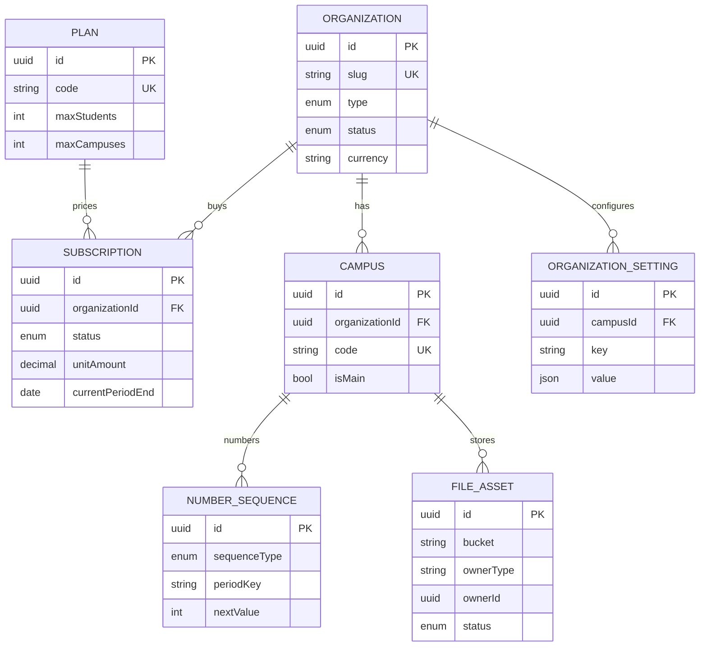
```mermaid
erDiagram
    PLAN ||--o{ SUBSCRIPTION : prices
    ORGANIZATION ||--o{ SUBSCRIPTION : buys
    ORGANIZATION ||--o{ CAMPUS : has
    ORGANIZATION ||--o{ ORGANIZATION_SETTING : configures
    CAMPUS ||--o{ NUMBER_SEQUENCE : numbers
    CAMPUS ||--o{ FILE_ASSET : stores
    PLAN {
        uuid id PK
        string code UK
        int maxStudents
        int maxCampuses
    }
    ORGANIZATION {
        uuid id PK
        string slug UK
        enum type
        enum status
        string currency
    }
    SUBSCRIPTION {
        uuid id PK
        uuid organizationId FK
        enum status
        decimal unitAmount
        date currentPeriodEnd
    }
    CAMPUS {
        uuid id PK
        uuid organizationId FK
        string code UK
        bool isMain
    }
    ORGANIZATION_SETTING {
        uuid id PK
        uuid campusId FK
        string key
        json value
    }
    NUMBER_SEQUENCE {
        uuid id PK
        enum sequenceType
        string periodKey
        int nextValue
    }
    FILE_ASSET {
        uuid id PK
        string bucket
        string ownerType
        uuid ownerId
        enum status
    }
```

`Organization` is the root of everything, and it also stores the current `planId` directly. `Campus` is the second level and appears on almost every operational table. Settings, number sequences and files carry an optional `campus_id`, so a school group can keep one rule for the whole organization or a different rule per branch. `FileAsset` is the only file table in the product: student photos, staff documents, receipts and report card PDFs all point at it by id.

**Figure: Authentication and RBAC**

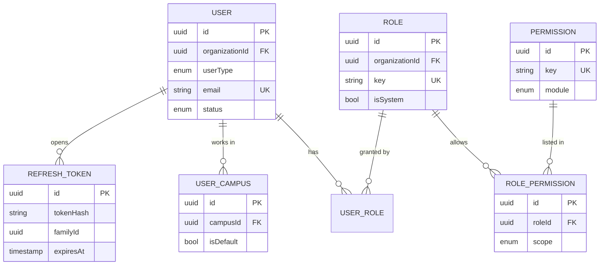
```mermaid
erDiagram
    USER ||--o{ USER_ROLE : has
    ROLE ||--o{ USER_ROLE : "granted by"
    ROLE ||--o{ ROLE_PERMISSION : allows
    PERMISSION ||--o{ ROLE_PERMISSION : "listed in"
    USER ||--o{ USER_CAMPUS : "works in"
    USER ||--o{ REFRESH_TOKEN : opens
    USER {
        uuid id PK
        uuid organizationId FK
        enum userType
        string email UK
        enum status
    }
    ROLE {
        uuid id PK
        uuid organizationId FK
        string key UK
        bool isSystem
    }
    PERMISSION {
        uuid id PK
        string key UK
        enum module
    }
    ROLE_PERMISSION {
        uuid id PK
        uuid roleId FK
        enum scope
    }
    USER_CAMPUS {
        uuid id PK
        uuid campusId FK
        bool isDefault
    }
    REFRESH_TOKEN {
        uuid id PK
        string tokenHash
        uuid familyId
        timestamp expiresAt
    }
```

Two more tables of this domain are not drawn because they hang off `USER` and would make the picture wide: `audit_logs` (who changed what, keyed by `entityType` plus `entityId`) and `login_histories`. `Permission` is platform data: 269 keys shared by all tenants. `Role` holds the seven system roles, which have `organizationId` null, plus the custom roles a tenant creates. `RolePermission.scope` carries the `ALL`, `CAMPUS`, `OWN` or `VIEW` reach used by the *RBAC and Permissions Matrix* chapter.

**Figure: Academics**

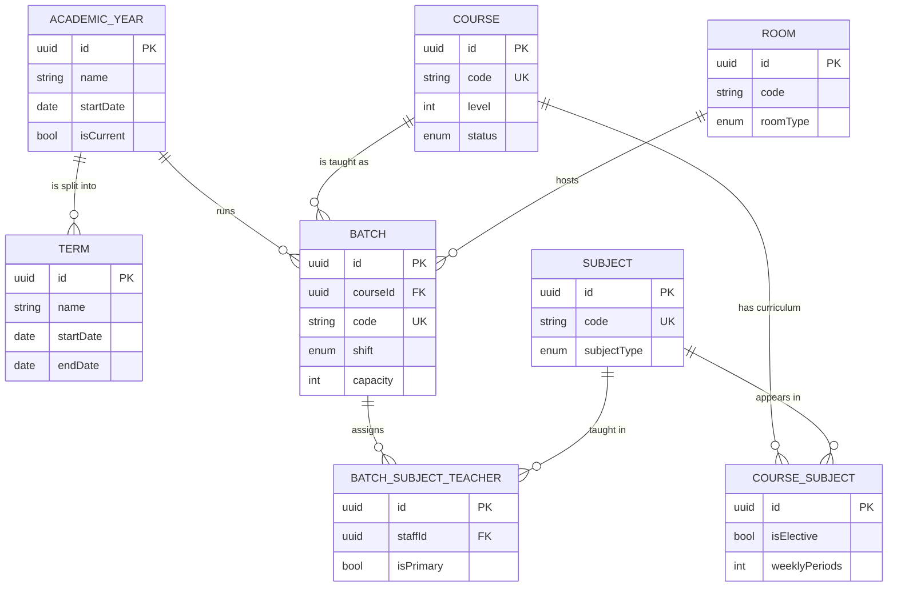
```mermaid
erDiagram
    ACADEMIC_YEAR ||--o{ TERM : "is split into"
    ACADEMIC_YEAR ||--o{ BATCH : runs
    COURSE ||--o{ BATCH : "is taught as"
    COURSE ||--o{ COURSE_SUBJECT : "has curriculum"
    SUBJECT ||--o{ COURSE_SUBJECT : "appears in"
    BATCH ||--o{ BATCH_SUBJECT_TEACHER : assigns
    SUBJECT ||--o{ BATCH_SUBJECT_TEACHER : "taught in"
    ROOM ||--o{ BATCH : hosts
    ACADEMIC_YEAR {
        uuid id PK
        string name
        date startDate
        bool isCurrent
    }
    TERM {
        uuid id PK
        string name
        date startDate
        date endDate
    }
    COURSE {
        uuid id PK
        string code UK
        int level
        enum status
    }
    BATCH {
        uuid id PK
        uuid courseId FK
        string code UK
        enum shift
        int capacity
    }
    SUBJECT {
        uuid id PK
        string code UK
        enum subjectType
    }
    COURSE_SUBJECT {
        uuid id PK
        bool isElective
        int weeklyPeriods
    }
    BATCH_SUBJECT_TEACHER {
        uuid id PK
        uuid staffId FK
        bool isPrimary
    }
    ROOM {
        uuid id PK
        string code
        enum roomType
    }
```

`AcademicYear` is the time spine of the whole product. `BatchSubjectTeacher` is a small table with a big job: it answers "which batches are mine?" for a teacher, so the RBAC `OWN` scope reads it on almost every request.

**Figure: People and admissions**

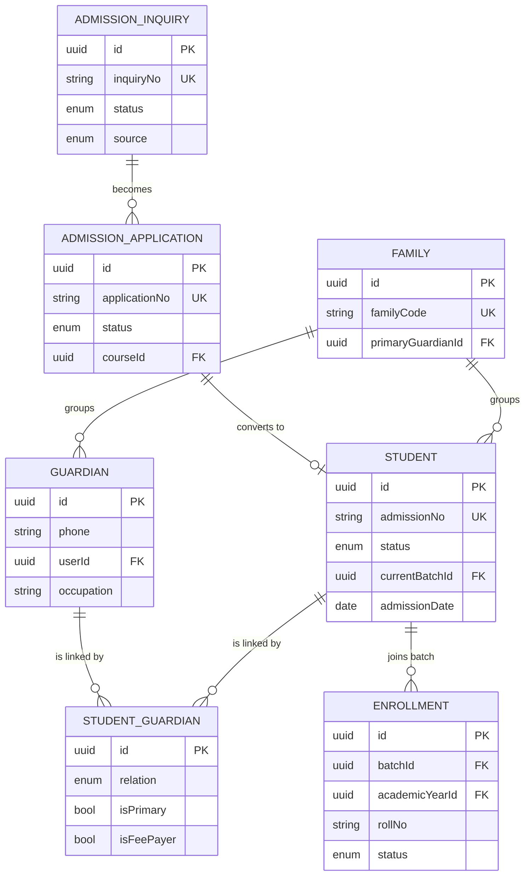
```mermaid
erDiagram
    FAMILY ||--o{ STUDENT : groups
    FAMILY ||--o{ GUARDIAN : groups
    STUDENT ||--o{ STUDENT_GUARDIAN : "is linked by"
    GUARDIAN ||--o{ STUDENT_GUARDIAN : "is linked by"
    STUDENT ||--o{ ENROLLMENT : "joins batch"
    ADMISSION_INQUIRY ||--o{ ADMISSION_APPLICATION : becomes
    ADMISSION_APPLICATION ||--o| STUDENT : "converts to"
    STUDENT {
        uuid id PK
        string admissionNo UK
        enum status
        uuid currentBatchId FK
        date admissionDate
    }
    GUARDIAN {
        uuid id PK
        string phone
        uuid userId FK
        string occupation
    }
    FAMILY {
        uuid id PK
        string familyCode UK
        uuid primaryGuardianId FK
    }
    STUDENT_GUARDIAN {
        uuid id PK
        enum relation
        bool isPrimary
        bool isFeePayer
    }
    ENROLLMENT {
        uuid id PK
        uuid batchId FK
        uuid academicYearId FK
        string rollNo
        enum status
    }
    ADMISSION_INQUIRY {
        uuid id PK
        string inquiryNo UK
        enum status
        enum source
    }
    ADMISSION_APPLICATION {
        uuid id PK
        string applicationNo UK
        enum status
        uuid courseId FK
    }
```

`Student` holds the profile; the login lives in `users` and is joined by the optional unique `userId`. `Enrollment` is the only place that knows which batch a student sits in for a given year. `Student.currentBatchId` is a cache of the active primary enrollment, so a student list of 1,200 rows needs no join.

**Figure: Attendance and leave**

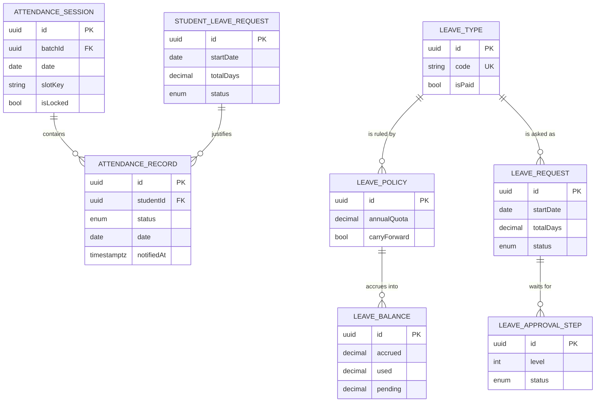
```mermaid
erDiagram
    ATTENDANCE_SESSION ||--o{ ATTENDANCE_RECORD : contains
    STUDENT_LEAVE_REQUEST ||--o{ ATTENDANCE_RECORD : justifies
    LEAVE_TYPE ||--o{ LEAVE_POLICY : "is ruled by"
    LEAVE_POLICY ||--o{ LEAVE_BALANCE : "accrues into"
    LEAVE_TYPE ||--o{ LEAVE_REQUEST : "is asked as"
    LEAVE_REQUEST ||--o{ LEAVE_APPROVAL_STEP : "waits for"
    ATTENDANCE_SESSION {
        uuid id PK
        uuid batchId FK
        date date
        string slotKey
        bool isLocked
    }
    ATTENDANCE_RECORD {
        uuid id PK
        uuid studentId FK
        enum status
        date date
        timestamptz notifiedAt
    }
    STUDENT_LEAVE_REQUEST {
        uuid id PK
        date startDate
        decimal totalDays
        enum status
    }
    LEAVE_TYPE {
        uuid id PK
        string code UK
        bool isPaid
    }
    LEAVE_POLICY {
        uuid id PK
        decimal annualQuota
        bool carryForward
    }
    LEAVE_BALANCE {
        uuid id PK
        decimal accrued
        decimal used
        decimal pending
    }
    LEAVE_REQUEST {
        uuid id PK
        date startDate
        decimal totalDays
        enum status
    }
    LEAVE_APPROVAL_STEP {
        uuid id PK
        int level
        enum status
    }
```

`attendance_records` is the highest-volume table in the product, so it keeps a copy of `batch_id` and `date` and is the first candidate for partitioning. Staff attendance sits in its own table because it stores check-in and check-out times with GPS coordinates, which student attendance does not have.

**Figure: Timetable and homework**

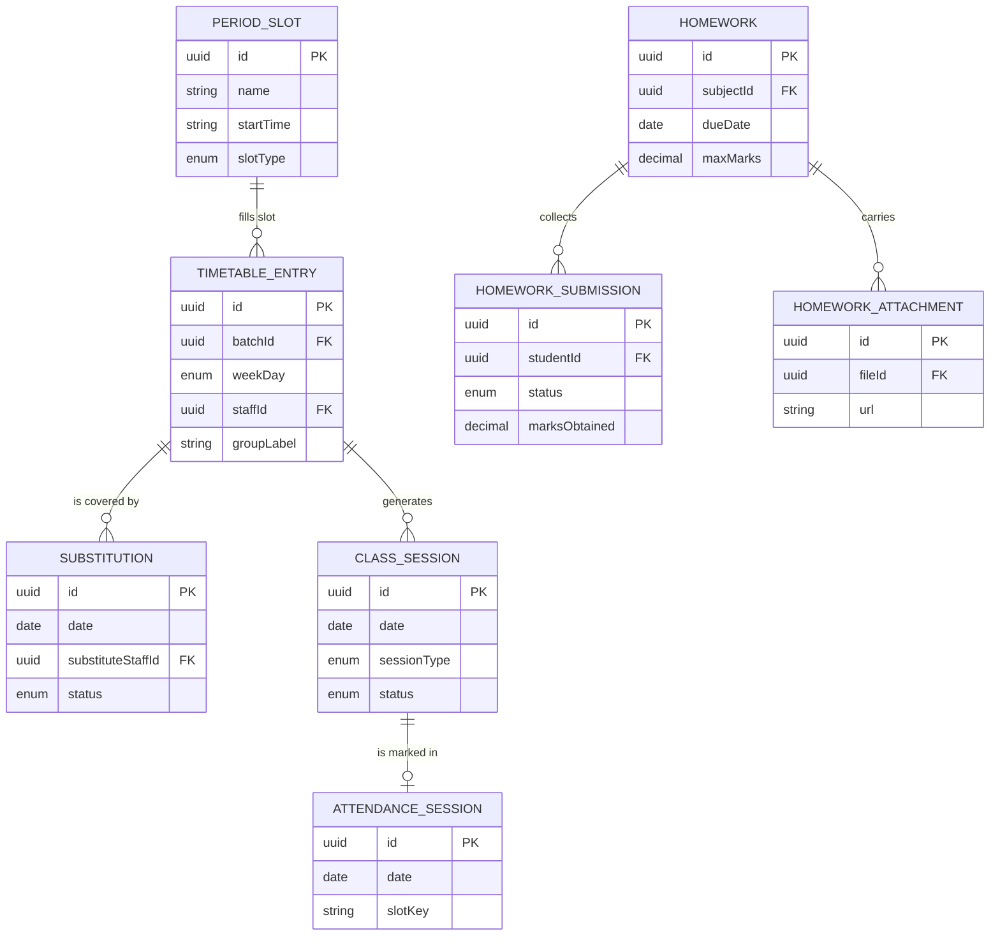
```mermaid
erDiagram
    PERIOD_SLOT ||--o{ TIMETABLE_ENTRY : "fills slot"
    TIMETABLE_ENTRY ||--o{ SUBSTITUTION : "is covered by"
    TIMETABLE_ENTRY ||--o{ CLASS_SESSION : generates
    CLASS_SESSION ||--o| ATTENDANCE_SESSION : "is marked in"
    HOMEWORK ||--o{ HOMEWORK_SUBMISSION : collects
    HOMEWORK ||--o{ HOMEWORK_ATTACHMENT : carries
    PERIOD_SLOT {
        uuid id PK
        string name
        string startTime
        enum slotType
    }
    TIMETABLE_ENTRY {
        uuid id PK
        uuid batchId FK
        enum weekDay
        uuid staffId FK
        string groupLabel
    }
    SUBSTITUTION {
        uuid id PK
        date date
        uuid substituteStaffId FK
        enum status
    }
    CLASS_SESSION {
        uuid id PK
        date date
        enum sessionType
        enum status
    }
    HOMEWORK {
        uuid id PK
        uuid subjectId FK
        date dueDate
        decimal maxMarks
    }
    HOMEWORK_SUBMISSION {
        uuid id PK
        uuid studentId FK
        enum status
        decimal marksObtained
    }
    HOMEWORK_ATTACHMENT {
        uuid id PK
        uuid fileId FK
        string url
    }
    ATTENDANCE_SESSION {
        uuid id PK
        date date
        string slotKey
    }
```

Three unique keys on `timetable_entries` stop a batch, a teacher or a room being booked twice in the same slot. `ClassSession` turns the weekly grid into dated lectures, which is what coaching institutes need for extra classes, doubt sessions and per-lecture faculty pay.

**Figure: Exams and report cards**

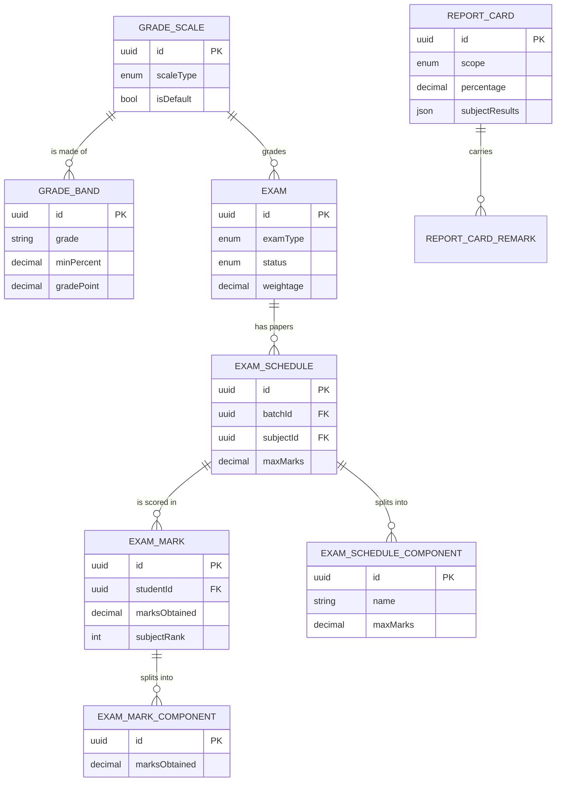
```mermaid
erDiagram
    GRADE_SCALE ||--o{ GRADE_BAND : "is made of"
    GRADE_SCALE ||--o{ EXAM : grades
    EXAM ||--o{ EXAM_SCHEDULE : "has papers"
    EXAM_SCHEDULE ||--o{ EXAM_MARK : "is scored in"
    EXAM_SCHEDULE ||--o{ EXAM_SCHEDULE_COMPONENT : "splits into"
    EXAM_MARK ||--o{ EXAM_MARK_COMPONENT : "splits into"
    REPORT_CARD ||--o{ REPORT_CARD_REMARK : carries
    GRADE_SCALE {
        uuid id PK
        enum scaleType
        bool isDefault
    }
    GRADE_BAND {
        uuid id PK
        string grade
        decimal minPercent
        decimal gradePoint
    }
    EXAM {
        uuid id PK
        enum examType
        enum status
        decimal weightage
    }
    EXAM_SCHEDULE {
        uuid id PK
        uuid batchId FK
        uuid subjectId FK
        decimal maxMarks
    }
    EXAM_MARK {
        uuid id PK
        uuid studentId FK
        decimal marksObtained
        int subjectRank
    }
    EXAM_SCHEDULE_COMPONENT {
        uuid id PK
        string name
        decimal maxMarks
    }
    EXAM_MARK_COMPONENT {
        uuid id PK
        decimal marksObtained
    }
    REPORT_CARD {
        uuid id PK
        enum scope
        decimal percentage
        json subjectResults
    }
```

`ExamMark.marksObtained` is the cached total of its components, so a marks list never sums child rows. `ReportCard.subjectResults` is a JSON snapshot: once a report card is published the numbers printed on the PDF must never move, even if a mark is corrected in a later re-evaluation.

**Figure: Fees, discounts and scholarships**

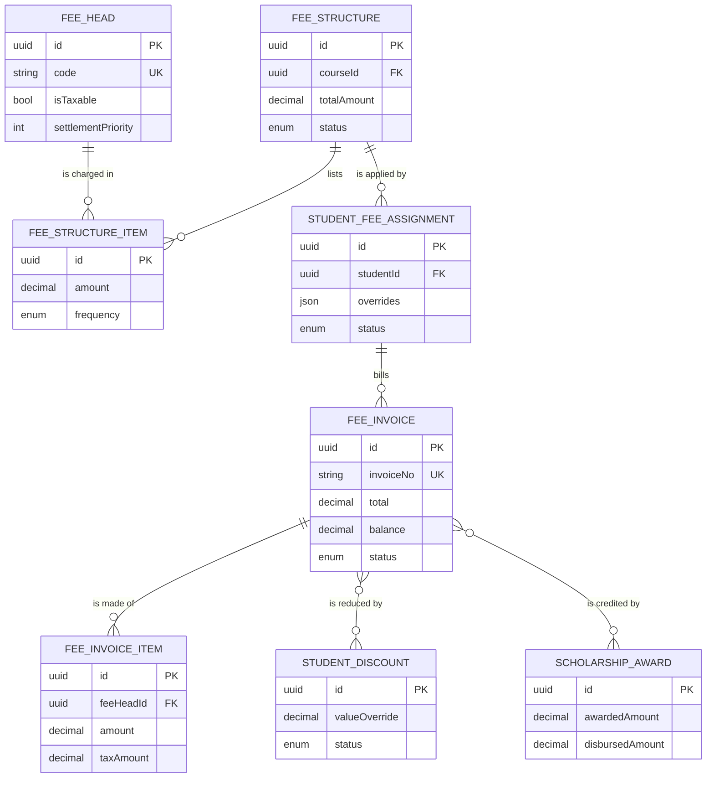
```mermaid
erDiagram
    FEE_HEAD ||--o{ FEE_STRUCTURE_ITEM : "is charged in"
    FEE_STRUCTURE ||--o{ FEE_STRUCTURE_ITEM : lists
    FEE_STRUCTURE ||--o{ STUDENT_FEE_ASSIGNMENT : "is applied by"
    STUDENT_FEE_ASSIGNMENT ||--o{ FEE_INVOICE : bills
    FEE_INVOICE ||--o{ FEE_INVOICE_ITEM : "is made of"
    FEE_INVOICE }o--o{ STUDENT_DISCOUNT : "is reduced by"
    FEE_INVOICE }o--o{ SCHOLARSHIP_AWARD : "is credited by"
    FEE_HEAD {
        uuid id PK
        string code UK
        bool isTaxable
        int settlementPriority
    }
    FEE_STRUCTURE {
        uuid id PK
        uuid courseId FK
        decimal totalAmount
        enum status
    }
    FEE_STRUCTURE_ITEM {
        uuid id PK
        decimal amount
        enum frequency
    }
    STUDENT_FEE_ASSIGNMENT {
        uuid id PK
        uuid studentId FK
        json overrides
        enum status
    }
    FEE_INVOICE {
        uuid id PK
        string invoiceNo UK
        decimal total
        decimal balance
        enum status
    }
    FEE_INVOICE_ITEM {
        uuid id PK
        uuid feeHeadId FK
        decimal amount
        decimal taxAmount
    }
    STUDENT_DISCOUNT {
        uuid id PK
        decimal valueOverride
        enum status
    }
    SCHOLARSHIP_AWARD {
        uuid id PK
        decimal awardedAmount
        decimal disbursedAmount
    }
```

One table is left out of the picture to keep it narrow: `fee_installments` holds the due-date schedule of a structure, for example installment 1 due 10 Apr and installment 2 due 10 Jul, and `FeeInvoice.installmentId` points back at it. `FeeInvoice` keeps cached money columns so a dues list of 1,200 students is one index scan. The two formulas are `total = subtotal - discountTotal + taxTotal + lateFee + adjustmentTotal` and `balance = total - scholarshipCredit - amountPaid - writtenOffAmount`. Both are recomputed inside the same transaction as every child change, never by a nightly job.

**Figure: Payments**

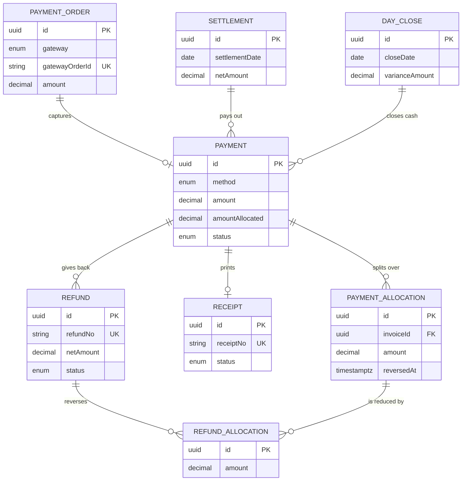
```mermaid
erDiagram
    PAYMENT_ORDER ||--o| PAYMENT : captures
    PAYMENT ||--o{ PAYMENT_ALLOCATION : "splits over"
    PAYMENT ||--o| RECEIPT : prints
    PAYMENT ||--o{ REFUND : "gives back"
    REFUND ||--o{ REFUND_ALLOCATION : reverses
    PAYMENT_ALLOCATION ||--o{ REFUND_ALLOCATION : "is reduced by"
    SETTLEMENT ||--o{ PAYMENT : "pays out"
    DAY_CLOSE ||--o{ PAYMENT : "closes cash"
    PAYMENT_ORDER {
        uuid id PK
        enum gateway
        string gatewayOrderId UK
        decimal amount
    }
    PAYMENT {
        uuid id PK
        enum method
        decimal amount
        decimal amountAllocated
        enum status
    }
    PAYMENT_ALLOCATION {
        uuid id PK
        uuid invoiceId FK
        decimal amount
        timestamptz reversedAt
    }
    RECEIPT {
        uuid id PK
        string receiptNo UK
        enum status
    }
    REFUND {
        uuid id PK
        string refundNo UK
        decimal netAmount
        enum status
    }
    REFUND_ALLOCATION {
        uuid id PK
        decimal amount
    }
    SETTLEMENT {
        uuid id PK
        date settlementDate
        decimal netAmount
    }
    DAY_CLOSE {
        uuid id PK
        date closeDate
        decimal varianceAmount
    }
```

Money is never edited in place. A wrong payment is cancelled and its allocations are reversed with a timestamp, so the ledger always adds up. The money a student is carrying as an advance is `Payment.amount - convenienceFee - convenienceFeeTax - amountAllocated - amountRefunded`.

**Figure: Communication**

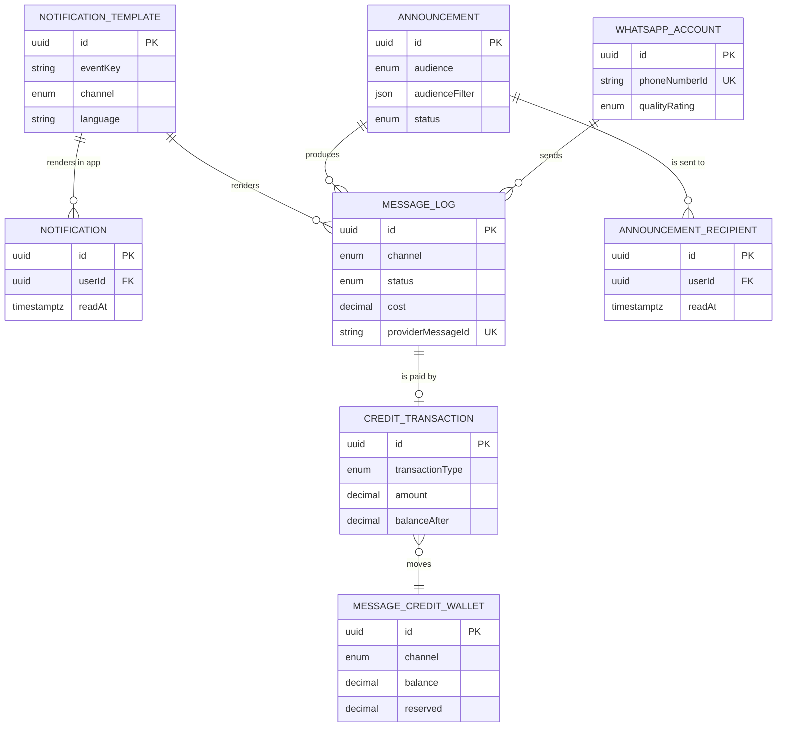
```mermaid
erDiagram
    NOTIFICATION_TEMPLATE ||--o{ NOTIFICATION : "renders in app"
    NOTIFICATION_TEMPLATE ||--o{ MESSAGE_LOG : renders
    ANNOUNCEMENT ||--o{ ANNOUNCEMENT_RECIPIENT : "is sent to"
    ANNOUNCEMENT ||--o{ MESSAGE_LOG : produces
    WHATSAPP_ACCOUNT ||--o{ MESSAGE_LOG : sends
    MESSAGE_LOG ||--o| CREDIT_TRANSACTION : "is paid by"
    CREDIT_TRANSACTION }o--|| MESSAGE_CREDIT_WALLET : moves
    NOTIFICATION_TEMPLATE {
        uuid id PK
        string eventKey
        enum channel
        string language
    }
    NOTIFICATION {
        uuid id PK
        uuid userId FK
        timestamptz readAt
    }
    ANNOUNCEMENT {
        uuid id PK
        enum audience
        json audienceFilter
        enum status
    }
    ANNOUNCEMENT_RECIPIENT {
        uuid id PK
        uuid userId FK
        timestamptz readAt
    }
    MESSAGE_LOG {
        uuid id PK
        enum channel
        enum status
        decimal cost
        string providerMessageId UK
    }
    MESSAGE_CREDIT_WALLET {
        uuid id PK
        enum channel
        decimal balance
        decimal reserved
    }
    CREDIT_TRANSACTION {
        uuid id PK
        enum transactionType
        decimal amount
        decimal balanceAfter
    }
    WHATSAPP_ACCOUNT {
        uuid id PK
        string phoneNumberId UK
        enum qualityRating
    }
```

`message_logs` is wide, high volume and never soft-deleted, because it is the proof that a fee reminder reached Sunita Devi. The wallet pair works like a bank account: `available = balance - reserved`, and a database CHECK stops two campaigns overdrawing it at the same moment.

**Figure: Library and inventory**

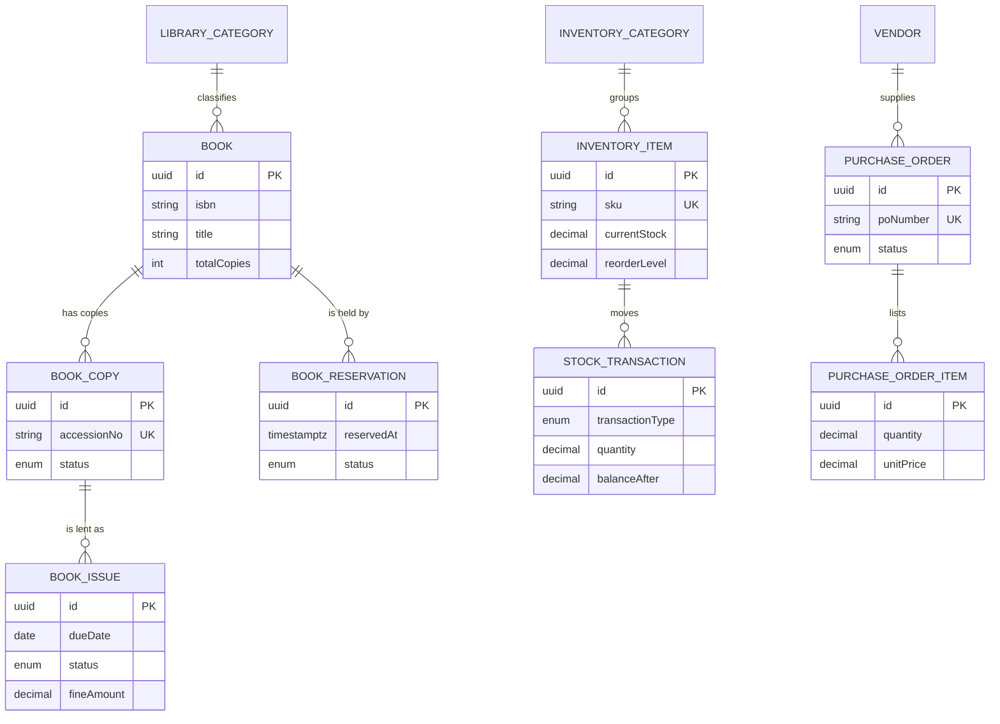
```mermaid
erDiagram
    LIBRARY_CATEGORY ||--o{ BOOK : classifies
    BOOK ||--o{ BOOK_COPY : "has copies"
    BOOK_COPY ||--o{ BOOK_ISSUE : "is lent as"
    BOOK ||--o{ BOOK_RESERVATION : "is held by"
    INVENTORY_CATEGORY ||--o{ INVENTORY_ITEM : groups
    INVENTORY_ITEM ||--o{ STOCK_TRANSACTION : moves
    VENDOR ||--o{ PURCHASE_ORDER : supplies
    PURCHASE_ORDER ||--o{ PURCHASE_ORDER_ITEM : lists
    BOOK {
        uuid id PK
        string isbn
        string title
        int totalCopies
    }
    BOOK_COPY {
        uuid id PK
        string accessionNo UK
        enum status
    }
    BOOK_ISSUE {
        uuid id PK
        date dueDate
        enum status
        decimal fineAmount
    }
    BOOK_RESERVATION {
        uuid id PK
        timestamptz reservedAt
        enum status
    }
    INVENTORY_ITEM {
        uuid id PK
        string sku UK
        decimal currentStock
        decimal reorderLevel
    }
    STOCK_TRANSACTION {
        uuid id PK
        enum transactionType
        decimal quantity
        decimal balanceAfter
    }
    PURCHASE_ORDER {
        uuid id PK
        string poNumber UK
        enum status
    }
    PURCHASE_ORDER_ITEM {
        uuid id PK
        decimal quantity
        decimal unitPrice
    }
```

`stock_transactions` is an append-only ledger with a running `balanceAfter`, the same pattern as the credit wallet. A stock correction is a new `ADJUST` row, never an edit of an old one.

**Figure: Transport and hostel**

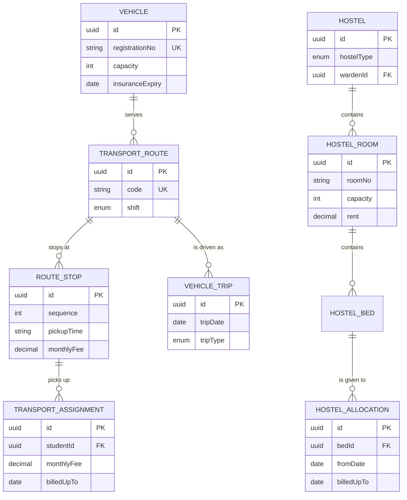
```mermaid
erDiagram
    VEHICLE ||--o{ TRANSPORT_ROUTE : serves
    TRANSPORT_ROUTE ||--o{ ROUTE_STOP : "stops at"
    ROUTE_STOP ||--o{ TRANSPORT_ASSIGNMENT : "picks up"
    TRANSPORT_ROUTE ||--o{ VEHICLE_TRIP : "is driven as"
    HOSTEL ||--o{ HOSTEL_ROOM : contains
    HOSTEL_ROOM ||--o{ HOSTEL_BED : contains
    HOSTEL_BED ||--o{ HOSTEL_ALLOCATION : "is given to"
    VEHICLE {
        uuid id PK
        string registrationNo UK
        int capacity
        date insuranceExpiry
    }
    TRANSPORT_ROUTE {
        uuid id PK
        string code UK
        enum shift
    }
    ROUTE_STOP {
        uuid id PK
        int sequence
        string pickupTime
        decimal monthlyFee
    }
    TRANSPORT_ASSIGNMENT {
        uuid id PK
        uuid studentId FK
        decimal monthlyFee
        date billedUpTo
    }
    VEHICLE_TRIP {
        uuid id PK
        date tripDate
        enum tripType
    }
    HOSTEL {
        uuid id PK
        enum hostelType
        uuid wardenId FK
    }
    HOSTEL_ROOM {
        uuid id PK
        string roomNo
        int capacity
        decimal rent
    }
    HOSTEL_ALLOCATION {
        uuid id PK
        uuid bedId FK
        date fromDate
        date billedUpTo
    }
```

Both domains bill into the fee system instead of keeping money tables of their own. The invoice worker reads `monthlyFee` or `monthlyRent`, writes a `FeeInvoiceItem` under the linked `feeHeadId`, then moves `billedUpTo` forward, so a retried job can never bill the same month twice.

**Figure: Payroll**

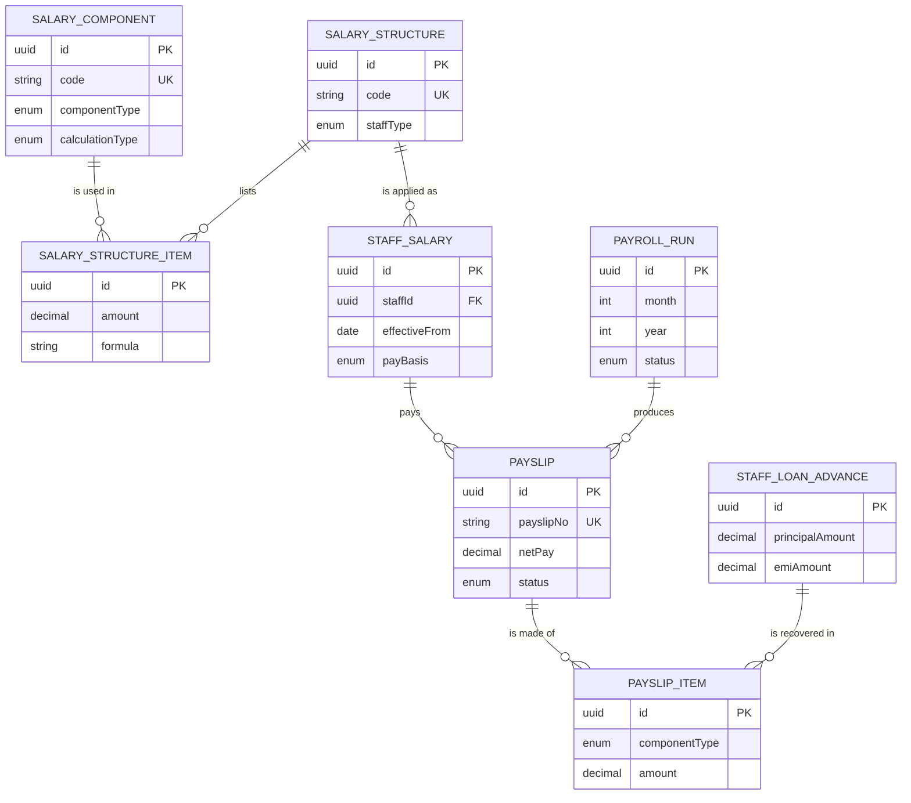
```mermaid
erDiagram
    SALARY_COMPONENT ||--o{ SALARY_STRUCTURE_ITEM : "is used in"
    SALARY_STRUCTURE ||--o{ SALARY_STRUCTURE_ITEM : lists
    SALARY_STRUCTURE ||--o{ STAFF_SALARY : "is applied as"
    STAFF_SALARY ||--o{ PAYSLIP : pays
    PAYROLL_RUN ||--o{ PAYSLIP : produces
    PAYSLIP ||--o{ PAYSLIP_ITEM : "is made of"
    STAFF_LOAN_ADVANCE ||--o{ PAYSLIP_ITEM : "is recovered in"
    SALARY_COMPONENT {
        uuid id PK
        string code UK
        enum componentType
        enum calculationType
    }
    SALARY_STRUCTURE {
        uuid id PK
        string code UK
        enum staffType
    }
    SALARY_STRUCTURE_ITEM {
        uuid id PK
        decimal amount
        string formula
    }
    STAFF_SALARY {
        uuid id PK
        uuid staffId FK
        date effectiveFrom
        enum payBasis
    }
    PAYROLL_RUN {
        uuid id PK
        int month
        int year
        enum status
    }
    PAYSLIP {
        uuid id PK
        string payslipNo UK
        decimal netPay
        enum status
    }
    PAYSLIP_ITEM {
        uuid id PK
        enum componentType
        decimal amount
    }
    STAFF_LOAN_ADVANCE {
        uuid id PK
        decimal principalAmount
        decimal emiAmount
    }
```

A salary revision is a new `StaffSalary` row with a new `effectiveFrom`, never an edit of the old row. `PayslipItem` freezes the calculated value at processing time, so re-opening a payslip six months later shows exactly what was paid.

**Figure: Certificates**

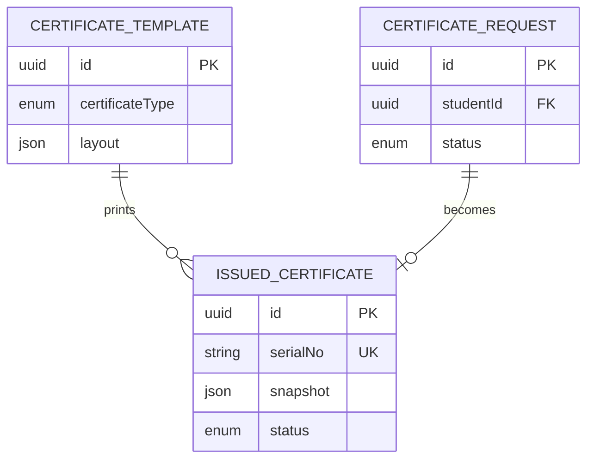
```mermaid
erDiagram
    CERTIFICATE_TEMPLATE ||--o{ ISSUED_CERTIFICATE : prints
    CERTIFICATE_REQUEST ||--o| ISSUED_CERTIFICATE : becomes
    CERTIFICATE_TEMPLATE {
        uuid id PK
        enum certificateType
        json layout
    }
    CERTIFICATE_REQUEST {
        uuid id PK
        uuid studentId FK
        enum status
    }
    ISSUED_CERTIFICATE {
        uuid id PK
        string serialNo UK
        json snapshot
        enum status
    }
```

A parent asks for a bonafide certificate in the Parent Portal, an admin approves it, and the PDF is printed from the template. `IssuedCertificate.snapshot` freezes the student data of that day, so a certificate printed in 2027 still shows the 2027 address. A wrong certificate is revoked and re-issued with a new serial number.

**Figure: Analytics and AI**

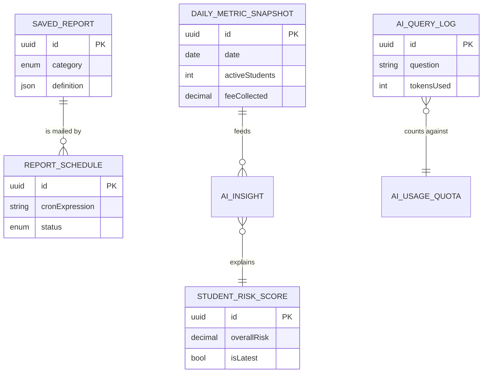
```mermaid
erDiagram
    SAVED_REPORT ||--o{ REPORT_SCHEDULE : "is mailed by"
    DAILY_METRIC_SNAPSHOT ||--o{ AI_INSIGHT : feeds
    AI_INSIGHT }o--|| STUDENT_RISK_SCORE : explains
    AI_QUERY_LOG }o--|| AI_USAGE_QUOTA : "counts against"
    SAVED_REPORT {
        uuid id PK
        enum category
        json definition
    }
    REPORT_SCHEDULE {
        uuid id PK
        string cronExpression
        enum status
    }
    DAILY_METRIC_SNAPSHOT {
        uuid id PK
        date date
        int activeStudents
        decimal feeCollected
    }
    STUDENT_RISK_SCORE {
        uuid id PK
        decimal overallRisk
        bool isLatest
    }
    AI_QUERY_LOG {
        uuid id PK
        string question
        int tokensUsed
    }
```

`daily_metric_snapshots` is the read model of the product. Dashboards and AI insights read one small row per campus per day instead of scanning millions of attendance and payment rows.

## How the Domains Join Up

The pictures above show each domain alone. In real work the interesting joins cross domain lines. These are the ones you will use every week.

- **Organization to everything.** `organization_id` is on 181 of the 189 models. The eight platform tables without it are `countries`, `currencies`, `exchange_rates`, `plans`, `plan_prices`, `plan_features`, `permissions` and `organizations` itself.
- **Academic year is the time spine.** `batches`, `enrollments`, `fee_invoices`, `exams`, `report_cards`, `leave_balances`, `transport_assignments`, `hostel_allocations` and `scholarship_awards` all carry `academic_year_id`. Closing a year is therefore a filter change, not a data migration.
- **Person profile and login are two tables.** `students`, `guardians` and `staff` each hold an optional unique `user_id`. Aarav Sharma can exist as a student for two years before he ever gets a Student Portal login.
- **Enrollment is the academic join.** It connects `students`, `batches`, `courses` and `academic_years`, keeps the roll number, and keeps history when the student moves batch. `students.current_batch_id` is a denormalised copy of the active primary enrollment.
- **Teaching reach comes from one table.** `batch_subject_teachers` tells the RBAC layer which batches belong to Priya Nair. Attendance, homework and marks endpoints filter on it when the permission scope is `OWN`.
- **The money chain is four steps.** `fee_structures` to `student_fee_assignments` to `fee_invoices` to `fee_invoice_items` on the billing side; `payments` to `payment_allocations` to `fee_invoices` on the collection side; `refunds` to `refund_allocations` to `payment_allocations` on the reversal side.
- **Operations bill through fees.** `transport_assignments.fee_head_id` and `hostel_allocations.fee_head_id` make the invoice worker add a transport or hostel line to the next invoice. Library fines sit on `book_issues.fine_amount` and are pushed to an invoice only when the institute turns that setting on.
- **Communication debits a wallet.** Every WhatsApp or SMS row in `message_logs` has one `CONSUME` row in `credit_transactions` against `message_credit_wallets`. A failed message writes a `REFUND` row instead of editing the consume row.
- **Files are central.** Nothing stores an S3 key in its own column; every domain points at `file_assets` by id.
- **Audit is polymorphic and has no foreign keys.** `audit_logs.entity_type` plus `entity_id` can point at any row in any table. Foreign keys are deliberately absent so that an audit row survives the deletion of the thing it describes.
- **Custom fields are polymorphic too.** `custom_field_definitions` plus `custom_field_values` use `entity_type` and `entity_id`. A copy is cached in `students.custom_fields` as JSON so the profile screen reads one row.

## Indexing Strategy

Indexes are not decoration. Every index on EduFlow exists because a real screen or a real worker runs that query many times a day. The table below pairs the screen with the index that serves it.

| Screen or job | Filter and sort | Index that serves it |
|---|---|---|
| Student list, campus filter | `org, campus, status`, sort name | `students(organization_id, campus_id, status)` |
| Student quick search `?q=aarav` | contains match on name or admission no | GIN trigram `idx_students_search_trgm` |
| Batch student list | `org, current_batch_id, status` | `students(organization_id, current_batch_id, status)` |
| Monthly attendance of one student | `org, student_id, date` range | `attendance_records(organization_id, student_id, date)` |
| Daily batch register | `org, batch_id, date, status` | `attendance_records(organization_id, batch_id, date, status)` |
| Fee dues list of a campus | `org, campus, status`, sort due date | `fee_invoices(organization_id, campus_id, status, due_date)` |
| Late fee worker | `org, status, due_date < today` | `fee_invoices(organization_id, status, due_date)` |
| Day book and collection report | `org, campus, payment_date, method` | `payments(organization_id, campus_id, payment_date, method)` |
| Cheques to deposit today | `org, cheque_status, cheque_date` | `payments(organization_id, cheque_status, cheque_date)` |
| Notification bell badge | `org, user_id, read_at is null` | `notifications(organization_id, user_id, read_at, created_at)` |
| WhatsApp delivery webhook | `provider, provider_message_id` | unique `message_logs(provider, provider_message_id)` |
| Audit trail of one record | `org, entity_type, entity_id` | `audit_logs(organization_id, entity_type, entity_id)` |

Here is the dues query exactly as the API runs it, and the plan it must produce.

```sql
SELECT id, invoice_no, student_id, due_date, total, balance, status
FROM fee_invoices
WHERE organization_id = $1
  AND campus_id = $2
  AND status IN ('ISSUED', 'PARTIALLY_PAID', 'OVERDUE')
  AND deleted_at IS NULL
ORDER BY due_date ASC
LIMIT 20 OFFSET 0;
```

The index `(organization_id, campus_id, status, due_date)` covers the three equality columns first and the sort column last, so PostgreSQL walks the index and stops after 20 rows. No sort node, no heap scan of the whole table.

Seven rules keep the index list honest:

1. Every tenant index starts with `organization_id`. It is the most selective column in a shared database, and it also lets PostgreSQL use the index under row-level security.
2. Equality columns first, then the range or sort column last. `(organization_id, campus_id, status, due_date)`, never `(due_date, status, ...)`.
3. Add `campus_id` second when the screen has a campus filter, which is almost every operational screen.
4. Free-text search uses a GIN trigram index, not `LIKE '%x%'` on a B-tree. The `pg_trgm` extension is created in the first SQL migration.
5. Uniqueness that depends on a status or on `deleted_at` is a partial unique index, written in raw SQL, because Prisma cannot express a `WHERE` clause on `@@unique`.
6. No index on a lone boolean or a lone low-value enum. `status` is useful only after `organization_id`.
7. A hot table gets at most about ten indexes. Every extra index slows every insert. Once a month, list unused indexes with `pg_stat_user_indexes` where `idx_scan = 0` and drop them after review.

> **Warning:** Never add an index in a normal migration on a big live table. Use `CREATE INDEX CONCURRENTLY` in a raw SQL migration that runs outside a transaction, otherwise the table is locked for writes while the index builds.

## Constraints and Data Integrity

Three layers protect the data: Zod validation in the API, service-layer rules, and the database itself. Only the database layer cannot be bypassed, so anything that must always be true lives there.

### Per-tenant unique keys

A uniqueness rule is always scoped to the tenant. Two institutes may both use admission number `BF-2027-0142`.

| Table | Unique key | What it prevents |
|---|---|---|
| `students` | `(organization_id, admission_no)` | Two students with one admission number |
| `students` | `(organization_id, rfid_card_no)` | One gate card used by two children |
| `users` | `(organization_id, user_type, email)` | Two staff logins on one email |
| `roles` | `(organization_id, key)` | Two custom roles with one key |
| `fee_invoices` | `(organization_id, invoice_no)` | Duplicate invoice numbers in GST records |
| `receipts` | `(organization_id, receipt_no)` | Two receipts with one number |
| `payments` | `(organization_id, idempotency_key)` | Double charge on a retried request |
| `timetable_entries` | three keys: batch, teacher, room slot | Double booking in one period |

### Partial unique indexes added by SQL migration

Prisma cannot write a `WHERE` clause on a unique constraint, so these are raw SQL inside the normal migration files. They are the rules that hold only for live rows.

| Index name | Table | Condition |
|---|---|---|
| `uq_academic_year_current` | `academic_years` | one row `WHERE is_current AND deleted_at IS NULL` |
| `uq_campus_main` | `campuses` | one row `WHERE is_main AND deleted_at IS NULL` |
| `uq_subscription_live` | `subscriptions` | one row `WHERE status IN ('TRIALING','ACTIVE')` |
| `uq_enrollment_batch_roll` | `enrollments` | `WHERE status = 'ACTIVE' AND deleted_at IS NULL` |
| `uq_fee_invoice_installment` | `fee_invoices` | `WHERE status <> 'CANCELLED' AND deleted_at IS NULL` |
| `uq_payment_allocation_active` | `payment_allocations` | `WHERE reversed_at IS NULL` |
| `uq_book_issue_open` | `book_issues` | `WHERE status IN ('ISSUED','OVERDUE')` |
| `uq_payslip_staff_month` | `payslips` | `WHERE run_type = 'REGULAR' AND status <> 'CANCELLED'` |

### Check constraints

Three CHECK constraints are already named in the schema comments. The rest of this list is decided here and added in the same migration, because each one closes a bug that would otherwise cost money or trust.

```sql
-- already in the schema comments
ALTER TABLE users ADD CONSTRAINT ck_users_platform_tenant
  CHECK ((user_type = 'PLATFORM') = (organization_id IS NULL));
ALTER TABLE roles ADD CONSTRAINT ck_roles_system_tenant
  CHECK (is_system = (organization_id IS NULL));
ALTER TABLE message_credit_wallets ADD CONSTRAINT ck_wallet_non_negative
  CHECK (balance >= 0 AND reserved >= 0 AND reserved <= balance);

-- decided here, added in the same migration
ALTER TABLE payments ADD CONSTRAINT ck_payment_amount_positive
  CHECK (amount > 0);
ALTER TABLE payments ADD CONSTRAINT ck_payment_not_over_used
  CHECK (amount_allocated + amount_refunded <= amount);
ALTER TABLE fee_invoices ADD CONSTRAINT ck_invoice_non_negative
  CHECK (subtotal >= 0 AND tax_total >= 0 AND late_fee >= 0
         AND amount_paid >= 0 AND written_off_amount >= 0);
ALTER TABLE academic_years ADD CONSTRAINT ck_year_dates
  CHECK (end_date > start_date);
ALTER TABLE leave_requests ADD CONSTRAINT ck_leave_dates
  CHECK (end_date >= start_date);
ALTER TABLE exam_schedules ADD CONSTRAINT ck_exam_pass_marks
  CHECK (pass_marks <= max_marks AND max_marks > 0);
ALTER TABLE hostel_rooms ADD CONSTRAINT ck_hostel_capacity
  CHECK (capacity > 0 AND rent >= 0);
```

> **Rule:** A CHECK constraint is for a rule that is true for every tenant, in every country, forever. A rule that one institute may switch off belongs in the service layer, not in the database.

### Foreign key delete rules

| Rule | Where it is used | Reason |
|---|---|---|
| `Restrict` | Organization, campus, student, batch, statutory records | Nothing may quietly delete a register |
| `SetNull` | Optional pointers: photo file, room, class teacher | The parent may go, the child stays valid |
| `Cascade` | Only true child rows: invoice items, payslip items | The child has no meaning alone |
| Composite | Cross-domain parents: `[id, organization_id]` | The database itself blocks cross-tenant rows |

No financial table uses `Cascade` on its parent. Deleting a payment is impossible; the only path is cancel or refund.

### Records that never change

These tables are write-once. The application never issues an `UPDATE` or `DELETE` on them, and a database trigger blocks both for the `eduflow_app` role.

`audit_logs`, `login_histories`, `credit_transactions`, `stock_transactions`, `student_status_histories`, `staff_status_histories`, `import_job_row_errors`, `fee_reminder_logs`, `ai_query_logs`.

Financial rows are almost as strict: `payments`, `receipts`, `payment_allocations`, `refunds`, `payslips` and `issued_certificates` may change status but never amounts. A mistake is corrected with a reversing row: a cancelled receipt, a reversed allocation, a credit note in `fee_invoice_adjustments`, an `ADJUST` stock row. A `LOCKED` payroll run can never be reopened; a correction goes into an off-cycle run.

## Soft Delete Rules

84 of the 189 models carry `deleted_at`. The other 105 are either append-only logs or child rows that die with their parent.

| Question | Answer |
|---|---|
| Who gets `deleted_at`? | Master data and business records a user can remove by mistake |
| Who does not? | Ledgers, logs, statutory registers, pure child rows |
| Who filters it? | The Prisma tenant extension adds `deletedAt: null` to every read |
| How long can it be restored? | 30 days, from a "Recently deleted" list in *Settings Module* |
| What happens after? | A nightly purge job hard-deletes rows older than 30 days |
| What about unique keys? | Every unique rule on a soft-deletable table is a partial index with `deleted_at IS NULL` |

Four records can never be soft-deleted, whatever the user asks: `payments`, `receipts`, `attendance_records` and `issued_certificates`. A fee invoice can be deleted only while it is still `DRAFT`; once issued it can only be cancelled.

> **Warning:** A soft delete does not satisfy a DPDP deletion request. Real erasure is handled by anonymisation: `students.anonymized_at` is set and the personal columns are overwritten, while the financial rows stay for the statutory retention period. See *Privacy and Compliance*.

## Enum Strategy

The schema has 186 PostgreSQL enums. 16 shared ones live in `00-base.prisma`; the rest sit in the domain that owns them.

| Decision | Rule |
|---|---|
| Use an enum | The value list is fixed by EduFlow and short, such as `PaymentStatus` |
| Use a table | Tenants define their own values: fee heads, leave types, custom roles |
| Use a varchar | The value comes from an outside system: provider error codes, WhatsApp template names |
| Naming | UPPER_SNAKE_CASE values, PascalCase type name, no numbers |
| Shared or local | Shared only when two or more domain files need it |

Adding a value is safe. PostgreSQL 12 and later allow `ALTER TYPE ... ADD VALUE` inside a transaction, but the new value cannot be used in that same transaction, so the migration adds the value and the code that writes it ships in the next deploy. Renaming or removing a value is a breaking change and must go through the expand-and-contract steps below.

## JSON Column Rules

There are 64 `Json` columns in the schema. Prisma maps `Json` to `jsonb` on PostgreSQL, so the value is stored parsed and can be indexed.

JSON is allowed for exactly five jobs:

1. **Tenant settings** that differ per institute: `organization_settings.value`.
2. **Snapshots that must never change**: `issued_certificates.snapshot`, `report_cards.subject_results`, `payslips` frozen totals.
3. **Provider payloads kept for debugging**: `webhook_events.payload` and `headers`.
4. **User-built definitions**: `saved_reports.definition`, `certificate_templates.layout`, `announcements.audience_filter`.
5. **Caches of normalised data**: `students.custom_fields`, which mirrors `custom_field_values`.

Five rules apply to all of them:

- Never store money that has to be summed across rows. Sums come from `numeric` columns.
- Never store a value that a list screen filters or sorts on. If a filter is needed, add a real column.
- Always validate with a Zod schema in `shared/` before the write, and export the matching TypeScript type so the client and the server agree.
- Keep a document under 100 KB. Bigger payloads go to S3 and the row keeps a `file_asset_id`.
- Add a GIN index on a JSON column only when a named query needs it, and write that query in the migration comment.

```typescript
// shared/src/settings/attendance.ts
import { z } from 'zod';

export const attendanceSettingSchema = z.object({
  mode: z.enum(['DAILY', 'PERIOD_WISE']),
  lockAfterHours: z.number().int().min(1).max(168).default(48),
  notifyParentOnAbsent: z.boolean().default(true),
  minAttendancePercent: z.number().min(0).max(100).default(75),
});

export type AttendanceSetting = z.infer<typeof attendanceSettingSchema>;
```

## Migrations with Prisma

The schema folder `server/prisma/schema/` holds the 14 `.prisma` files. Prisma 6 reads the folder when `prismaSchemaFolder` is on. Migrations are plain SQL files in `server/prisma/migrations/`, committed to Git and reviewed like code.

| Step | Command | Where |
|---|---|---|
| Change the model | edit the right `.prisma` file | laptop |
| Create the migration | `npx prisma migrate dev --name add_late_fee_waiver` | laptop |
| Check the SQL by hand | read the generated `migration.sql` | laptop |
| Run the tests | `npm run test` including the tenant isolation suite | CI |
| Apply to staging | `npx prisma migrate deploy` | GitHub Actions |
| Apply to production | `npx prisma migrate deploy` before the new image starts | GitHub Actions |

Rules that are not negotiable:

- `prisma db push` is for throwaway local experiments only. It never touches staging or production.
- Migrations run as the owner role, which bypasses row-level security. The runtime role `eduflow_app` has no DDL rights.
- Every migration that creates a table with `organization_id` must also enable RLS and create the policy in the same file. A CI test lists tables with `organization_id` and no policy, and fails the build.
- Set `SET lock_timeout = '3s';` at the top of any migration that alters a large table. A blocked migration should fail fast, not freeze fee collection.
- Back-fills never run inside the migration. They run as a BullMQ job in batches of 5,000 rows with a short sleep between batches.

### Expand and contract, with a real example

Renaming or tightening a column in one deploy breaks the running old code for the seconds between migration and restart. EduFlow always splits the change into four deploys. Example: `fee_invoices.late_fee_waived_amount` has to become `NOT NULL` with a default of 0.

**Figure: Expand and contract for a zero-downtime column change**

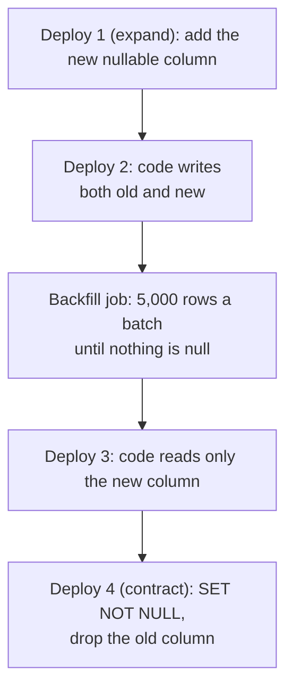
```mermaid
flowchart TD
    A["Deploy 1 (expand): add the new nullable column"] --> B["Deploy 2: code writes<br/>both old and new"]
    B --> C["Backfill job: 5,000 rows a batch<br/>until nothing is null"]
    C --> D["Deploy 3: code reads only the new column"]
    D --> E["Deploy 4 (contract): SET NOT NULL,<br/>drop the old column"]
```

Each box is a separate pull request and a separate release. At every moment the running code works with the current shape of the table, so nothing has to be taken offline.

| Change | Safe in one deploy? | Path |
|---|---|---|
| Add a nullable column | Yes | One migration |
| Add a column with a default | Yes | PostgreSQL 11 and later do not rewrite the table |
| Add an index | Yes, with care | `CREATE INDEX CONCURRENTLY` in raw SQL |
| Make a column `NOT NULL` | No | Expand, backfill, contract |
| Rename a column | No | Add new, dual-write, backfill, drop old |
| Add an enum value | Yes | Value first, code next deploy |
| Remove an enum value | No | Migrate rows, then drop the value |
| Drop a table | No | Stop writing, wait one release, then drop |

## Seed Data

Seeding is one idempotent script, `server/prisma/seed.ts`, built on `upsert`. It can be run any number of times on any environment and always leaves the same result.

| Order | What is seeded | Rows | Where it runs |
|---|---|---|---|
| 1 | Countries, currencies, exchange rates | 6 countries, 6 currencies | All |
| 2 | Plans, plan prices, plan features | 4 plans, 32 prices | All |
| 3 | Permissions | 269 keys | All |
| 4 | System roles and their permissions | 7 roles | All |
| 5 | EduFlow default notification templates | about 60, `organization_id` null | All |
| 6 | Demo organization Bright Future Public School | 2 campuses, 120 students | Local, staging |
| 7 | Demo organization Sharma Classes | 1 centre, 60 students | Local, staging |

The first five steps are reference data and run in production too. Steps 6 and 7 are guarded by `if (process.env.NODE_ENV !== 'production')`. Demo data uses the canon names so that a screenshot from a developer laptop matches a screenshot from a sales demo.

> **Tip:** Seed permissions from the same Markdown registry the documents use. A script reads `docs/permissions.md`, so a new permission key can never exist in the PRD and be missing in the database.

## Row-Level Security in Short

Row-level security is the second safety net under the Prisma tenant extension. The full design, the policies and the isolation test suite are in *Multi-Tenancy and Data Isolation*. The short version:

- Every table with `organization_id` has RLS enabled and one policy: `organization_id = current_setting('app.current_org')::uuid`.
- The API opens each request transaction with `SET LOCAL app.current_org = $orgId`, taken from the JWT, never from the request body.
- The runtime role `eduflow_app` is not a superuser and does not have `BYPASSRLS`. Even a forgotten `where` clause returns nothing from another tenant.
- Platform tables have no policy because they have no tenant.

## Partitioning and Archival

Four tables grow without limit. They are partitioned by range on a date column as soon as they cross 100 million rows or 50 GB, which the estimates below place at roughly 1,000 customers.

| Table | Partition key | Interval | Keep live |
|---|---|---|---|
| `attendance_records` | `date` | Monthly | Current plus 3 academic years |
| `audit_logs` | `created_at` | Monthly | 24 months |
| `message_logs` | `created_at` | Monthly | 12 months |
| `notifications` | `created_at` | Monthly | 90 days |
| `login_histories` | `created_at` | Monthly | 12 months |

Prisma has no syntax for declarative partitioning, so it is done in raw SQL migrations. Prisma keeps treating the parent table as an ordinary table, which is exactly what we want: no application code changes.

```sql
-- one-time conversion, run during a maintenance window
ALTER TABLE audit_logs RENAME TO audit_logs_old;

CREATE TABLE audit_logs (LIKE audit_logs_old INCLUDING DEFAULTS)
  PARTITION BY RANGE (created_at);

ALTER TABLE audit_logs ADD PRIMARY KEY (id, created_at);

CREATE TABLE audit_logs_2027_01 PARTITION OF audit_logs
  FOR VALUES FROM ('2027-01-01') TO ('2027-02-01');

INSERT INTO audit_logs SELECT * FROM audit_logs_old;
DROP TABLE audit_logs_old;
```

Note the primary key: a partitioned table must include the partition key in every unique constraint, so `id` alone becomes `(id, created_at)`. A monthly BullMQ job creates the next three months of partitions in advance, so a missing partition can never reject an insert.

Archival is three steps, run by a monthly job: detach the oldest partition, copy it to S3 as gzipped CSV with a manifest, then drop it. Restoring is the reverse and is rehearsed once a year. Archived attendance and audit data is still available to support staff through a read-only query tool that reads the S3 copy; it is not restored into the live database.

## Data Retention

Retention is driven by Indian law first, then by the strictest rule of the other markets. Every row that carries personal data has a home in this table.

| Data | Live in PostgreSQL | Archive | Why |
|---|---|---|---|
| Fee invoices, payments, receipts, refunds | 8 financial years | Never deleted | Income Tax and GST records |
| Payslips and payroll runs | 8 financial years | Never deleted | PF, ESI, TDS records |
| Attendance records | Current plus 3 years | 10 years in S3 | School attendance register rules |
| Exam marks and report cards | Current plus 3 years | 10 years in S3 | Result re-issue and verification |
| Student profile | While active plus 10 years | Anonymised, not deleted | Transfer certificate register |
| Audit logs | 24 months | 7 years in S3 | DPDP and IT Act evidence |
| Message logs | 12 months | 3 years in S3 | DLT proof and billing disputes |
| Login histories | 12 months | 24 months in S3 | Security investigation |
| Notifications | 90 days | None | No legal value |
| Webhook events | 90 days | 12 months in S3 | Gateway dispute window |
| AI query logs | 12 months | None | Usage billing and quality review |
| OTP codes, reset and refresh tokens | 30 days after expiry | None | Security hygiene |
| Uploaded files | With the owner record | S3 Glacier after 12 months | Cost |

A tenant that cancels keeps its data for 90 days in a read-only state, gets a full export as Excel and JSON, and is then hard-deleted tenant by tenant. That flow is described in *Multi-Tenancy and Data Isolation*.

Backups are not covered here. The short answer is a daily full backup plus continuous write-ahead-log shipping, a recovery point objective of 5 minutes, a recovery time objective of 4 hours, 30 days of backup retention and a restore drill every month. The details and the disaster-recovery runbook are in *Audit Logs, Backups and Disaster Recovery*.

## Size and Growth Estimates

These numbers are an estimate, not a measurement. They are built from one stated assumption so that the founder can change the inputs and redo the maths.

> **Assumption:** The average paying organization has 400 active students, 30 staff, 2 campuses and 220 teaching days a year. Phase 2 modules (homework, exams) are switched on. This matches the canon Year-1 target of 120 paying organizations and 60,000 students on the platform once free Starter tenants are included.

| Table | Rows per organization per year | How it is calculated |
|---|---|---|
| `audit_logs` | 150,000 | about 600 write actions a day |
| `attendance_records` | 90,000 | 400 students times 220 days |
| `notifications` | 50,000 | in-app events for staff and parents |
| `homework_submissions` | 40,000 | 400 students times 100 tasks |
| `message_logs` | 20,000 | absent alerts, fee reminders, notices |
| `exam_marks` | 10,000 | 400 students, 6 subjects, 4 exams |
| `fee_invoice_items` | 6,400 | 1,600 invoices times 4 lines |
| `payments` and `receipts` | 3,600 | 1,800 collections times 2 rows |
| Everything else | 34,000 | students, staff, fees, library, transport |
| **Total** | **404,000** | about 0.4 million rows a year |

Storage is dominated by the two widest tables. `audit_logs` averages about 1.1 KB a row with its JSON before-and-after values and its indexes; `message_logs` about 1.5 KB. The rest average about 0.3 KB. That gives roughly **300 MB of database per organization per year**, plus about **1.2 GB of S3 files** (photos, documents, receipt and report card PDFs).

| Scale | Paying organizations | Rows added per year | Live database | S3 per year |
|---|---|---|---|---|
| Stage 1 | 100 | 40 million | about 60 GB | 120 GB |
| Stage 2 | 1,000 | 400 million | about 600 GB | 1.2 TB |
| Stage 3 | 10,000 | 4 billion | about 6 TB | 12 TB |

"Live database" assumes the retention and archival rules above are running, so roughly two years of hot data stays in PostgreSQL while older partitions move to S3.

Three conclusions the founder can act on:

1. At 100 customers a single Railway PostgreSQL instance with 8 GB RAM and 200 GB of disk is enough. No partitioning is needed yet.
2. At 1,000 customers `attendance_records` reaches about 90 million rows a year and `audit_logs` about 150 million. This is the point to move to AWS RDS with a read replica and to turn on partitioning. Budget a database instance of about 32 GB RAM.
3. At 10,000 customers the largest single table, `audit_logs`, adds about 1.5 billion rows a year. Partitioning plus the 24-month retention rule keeps the live table near 3 billion rows across 24 partitions, which PostgreSQL 16 handles well when every query filters by `organization_id` and a date range.

> **Founder note:** The biggest cost saver in this chapter is the retention table. Without it, storage grows forever and the database bill becomes the second largest line after salaries. Turn the purge and archival jobs on from day one, while the data is small, so the code is proven long before it matters.
