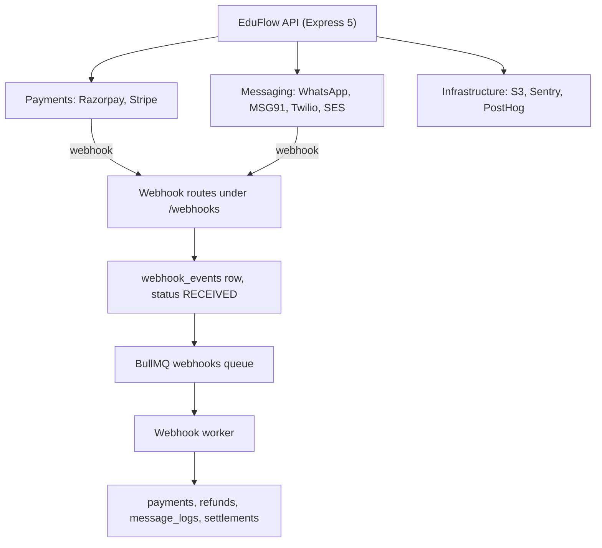
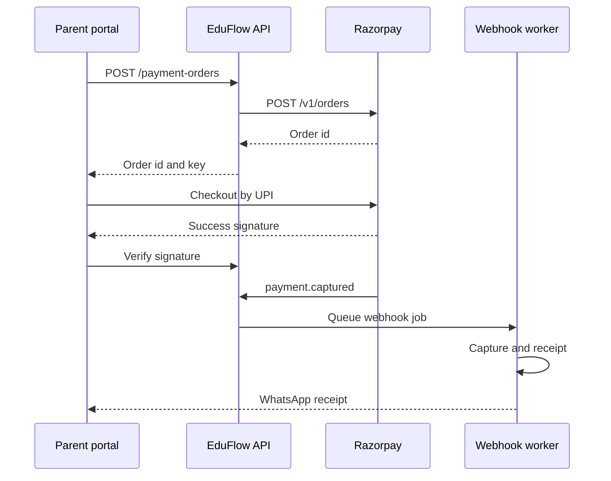
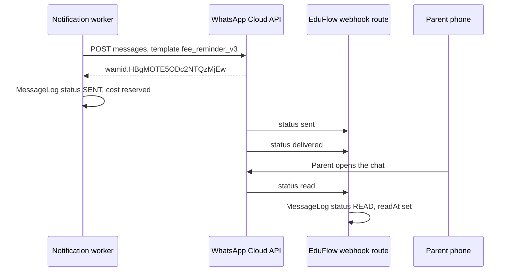

# Integrations and Webhooks

**In simple words:** EduFlow does not build payments, WhatsApp, SMS, email or file storage itself. It plugs into outside services and talks to them over the internet. This chapter says which service we use for what, where we keep its keys, which calls we make, which webhooks (messages a service pushes back to us) we accept, and what we do when a service is slow, wrong or down.

| Item | Value |
|---|---|
| Providers in Phase 1 | Razorpay, WhatsApp Cloud API, Amazon SES, Amazon S3, Sentry, PostHog |
| Providers in Phase 2 | MSG91, Twilio, biometric attendance file import |
| Providers in Phase 3 and 4 | Tally export, Stripe, Google Workspace SSO, device push API |
| Webhook inbox table | `webhook_events`, unique on `provider` + `event_id` |
| Webhook queue | BullMQ `webhooks` queue on Redis 7, 8 attempts |
| Secret storage | AWS Secrets Manager; PostgreSQL keeps only the reference string |
| Support screen | `INT-S01` Integration Health, Super Admin console |

## The integration map

| Provider | Used for | Phase | Account held by | Webhook in |
|---|---|---|---|---|
| Razorpay | Online fee collection, refunds, payouts, SaaS billing | 1 | Each institute | Yes |
| WhatsApp Cloud API | Parent messages, receipts, reminders, inbound replies | 1 | Each institute | Yes |
| Amazon SES | Transactional and bulk email | 1 | EduFlow, domain per institute | Yes, through SNS |
| Amazon S3 | Documents, photos, PDFs, import and export files | 1 | EduFlow | No |
| Sentry | Backend and frontend error tracking | 1 | EduFlow | No |
| PostHog | Product analytics and funnels | 1 | EduFlow | No |
| MSG91 | India SMS with TRAI DLT compliance | 2 | EduFlow, sender id per institute | Yes |
| Twilio | SMS outside India | 2 | EduFlow | Yes |
| Biometric devices | Attendance punches, file import first | 2 | Each institute | No, file or API key push |
| Tally and accounting | CSV or Excel voucher export | 3 | Each institute | No |
| Stripe | Fee collection and billing in USA, Australia, UAE | 4 | Each institute | Yes |
| Google Workspace | Staff single sign-on on the Enterprise plan | 4 | Each institute | No |

**Figure: How outside services reach EduFlow**



Outbound calls go straight from the API or from a BullMQ worker. Inbound calls never touch business tables. They land in `webhook_events`, get a 200 in a few milliseconds, and a worker does the real work. The *System Architecture* chapter explains the queue setup; this chapter covers what crosses the company boundary.

## Provider abstraction layer

EduFlow sells in four countries. Razorpay does not work in the USA and MSG91 does not work in Australia, so every outside service sits behind a small TypeScript interface called a port. Business code never imports a vendor SDK.

```typescript
// shared/src/integrations/ports.ts
import type { IncomingHttpHeaders } from 'node:http';

export type ProviderKey =
  | 'RAZORPAY' | 'STRIPE' | 'META_WHATSAPP' | 'MSG91' | 'TWILIO' | 'AMAZON_SES';

export interface WebhookCheck {
  signatureValid: boolean;
  eventId: string; // provider event id, or a SHA-256 hash of the raw body
  eventType: string; // payment.captured, charge.refunded, messages ...
}

export interface PaymentPort {
  readonly key: 'RAZORPAY' | 'STRIPE';
  createOrder(input: CreateOrderInput): Promise<ProviderOrder>;
  fetchPayment(providerPaymentId: string): Promise<ProviderPayment>;
  refund(input: ProviderRefundInput): Promise<ProviderRefund>;
  listSettlements(from: Date, to: Date): Promise<ProviderSettlement[]>;
  verifyWebhook(raw: Buffer, headers: IncomingHttpHeaders, secret: string): WebhookCheck;
  toDomainEvent(raw: Buffer): DomainPaymentEvent | null; // null = event type we ignore
}

export interface MessagingPort<TSend> {
  readonly key: ProviderKey;
  readonly channel: 'WHATSAPP' | 'SMS' | 'EMAIL';
  send(input: TSend): Promise<{ providerMessageId: string; providerCost: Money }>;
  verifyWebhook(raw: Buffer, headers: IncomingHttpHeaders, secret: string): WebhookCheck;
  toStatusUpdates(raw: Buffer): StatusUpdate[]; // SENT, DELIVERED, READ or FAILED
}
```

A registry picks the adapter from the country of the organization. No other file knows a vendor name.

```typescript
// server/src/integrations/registry.ts
const smsByCountry: Record<string, ProviderKey> = {
  IN: 'MSG91', AE: 'TWILIO', US: 'TWILIO', AU: 'TWILIO',
};

export function resolveSmsPort(countryCode: string): MessagingPort<SendSmsInput> {
  const key = smsByCountry[countryCode] ?? 'TWILIO';
  const port = smsPorts.get(key);
  if (!port) throw new AppError('SERVICE_UNAVAILABLE', `No SMS provider for ${countryCode}`);
  return port;
}
```

| Port | Adapters today | Chosen by | What breaks on a swap |
|---|---|---|---|
| `PaymentPort` | Razorpay, Stripe | `PaymentGatewayAccount.provider` | Nothing; provider ids are plain text columns |
| WhatsApp `MessagingPort` | Meta Cloud API | Always Meta | Template ids are Meta-shaped; a swap needs a template re-sync |
| SMS `MessagingPort` | MSG91, Twilio | Country of the organization | DLT fields are India-only and stay null elsewhere |
| Email `MessagingPort` | Amazon SES | Always SES | The suppression list must be re-imported |
| `StoragePort` | Amazon S3 | Always S3 | Only the shape of the pre-signed URL |

> **Rule:** A vendor SDK may be imported only inside `server/src/integrations/<vendor>/`. A pull request that imports `razorpay` or `twilio` anywhere else is rejected.

## Credentials and secret storage

| Secret | Belongs to | Stored in | Pointer column or variable | Rotation |
|---|---|---|---|---|
| Razorpay key secret | One institute | Secrets Manager | `payment_gateway_accounts.secret_ref` | On demand |
| Razorpay webhook secret | One institute | Secrets Manager | `payment_gateway_accounts.webhook_secret_ref` | On demand |
| Stripe secret key | One institute | Secrets Manager | `payment_gateway_accounts.secret_ref` | On demand |
| Meta system user token | One institute | Secrets Manager | `whats_app_accounts.access_token_ref` | 60 days |
| WhatsApp verify token | EduFlow | Environment | `WHATSAPP_VERIFY_TOKEN` | Yearly |
| MSG91 auth key | EduFlow | Environment | `MSG91_AUTH_KEY` | Yearly |
| Twilio auth token | EduFlow | Environment | `TWILIO_AUTH_TOKEN` | Yearly |
| Institute API key | One institute | PostgreSQL, SHA-256 only | `api_keys.key_hash` | SET-API-47 |

Five rules that never bend:

1. PostgreSQL stores a reference, never a secret. A `secret_ref` looks like `eduflow/prod/org/7c1f.../razorpay/key_secret`.
2. The `public_key` is safe for the browser. The secret is read only inside the API process, cached in memory for 5 minutes, never logged and never returned by any endpoint.
3. Platform secrets come from environment variables validated with Zod at boot. A missing variable stops the process, so the API never starts with a blank key.
4. Card numbers, CVV, UPI PIN and bank passwords never reach EduFlow. The gateway checkout page collects them, which keeps us out of PCI DSS scope; see the *Privacy and Compliance* chapter.
5. Every read of a tenant secret writes an `AuditLog` row with the actor and the reason.

## Razorpay

Razorpay is the India payment gateway. It does two jobs: it collects school fees for the institute, and the EduFlow subscription for us. The two use different accounts and different webhook URLs.

**Setup steps for Sharma Classes**

1. Rajesh Sharma opens a Razorpay account and finishes KYC with PAN, GST and a cancelled cheque. This takes 1 to 3 working days.
2. In Settings, Payment Gateways, he calls PAY-API-25 with the key id and key secret from the Razorpay dashboard. EduFlow puts the secret in Secrets Manager and only the reference in `payment_gateway_accounts`.
3. SET-API-19 shows the webhook URL `https://api.eduflow.app/api/v1/webhooks/razorpay/<gatewayAccountId>`. He pastes it into Razorpay, picks the events listed below, and types a webhook secret. The same secret goes back into EduFlow with PAY-API-26.
4. Test connection (PAY-API-28) calls the Razorpay API once and sets `lastVerifiedAt`.
5. He keeps `mode = TEST` and pays one rupee end to end, then switches to `LIVE` and presses Make default (SET-API-20).

**Calls EduFlow makes**

| Purpose | Razorpay call | When | Retry safe |
|---|---|---|---|
| Create checkout order | `POST /v1/orders` | PAY-API-13 | Yes, our `Idempotency-Key` maps to `receipt` |
| Read one payment | `GET /v1/payments/:id` | Verify and reconcile | Yes |
| Refund | `POST /v1/payments/:id/refund` | PAY-API-23 | Yes, `Idempotency-Key` header |
| Payout report | `GET /v1/settlements/recon/combined` | PAY-API-31 nightly | Yes |
| Account check | `GET /v1/payments?count=1` | PAY-API-28 | Yes |

**Webhooks we accept**

| Event | What the worker does | Table touched |
|---|---|---|
| `payment.captured` | Create the `Payment`, allocate to invoices, issue the receipt | `payments`, `receipts` |
| `order.paid` | Same handler, guarded by the order id | `payment_orders` |
| `payment.failed` | Mark the order `FAILED`, keep the reason for support | `payment_orders` |
| `refund.processed` | Refund `PROCESSED`, reopen invoice balances | `refunds` |
| `settlement.processed` | Upsert the `Settlement`, queue reconciliation | `settlements` |

Dispute events and the full handler table are in the *Payments Module* chapter. Subscription events for the EduFlow bill arrive on a separate route, ORG-API-30.

**Figure: One online fee payment, end to end**



Two paths can finish the same payment: the browser callback and the webhook. Whoever arrives first wins, because both call the same `capturePayment` function, which locks the `payment_orders` row. The parent never sees a double receipt.

**Where the money lands: three options**

| Option | Who holds the money | KYC work for the institute | EduFlow effort | Verdict |
|---|---|---|---|---|
| Own account | The institute, directly | Full KYC, done once | Low, store two keys | Recommended for Phase 1 |
| Razorpay Route | EduFlow, split to linked accounts | Lighter, done inside our flow | High, we become a money handler | Later, only if asked |
| Partner or sub-merchant | Aggregator, then the institute | Medium | Medium, partner contract needed | Not in Year 1 |

> **Best practice:** Use the own-account option. Fee money goes from the parent to the institute bank account and never sits in an EduFlow account. We stay a software vendor, not a payment aggregator, so we avoid RBI aggregator licensing questions and never owe anyone their money. Route onboards faster, but it makes EduFlow responsible for settling other people's fee income. Revisit it only when a group asks for one collection account across campuses.

**Testing, cost and limits**

- Test mode uses separate keys. Test UPI id `success@razorpay` succeeds and `failure@razorpay` fails. Test card `4111 1111 1111 1111` with any future expiry works. Razorpay sends webhooks to the test URL too, so the whole flow is rehearsed without real money.
- Cost, as of September 2026 and to be verified before quoting: about 2 percent on cards and net banking, near zero on UPI, plus 18 percent GST on that fee. EduFlow passes it through at cost in Year 1.
- Assumption: plan for 100 API calls per minute per account, and back off on HTTP 429. Razorpay retries a failed webhook for up to 24 hours, so a short outage of ours costs nothing.

## Stripe

Stripe is the gateway for the USA, Australia and the UAE. It arrives in Phase 4 with prompt P-32, and because the port shape is the same, no business code changes.

| Purpose | Stripe call | Notes |
|---|---|---|
| Start a payment | `POST /v1/payment_intents` | `amount` in the smallest unit, `metadata.paymentOrderId` set |
| Confirm on the client | Stripe.js `confirmPayment` | The card never touches our server |
| Refund | `POST /v1/refunds` | `Idempotency-Key` header, same value as ours |
| Institute payouts | `POST /v1/accounts` and `POST /v1/account_links` | Stripe Connect Express account per institute |
| Payout report | `GET /v1/payouts` and `GET /v1/balance_transactions` | Feeds `settlements` |
| Tax | `automatic_tax` on subscription invoices | Stripe Tax computes US state sales tax and AU GST |

Connect Express answers the same question Razorpay Route answers. The institute onboards through a Stripe-hosted form, Stripe holds the KYC file, and payouts reach the institute bank account. EduFlow sets `on_behalf_of` and `transfer_data.destination` so the funds belong to the institute, and takes no application fee in Year 1.

Webhooks we handle: `payment_intent.succeeded`, `payment_intent.payment_failed`, `charge.refunded`, `charge.dispute.created`, `charge.dispute.closed`, `payout.paid`, plus `invoice.paid` and `invoice.payment_failed` on ORG-API-30. The `Stripe-Signature` header is checked with `stripe.webhooks.constructEvent(raw, header, secret)`, which also rejects a replay older than five minutes. Local testing uses `stripe listen --forward-to`, which gives a signing secret and replays any event. Cost, to be verified: about 2.9 percent plus 30 cents per US card charge.

## WhatsApp Cloud API

WhatsApp is the main parent channel in India. EduFlow talks to Meta directly, with no BSP in between, so the institute pays Meta rates plus the 15 percent margin the canon fixes.

**Setup steps**

1. The institute needs a Meta Business Manager account and a phone number that is not already on WhatsApp.
2. Rajesh clicks Connect WhatsApp in EduFlow. Meta Embedded Signup opens, he picks or creates the WhatsApp Business Account and the number, and Meta returns a short code.
3. WA-API-02 exchanges that code for a long-lived system user token, stores it in Secrets Manager and writes a `whats_app_accounts` row with `waba_id` and `phone_number_id`.
4. EduFlow subscribes the app to the WABA webhook fields `messages`, `message_template_status_update` and `account_update`.
5. Templates are created in EduFlow (WA-API-08) and submitted to Meta. Approval usually takes minutes to a few hours. WA-API-11 pulls the status back.
6. Parents must opt in. The admission form and the parent portal record a `ConsentRecord`, and WA-API-18 records offline opt-ins.

**Calls EduFlow makes**

| Purpose | Graph API call | Notes |
|---|---|---|
| Send a template message | `POST /{version}/{phoneNumberId}/messages` | Returns `wamid...`, saved as `provider_message_id` |
| Send a free-form reply | Same call, `type` text | Only inside the 24-hour window |
| Upload media | `POST /{version}/{phoneNumberId}/media` | Receipt and report-card PDFs |
| Download inbound media | `GET /{version}/{mediaId}` then the signed URL | Saved to S3 as a `FileAsset` |
| Create a template | `POST /{version}/{wabaId}/message_templates` | Stored in `whats_app_templates` |
| Read account health | `GET /{version}/{phoneNumberId}` with fields | Fills `quality_rating`, `messaging_limit_tier` |

The Graph version is one environment variable, `WHATSAPP_GRAPH_VERSION`. We pin it, read the Meta changelog every quarter, and bump it in a single pull request.

**The webhook handshake**

Meta first calls WA-API-23 with `hub.mode=subscribe`, `hub.verify_token` and `hub.challenge`. The route compares the token with `WHATSAPP_VERIFY_TOKEN` using a constant-time compare and echoes the challenge as plain text. Any mismatch returns 403 and nothing is stored.

**Figure: WhatsApp fee reminder and its status updates**



Each status webhook carries the same `wamid`. The worker finds the row by the unique key `(provider, providerMessageId)` on `message_logs` and moves the status forward only. Inbound messages create a `whats_app_inbound_messages` row, match a `Guardian` by phone, and open the 24-hour free reply window the front desk uses through WA-API-16.

**Cost and limits**

- Meta charges per message by category: utility, marketing, authentication and service. EduFlow keeps the Meta charge in `provider_cost`, the rupee amount taken from the wallet in `cost`, and the difference in `margin_amount`.
- Assumption for planning: about 0.13 rupees per utility message in India, more for marketing. Verify the rate card before quoting; the canon rule is Meta cost plus 15 percent.
- A new number starts at tier `TIER_1K`, that is 1,000 business-started conversations in 24 hours. Tiers rise with good quality. The worker checks `messaging_limit_tier` before a bulk campaign and spreads the sends.
- `quality_rating` `RED` means Meta may pause the number, so `whatsapp.account.quality_changed` raises a dashboard alert.

## MSG91 and the DLT flow

SMS is the fallback when WhatsApp fails and the only channel that reaches a feature phone. In India every commercial SMS must pass TRAI DLT (Distributed Ledger Technology) registration, so this setup has more steps than any other.

| Step | Who does it | Result stored in |
|---|---|---|
| Register the principal entity on a DLT portal with PAN and GST | The institute | `sms_sender_ids.dlt_entity_id` |
| Register a six-character header, for example `SHARMA` | The institute | `sms_sender_ids.header` |
| Link MSG91 as the telemarketer | The institute | `sms_sender_ids.dlt_telemarketer_id` |
| Register each content template with `{#var#}` placeholders | The institute | `sms_dlt_templates.dlt_template_id` |
| Import the approved template sheet into EduFlow | Accountant | SMS-API-10 creates an `ImportJob` |
| Test send and mark the header verified | Accountant | SMS-API-05 sets `verification_status` |

Sending uses `POST https://control.msg91.com/api/v5/flow/` with the `authkey` header and the `template_id` of the DLT template. Before the call, SMS-API-13 compares the rendered text with `body_text` character by character. If one word differs the operator rejects the message and still charges for it, so EduFlow blocks the send with `BUSINESS_RULE_VIOLATION` instead.

Delivery reports arrive on SMS-API-18 with the MSG91 request id, stored as `provider_message_id`, and a numeric code. Codes 1 and 9 mean delivered, 2 and 13 mean failed, anything else stays `SENT` until the next report. Cost is fixed by the canon at 0.25 rupees per segment, sold in packs of 5,000 for 1,250 rupees. A segment is 160 GSM-7 characters, or 70 once the text has Hindi, so a Hindi reminder costs three times an English one.

## Twilio

Twilio carries SMS outside India, where no DLT registration exists. EduFlow keeps one Twilio account and one Messaging Service, and bills institutes from the same `MessageCreditWallet`.

- Sending uses `POST /2010-04-01/Accounts/{sid}/Messages.json` with a `StatusCallback` URL that points at SMS-API-19. The callback is verified with the `X-Twilio-Signature` header, an HMAC SHA-1 over the full URL plus the sorted form fields.
- Statuses map like this: `queued` and `sent` to `SENT`, `delivered` to `DELIVERED`, `undelivered` and `failed` to `FAILED` with `ErrorCode` kept in `error_code`.
- A parent who replies STOP is opted out: the worker writes a `NotificationPreference` row with SMS off and emits `sms.opted_out`, so no later campaign reaches that number.
- Assumption for planning: about 5 US cents per SMS in the USA and 6 cents in Australia. Verify before quoting.

## Amazon SES

Email is the cheapest channel and the only one that carries a long report card or fee ledger.

**Setup.** EduFlow owns the SES account in `ap-south-1`. New accounts start in the SES sandbox: 200 emails a day, verified addresses only. Production access is requested once, before the pilot on 18 November 2026. An institute may add its own domain through EML-API-02. SES returns three DKIM CNAME records, EduFlow stores them in `email_sender_identities.dkim_records`, and the institute adds them to its DNS. EML-API-05 re-checks until `verification_status` is `VERIFIED`. Until then mail goes out from the shared domain `mail.eduflow.app`.

**Sending.** The worker calls `SendEmailCommand` from `@aws-sdk/client-sesv2` with a configuration set that publishes events to an SNS topic. The returned `MessageId` becomes `provider_message_id`.

**Feedback.** SNS posts delivery, bounce and complaint events to EML-API-14. Two rules are special to SNS: the first call has `Type: SubscriptionConfirmation` and the route fetches the `SubscribeURL` only when the host ends with `.amazonaws.com`; and every later notification is signed, so the route downloads the certificate named in `SigningCertURL`, again only from an Amazon host, and verifies the signature before trusting the body.

A hard bounce writes an `EmailSuppression` row with reason `HARD_BOUNCE` and no expiry. A complaint writes `COMPLAINT`. Five soft bounces in 30 days write `SOFT_BOUNCE_LIMIT` with a 30-day expiry. The sender checks this table before every send, because SES suspends an account whose bounce rate crosses 5 percent or whose complaint rate crosses 0.1 percent. EML-API-15 shows both rates.

Cost, to be verified: about 0.10 US dollars per 1,000 emails, roughly 8.50 rupees. Email is therefore free in every plan, including Starter.

## Storage, error tracking and analytics

| Service | What it does | Key settings |
|---|---|---|
| Amazon S3 | Private buckets in `ap-south-1`, one prefix per organization | KMS encryption, versioning on, public access blocked |
| Sentry | Errors from the API, the workers and the Next.js client | One project per app, release tagged from the Git SHA |
| PostHog | Signups, activation, feature use, funnels | EU cloud, autocapture off, only named events |

Files never pass through the API. CMN-API-02 returns a pre-signed PUT URL valid for 10 minutes and creates a `file_assets` row with status `PENDING_UPLOAD`. The browser uploads straight to S3. CMN-API-05 confirms the size, the checksum and the virus scan result. CMN-API-06 gives a pre-signed GET valid for 5 minutes, after checking that the user may see the owning record. A lifecycle rule expires import and export files after 30 days.

Sentry gets `organizationId`, `userId`, `requestId` and the route name as tags, so a support ticket is one query away. The `beforeSend` hook strips request bodies, `authorization` and `cookie` headers, and anything that looks like a phone, email or address. PostHog receives product events only: no student name, no guardian phone, no marks. Children are never tracked, because the DPDP Act 2023 bans behavioural tracking and targeted advertising aimed at children.

## Biometric attendance devices

Coaching institutes already own fingerprint or RFID machines from vendors such as eSSL, Mantra and ZKTeco. These sit on a local network our cloud cannot reach, so EduFlow takes them in two stages.

**Stage one, file import, Phase 2.** The operator exports the punch log as Excel or CSV and uploads it with ATT-API-13 for students or ATT-API-24 for staff. The file becomes an `ImportJob` of type `ATTENDANCE`.

| Column in the file | Maps to | Rule |
|---|---|---|
| `EmpCode` or `EnrollNo` | `students.admission_no` or `staff.employee_code` | An unknown code becomes a rejected row |
| `PunchDate` | `attendance_records.date` | Institute timezone, never raw device UTC |
| `PunchTime`, first of the day | `check_in_at` | Later punches update `check_out_at` |
| `DeviceId` | `device_ref` | Kept for audit |
| Derived | `source` set to `BIOMETRIC` | A later manual edit needs a remark |

A dry run comes first. CMN-API-14 lists the rejected rows with an error code, and CMN-API-16 commits the same file for real once the mapping looks right.

**Stage two, device push, Phase 3.** The institute installs a small agent on the machine that already runs the vendor software. The agent holds an `ApiKey` from SET-API-45, scoped to `attendance.mark` only, with `allowed_ips` set to the office IP and `rate_limit_per_min` set to 60. It posts batches to ATT-API-12. The worker deduplicates on person, `device_ref` and punch timestamp, so re-uploading a day changes nothing.

> **Warning:** Device clocks drift. If a punch timestamp is more than 15 minutes ahead of server time, the row is rejected with `VALIDATION_ERROR` and the agent is told to sync its clock. Silently accepting a future punch would mark a student present for tomorrow.

## Accounting export for Tally

Most Indian institutes hand their accountant a file at month end. EduFlow does not talk to Tally live; it produces a file the accountant imports, which is simpler and cannot corrupt the books. PAY-API-46 creates an `ExportJob` with `export_type` `accounting.tally_vouchers` and `format` `CSV`. One row is one voucher.

```csv
VoucherDate,VoucherType,VoucherNo,LedgerDr,LedgerCr,Amount,Narration,CostCentre
2027-07-10,Receipt,RCP-0431,Bank - HDFC 4412,Tuition Fee Income,12000.00,Aarav Sharma 10-A Q2,Main Campus
2027-07-10,Receipt,RCP-0432,Cash in Hand,Transport Fee Income,3000.00,Aarav Sharma 10-A Q2,Main Campus
2027-07-11,Credit Note,CRN-0018,Tuition Fee Income,Bank - HDFC 4412,1500.00,Part refund Ishaan Roy,Main Campus
```

Ledger names come from Settings, where each `FeeHead` and each payment mode is mapped once to a Tally ledger name. Amounts use two decimals and no thousand separator, because Tally rejects commas. An XLSX file with the same columns suits accountants who prefer Excel. A native Tally XML export is a Phase 4 idea, not a promise.

## Google Workspace single sign-on

Many schools already give every teacher a Google Workspace account. From Phase 4 an Enterprise institute can let staff sign in with it. Parents and students keep OTP login.

AUTH-API-12 redirects to Google with OpenID Connect and AUTH-API-13 validates the response. Three checks protect the tenant: the `hd` claim must equal the domain in `organization_settings`, the email must already exist as a `User` there, and the user must be active. Just-in-time creation is off by default, so a new Google account cannot silently become a teacher. The *Authentication and Sessions* chapter holds the token flow.

## Webhook processing pipeline

Every provider uses the same two-step pipeline. The route stores and acknowledges; the worker does the business work. A slow database can then never make Meta or Razorpay time out and resend.

1. `express.raw({ type: '*/*', limit: '1mb' })` is mounted on `/api/v1/webhooks`, because a signature is computed over the exact bytes, not the parsed object.
2. The route finds the tenant: Razorpay and Stripe from the gateway account id in the path, WhatsApp from `phone_number_id`, MSG91 and Twilio from `provider_message_id`, SES from the `MessageId`.
3. The signature is checked with `crypto.timingSafeEqual`. A bad signature still gets a `webhook_events` row with `signature_valid = false`, status `IGNORED` and an event id prefixed `invalid-`, so a forged request can never take the id of the real one.
4. The row is written with `INSERT ... ON CONFLICT (provider, event_id) DO NOTHING`. That one unique key is the whole idempotency story: a repeat delivery inserts nothing and still gets a 200.
5. A job is queued with `jobId` set to `webhook-<row id>`, which stops a duplicate job even if the route runs twice.
6. The worker sets `PROCESSING`, handles the event, then writes `PROCESSED` with `processed_at`, `related_entity_type` and `related_entity_id`.

| Status | Meaning | What happens next |
|---|---|---|
| `RECEIVED` | Stored and acknowledged | A worker picks it up in under a second |
| `PROCESSING` | A worker holds it | Times out after 60 seconds and returns to retry |
| `PROCESSED` | Business effect applied | Kept 400 days as dispute evidence |
| `FAILED` | Handler threw on every attempt | Alert raised; PAY-API-41 can replay it |
| `IGNORED` | Bad signature, unknown tenant, or an event type we do not use | No further work |

Retries use exponential backoff on `attempts`, with `next_retry_at` written so the support screen can show it.

| Attempt | Delay before it | Attempt | Delay before it |
|---|---|---|---|
| 1 | none | 5 | 4 minutes |
| 2 | 15 seconds | 6 | 16 minutes |
| 3 | 30 seconds | 7 | 1 hour |
| 4 | 1 minute | 8 | 4 hours |

After attempt 8 the row stays `FAILED` with `last_error`. Events arrive out of order, so a handler moves a status forward only: a `sent` landing after a `read` is dropped, and a second `payment.captured` for a paid order writes nothing and still ends `PROCESSED`.

## Webhook security checklist

| ID | Check | Why |
|---|---|---|
| WH-01 | Read the raw body, never the parsed one | A re-serialised body breaks the HMAC |
| WH-02 | Compare signatures with `timingSafeEqual` | Stops a timing attack on the secret |
| WH-03 | Reject a timestamp older than 5 minutes | Stops a replay |
| WH-04 | Never pick the tenant from an id in the body | The path or a mapped provider id decides |
| WH-05 | Store the event before any business work | Gives a replayable, auditable trail |
| WH-06 | Be idempotent on `(provider, event_id)` | Providers retry by design |
| WH-07 | Answer 200 in under 500 ms | A timeout makes the provider resend |
| WH-08 | Cap the body at 1 MB | Stops memory exhaustion |
| WH-09 | Rate limit each route to 600 calls a minute per IP | Absorbs a flood |
| WH-10 | Log ids, never the full payload | Payloads hold phone numbers and amounts |
| WH-11 | Re-read the amount from the provider API | The body alone must not move money |
| WH-12 | Keep these routes out of JWT and tenant middleware | The signature is the identity |

> **Rule:** WH-11 is the check that saves the institute money. Even after a valid signature, `capturePayment` calls `GET /v1/payments/:id` and compares amount and currency with the `payment_orders` row. A mismatch marks the event `FAILED` and alerts support instead of issuing a receipt.

## Integration endpoints

Every endpoint in the registry that talks to an outside service or configures one. Their business rules live in the module chapters; they are listed together here so one page shows the whole surface.

| ID | Method | Path | Permission | Purpose |
|---|---|---|---|---|
| PAY-API-24 | GET | `/payment-gateway-accounts` | payments.manage | List connected gateways |
| PAY-API-25 | POST | `/payment-gateway-accounts` | payments.manage | Connect Razorpay or Stripe |
| PAY-API-26 | PATCH | `/payment-gateway-accounts/:id` | payments.manage | Mode, methods, fee, default |
| PAY-API-27 | DELETE | `/payment-gateway-accounts/:id` | payments.manage | Disconnect the account |
| PAY-API-28 | POST | `/payment-gateway-accounts/:id/verify` | payments.manage | Test the credentials |
| PAY-API-31 | POST | `/settlements/sync` | payments.reconcile | Pull payouts from the gateway |
| PAY-API-38 | POST | `/webhooks/razorpay/:gatewayAccountId` | public | Razorpay receiver |
| PAY-API-39 | POST | `/webhooks/stripe/:gatewayAccountId` | public | Stripe receiver |
| PAY-API-40 | GET | `/webhook-events` | payments.manage | Webhook inbox log |
| PAY-API-41 | POST | `/webhook-events/:id/retry` | payments.manage | Replay a FAILED event |
| ORG-API-30 | POST | `/webhooks/billing/:provider` | public | EduFlow subscription events |
| WA-API-02 | POST | `/whatsapp-accounts` | whatsapp.manage | Connect a WABA number |
| WA-API-06 | POST | `/whatsapp-accounts/:id/sync` | whatsapp.manage | Refresh quality and tier |
| WA-API-11 | POST | `/whatsapp-templates/sync` | whatsapp.manage | Pull template approvals |
| WA-API-23 | GET | `/webhooks/whatsapp` | public | Meta verification handshake |
| WA-API-24 | POST | `/webhooks/whatsapp` | public | Inbound and status events |
| EML-API-02 | POST | `/email-sender-identities` | email.manage | Add a sending domain |
| EML-API-05 | POST | `/email-sender-identities/:id/verify` | email.manage | Re-check DKIM and SPF |
| EML-API-14 | POST | `/webhooks/ses` | public | SES and SNS receiver |
| SMS-API-05 | POST | `/sms-sender-ids/:id/verify` | sms.manage | Test send on a header |
| SMS-API-10 | POST | `/sms-dlt-templates/import` | sms.import | Import the DLT sheet |
| SMS-API-18 | POST | `/webhooks/msg91` | public | MSG91 delivery reports |
| SMS-API-19 | POST | `/webhooks/twilio` | public | Twilio status and STOP |
| SET-API-19 | GET | `/payment-gateway-accounts/:id` | settings.view | Account with webhook URL |
| SET-API-20 | POST | `/payment-gateway-accounts/:id/set-default` | settings.manage_gateways | Make it the default |
| SET-API-45 | POST | `/api-keys` | settings.manage_api_keys | Create a device key |
| SET-API-47 | POST | `/api-keys/:id/rotate` | settings.manage_api_keys | Rotate a device key |
| ATT-API-12 | POST | `/attendance-records/device-punches` | attendance.mark | Ingest device punches |
| AUTH-API-12 | GET | `/auth/sso/start` | public | Go to the identity provider |
| AUTH-API-13 | POST | `/auth/sso/callback` | public | Validate SSO and sign in |
| CMN-API-29 | GET | `/health/ready` | public | Readiness of every dependency |

### WA-API-23 Meta webhook handshake

```http
GET /api/v1/webhooks/whatsapp?hub.mode=subscribe&hub.verify_token=ef_wa_9f3a
    &hub.challenge=115820 HTTP/1.1
```

The answer is the challenge as plain text, not the JSON envelope, because Meta accepts nothing else.

```text
115820
```

| Status | Code | When |
|---|---|---|
| 200 | - | Token matches; the challenge is echoed |
| 400 | `VALIDATION_ERROR` | `hub.mode` is not `subscribe` |
| 403 | `FORBIDDEN` | Verify token does not match |

### WA-API-24 WhatsApp inbound and status webhook

```http
POST /api/v1/webhooks/whatsapp HTTP/1.1
Content-Type: application/json
X-Hub-Signature-256: sha256=6b1f0a3d9c2e5f8b4a7d0c3e6f9b2a5d8c1e4f7a0b3d6c9e2f5a8b1d4c7e0f3a

{
  "object": "whatsapp_business_account",
  "entry": [{ "id": "102938475612345", "changes": [{ "field": "messages", "value": {
    "metadata": { "phone_number_id": "109876543210987" },
    "statuses": [{ "id": "wamid.HBgMOTE5ODc2NTQzMjEw", "status": "delivered",
      "timestamp": "1836048120", "recipient_id": "919876543210" }]
  } }] }]
}
```

```json
{ "success": true, "data": { "received": true } }
```

| Status | Code | When |
|---|---|---|
| 200 | - | Stored, or a duplicate `wamid` already seen |
| 400 | `VALIDATION_ERROR` | Body is not valid JSON |
| 401 | `UNAUTHENTICATED` | `X-Hub-Signature-256` does not match the app secret |
| 200 | - | `phone_number_id` is unknown; row saved as `IGNORED` |

### EML-API-14 SES bounce and complaint webhook

```http
POST /api/v1/webhooks/ses HTTP/1.1
x-amz-sns-message-type: Notification
Content-Type: text/plain

{
  "Type": "Notification",
  "MessageId": "4f2b8c1a-7d3e-4a9f-b5c6-0e1d2a3b4c5d",
  "Message": "{\"eventType\":\"Bounce\",\"mail\":{\"messageId\":\"0100018f\"},
    \"bounce\":{\"bounceType\":\"Permanent\"}}",
  "SigningCertURL": "https://sns.ap-south-1.amazonaws.com/SimpleNotification.pem",
  "Signature": "Yg8s1P0k..."
}
```

```json
{ "success": true, "data": { "received": true } }
```

| Status | Code | When |
|---|---|---|
| 200 | - | Event stored, or the subscription was confirmed |
| 401 | `UNAUTHENTICATED` | SNS signature or certificate host is wrong |
| 400 | `VALIDATION_ERROR` | `Message` is not valid JSON |

### SMS-API-18 MSG91 delivery report

```http
POST /api/v1/webhooks/msg91 HTTP/1.1
Content-Type: application/json

{
  "requestId": "3a7f0c9d1e5b2a4c6e8f",
  "number": "919876543210",
  "status": 1,
  "desc": "DELIVERED",
  "date": "2027-07-10 09:14:22"
}
```

```json
{ "success": true, "data": { "received": true } }
```

| Status | Code | When |
|---|---|---|
| 200 | - | `message_logs` moved to `DELIVERED` |
| 200 | - | Unknown `requestId`; row stored as `IGNORED` |
| 401 | `UNAUTHENTICATED` | The shared-secret path token is wrong |

### SMS-API-19 Twilio status callback

```http
POST /api/v1/webhooks/twilio HTTP/1.1
Content-Type: application/x-www-form-urlencoded
X-Twilio-Signature: 0h5CqLb7bH2mE0pQ9xKZ4t3vYxA=

MessageSid=SM9f3a7c1d&MessageStatus=undelivered&ErrorCode=30003&To=%2B61412345678
```

```json
{ "success": true, "data": { "received": true } }
```

| Status | Code | When |
|---|---|---|
| 200 | - | Status stored; a STOP body also writes the opt-out |
| 401 | `UNAUTHENTICATED` | `X-Twilio-Signature` does not match |
| 400 | `VALIDATION_ERROR` | `MessageSid` is missing |

### ORG-API-30 EduFlow subscription webhook

```http
POST /api/v1/webhooks/billing/razorpay HTTP/1.1
X-Razorpay-Signature: 9c2e5f8b4a7d0c3e6f9b2a5d8c1e4f7a0b3d6c9e2f5a8b1d4c7e0f3a6b1f0a3d

{
  "event": "subscription.charged",
  "payload": { "subscription": { "entity": { "id": "sub_Qx7NfR3cW8hJzs" } } }
}
```

```json
{ "success": true, "data": { "received": true } }
```

| Status | Code | When |
|---|---|---|
| 200 | - | Subscription or invoice updated |
| 401 | `UNAUTHENTICATED` | Platform webhook secret does not match |
| 404 | `NOT_FOUND` | `provider` is not `razorpay` or `stripe` |

### PAY-API-41 Replay a failed webhook event

```http
POST /api/v1/webhook-events/9b1d4c7e-0f3a-4b6c-8d2e-5f7a9c1b3d6e/retry HTTP/1.1
Authorization: Bearer <accessToken>
```

```json
{
  "success": true,
  "data": { "id": "9b1d4c7e-0f3a-4b6c-8d2e-5f7a9c1b3d6e", "provider": "RAZORPAY",
    "eventType": "payment.captured", "status": "RECEIVED", "attempts": 8 }
}
```

| Status | Code | When |
|---|---|---|
| 403 | `FORBIDDEN` | Caller lacks `payments.manage` |
| 404 | `NOT_FOUND` | Event belongs to another organization |
| 409 | `CONFLICT` | Status is already `PROCESSED` or `PROCESSING` |
| 422 | `BUSINESS_RULE_VIOLATION` | `signature_valid` is false, so it may never run |

### ATT-API-12 Device punch ingest

```http
POST /api/v1/attendance-records/device-punches HTTP/1.1
X-Api-Key: ef_live_8f3a2b1c9d0e4f6a7b5c3d1e
Content-Type: application/json

{
  "deviceRef": "ESSL-K30-GATE1",
  "punches": [
    { "code": "BF-2027-0142", "personType": "STUDENT", "at": "2027-07-10T03:42:11Z" },
    { "code": "EMP-0077", "personType": "STAFF", "at": "2027-07-10T03:31:02Z" } ]
}
```

```json
{
  "success": true,
  "data": { "accepted": 2, "duplicates": 0, "rejected": 0, "batchId": "dp_5f7a9c1b" }
}
```

| Status | Code | When |
|---|---|---|
| 401 | `UNAUTHENTICATED` | API key unknown, revoked or expired |
| 403 | `FORBIDDEN` | Key lacks `attendance.mark`, or the IP is not allowed |
| 422 | `BUSINESS_RULE_VIOLATION` | A punch is more than 15 minutes in the future |
| 429 | `RATE_LIMITED` | More than `rate_limit_per_min` calls from this key |

## Integration health dashboard

Support needs one screen that answers the question every ticket starts with: is it us, or the provider? `INT-S01` sits in the Super Admin console and reads PAY-API-40, CMN-API-29 and the BullMQ counters.

**Screen INT-S01 — Integration Health (Super Admin, web)**

```text
+--------------------------------------------------------------------------+
| EduFlow Console | Integration Health      Last 24 h  [Refresh]   (SA) v  |
+------------+-------------------------------------------------------------+
| Tenants    | Provider      Calls   Fail%   Hooks   Retry   State         |
| Billing    |-------------------------------------------------------------|
| Health   < | Razorpay      4,182   0.4%    1,204   0       OK            |
| Webhooks   | WhatsApp      9,760   3.1%    9,118   12      WARN          |
| Queues     | MSG91         1,455   0.9%    1,455   0       OK            |
| Audit      | Amazon SES   12,300   0.2%   12,180   0       OK            |
|            | Amazon S3    22,410   0.0%       -    -       OK            |
|            |-------------------------------------------------------------|
|            | Alerts                                                      |
|            | [!] Sharma Classes - WhatsApp quality RED since 09:12       |
|            | [!] 12 FAILED webhook events - Razorpay - oldest 41 min     |
|            | [ ] Bright Future - SES DKIM pending for 3 days             |
|            |-------------------------------------------------------------|
|            | [Open webhook inbox]  [Retry all failed]  [Alert a tenant]  |
+------------+-------------------------------------------------------------+
```

- One row per provider for the last 24 hours: outbound calls, the share that failed, webhooks received, events still waiting to retry, and a traffic-light state.
- `WARN` means the failure share crossed 2 percent or the retry backlog crossed 10 events. `DOWN` means three health probes in a row failed.
- Clicking a row opens the webhook inbox for that provider, which is PAY-API-40 with the tenant filter cleared. Retry all failed loops PAY-API-41 over the selected rows and is audited with the Super Admin name.
- Alerts also go to the internal Slack channel and to Better Stack, so nobody has to watch this screen. An institute sees its own slice inside Settings, without the platform totals.

## When a provider fails

| What breaks | What the parent or staff member sees | What EduFlow does |
|---|---|---|
| Razorpay checkout is down | A notice on the Pay Online button | Offer counter payment; the invoice stays `UNPAID` |
| Razorpay webhook is late | Receipt takes a few minutes | PAY-API-15 and a 10-minute sweep job both finish the order |
| WhatsApp number is paused | Message not sent | Fall back to SMS, then email, then in-app |
| Wallet is empty | Low balance banner for the admin | Paid channels stop, free channels continue |
| MSG91 rejects a template | A blocked send | SMS-API-13 names the word that differs |
| SES bounce rate rises | Nothing visible | Bulk email pauses at 4 percent, before Amazon acts |
| S3 upload fails | Retry prompt on the upload box | The pre-signed URL is re-issued once |
| A whole provider is down | Status note in the app header | The breaker opens for 60 seconds; jobs stay queued |

> **Founder note:** Never let an outside service take the institute's day down. Every integration here has an offline path: cash at the counter, a printed receipt, a manual attendance sheet, an Excel import. Sell that. It is the first thing a coaching owner in Patna asks after a power cut.
