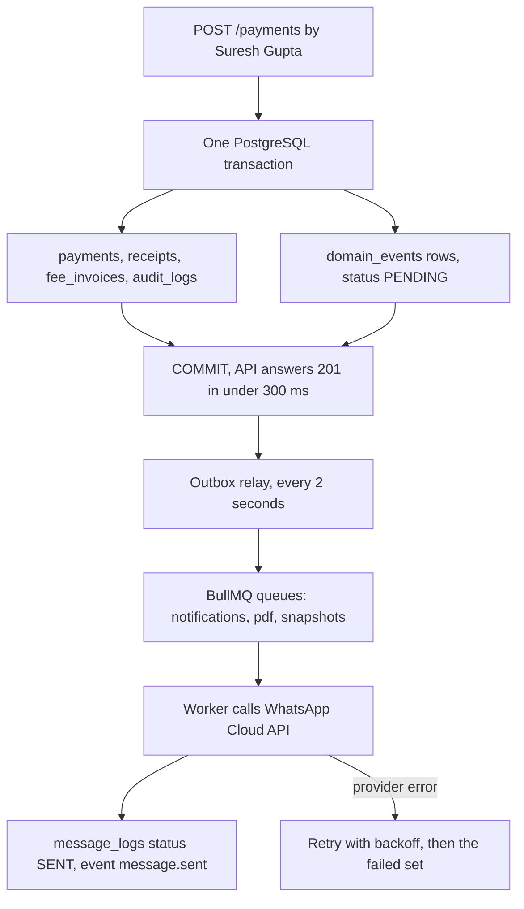

# Background Jobs and Events

**In simple words:** Many things in EduFlow must happen after the user has already
seen "Saved". A receipt PDF must be built, a WhatsApp message must go to Sunita
Devi, tomorrow's invoices must be generated at 02:00. This chapter defines the
one way all of that is done: a module announces a fact as a domain event, the
event is stored in the same database transaction as the fact, and a BullMQ worker
picks it up and reacts. Nothing is lost, nothing is done twice, and no parent
waits for a provider to answer.

| Item | Value |
|---|---|
| Event transport | PostgreSQL outbox table `domain_events` plus Redis 7 (BullMQ) |
| Queue engine | BullMQ on Redis 7, prefix `eduflow-{env}`, twelve queues |
| Delivery guarantee | At-least-once, in order per entity, never lost after commit |
| Event names | The `Events emitted` lines of the four files in `docs/api/` |
| Scheduled work | BullMQ job schedulers plus one tick job per schedule |
| Worker process | `node dist/jobs/worker.js`, same image as the API |
| Depends on | *System Architecture*, *Multi-Tenancy and Data Isolation* |
| Read next | *Integrations and Webhooks*, *Audit Logs, Backups and Disaster Recovery* |

*System Architecture* fixes the queue list, the retry numbers and the worker
shape. This chapter is the layer above: how an event is named, shaped, stored,
delivered, replayed and watched.

## Why an Event Bus at All

A direct call from Payments into WhatsApp would stop a fee counter in Patna
taking cash when Meta is slow. Three rules prevent that. The transaction
owns the truth: money and marks are written inside one PostgreSQL transaction.
The event announces the truth: the producer writes an event row in that same
transaction and then forgets it. The consumer reacts later: a worker does the
slow work, with retries.

> **Rule:** A web request never calls WhatsApp, SES, MSG91, S3 upload, Razorpay
> refund or a PDF renderer. It writes rows and one event, and answers in under
> 300 ms. The only live provider calls are listed in *System Architecture*.

The producer never knows its consumers. Fees does not import Notifications. It
writes `fee.invoice.paid`, and whoever cares subscribes.

## Event Naming Rules

An event name is lower-case, dot-separated, and ends in a past-tense verb,
because an event is a fact that already happened.

| Part | Rule | Example |
|---|---|---|
| Segment 1 | Module or aggregate in singular | `fee`, `student`, `whatsapp` |
| Segment 2 | The thing that changed | `invoice`, `application`, `wallet` |
| Last segment | Past tense, `snake_case` if two words | `.paid`, `.status_changed` |
| Length | Two or three segments, at most 80 characters | `admission.application.approved` |
| Never | No `will`, `should`, `do`, no command names | `send.sms` is wrong |

Wrong: `fee.sendReminder` (an order), `student.update` (not past tense),
`FEE_INVOICE_PAID` (wrong casing), `invoice.paid` (no module prefix).

Some events have several producers and must keep one meaning.
`student.leave.requested` comes from *Leave Module* and *Parent Portal Module*;
`consent.granted` and `consent.withdrawn` from *Settings Module* and *Parent
Portal Module*; `payment.order.created` from Payments and both portals.
Consumers must never assume the caller.

An event name is permanent. A changed payload gets `version: 2`, never a renamed
event. Version 1 stays supported for one full release phase.

## The Event Envelope

Every event, from every module, has the same outer shape. Only `payload` differs.

```json
{
  "id": "0f1d8c6e-4a2b-4a7d-9f31-2c5a7b8e9d01",
  "name": "fee.invoice.paid",
  "version": 1,
  "occurredAt": "2027-07-14T09:12:48.332Z",
  "organizationId": "8b2f4d51-93c7-4a0e-9b55-1d7e3f204a6c",
  "campusId": "c1a77e02-55b9-4f3d-8a12-6b09d4e77f31",
  "actor": {
    "type": "USER",
    "id": "5d9c1b44-2e77-4c18-9a63-0f8b52d31e90",
    "role": "ACCOUNTANT",
    "name": "Suresh Gupta"
  },
  "entity": { "type": "FeeInvoice", "id": "a47c9e12-6b3f-4d85-91ac-73e5b0f2c8d4" },
  "payload": {
    "invoiceNo": "INV-2027-0912",
    "studentId": "e93b7a20-1c4d-4f66-bb08-9a2e5d71c3f8",
    "amountPaid": "12000.00",
    "currency": "INR",
    "balance": "0.00",
    "paymentId": "72f0ab3c-8d19-4e52-a7c6-45b8e109d2f3"
  },
  "requestId": "req_8f3a4c19b27d",
  "correlationId": "req_8f3a4c19b27d"
}
```

| Field | Type | Required | Meaning |
|---|---|---|---|
| `id` | UUID v4 | Yes | Event row id; also the consumer idempotency key |
| `name` | string | Yes | From the registry, for example `fee.invoice.paid` |
| `version` | int | Yes | Payload shape version, starts at 1 |
| `occurredAt` | ISO 8601 UTC | Yes | Commit time, not publish time |
| `organizationId` | UUID | Yes | Tenant; null only for platform events |
| `campusId` | UUID | No | Null when the fact is organization-wide |
| `actor` | object | Yes | `USER`, `SYSTEM`, `API_KEY` or `IMPERSONATION` |
| `entity` | object | Yes | Prisma model name plus its id |
| `payload` | object | Yes | IDs and a few labels, never a whole record |
| `requestId` | string | No | The API request that caused it |
| `correlationId` | string | No | Groups a chain from one action |

> **Rule:** Money in a payload is a string, never a JSON number. `"12000.00"`
> survives a round trip; `12000.00` can become `12000.000000001`. Dates are ISO
> 8601 UTC with `Z`. The organization timezone is applied only when a message is
> written for a human.

The `actor` block lets *Notifications Module* skip the person who caused the
event: Suresh Gupta needs no note that he collected cash, the parent does.
Payloads stay under 4 KB: identifiers plus the few labels a template needs
(`invoiceNo`, `studentName`, `amountPaid`), never a whole record.

## Domain Event Catalog

Below is every event from the `Events emitted` lines of the four registry files.
Consumer short codes keep the tables readable: `NTF` = Notifications engine
(template, recipient, preference, channel), `CACHE` = cache invalidator, `SNAP`
= the `snapshots` queue that refreshes `daily_metric_snapshots`, `SEC` =
security monitor (Sentry, login history, platform alert), `PDF` = the `pdf`
queue, `AI` = AI Insights scoring, `FIN` = Fees or Payments, `HR` = Staff, Leave
or Payroll.

> **Rule:** Every event is also offered to the outbound webhook dispatcher of
> *Integrations and Webhooks*, so `HOOK` is not repeated per row. The audit
> trail is not a consumer: `audit_logs` is written inside the same transaction,
> so denied and failed actions are recorded even when no event is emitted.

### Platform and People Events

| Event | Producer | Consumers | Typical reaction |
|---|---|---|---|
| `auth.login.succeeded`, `auth.login.failed` | AUTH | `SEC` | Write `login_histories`; count failures per account and IP |
| `auth.account.locked` | AUTH | `NTF`, `SEC` | Mail the user; alert the Org Admin |
| `auth.otp.requested` | AUTH | `NTF` | Send the code inside 5 seconds |
| `auth.password.reset_requested`, `auth.password.changed` | AUTH | `NTF`, `SEC` | Send the link; revoke other sessions |
| `auth.contact.verified` | AUTH | `CACHE` | Drop the `/auth/me` cache |
| `auth.mfa.enabled`, `auth.mfa.disabled` | AUTH | `NTF`, `SEC` | Confirm; alert when MFA goes off |
| `auth.session.revoked`, `auth.token.reuse_detected` | AUTH | `SEC`, `NTF` | Kill the token family; Sentry alert |
| `invitation.sent`, `invitation.resent`, `invitation.revoked`, `invitation.expired`, `invitation.accepted` | USR | `NTF` | Send or withdraw; nightly expiry sweep |
| `user.created`, `user.updated`, `user.suspended`, `user.activated`, `user.deactivated`, `user.deleted` | USR | `CACHE`, `NTF` | Drop the permission cache; welcome mail |
| `user.password.reset_by_admin`, `user.mfa.reset`, `user.sessions.revoked` | USR | `NTF`, `SEC` | Tell the user who did it |
| `user.roles.changed`, `user.campuses.changed`, `role.created`, `role.updated`, `role.deleted`, `role.permissions.changed` | USR | `CACHE` | Drop `org:{orgId}:perm:*` |
| `metrics.snapshot.computed` | DASH | `CACHE` | Delete the dashboard keys of that campus |
| `organization.created`, `organization.verified`, `organization.onboarding.completed`, `organization.activated` | ORG | `NTF`, `SNAP` | Welcome mail, checklist, funnel counters |
| `organization.updated`, `organization.ownership.transferred` | ORG | `CACHE`, `NTF` | Reload settings; inform both owners |
| `organization.suspended`, `organization.reactivated`, `organization.cancelled` | ORG | `NTF`, `SEC` | Block or reopen logins |
| `organization.limit.near`, `organization.limit.reached` | ORG | `NTF` | Upgrade nudge at 80 and 100 percent |
| `subscription.trial.ending`, `subscription.trial.expired` | ORG | `NTF` | Remind at 7, 3, 1 day; then downgrade |
| `subscription.activated`, `subscription.plan_changed`, `subscription.renewed` | ORG | `CACHE`, `NTF` | Reload `plan_features`; send the summary |
| `subscription.payment_failed`, `subscription.past_due`, `subscription.cancelled` | ORG | `NTF` | Start the `billing-dunning` ladder |
| `subscription.invoice.issued`, `subscription.invoice.paid`, `subscription.invoice.refunded` | ORG | `PDF`, `NTF` | Render the GST invoice and mail it |
| `addon.purchased`, `addon.activated`, `addon.expired`, `addon.cancelled` | ORG | `CACHE`, `NTF` | Switch the feature flag |
| `platform.impersonation.started` | ORG | `SEC`, `NTF` | Alert the Org Admin with the reason |
| `campus.created`, `campus.updated`, `campus.activated`, `campus.deactivated`, `campus.archived`, `campus.deleted`, `campus.main_changed` | CAMP | `CACHE`, `SNAP` | Rebuild the campus picker; add snapshot rows |
| `campus.users.changed`, `campus.setup.copied` | CAMP | `CACHE` | Drop the campus scope cache |
| `admission.inquiry.created`, `admission.inquiry.assigned`, `admission.inquiry.stage_changed`, `admission.inquiry.lost` | ADM | `NTF`, `SNAP` | Thank-you message; funnel counters |
| `admission.followup.scheduled`, `admission.followup.due`, `admission.demo.scheduled` | ADM | `NTF` | Remind counsellor and parent |
| `admission.application.submitted`, `admission.application.documents_requested`, `admission.application.test_scheduled`, `admission.application.interview_scheduled` | ADM | `NTF` | Status plus pending document checklist |
| `admission.application.approved`, `admission.application.waitlisted`, `admission.application.rejected`, `admission.application.withdrawn` | ADM | `NTF`, `FIN` | Offer letter; raise the admission invoice |
| `admission.application.fee_paid`, `admission.application.enrolled` | ADM | `SNAP`, `NTF` | Count the admission; create the student |
| `student.admitted`, `student.enrolled`, `student.enrollment.ended` | STU | `FIN`, `NTF`, `SNAP` | Assign the fee structure; open parent access |
| `student.updated`, `student.status_changed`, `student.withdrawn`, `student.deleted` | STU | `FIN`, `SNAP`, `AI` | Stop future invoices and registers |
| `student.guardian.linked`, `student.guardian.unlinked` | STU | `NTF` | Send or withdraw the portal invitation |
| `student.promoted`, `student.detained` | STU | `FIN`, `SNAP` | New-year fee plan; carry the balance |
| `student.document.uploaded`, `student.document.verified`, `student.note.shared` | STU | `NTF` | In-app note to office or guardian |
| `student.transfer.requested`, `student.transfer.approved`, `student.transfer.rejected` | STU | `NTF`, `FIN` | Move the enrollment; settle dues |
| `student.import.completed`, `teacher.import.completed`, `staff.import.completed` | STU, TCH, STF | `NTF` | Mail counts and the error workbook |
| `student.birthday`, `staff.birthday`, `staff.work_anniversary` | STU, STF | `NTF` | Greeting at 08:00 and 07:00 local |
| `teacher.created`, `teacher.updated`, `teacher.status_changed`, `teacher.deleted` | TCH | `CACHE`, `NTF` | Refresh the teacher picker and login |
| `teacher.subjects.changed`, `teacher.batch.assigned`, `teacher.batch.unassigned` | TCH | `CACHE`, `NTF` | Rebuild the rights of Priya Nair |
| `teacher.document.uploaded`, `staff.document.uploaded`, `staff.document.verified` | TCH, STF | `NTF` | Tell HR a document waits |
| `staff.document.expiring` | STF | `NTF` | Alert at 30, 7 and 0 days |
| `staff.created`, `staff.updated`, `staff.status_changed`, `staff.position_changed`, `staff.transferred` | STF | `CACHE`, `HR` | Update scope and payroll inputs |
| `staff.exit.recorded`, `staff.exited`, `staff.deleted` | STF | `SEC`, `HR`, `NTF` | Revoke tokens at 23:59; final payslip |

### Academic Events

| Event | Producer | Consumers | Typical reaction |
|---|---|---|---|
| `attendance.marked`, `attendance.updated` | ATT | `SNAP`, `AI` | Recompute percentages; feed the risk model |
| `attendance.session.locked`, `attendance.session.unlocked` | ATT | `NTF` | Tell the class teacher editing closed |
| `student.absent`, `student.late` | ATT | `NTF` | Delayed absent alert to the guardian |
| `student.attendance.low` | ATT | `NTF`, `AI` | Weekly warning below the threshold |
| `staff.checked_in`, `staff.checked_out`, `staff.absent` | ATT | `HR`, `SNAP` | Payroll inputs; staff present count |
| `attendance.import.completed` | ATT | `NTF` | Mail the import summary |
| `leave.request.submitted`, `leave.approval.pending` | LEV | `NTF` | Push to the next approver |
| `leave.request.approved`, `leave.request.rejected`, `leave.request.cancelled` | LEV | `NTF`, `HR` | Update the balance; trigger a substitution |
| `leave.balance.allocated`, `leave.balance.adjusted` | LEV | `NTF` | Tell the employee the new balance |
| `student.leave.requested`, `student.leave.approved`, `student.leave.rejected`, `student.leave.cancelled` | LEV, PP | `NTF` | Mark the register `LEAVE` |
| `academic_year.activated`, `academic_year.closed` | BAT | `CACHE`, `FIN`, `SNAP` | Switch the default year; freeze old reports |
| `batch.created`, `batch.status_changed` | BAT | `CACHE`, `SNAP` | The 00:30 sync flips planned to active |
| `enrollment.created`, `enrollment.withdrawn`, `enrollment.promoted`, `enrollment.detained` | BAT | `FIN`, `SNAP` | Fee plan, register membership, capacity |
| `holiday.declared`, `calendar.event.published`, `calendar.event.updated` | BAT | `NTF` | Notify parents; skip reminders that day |
| `ptm.booking.created`, `ptm.booking.cancelled` | BAT | `NTF` | Confirm the slot; hourly reminder |
| `timetable.updated` | TT | `CACHE`, `NTF` | Rebuild every affected day view |
| `substitution.assigned`, `substitution.cancelled` | TT | `NTF` | Tell the substitute the same minute |
| `class.session.scheduled`, `class.session.cancelled`, `class.session.rescheduled`, `class.session.completed` | TT | `NTF` | Create or drop the attendance session |
| `subject.created`, `subject.archived`, `curriculum.updated`, `subject.teacher.assigned`, `subject.teacher.unassigned` | SUB | `CACHE`, `NTF` | Refresh pickers and teacher scope |
| `homework.published`, `homework.updated`, `homework.cancelled`, `homework.closed`, `homework.reminder.sent` | HW | `NTF` | Message the batch; remind before the due date |
| `homework.submitted`, `homework.resubmitted`, `homework.graded`, `homework.resubmit_requested`, `study_material.published` | HW, SP | `NTF`, `AI` | Tell teacher or student; score engagement |
| `exam.schedule.published`, `exam.cancelled` | EXM | `NTF`, `PDF` | Send the datesheet |
| `exam.marks_entry.opened`, `exam.marks.submitted`, `exam.marks.verified`, `exam.marks.reopened` | EXM | `NTF` | Nudge the subject teacher |
| `exam.results.published`, `exam.results.unpublished` | EXM | `NTF`, `PDF`, `AI` | Build report cards; flag weak results |
| `exam.reevaluation.requested`, `exam.reevaluation.fee_pending`, `exam.reevaluation.resolved`, `exam.reevaluation.rejected` | EXM | `NTF`, `FIN` | Raise the fee invoice; send the outcome |
| `exam.marks.import.completed` | EXM | `NTF` | Mail the marks import summary |
| `reportcard.generated`, `reportcard.regenerated`, `reportcard.published`, `reportcard.withheld`, `reportcard.generation.failed` | RPT | `NTF`, `PDF` | Render the PDF; alert the office on failure |

### Finance, Portal and Communication Events

| Event | Producer | Consumers | Typical reaction |
|---|---|---|---|
| `fee.structure.assigned`, `fee.invoices.generated`, `fee.invoice.issued` | FEE | `NTF`, `PDF`, `SNAP` | Render the invoice; tell the payer |
| `fee.invoice.due_soon`, `fee.invoice.due_today`, `fee.invoice.overdue`, `fee.reminder.sent` | FEE | `NTF` | `fees-reminders` messages Sunita Devi |
| `fee.late_fee.applied` | FEE | `NTF`, `SNAP` | One message per invoice, not per run |
| `fee.invoice.paid`, `fee.invoice.cancelled`, `fee.invoice.written_off`, `fee.invoice.carried_forward` | FEE | `NTF`, `SNAP`, `AI` | Stop reminders; update dues and risk |
| `fee.adjustment.requested`, `fee.adjustment.approved`, `fee.adjustment.rejected` | FEE | `NTF` | Route to approver; send the outcome |
| `payment.order.created`, `payment.link.sent` | PAY, PP, SP | `NTF` | Send the checkout link |
| `payment.captured`, `receipt.issued` | PAY | `NTF`, `PDF`, `SNAP` | Receipt PDF sent inside 30 seconds |
| `payment.failed`, `payment.cancelled`, `payment.disputed` | PAY | `NTF`, `SEC` | Tell the payer; raise a dispute task |
| `payment.cheque.cleared`, `payment.cheque.bounced` | PAY | `FIN`, `NTF` | Reopen the invoice; charge the bounce fee |
| `receipt.cancelled`, `refund.requested`, `refund.approved`, `refund.rejected`, `refund.processed`, `refund.failed` | PAY | `NTF`, `SNAP` | Refund messages; correct the numbers |
| `settlement.reconciled`, `settlement.mismatch` | PAY | `NTF`, `SEC` | Alert finance on a payout gap |
| `dayclose.submitted`, `dayclose.discrepancy` | PAY | `NTF` | Tell the Org Admin about a cash gap |
| `discount.requested`, `discount.approved`, `discount.rejected`, `discount.revoked` | DSC | `NTF`, `FIN` | Recalculate that student open invoices |
| `scholarship.opened`, `scholarship.closed`, `scholarship.application.submitted`, `scholarship.application.shortlisted` | SCH | `NTF` | Announce; acknowledge each application |
| `scholarship.application.approved`, `scholarship.application.rejected`, `scholarship.awarded` | SCH | `NTF`, `FIN` | Apply the award to the fee plan |
| `scholarship.disbursed`, `scholarship.disbursement.reversed`, `scholarship.award.suspended`, `scholarship.award.reinstated`, `scholarship.award.revoked`, `scholarship.award.renewed` | SCH | `FIN`, `NTF` | Credit or reverse; inform the guardian |
| `portal.parent.first_login`, `portal.student.first_login` | PP, SP | `SNAP`, `NTF` | Count adoption; stop invitation reminders |
| `consent.granted`, `consent.withdrawn` | PP, SET | `CACHE`, `NTF` | Switch the channel before the next send |
| `announcement.acknowledged` | PP, NTF | `SNAP` | Mark read; feed the reach report |
| `certificate.requested` | PP, SP | `NTF` | Put it in the office queue |
| `notification.created` | NTF | `CACHE` | Bump the in-app badge count |
| `announcement.scheduled`, `announcement.sent`, `announcement.cancelled` | NTF | `NTF` | Enqueue or drop chunks of 100 |
| `message.queued`, `message.sent`, `message.delivered`, `message.read`, `message.failed`, `message.fallback_triggered` | NTF | `SNAP`, `SEC` | Update `message_logs`; fall back to SMS |
| `whatsapp.account.connected`, `whatsapp.account.disconnected`, `whatsapp.account.quality_changed` | WA | `NTF`, `SEC` | Warn before Meta throttles the number |
| `whatsapp.template.approved`, `whatsapp.template.rejected`, `whatsapp.template.paused` | WA | `NTF`, `CACHE` | Re-pick the channel for queued rows |
| `whatsapp.message.received`, `whatsapp.opt_in.recorded`, `whatsapp.opt_out.recorded` | WA | `NTF` | Store the reply; respect the opt-out |
| `whatsapp.wallet.topped_up`, `whatsapp.wallet.low_balance`, `whatsapp.wallet.exhausted`, `sms.wallet.topped_up`, `sms.wallet.low_balance`, `sms.wallet.exhausted` | WA, SMS | `NTF` | Ask the owner to recharge |
| `email.identity.verified`, `email.identity.failed`, `sms.sender.verified`, `sms.sender.failed` | EML, SMS | `NTF` | Tell the Org Admin sending is live |
| `email.bounced`, `email.complained`, `email.unsubscribed`, `email.suppression.added`, `email.suppression.removed` | EML | `NTF` | Suppress the address; ask for a correction |
| `sms.dlt_template.approved`, `sms.dlt_template.rejected`, `sms.opted_out` | SMS | `NTF`, `CACHE` | Refresh the DLT cache; stop that number |

### Operations and Intelligence Events

| Event | Producer | Consumers | Typical reaction |
|---|---|---|---|
| `library.book.issued`, `library.book.renewed`, `library.book.returned` | LIB | `NTF` | Confirm; update the copy status |
| `library.book.due_soon`, `library.book.overdue`, `library.book.lost` | LIB | `NTF`, `FIN` | Daily reminder; raise the fine |
| `library.fine.charged`, `library.fine.waived`, `library.import.completed` | LIB | `FIN`, `NTF` | Add or remove the charge; mail the import summary |
| `library.reservation.placed`, `library.reservation.ready`, `library.reservation.expired`, `library.reservation.cancelled` | LIB | `NTF` | Hold the copy 48 hours |
| `inventory.stock.low`, `inventory.stock.received`, `inventory.stock.issued`, `inventory.stock.returned`, `inventory.stock.sold`, `inventory.stock.transferred`, `inventory.stock.adjusted` | INV | `NTF`, `SNAP` | Reorder alert; stock value report |
| `inventory.purchase_order.submitted`, `inventory.purchase_order.approved`, `inventory.purchase_order.rejected`, `inventory.purchase_order.ordered`, `inventory.purchase_order.cancelled` | INV | `NTF` | Move the order through approvals |
| `inventory.asset.assigned`, `inventory.asset.returned`, `inventory.asset.overdue`, `inventory.import.completed` | INV | `NTF`, `HR` | Remind the holder; block exit clearance |
| `transport.assignment.created`, `transport.assignment.changed`, `transport.assignment.suspended`, `transport.assignment.resumed`, `transport.assignment.ended` | TRN | `NTF`, `FIN` | Start or stop the transport fee head |
| `transport.trip.started`, `transport.trip.completed`, `transport.trip.cancelled` | TRN | `NTF` | Bus status to guardians on that route |
| `transport.student.boarded`, `transport.student.not_boarded`, `transport.student.dropped` | TRN | `NTF` | Boarding message inside one minute |
| `transport.vehicle.document_expiring`, `transport.driver.licence_expiring`, `transport.maintenance.due` | TRN | `NTF` | Alert at 30, 7 and 0 days |
| `hostel.allocation.reserved`, `hostel.allocation.checked_in`, `hostel.allocation.transferred`, `hostel.allocation.vacated`, `hostel.allocation.cancelled` | HST | `NTF`, `FIN` | Start or close the hostel fee head |
| `hostel.attendance.marked`, `hostel.student.absent`, `hostel.student.late_entry` | HST | `NTF` | Roll-call alert to warden and guardian |
| `hostel.leave.requested`, `hostel.leave.approved`, `hostel.leave.rejected`, `hostel.leave.cancelled`, `hostel.leave.checked_out`, `hostel.leave.returned`, `hostel.leave.overdue` | HST | `NTF` | Gate pass messages; overdue alert |
| `hostel.visitor.checked_in`, `hostel.visitor.checked_out` | HST | `NTF` | Tell the guardian who visited |
| `payroll.salary.revised`, `payroll.adjustment.approved`, `payroll.adjustment.rejected` | PRL | `NTF`, `HR` | Feed the next payroll run |
| `payroll.run.processed`, `payroll.run.process_failed`, `payroll.run.approved`, `payroll.run.reopened`, `payroll.run.paid`, `payroll.run.locked` | PRL | `NTF`, `SNAP` | Tell HR; lock or unlock the month |
| `payroll.payslip.published`, `payroll.payslip.held`, `payroll.payslip.cancelled` | PRL | `NTF`, `PDF` | Render and mail the payslip |
| `payroll.loan.requested`, `payroll.loan.approved`, `payroll.loan.rejected`, `payroll.loan.disbursed`, `payroll.loan.closed` | PRL | `NTF`, `HR` | Start or stop the monthly deduction |
| `payroll.tax_declaration.submitted`, `payroll.tax_declaration.verified` | PRL | `NTF`, `HR` | Recompute the tax deduction |
| `certificate.request.submitted`, `certificate.request.approved`, `certificate.request.rejected`, `certificate.request.cancelled` | CRT | `NTF` | Route to approver; tell the applicant |
| `certificate.issued`, `certificate.reissued`, `certificate.revoked`, `certificate.sent`, `certificate.bulk_issue.completed`, `certificate.verified` | CRT | `PDF`, `NTF` | Render with QR; mail the link |
| `analytics.report.saved`, `analytics.report.shared`, `analytics.schedule.created` | ANL | `NTF` | Tell the people it was shared with |
| `analytics.schedule.delivered`, `analytics.schedule.failed` | ANL | `NTF`, `SEC` | Mail the file or report the failure |
| `analytics.snapshot.computed`, `analytics.snapshot.rebuilt` | ANL | `CACHE` | Drop the analytics cache |
| `ai.insight.generated`, `ai.insight.critical`, `ai.insight.acted`, `ai.insight.dismissed` | AI | `NTF` | Push critical insights to the Principal |
| `ai.student.risk_level_changed`, `ai.risk_scores.computed` | AI | `NTF`, `SNAP` | Alert the class teacher on high risk |
| `ai.quota.threshold_reached`, `ai.quota.exhausted` | AI | `NTF` | Warn at 80 percent; offer a top-up |
| `settings.updated`, `settings.branding.updated`, `settings.number_sequence.updated`, `settings.custom_field.created`, `settings.custom_field.archived` | SET | `CACHE` | Reload the effective settings |
| `payment_gateway.connected`, `payment_gateway.verification_failed`, `payment_gateway.disconnected` | SET | `NTF`, `SEC` | Switch online payment on or off |
| `api_key.created`, `api_key.rotated`, `api_key.revoked`, `api_key.expiring` | SET | `SEC`, `NTF` | Expiry alert; block the revoked key |
| `policy.published`, `consent.requested` | SET | `NTF` | Ask parents to accept at next login |
| `dsr.received`, `dsr.due_soon`, `dsr.completed`, `dsr.rejected` | SET | `NTF`, `SEC` | Track the statutory clock |
| `data_breach.reported`, `data_breach.notification_due`, `data_breach.closed` | SET | `SEC`, `NTF` | `breach-clock` drives the 72-hour duty |
| `file.uploaded`, `file.quarantined`, `file.deleted` | CMN | `SEC`, `NTF` | Quarantine alert; purge the object later |
| `import.started`, `import.completed`, `import.completed_with_errors`, `import.failed`, `export.completed`, `export.failed` | CMN | `NTF` | Mail the summary and the link |
| `audit.chain.mismatch` | CMN | `SEC` | Page the founder: the hash chain broke |

## The Transactional Outbox

Publishing straight to Redis after a commit has a hole: if the process dies
between commit and publish, the receipt exists and the parent never hears about
it. The outbox closes it. The event row is written by the same transaction as
the business rows, so it commits or disappears with them.

> **Note:** Assumption. The schema in `docs/schema/` has no event table yet. This
> chapter adds one model, `DomainEvent` (table `domain_events`), plus the enum
> `DomainEventStatus`, to `01-platform.prisma`. Nothing else changes.

```prisma
enum DomainEventStatus {
  PENDING
  PUBLISHED
  FAILED
}

/// Transactional outbox: one row per domain event, written inside the
/// producing transaction and relayed to BullMQ by the outbox worker.
model DomainEvent {
  id             String            @id @default(uuid()) @db.Uuid
  organizationId String?           @map("organization_id") @db.Uuid
  campusId       String?           @map("campus_id") @db.Uuid
  name           String            @db.VarChar(80)
  version        Int               @default(1) @db.SmallInt
  actorType      AuditActorType    @map("actor_type")
  actorId        String?           @map("actor_id") @db.Uuid
  entityType     String            @map("entity_type") @db.VarChar(60)
  entityId       String            @map("entity_id") @db.Uuid
  payload        Json
  requestId      String?           @map("request_id") @db.VarChar(40)
  status         DomainEventStatus @default(PENDING)
  attempts       Int               @default(0) @db.SmallInt
  lastError      String?           @map("last_error") @db.Text
  occurredAt     DateTime          @default(now()) @map("occurred_at") @db.Timestamptz(6)
  publishedAt    DateTime?         @map("published_at") @db.Timestamptz(6)
  createdAt      DateTime          @default(now()) @map("created_at") @db.Timestamptz(6)

  organization Organization? @relation(fields: [organizationId], references: [id], onDelete: Cascade)

  @@index([status, occurredAt])
  @@index([organizationId, name, occurredAt])
  @@index([organizationId, entityType, entityId])
  @@map("domain_events")
}
```

**Figure: From one API transaction to the parent phone**



The API commits and answers. A relay job then moves `PENDING` rows to the
queues. If Redis is down, the rows wait in PostgreSQL and go out when it returns.

```typescript
// server/src/lib/events.ts (shortened)
import type { Prisma } from '@prisma/client';
import { getTenantContext } from './tenant-context';

export interface EventInput {
  name: string;
  entityType: string;
  entityId: string;
  payload: Record<string, unknown>;
  campusId?: string;
  version?: number;
}

/** Called INSIDE a transaction. Never awaits a provider, never throws late. */
export async function emit(tx: Prisma.TransactionClient, input: EventInput) {
  const ctx = getTenantContext();
  await tx.domainEvent.create({
    data: {
      organizationId: ctx.orgId,
      campusId: input.campusId ?? ctx.campusId ?? null,
      name: input.name,
      version: input.version ?? 1,
      actorType: ctx.actorType, // USER | SYSTEM | API_KEY | IMPERSONATION
      actorId: ctx.userId ?? null,
      entityType: input.entityType,
      entityId: input.entityId,
      payload: input.payload as Prisma.InputJsonValue,
      requestId: ctx.requestId ?? null,
    },
  });
}
```

```typescript
// server/src/modules/payments/payments.service.ts (the calling side)
export async function collectCash(input: CollectCashInput) {
  return prisma.$transaction(async (tx) => {
    const payment = await tx.payment.create({ data: buildPayment(input) });
    const receipt = await tx.receipt.create({ data: buildReceipt(payment) });
    await allocateToInvoices(tx, payment, input.invoiceIds);
    await writeAuditLog(tx, 'payment.collect', receipt.id);

    await emit(tx, {
      name: 'receipt.issued',
      entityType: 'Receipt',
      entityId: receipt.id,
      payload: {
        receiptNo: receipt.receiptNo,
        studentId: input.studentId,
        amount: payment.amount.toFixed(2),
        currency: payment.currency,
      },
    });
    return receipt; // the event goes out only if this transaction commits
  });
}
```

```typescript
// server/src/jobs/outbox.worker.ts (the relay, shortened)
const CLAIM = Prisma.sql`
  UPDATE domain_events SET status = 'PUBLISHED', published_at = now(),
         attempts = attempts + 1
  WHERE id IN (
    SELECT id FROM domain_events WHERE status = 'PENDING'
    ORDER BY occurred_at LIMIT 200 FOR UPDATE SKIP LOCKED
  ) RETURNING *`;

export async function relayOnce() {
  const rows = await prisma.$queryRaw<DomainEventRow[]>(CLAIM);
  for (const row of rows) {
    // fan-out: one BullMQ job per subscribed consumer, jobId = consumer + event id
    await Promise.all(routeEvent(row));
  }
  return rows.length;
}
```

`FOR UPDATE SKIP LOCKED` lets two worker copies relay at once without sending an
event twice. A row still unrouted after 5 attempts becomes `FAILED`, raises a
Sentry event and can be replayed by hand. Rows are kept 30 days; `audit_logs` is
the permanent record, not the outbox.

## Queues, Retries and Fairness

*System Architecture* fixes the twelve queues and their concurrency. This table
adds the dead-letter behaviour and the fairness rule for each one.

| Queue | Attempts, backoff | Dead letter | Per-tenant fairness |
|---|---|---|---|
| `notifications` | 5, exp. 30 s | 14 days; `message.failed` | Chunks of 100 at priority 10, receipts at 1 |
| `whatsapp` | 5, exp. 30 s | 14 days; row `FAILED` | Shared limiter, 40 sends per second |
| `sms` | 5, exp. 30 s | 14 days; wallet refund row | Chunked like `notifications` |
| `email` | 5, exp. 30 s | 14 days; suppress hard bounce | Batch of 50 per job |
| `pdf` | 3, exp. 10 s | 14 days; `pdfFileId` stays null | One job per document, receipts first |
| `imports` | 3, fixed 60 s | `import_jobs.status = FAILED` | Concurrency 1, chunks of 200 rows |
| `exports` | 3, fixed 60 s | `export_jobs.status = FAILED` | One running export per user |
| `invoices` | 5, exp. 60 s | 30 days; nothing half-written | One job per organization per tick |
| `reminders` | 5, exp. 60 s | 14 days | One job per organization per tick |
| `snapshots` | 3, fixed 5 min | 14 days; next tick repairs it | Only tenants active in 15 minutes |
| `webhooks` | 8, exp. 15 s | `webhook_events` `FAILED`, replay by PAY-API-41 | Concurrency 5, oldest first |
| `ai` | 3, fixed 5 min | 14 days; quota not charged | One run per organization per night |

> **Rule:** A tick job never adds one giant job. It adds one job per
> organization, and inside an organization one job per chunk. Sharma Classes
> with 350 students is never stuck behind a 1,200-student school.

## Job Payload Rules

| Rule | Why |
|---|---|
| IDs only: `{ organizationId, recordId }` | A stale copy must never be sent |
| No phone, email, name, amount or token | Redis is not encrypted at rest |
| Under 4 KB | Big payloads slow Redis |
| Stable `jobId`, for example `receipt-pdf-{receiptId}` | BullMQ refuses a duplicate |
| No `:` inside a custom `jobId` | BullMQ reserves the colon |
| `runWithTenant()` before any query | Row-Level Security needs the tenant |

## Idempotent Handlers

Delivery is at-least-once, so every handler must be safe to run twice. Three
patterns cover EduFlow.

| Pattern | Where it is used | How it works |
|---|---|---|
| Status guard | Messages, imports, exports, webhooks | Return early when the row is not in the expected status |
| Unique key | Credit debits, snapshots, reminders | A unique index makes the second write fail and be ignored |
| Stable job ID | PDFs, snapshots, absent alerts | BullMQ drops a job whose ID is already queued |

```typescript
// server/src/jobs/handlers/send-whatsapp.ts (status guard + unique key)
export async function sendWhatsApp(job: Job<{ organizationId: string; messageLogId: string }>) {
  await runWithTenant({ orgId: job.data.organizationId, actor: 'SYSTEM' }, async () => {
    const row = await prisma.messageLog.findUnique({ where: { id: job.data.messageLogId } });
    if (!row || row.status !== 'QUEUED') return; // already sent by an earlier attempt
    if (!row.toPhone) throw new UnrecoverableError('No phone number on the message');

    const res = await whatsapp.send(row); // provider call, may throw
    await prisma.messageLog.update({
      where: { id: row.id },
      data: { status: 'SENT', providerMessageId: res.id, sentAt: new Date() },
    });
  });
}
```

Errors split in two. A timeout, a 429 or a 5xx from Meta is a normal error and
BullMQ retries it. A wrong phone number, a rejected template or an empty wallet
is thrown as `UnrecoverableError` and goes to the failed set at once.

## Scheduled Jobs

Every schedule is a BullMQ job scheduler registered when the worker starts. It
fires a small tick that converts the current UTC time into each
`Organization.timezone` and adds one job per organization whose local clock
matches. Lucknow and Dubai each get their 02:00 run at their own 02:00.

```typescript
// server/src/jobs/scheduler.ts (shortened)
await queues.invoices.upsertJobScheduler(
  'tick-fees-late-fee',
  { pattern: '*/15 * * * *' }, // every 15 minutes, UTC
  { name: 'fees-late-fee-tick', data: { localTime: '01:00' } },
);

export async function feesLateFeeTick(job: Job<{ localTime: string }>) {
  const orgs = await prisma.organization.findMany({
    where: { status: 'ACTIVE' },
    select: { id: true, timezone: true },
  });
  const today = new Date();
  for (const org of orgs) {
    if (localHhMm(today, org.timezone) !== job.data.localTime) continue;
    const day = localDate(today, org.timezone); // 2027-07-20
    await queues.invoices.add(
      'fees-late-fee',
      { organizationId: org.id, runDate: day },
      { jobId: `fees-late-fee-${org.id}-${day}` }, // one run per day, whatever happens
    );
  }
}
```

| Local time | Job | Queue | What it does |
|---|---|---|---|
| 00:30 | `batch.status-sync` | `snapshots` | Planned batches go active, finished ones complete |
| 00:30 | `metrics-snapshot-close` | `snapshots` | Final recompute of yesterday in `daily_metric_snapshots` |
| Every 15 min | `metrics-snapshot-live` | `snapshots` | Refresh only tenants active since the last run |
| 01:00 | `fees-late-fee` | `invoices` | Set `OVERDUE`, recalculate late fees, apply the cap |
| 01:00 | `consent-expire` | `reminders` | Consent past `expiresAt` becomes `EXPIRED` |
| 02:00 | `fees-scheduled-generate` | `invoices` | Generate and issue the coming installments |
| 02:00 | `privacy-retention` | `reminders` | Delete or anonymise data past retention |
| 02:00 UTC | `api-key-expiry` | `reminders` | Emit `api_key.expiring`; deactivate expired keys |
| 02:00 IST | `campus-limit-reconcile` | `snapshots` | Reapply the campus limit after an add-on ends |
| 03:30 IST | `backup-verify` | `snapshots` | Check the nightly backup and restore test |
| 06:00 IST | `billing-renewal-invoices` | `invoices` | Renewal invoices 30 days before period end |
| 06:30 | `document-expiry-alerts` | `reminders` | Staff, vehicle, driver docs at 30, 7, 0 days |
| 06:00 Monday | `attendance.low-check` | `reminders` | Emit `student.attendance.low` below threshold |
| 07:00 | `staff-celebrations` | `reminders` | Emit `staff.birthday`, `staff.work_anniversary` |
| 08:00 | `student-birthdays` | `reminders` | Emit `student.birthday` for active students |
| 09:00 (setting) | `fees-reminders` | `reminders` | Upcoming, due today, overdue, final notice |
| 09:00 | `billing-dunning` | `reminders` | Dunning ladder, plan changes, add-on expiry |
| Every 15 min | `report-scheduler` | `exports` | Run due `report_schedules`, mail, set `nextRunAt` |
| Every 15 min | `billing-reconcile` | `invoices` | Match settlements against payments |
| Hourly, min 10 | `attendance.auto-lock` | `snapshots` | Lock sessions past their edit window |
| 23:30 | `attendance.staff-fill` | `snapshots` | Write `HOLIDAY` and `WEEK_OFF` staff rows |
| 23:00 | `ai-risk-recompute` | `ai` | Recompute `student_risk_scores`, emit changes |

Absent alerts are not clock jobs. Marking a register emits `student.absent`, and
the handler adds a delayed job with the ID `absent-alerts-{sessionId}`, so a
teacher who fixes a mistake inside the delay window never causes a wrong message
to Sunita Devi.

## Monitoring and Alerts

The queue dashboard is Bull Board at `/platform/queues`. It needs `platform.view`
and MFA, and shows waiting, active, delayed and failed jobs per queue, with
retry and remove buttons.

| Signal | Where it is read | Alert when |
|---|---|---|
| Waiting jobs per queue | Bull Board, `/health/ready` | Above 500 for 10 minutes |
| Failed jobs | Sentry, one event per failure | More than 20 in 10 minutes on one queue |
| Outbox lag | Oldest `PENDING` in `domain_events` | Older than 60 seconds |
| Job duration | One Pino line per job, p95 | Above 30 s on `pdf`, 5 min on `imports` |
| Worker heartbeat | Better Stack uptime check | No tick for 3 minutes |
| Missed schedule | `lastRunAt` of the daily jobs | A daily job has not run by local 12:00 |

Every job log line carries `queue`, `jobId`, `organizationId`, `attemptsMade`
and `durationMs`, so one Pino query answers "what ran for Sharma Classes last
night". Alerts reach the founder by email and WhatsApp.

## Graceful Shutdown

Railway sends `SIGTERM` on every deploy. The worker stops taking new jobs and
lets the running ones finish.

```typescript
// server/src/jobs/worker.ts (shutdown, shortened)
const workers = [notificationsWorker, whatsappWorker, pdfWorker, importsWorker];

async function shutdown(signal: NodeJS.Signals) {
  logger.info({ signal }, 'worker draining');
  await Promise.all(workers.map((w) => w.close())); // no new jobs, finish current ones
  await prisma.$disconnect();
  await redisConnection.quit();
  process.exit(0);
}
process.on('SIGTERM', shutdown);
process.on('SIGINT', shutdown);
```

A job still running when the container is killed keeps its BullMQ lock until the
lock expires and is then retried, which is safe because every handler is
idempotent. Import handlers commit chunk by chunk, so a restart resumes from the
last finished chunk.

## Running the Workers

```bash
# Local: Postgres and Redis in Docker, API and worker from the same .env
docker compose up -d postgres redis
npm run dev --workspace=server         # Express API on :4000
npm run dev:worker --workspace=server  # BullMQ worker, QUEUE_PREFIX=eduflow-local
npm run queues --workspace=server      # Bull Board on :4100
```

In production the same image runs twice on Railway: `node dist/server.js` for the
API, `node dist/jobs/worker.js` for the worker. Each environment sets its own
`QUEUE_PREFIX` (`eduflow-local`, `eduflow-stg`, `eduflow-prod`), so a staging job
is never picked up in production. Redis runs with `noeviction`: an evicted key is
a lost job. One worker replica is enough at launch; a second is added when the
waiting-jobs alert fires, and `upsertJobScheduler` is idempotent, so two replicas
never double-schedule. To test a nightly job in staging, point the tick
`localTime` at the next quarter hour instead of moving the server clock.
