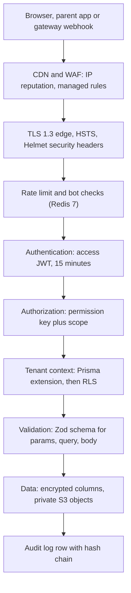
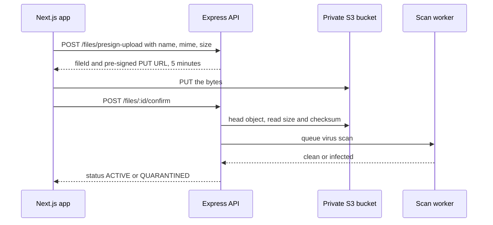

# Security Architecture

**In simple words:** This chapter explains how EduFlow keeps school data safe. It names what we protect, who might attack it, and the exact control that stops each attack: headers, rate limits, encryption keys, file rules, payment rules and audit rows. Every control is small enough for one founder to build, and each one names the test or tool that proves it works.

| Item | Value |
|---|---|
| Security owner | Mehdi Alam (founder) until the first security hire in Year 2 |
| Built by | Prompts P-05, P-06, P-07, P-08, P-21, P-22, and reviewed by P-52 |
| Baseline standard | OWASP Top 10 (2021) and OWASP ASVS Level 2 for the API |
| Transport | TLS 1.2 minimum, TLS 1.3 preferred, HSTS with a two-year max-age |
| At rest | AES-256 on RDS, S3 and backups; AES-256-GCM on sensitive columns |
| Key store | Railway variables in Phase 1, AWS KMS envelope keys from the AWS move |
| Rate limits | 100 requests/min per user, 1,000/min per organization, 5 logins/15 min |
| Audit | `audit_logs` with a SHA-256 chain per organization, verified monthly |
| Certification path | Self-assessment (Year 1), SOC 2 Type I (Year 2), ISO 27001 (Year 3) |
| Never stored by EduFlow | Card numbers, CVV, bank passwords, plain provider secrets |

Five chapters carry parts of this story and are not repeated here: sign-in, tokens and lockout in *Authentication and Sessions*; permission keys and scopes in *RBAC and Permissions Matrix*; tenant filters, Row-Level Security and the isolation suite in *Multi-Tenancy and Data Isolation*; legal duties and consent in *Privacy and Compliance*; backup, restore and the incident runbook in *Audit Logs, Backups and Disaster Recovery*.

## What We Protect and From Whom

Security starts with a list. If you cannot name the data, you cannot protect it. EduFlow holds data about children, so the bar is higher than for a business tool.

| Asset | Where it lives | Worst case if leaked | Protection |
|---|---|---|---|
| Student identity and contacts | `students`, `guardians` | Children traceable by strangers | Tenant filter, RLS, audit |
| Medical notes and allergies | `students.medical_notes_encrypted` | Health data of a minor exposed | Column encryption, masked in audit |
| National IDs (Aadhaar, passport) | `*_national_id_encrypted` | Identity theft, DPDP penalty | Column encryption, never in lists |
| Staff bank and tax IDs | `staff.bank_details_encrypted` | Salary fraud, payroll diversion | Encryption, `staff.view_sensitive` |
| Fee and payment records | `fee_invoices`, `payments` | Fraud, loss of trust | RBAC, day close, audit reason |
| Tenant and platform secrets | Secret store, env store | Money rerouted, full takeover | Outside the database, rotated |
| Files and documents | Private S3 bucket, `ap-south-1` | Bulk document leak | Private bucket, 5-minute URLs |
| Audit trail and backups | `audit_logs`, RDS snapshots | Break-in hidden, database copied | Hash chain, encrypted, owner-only |

Now the people. Most real incidents in Indian school software are not clever hacks. They are a shared password, an ex-employee who still has a login, or a WhatsApp forward of an export.

| Actor | Motive | Realistic capability | Main control |
|---|---|---|---|
| Outside attacker | Sell student data, ransom | Scans, credential stuffing | Rate limits, WAF, MFA |
| Curious tenant user | See other batches or salaries | Edit URLs, try IDs | Scope checks, foreign row is 404 |
| Ex-staff member | Take a student list to a rival | Old login, old export link | Deactivation revokes sessions |
| Rival institute | Read another tenant's data | Sign up, probe the API | Tenant context, RLS, TI tests |
| EduFlow platform staff | Support, or misuse | Console access | Audited impersonation only |
| Provider or library | Supply-chain compromise | Malicious npm update | Lockfile, audit, pinned actions |

> **Founder note:** One leaked export of 1,200 student records ends EduFlow. The insurance is about six days of work across the sprint, plus a review before every release.

The same threats in STRIDE form. STRIDE is a checklist of six attack shapes, so you do not think only about the attacks you already know.

| STRIDE category | Example attack on EduFlow | Control | Proof |
|---|---|---|---|
| Spoofing (pretending to be someone) | Replay of a stolen refresh token | Rotation; the family is revoked on reuse | AUTH tests |
| Spoofing | Fake Razorpay webhook marks a fee paid | HMAC signature on the raw body | SEC-19 test |
| Tampering (changing data) | Someone edits `audit_logs` directly | Append-only, hash chain, monthly verify | CMN-API-26 |
| Repudiation (denying an action) | Staff denies waiving a late fee | Audit row with actor, reason, diff | Audit review |
| Information disclosure | Parent opens another child's report card | `OWN` scope from the guardian link | RBAC tests |
| Information disclosure | File URL forwarded on WhatsApp | Five-minute expiry, one object per URL | SEC-15 test |
| Denial of service | Import loop fills the queue | Per-tenant queue quota, job size cap | Noisy-neighbour tests |
| Denial of service | Login flood on one account | Five attempts per 15 min, then lock | AUTH tests |
| Elevation of privilege | Custom role given `platform.manage` | `platform.*` refused on custom roles | RBAC tests |
| Elevation of privilege | Body carries another tenant's `organizationId` | Zod strips it; the extension throws | TI-03, TI-14 |

## The Layers of Defence

No single control is trusted. A request passes eight gates before it touches a row, and any one can fail without opening the data.

**Figure: What a request passes through before it reaches a row**



Read the figure as questions. Is the caller a known bad IP? Is the channel encrypted? Is the caller going too fast? Is the token real? Does the role hold the key? Is the row inside the caller's tenant and campus? Is the input the right shape? And is the change written down?

> **Rule:** A control with no automated test does not exist. Every SEC requirement at the end of this chapter names a test, a tool or a checklist line.

## Authentication and Authorization in One Page

The full design is in *Authentication and Sessions* and *RBAC and Permissions Matrix*. Only the security-relevant summary sits here.

| Control | Setting | Why this value |
|---|---|---|
| Password hash | bcrypt, cost factor 12 | About 250 ms per hash: slow for attackers, fine for users |
| Access token | Ed25519 JWT, 15 minutes, no permissions inside | A stolen token dies fast; grants stay fresh |
| Refresh token | 32 random bytes, 30 days, rotated, stored as SHA-256 | Reuse of an old token proves a copy exists |
| Second factor | Mandatory for `SUPER_ADMIN`, default on for `ORG_ADMIN` | Highest-value accounts first |
| Lockout | 5 failures per account and IP in 15 min, 30-minute lock | Stops credential stuffing without help-desk pain |
| Refresh cookie | `httpOnly`, `Secure`, `SameSite=Strict`, path `/api/v1/auth` | JavaScript cannot read it; it travels to four routes |

Authorization runs three checks in this order, and all three must pass:

1. **Key check.** The route declares a permission key, for example `fees.collect`. The middleware reads the caller's grants from the Redis cache (30-minute life, cleared on any role change) and answers `403 FORBIDDEN` when the key is missing.
2. **Scope check.** The grant carries a `PermissionScope`: `ALL`, `CAMPUS`, `OWN` or `VIEW`. `VIEW` allows only `GET`. `CAMPUS` filters on `user_campuses`. `OWN` reads the ownership map: a teacher's batches, a parent's children.
3. **Row check.** The row is loaded through the tenant-aware Prisma client. Another tenant's row returns `404 NOT_FOUND`, not `403`, so an attacker learns nothing about which IDs exist.

> **Warning:** Never put a permission check in the controller body alone. It belongs on the route definition, so a new route without a key fails the route-table test in CI.

## Input Validation and Output Encoding

Every request is parsed by a Zod schema before any business code runs. The schema is the only place that decides what a field may hold.

```typescript
// server/src/modules/students/students.schema.ts
import { z } from 'zod';

export const createStudentSchema = z.object({
  params: z.object({}).strict(),
  query: z.object({}).strict(),
  body: z
    .object({
      firstName: z.string().trim().min(1).max(80),
      lastName: z.string().trim().max(80).optional(),
      dateOfBirth: z.coerce.date().max(new Date(), 'Date of birth is in the future'),
      phone: z.string().regex(/^\+[1-9]\d{7,14}$/, 'Use international format, e.g. +919876543210'),
      batchId: z.string().uuid(),
      admissionNo: z.string().trim().max(30).optional(),
    })
    .strict(), // unknown keys are rejected, so organizationId can never arrive here
});
```

Five rules make the schema layer safe:

1. **Use `.strict()` everywhere.** An unknown key becomes a `VALIDATION_ERROR` (400), not a silent ignore. This kills mass assignment, where an attacker adds `organizationId`, `roleId` or `status` to a body.
2. **Allow-list, never block-list.** We say what is allowed (a UUID, an E.164 phone, an enum value), not what is banned. Block-lists of bad words always leak.
3. **Size before shape.** `express.json({ limit: '1mb' })` rejects a huge body before Zod parses it.
4. **Identifiers are UUIDs.** A path parameter that is not a UUID is rejected at the schema, so no free text reaches a query.
5. **Coercion is explicit.** Use `z.coerce.number()` on a query string, never `parseInt` in the service.

Output encoding is handled by the framework, with seven rules on top.

| Risk | Where it appears | Control |
|---|---|---|
| Stored XSS | Announcements, homework text, student notes | React escapes; no `dangerouslySetInnerHTML` |
| Rich text | Announcements, report-card remarks | Sanitized on write with a tag allow-list |
| CSV injection | Exported XLSX and CSV files | A cell starting `=`, `+`, `-`, `@` gets a `'` prefix |
| SQL injection | Reports and analytics queries | Prisma only; raw SQL as tagged templates |
| Path traversal | The `originalName` of an upload | The S3 key is `org/{orgId}/{category}/{uuid}-{slug}` |
| Request forgery to internal hosts | Domain check, webhook test calls | Outbound allow-list; private ranges refused |
| Template injection | WhatsApp and SMS templates | Variables bound by name, never concatenated |

## OWASP Top Ten Mapped to EduFlow

This table is the review checklist for prompt P-52. A module is not done until every row has an answer.

| OWASP 2021 risk | What it means here | EduFlow control |
|---|---|---|
| A01 Broken access control | Parent opens another child's invoice | Key, scope and row checks; foreign row is 404 |
| A02 Cryptographic failures | Aadhaar stored in plain text | AES-256-GCM columns, TLS 1.2+, no secrets in logs |
| A03 Injection | A report filter builds SQL by string | Prisma binding; tagged-template raw SQL only |
| A04 Insecure design | Refund with no second approval | Separation of duties, day close, audit reason |
| A05 Security misconfiguration | Debug errors shown in production | Helmet, stack-free envelope, Zod-checked env |
| A06 Vulnerable components | An old `jsonwebtoken` with a bypass | Lockfile, `npm audit`, Dependabot, pinned actions |
| A07 Identification failures | Unlimited login guesses | Lockout, MFA, rotation with reuse detection |
| A08 Software and data integrity | A build pulls an unpinned action | Action SHAs pinned, `npm ci`, signed image tags |
| A09 Logging and monitoring failures | Nobody notices the break-in | Pino plus Sentry, audit chain, alert rules |
| A10 Server-side request forgery | A domain check hits an internal URL | Outbound allow-list, private ranges blocked |

## API Protection

The API is the whole product surface. Six controls guard it.

**Rate limiting.** Counters live in Redis 7 with a sliding window, so a restart does not reset them. A limited response carries `RateLimit-Limit`, `RateLimit-Remaining` and `Retry-After`.

| Tier | Limit | Counter key | On breach |
|---|---|---|---|
| Per user | 100 per minute | `rl:u:<userId>` | `429 RATE_LIMITED` |
| Per organization | 1,000 per minute | `rl:o:<orgId>` | `429`, admin alerted |
| Login by account and IP | 5 per 15 minutes | `rl:login:<identifier>:<ip>` | Lock 30 min, `auth.account.locked` |
| One-time code | 3 per 10 min, 10 per day | `rl:otp:<identifier>` | `429`, no message sent |
| Password reset | 3 per hour | `rl:pwd:<identifier>` | `429`, caller still sees 200 |
| Public endpoints by IP | 30 per minute | `rl:ip:<ip>` | `429 RATE_LIMITED` |
| API key | `rateLimitPerMin`, default 100 | `rl:k:<apiKeyId>` | `429 RATE_LIMITED` |
| Import, export, PDF jobs | 5 running per organization | Queue quota | `422 BUSINESS_RULE_VIOLATION` |

**Bot and brute-force protection.** Cloudflare Turnstile appears on the login form after two failures from one IP, and always on the public signup and admission-inquiry forms. A failed login answers in constant time, so an attacker cannot tell "wrong password" from "no such user". Forgot-password always answers `200`, so it cannot test which phone numbers exist.

**CORS.** The API is called from exactly three origin shapes. Everything else is refused before the route runs.

```typescript
// server/src/app.ts  (Express 5)
import cors from 'cors';

const tenantHost = /^https:\/\/[a-z0-9-]{3,40}\.eduflow\.app$/;
const allowed = new Set([env.APP_URL, 'https://app.eduflow.app']);

app.use(
  cors({
    origin(origin, cb) {
      if (!origin) return cb(null, true); // server-to-server and mobile apps send no Origin
      if (allowed.has(origin) || tenantHost.test(origin)) return cb(null, true);
      return cb(new AppError('FORBIDDEN', 'Origin not allowed'));
    },
    credentials: true, // the refresh cookie must travel
    methods: ['GET', 'POST', 'PATCH', 'PUT', 'DELETE'],
    allowedHeaders: ['Authorization', 'Content-Type', 'X-Campus-Id', 'X-Organization-Id', 'Idempotency-Key'],
    exposedHeaders: ['RateLimit-Limit', 'RateLimit-Remaining', 'Retry-After'],
    maxAge: 600,
  }),
);
```

An Enterprise custom domain joins `allowed` only after SET-API-08 confirms its DNS record. A wildcard origin with credentials is never used; browsers refuse it, and so do we.

**Security headers.** Helmet sets them on every API response. This is the exact list.

| Header | Value | Why |
|---|---|---|
| `Strict-Transport-Security` | `max-age=63072000; includeSubDomains; preload` | No plain HTTP for two years |
| `Content-Security-Policy` | `default-src 'none'; frame-ancestors 'none'` | JSON needs no scripts; blocks framing |
| `X-Content-Type-Options` | `nosniff` | The browser does not guess a type |
| `X-Frame-Options` | `DENY` | No clickjacking of API responses |
| `Referrer-Policy` | `no-referrer` | A token in a URL cannot leak onward |
| `Cross-Origin-Opener-Policy` | `same-origin` | A popup cannot reach our window |
| `Cross-Origin-Resource-Policy` | `same-origin` | Other sites cannot embed responses |
| `X-Permitted-Cross-Domain-Policies` | `none` | Old Flash and PDF readers stay out |
| `Origin-Agent-Cluster` | `?1` | Asks the browser to isolate the origin |
| `X-DNS-Prefetch-Control` | `off` | No silent lookups of linked hosts |
| `X-Powered-By` | removed by Helmet | Do not advertise the framework |

The Next.js app adds a real content policy with a per-request nonce: `script-src 'self' 'nonce-<random>'`, `img-src 'self' data: https://*.s3.ap-south-1.amazonaws.com`, `connect-src 'self' https://api.eduflow.app` and `frame-src https://api.razorpay.com https://js.stripe.com`. It runs report-only for two pilot weeks, then enforces.

**Cross-site request forgery.** Only one cookie exists: the refresh cookie. Access tokens live in memory in the browser tab, so a normal API call cannot be forged from another site. Three layers protect the cookie paths: `SameSite=Strict`, so a cross-site form post does not carry it; the path `/api/v1/auth`, so it reaches four endpoints only; and an `Origin` check on `POST /auth/refresh`, where a missing or foreign origin is refused with `403 FORBIDDEN` and written to `login_histories`.

**Request size limits.** JSON and URL-encoded bodies 1 MB, query string 4 KB, path 2 KB. Upload bytes never pass through the API. The `limit` on any list is capped at 100 rows, and a report that would scan more than 100,000 rows becomes an `ExportJob` instead of a live response.

## Encryption in Transit and at Rest

**In transit.** TLS 1.2 is the floor, TLS 1.3 is preferred, and TLS 1.0, TLS 1.1 and every RC4 or 3DES cipher are off. Certificates renew automatically through Vercel, Railway and later AWS Certificate Manager. HSTS is set with `preload`, and `app.eduflow.app` joins the browser preload list once the pilot proves no plain-HTTP path is left. Internal traffic is encrypted too: PostgreSQL uses `sslmode=require`, Redis uses TLS with a password.

**At rest.** Four stores, four settings.

| Store | Encryption | Key and notes |
|---|---|---|
| PostgreSQL 16 | AES-256 volume encryption | Provider key, then a KMS customer key; covers snapshots |
| S3 documents | SSE-KMS, public access blocked | Customer key per region; versioning on |
| Redis 7 | TLS in transit, no personal data stored | Only IDs and counters are cached |
| Backups | Encrypted snapshot copy in a second account | Separate KMS key; quarterly restore drill |

**Field-level encryption.** Disk encryption protects a stolen disk, not a leaked query result. So the most sensitive columns are encrypted by the application before they are written. The schema marks them with the suffix `Encrypted`: `users.mfaSecretEncrypted`, `staff.bankDetailsEncrypted`, `staff.taxIdEncrypted`, `staff.nationalIdEncrypted`, `staff.statutoryIdsEncrypted`, `students.nationalIdEncrypted`, `students.medicalNotesEncrypted`, `guardians.nationalIdEncrypted`, the two `documentNoEncrypted` columns, `vendors.panEncrypted`, `vendors.bankDetailsEncrypted` and `driver_profiles.licenseNoEncrypted`.

The scheme is envelope encryption. A master key (an AWS KMS customer-managed key, or `FIELD_ENCRYPTION_KEY` before the AWS move) never encrypts data itself. It only wraps a short-lived data key, and the wrapped key travels with the ciphertext, so a rotation needs no rewrite of every row.

```typescript
// server/src/security/field-crypto.ts
import { createCipheriv, createDecipheriv, randomBytes } from 'node:crypto';
import { generateDataKey, unwrapDataKey } from './kms';

const VERSION = 'v1';
const SEP = '.';
const b64 = (b: Buffer) => b.toString('base64url');

// Stored value: v1.<keyId>.<wrappedKey>.<iv>.<ciphertext>.<authTag>
export async function encryptField(plain: string, orgId: string): Promise<string> {
  const { keyId, key, wrapped } = await generateDataKey(orgId); // 32-byte key + wrapped copy
  const iv = randomBytes(12);
  const cipher = createCipheriv('aes-256-gcm', key, iv);
  cipher.setAAD(Buffer.from(orgId, 'utf8')); // ciphertext of one tenant cannot be pasted into another
  const ct = Buffer.concat([cipher.update(plain, 'utf8'), cipher.final()]);
  const tag = cipher.getAuthTag();
  key.fill(0); // wipe the plaintext key from memory
  return [VERSION, keyId, wrapped, b64(iv), b64(ct), b64(tag)].join(SEP);
}

export async function decryptField(stored: string, orgId: string): Promise<string> {
  const [version, keyId, wrapped, iv, ct, tag] = stored.split(SEP);
  if (version !== VERSION) throw new AppError('INTERNAL_ERROR', 'Unknown ciphertext version');
  const key = await unwrapDataKey(keyId, wrapped);
  const decipher = createDecipheriv('aes-256-gcm', key, Buffer.from(iv, 'base64url'));
  decipher.setAAD(Buffer.from(orgId, 'utf8'));
  decipher.setAuthTag(Buffer.from(tag, 'base64url'));
  const out = Buffer.concat([decipher.update(Buffer.from(ct, 'base64url')), decipher.final()]);
  key.fill(0);
  return out.toString('utf8');
}
```

Four rules travel with the code:

1. **Decrypt late, never in lists.** `GET /staff` never returns bank details. Only the single-record sensitive read decrypts, only for `staff.view_sensitive`, and it is written to `audit_logs` with `isSensitiveRead = true`.
2. **Never in the audit diff.** Encrypted columns appear as `"***"` in `before` and `after`. Medical notes are never copied into an audit row at all.
3. **Searching needs a blind index.** Where a lookup is needed, for example a duplicate Aadhaar check, we store an HMAC-SHA-256 of the normalized value, with a separate key, beside the ciphertext, index it, and never display it.
4. **Losing the key loses the data.** `FIELD_ENCRYPTION_KEY` has a sealed printed copy and a copy in the founder's password manager. The quarterly restore drill decrypts one staff record.

## Secrets Management and Rotation

A secret is any value that gives access without a person. EduFlow has three homes for them and no fourth.

| Secret | Home | Rotation | Blast radius if leaked |
|---|---|---|---|
| `JWT_ACCESS_SECRET` (Ed25519 pair) | Env store; private key stays in the API | Yearly, or on suspicion | Any account impersonated |
| `DATABASE_URL` (role `eduflow_app`) | Env store | Yearly | Every tenant, limited by RLS |
| `REDIS_URL` | Env store | Yearly | Cache poisoning, queue injection |
| `FIELD_ENCRYPTION_KEY` or KMS key | Env store, then KMS | Two years, with re-wrap | All encrypted columns readable |
| S3 access key or IAM role | IAM role at scale, key before that | 90 days | Bulk document download |
| EduFlow Razorpay and Stripe keys | Env store | Yearly | Subscription billing fraud |
| Tenant gateway secret | Secret store; only `secret_ref` in the row | On tenant request | One institute's fee money |
| WhatsApp system-user token | Secret store; only `access_token_ref` | Yearly | Messages in a school's name |
| Webhook signing secret | Secret store, `webhook_secret_ref` | With the gateway key | Fake payment confirmations |
| API key of a tenant | `api_keys.keyHash`; shown once | Owner rotates, SET-API-47 | That key's scopes only |

Seven rules keep secrets honest:

1. Only `server/src/config/env.ts` reads `process.env`, and it validates every variable with Zod at start-up. A missing variable stops the process and prints its name.
2. Nothing secret goes into a `NEXT_PUBLIC_` variable, because those are compiled into the browser bundle.
3. `.env` files sit in `.gitignore`. A pre-commit hook runs `gitleaks protect` and a CI job runs `gitleaks detect`. A hit fails the build.
4. Each environment has its own secrets, database role and S3 bucket. A staging key can never open a production resource.
5. Tenant secrets are write-only in the user interface; after save the screen shows the last four characters. SET-API-19 returns the webhook URL, never the secret.
6. An API key is shown once, at creation. Only `keyPrefix`, for example `ef_live_8f3a`, and `keyHash` are kept, and `allowedIps` pins the key to the institute's office range.
7. Rotation is rehearsed, not improvised: add the new secret beside the old one, deploy, switch traffic, watch for a day, remove the old one. For the JWT pair the API accepts both public keys for 24 hours.

> **Warning:** Rotating `FIELD_ENCRYPTION_KEY` does not rewrite rows. Old rows keep their old `keyId` inside the ciphertext, so the old key must stay usable until a background job has re-wrapped every row. Never delete a key on the day you rotate.

## File Upload Security

Files are the easiest way to leak a school. Upload bytes never touch the API: the browser asks for a pre-signed URL, puts the file straight to S3, then calls back to confirm.

**Figure: Safe upload in four calls**



The checks run in this order.

| Check | Rule | If it fails |
|---|---|---|
| Permission | `files.create`, or the portal endpoint that owns the record | `403 FORBIDDEN` |
| Declared MIME type | Allow-list per category: image, PDF, XLSX, CSV, DOCX | `400 VALIDATION_ERROR` |
| Declared size | 5 MB photos, 10 MB documents, 25 MB imports | `400 VALIDATION_ERROR` |
| Plan storage quota | Starter 1 GB, Growth 10 GB, Pro 50 GB | `403 PLAN_LIMIT_REACHED` |
| Real size and checksum | Object size matches; SHA-256 into `checksumSha256` | Row stays `PENDING_UPLOAD`, purged |
| Real content type | Magic-byte sniff; a `.pdf` starting `MZ` is refused | Status `QUARANTINED` |
| Virus scan | ClamAV in the worker, from Phase 2 | `QUARANTINED`, `file.quarantined` event |

Five storage rules finish the job. The bucket blocks all public access and has no policy for anonymous reads. The key is `org/{orgId}/{category}/{uuid}-{slug}`, so a key guessed from another tenant cannot exist. Download links come from CMN-API-06, which checks access to the owning record, then issues a pre-signed GET valid for five minutes. Only `FileVisibility.PUBLIC` objects go through CloudFront. Deleting a file sets `status = DELETED`, and a nightly worker removes the S3 object, so the metadata row survives for the audit trail.

> **Example:** Priya Nair downloads Aarav Sharma's transfer certificate. The API checks `files.view` with scope `Campus`, confirms the file hangs on a student of her campus, writes an audit row with `isSensitiveRead = true`, and returns a URL that stops working five minutes later.

## Payment Security

EduFlow never sees a card number. That one decision keeps most of the PCI DSS burden off the product.

1. **No card data anywhere.** Card entry happens inside the Razorpay or Stripe checkout page. Our servers receive an order id, a payment id and a status. No card number, CVV or expiry is stored, logged or forwarded. Our scope is the lightest self-assessment level for a merchant that fully outsources card entry, confirmed with the gateway before launch.
2. **The amount is decided on the server.** The browser sends the invoice id, never the amount. The order endpoint reads the due amount from `fee_invoices`.
3. **Idempotency.** Every payment-creating POST needs an `Idempotency-Key` header, so a double tap cannot charge twice.
4. **Webhooks are the source of truth.** The browser callback only updates the screen. The payment is marked paid when the signed webhook arrives and its signature matches.
5. **Every webhook is verified and kept.** `webhook_events` stores `signatureValid`, the raw payload and selected headers, and the unique key on `(provider, eventId)` makes a replay harmless. A bad signature is stored, answered with `400`, and three in an hour raise an alert.

```typescript
// server/src/modules/payments/webhook.verify.ts
import { createHmac, timingSafeEqual } from 'node:crypto';

// The route is mounted with express.raw({ type: 'application/json', limit: '256kb' })
// because the signature covers the exact bytes, not the parsed object.
export function verifyGatewaySignature(rawBody: Buffer, header: string | undefined, secret: string) {
  const expected = createHmac('sha256', secret).update(rawBody).digest('hex');
  const a = Buffer.from(expected, 'utf8');
  const b = Buffer.from(header ?? '', 'utf8');
  return a.length === b.length && timingSafeEqual(a, b); // constant time: no byte-by-byte leak
}
```

6. **Refunds need two people.** The Accountant requests, the `ORG_ADMIN` or `PRINCIPAL` approves with a written reason, and the audit row keeps both user ids. The same rule covers receipt cancellation and fee write-off.
7. **Gateway keys stay outside the database.** `payment_gateway_accounts` holds `publicKey` in clear, because it is safe for the client, plus `secretRef` and `webhookSecretRef`, which point into the secret store. `settings.manage_gateways` is `No` for `SUPER_ADMIN`, so EduFlow staff can never change where a school's money goes.

## Audit Logging

The table `audit_logs` answers one question: who did what, when, and to which row. The full design is in *Audit Logs, Backups and Disaster Recovery*; the security-relevant parts are here.

| Property | How it works |
|---|---|
| Append-only | No `updatedAt`, no `deletedAt`; `eduflow_app` holds INSERT and SELECT only |
| Frozen actor | `actorLabel` and `actorRoleKeys` are written at action time |
| Tamper evidence | `prevHash` and `rowHash` form a SHA-256 chain per organization |
| Verification | CMN-API-26, key `audit.manage`, checks a whole period |
| Impersonation | `actorType = IMPERSONATION`, `impersonatorUserId`, written `reason` |
| Denied attempts | `outcome = DENIED` on refused money actions, not only successes |
| Sensitive reads | `isSensitiveRead = true` on decrypted reads and downloads |
| Correlation | `requestId` matches the error envelope and the Pino log line |
| Masking | Encrypted columns appear as `"***"` in `before` and `after` |

Always audited: login and logout, failed logins, password and MFA changes, role and permission changes, user suspension, every money action with its reason, mark entry and publication, consent changes, data-subject requests, document downloads, exports, API key rotation, settings changes and every impersonation session. If the audit write fails, the business action rolls back with it: an unlogged money action is worse than a failed one.

> **Tip:** When a parent says a receipt vanished, search CMN-API-22 by `entityType = Receipt` and the receipt id. The actor and the reason are one screen away.

## Logging Without Sensitive Data

Logs are read by more people than the database, and they travel to Sentry and the log platform. So: logs carry identifiers, never content.

| Never in logs | Log this instead |
|---|---|
| Passwords, one-time codes, tokens, cookies | Nothing; the field is redacted |
| Request bodies of any endpoint | Route name, Zod field names, issue codes |
| Decrypted columns, medical notes, national IDs | The row id only |
| Full phone numbers and email addresses | A masked form, `+9198***43210` |
| Card or bank numbers | The gateway payment id |
| Query results | Row count and duration |

Pino is configured with `redact: ['req.headers.authorization', 'req.headers.cookie', 'req.body', 'res.body', '*.password', '*.otp', '*.token', '*.secret', '*.accessToken', '*.refreshToken']`. Every line carries `requestId`, `orgId`, `userId`, `route` and `durationMs`: enough to trace an incident without exposing a student. Sentry runs with `sendDefaultPii: false` and a `beforeSend` hook that drops bodies and query strings. Error responses carry a code, a message and the `requestId`; stack traces never leave the server. Application logs are kept 30 days, login history two years, audit rows seven years.

## Dependency and Supply-Chain Security

EduFlow ships more third-party code than its own. Five habits keep it honest.

| Habit | Tool or rule | Runs when |
|---|---|---|
| Exact versions | `package-lock.json` committed; `npm ci` in CI and Docker | Every build |
| Known holes | `npm audit --audit-level=high`; the build fails on high or critical | Every pull request |
| Updates | Dependabot, weekly, grouped by patch and minor | Monday morning |
| Pinned actions | GitHub Actions referenced by commit SHA, not by tag | Every workflow file |
| Small surface | No package added without a written reason in the pull request | Code review |

Three more rules. Prisma stays pinned at 6.x and moves only after the migration suite passes on a copy of production. A package with fewer than 50,000 weekly downloads needs a second opinion before it enters `package.json`. The base image `node:24-alpine` is pinned by digest, scanned with `docker scout` and rebuilt weekly, so operating-system patches land even when our code does not change. From Year 2 releases publish an SBOM (software bill of materials: a list of every package in the build), which enterprise buyers ask for.

## Secure Development Lifecycle

Most of this code is written by Claude Code from the prompts in the *Founder Blueprint*. AI writes correct-looking code that quietly skips a permission check, so review is not optional.

Every pull request passes an automated gate and a human gate. The automated gate is one GitHub Actions workflow: `npm ci`, build, ESLint with the security plugin, `gitleaks detect`, `npm audit`, CodeQL, Vitest, Supertest and the tenant-isolation suite. A red gate blocks the merge.

The human gate is a ten-line checklist, and prompt P-52 runs the same list against a finished module:

1. Does every new route declare a permission key that exists in `_permissions.md`?
2. Is the scope handled, so `CAMPUS` and `OWN` really narrow the query?
3. Does every query use the tenant-aware client, with no raw SQL outside `tenantTransaction()`?
4. Does the Zod schema use `.strict()` and reject `organizationId`, `roleId` and `status`?
5. Is a new sensitive column encrypted, masked in the audit diff and absent from lists?
6. Does a money action write an audit row with a reason, inside the same transaction?
7. Do new errors use the canon codes, with no stack trace and no row content?
8. Are new secrets read only through `env.ts`, and is nothing personal newly logged?
9. Are there tests that a wrong role gets `403` and another tenant's id gets `404`?
10. Is a new background job's payload tenant-scoped and size-capped?

Authorization tests are written per module, not once. Each suite includes at least: the right role succeeds, a wrong role gets `403`, a `VIEW` grant is refused on a write, a `CAMPUS` user cannot touch another campus, a `PARENT` cannot read another child, and an id from tenant B returns `404` to tenant A. The isolation suite TI-01 to TI-17 runs on every push.

## Infrastructure Security

The hosting path has two stages, so the controls do too.

| Area | Railway and Vercel (Phase 1 to 2) | AWS (from about 1,000 customers) |
|---|---|---|
| Network | Managed private networking; no public database port | VPC, private subnets, security groups |
| Edge | Vercel edge, Cloudflare in front of the API | CloudFront plus AWS WAF managed rules |
| Identity | One deploy token per service, rotated yearly | IAM roles per task, no long-lived keys |
| Storage | Private bucket, one IAM user per environment | Bucket policy, SSE-KMS, access logs |
| Admin access | Provider consoles with MFA, no shared logins | Same, plus a break-glass account in a safe |
| Backups | Daily snapshot 7 days, nightly encrypted dump | RDS backups 30 days, cross-region copy |

Least privilege is the rule everywhere. The API connects as `eduflow_app`, a role under Row-Level Security with no DDL rights; only migrations use the owner role. The S3 policy allows `GetObject` and `PutObject` on `org/*` only. Workers hold the same database role as the API. Nobody logs into production servers for routine work: changes go through Git and a deploy.

## Admin and Support Access

EduFlow staff are the most dangerous account class: one login could reach every school. Six rules bind them.

1. MFA is mandatory for every `PLATFORM` user, with no opt-out and no grace period.
2. A `SUPER_ADMIN` token works on `/platform/...` console routes only. A tenant route such as `/students` refuses it.
3. To look inside a tenant, the SUPER_ADMIN calls ORG-API-39 with the key `platform.impersonate` and types a reason, normally a support ticket number.
4. The returned tenant token is short-lived (assumption: 30 minutes), cannot be refreshed, and the screen shows a red banner for the whole session.
5. Every action with that token is written to `audit_logs` with `actorType = IMPERSONATION`, the real SUPER_ADMIN user id and the reason, and `platform.impersonation.started` is emitted. The tenant's own `ORG_ADMIN` sees those rows.
6. Some doors stay shut even then: no decrypted medical or staff-sensitive data, no approvals or money actions in the school's name, no messages as the school, no account control, no gateway or API-key changes, no bulk export. Ownership transfer and account closure need the owner's own password and second factor.

> **Best practice:** Review the impersonation log on the first working day of every month. A session without a matching support ticket is an incident, not a mistake.

## Security Endpoints

These are the endpoints a reviewer or an auditor touches. Their full shapes live in the module chapters.

| ID | Method | Path | Permission | Purpose |
|---|---|---|---|---|
| AUTH-API-25 | POST | /auth/sessions/revoke-all | self | Sign out everywhere but here |
| USR-API-14 | POST | /users/:id/revoke-sessions | users.manage | Cut off a leaver at once |
| SET-API-45 | POST | /api-keys | settings.manage_api_keys | Create a key, shown once |
| SET-API-47 | POST | /api-keys/:id/rotate | settings.manage_api_keys | New secret, old one revoked |
| SET-API-48 | POST | /api-keys/:id/revoke | settings.manage_api_keys | Stop a leaked key |
| SET-API-41 | POST | /data-breach-incidents | settings.manage_privacy | Report an incident, 72-hour clock |
| CMN-API-02 | POST | /files/presign-upload | files.create | Checked pre-signed upload |
| CMN-API-06 | GET | /files/:id/download-url | files.view | Five-minute download link |
| CMN-API-22 | GET | /audit-logs | audit.view | Search the trail |
| CMN-API-26 | POST | /audit-logs/verify-chain | audit.manage | Prove nothing was edited |
| ORG-API-39 | POST | /platform/organizations/:id/impersonate | platform.impersonate | Audited support access |

Creating an API key is the one place where a secret leaves the server.

```http
POST /api/v1/api-keys HTTP/1.1
Host: api.eduflow.app
Authorization: Bearer <accessToken>
Content-Type: application/json

{
  "name": "Bright Future ERP sync",
  "scopes": ["students.view", "attendance.view", "fees.view"],
  "allowedIps": ["103.21.244.0/22"],
  "rateLimitPerMin": 60,
  "expiresAt": "2027-09-30T18:29:59.000Z"
}
```

```json
{
  "success": true,
  "data": {
    "id": "0b6f2c1e-9a44-4f2b-9a1c-72f0c4a1e5d3",
    "name": "Bright Future ERP sync",
    "keyPrefix": "ef_live_8f3a",
    "key": "ef_live_8f3a9d61c04b4e8ea2f7d3b15c6a7e9042f8c1b7",
    "scopes": ["students.view", "attendance.view", "fees.view"],
    "allowedIps": ["103.21.244.0/22"],
    "rateLimitPerMin": 60,
    "status": "ACTIVE",
    "expiresAt": "2027-09-30T18:29:59.000Z",
    "createdAt": "2027-04-02T06:15:22.104Z"
  }
}
```

| Status | Code | When |
|---|---|---|
| 400 | `VALIDATION_ERROR` | A scope is not a real permission key, or a CIDR is malformed |
| 403 | `FORBIDDEN` | Caller lacks `settings.manage_api_keys`, or asks for a scope it does not hold |
| 403 | `PLAN_LIMIT_REACHED` | API access is an Enterprise feature |
| 409 | `CONFLICT` | A key with the same name already exists in this organization |
| 422 | `BUSINESS_RULE_VIOLATION` | `expiresAt` is more than 365 days away |

The `key` field appears once and never again; later reads return `keyPrefix` only. A key used from an IP outside `allowedIps` is refused and audited. The chain check (CMN-API-26) answers with `rowsChecked`, `valid` and `firstBrokenRowId`. A `false` result is treated as an incident at once, because only direct database access can produce it.

## Vulnerability Management and Penetration Testing

A finding can come from a scanner, a customer, a researcher or our own review. All of them land under one GitHub label, `security`, and follow one clock.

| Severity | Example | Fix within | Also required |
|---|---|---|---|
| Critical | Cross-tenant read, authentication bypass | 24 hours | Hotfix, incident record |
| High | Stored XSS, privilege escalation in a tenant | 7 days | Next patch release |
| Medium | Missing rate limit on a route, verbose error | 30 days | Next planned release |
| Low | Missing header on a static asset, weak default | 90 days | Backlog with a date |

The scanning calendar: CodeQL and `npm audit` on every pull request; Dependabot weekly; an OWASP ZAP baseline scan against staging every Sunday night; a TLS and header check with `testssl.sh` monthly; a manual review of the permission matrix against the route table quarterly.

Penetration testing follows a fixed plan. Before the January 2027 launch we run a ZAP self-test plus a manual pass over the ten highest-risk flows: login, refresh, impersonation, fee collection, payment webhook, file download, export, invitation acceptance, role editing and the parent portal. In Year 2, before the first Enterprise contract, an external firm runs a grey-box test; the report and fix log become sales material. From Year 3 it repeats yearly and after any architecture change, and a `security.txt` policy with a 90-day window invites researchers. A paid bug bounty waits until about 1,500 customers.

## Incident Response

The full runbook, with roles, contacts and message templates, is in *Audit Logs, Backups and Disaster Recovery*; the legal notification duties are in *Privacy and Compliance*. Three points belong here because they change how the code is built.

First, a suspected breach is recorded in `data_breach_incidents` within the first hour, even when the facts are thin. The row starts at `DETECTED` and sets `regulatorNotifyDueAt` from the 72-hour rule, so the clock is visible. Second, containment has ready switches: revoke all sessions of one user or tenant, disable an API key, rotate the JWT pair, turn a feature off with `RELEASE_FLAGS_OFF`, block an IP range at the edge. Each is one command, already tried in staging. Third, the audit chain and the webhook log are the evidence, so neither is purged during an investigation.

## Security Roadmap by Scaling Stage

Security grows with the customer count, not the calendar. Nothing is skipped, only sequenced.

| Stage | When | Security work | Standard |
|---|---|---|---|
| Build, 0 customers | Oct to Dec 2026 | Tenant isolation, RBAC, Helmet, rate limits, audit, gitleaks, CodeQL | Self-assessment |
| 100 customers | Year 1 | All sensitive columns encrypted, virus scan, restore drill, ZAP, `security.txt` | OWASP ASVS L1 |
| 500 customers | Year 2 | AWS move, WAF, KMS keys, IAM roles, external pen test, vendor register | SOC 2 Type I |
| 1,000 customers | Year 2 to 3 | Security hire, on-call rota, SIEM alerts, quarterly access review, SBOM | SOC 2 Type II |
| 10,000 customers | Year 4 to 5 | Data residency by region, customer keys, bug bounty, red team | ISO 27001 |

> **Founder note:** Enterprise schools send a security questionnaire before they sign. Answering it from this chapter, with SEC ids, turns a two-week delay into a one-day reply.

## Security Requirements

These are the testable requirements. Priority uses the module chapters' words: Must, Should, Could.

| ID | Requirement | Priority | Phase |
|---|---|---|---|
| SEC-01 | Tenant filter on every query, RLS behind it | Must | 1 |
| SEC-02 | Permission key plus scope on every route | Must | 1 |
| SEC-03 | Foreign row answers `404`, never `403` | Must | 1 |
| SEC-04 | bcrypt cost 12; tokens and codes stored hashed | Must | 1 |
| SEC-05 | Refresh rotation; reuse revokes the family | Must | 1 |
| SEC-06 | MFA forced for `SUPER_ADMIN`, default for `ORG_ADMIN` | Must | 1 |
| SEC-07 | Strict Zod schema on params, query and body | Must | 1 |
| SEC-08 | Helmet sets the eleven headers listed above | Must | 1 |
| SEC-09 | CORS allow-list only; no wildcard origin | Must | 1 |
| SEC-10 | Rate limits per user, organization, login and IP | Must | 1 |
| SEC-11 | Body capped at 1 MB, list `limit` at 100 | Must | 1 |
| SEC-12 | TLS 1.2 minimum with HSTS preload | Must | 1 |
| SEC-13 | Database, S3 and backups encrypted at rest | Must | 1 |
| SEC-14 | AES-256-GCM columns with the tenant id as extra data | Must | 1 |
| SEC-15 | Download URLs expire in five minutes, access checked | Must | 1 |
| SEC-16 | Uploads checked for type, size, magic bytes, checksum | Must | 1 |
| SEC-17 | Secrets only in the env or secret store; gitleaks in CI | Must | 1 |
| SEC-18 | No card data stored, logged or forwarded | Must | 1 |
| SEC-19 | Webhook HMAC verified on the raw body | Must | 1 |
| SEC-20 | Audit append-only with a per-tenant hash chain | Must | 1 |
| SEC-21 | No personal data or stack traces in logs and errors | Must | 1 |
| SEC-22 | Impersonation needs a reason, expires, is audited | Must | 1 |
| SEC-23 | CI runs lint, gitleaks, audit, CodeQL, isolation suite | Must | 1 |
| SEC-24 | Each module tests wrong role and wrong tenant | Must | 1 |
| SEC-25 | Files virus scanned; a hit quarantines | Should | 2 |
| SEC-26 | Audit chain verified monthly; mismatch alerts | Should | 2 |
| SEC-27 | Restore drill every quarter, written down | Should | 2 |
| SEC-28 | KMS envelope keys with a re-wrap job | Should | 3 |
| SEC-29 | WAF with managed rules in front of the API | Should | 3 |
| SEC-30 | Yearly external penetration test on the severity clock | Should | 3 |
| SEC-31 | Alert on unusual bulk sensitive reads | Could | 3 |
| SEC-32 | Enterprise tenants bring their own key | Could | 4 |
