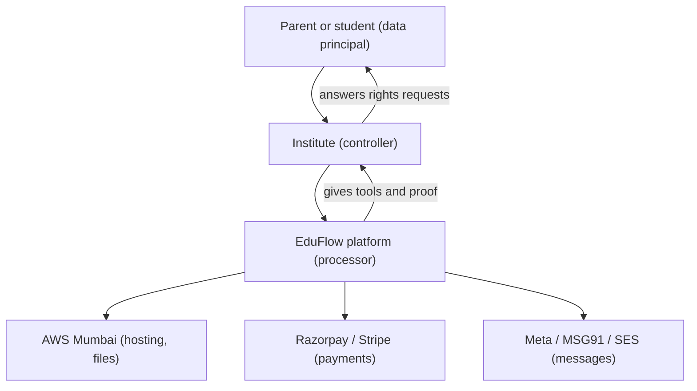
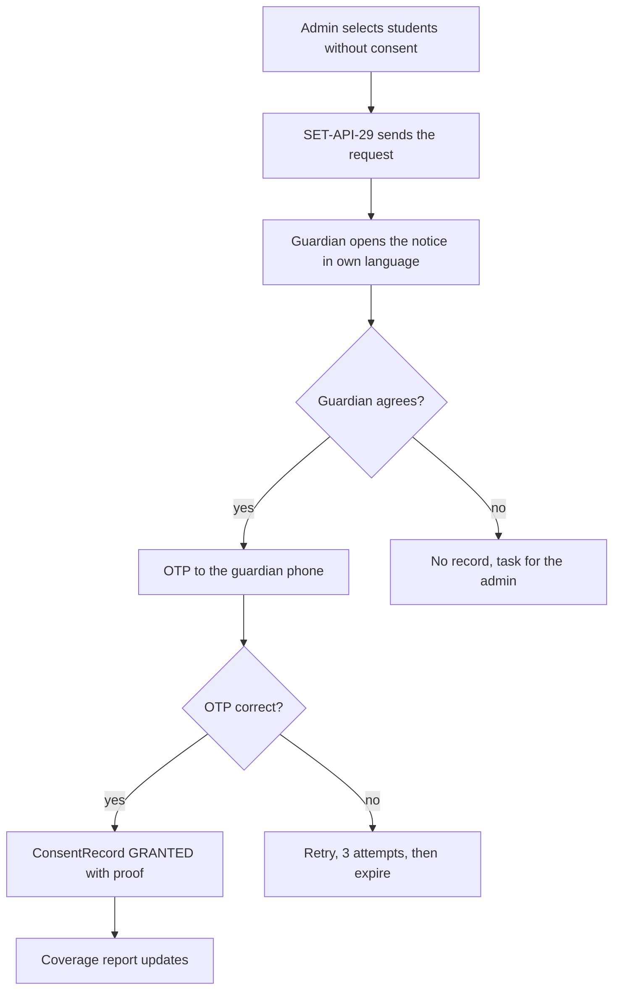
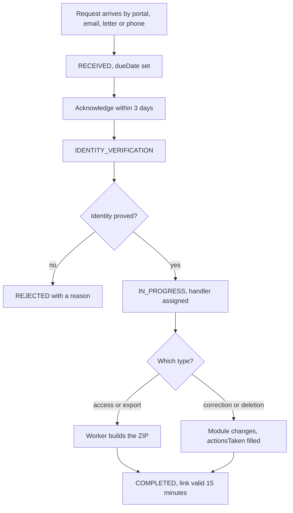

# Privacy and Compliance

**In simple words:** EduFlow holds the personal data of children. That is the most sensitive data a software company can touch. This chapter turns the privacy laws of India, the USA, Australia, the UAE and the EU into real product features: a data inventory, consent records, privacy notices, data-subject request handling, retention jobs, data residency and a breach clock. Every rule here has a table, a field or an endpoint behind it, so a developer can build it and an auditor can check it.

| Item | Value |
|---|---|
| Laws in scope | DPDP Act 2023 (India), GDPR (EU baseline), FERPA and COPPA (USA), Privacy Act 1988 and APPs (Australia), PDPL (UAE) |
| Our legal role | Processor for the institute. The institute is the controller. |
| Main tables | `policy_documents`, `consent_records`, `data_subject_requests`, `data_breach_incidents`, `audit_logs` |
| Main endpoints | `SET-API-21` to `SET-API-43`, `SET-API-49` to `SET-API-55`, `ORG-API-14` |
| Permission key | `settings.manage_privacy` (ORG_ADMIN `Yes`, SUPER_ADMIN `View`) |
| Default data region | `ap-south-1` (Mumbai), held in `Organization.dataRegion` |
| Release phase | Phase 1 registers and consent, Phase 2 consent campaigns, Phase 4 regional stacks |
| Screens | `SET-S13`, `SET-S14`, `SET-S17` in the *Settings Module* chapter |

> **Warning:** This chapter is product guidance, not legal advice. It says what EduFlow builds so an institute can meet its duties. The notices, the data-processing agreement and the India grievance-officer appointment must be checked by a lawyer before the paid launch in January 2027.

All five laws ask for the same six things: a stated purpose, the least data that does the job, a way to correct it, deletion when the purpose ends, security, and proof of all of the above. Every section below is one of those six made concrete.

## Who Is Responsible for What

The institute decides why and how student data is used. EduFlow only runs the software. That split decides who answers a parent's letter, who signs the notice and who talks to the regulator.

| Party | Legal name (DPDP / GDPR) | Who it is | Decides | Answers to |
|---|---|---|---|---|
| Institute | Data Fiduciary / Controller | Bright Future Public School | What data, why, how long | Parents, DPDP Board, school board |
| EduFlow | Data Processor | The EduFlow company | How the software stores it | The institute, under contract |
| Sub-processor | Sub-processor | AWS, Razorpay, Meta | Nothing about the data | EduFlow, under contract |
| Data subject | Data Principal / Subject | Aarav Sharma, Sunita Devi | Consent, and rights requests | Nobody |

**Figure: Who holds the data and who answers for it**



EduFlow never answers a parent directly. It gives the Organization Admin the register, the export package and the clock, so the institute answers inside the legal time.

### What the processor role forces into the product

1. **No product decision may add a new purpose.** A feature that uses student data outside education needs a new consent type and a notice change, not a silent release.
2. **The institute owns the notice text.** `PolicyDocument` rows with an `organizationId` belong to the tenant. EduFlow ships starter text as platform rows, which a tenant adopts or replaces with `SET-API-22`.
3. **EduFlow staff cannot act as the institute.** `settings.manage_privacy` is `View` for SUPER_ADMIN. During impersonation, `SET-API-28`, `SET-API-37` and `SET-API-41` return `403 FORBIDDEN` and write an audit row with outcome `DENIED`.
4. **Deletion is instructed, not decided.** EduFlow deletes tenant data only on a `DELETION` request completed by the institute, or on the purge schedule in *Organizations Module*.
5. **Every sub-processor is listed.** The list later in this chapter is part of the data-processing agreement. A new sub-processor means 30 days written notice to every tenant.
6. **Breach news flows both ways.** A platform incident is reported by EduFlow to every affected tenant. A tenant-side incident, such as a leaked staff password, is recorded by the tenant itself.

## The Data Inventory

This is the register every law asks for: what we hold, about whom, why, on what basis, for how long, and who can see it.

| Data category | Examples (table.field) | Subjects | Purpose |
|---|---|---|---|
| Identity | `students.first_name`, `date_of_birth`, `gender`, `photo_file_id` | Children, guardians, staff | Identify the learner in every record |
| Contact | `students.phone`, `guardians.email`, `address_line1`, `postal_code` | Children over 13, guardians, staff | Send fee, attendance and exam updates |
| Academic | `attendance_records`, `exam_marks`, `report_cards`, `homework_submissions` | Children | Teach, grade and report progress |
| Financial | `fee_invoices`, `payments`, `receipts`, `guardians.annual_income` | Guardians, children | Bill, collect, refund, report tax |
| Government ID | `students.national_id_encrypted`, `pen_number`, `apaar_id` | Children, staff | Board and UDISE+ returns, scholarships |
| Health | `students.medical_notes_encrypted`, `blood_group` | Children | Emergency care and safe sport |
| Employment | `staff`, `staff_salaries`, `payslips`, `staff_tax_declarations` | Staff | Pay salary and file statutory returns |
| Technical | `login_histories.ip_address`, `audit_logs.user_agent`, `refresh_tokens` | Everyone with a login | Security, fraud detection, audit proof |
| Communication | `message_logs`, `whats_app_inbound_messages`, `notifications` | Guardians, students, staff | Prove a message was sent and read |

The second half of the register carries the legal columns for the same nine categories.

| Data category | Lawful basis | Retention | Who can see it |
|---|---|---|---|
| Identity | Contract with the institute; guardian consent for a child | 7 years after exit, then anonymise | Org Admin, Principal, own teachers, own parent |
| Contact | Contract; channel consent for WhatsApp and SMS | 7 years after exit | Org Admin, Principal, Accountant, own parent |
| Academic | Contract and the school's educational purpose | 7 years after exit; report cards kept as records | Own teachers, Principal, own parent, own student |
| Financial | Legal duty (income tax, GST) | 8 years from the financial year end | Accountant, Org Admin, own parent |
| Government ID | Legal duty (board and UDISE+ returns) | 7 years after exit, ciphertext only | Org Admin with `students.update` |
| Health | Vital interest plus guardian consent | Cleared one year after exit | Holders of `students.medical.view` only |
| Employment | Contract and labour law | 8 years after leaving | Org Admin and the payroll role |
| Technical | Legitimate interest in security | 400 days for logins, 8 years for audit logs | Org Admin, SUPER_ADMIN |
| Communication | Contract; consent for promotional content | Body text 365 days, metadata 3 years | Org Admin, Principal, Accountant |

> **Note:** `medical_notes_encrypted` and `national_id_encrypted` are special-category data. They are stored as AES-256-GCM ciphertext, never written into `audit_logs.before` or `audit_logs.after`, never sent to a sub-processor, and never readable by an AI query plan. *Security Architecture* holds the key-management detail.

### Data minimisation and field-level visibility

Only nine inputs on `Student` are required by the API: `campusId`, `admissionNo`, `firstName`, `dateOfBirth`, `gender`, `admissionDate`, `status`, one guardian link and one enrollment. Everything else is optional and stays hidden until the tenant turns it on.

| Field group | Default | How it is controlled | Reason |
|---|---|---|---|
| `religion`, `category`, `isMinority`, `isBpl` | Off | Setting key `academic.collect_social_fields` | Needed only for government quota returns |
| `nationalIdEncrypted` | Off | Same setting plus `students.update` | Aadhaar is not needed to run a class |
| `medicalNotesEncrypted` | On, masked | Opened by `students.medical.view` | Teachers need allergies, not diagnoses |
| `guardians.annualIncome` | Off | Switched on by the Scholarships module | Income is only a scholarship input |
| Custom fields | Tenant choice | `CustomFieldDefinition` visibility flags | The tenant decides its own extra fields |
| Export columns | Chosen per run | `STU-API-42` column picker | An export is a copy that leaves the system |

> **Rule:** A list endpoint never returns a field the caller may not open on the detail screen. The Prisma `select` for every list is a fixed allow-list in code. A teacher's batch roster returns name, roll number, photo and attendance, never phone, address or income.

## Consent Management

A consent is worth nothing without proof. EduFlow stores one `ConsentRecord` row per person, per purpose, per notice version, with the verification method and the exact notice text it refers to. Nine consent types cover everything the product does.

| Consent type | Given by | Verification | What stops if withdrawn |
|---|---|---|---|
| `TERMS_OF_SERVICE` | Signing-up owner | Click plus login | Account cannot be used |
| `PRIVACY_POLICY` | Every adult user | Click plus login | Account cannot be used |
| `DATA_PROCESSING` | Adult student, guardian, staff | Click plus login | Optional processing pauses |
| `CHILD_DATA_PROCESSING` | Guardian of a minor | OTP, signed form, in person, DigiLocker | Student Portal, photos, analytics pause |
| `COMMUNICATION_WHATSAPP` | Guardian or adult student | OTP to the same number | WhatsApp sending stops in 60 seconds |
| `COMMUNICATION_SMS` | Guardian or adult student | OTP to the same number | SMS sending stops in 60 seconds |
| `COMMUNICATION_EMAIL` | Guardian or adult student | Email link | Promotional email stops, receipts continue |
| `PHOTO_MEDIA` | Guardian of a minor | OTP or signed form | Photo leaves galleries and public lists |
| `THIRD_PARTY_SHARING` | Guardian or adult | Signed form | Sharing with a board or partner stops |

> **Note:** Messages the institute must send by law or contract, such as a fee receipt, an exam date sheet or a safety alert, do not rest on consent. They rest on the contract. Only promotional and optional messages need a channel consent.

### Verification methods and their proof

`ConsentVerificationMethod` decides what is stored as evidence. The stronger the method, the fewer questions later.

| Method | How it works | Proof stored | Use it for |
|---|---|---|---|
| `OTP` | Six-digit code to the guardian phone | `otpCodeId`, `verifiedAt`, `ipAddress` | Child data, WhatsApp, SMS |
| `EMAIL_LINK` | Signed link to a verified email | `verificationReference`, `verifiedAt` | Email channel, adult users |
| `SIGNED_FORM` | Paper form scanned and uploaded | `evidenceFileId` of a private S3 file | Admission day, photo consent |
| `IN_PERSON` | Front desk records it with an ID check | `verificationReference` plus staff user id | Parents without a smartphone |
| `DIGILOCKER` | India government identity wallet | `verificationReference` transaction id | Strict DPDP verification, Phase 4 |

**Figure: Verifiable parental consent for a child**



The flow never pre-ticks a box. A guardian who does nothing stays in the no-consent list that `SET-API-27` reports.

> **Example:** Sunita Devi opens the request for Aarav Sharma on 12 Jan 2027. The notice is version 2.1, language `hi`. She agrees and enters the OTP sent to her phone. The row stores `consentType = CHILD_DATA_PROCESSING`, `subjectIsMinor = true`, `policyVersion = "2.1"`, `noticeLanguage = "hi"`, `verificationMethod = OTP` and `regulation = "DPDP"`. Coverage at Bright Future moves from 1,161 to 1,162 of 1,200 students, which is 96.8 percent.

### Notice versions, withdrawal and expiry

A published notice is never edited. `PolicyDocument.contentHash` is the SHA-256 of the body, so the exact words a parent read can always be proved. A correction is a new version with a new `effectiveFrom`, and the activation job retires the old version of the same type and language.

| Situation | What the product does | Endpoint or job |
|---|---|---|
| New notice version published | Old version retired, existing consents stay valid; portal shows a banner | `SET-API-22`, activation job |
| Parent withdraws a channel | Channel stops inside 60 seconds, queued messages dropped | `SET-API-52`, `PP-API-28` |
| Parent withdraws child-data consent | Student Portal pauses, photo and analytics use stops, admin task created | `SET-API-52` |
| Admin withdraws for a parent | `withdrawalReason` is mandatory, audit row written | `SET-API-28` |
| Consent has `expiresAt` in the past | Nightly job sets `EXPIRED`, student returns to the gap list | Consent expiry job |

Withdrawal never deletes the record. The row stays with `status = WITHDRAWN` and `withdrawnAt`, so the institute can prove processing was lawful on the day it happened.

## Privacy Notices

A notice is the text a person sees before any data is taken. EduFlow shows it in three places: the signup screen, the public admission form (`ADM-API-38`) and the portals (`SET-API-49`, `SET-API-50`). Every notice must carry these nine items, or the publish call is rejected by the Zod schema.

| Item in the notice | Required by | Where the value comes from |
|---|---|---|
| Who the controller is, with address | DPDP, GDPR, PDPL | `Organization` name, legal name, address |
| What data is collected | All five laws | The data inventory above |
| Why it is collected, purpose by purpose | DPDP, GDPR | `ConsentRecord.purposes` list |
| How long it is kept | GDPR, APP | The retention schedule below |
| Who else sees it | All five laws | The sub-processor list below |
| The rights the person has and how to use them | All five laws | Data subject rights below |
| How to withdraw consent | DPDP, GDPR | `SET-API-52` link inside the notice |
| Grievance or privacy contact | DPDP, PDPL | Setting `privacy.grievance_contact` |
| The right to complain to the regulator | DPDP, GDPR, APP | Country text block |

Notices are per language: `en` and `hi` for India, `ar` added for the UAE in Phase 4. A guardian sees the version in `Guardian.preferredLanguage`, falling back to `Organization.locale`.

## Data Subject Rights

Every right maps to one `DataSubjectRequestType`, one clock and one product action. The clock starts at `receivedAt` and is stored as `dueDate`, computed from the setting `privacy.dsr_due_days`.

| Right | Request type | Days to answer | What the product does |
|---|---|---|---|
| See my data | `ACCESS` | 30 DPDP, 30 GDPR, 45 FERPA | Read-only summary plus the export package |
| Get a copy or move it elsewhere | `EXPORT` | Same as access | ZIP of machine-readable JSON plus documents |
| Fix wrong data | `CORRECTION` | 30 | Edit in the owning module, listed at completion |
| Delete my data | `DELETION` | 30 | Anonymise, keep money and legal records |
| Stop some processing | `RESTRICT_PROCESSING` | 30 | Pauses optional processing, keeps the record |
| Withdraw consent | `WITHDRAW_CONSENT` | Immediate | Calls the consent withdraw path, then closes |
| Object to processing | `OBJECTION` | 30 | Admin decides, reason recorded |
| Name a nominee | `NOMINATION` | 30 | DPDP nominee stored on the guardian record |
| Raise a complaint | `GRIEVANCE` | 30 | Routed to `privacy.grievance_contact` |

**Figure: Life of a data-subject request with its clock**



Alerts fire 7 days and 2 days before `dueDate`. GDPR allows one extension of up to 60 days with `extendedDueDate` and a written `extensionReason`. DPDP has none, so the extend button is hidden when `regulation` is `DPDP`.

> **Example:** Sunita Devi asks for a copy of her son's data on 14 Jan 2027 at 10:58 IST from the parent app. `requestNo` is `DSR-2027-0004`, `regulation` is `DPDP` and `dueDate` is 13 Feb 2027. The admin acknowledges the same day, verifies her by OTP, and completes it on 19 Jan. She gets an email with a link that works for 15 minutes.

### What is inside a per-student export package

The worker builds a private ZIP at `org/{orgId}/dsr/{requestNo}.zip`. It holds only the subject's own rows: sibling rows, other children of the family and notes about other students are removed first.

| File in the ZIP | Source tables | What it holds |
|---|---|---|
| `manifest.json` | `data_subject_requests` | Request number, subject, date, file list, hashes |
| `profile.json` | `students`, `guardians`, `student_guardians` | Identity, contact, address, custom fields |
| `academics.json` | `enrollments`, `attendance_records`, `exam_marks` | Batch history, day-wise attendance, marks |
| `report-cards.json` | `report_cards`, `report_card_remarks` | Term results and teacher remarks |
| `fees.json` | `fee_invoices`, `payments`, `receipts`, `refunds` | Bills, payments, receipt numbers, refunds |
| `communications.json` | `message_logs`, `notifications` | What was sent, when, on which channel |
| `consents.json` | `consent_records`, `policy_documents` | Every consent with the notice text it used |
| `documents/` | `file_assets`, `student_documents` | Photo, birth certificate, transfer certificate |

Never in the package: medical notes in plain text, replaced by a line telling the parent to ask at the school office, and any row belonging to another data subject.

```json
{
  "manifestVersion": "1.0",
  "requestNo": "DSR-2027-0004",
  "organization": "Bright Future Public School",
  "subjectType": "STUDENT",
  "subjectLabel": "Aarav Sharma (BF-2027-0142)",
  "generatedAt": "2027-01-19T11:04:22.000Z",
  "regulation": "DPDP",
  "files": [
    { "name": "profile.json", "rows": 1, "sha256": "9f2c7a..." },
    { "name": "academics.json", "rows": 412, "sha256": "1ab703..." },
    { "name": "fees.json", "rows": 27, "sha256": "c08d51..." }
  ],
  "excluded": [
    { "field": "medicalNotes", "reason": "Available at the school office" },
    { "table": "student_notes", "reason": "Holds data of other students" }
  ]
}
```

## Children's Data Rules

Most EduFlow records belong to a child. The DPDP Act, COPPA and the APPs all add extra duties for that. These eight rules are product rules, checked in code, not promises in a policy page.

| Rule | How the product enforces it |
|---|---|
| No advertising to children | No ad SDK, no ad network, no third-party pixel in the app, portals or emails |
| No tracking of children | `User.analyticsOptOut` is forced to `true` for any login linked to a minor; PostHog events are dropped server side |
| No behavioural profiling | Risk scores use attendance, marks and fee history only; never device, location or browsing signals |
| Guardian consent before a portal login | A Student Portal login for a minor needs a valid `CHILD_DATA_PROCESSING` consent |
| Photo control | `PHOTO_MEDIA` consent gates galleries, printed lists and marketing use; the ID card is contract, not consent |
| Delete means delete | On an approved `DELETION`, the photo, documents and contact details go; the receipt numbers stay |

### AI restrictions

The AI Insights module is Phase 4 and carries the tightest rules, because a language model is a sub-processor that sees text.

| AI rule | What it means |
|---|---|
| Permission-checked plan only | `AiQueryLog.queryPlan` is a structured plan, never raw SQL, and it runs with the caller's own scope |
| No child identifiers to the model | Names, admission numbers, phone numbers and addresses are replaced by tokens before the prompt |
| No special-category data | Medical notes and national IDs are never part of a prompt or a plan |
| No training, off by default | The contract forbids training on our prompts; a tenant without the add-on sends nothing |
| Human decides | An insight is a suggestion; `AiInsight` records who acted on it |

> **Founder note:** The sales answer to a worried principal is short: "We do not run ads, we do not track your children, and we do not sell anything. You can read every consent and every access in your own register." It works only because the code makes it true.

## Retention and Deletion Schedule

Deletion in a school is not one `DELETE` statement: money, board and safety records must survive a deletion request. EduFlow has three outcomes, and every completed request records which one was used per entity in `actionsTaken`.

| Outcome | What happens to the row | Example |
|---|---|---|
| `ERASED` | The row is removed | Student photo, uploaded birth certificate |
| `ANONYMISED` | Identifiers are overwritten, the row stays | Attendance history, exam marks |
| `RETAINED` | Nothing changes, the legal basis is recorded | Fee receipt, GST invoice, payslip |

The nightly retention job runs at 02:00 in the organization timezone and works down this schedule.

| Data type | Kept for | Counted from | Then |
|---|---|---|---|
| Active student record | While enrolled | — | Stays |
| Exited student record | 7 years (`privacy.retention_exited_student_years`) | `leavingDate` | `anonymizedAt` set, name and contact overwritten |
| Documents, photo and medical notes | 1 year | `leavingDate` | S3 objects purged, ciphertext columns set to null |
| Fee invoices, payments, receipts | 8 years | Financial year end | Deleted with the tenant purge only |
| Payslips and payroll records | 8 years | Financial year end | Deleted with the tenant purge only |
| Message bodies | 365 days (`privacy.retention_message_body_days`) | `createdAt` | Body cleared, delivery metadata kept 3 years |
| Login history | 400 days | `createdAt` | Row deleted |
| Audit logs | 8 years | `createdAt` | Row deleted, hash chain closed for the period |
| Consent records | 8 years after withdrawal | `withdrawnAt` | Row deleted |
| Export and DSR packages | 7 days | `completedAt` | S3 object purged, link dies |

An anonymisation is a fixed, reviewed statement, never a free-form update. This is the shape the worker runs inside one transaction.

```sql
UPDATE students
SET first_name = 'Anonymised',
    middle_name = NULL,
    last_name = NULL,
    phone = NULL,
    email = NULL,
    address_line1 = NULL,
    address_line2 = NULL,
    national_id_encrypted = NULL,
    medical_notes_encrypted = NULL,
    photo_file_id = NULL,
    anonymized_at = NOW()
WHERE organization_id = $1
  AND id = $2
  AND anonymized_at IS NULL;
```

The admission number, class history and money rows stay, so the school register still adds up.

### After a tenant cancels

Account closure follows *Organizations Module*. The privacy view of the same timeline is short.

```text
Day 0    Owner closes the account (ORG-API-14)
         Full export ZIP is built; login stays read-only
Day 60   Reminder email: export your data
Day 83   Reminder email
Day 89   Final reminder
Day 90   Read-only ends; tenant is soft deleted; logins blocked
Day 120  Purge job deletes tenant rows and S3 objects
         Kept: subscription invoices (EduFlow tax records) and
         an Organization stub (id, name, dates, purge proof)
```

> **Rule:** The purge is irreversible and is proved, not promised. The job writes one audit row per table with the deleted row count, and a final `organization.purged` row that carries the SHA-256 of that list. A tenant that asks later gets that proof as a signed certificate.

## Data Residency and Cross-Border Transfers

`Organization.dataRegion` and `FileAsset.region` decide where files and backups live. The database follows the same region. The default is `ap-south-1`, Mumbai.

| Market | Phase | Database and files | Notes |
|---|---|---|---|
| India | Phase 1 | `ap-south-1` (Mumbai) | DPDP has no blanket localisation rule, but Indian schools ask for it |
| UAE | Phase 2 sales, Phase 4 stack | `ap-south-1` until the UAE stack, then `me-central-1` | PDPL allows transfer to an adequate country or with contract safeguards |
| USA | Phase 3 pilot, Phase 4 stack | `ap-south-1` until the US stack, then `us-east-1` | FERPA has no residency rule; the school agreement sets the terms |
| Australia | Phase 3 pilot, Phase 4 stack | `ap-south-1` until the AU stack, then `ap-southeast-2` | APP 8 makes us accountable for the overseas holder |

The EU is not sold to before Year 4, because it would need `eu-central-1` first. Until a regional stack exists, the tenant is told the region in writing before signup. A move between regions is a planned migration, never silent.

| Transfer | Data that crosses a border | Safeguard |
|---|---|---|
| EduFlow to Stripe (USA, AU, UAE tenants) | Payer name, email, amount, order id | Stripe data-processing terms, PCI DSS Level 1 |
| EduFlow to Meta WhatsApp Cloud API | Phone number, template variables | Meta terms, template text approved in advance |
| EduFlow to Twilio (international SMS) | Phone number, message text | Twilio terms, no special-category data in text |
| EduFlow to Sentry and PostHog | Request id, user id, stack trace | PII scrubbing before send, EU or US region setting |
| EduFlow to Anthropic (AI add-on) | Tokenised question and aggregated rows | No training on our data, no identifiers in the prompt |

## Breach Response

A breach is any loss, theft or wrong disclosure of personal data. The register is `data_breach_incidents`, opened with `SET-API-41`. It starts the clocks, reminds before each deadline, and refuses to close an incident that was not handled properly.

| Regulator or law | Who reports | Deadline from detection | Stored in |
|---|---|---|---|
| CERT-In (India, IT Act) | EduFlow for platform incidents | 6 hours | `regulatorNotifyDueAt`, tightest wins |
| DPDP Board (India) | The institute, EduFlow helps | Without delay, in the prescribed form | `regulations` holds `DPDP` |
| Affected people (DPDP, GDPR high risk) | The institute | Without delay, plain language | `subjectsNotifiedAt` |
| GDPR supervisory authority | The institute | 72 hours | `regulatorNotifyDueAt` |
| Australian NDB scheme | The institute | Assess in 30 days, then notify promptly | `regulations` holds `NDB` |
| UAE PDPL | The institute | Without delay to the UAE Data Office | `regulations` holds `PDPL` |
| The tenant | EduFlow | 24 hours of confirming a platform breach | `tenantNotifiedAt` |

`regulatorNotifyDueAt` is `detectedAt` plus 72 hours, or plus 6 hours for a platform incident in India: the earliest deadline wins.

```typescript
const HOURS = { CERT_IN: 6, GDPR: 72, DPDP: 72, PDPL: 72, NDB: 720 } as const;

export function regulatorDueAt(detectedAt: Date, regulations: string[]): Date {
  const hours = regulations
    .map((r) => HOURS[r as keyof typeof HOURS] ?? 72)
    .reduce((min, h) => Math.min(min, h), 72);
  return new Date(detectedAt.getTime() + hours * 60 * 60 * 1000);
}
```

| Severity | Meaning | Extra product behaviour |
|---|---|---|
| `LOW` | One record, contained, no sensitive field | Register entry only |
| `MEDIUM` | Under 100 subjects, no special-category data | Org Admin alert, root cause required |
| `HIGH` | Over 100 subjects, or any children's data | Regulator and subject notification fields required to close |
| `CRITICAL` | Special-category data, or a whole tenant exposed | Same as HIGH plus a SUPER_ADMIN page and a written report |

Reminders `data_breach.notification_due` fire at 48 and 66 hours while `regulatorNotifiedAt` is empty. Status moves forward only. `CLOSED` needs `containedAt`, `rootCause` and `remediation`; `HIGH` and `CRITICAL` also need `regulatorNotifiedAt` and `subjectsNotifiedAt`.

> **Example:** A teacher's laptop holding an exported marks sheet is stolen on 10 Mar 2027. The admin records it at 16:40 IST, severity `HIGH`, `involvesChildrenData = true`, `regulations = ["DPDP"]`. The regulator notice is due 13 Mar at 16:40. Reminders fire 12 Mar 16:40 and 13 Mar 10:40. The admin cannot press Close until the notification dates and the remediation text are filled.

## Sub-Processors

This list belongs in every tenant contract and in the privacy notice. The rule is simple: if a company can see tenant personal data, it is on this list.

| Sub-processor | Purpose | Personal data shared | Region |
|---|---|---|---|
| Amazon Web Services | Hosting, database, files, backups | All tenant data at rest | `ap-south-1` (Mumbai) |
| Railway | Phase 1 hosting of API, worker, database | All tenant data at rest | Nearest EU or US region until AWS |
| Vercel | Web app delivery | IP address, request metadata | Global edge |
| Razorpay | India fee and subscription payments | Payer name, email, phone, amount | India |
| Stripe | USA, Australia, UAE payments | Payer name, email, amount | USA and EU |
| Meta (WhatsApp Cloud API) | WhatsApp messages | Phone number, template variables | Global |
| MSG91 | India SMS with DLT compliance | Phone number, message text | India |
| Twilio | International SMS | Phone number, message text | USA |
| Amazon SES | Email | Email address, subject, body | `ap-south-1` |
| Sentry | Error tracking | User id, request id, stack trace | EU or US |
| PostHog | Product analytics for staff users only | Staff user id, screen events | EU |
| Anthropic | AI Insights add-on | Tokenised question and aggregated rows | USA |

> **Rule:** Minors are never in PostHog. The analytics client refuses to load when the signed-in user is linked to a student under 18, and the server drops any event that carries a student id.

## Regulation to Feature Mapping

Each table reads the same way: the duty in the law, the feature that answers it, and where the proof sits.

### India DPDP Act 2023

| Requirement | EduFlow feature | Proof |
|---|---|---|
| Notice before collection, in Indian languages | `PolicyDocument` per language, shown at signup, admission form and portal | `contentHash`, `policyVersion` |
| Verifiable parental consent for a child | OTP, signed form, in person or DigiLocker | `verificationMethod`, `evidenceFileId` |
| No tracking or targeted ads to children | `analyticsOptOut` forced, no ad SDK, no profiling | Code and this chapter |
| Easy withdrawal of consent | `SET-API-52` in the portal, one screen | `withdrawnAt`, audit row |
| Rights: access, correction, erasure, nominee, grievance | `DataSubjectRequestType` covers all five | `data_subject_requests` |
| Breach intimation to the Board and to people | Breach register with clocks | `data_breach_incidents` |
| Grievance officer contact | Setting `privacy.grievance_contact`, printed in every notice | Setting value |

### GDPR baseline and UAE PDPL

| Requirement | EduFlow feature | Proof |
|---|---|---|
| Lawful basis recorded per purpose | Data inventory plus `ConsentRecord.purposes` | This chapter, consent rows |
| Records of processing activities | Data inventory and sub-processor list | This chapter |
| Data subject rights in 30 days | `dueDate`, alerts, one extension for GDPR | `data_subject_requests` |
| Portability in a machine-readable form | JSON export package, one file per table | `manifest.json` |
| Processor duties and sub-processor notice | Data-processing agreement, 30 days notice | Contract |
| Breach notice in 72 hours | `regulatorNotifyDueAt`, reminders at 48 and 66 hours | Breach register |
| Transfer safeguards | Region per tenant, provider terms | `dataRegion`, contracts |

### USA FERPA and COPPA, Australia APPs

| Requirement | EduFlow feature | Proof |
|---|---|---|
| FERPA: parent access to the education record | `ACCESS` and `EXPORT` requests, parent portal | Export package |
| FERPA: disclosure log of who saw the record | `AuditLog.isSensitiveRead` on sensitive reads | Audit viewer |
| FERPA: correction and a hearing route | `CORRECTION` request plus `GRIEVANCE` | `actionsTaken` |
| COPPA: no collection from under-13s without a parent | Minor logins need guardian consent first | `ConsentRecord` |
| COPPA: no ads, no behavioural targeting | No ad SDK, profiling limited to school signals | Code |
| APP 8: accountability for overseas holders | Sub-processor list plus contracts | This chapter |
| NDB scheme: assess and notify | Breach register with severity and dates | `data_breach_incidents` |

## Privacy API at a Glance

Every privacy endpoint sits in the SET registry and is built in *Settings Module*.

| Group | Endpoint IDs | Permission | Called by |
|---|---|---|---|
| Notices | `SET-API-21` to `SET-API-24`, `SET-API-49` | `settings.view`, `settings.manage_privacy`, public | Org Admin, website |
| Consent register | `SET-API-25` to `SET-API-30` | `settings.manage_privacy`, `settings.export` | Org Admin |
| Requests and breaches | `SET-API-31` to `SET-API-43` | `settings.manage_privacy` | Org Admin |
| Own consents and requests | `SET-API-50` to `SET-API-55`, `PP-API-26` to `PP-API-28` | `self`, `parentportal.access` | Parent, student, staff |
| Closure and full export | `ORG-API-14`, `CMN-API-20` | `organizations.manage`, `self` | Owner |

Two calls carry the compliance weight. The first tells the admin who is still missing child-data consent.

```http
GET /api/v1/consent-records/coverage?consentType=CHILD_DATA_PROCESSING&groupBy=batch
Authorization: Bearer <accessToken>
X-Campus-Id: 8f1c0b2e-2d54-4a77-9a1e-7e2b6a0d11c3
```

```json
{
  "success": true,
  "data": {
    "activeStudents": 1200,
    "withValidConsent": 1162,
    "coveragePercent": 96.83,
    "onOlderNoticeVersion": 74,
    "batches": [
      { "batchId": "b1…", "name": "10-A", "students": 42, "missing": 3 },
      { "batchId": "b2…", "name": "10-B", "students": 40, "missing": 0 }
    ]
  }
}
```

The second closes a request and writes what was actually done to the data.

```http
POST /api/v1/data-subject-requests/1f8b…/complete
Authorization: Bearer <accessToken>
Content-Type: application/json

{
  "resolutionNotes": "Data package built and emailed to the verified address.",
  "actionsTaken": [
    { "entity": "Student", "action": "ANONYMISED", "legalBasis": "DPDP s.12" },
    { "entity": "FeeInvoice", "action": "RETAINED", "legalBasis": "GST 8 years" },
    { "entity": "FileAsset", "action": "ERASED", "legalBasis": "Consent ended" }
  ]
}
```

```json
{
  "success": true,
  "data": {
    "id": "1f8b…",
    "requestNo": "DSR-2027-0004",
    "status": "COMPLETED",
    "completedAt": "2027-01-19T11:04:22.000Z",
    "exportFileId": "7c3d…"
  }
}
```

| Status | Code | When it happens |
|---|---|---|
| 400 | `VALIDATION_ERROR` | `actionsTaken` is empty, or an action word is unknown |
| 403 | `FORBIDDEN` | Caller lacks `settings.manage_privacy`, or is impersonating |
| 404 | `NOT_FOUND` | Request id belongs to another tenant |
| 409 | `CONFLICT` | The request is already `COMPLETED`, `REJECTED` or `CANCELLED` |
| 422 | `BUSINESS_RULE_VIOLATION` | Identity is not yet verified, or a `RETAINED` row has no legal basis |

## Compliance Requirements

Each requirement below is checked in the release checklist before the pilot on 18 November 2026.

| ID | Requirement | Laws | Phase |
|---|---|---|---|
| PRIV-01 | Every tenant has a published privacy notice before its first student | All | 1 |
| PRIV-02 | Notices are versioned, hashed and never edited after publishing | DPDP, GDPR | 1 |
| PRIV-03 | Notices exist in English and Hindi for Indian tenants | DPDP | 1 |
| PRIV-04 | A minor's record needs a verified guardian consent | DPDP, COPPA | 1 |
| PRIV-05 | Consent proof stores method, notice version and timestamp | DPDP, GDPR | 1 |
| PRIV-06 | Consent can be withdrawn in one screen by the person | DPDP, GDPR | 1 |
| PRIV-07 | Withdrawing a channel stops that channel within 60 seconds | DPDP, TRAI | 1 |
| PRIV-08 | Coverage report lists students without valid consent | DPDP | 1 |
| PRIV-09 | Data-subject requests are logged with a statutory due date | All | 1 |
| PRIV-10 | Requests are acknowledged in 3 days and alerted before due | GDPR, DPDP | 1 |
| PRIV-11 | Export package holds only the subject's own rows | GDPR, FERPA | 1 |
| PRIV-12 | Deletion anonymises and keeps money records with a legal basis | DPDP, GST law | 1 |
| PRIV-13 | Sensitive reads and package downloads are audited | FERPA | 1 |
| PRIV-14 | Minors are excluded from analytics, ads and profiling | DPDP, COPPA | 1 |
| PRIV-15 | Breach register computes the earliest regulator deadline | IT Act, GDPR | 1 |
| PRIV-16 | Tenant is told of a platform breach within 24 hours | Contract | 1 |
| PRIV-17 | Retention job anonymises and clears data on schedule | GDPR, APP | 2 |
| PRIV-18 | Sub-processor list is public and changes get 30 days notice | GDPR, PDPL | 2 |
| PRIV-19 | Cancelled tenants are purged on day 120 with written proof | All | 2 |
| PRIV-20 | AI prompts carry no identifiers and no special-category data | DPDP, COPPA | 4 |
| PRIV-21 | Regional data stacks for UAE, USA and Australia | PDPL, APP | 4 |

## Ownership and Review

The Organization Admin is the privacy owner inside each institute; inside EduFlow the founder holds the role until a compliance hire exists. Three habits keep this chapter true: read the coverage and request queue monthly, review notices and sub-processors yearly or on any change, and run a breach drill twice a year against the 6-hour and 72-hour clocks.

> **Warning:** Nothing in this chapter is legal advice. Laws change and rules differ by state and by school board. Before the January 2027 launch, a lawyer must review the privacy notice text, the data-processing agreement, the grievance-officer appointment in India and the school agreement used in the USA.

## Sources

- Digital Personal Data Protection Act, India, 2023
- Information Technology Act and CERT-In Directions, India, 2000 and 2022
- General Data Protection Regulation, European Union, 2016
- Family Educational Rights and Privacy Act, USA, 1974
- Children's Online Privacy Protection Act, USA, 1998
- Privacy Act and Australian Privacy Principles, Australia, 1988
- Federal Decree-Law 45 of 2021 on Personal Data Protection, UAE, 2021
