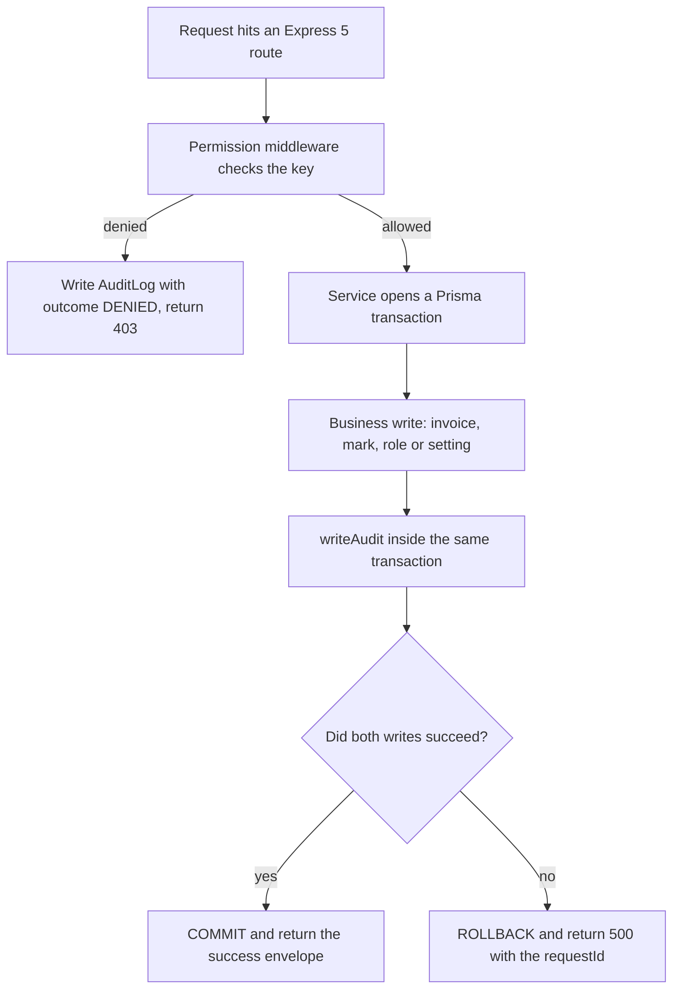
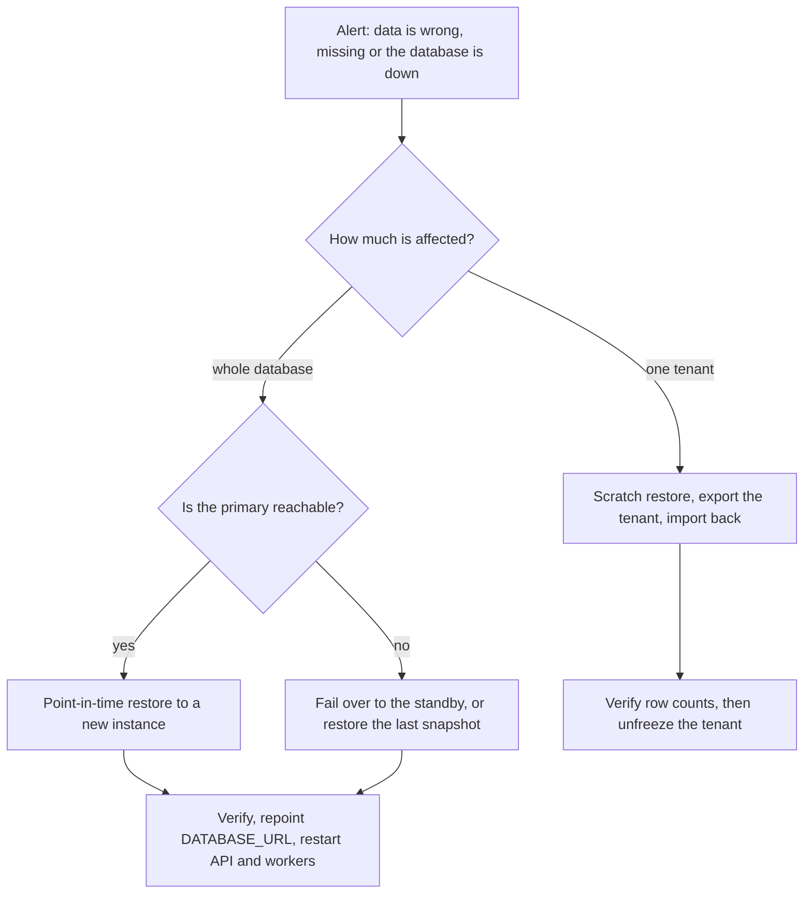

# Audit Logs, Backups and Disaster Recovery

**In simple words:** This chapter answers three questions that every school owner asks before trusting software with fee money and children's records. Who changed this row, and when? If the data is lost, how do we get it back? If the whole system goes down, what happens to tomorrow morning's attendance? The answers here are concrete: one append-only table, a hash chain that proves nobody edited history, a backup and restore plan with tested numbers, and a paper fallback so a school can run a day without us.

| Item | Value |
|---|---|
| Owner | Mehdi Alam (founder) until the first operations hire in Year 2 |
| Built by | Prompt P-22 (audit trail), P-55, P-56 (CI/CD, deploys), P-57 (AWS move) |
| Main table | `audit_logs`, append-only, SHA-256 chain per organization |
| Main endpoints | `CMN-API-22` to `CMN-API-26`, `ORG-API-56`, `DASH-API-08` |
| Permission keys | `audit.view`, `audit.export`, `audit.manage` |
| Screen | `SET-S15` Audit log, listed in *Settings Module* |
| Audit retention | 8 years from `createdAt`, then the period is closed and dropped |
| Recovery target, Phase 1 | RPO 24 hours, RTO 8 hours (Railway, daily snapshot) |
| Recovery target, Year 2+ | RPO 5 minutes, RTO 1 hour (AWS RDS Multi-AZ with PITR) |
| Restore drill | First Saturday of every month, result written to the drill log |
| Never inside a backup | Plain secrets and the field-encryption key (they live in KMS) |

Three neighbours carry parts of this story and are not repeated here: the attack model, encryption and secrets in *Security Architecture*; consent, retention outcomes and the 72-hour breach clock in *Privacy and Compliance*; the queue names and the nightly job table in *Background Jobs and Events*.

## What Gets Audited

An audit row is not a log line. A log line is debugging text that dies in 30 days. An audit row is a business record: written inside the same transaction as the change, kept for eight years, and readable one day by a parent or an auditor. So EduFlow audits a short, deliberate list instead of everything.

| Family | Actions written to `audit_logs` | Reason required |
|---|---|---|
| Sign-in and sessions | `auth.login`, `auth.login.failed`, `auth.logout`, `auth.password.reset`, `auth.mfa.enabled` | No |
| Users and permissions | `users.create`, `users.suspend`, `users.role.assign`, `roles.create`, `roles.permission.change` | Yes, on role and permission change |
| Money | `payments.collect`, `payments.receipt.cancel`, `fees.invoice.write_off`, `fees.late_fee.waive`, `refunds.approve` | Yes, on cancel, write-off, waiver, refund |
| Marks and results | `exams.marks.enter`, `exams.marks.update`, `exams.result.publish`, `reportcards.publish`, `reportcards.unpublish` | Yes, when marks change after publication |
| Attendance after lock | `attendance.unlock`, `attendance.record.update_after_lock`, `attendance.bulk_lock` | Yes, on unlock |
| Data leaving the system | `students.export`, `fees.export`, `audit.export`, `files.download`, `students.medical.view`, `staff.sensitive.view` | No, but `isSensitiveRead` is true |
| Impersonation | `platform.impersonation.start`, `platform.impersonation.end`, and every action done with that token | Yes, a support ticket number |
| Settings and keys | `settings.update`, `settings.branding.update`, `settings.number_sequence.update`, `api_key.create`, `api_key.rotate`, `api_key.revoke` | No |
| Privacy | `consent.granted`, `consent.withdrawn`, `dsr.completed`, `dsr.rejected`, `organization.purged` | Yes, on rejection |
| Destructive | `students.delete`, `batches.delete`, `imports.commit`, `organization.close_account` | Yes |

Three rules decide whether a new endpoint needs an audit row. First, if it moves money, changes a published result, changes who can do what, or takes data out of EduFlow, it is audited. Second, refused attempts on those endpoints are audited with `outcome = DENIED`: a clerk who tries to cancel a receipt five times and fails is exactly what an owner wants to see. Third, ordinary reads are never audited, except the sensitive reads named above.

> **Rule:** If the audit write fails, the business write is rolled back with it. An unlogged fee cancellation is worse than a failed one. This is why `writeAudit` runs inside the caller's transaction and never on a queue.

## The Audit Log Row

The model comes straight from `docs/src/_schema/02-auth.prisma`. It is copied here because every field in it exists for a reason a developer must know.

```prisma
// Immutable trail of who changed what. Append-only: no updatedAt / deletedAt.
model AuditLog {
  id                 String         @id @default(uuid()) @db.Uuid
  organizationId     String?        @map("organization_id") @db.Uuid
  campusId           String?        @map("campus_id") @db.Uuid
  actorType          AuditActorType @default(USER) @map("actor_type")
  actorUserId        String?        @map("actor_user_id") @db.Uuid
  actorLabel         String?        @map("actor_label") @db.VarChar(200)
  actorRoleKeys      String[]       @map("actor_role_keys")
  impersonatorUserId String?        @map("impersonator_user_id") @db.Uuid
  outcome            AuditOutcome   @default(SUCCESS)
  reason             String?        @db.VarChar(500)
  isSensitiveRead    Boolean        @default(false) @map("is_sensitive_read")
  prevHash           String?        @map("prev_hash") @db.Char(64)
  rowHash            String?        @map("row_hash") @db.Char(64)
  apiKeyId           String?        @map("api_key_id") @db.Uuid
  action             String         @db.VarChar(80)
  entityType         String         @map("entity_type") @db.VarChar(60)
  entityId           String?        @map("entity_id") @db.Uuid
  entityLabel        String?        @map("entity_label") @db.VarChar(200)
  before             Json?
  after              Json?
  changedFields      String[]       @map("changed_fields")
  metadata           Json?
  ipAddress          String?        @map("ip_address") @db.VarChar(45)
  userAgent          String?        @map("user_agent") @db.VarChar(500)
  requestId          String?        @map("request_id") @db.VarChar(64)
  createdAt          DateTime       @default(now()) @map("created_at") @db.Timestamptz(6)

  organization Organization? @relation(fields: [organizationId], references: [id], onDelete: Restrict)
  campus       Campus?       @relation(fields: [campusId], references: [id], onDelete: SetNull)
  actor        User?         @relation(fields: [actorUserId], references: [id], onDelete: SetNull)
  apiKey       ApiKey?       @relation(fields: [apiKeyId], references: [id], onDelete: SetNull)

  @@index([organizationId, createdAt])
  @@index([organizationId, campusId, createdAt])
  @@index([organizationId, entityType, entityId])
  @@index([organizationId, actorUserId, createdAt])
  @@index([organizationId, action, createdAt])
  @@index([requestId])
  @@map("audit_logs")
}

enum AuditActorType {
  USER
  SYSTEM        // background worker or scheduler
  API_KEY
  IMPERSONATION // SUPER_ADMIN acting inside a tenant
}

enum AuditOutcome {
  SUCCESS
  DENIED
  FAILED
}
```

| Field | Why it exists |
|---|---|
| `organizationId` nullable | Null only for platform-console rows (`ORG-API-56`), which belong to no tenant |
| `actorLabel`, `actorRoleKeys` | Frozen text such as `Suresh Gupta (ACCOUNTANT)`. The row still reads correctly after the user is deleted |
| `impersonatorUserId` | The real EduFlow staff user behind an `IMPERSONATION` row. Without it the trail would blame the tenant's own admin |
| `entityLabel` | Human snapshot such as `Aarav Sharma (BF-2027-0142)`, so a search result is readable without eight joins |
| `changedFields` | A `text[]` of camelCase names. The viewer filters on it, so the diff does not have to be opened |
| `requestId` | The same value as `requestId` in the API error envelope and in every Pino log line of that request |
| `prevHash`, `rowHash` | The tamper-evidence chain, one chain per `organizationId` |
| `onDelete: Restrict` | An organization row cannot be deleted while audit rows point at it. The tenant purge drops audit rows last, on purpose |

## Before and After Snapshots

`before` and `after` hold the row as JSON, but only the columns that the endpoint may touch, and always after masking. A full row dump would copy encrypted medical notes and bank details into a table that more people can read than the source table. That would turn the audit trail into a second, weaker copy of the most sensitive data in EduFlow.

| Field pattern | What is stored |
|---|---|
| `*Encrypted` columns (`nationalIdEncrypted`, `medicalNotesEncrypted`) | The literal string `***`, never the ciphertext and never the plaintext |
| `password`, `passwordHash`, `otp`, `token`, `keyHash`, `secret` | The literal string `***` |
| `phone`, `email` | Masked form: `+9198***43210`, `su***@gmail.com` |
| `amount`, `balance`, any `Decimal` | Full value as a string, for example `"12000.00"`. Money is the whole point of the trail |
| `photoFileId`, any file id | The UUID only. The S3 object is not copied |
| Anything over 16 KB after masking | Only the keys in `changedFields` are kept, plus `"_truncated": true` |

A real diff from Bright Future Public School, where the accountant cancelled a receipt, looks like this.

```json
{
  "success": true,
  "data": {
    "id": "6f1c9f2a-5a2e-4d1b-9a1f-7c3f0b2a91e4",
    "createdAt": "2027-07-10T11:12:44.201Z",
    "actorLabel": "Suresh Gupta (ACCOUNTANT)",
    "actorType": "USER",
    "outcome": "SUCCESS",
    "action": "payments.receipt.cancel",
    "entityType": "Receipt",
    "entityId": "b2b0f5a7-1f6d-4a55-9a77-41a6e2d2c018",
    "entityLabel": "RCP-2027-0338 (Aarav Sharma, BF-2027-0142)",
    "reason": "Duplicate entry, parent had already paid by UPI",
    "changedFields": ["status", "cancelledAt", "cancelledById"],
    "before": { "status": "ISSUED", "amount": "12000.00", "cancelledAt": null },
    "after": {
      "status": "CANCELLED",
      "amount": "12000.00",
      "cancelledAt": "2027-07-10T11:12:44.180Z"
    },
    "ipAddress": "103.21.58.7",
    "requestId": "req_8f3a2c91d4"
  }
}
```

Three rules keep the snapshots honest. A create writes `before: null`. A delete writes `after: null` and keeps the full masked `before`, the only surviving copy of that row. A field whose value did not change is dropped from both objects, so `changedFields` and the JSON keys always agree.

## Writing an Audit Entry

There are two ways to write a row and they are not interchangeable.

**Figure: How an audit row is written**



The strong path is an explicit `writeAudit(tx, ctx, input)` call inside the service transaction. Every money, marks, permission, privacy and destructive action must use it. The weak path is route middleware that writes the row after a successful response, used only for low-risk changes such as a student's address.

```typescript
// server/src/audit/audit.service.ts
import { createHash } from 'node:crypto';
import type { Prisma } from '@prisma/client';
import { AuditActorType, AuditOutcome } from '@prisma/client';
import { BusinessRuleError } from '../errors';
import type { RequestContext } from '../context/request-context';

export interface AuditInput {
  action: string;        // 'payments.receipt.cancel'
  entityType: string;    // 'Receipt'
  entityId?: string;
  entityLabel?: string;
  before?: Record<string, unknown> | null;
  after?: Record<string, unknown> | null;
  reason?: string;
  outcome?: AuditOutcome;
  isSensitiveRead?: boolean;
  metadata?: Prisma.InputJsonValue;
}

const REASON_REQUIRED = new Set([
  'payments.receipt.cancel',
  'fees.invoice.write_off',
  'fees.late_fee.waive',
  'refunds.approve',
  'exams.marks.update',
  'attendance.unlock',
  'roles.permission.change',
  'students.delete',
]);

export async function writeAudit(
  tx: Prisma.TransactionClient,
  ctx: RequestContext,
  input: AuditInput,
): Promise<void> {
  if (REASON_REQUIRED.has(input.action) && !input.reason?.trim()) {
    throw new BusinessRuleError('REASON_REQUIRED', 'A reason is required for this action');
  }

  const before = maskSnapshot(input.before);
  const after = maskSnapshot(input.after);
  const changedFields = diffKeys(before, after);

  // One chain per organization: serialise writers without locking the table.
  await tx.$executeRaw`SELECT pg_advisory_xact_lock(hashtext(${ctx.orgId})::bigint)`;
  const [tip] = await tx.$queryRaw<{ row_hash: string | null }[]>`
    SELECT row_hash FROM audit_logs
    WHERE organization_id = ${ctx.orgId}::uuid
    ORDER BY created_at DESC, id DESC
    LIMIT 1`;

  const prevHash = tip?.row_hash ?? null;
  const createdAt = new Date();
  const row = {
    organizationId: ctx.orgId,
    campusId: ctx.campusId ?? null,
    actorType: ctx.impersonatorUserId ? AuditActorType.IMPERSONATION : ctx.actorType,
    actorUserId: ctx.userId ?? null,
    actorLabel: ctx.actorLabel ?? null,
    actorRoleKeys: ctx.roleKeys,
    impersonatorUserId: ctx.impersonatorUserId ?? null,
    apiKeyId: ctx.apiKeyId ?? null,
    outcome: input.outcome ?? AuditOutcome.SUCCESS,
    reason: input.reason?.trim() ?? null,
    isSensitiveRead: input.isSensitiveRead ?? false,
    action: input.action,
    entityType: input.entityType,
    entityId: input.entityId ?? null,
    entityLabel: input.entityLabel ?? null,
    before,
    after,
    changedFields,
    metadata: input.metadata,
    ipAddress: ctx.ipAddress ?? null,
    userAgent: ctx.userAgent?.slice(0, 500) ?? null,
    requestId: ctx.requestId,
    createdAt,
  };

  await tx.auditLog.create({
    data: { ...row, prevHash, rowHash: hashRow(prevHash, row, createdAt) },
  });
}

export function hashRow(
  prevHash: string | null,
  row: {
    organizationId: string | null; actorUserId: string | null; action: string;
    entityType: string; entityId: string | null; outcome: AuditOutcome;
    changedFields: string[];
  },
  createdAt: Date,
): string {
  const payload = [
    prevHash ?? '',
    row.organizationId ?? '',
    row.actorUserId ?? '',
    row.action,
    row.entityType,
    row.entityId ?? '',
    row.outcome,
    row.changedFields.join(','),
    createdAt.toISOString(),
  ].join('|');
  return createHash('sha256').update(payload, 'utf8').digest('hex');
}
```

The middleware path is thinner. It reads the context that the `requestContext` middleware already attached, waits for the response to finish, and writes only when the status is 2xx.

```typescript
// server/src/audit/audit.middleware.ts (Express 5)
import type { RequestHandler } from 'express';
import { prisma } from '../db/prisma';
import { writeAudit } from './audit.service';

export function autoAudit(action: string, entityType: string): RequestHandler {
  return (req, res, next) => {
    res.locals.audit = { action, entityType };
    res.on('finish', () => {
      const payload = res.locals.audit;
      if (!payload?.entityId) return;               // the service never filled it
      if (res.statusCode < 200 || res.statusCode >= 300) return;
      void writeAudit(prisma, req.ctx, { ...payload, action, entityType })
        .catch((e) => req.log.error({ err: e, action }, 'audit write failed'));
    });
    next();
  };
}
```

> **Warning:** Never put `autoAudit` on a money, marks, permission or privacy route. The `finish` handler runs after the transaction has already committed, so a crash between commit and write would leave a change with no trail. The security review in prompt P-52 greps for exactly this mistake.

Denied attempts are written by the permission middleware itself: `outcome = DENIED`, `before` and `after` null, `metadata` holding the missing key. Worker jobs pass `actorType = SYSTEM` with `actorLabel = "System worker"`, so the nightly invoice run sits in the same trail as human work.

## Immutability and the Hash Chain

Append-only is enforced at three levels, not one.

```sql
-- Migration: the application role can only insert into and read the trail.
REVOKE UPDATE, DELETE, TRUNCATE ON audit_logs FROM eduflow_app;
GRANT INSERT, SELECT ON audit_logs TO eduflow_app;

-- Belt and braces: a trigger that refuses UPDATE or DELETE even from a
-- session that forgot the rule.
CREATE OR REPLACE FUNCTION audit_logs_immutable() RETURNS trigger AS $fn$
BEGIN
  RAISE EXCEPTION 'audit_logs is append-only (attempted %)', TG_OP;
END;
$fn$ LANGUAGE plpgsql;

CREATE TRIGGER audit_logs_no_change
BEFORE UPDATE OR DELETE ON audit_logs
FOR EACH ROW EXECUTE FUNCTION audit_logs_immutable();
```

Prisma is the third level. The model has no `updatedAt` and no `deletedAt`, and the client extension that adds `organizationId` also throws on `auditLog.update`, `auditLog.delete` and `auditLog.deleteMany`. Retention drops are the only exception: they run as the migration role and remove a whole partition, which the row trigger never sees.

The chain adds proof. Each row stores `prevHash`, the `rowHash` of the previous row of the same organization, and its own `rowHash`. Change one old row and every later hash stops matching. `POST /audit-logs/verify-chain` (`CMN-API-26`) walks a date range, recomputes each hash with `hashRow`, and reports the first break. The monthly job `audit-chain-verify` runs the same check for every organization on the first at 04:00 IST and emits `audit.chain.mismatch`, which pages the founder.

> **Note:** The chain proves that history was not edited inside PostgreSQL. It does not stop someone with full database access from deleting the newest rows and rebuilding the chain from there. That is why the nightly dump goes to a second AWS account the application role cannot reach, and why the last `rowHash` of each organization is written into that dump's manifest file.

## Retention and Partitioning

Audit rows are kept eight years from `createdAt`, matching the fee retention in *Privacy and Compliance*. At 120 paying organizations the table grows by about 4 million rows a year; at 10,000 customers it is closer to 350 million. One flat table stops being sensible well before that.

| Stage | Table shape | How old rows leave |
|---|---|---|
| Phase 1, up to about 500 organizations | One table with the six indexes above | Nothing leaves yet |
| From the AWS move | `RANGE` partitioned on `created_at`, one partition per month | `DETACH PARTITION`, then `DROP TABLE` |
| From 10,000 organizations | Monthly partitions, anything older than 24 months on cheaper storage | Same, plus a Parquet copy in S3 until year 8 |

```sql
-- Applied as a raw-SQL migration; Prisma 6 does not model partitions.
-- The primary key must contain the partition key.
ALTER TABLE audit_logs DROP CONSTRAINT audit_logs_pkey;
ALTER TABLE audit_logs ADD PRIMARY KEY (id, created_at);

-- The job audit-partition-roll creates next month seven days ahead.
CREATE TABLE audit_logs_2027_08 PARTITION OF audit_logs
  FOR VALUES FROM ('2027-08-01') TO ('2027-09-01');

-- Retention: drop a whole month. No row-by-row DELETE, no table bloat.
ALTER TABLE audit_logs DETACH PARTITION audit_logs_2019_08;
DROP TABLE audit_logs_2019_08;
```

Dropping a partition closes a chain period. The job first collects the last `rowHash` of every organization in that month, writes one `audit.period.closed` row carrying that hash list in `metadata`, and only then drops. The proof outlives the data.

## The Audit Log Viewer

**Screen SET-S15 — Audit log (Organization Admin, web)**

```text
+--------------------------------------------------------------------------+
| EduFlow | Bright Future Public School    [Search...]          (RS) v     |
+------------+-------------------------------------------------------------+
| Settings   | Settings > Audit log                        [Verify chain]  |
|  Users     +-------------------------------------------------------------+
|  Privacy   | Actor [Any v] Action [fees.* v] Entity [Any v] Campus [All v]|
|  Audit   < | From [01-07-2027] To [10-07-2027] Outcome [Any v]  [Search] |
|  Danger    |-------------------------------------------------------------|
|            | Time IST     Actor             Action          Entity       |
|            | 10 Jul 16:42 Suresh Gupta      payments.       RCP-2027-0338|
|            |  DENIED      (ACCOUNTANT)      receipt.cancel  Rs 12,000    |
|            | 10 Jul 16:39 Suresh Gupta      payments.       RCP-2027-0338|
|            |              (ACCOUNTANT)      collect         Rs 12,000    |
|            | 10 Jul 15:10 Dr. Anita Verma   attendance.     10-A 09 Jul  |
|            |              (PRINCIPAL)       unlock          "wrong date" |
|            | 10 Jul 09:02 System worker     fees.invoice.   142 invoices |
|            |              (SYSTEM)          generate                     |
|            |-------------------------------------------------------------|
|            | 1-25 of 4,812   [< Prev] [Next >]  [Export XLSX] [Columns v]|
+------------+-------------------------------------------------------------+
```

- Only a user holding `audit.view` sees the Audit item in the Settings rail: `ORG_ADMIN` and `SUPER_ADMIN`, nobody else.
- The filter row calls `CMN-API-22`. Dropdown values come from `CMN-API-24`, so the action list shows only actions this organization has produced.
- A red `DENIED` badge sits under the time. Clicking a row opens a side panel with the `CMN-API-23` diff, field by field, unchanged fields hidden.
- `[Export XLSX]` calls `CMN-API-25` with the same filters and returns a job id; the download is a pre-signed URL from `CMN-API-20`, valid 7 days.
- `[Verify chain]` calls `CMN-API-26` for the visible range and shows "Chain intact, 4,812 rows" or the id and time of the first broken row.
- Empty state: "No activity matches these filters." Loading: skeleton rows. Error: the `requestId` is shown so support can trace the request.

The same data appears twice more. `DASH-API-08` feeds the dashboard's "Recent activity" card, limited to the caller's data scope, so a Principal sees only their campus. `ORG-API-56` is the platform console trail: console logins, plan changes and impersonation sessions.

## Audit Endpoints

| ID | Method | Path | Permission | Purpose |
|---|---|---|---|---|
| CMN-API-22 | GET | /audit-logs | audit.view | Search the trail by actor, action, entity, campus, outcome, dates |
| CMN-API-23 | GET | /audit-logs/:id | audit.view | One entry with the masked before and after diff |
| CMN-API-24 | GET | /audit-logs/filters | audit.view | Distinct actions, entity types and actors for the dropdowns |
| CMN-API-25 | POST | /audit-logs/export | audit.export | Export the filtered entries as XLSX or CSV (job) |
| CMN-API-26 | POST | /audit-logs/verify-chain | audit.manage | Verify the prevHash and rowHash chain for a period |
| ORG-API-56 | GET | /platform/audit-logs | platform.view | Console actions and the impersonation trail |
| DASH-API-08 | GET | /dashboard/activity | dashboard.view | Recent activity inside the caller's data scope |

Searching the trail for everything one accountant did to receipts in one week:

```http
GET /api/v1/audit-logs?actorUserId=4b8d...&action=payments.receipt.cancel
  &from=2027-07-06&to=2027-07-12&outcome=DENIED&page=1&limit=20&sort=-createdAt
Authorization: Bearer <accessToken>
X-Campus-Id: 9a31c0de-2f44-4a0c-8f21-5c2d0f9a77b1
```

```json
{
  "success": true,
  "data": [
    {
      "id": "6f1c9f2a-5a2e-4d1b-9a1f-7c3f0b2a91e4",
      "createdAt": "2027-07-10T11:12:44.201Z",
      "actorLabel": "Suresh Gupta (ACCOUNTANT)",
      "actorType": "USER",
      "outcome": "DENIED",
      "action": "payments.receipt.cancel",
      "entityType": "Receipt",
      "entityLabel": "RCP-2027-0338 (Aarav Sharma, BF-2027-0142)",
      "changedFields": [],
      "metadata": { "missingPermission": "payments.cancel_receipt" },
      "requestId": "req_8f3a2c91d4"
    }
  ],
  "meta": { "page": 1, "limit": 20, "total": 3, "totalPages": 1 }
}
```

Verifying a month of chain, which the ORG_ADMIN does before an audit visit:

```http
POST /api/v1/audit-logs/verify-chain
Authorization: Bearer <accessToken>
Content-Type: application/json

{ "from": "2027-07-01", "to": "2027-07-31" }
```

```json
{
  "success": true,
  "data": {
    "from": "2027-07-01T00:00:00.000Z",
    "to": "2027-07-31T23:59:59.999Z",
    "rowsChecked": 4812,
    "intact": true,
    "firstBreakAt": null,
    "firstBreakId": null,
    "lastRowHash": "9c1b7f2d4e6a8c0b3d5f7a9c1e3b5d7f9a1c3e5b7d9f1a3c5e7b9d1f3a5c7e9b",
    "verifiedAt": "2027-08-01T04:00:12.884Z"
  }
}
```

| Status | Code | When |
|---|---|---|
| 400 | `VALIDATION_ERROR` | `from` is after `to`, or the range is longer than 366 days |
| 401 | `TOKEN_EXPIRED` | The 15-minute access token has expired; refresh and retry |
| 403 | `FORBIDDEN` | The caller lacks `audit.view`, `audit.export` or `audit.manage` |
| 404 | `NOT_FOUND` | The audit id does not exist in this organization |
| 409 | `CONFLICT` | An export job with the same filters is already running for this user |
| 422 | `BUSINESS_RULE_VIOLATION` | Verification asked for a period already dropped by retention |
| 429 | `RATE_LIMITED` | More than 10 exports or chain checks per hour per organization |
| 500 | `INTERNAL_ERROR` | Unexpected failure; the `requestId` identifies the request in Sentry |

> **Note:** `CMN-API-22` never returns a row of another organization, because the Prisma extension and Row-Level Security both filter on `organizationId`. The isolation test suite in *Multi-Tenancy and Data Isolation* includes an audit-log case for exactly this.

## Alerts on Suspicious Patterns

A trail nobody reads is decoration. The job `audit-anomaly-scan` runs every 15 minutes on the `snapshots` queue, reads only the last hour of rows per organization, and raises the notification events below through the normal notification engine described in *Notifications Module*.

| Pattern | Rule, per organization | Who is told, and how fast |
|---|---|---|
| Mass export | One actor starts 3 or more export jobs within 10 minutes | ORG_ADMIN, in-app and email, at once |
| Night money action | `payments.receipt.cancel` or `fees.invoice.write_off` between 22:00 and 06:00 local time | ORG_ADMIN, next-morning digest at 08:00 |
| Denied storm | 20 or more `DENIED` rows from one actor in 5 minutes | ORG_ADMIN at once; the user must sign in again |
| Permission self-raise | `roles.permission.change` where the actor holds the changed role | Organization owner, email, at once |
| Bulk delete | 50 or more `students.delete` rows in 10 minutes | ORG_ADMIN at once; the bulk endpoint stops at 50 |
| Long impersonation | An `IMPERSONATION` session open for more than 30 minutes | Token expires; founder is paged; tenant ORG_ADMIN is emailed |
| Unlock habit | One actor with 10 or more `attendance.unlock` rows in a week | Principal, weekly digest on Monday 09:00 |
| Chain mismatch | `CMN-API-26` or `audit-chain-verify` finds a break | Founder paged; the organization is marked for investigation |

Two choices keep this cheap. The scan reads the `(organization_id, action, created_at)` index and never touches the whole table. And every alert names one action the reader can take, because an alert that only says "something looks odd" is ignored by the third week.

## What We Back Up

Backups protect four things, and each one has a different answer.

| What | How it is protected | How often | Kept |
|---|---|---|---|
| PostgreSQL 16 | Managed snapshot plus write-ahead log shipping | Snapshot nightly 01:30 IST, WAL every 5 min | 30 days |
| PostgreSQL, second copy | `pg_dump -Fc` logical dump to S3 in a second AWS account | Nightly 02:30 IST | 90 days |
| S3 file bucket | Bucket versioning plus cross-region replication | Continuous | Versions 90 days |
| Redis 7 | Nothing is backed up. It is a cache and a queue, both rebuildable | Not applicable | Not applicable |
| Configuration | Environment variables, Terraform state, DNS and provider settings in a private Git repository | On every change | Forever, in Git history |
| Field-encryption key | AWS KMS, plus a printed copy in a sealed envelope in a bank locker | On rotation, once a year | Two generations |

"No backup" for Redis sounds careless, so here is why it is right. Redis holds cached lookups, rate-limit counters and the BullMQ queues. Cache loss costs a slow first minute; rate-limit loss costs nothing. Queue loss is the real risk, so every job that matters is idempotent and is re-queued from its source table: unsent notifications from `message_logs`, unfinished exports from `export_jobs`, unsent webhooks from the delivery table. Redis runs with AOF `everysec` anyway, but no recovery plan depends on it.

Secrets are the opposite case. They are never inside a dump, because a leaked dump plus the key inside it gives an attacker everything. Losing `FIELD_ENCRYPTION_KEY` would make every encrypted column unreadable forever, and no restore would help.

## Backup Encryption and Retention

| Copy | Encryption | Retention | Where |
|---|---|---|---|
| Nightly database snapshot | AES-256 with the RDS KMS key | 30 days | Same region, `ap-south-1` |
| WAL archive | AES-256, same key | 30 days rolling | Same region |
| Logical dump | AES-256-GCM before upload, separate KMS key | 90 days | Second AWS account, `ap-south-1` |
| Monthly dump | Same, with Object Lock in compliance mode | 12 months | Second account, `ap-southeast-2` |
| Yearly dump | Same, Object Lock | 8 years, matching audit retention | Second account, `ap-southeast-2` |
| S3 file versions | SSE-KMS | Non-current versions 90 days, then expire | Replicated to `ap-southeast-2` |

Object Lock in compliance mode is the ransomware answer. Once written, the monthly and yearly objects cannot be deleted or overwritten by anyone, including the account root user, until the lock expires. The production account cannot write into the backup account at all; one narrow cross-account role, usable only by the backup job, does the copy.

## Restoring the Database

**Figure: Choosing the recovery path**



A point-in-time restore never overwrites the live database. It builds a new instance at a chosen second, and traffic moves only after that instance passes its checks.

```bash
# 1. Freeze writes: scale the API and workers to zero, keep the status page up.
railway service scale api --replicas 0
railway service scale worker --replicas 0

# 2. Restore to the second just before the bad event (AWS from Year 2).
aws rds restore-db-instance-to-point-in-time \
  --source-db-instance-identifier eduflow-prod \
  --target-db-instance-identifier eduflow-restore-20270710 \
  --restore-time 2027-07-10T11:10:00Z --region ap-south-1

# 3. Sanity-check the restored copy before anyone touches it.
psql "$RESTORE_URL" -c "SELECT count(*) FROM organizations;"
psql "$RESTORE_URL" -c "SELECT max(created_at) FROM audit_logs;"
psql "$RESTORE_URL" -c "SELECT sum(amount) FROM payments WHERE created_at::date = '2027-07-10';"

# 4. Repoint and restart. 5. Verify with the smoke suite. 6. Write the incident note.
```

The restore drill runs on the first Saturday of every month and takes about 45 minutes. A backup nobody has restored is a rumour, not a backup.

| Step | What is done | Pass mark |
|---|---|---|
| 1 | Restore last night's logical dump into a scratch database | Completes without error |
| 2 | Run `prisma migrate status` against the scratch database | "Database schema is up to date" |
| 3 | Compare row counts of 10 key tables with production | Within the night's expected drift |
| 4 | Verify the audit chain of three random organizations | Intact |
| 5 | Open a receipt PDF and a report card PDF from restored rows | Both render |
| 6 | Record start time, finish time, RTO achieved, problems found | Written to the drill log |

> **Best practice:** Time the drill with a stopwatch and write the real number, not the target. The first drill in October 2026 will be slower than 8 hours. That number is the honest RTO until a later drill beats it.

## Restoring One Tenant

The common disaster is not a dead database. It is one school that deleted a batch, imported the wrong file, or wiped a term's marks. Restoring the whole cluster would roll back 119 innocent organizations, so EduFlow restores one tenant instead.

1. Freeze the tenant. Set `Organization.status` to `SUSPENDED`, which blocks all writes but keeps the login working in read-only mode, and tell the owner the window.
2. Find the exact moment. Search `CMN-API-22` for the destructive action. The `createdAt` of that audit row is the restore point; the `requestId` proves what happened.
3. Restore a scratch copy of the database to one minute before that moment. It is a fresh instance, never the live one, and it is deleted when the job is done.
4. Export only that tenant's rows from the scratch copy, table by table, in foreign-key order, into one schema-qualified dump.
5. Import into production inside one transaction, using `ON CONFLICT DO NOTHING` so rows that survived are not duplicated.
6. Verify with the tenant's own numbers: student count, open invoice total, receipts issued that day, attendance sessions of that week.
7. Unfreeze, write one audit row with action `organization.restored` and the incident number, and send the owner a note that says what was restored and what was not.

```sql
-- Step 4, on the scratch copy. One tenant, one table, foreign-key order.
\set org '9a31c0de-2f44-4a0c-8f21-5c2d0f9a77b1'

CREATE SCHEMA restore_bf;
CREATE TABLE restore_bf.batches AS
  SELECT * FROM batches WHERE organization_id = :'org';
CREATE TABLE restore_bf.enrollments AS
  SELECT * FROM enrollments WHERE organization_id = :'org';
CREATE TABLE restore_bf.attendance_sessions AS
  SELECT * FROM attendance_sessions WHERE organization_id = :'org';
CREATE TABLE restore_bf.attendance_records AS
  SELECT * FROM attendance_records WHERE organization_id = :'org';
```

```sql
-- Step 5, on production, after pg_dump -n restore_bf and psql into it.
BEGIN;
INSERT INTO batches SELECT * FROM restore_bf.batches
  ON CONFLICT (id) DO NOTHING;
INSERT INTO enrollments SELECT * FROM restore_bf.enrollments
  ON CONFLICT (id) DO NOTHING;
INSERT INTO attendance_sessions SELECT * FROM restore_bf.attendance_sessions
  ON CONFLICT (id) DO NOTHING;
INSERT INTO attendance_records SELECT * FROM restore_bf.attendance_records
  ON CONFLICT (id) DO NOTHING;
SELECT count(*) FROM attendance_records
  WHERE organization_id = '9a31c0de-2f44-4a0c-8f21-5c2d0f9a77b1';
COMMIT;
```

> **Warning:** Never restore `audit_logs` rows this way. Re-inserting audit rows would break the hash chain and create two rows claiming the same position. Instead, write one new audit row that records the restore, with the deleted-row counts in `metadata`. History gains an entry; it never loses one.

## Recovery Targets and Failure Scenarios

RPO (recovery point objective) is how much data we accept losing. RTO (recovery time objective) is how long the school waits. Both improve as EduFlow grows, because both cost money.

| Scaling stage | Setup | RPO | RTO | Yearly cost, India |
|---|---|---|---|---|
| Launch to 100 customers | Railway, nightly snapshot plus nightly dump | 24 hours | 8 hours | About Rs 15,000 |
| 100 to 500 customers | Railway plus WAL push to S3 every 5 minutes | 1 hour | 4 hours | About Rs 60,000 |
| 500 to 1,000 customers | AWS RDS Multi-AZ, PITR 35 days | 5 minutes | 1 hour | About Rs 4.5 lakh |
| 1,000 to 10,000 customers | RDS Multi-AZ plus cross-region snapshot copy | 5 minutes | 30 min in-region, 4 hours cross-region | About Rs 18 lakh |

These are targets. The number on the status page and in an Enterprise contract is always the last measured drill result, not the table above.

| Scenario | How we detect it | First response | Recovery |
|---|---|---|---|
| Database instance lost | Ready check `CMN-API-29` returns 503; uptime monitor pages in 2 minutes | Status page to "Major outage", scale API to zero | Fail over to the standby, or restore the last snapshot plus WAL |
| Region outage | All health checks fail; provider status page confirms | Status page, WhatsApp broadcast to owners | Restore the cross-region copy in `ap-southeast-2`, repoint DNS |
| Bad migration | Deploy smoke tests fail, 5xx rate jumps above 2% | Roll back the container image at once | Run the down migration, or PITR to one minute before the deploy |
| Accidental mass delete | Bulk-delete alert fires, or the owner calls | Freeze that tenant only, keep everyone else running | Single-tenant restore, the seven steps above |
| Ransomware or leaked credentials | Chain mismatch, unusual export volume, GuardDuty finding | Revoke all sessions and API keys, rotate every secret | Restore from the Object Lock copy in the second account |
| Provider outage, payments or WhatsApp | Webhook failures, provider status page | Switch the counter to cash and cheque, queue messages | Queues drain automatically; reconcile with `PAY-API-46` |
| S3 file loss | File download 404s, checksum mismatch on confirm | Serve the record without the file, show a clear message | Restore the object version, or re-replicate from the copy region |
| Corrupted backup | Monthly drill step 1 or 3 fails | Page the founder; treat the newest good dump as the floor | Fix the dump job, run an extra drill within 48 hours |

## Disaster Recovery Drills and Communication

The monthly drill tests restore. Twice a year, in April and October, a bigger drill tests the whole response. The founder runs it on a Saturday morning against staging, with production untouched.

| Check | Done | Notes |
|---|---|---|
| Can I reach the backup account without the production account? | Yes or No | Tests the break-glass credentials in the bank locker |
| Does the runbook work when read by someone else? | Yes or No | A friend follows it without asking questions |
| Is the standby actually in sync? | Yes or No | Replication lag under 5 seconds |
| Does DNS failover complete inside the RTO? | Yes or No | Measured with a stopwatch |
| Do workers recover queued jobs after a Redis wipe? | Yes or No | Re-queue from `message_logs` and `export_jobs` |
| Can we restore one tenant in under 2 hours? | Yes or No | Uses the previous section, end to end |
| Is the status page and the owner contact list current? | Yes or No | Phone numbers of all paying organizations |
| Was every step's real time written down? | Yes or No | This is the number we quote to customers |

Communication decides whether an outage becomes churn. Silence makes owners call a competitor.

| When | Channel | Who writes it | What it says |
|---|---|---|---|
| Within 15 minutes | Status page at `status.eduflow.app` | Founder | What is broken, what still works, next update time |
| Within 30 minutes | WhatsApp to every ORG_ADMIN of a paying organization | Founder | Same message in plain Hindi and English |
| Every 60 minutes | Status page, and WhatsApp if it is a school day | Founder | Progress, even when the progress is "still working" |
| On recovery | Status page, WhatsApp, in-app banner | Founder | Service is back, what to re-check, what was lost |
| Within 48 hours | Email to affected owners | Founder | Root cause, what we fixed, what changes so it cannot repeat |
| If personal data was exposed | Follow *Privacy and Compliance* | Founder | The 72-hour regulator clock and the breach register apply |

> **Founder note:** Promise a next-update time, then keep it even if there is nothing new. Owners forgive an outage. They do not forgive being ignored while 300 parents are calling the school office.

## When EduFlow Is Down, the School Keeps Running

A coaching centre cannot send 350 students home because a database is restoring. EduFlow is built so that one bad day can be handled on paper and typed in later. This is a product requirement, not a nice idea.

| Job | Offline fallback | How it comes back in |
|---|---|---|
| Attendance | Printable batch attendance sheet, one page per batch, names and roll numbers pre-filled, blank tick boxes for the month | Staff mark the sheet, then use the attendance grid or the XLSX import; sessions created for a past date are flagged `backdated` |
| Fee collection | Pre-numbered manual receipt book from the same number series, with a "manual" prefix reserved in `NumberSequence` | Accountant enters each receipt with its original date and manual number; the day close reconciles the cash |
| Parent queries | The last statement PDF that was already emailed or sent on WhatsApp stays valid | Nothing to re-enter |
| Exams | Marks recorded on the printed mark sheet | Typed in, or imported, after recovery |
| New admissions | Paper admission form, the same fields as the online form | Entered later; `AdmissionApplication.createdAt` is backdated by the staff user |

Two rules make the fallback real. The `monthly-offline-pack` job mails the ORG_ADMIN a ZIP of printable sheets on the first of every month, so the sheets exist before the bad day. And the manual receipt prefix is reserved in advance in the number series, so a manual receipt entered later can never collide with an online receipt number.

> **Example:** On 10 July 2027 Sharma Classes loses internet for four hours. The centre head prints the batch sheets from the ZIP that arrived on 1 July, marks 350 attendances by hand, and writes 18 fee receipts in the manual book. That evening Suresh Gupta types in the 18 receipts with their original date, uploads the attendance sheet as XLSX, and the day close balances to the rupee.

## Ownership and Review

| Item | Owner | Reviewed |
|---|---|---|
| Audit action list and masking rules | Founder | Every new module chapter, and at each phase close |
| Backup jobs and their alerts | Founder | Monthly, with the restore drill |
| Restore runbook and break-glass access | Founder | Twice a year, in the April and October drills |
| RPO and RTO numbers on the status page | Founder | After every drill, using the measured time |
| Communication contact list | Founder | Monthly, when a new organization starts paying |

Until the first operations hire in Year 2, one person owns all of this. That is a stated single point of failure, so the break-glass credentials, the printed encryption key and the runbook are kept where a named second person can reach them.
