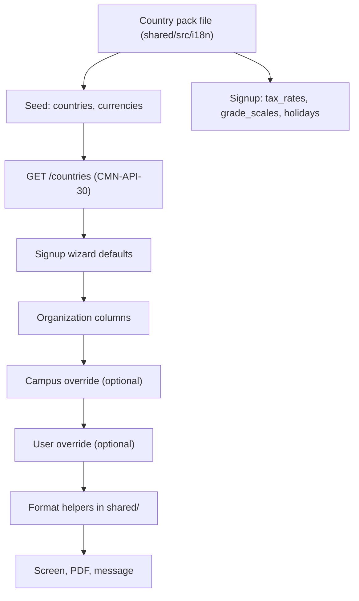
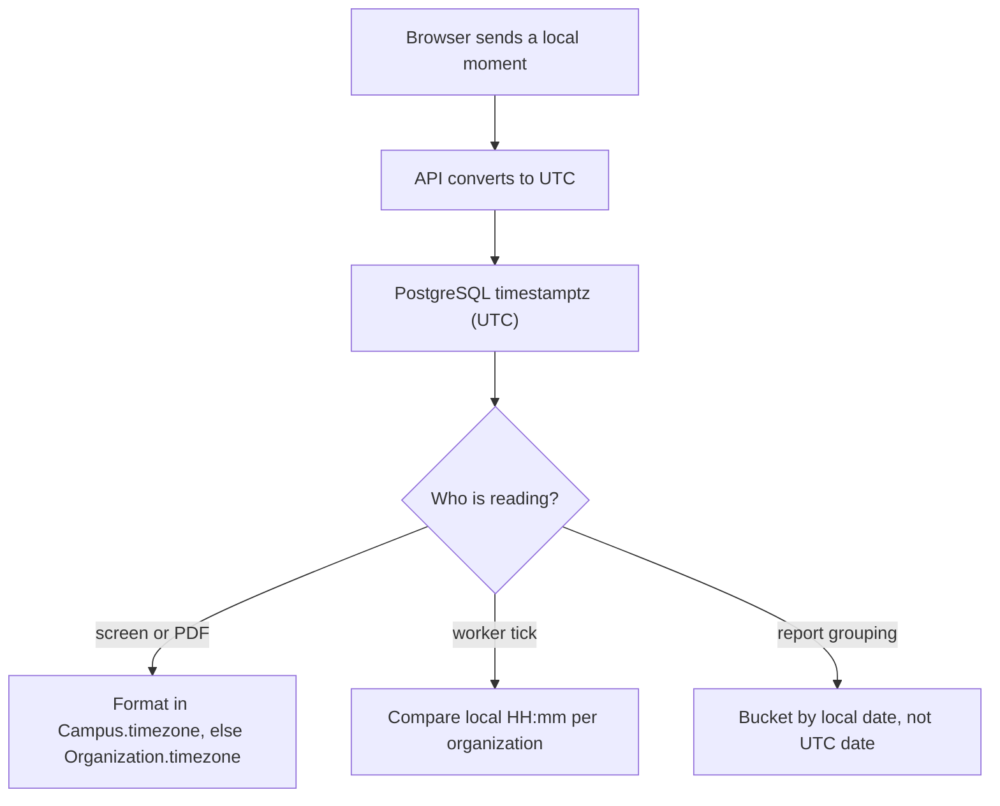
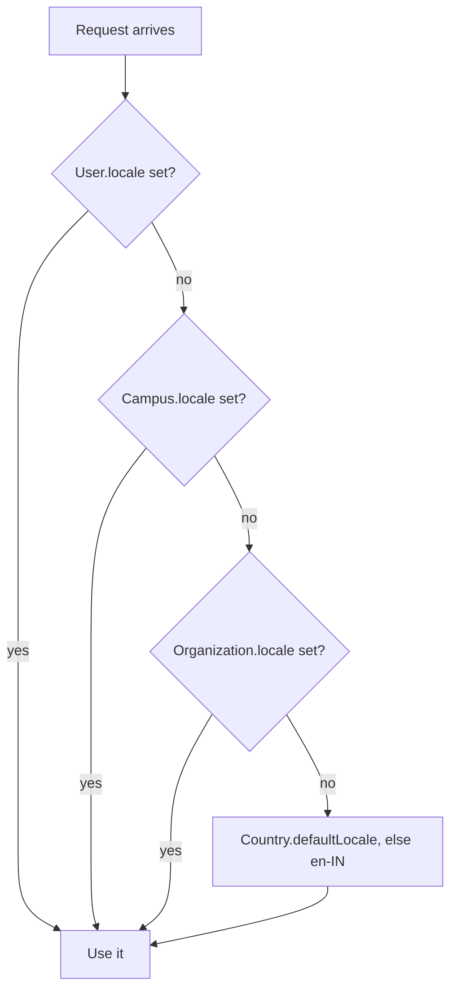

# Internationalization and Localization

**In simple words:** EduFlow is one codebase that must feel local in four countries. A school in Lucknow needs rupees with lakh grouping, an April to March session, GST 18 percent and WhatsApp. A school in Sydney needs Australian dollars, four terms in a January to December year, GST 10 percent and email. This chapter defines the country pack that holds every such difference, plus the money, time and language rules that keep shared code correct in all of them.

| Item | Value |
|---|---|
| Countries covered | India `IN`, UAE `AE`, USA `US`, Australia `AU` |
| Platform tables | `countries`, `currencies`, `exchange_rates` |
| Tenant columns | `Organization.countryCode`, `currency`, `timezone`, `locale`, `stateCode`, `financialYearStartMonth`, `weekStartsOn` |
| Languages | English `en` (Phase 1), Hindi `hi` (Phase 2), Arabic `ar` (Phase 4) |
| Main endpoints | `CMN-API-30` to `CMN-API-36`, `ORG-API-09`, `AUTH-API-15`, `SET-API-05`, `NTF-API-02` |
| Permission keys | `platform.manage`, `organizations.update`, `settings.update`, `self` |
| Release phase | Phase 1 India pack, Phase 2 Hindi UI, Phase 4 UAE, USA and Australia packs (prompt `P-60`) |
| Shared code | `shared/src/i18n/` (country packs, money, time, formatting helpers) |

> **Founder note:** Do not build all four packs now. Build the India pack properly and build the seams a second pack plugs into. A seam costs a day today. Putting a currency back into 300 hard-coded rupee strings costs three weeks in Year 2.

## What Is Fixed and What Bends

Three things never become configurable. The data model: one `organizations` table, one `students` table, one `fee_invoices` table, and no table added for a country. The money rule: `Decimal(12, 2)` plus a 3-letter `currency` code. The time rule: UTC `timestamptz` for moments, `@db.Date` for calendar days.

Everything else bends through data, never through a country branch inside a service. There are four bending points.

| Bending point | Where it lives | Read by |
|---|---|---|
| Country pack | `shared/src/i18n/country-packs/*.ts`, seeded into `countries` | Signup, formatting |
| Tenant choice | `Organization` and `Campus` columns | Every service and worker |
| Tenant setting | `organization_settings` rows, key `<group>.<key>` | The module that owns the group |
| Message catalogue | `client/messages/<locale>.json` | Next.js app only |

> **Rule:** A service may read `Organization.countryCode` to pick a rule set from the pack. It may never hold country-specific logic. If the fee service needs GST, the rate comes from a `TaxRate` row.

## The Country Pack

A country pack is a plain, reviewed TypeScript file: the one place where a country's facts are written down. Part of it seeds the table `countries`, so the API serves it without a deploy. The rest runs at signup and creates the tenant's first `TaxRate`, `GradeScale`, `Holiday` and `NumberSequence` rows.

### Identity and formats

| Field | India | UAE | USA | Australia |
|---|---|---|---|---|
| `code` and `iso3` | IN, IND | AE, ARE | US, USA | AU, AUS |
| `dialCode` | +91 | +971 | +1 | +61 |
| `defaultCurrencyCode` | INR | AED | USD | AUD |
| `defaultLocale` | en-IN | en-AE | en-US | en-AU |
| Currency symbol | Rs | AED | $ | A$ |
| Grouping example | 12,34,567.00 | 1,234,567.00 | 1,234,567.00 | 1,234,567.00 |
| Date shown as | 19 Jul 2027 | 19 Jul 2027 | Jul 19, 2027 | 19 Jul 2027 |
| `weekStartsOn` | MONDAY | MONDAY | SUNDAY | MONDAY |

India is the only market with a different grouping rule, and `Intl.NumberFormat('en-IN')` already produces `12,34,567`, so we never write a grouping function. We only pin `numberingSystem: 'latn'`, so a Hindi receipt prints Latin digits.

### Phone, address and identity documents

| Field | India | UAE | USA | Australia |
|---|---|---|---|---|
| Mobile pattern | 10 digits, starts 6 to 9 | 9 digits, starts 5 | 10 digits, area plus line | 9 digits, starts 4 |
| Stored as | `+919876543210` | `+971501234567` | `+12125550142` | `+61412345678` |
| Postal code | 6-digit PIN | None, PO Box only | ZIP 5 or ZIP+4 | 4 digits |
| Region field | State, GST code in `stateCode` | Emirate | State code, 2 letters | State or territory |
| Student document | Aadhaar, APAAR | Emirates ID, passport | School student ID | USI, post-school only |
| Staff tax id | PAN | Emirates ID, labour card | SSN, never stored | TFN, never stored |

Postal code stays nullable because the UAE has none, so its pattern comes from the pack, not from a fixed Zod rule. Any national identity number goes into an encrypted column such as `Guardian.nationalIdEncrypted`, never a plain field or an export. Social Security and tax file numbers are not collected at all.

### Academic year, terms and week

| Field | India | UAE | USA | Australia |
|---|---|---|---|---|
| Academic year | Apr to Mar | Sep to Jun, or Apr to Mar | Aug to Jun | Jan to Dec |
| Year name pattern | 2027-28 | 2027-28 | 2027-2028 | 2027 |
| Terms per year | 2 or 3 | 3 | 2 semesters or 4 quarters | 4 terms |
| `financialYearStartMonth` | 4 | 1 | 1 | 7 |
| Teaching week | Mon to Sat | Mon to Fri | Mon to Fri | Mon to Fri |
| Weekly off | Sunday | Sat, Sun | Sat, Sun | Sat, Sun |

> **Warning:** The academic year and the financial year are different and the schema keeps them apart. `AcademicYear` rows hold the teaching calendar; `Organization.financialYearStartMonth` drives tax reports only. An Indian-curriculum school in Dubai runs both at once. Never derive one from the other.

Indian-curriculum schools are the wedge in the UAE, so that pack ships both presets and the onboarding wizard asks which applies. Australia is the only pack that seeds four `Term` rows.

### Grading systems

| Country | Scale name | `scaleType` | Bands |
|---|---|---|---|
| India, CBSE | CBSE 9-point | PERCENTAGE_BANDS | A1 91-100 point 10, A2 81-90 point 9, down to E below 33 |
| India, ICSE and state | Percentage | PERCENTAGE_BANDS | Distinction 75+, First 60-74, Second 45-59, Pass 35-44 |
| UAE | Curriculum scale | PERCENTAGE_BANDS | Indian, British or American scale seeded by curriculum |
| USA | GPA 4.0 | GRADE_POINT | A 93-100 point 4.0, A- 90-92 point 3.7, down to F below 60 |
| Australia | A to E descriptors | PERCENTAGE_BANDS | A 85+, B 70-84, C 50-69, D 35-49, E below 35 |

Each row seeds one `GradeScale` with its `GradeBand` children. The model carries `minPercent`, `maxPercent`, `gradePoint` and `isPass`, so a 4.0 GPA scale is the same shape as a CBSE scale. Weighted GPA for Advanced Placement is a second scale reaching 5.0, picked per exam through `Exam.gradeScaleId`.

> **Note:** ATAR, the Australian university ranking, is calculated by a state authority from scaled Year 12 results, so EduFlow never computes it. The report card prints the school's A to E result and, where recorded, a read-only ATAR estimate held as a custom field.

### Tax

| Field | India | UAE | USA | Australia |
|---|---|---|---|---|
| `taxName` | GST | VAT | Sales Tax | GST |
| `taxPercent` on our plan | 18.00 | 5.00 | By state | 10.00 |
| `taxIdLabel` | GSTIN | TRN | EIN | ABN |
| Tax id shape | 15 characters | 15 digits | 9 digits | 11 digits |
| Split components | CGST 9 plus SGST 9, or IGST 18 | VAT 5 | State plus local | GST 10 |
| School tuition | Exempt | Zero-rated | Not taxable | GST-free |
| Coaching tuition | Taxable at 18 percent | Standard-rated 5 percent | Varies by state | Taxable |

The split lives in `TaxRate.components` and `TaxRate.interStateComponents` as JSON. The service picks the inter-state list when `Organization.stateCode` differs from the place of supply, which is how a Patna institute bills a Jharkhand address.

> **Assumption:** EduFlow's India invoice uses service accounting code `997331`; a tenant declares its own tuition code. Exemptions everywhere depend on the institution's registration status, so a chartered accountant or tax agent must confirm every line of this table per tenant. The product stores what the tenant declares; it does not decide tax status.

### Invoice and receipt wording

| Country | Must appear on a tax invoice | Source |
|---|---|---|
| India | Supplier GSTIN, place of supply, SAC, tax split | `Organization.taxId`, `stateCode` |
| India, exempt | "Exempt supply of education services. No GST charged." | `TaxTreatment` is `EXEMPT` |
| UAE | "Tax Invoice", supplier TRN, AED amount, VAT amount | `Organization.taxId` |
| USA | Seller name, address, itemised tax when charged | Stripe Tax output |
| Australia | "Tax invoice", ABN, "Total price includes GST" | `Organization.taxId` |

Receipt and invoice PDFs read these strings from the catalogue, so a wording change is one edit, not a rewrite in six places.

### Payments and messaging

| Field | India | UAE | USA | Australia |
|---|---|---|---|---|
| Gateway | RAZORPAY | STRIPE | STRIPE | STRIPE |
| `enabledMethods` | upi, card, netbanking, wallet | card, apple_pay, google_pay | card, ach, apple_pay | card, becs, apple_pay |
| Typical charge | UPI near zero, cards about 2 percent | About 2.9 percent | 2.9 percent card, ACH flat | 1.75 percent card, BECS flat |
| First channel | WHATSAPP | WHATSAPP | EMAIL | EMAIL |
| Second channel | SMS with DLT | EMAIL | SMS | SMS |
| Sender rules | TRAI DLT header and template | None | 10DLC registration | None |

`PaymentGatewayAccount.enabledMethods` is already a JSON column, so the pack supplies only the onboarding default plus `Guardian.preferredChannel`. Direct debit matters more than it looks: BECS in Australia and ACH in the USA are how schools actually collect recurring tuition, and both settle in days, not seconds. Settlement belongs to *Payments Module*.

### Holidays

Holiday rows are tenant data. The pack ships a preset that `BAT-API-44` writes in bulk at academic-year setup: India seeds Republic Day, Holi, Independence Day, Gandhi Jayanti, Diwali and Christmas, flagged for a local check; the USA seeds federal holidays and a winter break; Australia asks for the state, because Labour Day falls in four different months. The UAE pack seeds only National Day and New Year and leaves Eid out on purpose, because those dates follow the moon sighting and are announced days ahead. It raises a reminder task instead of a wrong date.

### Words that change

| Concept | India | UAE | USA | Australia |
|---|---|---|---|---|
| Course level | Class 10 | Grade 10 | Grade 10 | Year 10 |
| Teaching group | Section 10-A | Section 10-A | Homeroom 10A | Class 10A |
| Money owed | Fees | Fees | Tuition | Fees |
| Site | Campus | Campus | School site | Campus |
| Student number | Roll number | Roll number | Student ID | Student number |
| Result | Marks | Marks | Score | Result |
| Period | Term | Term | Semester | Term |

These words are catalogue keys, not database values. `common.courseLevel` gives "Class" in `en-IN` and "Year" in `en-AU`. It sits on top of the label switch by `Organization.type`, which turns "Campus" into "Centre" for coaching. Order: organization type first, then locale.

## Where a Country Pack Lives

Nothing above needs a new table. Three platform tables and a few tenant columns carry it all. The pack file is the source; the database is the copy the system reads.

```prisma
// docs/src/_schema/01-platform.prisma (copied exactly)
model Country {
  id                  String   @id @default(uuid()) @db.Uuid
  code                String   @unique @db.Char(2) // ISO 3166-1 alpha-2, e.g. IN
  iso3                String   @unique @db.Char(3)
  name                String   @db.VarChar(100)
  dialCode            String   @map("dial_code") @db.VarChar(8) // e.g. +91
  defaultCurrencyCode String   @map("default_currency_code") @db.Char(3)
  defaultTimezone     String   @map("default_timezone") @db.VarChar(64) // IANA, e.g. Asia/Kolkata
  defaultLocale       String   @map("default_locale") @db.VarChar(10) // e.g. en-IN
  taxName             String?  @map("tax_name") @db.VarChar(20) // GST, VAT, Sales Tax
  taxPercent          Decimal? @map("tax_percent") @db.Decimal(5, 2) // tax on the EduFlow subscription
  taxIdLabel          String?  @map("tax_id_label") @db.VarChar(20) // GSTIN, ABN, TRN, EIN
  isSupported         Boolean  @default(false) @map("is_supported") // open for signup
  createdAt           DateTime @default(now()) @map("created_at") @db.Timestamptz(6)
  updatedAt           DateTime @updatedAt @map("updated_at") @db.Timestamptz(6)

  defaultCurrency Currency       @relation(fields: [defaultCurrencyCode], references: [code], onDelete: Restrict)
  organizations   Organization[]
  campuses        Campus[]

  @@map("countries")
}

model Currency {
  id            String   @id @default(uuid()) @db.Uuid
  code          String   @unique @db.Char(3) // ISO 4217, e.g. INR
  name          String   @db.VarChar(60)
  symbol        String   @db.VarChar(8)
  decimalDigits Int      @default(2) @map("decimal_digits") @db.SmallInt
  isActive      Boolean  @default(true) @map("is_active")
  createdAt     DateTime @default(now()) @map("created_at") @db.Timestamptz(6)
  updatedAt     DateTime @updatedAt @map("updated_at") @db.Timestamptz(6)

  countries     Country[]
  organizations Organization[]
  planPrices    PlanPrice[]

  @@map("currencies")
}

model ExchangeRate {
  id            String   @id @default(uuid()) @db.Uuid
  baseCurrency  String   @map("base_currency") @db.Char(3)
  quoteCurrency String   @map("quote_currency") @db.Char(3)
  rate          Decimal  @db.Decimal(18, 8) // 1 base = rate quote
  rateDate      DateTime @map("rate_date") @db.Date
  source        String   @db.VarChar(40) // e.g. ECB, RBI, MANUAL
  createdAt     DateTime @default(now()) @map("created_at") @db.Timestamptz(6)
  updatedAt     DateTime @updatedAt @map("updated_at") @db.Timestamptz(6)

  @@unique([baseCurrency, quoteCurrency, rateDate])
  @@map("exchange_rates")
}
```

The tenant side is a small set of columns every service already reads.

| Column | Table | Meaning | Fallback |
|---|---|---|---|
| `countryCode` | `organizations` | Which pack applies | Chosen at signup, never blank |
| `currency` | `organizations` | Currency of fees and invoices | `Country.defaultCurrencyCode` |
| `timezone` | `organizations` | IANA name for the whole tenant | `Country.defaultTimezone` |
| `locale` | `organizations` | Default UI language and formats | `Country.defaultLocale` |
| `timezone`, `locale`, `currency` | `campuses` | Per-campus override, null means inherit | Organization value |
| `locale`, `timezone` | `users` | Per-person override, null means inherit | Campus, then organization |
| `preferredLanguage` | `guardians` | Language of WhatsApp, SMS and email | `en` |

**Figure: How a country fact reaches a screen**



The chain runs one way: a pack never reads a tenant value, and a tenant value is never written back. That is what makes a pack safe to edit. The worst case is that new tenants get better defaults.

## Money Rules

Money bugs lose customers. Five rules cover them, and the schema already supports all five.

1. **Store `Decimal` plus currency together.** Every money column is `@db.Decimal(12, 2)` beside a `@db.Char(3)` currency column. A number without a currency is not money.
2. **Never convert a stored amount.** An invoice raised in AED stays AED for life: payment, receipt, refund and ledger. Conversion happens only on display, and the result is never written back.
3. **Never use Float or JavaScript `number` for arithmetic.** Prisma 6 returns `Decimal` objects. `number` is allowed only in the last step before printing.
4. **Convert to minor units only at the gateway edge.** Razorpay wants paise, Stripe wants cents. That lives in one function in the payment adapter.
5. **Format with `Intl.NumberFormat`.** No custom comma logic, no manual lakh function, no hard-coded rupee sign.

```typescript
// shared/src/i18n/money.ts
import { Prisma } from '@prisma/client';

export type CurrencyCode = 'INR' | 'AED' | 'USD' | 'AUD';

const DECIMALS: Record<CurrencyCode, number> = { INR: 2, AED: 2, USD: 2, AUD: 2 };

/** Display only. Never feed the result back into a calculation. */
export function formatMoney(
  amount: Prisma.Decimal | string,
  currency: CurrencyCode,
  locale: string,
  opts: { showCode?: boolean } = {},
): string {
  const digits = DECIMALS[currency] ?? 2;
  return new Intl.NumberFormat(locale, {
    style: 'currency',
    currency,
    currencyDisplay: opts.showCode ? 'code' : 'symbol',
    numberingSystem: 'latn',
    minimumFractionDigits: digits,
    maximumFractionDigits: digits,
  }).format(Number(amount.toString()));
}

/** Gateway edge only: 12000.50 INR -> 1200050 paise. */
export function toMinorUnits(amount: Prisma.Decimal | string, currency: CurrencyCode): number {
  const digits = DECIMALS[currency] ?? 2;
  const [sign, body] = amount.toString().startsWith('-')
    ? ['-', amount.toString().slice(1)]
    : ['', amount.toString()];
  const [whole, frac = ''] = body.split('.');
  const padded = (frac + '0'.repeat(digits)).slice(0, digits);
  return Number(`${sign}${whole}${padded}`);
}
```

What the helper prints, for the same amount of 1,234,567.00:

| Locale and currency | Output | Note |
|---|---|---|
| `en-IN`, INR | Rs 12,34,567.00 | Lakh grouping, rupee sign in the real build |
| `hi-IN`, INR | Rs 12,34,567.00 | Latin digits because of `numberingSystem` |
| `en-AE`, AED | AED 1,234,567.00 | Symbol is the code itself |
| `en-US`, USD | $1,234,567.00 | |
| `en-AU`, AUD | $1,234,567.00 | Ambiguous, so group reports pass `showCode` |
| `en-IN`, AUD, `showCode` | AUD 12,34,567.00 | Grouping from locale, code from currency |

> **Warning:** `en-AU` prints a plain dollar sign for AUD and `en-US` prints the same sign for USD. On any screen or export that can hold two currencies, pass `showCode: true`. A group that reads "$7,500" without knowing the country has a wrong number, not a formatted one.

Lakh and crore wording appears in dashboards and investor reports, never on an invoice. A separate helper returns "Rs 1.23 Cr" above one crore and "Rs 12.34 L" above one lakh, only for `en-IN` and `hi`.

## Time and Timezone Rules

| Kind of value | Column type | Example | Rule |
|---|---|---|---|
| Moment in time | `timestamptz` | `paidAt`, `createdAt` | Store UTC, show in tenant time |
| Calendar day | `@db.Date` | `dueDate`, `startDate`, `Holiday.startDate` | No timezone, never shifted |
| Clock time | `VarChar(5)` | `PeriodSlot.startTime` "09:15" | Read in the campus timezone |
| Duration | `Int` minutes | Late-mark window | Timezone-free |

The second row breaks most products. Store a due date of 10 July as a timestamp, show it in a browser set to `America/Los_Angeles`, and it becomes 9 July with a wrong late fee attached. A date-only column has no timezone, so it cannot drift. If a human would write it on a paper calendar, it is `@db.Date`.

**Figure: Where the timezone is applied**



Three helpers in `shared/src/i18n/time.ts` do all of it; the scheduler in *Background Jobs and Events* uses the first two.

```typescript
// shared/src/i18n/time.ts
import { fromZonedTime, toZonedTime } from 'date-fns-tz';
import { format } from 'date-fns';

/** "2027-07-19" for the tenant, whatever the server clock says. */
export function localDate(at: Date, timeZone: string): string {
  return format(toZonedTime(at, timeZone), 'yyyy-MM-dd');
}

/** "09:00" in the tenant's own clock; used by the per-organization tick. */
export function localHhMm(at: Date, timeZone: string): string {
  return format(toZonedTime(at, timeZone), 'HH:mm');
}

/** Start of a calendar day in tenant time, returned as a UTC instant. */
export function startOfLocalDay(dateOnly: string, timeZone: string): Date {
  return fromZonedTime(`${dateOnly}T00:00:00`, timeZone);
}
```

Daylight saving is a USA and Australia problem only; India and the UAE have none. Four rules survive it.

- A repeating job is stored as a local time such as "09:00", never as a UTC offset. The 15-minute tick asks each organization what its local clock says, so a Sydney tenant still gets 09:00 after the October change.
- Any job that must run once per local day carries a `jobId` built from the organization id and the local date, the existing pattern in *Background Jobs and Events*. A repeated American hour cannot create a second run.
- A USA group can hold `America/New_York` and `America/Phoenix` at once, and Phoenix ignores DST. That is why `Campus.timezone` exists and why reports group by campus-local date.
- An attendance session opened at 23:50 local belongs to the local date. Every attendance, fee and payment report buckets on the local date, not the UTC date.

> **Example:** Day-close at Bright Future Public School runs at 20:00 `Asia/Kolkata`, or 14:30 UTC. The same job in Sydney runs at 20:00 local: 09:00 UTC in January, 10:00 UTC in July.

## The Language Layer

The Next.js App Router app keeps every visible string in a message catalogue. We use `next-intl`: it works with server components, supports ICU syntax and needs no extra server. One file per locale, namespaced by module.

```text
client/
  messages/
    en.json      <- source of truth, English
    hi.json      <- Hindi, Phase 2
    ar.json      <- Arabic, Phase 4
  src/i18n/
    request.ts   <- picks the locale per request
    format.ts    <- wraps the shared money and date helpers
```

```json
{
  "fees": {
    "pendingCount": "{count, plural, =0 {No pending fees} one {# pending fee} other {# pending fees}}",
    "collectTitle": "Collect fee",
    "receiptSaved": "Receipt {receiptNo} saved. {amount} collected.",
    "dueOn": "Due on {date, date, medium}"
  },
  "common": { "courseLevel": "Class", "studentNumber": "Roll number" }
}
```

Six rules keep the catalogue usable.

1. **One key, one whole sentence.** Never join two keys. Hindi and Arabic order words differently.
2. **Plurals are ICU.** English and Hindi have two plural forms, Arabic has six. Only ICU gets Arabic right.
3. **Numbers, money and dates are placeholders.** `{amount}` takes the output of `formatMoney`; `{date, date, medium}` is formatted by the catalogue.
4. **Keys are namespaced by module.** Flat keys collide once the file passes two thousand lines.
5. **English is the fallback and the source.** A missing key renders English and logs the key to Sentry. A raw key must never reach a parent's screen.
6. **No user data in a catalogue.** A student name is a placeholder value, never part of a key.

Hindi comes first because the parent app is where language matters. Order: Parent Portal, notification templates, receipts and report cards, then admin screens. An accountant in EduFlow all day is fine in English. A mother in Lucknow opening a fee reminder is not.

## Translated Notification Templates

Messages are not translated by the UI. `NotificationTemplate` has a `language` column inside its unique key, so one event carries a row per language and channel.

The worker picks the row in this order: `Guardian.preferredLanguage`, then `User.locale` cut to its language part, then `Organization.locale`, then `en`. With no tenant row it falls back to the EduFlow default, the row with `organizationId` null.

| Channel | Extra rule for another language |
|---|---|
| WHATSAPP | Meta approves a template per language. `WhatsAppTemplate.language` holds `en`, `hi` or `en_US`, and an unapproved language cannot send. |
| SMS | India needs a DLT-registered template per language. Hindi is Unicode, so one SMS holds 70 characters, not 160, and costs more. |
| EMAIL | Free text, no approval. Subject and body both come from the template row. |
| IN_APP | Rendered from the catalogue at read time, so it follows the reader's current language. |
| PUSH | Title and body from the template row at send time. |

> **Warning:** A Hindi SMS is charged in 70-character segments. A 160-character English reminder is one segment; the same text in Hindi is three. The cost estimate in *SMS Module* must use the Unicode segment size whenever the template language is not `en`.

## Locale Negotiation

**Figure: Which language a person sees**



`Accept-Language` is used only on public pages: signup, login and a shared policy document. Once a person signs in the stored preference wins, because a teacher who chose Hindi should not get English on a borrowed laptop. `AUTH-API-14` echoes the chosen locale, so the client never guesses.

A person changes their own language with `AUTH-API-15`. A parent with no login, who only receives WhatsApp, is changed by the office on the guardian record.

## Right-to-Left Readiness

Arabic ships in Phase 4, but being ready costs almost nothing if it is paid for now. Four rules:

1. Spacing uses Tailwind logical classes, `ps-4` and `me-2`, never `pl-4` or `mr-2`. An ESLint rule fails the build on a physical direction class.
2. The root layout sets `dir` from the locale, so turning Arabic on is a data change, not a layout rewrite.
3. Direction icons, such as a back arrow, flip through one `[dir="rtl"]` CSS rule.
4. Numbers, money, dates and identifiers stay left-to-right inside an Arabic sentence. The Unicode bidirectional algorithm handles that once the value is a placeholder, which catalogue rule three forces.

PDF output needs an Arabic-capable font in the worker image, because a slim Chromium container has no Arabic glyphs. That is a Dockerfile line on the Phase 4 checklist.

## Multi-Currency Reporting for Groups

A tenant has one fee currency, so daily reports never convert. Conversion appears in two places: a group with campuses in two countries, and our own revenue reporting.

| Rule | Why |
|---|---|
| Convert at display time only | Stored amounts stay in the currency they were billed in |
| Use the rate of the last day of the period | The same report re-run next month gives the same number |
| Show the rate and its date under the total | An auditor can reproduce the figure |
| Never sum two currencies without a rate | Better to show two rows than one wrong total |
| Fail loudly on a missing rate | A missing `ExchangeRate` row returns `SERVICE_UNAVAILABLE`, not zero |

```sql
-- Group collection report, converted to the group's reporting currency
SELECT c.name AS campus,
       p.currency,
       SUM(p.amount) AS collected,
       ROUND(SUM(p.amount) * COALESCE(x.rate, 0), 2) AS collected_inr
FROM payments p
JOIN campuses c ON c.id = p.campus_id
LEFT JOIN exchange_rates x
       ON x.base_currency = p.currency
      AND x.quote_currency = 'INR'
      AND x.rate_date = $3
WHERE p.organization_id = $1
  AND p.status = 'SUCCESS'
  AND p.paid_at >= $2 AND p.paid_at < $3
GROUP BY c.name, p.currency, x.rate
ORDER BY c.name;
```

A daily worker writes `ExchangeRate` rows with `source` set to the feed name, or `MANUAL` when typed by hand. The canon planning rates, US$1 = Rs 85, A$1 = Rs 56 and AED 1 = Rs 23, are the seed values, labelled an assumption.

## Country Feature Flags

Some features exist only in one country. UPI is meaningless in Sydney; DLT registration is meaningless outside India. These are not plan features and must not live in `plan_features`.

The pack carries a `features` list. The API merges it with plan features and returns the intersection in `AUTH-API-14`, so the client reads one list and never hard-codes a country check.

| Feature key | IN | AE | US | AU |
|---|---|---|---|---|
| `pay.upi` | Yes | No | No | No |
| `pay.netbanking` | Yes | No | No | No |
| `pay.ach` | No | No | Yes | No |
| `pay.becs` | No | No | No | Yes |
| `tax.gst_split` | Yes | No | No | Partial |
| `tax.stripe_tax` | No | Yes | Yes | Yes |
| `msg.dlt_sms` | Yes | No | No | No |
| `msg.whatsapp_first` | Yes | Yes | No | No |

The effective answer is `planFeature AND countryFeature`. A Growth plan in Australia sees online fee payment, but the method list shows card and BECS, never UPI. A feature off for the country is hidden, not disabled: a greyed-out UPI button in Sydney only creates tickets.

## Data Residency Routing

`Organization.dataRegion` decides which AWS region holds a tenant's files and backups. It is set at signup from the pack and changes only through a migration run by us.

| Country | `dataRegion` | Database | Notes |
|---|---|---|---|
| India | `ap-south-1` | Mumbai | Default for Phase 1 to Phase 3 |
| UAE | `me-central-1` | UAE | Phase 4; PDPL expectation from KHDA and ADEK schools |
| USA | `us-east-1` | Virginia | Phase 4; state student-privacy laws |
| Australia | `ap-southeast-2` | Sydney | Phase 4; Australian Privacy Principles |

Until Phase 4 there is one stack in `ap-south-1`, and the sales answer is honest: data sits in Mumbai, a regional stack is on the roadmap. Three things are region-aware from day one, so the split is a deployment change and not a rewrite. Pre-signed S3 URLs come from the tenant's `dataRegion`, export jobs write into that region's bucket, and backups and restore tests run per region. Residency law belongs to *Privacy and Compliance*.

## Localization Workflow and QA

| Step | Who | Output |
|---|---|---|
| Write the English string | Developer | Key in `en.json` |
| Extract untranslated keys | CI script | Diff list per locale |
| Translate | Native speaker, paid per batch | `hi.json` update |
| Review in context | Founder plus a pilot user | Screenshot approval |
| Ship | CI | Build fails on a missing key |

Machine translation is fine for a first draft, never for money, legal or consent text. A receipt line, a tax sentence and a privacy notice are reviewed by a person who will use them.

This checklist runs before any country pack is switched on with `isSupported = true`.

| Check | Pass condition |
|---|---|
| Money | Right symbol, grouping and 2 decimals |
| Mixed currency | Two currencies on one screen show the code |
| Dates | Date-only fields never shift in a foreign browser |
| Scheduling | A daily job fires at local time across a DST change |
| Phone | Local numbers save and dial as E.164 |
| Address | Postal rule matches the country; UAE accepts none |
| Tax | Right label, split and legal sentence on the invoice |
| Grading | Report card prints the country's scale and pass rule |
| Language | No raw key, no clipped button in the longest locale |
| Messaging | Template exists and is approved per channel, per language |
| Payments | Only the country's methods appear at checkout |
| Residency | Files and exports land in the region bucket |

## Localization API Surface

These endpoints read or write a locale value. All exist in the registry; this chapter adds none.

| ID | Method | Path | Permission | Purpose |
|---|---|---|---|---|
| CMN-API-30 | GET | `/countries` | public | Country defaults for signup |
| CMN-API-31 | GET | `/currencies` | public | Currencies with symbol and digits |
| CMN-API-32 | GET | `/exchange-rates` | self | Latest or dated rate for a pair |
| CMN-API-33 | GET | `/reference-data/enums` | self | Enum labels in the caller's language |
| CMN-API-34 | PATCH | `/countries/:code` | platform.manage | Edit defaults, tax, `isSupported` |
| CMN-API-35 | PATCH | `/currencies/:code` | platform.manage | Edit symbol, digits, `isActive` |
| CMN-API-36 | POST | `/exchange-rates` | platform.manage | Upsert daily rates |
| ORG-API-01 | GET | `/plans` | public | Prices by currency and cycle |
| ORG-API-03 | POST | `/signup` | public | Sets country, currency, timezone, locale |
| ORG-API-08 | GET | `/organizations/current` | organizations.view | Read tenant locale settings |
| ORG-API-09 | PATCH | `/organizations/current` | organizations.update | Timezone, locale, year, week start |
| ORG-API-16 | POST | `/subscriptions/preview` | billing.view | Price preview with country tax |
| CAMP-API-04 | PATCH | `/campuses/:id` | campuses.update | Campus timezone and board codes |
| AUTH-API-14 | GET | `/auth/me` | self | Effective locale, timezone, features |
| AUTH-API-15 | PATCH | `/auth/me` | self | Own locale and timezone |
| USR-API-04 | PATCH | `/users/:id` | users.update | Another user's locale |
| SET-API-02 | GET | `/settings/general` | settings.view | General group with overrides |
| SET-API-03 | PUT | `/settings/general` | settings.update | Save the general group |
| SET-API-05 | GET | `/settings/effective` | self | Bootstrap values for the client |
| FEE-API-05 | GET | `/tax-rates` | fees.view | Effective-dated rates |
| FEE-API-06 | POST | `/tax-rates` | fees.manage | Create rate with components |
| NTF-API-01 | GET | `/notification-templates` | notifications.view | Tenant rows over defaults |
| NTF-API-02 | POST | `/notification-templates` | notifications.manage | Row per event, channel, language |
| EXM-API-02 | POST | `/grade-scales` | exams.manage | Create the country scale |
| BAT-API-44 | POST | `/holidays/bulk` | batches.manage | Seed the holiday preset |

### Country and currency reference

```http
GET /api/v1/countries?isSupported=true HTTP/1.1
Host: api.eduflow.app
```

```json
{
  "success": true,
  "data": [
    { "code": "IN", "iso3": "IND", "name": "India", "dialCode": "+91",
      "defaultCurrencyCode": "INR", "defaultTimezone": "Asia/Kolkata",
      "defaultLocale": "en-IN", "taxName": "GST", "taxPercent": "18.00",
      "taxIdLabel": "GSTIN", "isSupported": true }
  ]
}
```

| Status | Code | When |
|---|---|---|
| 400 | `VALIDATION_ERROR` | `isSupported` is not a boolean |
| 429 | `RATE_LIMITED` | Public endpoint, more than 100 calls a minute from one IP |

### Exchange rate read

```http
GET /api/v1/exchange-rates?base=AED&quote=INR&on=2027-07-19 HTTP/1.1
Authorization: Bearer <accessToken>
```

```json
{
  "success": true,
  "data": { "baseCurrency": "AED", "quoteCurrency": "INR",
            "rate": "23.00000000", "rateDate": "2027-07-19", "source": "RBI" }
}
```

| Status | Code | When |
|---|---|---|
| 404 | `NOT_FOUND` | No row for that pair on or before the date |
| 422 | `BUSINESS_RULE_VIOLATION` | `base` equals `quote` |

### Exchange rate upsert

```http
POST /api/v1/exchange-rates HTTP/1.1
Authorization: Bearer <accessToken>
Content-Type: application/json

{ "rateDate": "2027-07-19", "source": "RBI",
  "rates": [ { "base": "USD", "quote": "INR", "rate": "85.00000000" },
             { "base": "AED", "quote": "INR", "rate": "23.00000000" } ] }
```

```json
{ "success": true, "data": { "inserted": 1, "updated": 1, "rateDate": "2027-07-19" } }
```

| Status | Code | When |
|---|---|---|
| 403 | `FORBIDDEN` | Caller is not `SUPER_ADMIN` with `platform.manage` |
| 400 | `VALIDATION_ERROR` | Rate is zero, negative or has more than 8 decimals |

### Enum labels for dropdowns

```http
GET /api/v1/reference-data/enums?names=PaymentMethod,WeekDay HTTP/1.1
Authorization: Bearer <accessToken>
Accept-Language: hi-IN
```

```json
{
  "success": true,
  "data": {
    "PaymentMethod": [ { "value": "CASH", "label": "Nagad" },
                       { "value": "UPI", "label": "UPI" } ],
    "WeekDay": [ { "value": "MONDAY", "label": "Somvar" } ]
  }
}
```

| Status | Code | When |
|---|---|---|
| 400 | `VALIDATION_ERROR` | An unknown enum name is requested |

Labels come from the catalogue file the client uses, so a dropdown never disagrees with a heading.

### Change tenant locale settings

```http
PATCH /api/v1/organizations/current HTTP/1.1
Authorization: Bearer <accessToken>
Content-Type: application/json

{ "timezone": "Asia/Dubai", "locale": "en-AE",
  "financialYearStartMonth": 1, "weekStartsOn": "MONDAY" }
```

```json
{
  "success": true,
  "data": { "id": "3f2a...", "countryCode": "AE", "currency": "AED",
            "timezone": "Asia/Dubai", "locale": "en-AE",
            "financialYearStartMonth": 1, "weekStartsOn": "MONDAY" }
}
```

| Status | Code | When |
|---|---|---|
| 400 | `VALIDATION_ERROR` | Timezone is not a valid IANA name, or locale is not enabled |
| 422 | `BUSINESS_RULE_VIOLATION` | `currency` change attempted while invoices exist |
| 403 | `FORBIDDEN` | Caller lacks `organizations.update` |

> **Rule:** `countryCode` and `currency` are set once, at signup. Changing either after the first invoice would break every stored amount and tax record, so the API refuses it. A real country move is a new organization plus an assisted migration.

### Change own language

```http
PATCH /api/v1/auth/me HTTP/1.1
Authorization: Bearer <accessToken>
Content-Type: application/json

{ "locale": "hi-IN", "timezone": "Asia/Kolkata" }
```

```json
{ "success": true, "data": { "id": "9c1e...", "locale": "hi-IN", "timezone": "Asia/Kolkata" } }
```

| Status | Code | When |
|---|---|---|
| 400 | `VALIDATION_ERROR` | Locale is not in the enabled list for the tenant |
| 401 | `TOKEN_EXPIRED` | Access token older than 15 minutes |

### Bootstrap values for the client

```http
GET /api/v1/settings/effective?keys=general.locale,general.timezone HTTP/1.1
Authorization: Bearer <accessToken>
X-Campus-Id: 7b4d...
```

```json
{
  "success": true,
  "data": { "general.locale": "en-IN", "general.timezone": "Asia/Kolkata",
            "general.weekStartsOn": "MONDAY", "general.currency": "INR",
            "general.countryCode": "IN" }
}
```

| Status | Code | When |
|---|---|---|
| 403 | `FORBIDDEN` | `X-Campus-Id` is a campus the user is not assigned to |

This is the only call before the first screen renders, so it is cached in Redis for 10 minutes per organization and campus, and cleared by `ORG-API-09` and `SET-API-03`.

### Create a template in another language

```http
POST /api/v1/notification-templates HTTP/1.1
Authorization: Bearer <accessToken>
Content-Type: application/json

{ "eventKey": "fees.reminder.due", "channel": "WHATSAPP", "language": "hi",
  "category": "FEES", "name": "Fee reminder (Hindi)",
  "body": "{{studentName}} ki fees {{amount}} {{dueDate}} tak jama karein.",
  "variables": ["studentName", "amount", "dueDate"],
  "whatsAppTemplateId": "b21c..." }
```

```json
{ "success": true, "data": { "id": "5e7a...", "language": "hi",
  "approvalStatus": "PENDING", "status": "ACTIVE" } }
```

| Status | Code | When |
|---|---|---|
| 409 | `CONFLICT` | A row already exists for this event, channel and language |
| 422 | `BUSINESS_RULE_VIOLATION` | A variable in the body is not in `variables` |
| 422 | `BUSINESS_RULE_VIOLATION` | WhatsApp template language does not match `language` |

## Requirements

| ID | Requirement | Phase |
|---|---|---|
| I18N-01 | Money is `Decimal` plus a currency code | 1 |
| I18N-02 | A stored amount is never converted | 1 |
| I18N-03 | Formatting goes through `Intl`, never string surgery | 1 |
| I18N-04 | Indian grouping correct above five digits | 1 |
| I18N-05 | Moments are UTC `timestamptz`, days are `@db.Date` | 1 |
| I18N-06 | Screens and PDFs use the campus or organization timezone | 1 |
| I18N-07 | Jobs fire at tenant local time, not a UTC offset | 1 |
| I18N-08 | Every visible string is a catalogue key | 1 |
| I18N-09 | A missing key falls back to English and is logged | 1 |
| I18N-10 | `countries` and `currencies` seeded from the pack | 1 |
| I18N-11 | Signup sets country, currency, timezone, locale | 1 |
| I18N-12 | India tax rate seeds CGST, SGST and IGST parts | 1 |
| I18N-13 | Invoice and receipt carry the legal wording | 1 |
| I18N-14 | Hindi covers portal, receipts and templates | 2 |
| I18N-15 | Templates exist per event, channel and language | 2 |
| I18N-16 | Guardian language decides the message language | 2 |
| I18N-17 | A person changes own language in one screen | 2 |
| I18N-18 | Country and currency locked after first invoice | 2 |
| I18N-19 | Rates load daily; a missing rate fails loudly | 2 |
| I18N-20 | Group reports show the code for two currencies | 2 |
| I18N-21 | Country features intersect plan features | 2 |
| I18N-22 | Lint blocks physical direction classes | 2 |
| I18N-23 | UAE, USA and Australia packs pass the checklist | 4 |
| I18N-24 | Files, exports and backups stay in the region | 4 |
