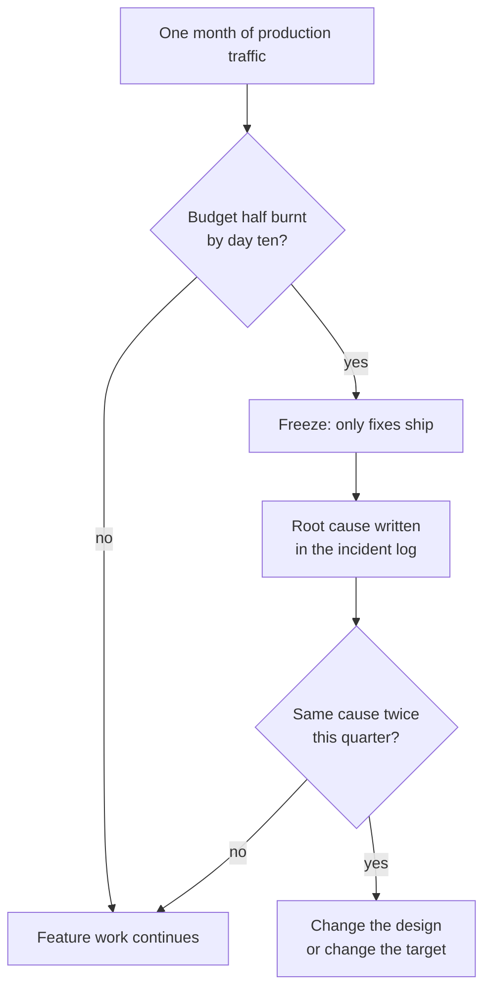

# Non-Functional Requirements

**In simple words:** This chapter turns "the app should feel fast and never lose money" into numbers that can be tested. Every line has an ID, a target, a way to measure it and the phase in which it binds. When a release misses a Must target, the release waits. The designs behind these numbers live in *System Architecture* and *Security Architecture*.

## How to Read a Number in This Chapter

IDs run from `NFR-01` upwards. Phase uses the canon release phases, so Phase 1 means it must be true on the pilot day, 18 November 2026. A p95 of 300 ms means 95 of every 100 requests are faster than 300 ms. Peak means working days, 08:30 to 10:00, in the tenant timezone. Wall time is what the user feels, network and rendering included.

Two rules keep the list honest. A target that no dashboard shows is deleted. A Must target that breaks twice in a quarter is fixed, or rewritten with the founder's signature on the new number.

> **Rule:** Every number is measured in production. Staging only decides whether a build may deploy.

## Performance

Endpoints belong to one of seven classes. A new endpoint picks its class in the pull request, and the load test asserts it.

| Class | Example endpoints | What it does | p95 | p99 |
|---|---|---|---|---|
| A | `STU-API-03`, `PAY-API-03` | Read one row with relations | 150 ms | 400 ms |
| B | `STU-API-01`, `FEE-API-11` | One page of a list, 20 rows | 300 ms | 700 ms |
| C | `PAY-API-02`, `ADM-API-14` | Write one business row | 500 ms | 1.2 s |
| D | `ATT-API-04`, `FEE-API-16` | Bulk write, up to 200 rows | 800 ms | 2 s |
| E | `CMN-API-27` | Global search, six entities | 400 ms | 900 ms |
| F | `DASH-API-01`, analytics reads | Dashboard and report read models | 1.5 s | 3 s |
| G | `CMN-API-11`, `CMN-API-25` | Start a job, answer `202` | 300 ms | 700 ms |

| ID | Requirement and target | Measured by | Phase |
|---|---|---|---|
| NFR-01 | Classes A to E hit the p95 of the class table above | Route percentile panel | 1 |
| NFR-02 | Classes F and G hit the p95 of the class table above | Route percentile panel | 1 |
| NFR-03 | One database query, p95 under 50 ms | `pg_stat_statements` top 20 | 1 |
| NFR-04 | No N+1 query loops, max 12 queries per request | Query counter in tests | 1 |
| NFR-05 | Save attendance for 40 students, under 1 s wall time on 4G | Throttled Playwright trace | 1 |
| NFR-06 | Collect a fee at the counter, `PAY-API-02` p95 under 700 ms | Route panel, 1st to 10th | 1 |
| NFR-07 | Staff dashboard on 4G, LCP under 3.0 s, 2 GB phone | Lighthouse CI | 1 |
| NFR-08 | Parent portal on 4G, LCP under 2.5 s | Lighthouse CI | 1 |
| NFR-09 | Portal responsiveness, INP under 200 ms | Web vitals, 75th percentile | 2 |
| NFR-10 | First-load JavaScript, portal 180 KB, admin 250 KB gzipped | CI bundle budget | 1 |
| NFR-11 | Synchronous report cap, 5,000 rows and 3 s, else `202` | Report service unit test | 1 |
| NFR-12 | Export 50,000 rows to XLSX, under 90 s | `export_jobs` durations | 2 |
| NFR-13 | Receipt or invoice PDF, under 3 s p95 | Job duration metric | 1 |
| NFR-14 | One report card PDF, under 6 s p95 | Job duration metric | 2 |
| NFR-15 | Bulk 500 report cards, under 8 minutes, 4 workers | Job group duration | 2 |
| NFR-16 | Monthly invoice run, 1,200 students, under 15 minutes | Queue batch duration | 1 |
| NFR-17 | A queued job starts, under 5 s, 30 s at peak | Oldest-waiting gauge | 1 |
| NFR-18 | List payload size, under 100 KB gzipped for 20 rows | Response size histogram | 1 |

The 700 ms budget is written down, so nobody has to guess.

```text
Collect fee: PAY-API-02 server-side budget (p95, milliseconds)
+--------------------------------------------------------------+
| auth + tenant context + permission check           |  25 ms   |
| Zod validation of body and params                  |  10 ms   |
| load invoices, student, discounts (3 queries)      |  90 ms   |
| allocation maths in memory                         |   5 ms   |
| transaction: payment, allocations, items, receipt  | 260 ms   |
|   - number sequence lock for the receipt number    |  (40 ms) |
| outbox row for payment.recorded                    |  15 ms   |
| response build and JSON serialise                  |  15 ms   |
| headroom kept free                                 | 280 ms   |
+--------------------------------------------------------------+
| total allowed                                      | 700 ms   |
+--------------------------------------------------------------+
```

The PDF sits outside the budget: the `receipts` row is written inside the transaction, the PDF is queued, and Print appears as soon as `PAY-API-02` answers. The `number_sequences` lock is the only serialising step.

> **Warning:** One extra `include` in a Prisma query is the usual way these budgets break. `NFR-04` makes CI catch it, not a parent at the fee counter.

## Scalability

Stages are the canon scaling stages. Peak requests per second follow the model in *System Architecture*: about one per second for every 600 active students in the morning window. Concurrent users assume 8% of staff and 3% of parents in the same minute.

| Stage | Paying orgs | Active students | Concurrent users | Peak req/s | Largest tenant |
|---|---|---|---|---|---|
| 1 (Year 1) | 120 plus 300 free | 60,000 | 1,500 | 100 | 3,000 students |
| 2 (Year 2) | 500 | 250,000 | 6,000 | 420 | 8,000 students |
| 3 (Year 3) | 1,500 | 750,000 | 18,000 | 1,250 | 15,000 students |
| 4 (Year 5) | 10,000 | 5,000,000 | 120,000 | 8,300 | 25,000 students |

| ID | Requirement and target | Measured by | Phase |
|---|---|---|---|
| NFR-19 | Stages need no rewrite, only the levers in *System Architecture* | Quarterly k6 load test | 1 |
| NFR-20 | Morning attendance peak, 3x write rate for 90 minutes | k6 peak profile | 1 |
| NFR-21 | Fee due-date peak, 5x payment writes, 1st to 10th | k6 finance profile | 1 |
| NFR-22 | Result-day read burst, 10x report-card reads for 2 hours | Cached read model, k6 | 2 |
| NFR-23 | No tenant starves another, 1,000 requests per minute per org | Rate counters by `orgId` | 1 |
| NFR-24 | Scaling out is horizontal, the API and worker stay stateless | Restart test, no sticky sessions | 1 |
| NFR-25 | Big tables stay queryable, partition near 100 million rows | Row-count alert | 3 |
| NFR-26 | A tenant costs no new resource, no schema, queue or bucket per tenant | Architecture review | 1 |

## Availability and Service Levels

Availability is measured on `CMN-API-29` (`GET /health/ready`), probed every 60 seconds from three outside locations. A minute counts as down when two probes fail, or when over 10% of that minute answers 5xx.

| Plan | Availability promise | Support first response | Service credits |
|---|---|---|---|
| Starter | Best effort, no promise | 2 business days | No |
| Growth | 99.5% monthly | 1 business day | No |
| Pro | 99.5%, 99.9% from Oct 2027 | 4 business hours | No |
| Enterprise | 99.9% monthly, in the contract | 1 hour for P1, 24x7 | Yes |

Enterprise credits: 10% of the monthly fee below 99.9%, 25% below 99.0%, 50% below 95.0%.

| ID | Requirement and target | Measured by | Phase |
|---|---|---|---|
| NFR-27 | Availability at launch, 99.5% per calendar month | Uptime probe plus 5xx minutes | 1 |
| NFR-28 | Availability at scale, 99.9% from Oct 2027 | Same calculation | 3 |
| NFR-29 | Maintenance window, Sunday 02:00 to 04:00 IST, 72 h notice | Status page, max 2 a month | 1 |
| NFR-30 | Deploys need no window, rolling restart, no dropped requests | 5xx during deploy | 1 |
| NFR-31 | Blackout dates, no migration 1st to 10th, or 1 to 15 April | Release checklist | 1 |
| NFR-32 | Recovery time, RTO 4 hours | Quarterly restore drill | 1 |
| NFR-33 | Data loss window, RPO 5 minutes | Point-in-time recovery test | 1 |
| NFR-34 | A gateway outage, counter collection stays available | Circuit-breaker test | 1 |
| NFR-35 | Honest status page, incident posted within 15 minutes | Incident log review | 2 |

Backups and the restore runbook are in *Audit Logs, Backups and Disaster Recovery*.

## Reliability and Error Budgets

An error budget turns the promise into a spending account. At 99.5% a month about 3 hours 39 minutes of failure is allowed; at 99.9% only 43 minutes. Downtime, 5xx responses and unrecovered jobs all spend it.

**Figure: What the error budget does to the roadmap**



The freeze is the point. Without it a reliability number is a wish. Only the founder lifts one, and the reason is logged.

| ID | Requirement and target | Measured by | Phase |
|---|---|---|---|
| NFR-36 | Monthly error rate, under 0.2% of requests | 5xx over total requests | 1 |
| NFR-37 | Error rate in a bad window, under 2% in any 5 minutes | Alert `ALR-02` | 1 |
| NFR-38 | Job first-attempt success, at least 99% | Completed over attempted | 1 |
| NFR-39 | Job success after retries, 99.9% within 15 minutes | Queue metrics | 1 |
| NFR-40 | Dead-lettered jobs, under 0.05%, none older than 24 h | Failed-set alert | 1 |
| NFR-41 | A captured online payment, `payments` row within 10 minutes | Capture minus row time | 1 |
| NFR-42 | Daily gateway reconciliation, difference exactly zero | Settlement compare job | 1 |
| NFR-43 | A repeated request, same `Idempotency-Key` returns the first payment | Unique index and contract test | 1 |
| NFR-44 | Webhook processing, p95 under 60 s, none stuck past 15 min | `webhook_events` age | 1 |
| NFR-45 | Absence alert to a parent, within 5 minutes of `ATT-API-07` | Send minus notify time | 1 |

> **Founder note:** Zero lost payments is never traded for speed. `NFR-41` to `NFR-43` together make a missing receipt impossible, not merely unlikely.

## Data Integrity Invariants

An invariant must be true after every transaction. Each is enforced in the transaction and checked again nightly at 03:10 tenant time. A break is a P1 incident even if nobody complained.

| ID | Invariant that must always hold | Enforced by | If it breaks |
|---|---|---|---|
| NFR-46 | `total = subtotal - discount_total + tax_total + late_fee + adjustment_total` | Invoice service | P1, invoice frozen |
| NFR-47 | `balance = total - scholarship_credit - amount_paid - written_off_amount` | Invoice service | P1, invoice frozen |
| NFR-48 | `balance` never negative on a live invoice | Check constraint | P1, refund review |
| NFR-49 | `amount_paid` equals active allocations minus refunds | Payment transaction | P1, re-summed |
| NFR-50 | `amount_allocated` equals allocations, never over `amount` | Payment transaction | P1, allocation blocked |
| NFR-51 | `amount_refunded` never over `amount` | Check constraint | P1, refund blocked |
| NFR-52 | One receipt for each `SUCCESS` payment of purpose `FEE` | Unique `payment_id` | P1, receipt rebuilt |
| NFR-53 | Receipt numbers unique and gap-free per org and year | `number_sequences` lock | P1, sequence audit |
| NFR-54 | `PAID` only when `balance` is zero | Invoice service | P2, status recomputed |
| NFR-55 | A `CANCELLED` invoice has no active allocations | Cancel transaction | P1, cancel rolled back |
| NFR-56 | Day close equals that date, campus and collector | Day-close transaction | P1, close reopened |
| NFR-57 | Payment, allocation and invoice share one currency | Zod and database check | P1, allocation refused |
| NFR-58 | A child row carries its parent `organization_id` | Composite foreign keys | P1, write refused |
| NFR-59 | One active allocation per payment and invoice | Partial unique index | P1, duplicate refused |

The nightly checker is one read-only query. Any row it returns pages the founder.

```sql
-- Nightly financial invariant check. Any returned row raises a P1 alert.
-- Read-only; runs on the replica when one exists, at 03:10 tenant time.
SELECT i.organization_id, i.id AS row_id, i.invoice_no AS ref,
       'NFR-46 invoice total mismatch' AS invariant
FROM   fee_invoices i
WHERE  i.deleted_at IS NULL
AND    i.total <> i.subtotal - i.discount_total + i.tax_total
                  + i.late_fee + i.adjustment_total

UNION ALL

SELECT i.organization_id, i.id, i.invoice_no,
       'NFR-47 invoice balance mismatch'
FROM   fee_invoices i
WHERE  i.deleted_at IS NULL
AND    i.balance <> i.total - i.scholarship_credit
                    - i.amount_paid - i.written_off_amount

UNION ALL

SELECT i.organization_id, i.id, i.invoice_no,
       'NFR-49 amount_paid does not match allocations'
FROM   fee_invoices i
CROSS JOIN LATERAL (
         SELECT COALESCE(SUM(pa.amount - pa.amount_refunded), 0) AS paid
         FROM   payment_allocations pa
         WHERE  pa.invoice_id = i.id
         AND    pa.organization_id = i.organization_id
         AND    pa.reversed_at IS NULL
       ) a
WHERE  i.deleted_at IS NULL
AND    i.amount_paid <> a.paid;
```

> **Rule:** Money is never repaired by hand in the database. A broken invariant is fixed by a reversing business action, so the audit trail still explains the day book.

## Security and Privacy Targets

The design is in *Security Architecture* and *Privacy and Compliance*. Only numbers belong here.

| ID | Requirement and target | Measured by | Phase |
|---|---|---|---|
| NFR-60 | Cross-tenant data leakage is always zero | Isolation suite per pull request | 1 |
| NFR-61 | Personal data in logs, zero fields | CI log scanner | 1 |
| NFR-62 | High or critical vulnerability, closed within 7 days | Daily dependency audit | 1 |
| NFR-63 | Data-subject request, acknowledged in 3 days, done in 30 | Request queue due dates | 1 |
| NFR-64 | Breach notice to the tenant, within 24 hours of confirmation | Incident log times | 1 |
| NFR-65 | Card data is never stored or logged | Quarterly code and log scan | 1 |

## Usability and Task Times

A task time runs from the first click to the success message. It is timed by stopwatch in pilot sessions, then by a product-analytics funnel, and is the median of a trained user.

| ID | Task | Who | Target | Measured by |
|---|---|---|---|---|
| NFR-66 | Mark attendance for 40 students | Teacher Priya Nair | 30 seconds | Roster open to save |
| NFR-67 | Collect a fee and print a receipt | Accountant Suresh Gupta | 45 seconds | Student picked to receipt |
| NFR-68 | Find a student by name or number | Any staff user | 5 seconds | Search to record open |
| NFR-69 | Admit a walk-in student | Front desk | 3 minutes | Three-screen funnel |
| NFR-70 | Send a notice to one batch | Principal Dr. Anita Verma | 60 seconds | Compose to queued |
| NFR-71 | Parent checks dues and pays | Parent Sunita Devi | 90 seconds on a phone | Portal to payment success |
| NFR-72 | Finish the onboarding wizard | Owner Rajesh Sharma | 15 minutes | Start to finish |
| NFR-73 | Signup to first receipt or attendance | A new tenant | Same working day | Activation metric |
| NFR-74 | Import 500 students from Excel | Admin | Under 10 minutes | Job plus one error round trip |

Two rules make those times reachable. A failed save keeps the typed values and offers retry. An expired session returns the user to the same screen after sign-in. Time these with a real accountant at Sharma Classes, not with the developer.

## Accessibility

The target is WCAG 2.1 level AA, fixed in *Design System and UX Guidelines*.

| ID | Requirement and target | Measured by | Phase |
|---|---|---|---|
| NFR-75 | Automated issues, zero serious or critical | axe-core in CI | 1 |
| NFR-76 | Keyboard-only use, top 20 screens operable | Playwright keyboard walk | 1 |
| NFR-77 | Zoom and reflow, usable at 200%, no sideways scroll | Manual at 1366 x 768 | 2 |
| NFR-78 | Screen reader on money screens, fee collection and parent payment pass | NVDA and TalkBack pass | 2 |

## Compatibility

Supported means tested and fixed. Best effort means it usually works and a bug is fixed only when cheap.

| ID | Requirement and target | Measured by | Phase |
|---|---|---|---|
| NFR-79 | Desktop browsers, Chrome, Edge, Firefox last two; Safari 16 up | CI browser matrix | 1 |
| NFR-80 | Mobile browsers, Android 10 up; iOS 16 up | Device lab smoke test | 1 |
| NFR-81 | Older phones, Android 8 and 9 best effort, with a banner | Pilot check | 1 |
| NFR-82 | Screen widths, 320 to 1,920 px; portal baseline 360 x 640 | Responsive snapshots | 1 |
| NFR-83 | Low-end device, portal opens in 2.5 s on a 2 GB phone | Throttled Lighthouse | 1 |
| NFR-84 | Receipt printers, 58 mm and 80 mm thermal, browser print | Pilot print test | 1 |
| NFR-85 | Office printers, A4 laser for invoices, report cards, ID cards | PDF page-box check | 1 |
| NFR-86 | Barcode scanners, USB keyboard wedge, Code 128 and QR | Scan test, Enter must not submit | 2 |
| NFR-87 | Attendance devices, RFID, biometric, QR through `ATT-API-12` | Device key contract test | 3 |
| NFR-88 | Spreadsheets, XLSX both ways; CSV in UTF-8 with BOM | Import and export round trip | 1 |

## Poor Network and Offline Tolerance

EduFlow is not offline-first in Phase 1. It is offline-tolerant: a lost connection never costs typed work, and a retry never creates a second payment.

| ID | Requirement and target | Measured by | Phase |
|---|---|---|---|
| NFR-89 | Attendance draft survives, kept on the device for 24 hours | Reload and airplane-mode test | 1 |
| NFR-90 | A failed write retries safely, 3 tries with backoff, same idempotency key | Flaky-proxy contract test | 1 |
| NFR-91 | A hanging request ends, client aborts at 20 s, offers retry | Stalled-route test | 1 |
| NFR-92 | Usable on a 2G-class link, 20 rows under 100 KB gzipped | Throttled Playwright run | 1 |
| NFR-93 | The user knows the state, offline banner and count of waiting writes | Manual check, both shells | 2 |
| NFR-94 | Shell loads without network, service worker caches shell and roster | Lighthouse offline audit | 3 |

Photos load as 200 px thumbnails in lists and full size only on a profile screen. That rule alone removes most of the weight from a class list.

## Localisation Targets

The design is in *Internationalization and Localization*. These four numbers stop it rotting.

| ID | Requirement and target | Measured by | Phase |
|---|---|---|---|
| NFR-95 | A language ships only when complete, 100% of keys translated | CI coverage script | 1 |
| NFR-96 | A missing key never shows, falls back to English, logged once | Unit test and log counter | 1 |
| NFR-97 | A new country needs no code, country pack is data only | Review at UAE entry | 2 |
| NFR-98 | Dates never shift a day, zero defects | Boundary tests, three timezones | 1 |

## Maintainability

One founder with Claude Code is the whole team in Year 1. Maintainability means the same founder can safely change a module six months later.

| ID | Requirement and target | Measured by | Phase |
|---|---|---|---|
| NFR-99 | TypeScript strictness, strict on; at most 20 typed escape hatches | Compiler and CI counter | 1 |
| NFR-100 | File and function size, route file under 300 lines, function under 60 | ESLint rule | 1 |
| NFR-101 | Coverage on module services, 80% of lines, 100% of money maths | Vitest coverage gate | 1 |
| NFR-102 | Isolation tests per module, wrong tenant and wrong role covered | Test naming check | 1 |
| NFR-103 | OpenAPI completeness, 100% of the registry | Registry against spec diff | 1 |
| NFR-104 | Spec moves with the code, the PRD chapter edited in the same pull request | Review checklist | 1 |
| NFR-105 | Fast continuous integration, under 10 minutes to a deployable image | Pipeline duration | 1 |
| NFR-106 | Current dependencies, none over two major versions behind | Monthly report | 2 |
| NFR-107 | Undoable migrations, reversible, or a written rollback note | Migration review | 1 |

## Observability

Logs, metrics, traces and alerts are designed in *System Architecture*. The alert table below is the on-call contract.

| ID | Requirement and target | Measured by | Phase |
|---|---|---|---|
| NFR-108 | Correlation on every log line, `requestId`, `orgId`, `userId`, route, duration | CI log schema check | 1 |
| NFR-109 | Signal retention, logs 30 days, metrics 13 months | Provider settings review | 1 |
| NFR-110 | Trace coverage, 10% of requests plus all errors | Sampling config | 1 |
| NFR-111 | Dashboards exist and load, four boards, each opens in 5 s | Weekly founder review | 1 |
| NFR-112 | Every alert names an action, 100% link a runbook | Alert config review | 1 |
| NFR-113 | Low alert noise, fewer than 5 pages a week | Weekly page count | 2 |
| NFR-114 | The user can quote an error, `X-Request-Id` on every response | Header test | 1 |

The four boards are Platform Health, Money, Messaging and Tenant Health.

| ID | Alert | Condition | Severity |
|---|---|---|---|
| ALR-01 | API down | Ready check fails 2 minutes from two places | P1 |
| ALR-02 | Error spike | 5xx above 2% for 5 minutes | P1 |
| ALR-03 | Slow API | p95 above 1.5 s for 10 minutes | P2 |
| ALR-04 | Queue backing up | Oldest waiting job older than 10 minutes | P2 |
| ALR-05 | Money job failed | Any failure on invoices or webhooks | P1 |
| ALR-06 | Invariant broken | Nightly integrity query returns a row | P1 |
| ALR-07 | Storage or memory | Database above 80%, Redis above 70% | P2 |
| ALR-08 | Silent institute | No receipt by 11:00 on a working day | P3 |

The middleware that feeds `NFR-01` and `ALR-03` is deliberately small.

```typescript
// server/src/core/http/metrics.ts  (Express 5, Node.js 24)
import type { RequestHandler } from 'express';
import { httpDuration } from '../observability/registry';

export const timing: RequestHandler = (req, res, next) => {
  const start = process.hrtime.bigint();
  res.on('finish', () => {
    const ms = Number(process.hrtime.bigint() - start) / 1_000_000;
    httpDuration.observe(
      {
        route: req.route?.path ?? 'unmatched',
        method: req.method,
        status: String(res.statusCode),
        cls: res.locals.perfClass ?? 'B',
      },
      ms,
    );
    req.log.info({ durationMs: Math.round(ms) }, 'request completed');
  });
  next();
};
```

## Supportability

Support is a product feature. These targets decide how fast one person understands a problem inside somebody else's data.

| ID | Requirement and target | Measured by | Phase |
|---|---|---|---|
| NFR-115 | Impersonation is controlled, reason required, token expires in 30 minutes | `ORG-API-39` audit rows | 1 |
| NFR-116 | Impersonation is visible, red banner; tenant can switch it off | Settings flag check | 1 |
| NFR-117 | Every error is traceable, request id and a copy-diagnostics button | Error screen test | 1 |
| NFR-118 | A reported bug is reproduced, under 30 minutes from audit log and id | Ticket timestamps | 2 |
| NFR-119 | A kill switch reaches production, under 5 minutes | Flag change to effect | 1 |
| NFR-120 | Support meets the plan promise, 90% of tickets inside target | Helpdesk report | 2 |

Flags, the kill switch and the rollout ladder are defined in *Release Plan and Plan Gating*. Errors use the canon envelope, so a parent can read the request id aloud.

```json
{
  "success": false,
  "error": {
    "code": "SERVICE_UNAVAILABLE",
    "message": "Payments are paused for a few minutes. Please try again.",
    "details": [{ "field": "gateway", "issue": "Razorpay circuit open" }]
  },
  "requestId": "req_8f3a2c71d94e"
}
```

## Capacity Planning

Capacity is bought at 60% use, never at 95%. The table gives the shape of the bill at each stage.

| Stage | API | Workers | PostgreSQL | Redis | Database | Files |
|---|---|---|---|---|---|---|
| 1 | 2 x 1 vCPU | 1 process | 2 vCPU, 4 GB | 512 MB | 20 GB | 240 GB |
| 2 | 4 replicas | 3 by queue group | 4 vCPU, 16 GB, pooled | 2 GB x 2 | 85 GB | 1 TB |
| 3 | 6 to 12 tasks | 6 services | 8 vCPU, 32 GB, replica | 6 GB | 260 GB | 3 TB |
| 4 | 30 to 60 tasks | 20 services | 32 vCPU, 128 GB, 2 replicas | 24 GB | 1.7 TB | 20 TB |

| ID | Requirement and target | Measured by | Phase |
|---|---|---|---|
| NFR-121 | Headroom at peak, CPU under 70%, connections under 60% | Host metrics at peak | 1 |
| NFR-122 | Predictable growth, 0.35 GB of database per 1,000 students a year | Monthly size check | 1 |
| NFR-123 | Reviewed before the rush, each quarter and before 1 April | Written review note | 1 |

## Data Limits per Plan

Limits are columns on `plans`, read by one limit service. A refusal answers `PLAN_LIMIT_REACHED` with a message that names the number.

| Limit | Starter | Growth | Pro | Enterprise |
|---|---|---|---|---|
| Active students | 50 | 300 | 1,000 | Unlimited |
| Campuses | 1 | 1 | 3 | Unlimited |
| File storage | 1 GB | 10 GB | 50 GB | 250 GB |
| One upload | 10 MB | 10 MB | 10 MB | 25 MB |
| Import rows per file | 500 | 5,000 | 5,000 | 20,000 |
| Export rows per job | 5,000 | 50,000 | 100,000 | 250,000 |
| Export link life | 7 days | 7 days | 7 days | 7 days |
| API calls per minute | No API | 1,000 | 1,000 | 3,000 |
| Email per month | 1,000 | 10,000 | 50,000 | Unlimited |

| ID | Requirement and target | Measured by | Phase |
|---|---|---|---|
| NFR-124 | Usage is always visible, a usage bar on every limited resource | Settings screen check | 1 |
| NFR-125 | A limit never destroys data, uploads blocked, nothing deleted | Storage limit test | 1 |
| NFR-126 | Rate limiting is polite, `429` with a `Retry-After` header | Contract test | 1 |

> **Note:** Upload size, import and export caps and the Enterprise API rate are assumptions of this chapter. The other numbers come from the canon and *Release Plan and Plan Gating*.

## Compliance Targets

The rules live in *Privacy and Compliance*. These four are what an audit asks for.

| ID | Requirement and target | Measured by | Phase |
|---|---|---|---|
| NFR-127 | Privacy notice before the first student, 100% of tenants | Onboarding gate | 1 |
| NFR-128 | GST numbering of receipts and invoices, unique and gap-free per year | Nightly sequence audit | 1 |
| NFR-129 | SMS templates registered under DLT, 100% before the first send | Template register check | 2 |
| NFR-130 | External penetration test, yearly, highs closed in 30 days | Report and fix log | 3 |

## Cost Efficiency

Infrastructure must stay a small, falling share of revenue, because canon targets a gross margin above 80%. Messaging passes through at cost plus 15%, so it never eats that margin.

| Stage | Monthly infra | Paying orgs | Cost per paying org | Share of MRR |
|---|---|---|---|---|
| 1 | ₹25,000 | 120 | ₹208 | 4.2% |
| 2 | ₹1.2 lakh | 500 | ₹240 | 4.0% |
| 3 | ₹4.5 lakh | 1,500 | ₹300 | 4.1% |
| 4 | ₹28 lakh | 10,000 | ₹280 | 2.9% |

| ID | Requirement and target | Measured by | Phase |
|---|---|---|---|
| NFR-131 | Infrastructure share of MRR, under 5%, falling each year | Bill over monthly MRR | 1 |
| NFR-132 | Cost per active student, under ₹1.20 a month | Bill over active students | 2 |
| NFR-133 | A cost jump is noticed, alert when the bill rises 20% | Provider billing alert | 1 |
| NFR-134 | Old files get cheaper, archive storage class after 2 years | Bucket lifecycle rule | 3 |

## Who Owns Each Number

Until the first hire in Year 2, the founder owns every line.

| Area | Reviewed | Gate before a release |
|---|---|---|
| Performance, `NFR-01` to `NFR-18` | Weekly | Load test passes the classes |
| Scale and capacity | Quarterly | Nothing above 60% at peak |
| Availability and reliability | Monthly | Error budget not half spent |
| Money invariants | Every morning | Nightly query returned nothing |
| Usability and accessibility | Each pilot round | axe-core clean, task times met |
| Security, privacy, compliance, cost | Monthly | Checklist signed, bill in budget |

> **Founder note:** Read this chapter once a month with the dashboards open. A number nobody looks at stops being true within a quarter.
