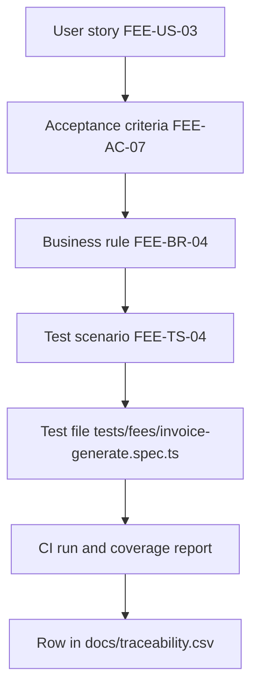
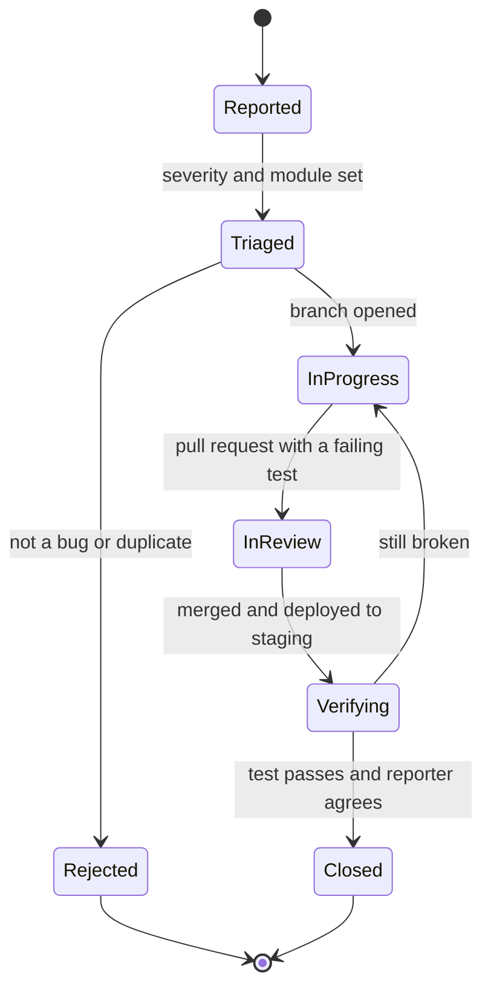

# Testing and Quality Assurance

**In simple words:** This chapter is the quality plan for EduFlow. It says what "good enough to ship" means, who checks what, and which suites must pass before a release ships. The test code lives in the Founder Blueprint. Here we fix the goals, the suites, the environments, the pilot sign-off, the bug rules and the metrics.

| Item | Value |
|---|---|
| QA owner | Mehdi Alam (founder) until the first engineering hire in Year 2 |
| Test code and examples | Blueprint chapter *Testing Strategy for a Solo Founder*, prompts P-49 to P-53 |
| Unit and integration | Vitest with Supertest on a real PostgreSQL 16 test database |
| End to end and load | Playwright (Chromium, WebKit, Android emulation); k6 on staging |
| Under test | 34 modules, 1,250 endpoints, 269 permission keys, 7 system roles |
| Gate | GitHub Actions green; the five mandatory suites never skip |
| First real users | 5 pilot institutes, 18 Nov 2026 (Day 45) to 3 Dec 2026 (Day 60) |
| Bug tracker | GitHub Issues, labels `sev1` to `sev4`, `module:<code>`, `pilot` |

Numeric targets such as p95 latency live in *Non-Functional Requirements*; here we say only how each is proved. Controls live in *Security Architecture*, restore drills in *Audit Logs, Backups and Disaster Recovery*.

> **Founder note:** A solo founder cannot test everything. Automate the five suites that can kill the company, run a short human pass on the rest, and let the pilot institutes find what is left while a fix still costs one day.

## Quality Goals

A goal is real only when it has a number and a way to read that number.

| ID | Goal | How it is measured | Target | Phase |
|---|---|---|---|---|
| QG-01 | No tenant sees another tenant row | Isolation suite, nightly scan | Zero findings, ever | 1 |
| QG-02 | Money is always right | SQL invariants, CI and nightly | Zero violating rows | 1 |
| QG-03 | No permission wider than the registry | Generated RBAC suite | Every endpoint covered | 1 |
| QG-04 | No critical flow breaks silently | Regression pack in CI | All twelve green | 1 |
| QG-05 | A release does not create more work | Change failure rate | Under 15 percent | 1 |
| QG-06 | User-found bugs stay rare | Escaped defects per release | Under 3, none S1 | 2 |
| QG-07 | Works on a cheap Android on 4G | Device matrix each phase | All P1 devices pass | 2 |
| QG-08 | Hindi and English both read well | Localisation pass per release | No untranslated parent screen | 2 |

## Test Levels and Ownership

Five levels. Each answers a different question, so a bug caught at the wrong level costs more.

| Level | Question it answers | Tool | Runs when | Size at Day 60 |
|---|---|---|---|---|
| Unit | Is this calculation correct? | Vitest | On save and in CI | About 260 tests |
| Integration | Does the endpoint behave on a real database? | Vitest, Supertest | Every push | About 420 tests |
| Contract | Does the client call what the API serves? | Zod schemas, OpenAPI diff | Route changes | One per route group |
| End to end | Can a person finish the job in a browser? | Playwright | Pull requests to `main` | 12 flows |
| Exploratory | What did we not think of? | Charters, the pilot | Before a release | 8 charters |

The founder owns every level. Claude Code drafts the files from the module chapter (P-49, P-50), which already lists criteria and scenarios in machine-readable tables. Pilot institutes own user acceptance testing only.

> **Rule:** A pull request touching money, authentication, permissions or the tenant filter must add or change a test. The CI job `guard-tests` fails the build when those paths change and no file under `tests/` changes.

## From User Story to Test Id

Traceability means you can walk from any user story to the test that proves it, and back again.

**Figure: The traceability chain for one requirement**



Every module chapter publishes four numbered tables: stories (`FEE-US-01`), criteria (`FEE-AC-01`), rules (`FEE-BR-01`) and scenarios (`FEE-TS-01`). A test names the scenario ID in its `describe` title. A script reads the chapters and the Vitest report, then writes one row per scenario.

```csv
module,storyId,acceptanceId,ruleId,scenarioId,testFile,level,result
FEE,FEE-US-03,FEE-AC-07,FEE-BR-04,FEE-TS-04,tests/fees/invoice-generate.spec.ts,integration,pass
ATT,ATT-US-01,ATT-AC-02,ATT-BR-03,ATT-TS-01,tests/e2e/attendance-mark.spec.ts,e2e,pass
PAY,PAY-US-05,PAY-AC-11,PAY-BR-09,PAY-TS-06,tests/payments/webhook-idem.spec.ts,integration,pass
```

It answers three questions: which scenarios have no test, which tests belong to no scenario, and which acceptance criteria have no scenario. The last is a documentation bug, fixed in the chapter, not in code.

> **Rule:** A module is not "done" until every `Must` user story in its chapter has a passing scenario row in `docs/traceability.csv`.

## Test Environments

| Environment | Where it runs | Data | Providers | Reset |
|---|---|---|---|---|
| Local | Docker Compose: PostgreSQL 16, Redis 7 | Seed plus factories | All stubbed | Any time |
| Test (CI) | GitHub Actions service containers | Fresh migration per job | Stubbed, no network | Every job |
| Staging | Railway: API, worker, Postgres, Redis | Generated demo tenants | Razorpay test, SES sandbox | Weekly |
| Pilot | Production stack, five real tenants | Real pilot data | Live, with a spend cap | Never |
| Production | Railway in Phase 1, AWS later | Real customer data | Live | Never |

Staging carries two permanent demo tenants from the canon samples: Bright Future Public School (1,200 students, 2 campuses) and Sharma Classes (350 students, 1 centre).

> **Warning:** Never copy production data into staging. If a bug needs a customer row, restore that one tenant into a throwaway database (*Audit Logs, Backups and Disaster Recovery*), debug there, drop it the same day.

## Test Data

Test data is built by code, not by hand-written SQL, so it survives schema changes.

1. A factory per model builds a valid row and lets the test override one field. `makeStudent({ admissionNo: 'BF-2027-0142' })` returns a student with guardian and enrollment.
2. Every factory takes the tenant from an explicit fixture. There is no ambient default, so forgetting the tenant is a type error, not a leak.
3. The base fixture creates two organizations, `orgA` (Bright Future) and `orgB` (Sharma Classes). Every isolation assertion uses this pair.
4. Money fixtures reuse the worked example of the *Fees Module* chapter, so test values equal the values printed in the PRD.
5. Dates are frozen with `vi.setSystemTime(new Date('2027-07-15T04:00:00Z'))` plus a campus timezone, because late fees, due dates and attendance locks read the local calendar day.
6. Fixture personal data is obviously fake: phones start `+9199000`, emails end `@example.test`. Sales demo data (P-58) is a separate seed.

## The Mandatory Suites

Five suites carry the risks that can end EduFlow. They run on every push and a failure blocks the merge, even when it looks unrelated.

| ID | Suite | What it protects | Size at Day 60 | Runtime |
|---|---|---|---|---|
| MS-01 | Tenant isolation | Customer trust, DPDP Act duty | 74 resource groups | 90 seconds |
| MS-02 | RBAC matrix | Permission creep, data exposure | About 1,900 generated cases | 4 minutes |
| MS-03 | Money invariants | Fee and receipt correctness | 9 SQL checks, 60 unit tests | 40 seconds |
| MS-04 | Idempotency | Double charges, double messages | 22 cases | 70 seconds |
| MS-05 | Import robustness | Onboarding day, migration trust | 18 cases, 5 import types | 2 minutes |

### Tenant isolation

For every resource group the suite runs four probes with an `orgB` token against an `orgA` row: read, update, delete and list. The answer is always `404 NOT_FOUND`, never `403`, so a status code cannot reveal that a row exists. Three extra probes catch what route checks miss:

- A nested path such as `GET /students/:id/documents` with an `orgA` parent and an `orgB` child ID.
- A foreign key used as a filter, `GET /fee-invoices?batchId=<orgA batch>` with an `orgB` token: an empty list, not an error, never a row.
- A raw query with a wrong `SET app.current_org`, proving Row-Level Security blocks the row when the Prisma extension is bypassed.

### RBAC matrix generated from the registry

Hand-writing tests for 1,250 endpoints would rot in a week. The suite is generated at run time from the two source-of-truth files: `docs/api/` gives each endpoint a permission key, `docs/permissions.md` gives each key and role a cell word.

```typescript
// tests/rbac/matrix.spec.ts - one case per (endpoint, role) pair.
import { describe, expect, it } from 'vitest';
import { loadRegistry } from './registry'; // parses docs/api/*.md and permissions.md
import { asRole, callEndpoint } from './helpers';

const registry = await loadRegistry();

describe('RBAC matrix', () => {
  for (const ep of registry.endpoints) {             // 1,250 endpoints
    for (const role of registry.roles) {             // SUPER_ADMIN ... STUDENT
      const cell = registry.cell(ep.permission, role); // Yes No Own Campus View
      it(`${ep.id} as ${role} expects ${cell}`, async () => {
        const token = await asRole(role);
        const res = await callEndpoint(ep, token, { scope: 'foreign' });
        if (cell === 'No') expect([403, 404]).toContain(res.status);
        else if (cell === 'View') expect(ep.method === 'GET' ? 200 : 403).toBe(res.status);
        else if (cell === 'Own' || cell === 'Campus') expect(res.status).toBe(404);
        else expect(res.status).toBeLessThan(400);
      });
    }
  }
});
```

Two rules keep it honest. A key in the API registry but missing from the permission registry fails the suite before any case runs. And `Own` and `Campus` cells are probed twice, with an allowed row and a foreign row, because one probe alone lets a broken scope check pass.

### Money invariants

Facts that must hold after any operation sequence. They run as SQL after the finance suites, and nightly on a restored copy of production.

```sql
-- Money invariants. Any row returned is a bug. Formulas match the schema comments.

-- MI-01 the invoice balance must equal its formula
SELECT id FROM fee_invoices
WHERE balance <> total - scholarship_credit - amount_paid - written_off_amount;

-- MI-02 the invoice total must equal its own parts
SELECT id FROM fee_invoices
WHERE total <> subtotal - discount_total + tax_total + late_fee + adjustment_total;

-- MI-03 live allocations of a payment can never exceed the payment
SELECT p.id FROM payments p
JOIN payment_allocations a ON a.payment_id = p.id AND a.reversed_at IS NULL
GROUP BY p.id, p.amount HAVING SUM(a.amount) > p.amount;

-- MI-04 amount_paid must equal live allocations minus what was refunded
SELECT i.id FROM fee_invoices i
LEFT JOIN payment_allocations a ON a.invoice_id = i.id AND a.reversed_at IS NULL
GROUP BY i.id, i.amount_paid
HAVING i.amount_paid <> COALESCE(SUM(a.amount - a.amount_refunded), 0);

-- MI-05 nobody may owe a negative amount
SELECT id FROM fee_invoices WHERE balance < 0;

-- MI-06 a live receipt must show exactly what the payment took
SELECT r.id FROM receipts r JOIN payments p ON p.id = r.payment_id
WHERE r.status = 'ISSUED' AND r.amount <> p.amount;

-- MI-07 every money row carries the organization currency
SELECT i.id FROM fee_invoices i JOIN organizations o ON o.id = i.organization_id
WHERE i.currency <> o.currency;

-- MI-08 an allocation may never cross the tenant boundary
SELECT a.id FROM payment_allocations a JOIN fee_invoices i ON i.id = a.invoice_id
WHERE i.organization_id <> a.organization_id;

-- MI-09 a cancelled payment must leave no live allocation behind
SELECT a.id FROM payment_allocations a JOIN payments p ON p.id = a.payment_id
WHERE p.status = 'CANCELLED' AND a.reversed_at IS NULL;
```

Sixty unit tests sit above the SQL: instalment splitting, proration, percentage and fixed discounts, the CGST and SGST split against IGST, late fee with grace and cap, line-level rounding, and oldest-invoice-first allocation.

> **Warning:** Never assert money with JavaScript numbers. `0.1 + 0.2` is not `0.3`. Compare fixed-point strings, for example `expect(invoice.balance.toFixed(2)).toBe('12000.00')`.

### Idempotency

| ID | Case | Action | Expected result |
|---|---|---|---|
| ID-01 | Double click | PAY-API-02 twice, one `Idempotency-Key` | One payment, one receipt, first response replayed |
| ID-02 | Same key, new body | PAY-API-02 with a changed amount | `409 CONFLICT`, nothing written |
| ID-03 | Razorpay repeat | PAY-API-38, same `event_id` five times | One `webhook_events` row, one capture |
| ID-04 | Out of order | `payment.captured` after `payment.failed` | Captured wins, both stored, one receipt |
| ID-05 | Bad signature | PAY-API-38, tampered body | `401`, `signatureValid` false, no payment touched |
| ID-06 | Worker retry | Kill the worker after the PDF write | Retry finds the file, no rebuild, no resend |
| ID-07 | Reminder twice | FEE-API-39 twice for one due date | One reminder log per invoice, one credit |
| ID-08 | Attendance resubmit | ATT-API-02 twice, same batch, date, `slotKey` | Same session, record count unchanged |

### Import robustness

Imports are the first thing a new customer touches. Every `ImportType` faces these eight abuses, dry run and real.

| Abuse | Expected behaviour |
|---|---|
| Wrong column order, extra columns | Mapping matches by header name, extras ignored |
| 5,000 rows, row 3,000 broken | 4,999 imported, `COMPLETED_WITH_ERRORS`, one row-error record |
| Duplicate admission numbers in the file | Both rows rejected with a reason, no half-built student |
| Duplicate against existing data | Skipped or updated by `updateExisting`, never doubled |
| `05/08/2027`, `2027-08-05`, an Excel serial | All read as 5 Aug 2027 using the declared `dateFormat` |
| Phone with spaces, `+91`, a leading zero | Normalised to one form, invalid numbers fail |
| A formula cell, a cell starting with `=` | Read as text, never evaluated, never exported |
| Upload cancelled mid-way | `CANCELLED`, dry run wrote nothing, real run commits per 200 |

The dry run must produce the real run's error list, row by row.

## The Regression Pack

Twelve flows must work in every release, as Playwright tests against a freshly seeded staging database.

| ID | Flow | Role | Key endpoints | Proof at the end |
|---|---|---|---|---|
| RG-01 | Sign in, refresh, sign out | All | AUTH group | Session gone, token family revoked |
| RG-02 | Lead to admitted student | Front desk | ADM-API-02, 08, 18, 22, 27 | Student with number and enrollment |
| RG-03 | Assign fees, issue invoice | Accountant | FEE-API-18, 37, 28 | Issued invoice, gap-free number |
| RG-04 | Collect cash, print receipt | Accountant | PAY-API-02, 09 | Receipt PDF, balance zero |
| RG-05 | Parent pays online | Parent | PAY-API-13, 38, 14 | Captured once, receipt sent |
| RG-06 | Attendance on a phone | Teacher | ATT-API-08, 02, 07 | Session saved, alerts queued |
| RG-07 | Absent alert reaches a parent | System | NTF and WA groups | One message log, one credit |
| RG-08 | Portal dues and receipts | Parent | STU-API-46, ATT-API-27 | Own children only |
| RG-09 | Day close and day book | Accountant | PAY-API-34, 36, 44 | Counted cash equals system total |
| RG-10 | Import 500 students | Org Admin | STU-API-41 | 500 students, error file on failures |
| RG-11 | Marks to report card PDF | Teacher, Principal | EXM and RPT groups | Locked marks, correct grade, PDF |
| RG-12 | Create and use a custom role | Org Admin | USR and roles group | User sees only granted screens |

> **Rule:** A red regression flow is never fixed by editing the test. Either the code changes, or the module chapter changes first.

## Exploratory Testing Charters

A charter is a timed hunt with a written mission. Eight run before each release, rotating so every module group is visited each phase. Notes go into one issue per charter.

| ID | Mission | Modules | Timebox | Capture |
|---|---|---|---|---|
| EX-01 | Break fee arithmetic with odd discounts | FEE, PAY, DSC | 45 min | Every amount that surprised you |
| EX-02 | Work as a teacher with no network | ATT, HW, TT | 30 min | What is lost, what retries |
| EX-03 | Enter garbage into every admission field | ADM, STU | 30 min | Messages a parent cannot understand |
| EX-04 | Switch campus and year in every screen | CAMP, BAT, SET | 30 min | Screens that keep the old scope |
| EX-05 | Read the portal as a parent of three | PP, FEE, ATT | 30 min | Wrong child, wrong total, no receipt |
| EX-06 | Change a role while a user is signed in | USR, SET | 30 min | Stale permissions in the browser |
| EX-07 | Hit every export and PDF with 5,000 rows | ANL, RPT, FEE | 45 min | Timeouts, blank pages, broken columns |
| EX-08 | Keyboard and screen reader only | Phase 1 screens | 45 min | Traps, unlabelled controls, lost focus |

## Browser and Device Matrix

P1 must pass before any release, P2 once per phase. Anything older shows a polite upgrade message.

| Priority | Browser or device | Version | Why it matters | Checked |
|---|---|---|---|---|
| P1 | Chrome on Windows | Latest two | Admin and accountant work | Every release |
| P1 | Chrome on Android | Latest two | Teachers and parents | Every release |
| P1 | Safari on iPhone | iOS 17 and newer | Parents on iPhone | Every release |
| P1 | Android phone, 4 GB, 4G | Android 11 | The real teacher device | Every release |
| P2 | Edge on Windows | Latest | School computer labs | Each phase |
| P2 | Safari on macOS | Latest two | Founder, some directors | Each phase |
| P2 | Firefox on Windows | Latest | Small share | Each phase |
| P2 | Tablet, 10 inch | Any P1 browser | Front desk kiosks | Each phase |

Playwright runs at 360, 390, 768, 1280 and 1920 pixels. The 360 width breaks tables, so the card fallback in *Design System and UX Guidelines* is verified there every release. Receipts are print-tested each phase on an 80 mm thermal printer and on A4.

## Performance and Load Testing

Load tests run on staging with the demo tenants scaled to 5,000 students. Each scenario asks: does the system still meet the targets in *Non-Functional Requirements* when everyone arrives at once?

| ID | Scenario | Shape | Pass mark | When |
|---|---|---|---|---|
| LT-01 | Morning attendance peak | 200 teachers submit in 10 minutes, 40 students each | p95 under 800 ms, zero errors | Every phase release |
| LT-02 | Fee due-date peak | 500 parents open dues, 120 pay, in 15 minutes | p95 under 1.2 s, no duplicate order | Before launch, then quarterly |
| LT-03 | Bulk report cards | 1,200 PDFs queued at once | Under 20 minutes, no job lost | Before Phase 2 |
| LT-04 | Result publish rush | 900 parents open the portal in 5 minutes | p95 under 1.5 s, 80 percent cache hits | Before Phase 2 |
| LT-05 | Invoice generation | 5,000 invoices issued in one job | Under 6 minutes, numbering gap free | Before Phase 1 launch |
| LT-06 | Soak | 40 virtual users for 2 hours | No memory growth, no connection leak | Before each deploy |

Every run records p50, p95 and p99 latency, error rate, database connections, queries above 200 ms, Redis memory and queue depth. A run that meets latency but grows queue depth is a failure: the backlog reaches a parent as a late message.

## Security Testing

*Security Architecture* names the controls. This is the calendar that proves them.

| ID | Activity | Tool | Cadence | Pass mark |
|---|---|---|---|---|
| ST-01 | Authorization fuzzing | Script over the endpoint registry | Every push | No `200` where the matrix says `No` |
| ST-02 | Object reference fuzzing | Each ID with a foreign token | Every push | Always `404`, never a stack trace |
| ST-03 | Dependency scan | `npm audit`, Dependabot | Daily | No High open over 7 days |
| ST-04 | Secret scan | gitleaks in CI | Every push | Zero findings |
| ST-05 | Static analysis | CodeQL | Weekly, on `main` | No new High alert |
| ST-06 | Dynamic scan | OWASP ZAP baseline on staging | Weekly | No Medium or higher unreviewed |
| ST-07 | Header and TLS | ZAP plus an SSL report | Each release | Grade A, eleven headers |
| ST-08 | Upload abuse | Oversized file, bad magic bytes, SVG script | Each phase | Rejected and quarantined |
| ST-09 | Rate-limit proof | k6 burst above the limits | Each phase | `429 RATE_LIMITED` with `Retry-After` |
| ST-10 | Penetration test | Third-party vendor | Before UAE, then yearly | No High open at go-live |

> **Rule:** A Critical or High security finding stops the release. It is treated as severity S1 whatever module it sits in.

## Accessibility Testing

The target is WCAG 2.2 level AA on every Phase 1 screen.

| Pass | How | When | Pass mark |
|---|---|---|---|
| Automated | `axe-core` inside the regression pack | Every release | Zero serious or critical violations |
| Keyboard | Tab through each screen with no mouse | Each phase | Every action reachable, focus visible |
| Screen reader | NVDA on Windows, VoiceOver on iPhone | Each phase | Labels, headers and errors announced |

Contrast is checked on each design change against the tokens in *Design System and UX Guidelines*. Attendance colours also carry a shape or letter, because dots alone fail a colour-blind teacher.

## Localisation Testing

*Internationalization and Localization* defines the country pack. Four checks per release prove it, run in `hi-IN` and one non-Indian pack.

1. No untranslated key on Parent Portal, Student Portal, receipts and templates. A missing key logs a warning and the test fails on any warning.
2. Money formats correctly: `₹12,34,567.00` in `hi-IN`, `$12,345.00` in `en-US`, never by string surgery.
3. Dates show in the campus timezone. A fee due at 23:30 India time must not appear as the previous day for a Dubai campus.
4. Long Hindi and German strings do not break buttons, table headers or the receipt PDF.

## User Acceptance Testing with the Pilot Institutes

Five friendly institutes run EduFlow on real data from Day 45. UAT is not a demo: each institute gets a script, works through it alone, and signs a form.

**Entry criteria.** Regression flows green on staging; no open S1 or S2; the tenant seeded with the real student list; a quick guide handed over; a WhatsApp support group open.

**Exit criteria.** Every journey Pass; zero open S1; at most two open S2 with an agreed fix date; the owner signs; the institute says it will keep using EduFlow.

| ID | Journey in the script | Who does it | Expected time |
|---|---|---|---|
| UAT-01 | Add a walk-in inquiry, convert it to a student | Front desk | 6 minutes |
| UAT-02 | Assign a fee structure, issue the first invoice | Accountant | 5 minutes |
| UAT-03 | Collect cash, hand a printed receipt to a parent | Accountant | 45 seconds |
| UAT-04 | Send a pay link, let a parent pay by UPI | Accountant, parent | 4 minutes |
| UAT-05 | Mark attendance for one batch on a phone | Teacher | 30 seconds |
| UAT-06 | Check that absentee parents got the alert | Principal | 3 minutes |
| UAT-07 | Find dues and receipts in the Parent Portal | Parent | 3 minutes |
| UAT-08 | Close the day, match cash with the day book | Accountant | 5 minutes |

**Form UAT-SO-01 - pilot sign-off (one printed page)**

```text
+----------------------------------------------------------------------+
| EduFlow Pilot UAT Sign-off        Form UAT-SO-01        Version 1.0  |
+----------------------------------------------------------------------+
| Institute : Sharma Classes, Patna         Campus : Main Centre       |
| Signed by : Rajesh Sharma (Owner)         Date   : 30 Nov 2026       |
| Build     : v0.9.4-rc2                    Window : 18 - 29 Nov 2026  |
+----------------------------------------------------------------------+
| Journey                              Result   Bugs found  Initials   |
| UAT-01 Inquiry to admitted student   [Pass]        0         RS      |
| UAT-02 Fee structure and invoice     [Pass]        1         RS      |
| UAT-03 Cash receipt at the counter   [Pass]        0         RS      |
| UAT-04 Online payment by a parent    [Fail]        1         RS      |
| UAT-05 Attendance on a phone         [Pass]        0         RS      |
| UAT-06 Absent alert on WhatsApp      [Pass]        0         RS      |
| UAT-07 Parent Portal dues, receipts  [Pass]        0         RS      |
| UAT-08 Day close and day book        [Pass]        0         RS      |
+----------------------------------------------------------------------+
| Open S1 count : 0        Open S2 count : 1     Exit criteria : No    |
| Comment : UPI callback took 40 s once. Retest after fix BUG-118.     |
| Will you keep using EduFlow after the pilot?   (o) Yes   ( ) No      |
+----------------------------------------------------------------------+
| Owner signature ______________   EduFlow witness ___________________ |
+----------------------------------------------------------------------+
```

The institute fills the form, not EduFlow, and a `Fail` row must name a bug ID. The last question is the real gate: "No" means the pilot failed even when every journey passed.

## Bug Severity, Priority and Service Levels

Severity is how bad the bug is. Priority is when we fix it. They are set separately, because a small bug on the demo screen can be urgent.

| Severity | Meaning | Example | Respond in | Fix in |
|---|---|---|---|---|
| S1 Critical | Data leak, money wrong, nobody can log in | Another tenant invoice is visible | 15 minutes | 4 hours, hotfix |
| S2 High | A core journey is blocked, no workaround | Receipt PDF fails for all cash payments | 2 hours | 1 working day |
| S3 Medium | Works, but the workaround hurts | An export misses one column | 1 working day | Next release |
| S4 Low | Cosmetic or rare | A tooltip is cut off on a tablet | 3 working days | When convenient |

Priority words are `P0` (drop everything), `P1` (this sprint), `P2` (next release) and `P3` (backlog). The default map is S1 to P0 down to S4 to P3. The founder may raise a priority but never lower a severity. In the pilot window every pilot bug rises one level.

## Defect Workflow

**Figure: The life of a bug**



A bug report carries seven fields: title, severity, module code, environment, steps, expected against actual, and the `requestId` from the error envelope, which is the fastest path from a screenshot to the exact log line. A bug reaches `InProgress` only after a failing test exists.

## Release Quality Gates

A gate must be all green before a version ships. Gates grow with the phase, because the cost of a mistake grows with the customer count.

| Gate | Phase 1 (MVP) | Phase 2 (V1.0) | Phase 3 and 4 |
|---|---|---|---|
| Suites MS-01 to MS-05 | Pass | Pass | Pass |
| Regression pack | 12 flows pass | 12 plus new module flows | All flows pass |
| Coverage | 70 percent finance and auth | 70 percent overall | 80 percent overall |
| Security ST-01 to ST-06 | No High open | No High open | No Medium open |
| Accessibility | Automated pass | Automated plus keyboard | All three passes |
| Load | LT-01, LT-05 pass | LT-02, LT-03, LT-04 pass | LT-01 to LT-06 pass |
| Migration | Applies and rolls back on a copy | Plus a timed dry run | Plus zero downtime |
| Checklist and release note | Done | Done | Done, with customer note |

> **Best practice:** Deploy on a Tuesday or Wednesday morning, never on a Friday and never on a fee due date.

## Quality Metrics

Six numbers are reviewed every Monday.

| Metric | Formula | Target Year 1 | Source |
|---|---|---|---|
| Escaped defects | Bugs reported by users per release | Under 3, none S1 | Issue label `escaped` |
| Change failure rate | Releases needing a hotfix over releases | Under 15 percent | Release log |
| Mean time to restore | Hours from S1 report to production fix | Under 4 hours | Issue timestamps |
| Deployment frequency | Production deploys per week | 3 or more | GitHub Actions |
| Suite health | CI failures caused by flaky tests | Under 2 percent | CI history |
| Risk-area coverage | Lines covered in fees, payments, auth, tenancy | 80 percent or more | Vitest coverage |

A flaky test is quarantined for at most 48 hours, then fixed or deleted. A suite people ignore is worse than no suite.

## Sample Test Case: Admission to First Fee Receipt

One journey, written the way every EduFlow test case is written. Tenant Bright Future Public School, clock frozen at 15 Jul 2027.

| ID | Step | Action and endpoint | Expected result |
|---|---|---|---|
| TC-J1-01 | Lead arrives | Front desk posts ADM-API-02, Class 10 | `201`, `inquiryNo` issued, stage `NEW` |
| TC-J1-02 | Duplicate check | Post the same phone again | `201` with a duplicate warning, no merge |
| TC-J1-03 | Convert to application | ADM-API-08 | `DRAFT`, stage `APPLICATION_STARTED` |
| TC-J1-04 | Submit with consent | ADM-API-18 | `SUBMITTED`, one guardian consent row |
| TC-J1-05 | Wrong role approves | Teacher token on ADM-API-22 | `403 FORBIDDEN`, audit row, outcome denied |
| TC-J1-06 | Principal approves | ADM-API-22 | `APPROVED`, decision remarks stored |
| TC-J1-07 | Enroll | ADM-API-27 | `BF-2027-0142`, guardian Sunita Devi, batch 10-A |
| TC-J1-08 | Plan limit | Repeat on a full Starter tenant | `403 PLAN_LIMIT_REACHED`, no half-built student |
| TC-J1-09 | Assign fees | FEE-API-18, start 15 Jul 2027 | Assignment `ACTIVE`, Quarter 1 prorated |
| TC-J1-10 | Generate and issue | FEE-API-37 then FEE-API-28 | `ISSUED`, total ₹15,500, balance ₹15,500 |
| TC-J1-11 | Part payment | PAY-API-02, ₹12,000 cash, key set | `SUCCESS`, balance ₹3,500, receipt issued |
| TC-J1-12 | Double click | Repeat TC-J1-11, same key | Same payment ID, still one receipt |
| TC-J1-13 | Receipt PDF | PAY-API-09 | Logo, receipt number, ₹12,000 in words |
| TC-J1-14 | Parent view | Parent token, STU-API-46 and FEE-API-42 | Own child only, balance ₹3,500, receipt |
| TC-J1-15 | Isolation | Sharma Classes token, same invoice ID | `404 NOT_FOUND` |
| TC-J1-16 | Invariants | Run MI-01 to MI-09 | Zero rows returned |

## Requirements

| ID | Requirement | Priority | Phase |
|---|---|---|---|
| QA-01 | Suites MS-01 to MS-05 run on every push, never skipped | Must | 1 |
| QA-02 | Cross-tenant access answers `404`, per resource group | Must | 1 |
| QA-03 | The RBAC suite is generated from the two registries | Must | 1 |
| QA-04 | MI-01 to MI-09 return zero rows, CI and nightly | Must | 1 |
| QA-05 | ID-01 to ID-08 pass before any payment release | Must | 1 |
| QA-06 | The twelve regression flows pass before a merge | Must | 1 |
| QA-07 | Coverage on fees, payments, auth, tenancy is 70 percent | Must | 1 |
| QA-08 | Every release passes its phase gate list | Must | 1 |
| QA-09 | The five pilots sign Form UAT-SO-01 before launch | Must | 1 |
| QA-10 | A penetration test is clear of High before UAE entry | Should | 3 |
