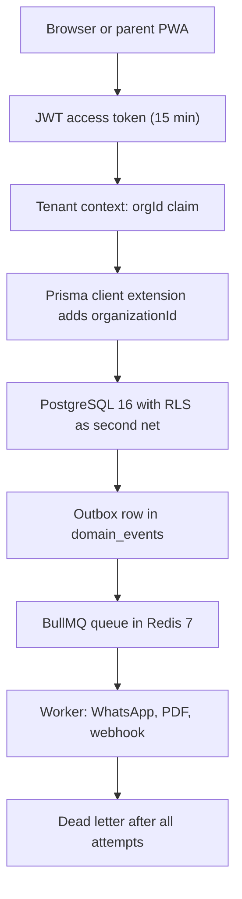

# Glossary

**In simple words:** This appendix explains every product, domain and technical word used in this PRD, in plain English. Each row gives the word, its meaning in one line, and where you meet it: a chapter, a table or an ID. Business words are not repeated here; this is the engineering companion to the *Glossary* of the BRD.

## How to Use This Glossary

- Terms are alphabetical, in nine letter groups. A word in `code style` is an exact name: a table, an enum, a permission key or an error code.
- The "Where" column names a chapter, a table, or an ID such as `FEE-API-01`.
- Sizes quoted here are the real counts of this PRD: 189 models, 186 enums, 1,250 endpoints, 269 permission keys, 260 notification rules, 138 wireframed screens.

> **Rule:** If a chapter and this glossary disagree, fix the glossary. The canon always wins.

**Figure: The technical words on one request path**

Read it as one sentence. The token says who you are and which tenant you belong to. The ORM and the database both hold that line. Slow work leaves through an outbox row and a queue; what never succeeds ends in the dead letter.

## A to B

| Term | Meaning in simple words | Where it appears |
|---|---|---|
| Academic year | The session an institute runs, such as 2027-28. Exactly one is current. | `academic_years`; *Batch Module* |
| Access token | Short JWT, 15 minutes, sent as `Authorization: Bearer`. Never stored in a cookie. | *Authentication and Sessions* |
| Adjustment | A change on an issued invoice: waiver, write-off or correction. Keeps history. | `fee_invoice_adjustments` |
| Admission number | The student's permanent number, unique inside one tenant, like `BF-2027-0142`. | `students`; *Student Admission Module* |
| Allocation | The split of one payment across invoices and heads. | `payment_allocations`, `payment_allocation_items` |
| Audit log | Append-only record of who changed what, with old and new values. | `audit_logs` |
| Backoff | The growing wait between job retries, for example 30 s, 60 s, 120 s. | *Background Jobs and Events* |
| Batch | The teaching group: Section 10-A in a school, Morning Batch M1 in coaching. | `batches`; *Batch Module* |
| BullMQ | The Redis job library that runs the twelve worker queues. | *System Architecture* |
| Business rule violation | HTTP 422. The request is well formed, but a domain rule says no. | `BUSINESS_RULE_VIOLATION`; *Error Codes* |

## C to D

| Term | Meaning in simple words | Where it appears |
|---|---|---|
| Campus | A branch or centre of one organization. Most operational rows carry `campus_id`. | `campuses`; *Multi Campus Module* |
| Campus scoping | Showing a user only their assigned campuses, picked with `X-Campus-Id`. | `user_campuses` |
| Chargeback | The card holder's bank pulls a settled payment back. It lowers the payout. | *Payments Module* |
| Consent record | Signed proof that a parent agreed to a named policy version, for DPDP. | `consent_records`; *Privacy and Compliance* |
| Course | The grade or program: Class 10 in a school, JEE Main 2028 in coaching. | `courses`; *Batch Module* |
| Credit wallet | Prepaid balance for WhatsApp and SMS. Every send debits it. | `message_credit_wallets`, `credit_transactions` |
| Custom field | An extra field a tenant adds to students or staff without a code change. | `custom_field_definitions`, `custom_field_values` |
| Custom role | A role an organization builds by picking permission keys, like Librarian. | `roles`; *RBAC and Permissions Matrix* |
| Datesheet | The exam timetable: which subject, which date, which room, which time. | `exam_schedules`; *Exams Module* |
| Day close | The accountant's end-of-day cash count, deposit note and lock of the counter. | `day_closes`; screen `PAY-S09` |
| Dead letter | A job parked after all attempts failed, kept for 14 to 30 days for replay. | *Background Jobs and Events* |
| Discount | A fixed or percentage cut on fees, such as a sibling or staff-child discount. | `discounts`, `student_discounts` |
| DLT | India's SMS template registry. A text must be approved there before sending. | `sms_dlt_templates`; *SMS Module* |
| Domain event | One fact row written inside the business transaction, then relayed. | `domain_events` |

## E to F

| Term | Meaning in simple words | Where it appears |
|---|---|---|
| Enrollment | A student joined to one batch for one academic year. | `enrollments` |
| Enum | A fixed list of allowed values, written UPPER_SNAKE_CASE. | 186 enums in `_schema/` |
| Envelope | The same reply shape every time: `success`, then `data` or `error`. | *API Standards and Conventions* |
| ETag and If-Match | A row version sent back, so two editors cannot overwrite each other. | `CONFLICT`; *API Standards and Conventions* |
| Export job | A background build of an Excel, CSV or PDF file with an expiring link. | `export_jobs` |
| Family | Siblings and guardians grouped, so one sibling discount covers both. | `families` |
| Fee assignment | One student's copy of a fee structure, with their own installments. | `student_fee_assignments` |
| Fee head | One chargeable item: Tuition, Transport, Exam, Hostel. | `fee_heads`; enum `FeeHeadType` |
| Fee structure | The priced set of heads for a course and year, with due dates. | `fee_structures`, `fee_structure_items` |

## G to I

| Term | Meaning in simple words | Where it appears |
|---|---|---|
| Grade band | One row of a scale: A1 means 91 to 100 marks. | `grade_bands` |
| Grade scale | The rule that turns marks into a grade letter and points. | `grade_scales`; *Report Cards Module* |
| Guardian | The parent or legal contact linked to a student. | `guardians`, `student_guardians` |
| Hash chain | Each audit row carries the hash of the row before it. | `audit_logs` |
| Idempotency-Key | A header that makes a retried payment POST charge only once. | *Payments Module* |
| Impersonation | A Super Admin entering a tenant to help, always logged. | *Security Architecture* |
| Import job | A bulk Excel or CSV load; rejected rows are kept separately. | `import_jobs`, `import_job_row_errors` |
| Installment | One dated part of a student's fees, for example Quarter 2. | `fee_installments`, `student_fee_installments` |
| Invitation | A one-time link that lets a person create their login. | `invitations` |
| Invoice | A bill raised to a student. A subscription invoice is a different thing. | `fee_invoices` |

## J to M

| Term | Meaning in simple words | Where it appears |
|---|---|---|
| JWT | A signed token carrying `userId`, `orgId`, roles and campuses. | *Authentication and Sessions* |
| Late fee | The penalty added after a due date: per day, per week or flat. | `late_fee_rules`; enum `LateFeeCalculation` |
| Meta | The page block on lists: `page`, `limit`, `total`, `totalPages`. | *API Standards and Conventions* |
| MFA | A second login step for admins, by code or app. | enum `MfaMethod` |
| Migration | The versioned SQL file that changes the database shape. | *Database Design Overview* |
| Module code | The three or four letter code of a module, such as `FEE`. | canon; enum `ModuleCode` |
| Multi-tenancy | One database serving many organizations, split by `organization_id`. | *Multi-Tenancy and Data Isolation* |

## N to P

| Term | Meaning in simple words | Where it appears |
|---|---|---|
| Notification | One message to one person on one channel. | `notifications`; *Notifications Module* |
| Number sequence | A gap-free counter for receipt, invoice and admission numbers. | `number_sequences` |
| Organization | The tenant row itself: name, type, country, timezone, plan. | `organizations`; *Organizations Module* |
| OTP | A six-digit one-time code, used for parent and student login. | `otp_codes` |
| Outbox | The event table written inside the business transaction, then relayed. | `domain_events` |
| Payment | Money actually received: cash, UPI, card, cheque or gateway. | `payments`; enum `PaymentMethod` |
| Payment order | The gateway order created before a parent pays online. | `payment_orders` |
| Payout | The bank transfer a gateway makes for a batch of payments. | `settlements` |
| Permission | One key in `module.action` form, such as `fees.collect`. | `permissions`; 269 keys |
| Plan gating | Locking a module or a limit to a plan, refused with 403. | `plan_features`; `PLAN_LIMIT_REACHED` |
| Pre-signed URL | A short-lived private link to one S3 file; the bucket stays closed. | `file_assets` |
| Prisma extension | Code that adds `organizationId` to every query automatically. | *Multi-Tenancy and Data Isolation* |
| PWA | An installable web app. Parents get it without any app store. | *Parent Portal Module* |

## Q to R

| Term | Meaning in simple words | Where it appears |
|---|---|---|
| Queue | A named job list in Redis. EduFlow runs twelve of them. | *Background Jobs and Events* |
| Rate limit | 100 requests a minute per user, 1,000 per organization. | `RATE_LIMITED` |
| RBAC | Role-based access control: rights come from roles, not from people. | *RBAC and Permissions Matrix* |
| Reconciliation | Matching a gateway payout, rupee by rupee, to EduFlow payments. | `settlements`; rule `PAY-BR-22` |
| Receipt | Numbered proof of one payment, printed or sent as a PDF. | `receipts` |
| Refresh token | A 30-day httpOnly cookie token, stored only as a hash. | `refresh_tokens` |
| Token rotation | Each refresh issues a new token; reuse kills the whole family. | enum `TokenRevokeReason` |
| Refund | Money returned, linked back to the invoices it came from. | `refunds`, `refund_allocations` |
| Report card | The term result document of one student, built from marks. | `report_cards` |
| Request ID | The `req_...` value on every reply; support asks for it first. | *Error Codes* |
| RLS | PostgreSQL row-level security, the second net after the ORM filter. | *Multi-Tenancy and Data Isolation* |
| Role | A named bundle of permissions. Seven are fixed; more can be built. | `roles` |

## S to T

| Term | Meaning in simple words | Where it appears |
|---|---|---|
| Scholarship | Funded fee support with an application, an award and payouts. | `scholarships`; *Scholarships Module* |
| Scope | How far a permission reaches: `ALL`, `CAMPUS`, `OWN` or `VIEW`. | enum `PermissionScope` |
| Settlement | One payout batch, with gross, gateway fee, tax and net amount. | `settlements` |
| Snapshot | Numbers counted once at night, so dashboards open fast. | `daily_metric_snapshots` |
| Soft delete | Setting `deletedAt` instead of removing the row; history survives. | canon database conventions |
| Sub-code | The precise reason inside an error, like `INVOICE_ALREADY_PAID`. | *Error Codes* |
| Subscription | The tenant's own plan with EduFlow, billed monthly or yearly. | `subscriptions` |
| Substitution | A stand-in teacher for one period when someone is absent. | `substitutions` |
| Template | Reusable message text with `{{variables}}`, approved before sending. | `notification_templates` |
| Tenant | One organization and all its data; the hard boundary of the product. | `organizations` |
| Tenant context | The `orgId` read from the token and set for the whole request. | *Multi-Tenancy and Data Isolation* |
| Term | A part of an academic year: Term 1, Quarter 2, Semester 1. | `terms` |
| Timestamptz | A UTC timestamp column, shown in the tenant's own timezone. | canon database conventions |

## U to Z

| Term | Meaning in simple words | Where it appears |
|---|---|---|
| UUID | The 36-character random id used as primary key on every table. | canon database conventions |
| Validation error | HTTP 400 with a `details` list naming each bad field. | `VALIDATION_ERROR` |
| WABA | WhatsApp Business Account: the Meta account that sends messages. | `whats_app_accounts`; *WhatsApp Module* |
| Webhook | A POST from a gateway or Meta; signature checked, then queued. | `webhook_events` |
| Write-off | An amount the institute accepts it will never collect. | `fee_invoice_adjustments` |
| Zod | The library that validates a request body before the service sees it. | *API Standards and Conventions* |

## Abbreviations

| Short form | Full form | Meaning in four words |
|---|---|---|
| API | Application Programming Interface | How two programs talk |
| BRD | Business Requirements Document | The business case document |
| CI/CD | Continuous Integration and Delivery | Automatic build, test, deploy |
| COPPA | Children's Online Privacy Protection Act | US rule, under thirteen |
| DLT | Distributed Ledger Technology | India's SMS template registry |
| DPDP | Digital Personal Data Protection Act | India's privacy law, 2023 |
| FERPA | Family Educational Rights and Privacy Act | US student-record law |
| GST | Goods and Services Tax | India's tax, 18 percent |
| JSON | JavaScript Object Notation | The API data format |
| JWT | JSON Web Token | Signed token, fifteen minutes |
| MFA | Multi-Factor Authentication | Second step at login |
| MVP | Minimum Viable Product | The sixteen Phase 1 modules |
| ORM | Object Relational Mapper | Prisma 6, not raw SQL |
| OTP | One-Time Password | Six-digit code, ten minutes |
| PCI DSS | Payment Card Industry Data Security Standard | Card rules, gateway's job |
| PDPL | Personal Data Protection Law | The UAE privacy law |
| PII | Personally Identifiable Information | Data naming a real person |
| PRD | Product Requirements Document | This document |
| PWA | Progressive Web App | Installable web app, offline-friendly |
| RBAC | Role-Based Access Control | Rights come through roles |
| RLS | Row-Level Security | PostgreSQL tenant guard |
| RPO | Recovery Point Objective | Data loss we accept |
| RTO | Recovery Time Objective | Time to come back |
| S3 | Simple Storage Service | AWS private file storage |
| SaaS | Software as a Service | Software rented every month |
| SES | Simple Email Service | Amazon's email sender |
| SLA | Service Level Agreement | Promised uptime and response |
| SSO | Single Sign-On | One company login, Enterprise |
| TLS | Transport Layer Security | Encryption on every connection |
| UPI | Unified Payments Interface | India's instant payment rail |
| UTC | Coordinated Universal Time | Timezone every timestamp uses |
| UUID | Universally Unique Identifier | The random primary key |
| WABA | WhatsApp Business Account | The Meta sending account |
| WCAG | Web Content Accessibility Guidelines | Accessibility standard, level AA |

> **Note:** Ninety-four terms and thirty-four short forms are listed here. Add a new word to this appendix in the same edit that puts it into a chapter.
