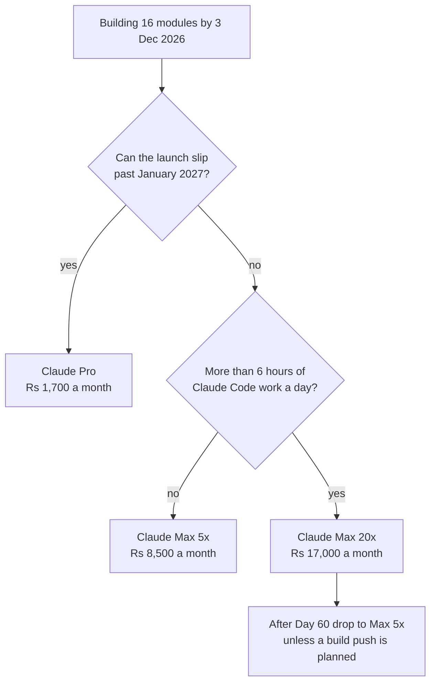

# The Build Sprint: Day 1 to Day 60

**In simple words:** This chapter budgets the money that leaves your bank account while you build EduFlow, from Day 1 (Monday 5 October 2026) to Day 60 (Thursday 3 December 2026). These are running costs only: subscriptions and cloud bills that repeat every month. One-time company costs sit in *Before Day 1: One-Time Setup Costs*. At the Recommended level the 60-day build costs **Rs 46,500**, and the biggest line by far is the Claude subscription.

## What this chapter budgets

| Item | Value |
|---|---|
| Sprint window | 5 Oct 2026 (Day 1) to 3 Dec 2026 (Day 60) |
| Calendar weeks | 9 (Week 9 is a short 4-day week) |
| What gets built | The 16 Phase 1 modules of the MVP |
| Pilot starts | Day 45, 18 Nov 2026, 5 friendly institutes, free |
| People on payroll | Zero. The founder takes no pay until April 2027 |
| Not in this budget | Company setup, trademark, legal papers, laptop |

The three levels used in this guide are **Minimum** (free tiers only, pay what is unavoidable), **Recommended** (the BRD plan) and **Maximum** (the sensible upper end; above it is waste).

## The sprint bill in one table

| Level | October | November | Starts 1 Dec | Sprint total |
|---|---|---|---|---|
| Minimum | Rs 2,185 | Rs 4,440 | Rs 0 | Rs 6,625 |
| Recommended (BRD) | Rs 21,500 | Rs 22,500 | Rs 2,500 | Rs 46,500 |
| Maximum | Rs 39,373 | Rs 39,373 | Rs 300 | Rs 79,046 |

The Recommended column is the BRD plan, line for line: October = tools Rs 17,500 + hosting Rs 4,000; November = tools Rs 17,500 + hosting Rs 5,000. The last column holds the two subscriptions that switch on inside Day 58: Sentry Team Rs 2,200 and the shared support inbox Rs 300.

```text
+--------------------------------------------------------------------+
| SPRINT RUNNING COST, RECOMMENDED LEVEL (5 Oct - 3 Dec 2026)        |
+--------------------------------------------------------------------+
| October bill     Tools Rs 17,500 + Hosting Rs 4,000  = Rs 21,500   |
| November bill    Tools Rs 17,500 + Hosting Rs 5,000  = Rs 22,500   |
| Starts 1 Dec     Sentry Rs 2,200 + Inbox Rs 300      = Rs  2,500   |
|--------------------------------------------------------------------|
| SPRINT TOTAL                                           Rs 46,500   |
|                                                                    |
| Founder capital paid in on 1 Oct 2026                 Rs 6,00,000  |
| Sprint running cost as a share of that capital              7.8 %  |
| Six-month spend plan (Oct 2026 to Mar 2027)           Rs 5,91,100  |
| Sprint running cost as a share of the six-month plan        7.9 %  |
+--------------------------------------------------------------------+
```

Rupee figures above exclude one-time company costs. US dollar prices use the planning rate US$1 = Rs 85 (see Master Price List).

## The AI coding subscription

This one line is 73% of the Recommended sprint bill: Rs 34,000 of Rs 46,500 over two months. Treat it as your engineering team, not as a tool.

| Plan | Price a month | In Rs | What it gives |
|---|---|---|---|
| Claude Free | US$0 | Rs 0 | Chat only. No Claude Code. Useless here |
| Claude Pro, monthly | US$20 | Rs 1,700 | Claude Code included; smallest session allowance |
| Claude Pro, yearly | US$17 | Rs 1,445 | US$200 paid upfront; same limits |
| Claude Max 5x | US$100 | Rs 8,500 | Five times Pro's session allowance |
| Claude Max 20x | US$200 | Rs 17,000 | Twenty times Pro. This is the BRD plan |

All four prices exclude Indian GST. EduFlow pays 18% IGST under reverse charge and claims it back the same month once GST-registered (see Master Price List).

### How the limits actually bite

Pro and Max limits reset every five hours, and Max also has a weekly cap across all models. Claude chat and Claude Code share one allowance, so reading documents in chat eats the same budget as generating a module. At the limit you wait for the reset, turn on usage credits at API rates, or stop.

The table below is an **Estimate**. Reasoning: it converts Anthropic's published multipliers (Pro is at least 5x Free per session; Max 5x and Max 20x are 5 and 20 times Pro) into blocked hours for one founder working agentically.

| Plan | Blocked hours in a 10-hour day | Sprint length | Plan cost for 2 months |
|---|---|---|---|
| Pro | About 5 | About 110 days | Rs 3,400 |
| Max 5x | About 1.5 | About 70 days | Rs 17,000 |
| Max 20x | About 0 on normal days | 60 days | Rs 34,000 |

Worked example. Max 20x costs Rs 17,000 more than Max 5x over two months and saves about 10 calendar days, so Rs 1,700 a day saved. Founder time at the notional Rs 50,000 a month is Rs 1,667 a day, so the two cancel. The calendar decides it: ten days of slip pushes pilot fixes into January 2027 and risks the buying season.

> **Warning:** Claude Pro at Rs 1,700 looks like a Rs 30,600 saving over two months. It is not a saving. It is a 50-day delay, which is worth far more than Rs 30,600 in a business whose selling window opens in January.

### Planning around the limits

1. Start every heavy agentic run at the top of a fresh five-hour window, not at hour four.
2. Keep one module inside one window. Never start a four-module refactor late in a window.
3. Front-load heavy generation on Monday to Wednesday. Keep Thursday and Friday for review, tests and documents, which use far fewer tokens. This protects the weekly cap.
4. Use the cheaper model for mechanical work (Sonnet 5 costs US$2 and US$10 per million tokens) and the top model for schema and architecture decisions.
5. If a week still blows the cap, turn on usage credits rather than stopping. Sonnet 5 input at Rs 170 per million tokens is cheap next to a lost day. Note that models from version 4.7 produce about 30% more tokens for the same text.

### Pay in dollars, not rupees

Since July 2026 an Indian account may be shown a rupee price: Max 20x at Rs 23,999 including GST, which is Rs 20,338 before GST, or US$239, above the US$200 list price.

| Route | Cash paid a month | GST inside | Net cost after credit |
|---|---|---|---|
| US dollar card, GSTIN entered | Rs 17,602 | Paid separately, reclaimed | Rs 17,602 |
| Rupee billing, GSTIN on invoice | Rs 23,999 | Rs 3,661 | Rs 20,338 |
| Rupee billing, no GSTIN | Rs 23,999 | Rs 3,661 | Rs 23,999 |

The dollar figure: US$200 x Rs 85 = Rs 17,000, plus a 3% card forex markup of Rs 510, plus 18% GST on that markup of Rs 92 = Rs 17,602. The 18% IGST of Rs 3,060 is paid under reverse charge and claimed back the same month, so it is not a cost. Over two months the dollar route is likely to cost Rs 5,472 less than the best rupee case and Rs 12,794 less than the worst.

> **Rule:** Enter the company GSTIN on every vendor account before the first invoice. GST paid before registration is usually lost.

**Figure: Which Claude plan for the sprint**



The downgrade rule matters. From December the work turns to pilot fixes, sales and documents, so Max 5x saves Rs 8,500 a month. Go back to Max 20x in any month with a Phase 2 build push, such as January and February 2027.

## Code hosting, containers and the local database

| Tool | Free tier | When free stops being enough |
|---|---|---|
| GitHub Free | 2,000 Actions minutes a month, 500 MB packages | About 330 CI runs a month at 6 minutes each |
| Docker Personal | Free under 250 staff and US$10 million revenue | Year 6 at the earliest |
| PostgreSQL 16 and Redis 7 in Docker | Free forever | Never, for development work |

GitHub stays free for the whole sprint. A full CI run on the monorepo (install, typecheck, lint, unit tests) takes about 6 minutes (Estimate; reasoning: a Node.js 24 monorepo of this size with a warm npm cache). 2,000 divided by 6 is about 333 runs a month, or 11 pushes a working day, and in the heaviest weeks you will push 15 times. Three fixes, in order: test locally before pushing, run the full matrix only on `main`, and use a path filter so client-only changes skip server tests. Extra Linux 2-core minutes cost Rs 0.51 each, so 1,000 extra minutes is Rs 510 a month.

Docker Desktop is free under the Personal licence while the company has fewer than 250 employees **and** under US$10 million of yearly revenue. Both tests must pass. EduFlow's Year 5 targets are 220 people and Rs 75.33 crore, about US$8.86 million at Rs 85, so both sit close to the line. Budget Docker Business at US$24 (Rs 2,040) per developer a month from Year 6. This is a licence rule, not a technical block.

Run PostgreSQL 16 and Redis 7 in Docker Compose on the laptop for the whole sprint, at Rs 0. That is what keeps the October Railway bill at Rs 2,000 instead of about Rs 4,700. A dev database seeded with Bright Future Public School (1,200 students) and Sharma Classes (350 students) stays under 2 GB (Estimate; reasoning: about 20,000 rows plus indexes). You need 16 GB of laptop memory to run Docker, Postgres, Redis, the Next.js dev server and Claude Code together.

## Web and backend hosting

### Vercel: Hobby is not an option

Vercel Hobby costs US$0 and gives 100 GB of data transfer, 1 million edge requests, 1 million function invocations and 4 active CPU-hours a month. It is licensed for **non-commercial personal use only**. A free pilot for five institutes is still commercial use, because it exists to win paying customers.

Pro is US$20 (Rs 1,700) per developer seat and includes US$20 of usage. Viewer seats are free, so a pilot institute costs nothing to invite, and one eligible domain is free for the first year. The BRD pays Pro from Day 1. At the Minimum level, run Hobby only while every build is a private preview, and switch to Pro no later than Day 40 (13 November), five days before the pilot opens.

> **Warning:** Do not buy the password-protected previews add-on at US$20 (Rs 1,700) per project a month. Vercel Authentication does the same job free.

### Railway: pay for what actually runs

| Plan | Price a month | Included usage | Limits |
|---|---|---|---|
| Free | Rs 0 | US$1 | Not usable for a real API |
| Hobby | US$5 = Rs 425 | US$5 | 5 GB volume per service |
| Pro | US$20 = Rs 1,700 | US$20 | 1 TB volume, 42 replicas |

Usage on top: CPU US$20 per vCPU-month, memory US$10 per GB-month, volume US$0.15 per GB-month, egress US$0.05 per GB. Billing is per second of real use, so a service that idles most of the day costs a fraction of the list rate.

Worked example, October. Pro base Rs 1,700 includes US$20 of usage. The API and worker run only while you test, PostgreSQL and Redis run on the laptop, and one small staging Postgres sits on Railway. Usage above the credit is about US$3.50 = Rs 300. **October bill = Rs 1,700 + Rs 300 = Rs 2,000**, which matches the BRD exactly.

Worked example, November. A staging copy is added on Day 29 and pilot traffic starts on Day 45, so usage above the credit rises to about US$11.80 = Rs 1,000. **November bill = Rs 1,700 + Rs 1,000 = Rs 2,700**, again the BRD figure.

Railway has no Mumbai region; Singapore is nearest, about 60 to 90 milliseconds from North India (Estimate). That is fine for the sprint and the pilot. The move to AWS Mumbai is in *Infrastructure and Software Costs by Scale*.

## Watching the product

| Tool | Free tier | When free stops being enough | Sprint spend |
|---|---|---|---|
| Sentry Developer | 1 user, 5,000 errors a month | 1 December, before pilot load grows | Rs 0 to Day 57 |
| PostHog | 1M events, 5,000 recordings a month | Well inside Year 1, not the sprint | Rs 0 |
| Better Stack | 10 monitors, 1 status page, 3 GB logs | Log retention of 3 days is too short at launch | Rs 0 |

Sentry Developer allows one user and 5,000 errors a month, enough while you are the only person looking. Two things end it: a second person needing access (the first engineer joins 16 August 2027), and volume, because one bad deploy in a pilot throws thousands of errors in an hour. The BRD starts Team on Day 58. Team costs US$26 (Rs 2,210) yearly or US$29 (Rs 2,465) monthly; take monthly in December until the pilot proves the product.

PostHog's free 1 million events a month is far above sprint needs. The ceiling arrives inside Year 1: at 60,000 active students, 1 million events is only 16.7 per student a month. Set a billing limit on the day you create the account. Under DPDP rules, never record sessions of student or child users.

> **Best practice:** Use Better Stack Free for uptime checks and Grafana Cloud Free for logs, because Better Stack keeps logs 3 days while Grafana keeps 50 GB for 14 days. Two free plans beat one paid plan here.

## Desk tools and business email

| Tool | Minimum | Recommended | Maximum | Note |
|---|---|---|---|---|
| Design | Figma Starter Rs 0 | Rs 0 | Rs 0 | shadcn/ui and Tailwind are the design system |
| Password manager | Bitwarden Free Rs 0 | Rs 200 | Rs 339 | Premium is Rs 140 a month on yearly billing |
| API client | Bruno Rs 0 | Rs 0 | Rs 0 | Collections live in the monorepo next to OpenAPI |

The API client row is an **Estimate**: no such price is in the Master Price List. Reasoning: Bruno, the VS Code REST Client and Postman all have free tiers that cover one founder, so planned spend is Rs 0.

Buy the password manager on Day 1. In the first week you will create about 20 accounts, from AWS, Razorpay and Meta to the GST portal, MCA and the DLT portal. Bitwarden Premium at US$19.80 a year (Rs 1,683 a year, Rs 140 a month, excludes GST) adds the authenticator that holds their two-factor codes. The BRD budgets Rs 200 a month, so Premium fits with room.

### Google Workspace or Zoho Mail

| Option | Price a month | With 18% GST | What you get |
|---|---|---|---|
| Zoho Mail Forever Free | Rs 0 | Rs 0 | 5 users, 5 GB each, web access only |
| Zoho Mail Lite | Rs 59 to 90 | Rs 70 to 106 | Per user, billed yearly; reseller prices differ |
| Workspace Business Base | Rs 99 | Rs 117 | 20 users, 20 GB pooled; Rs 49.50 to 5 Jan 2027 |
| Workspace Business Starter | Rs 270 | Rs 319 | 30 GB pooled, up to 300 users |
| Workspace Business Standard | Rs 1,080 | Rs 1,274 | 2 TB pooled; too much for one founder |

The BRD budgets Rs 300 a month for one user. That is Business Starter before GST (Rs 270) and Rs 319 with GST, so the plan is Rs 19 short. Two honest choices: accept Rs 319, or take Business Base at Rs 117 with GST and cut the line by Rs 202 a month, Rs 1,212 over the six-month plan. The GST is claimable either way once registered.

> **Founder note:** Use `mehdi@eduflow.app`, never a Gmail address. Meta Business verification, Razorpay onboarding and DLT registration all check that the email domain matches the company website. A free Zoho Mail account on the real domain passes; Gmail does not.

## The full sprint cost table

Figures are per month unless stated. US dollar prices exclude Indian GST; 18% IGST is paid under reverse charge and claimed back once registered.

| Item | When to pay | Minimum | Recommended | Maximum | Can you avoid or reduce it? |
|---|---|---|---|---|---|
| Claude subscription | Day 1 | Rs 1,700 | Rs 17,000 | Rs 25,500 | No. Downgrade to Max 5x after Day 60 |
| GitHub | Day 1 | Rs 0 | Rs 0 | Rs 850 | Yes. Free covers 2,000 CI minutes |
| Docker Desktop | Never | Rs 0 | Rs 0 | Rs 0 | Free below 250 staff and US$10M revenue |
| Local Postgres and Redis | Never | Rs 0 | Rs 0 | Rs 0 | Free in Docker on the laptop |
| Vercel | Day 1 | Rs 0 then Rs 1,700 | Rs 1,700 | Rs 3,400 | No once anything is public |
| Railway | Day 1 | Rs 425 to 850 | Rs 2,000 to 2,700 | Rs 5,100 | Yes. Keep the database local to Week 4 |
| Cloudflare DNS | Day 1 | Rs 0 | Rs 0 | Rs 0 | Free plan has DNS, SSL, WAF |
| Business email | Day 1 | Rs 0 | Rs 300 | Rs 319 | Yes, but the domain email is unavoidable |
| Password manager | Day 1 | Rs 0 | Rs 200 | Rs 339 | Yes, but never store keys in a notes file |
| API client | Never | Rs 0 | Rs 0 | Rs 0 | Free tools are better here |
| Figma | Never | Rs 0 | Rs 0 | Rs 0 | Starter plan is enough with shadcn/ui |
| AWS S3, Mumbai | Day 15 | Rs 60 to 80 | Rs 100 to 150 | Rs 300 | Yes. Delete test uploads every Friday |
| Amazon SES | Day 15 | Rs 0 to 60 | Rs 100 to 150 | Rs 300 | Yes. Rs 8.50 per 1,000 emails |
| WhatsApp Cloud API | Day 22 | Rs 0 to 50 | Rs 100 to 150 | Rs 400 | Yes. 1,000 free service messages a month |
| MSG91 SMS wallet | Day 36 | Rs 0 | Rs 0 to 150 | Rs 400 | Yes. WhatsApp OTP at Rs 0.115 is cheaper |
| Sentry | Day 58 | Rs 0 | Rs 2,200 | Rs 2,465 | Yes to Day 57. Developer plan is free |
| PostHog and Better Stack | Never | Rs 0 | Rs 0 | Rs 0 | Free plans cover 1M events and 10 monitors |
| Shared support inbox | Day 58 | Rs 0 | Rs 300 | Rs 300 | Yes to Day 57. Use the Workspace inbox |

In a range, the lower figure is October and the higher is November. The Maximum column adds to Rs 39,673, of which Rs 300 starts on 1 December, so October and November are Rs 39,373 each.

## Week by week spend calendar

| Week | Dates | Days | New paid item starting | Cash out |
|---|---|---|---|---|
| 1 | 5 to 11 Oct | 1 to 7 | Claude, Workspace, password manager, Vercel, Railway | Rs 21,200 |
| 2 | 12 to 18 Oct | 8 to 14 | None | Rs 0 |
| 3 | 19 to 25 Oct | 15 to 21 | AWS account, S3 bucket, SES in sandbox | Rs 200 |
| 4 | 26 Oct to 1 Nov | 22 to 28 | WhatsApp Cloud API test number | Rs 100 |
| 5 | 2 to 8 Nov | 29 to 35 | November renewals on 5 Nov; Railway staging copy | Rs 21,900 |
| 6 | 9 to 15 Nov | 36 to 42 | First MSG91 wallet top-up | Rs 150 |
| 7 | 16 to 22 Nov | 43 to 49 | Pilot opens Day 45; S3 and SES usage rises | Rs 300 |
| 8 | 23 to 29 Nov | 50 to 56 | Pilot WhatsApp messages | Rs 150 |
| 9 | 30 Nov to 3 Dec | 57 to 60 | Sentry Team and support inbox on 1 Dec | Rs 2,500 |

Check the arithmetic. October: Rs 21,200 + Rs 0 + Rs 200 + Rs 100 = Rs 21,500. November: Rs 21,900 + Rs 150 + Rs 300 + Rs 150 = Rs 22,500. Week 9 adds Rs 2,500, so the total is Rs 46,500. Week 1 = Claude Rs 17,000 + email Rs 300 + password manager Rs 200 + Vercel Rs 1,700 + Railway Rs 2,000. Week 5 repeats it with Railway at Rs 2,700.

**Figure: When each paid item starts in the sprint**

```text
Sprint week      W1    W2    W3    W4    W5    W6    W7    W8    W9
Week starts      05Oct 12Oct 19Oct 26Oct 02Nov 09Nov 16Nov 23Nov 30Nov
-----------------------------------------------------------------------
Claude Max 20x   *=====================================================
Business email   *=====================================================
Password manager *=====================================================
Vercel Pro       *=====================================================
Railway Pro      *=====================================================
AWS S3 and SES               *=========================================
WhatsApp test API                  *===================================
MSG91 SMS wallet                               *=======================
Sentry Team                                                      *=====
Shared inbox                                                     *=====
-----------------------------------------------------------------------
* = first payment for that item      = = paid and running
```

Only Weeks 1 and 5 carry real money, when subscriptions renew on the 5th. Keep Rs 25,000 free in the account on 4 October and 4 November.

## How the sprint compares with the BRD

| Measure | Amount | Working |
|---|---|---|
| Sprint tools and hosting | Rs 46,500 | Rs 21,500 + Rs 22,500 + Rs 2,500 |
| Six-month tools and hosting | Rs 1,63,000 | Rs 1,18,000 tools + Rs 45,000 hosting |
| Sprint share of that | 28.5% | Rs 46,500 divided by Rs 1,63,000 |
| Oct plus Nov total spend (all lines) | Rs 1,56,000 | Rs 80,500 + Rs 75,500 |
| Six-month total spend | Rs 5,91,100 | From the BRD six-month summary |
| Oct plus Nov share | 26.4% | Rs 1,56,000 divided by Rs 5,91,100 |

Two months out of six is 33% of the calendar but only 26.4% of the money, because marketing, the CA retainer and the message and gateway costs all start in January 2027, when paid customers arrive.

Cost per module. Sixteen Phase 1 modules are built, so cash cost per module is Rs 46,500 divided by 16 = **Rs 2,906**. Add the founder's unpaid time at the notional Rs 50,000 a month for two months (Rs 1,00,000) and the true cost is Rs 1,46,500 divided by 16 = **Rs 9,156**. One junior full-stack engineer at Rs 70,000 a month would cost Rs 1,40,000 over the same two months and would not deliver 16 modules alone.

> **Founder note:** The whole 60-day build costs less in cash than one month of the engineer you hire in August 2027. That is the bootstrap bet: Rs 17,000 a month for AI leverage instead of Rs 70,000 for a salary, with the founder unpaid.

## Things not to pay for during the sprint

| Item | Price if you buy it | Why not now | When it becomes right |
|---|---|---|---|
| Separate staging server | About Rs 2,100 to 2,550 a month | Preview builds and local Docker cover it | Day 29, when the pilot build needs a stable copy |
| Sentry Team from Day 1 | Rs 2,210 a month | No users yet, so no errors to read | Day 58, 1 December |
| Better Stack responder licence | Rs 2,465 a month | Nobody needs waking at 2 am yet | After the first paying customer |
| Grafana Cloud Pro | Rs 1,615 plus usage | Free gives 50 GB of logs and 14 days | When logs pass 50 GB a month |
| Figma Professional | Rs 1,360 a seat a month | shadcn/ui is the design system | When a designer joins |
| Premium dashboard theme | Rs 4,000 to 8,500 one time | Fights Tailwind and shadcn/ui; rework costs days | Never, for this stack |
| Paid SaaS courses | Rs 2,000 to 50,000 | The PRD and Blueprint are the plan | Never during the sprint |
| Docker Pro or Team | Rs 765 to 935 a user a month | Personal licence is free and identical | Year 6, at 250 staff |
| Linear Basic | Rs 850 a user a month | GitHub Issues is free and already open | When the team passes 3 people |
| Sentry Seer AI debugging | Rs 3,400 a contributor a month | Claude Code already reads stack traces | Never while Claude Code is paid |
| Cloudflare Pro | Rs 1,700 to 2,125 a domain | Free plan has WAF, SSL and DDoS | When the free WAF rules fall short |

The premium theme and paid course bands are **Estimates**. Reasoning: neither is a planned purchase, so neither is in the Master Price List; the ranges are common Indian market prices.

> **Warning:** The costliest item here is the premium admin theme. It looks like a Rs 6,000 shortcut but usually costs a week of rework, because it assumes a different CSS system from Tailwind and a different component library from shadcn/ui. A week is about Rs 11,600 of founder time and pushes Day 60 later.

## Rules for the sprint

1. Pay every foreign subscription in US dollars from the company card, with the GSTIN entered. Never on a personal card.
2. Keep the database and cache on the laptop until Day 29.
3. Turn on a billing limit on PostHog, Railway and AWS on the day each account is created.
4. Review the bill line by line on the first Monday of November and December. Any line above plan needs a written reason.
5. Buy nothing new between Day 1 and Day 28 except AWS, SES and the WhatsApp test number.
6. If the bank balance falls below three months of spend (about Rs 2,40,000 at sprint rates), stop and re-read *Funding Plan and Cash Management*.

## Key takeaways

- The 60-day build costs **Rs 46,500** at the Recommended level: Rs 21,500 in October, Rs 22,500 in November and Rs 2,500 of December subscriptions starting on Day 58.
- The Claude Max 20x subscription is Rs 34,000 of that Rs 46,500. It is the whole engineering budget, and paying in US dollars instead of rupees is likely to save Rs 5,472 to Rs 12,794 over the two months.
- The bare Minimum sprint is Rs 6,625 and the sensible Maximum is Rs 79,046. Above the Maximum you are buying comfort, not speed.
- Vercel Hobby bans commercial use, so Vercel Pro at Rs 1,700 a month is unavoidable from the day anything is public, and certainly by Day 40.
- GitHub, Docker Personal, PostHog, Better Stack, Grafana, Figma Starter, Cloudflare, Bruno and local Postgres and Redis all stay at Rs 0 for the whole sprint.
- Two months out of six cost 26.4% of the six-month budget, because marketing and customer costs only start in January 2027.
- Do not buy staging servers before Day 29, paid monitoring before Day 58, design seats, premium themes or courses.
