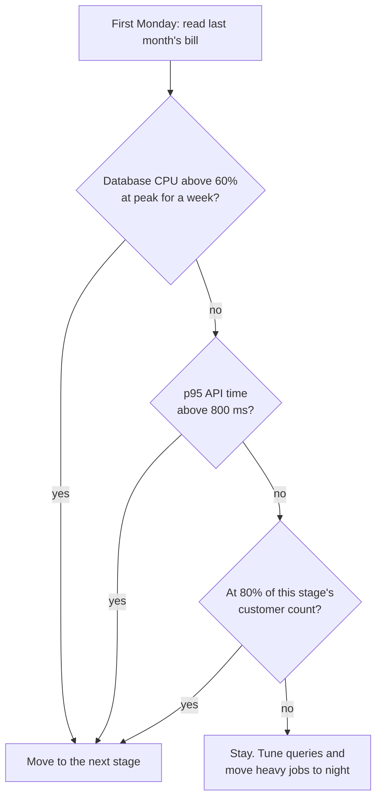

# Infrastructure and Software Costs by Scale

**In simple words:** This chapter answers one question: what does it cost to keep EduFlow running as it grows from 10 paying institutes to 10,000? It gives the monthly bill at five sizes, at three budget levels, with the arithmetic behind every total. It also names the traps that quietly double a cloud bill, and the billing alerts to switch on before you write the first line of code.

## How to read the money in this chapter

Every rupee figure here excludes GST unless the row says otherwise.

- US dollar bills (Vercel, Railway, Anthropic, Sentry, GitHub) carry 18% IGST under reverse charge. A GST-registered company pays it and claims it straight back, so the real cost is the list price plus a 2% to 3.5% card forex markup (see Master Price List).
- AWS India (AISPL) bills in rupees and adds 18% GST. That GST is claimable input tax credit once EduFlow is registered.
- Indian rupee tools (Zoho, Slack, Google Workspace) add 18% GST on top of the listed price. Also claimable.
- Before GST registration, every 18% is a real cost. This is one reason the *Before Day 1: One-Time Setup Costs* chapter registers for GST in October 2026.

All hosting figures are monthly. One-time items are marked. The three budget levels are the same everywhere in this guide: **Minimum** is the bare bootstrap, **Recommended** equals the BRD plan, **Maximum** is the sensible upper end.

## The unit number that matters

The BRD prices hosting with one formula, so you can change the inputs.

> **Rule:** Monthly hosting = (number of organizations x Rs 10) + (active students x Rs 0.40).

Check it against the Year 1 target. At the end of September 2027 the plan has 120 paying organizations, 300 free Starter organizations and 60,000 active students:

- Organizations: 420 x Rs 10 = Rs 4,200
- Students: 60,000 x Rs 0.40 = Rs 24,000
- Total: Rs 4,200 + Rs 24,000 = **Rs 28,200**, which the BRD rounds to Rs 28,000 a month.

The tracking number is cost per student: Rs 28,000 divided by 60,000 = **Rs 0.47 per active student a month**. Write that on the wall. It is the single number that tells you whether the platform is getting cheaper or fatter as it grows.

Free Starter organizations are not free to run. Three hundred of them, at about 30 students each, cost 300 x (Rs 10 + 30 x Rs 0.40) = 300 x Rs 22 = Rs 6,600 a month by the formula. The BRD books about Rs 36 each, Rs 10,800 in total, because it also loads a share of staging, backups and monitoring onto them. Use Rs 10,800 for planning. It is the safer number.

> **Best practice:** The Rs 10 + Rs 0.40 formula is deliberately 5% to 20% above the stage model below. Use it to plan and you will never be surprised by a bill.

## The five stages on one page

The canon sets four scaling stages: 100, 500, 1,000 and 10,000 customers. A fifth stage sits before them all: the first ten paying customers in early 2027. The Recommended column is the BRD plan and does not change.

| Paying customers | Minimum | Recommended | Maximum | Per org | Per student |
|---|---|---|---|---|---|
| 10 (Feb 2027) | Rs 4,300 | Rs 8,800 | Rs 15,050 | Rs 880 | Rs 1.96 |
| 100 (Sep 2027) | Rs 16,000 | Rs 28,000 | Rs 45,000 | Rs 233 | Rs 0.47 |
| 500 (Sep 2028) | Rs 58,000 | Rs 90,000 | Rs 1,40,000 | Rs 180 | Rs 0.45 |
| 1,000 (mid 2029) | Rs 88,587 | Rs 1,70,000 | Rs 2,60,000 | Rs 170 | Rs 0.43 |
| 10,000 (Sep 2031) | Rs 8,00,000 | Rs 12,00,000 | Rs 18,00,000 | Rs 120 | Rs 0.40 |

Student counts behind the last column are estimates that fit the canon: 4,500; 60,000; 2,00,000; 4,00,000 and 30,00,000 active students. Per-organization figures use the paying count only: Rs 28,000 divided by 120 = Rs 233, Rs 90,000 divided by 500 = Rs 180, and so on.

Hosting as a share of MRR falls at every stage: 4.7% at 100 customers (Rs 28,000 of Rs 6 lakh), 3.0% at 500, 2.5% at 1,000 and 1.3% at 10,000. That fall is what pays for the 80%-plus gross margin in the BRD.

> **Note:** Hosting is a step cost. It sits flat for months, then jumps when a bigger setup is needed. Never plan it as a smooth line.

## Stage one: ten paying customers

This is February 2027. The stack is Vercel for the web client and Railway for the API, worker, PostgreSQL and Redis, with AWS Mumbai for files and email.

Arithmetic for the Recommended figure: the BRD books Rs 8,000 of hosting in January 2027 (6 customers) and Rs 10,000 in February (16 customers). Straight-line at 10 customers: Rs 8,000 + (10 - 6) / (16 - 6) x Rs 2,000 = Rs 8,000 + Rs 800 = **Rs 8,800**.

| Item | When to pay | Minimum | Recommended | Maximum | Can you avoid or reduce it? |
|---|---|---|---|---|---|
| Vercel Pro | Day 1 of the public site | Rs 1,700 | Rs 1,700 | Rs 3,400 | No. Hobby bars all commercial use |
| Railway, production set | Day 1 | Rs 2,125 | Rs 4,300 | Rs 5,100 | Yes. Right-size CPU and memory |
| Railway, staging copy | Day 45 (pilot) | Rs 0 | Rs 1,800 | Rs 2,550 | Yes. Scale it to zero at night |
| AWS S3, Mumbai | Day 15 | Rs 250 | Rs 400 | Rs 900 | Yes. Lifecycle rule after 2 years |
| Amazon SES | Day 15 | Rs 150 | Rs 250 | Rs 600 | Yes. Rs 8.50 per 1,000 emails |
| WhatsApp and MSG91, own messages | Day 22 | Rs 75 | Rs 350 | Rs 800 | Yes. 1,000 free service messages |
| Cloudflare DNS, SSL, WAF | Day 1 | Rs 0 | Rs 0 | Rs 1,700 | Free plan is enough to Year 3 |
| **Total a month** | | **Rs 4,300** | **Rs 8,800** | **Rs 15,050** | |

Railway deserves detail, because it is the biggest line. The researched figure for a light production set of four services (API, worker, PostgreSQL, Redis) is US$25 to US$30, which is Rs 2,125 to Rs 2,550 (see Master Price List). At 10 paying customers the API and worker carry real traffic, so the model uses US$51 for production and US$21 for a staging copy that sleeps overnight: (US$51 + US$21) x Rs 85 = Rs 6,120, rounded to Rs 6,100 (Estimate). Railway bills CPU at US$20 per vCPU-month and memory at US$10 per GB-month, per second of real use, so right-sizing pays back the same week.

> **Warning:** Railway has no Mumbai region. The nearest is Singapore, about 60 to 90 ms from North India (Estimate). That is fine for an ERP built on form screens. It is one of the reasons to move to AWS Mumbai later, not now.

## Stage two: one hundred paying customers

September 2027: 120 paying organizations, 300 free ones, 60,000 students, Rs 6 lakh MRR. Still Vercel plus Railway. The BRD books Rs 28,000.

| Bucket | What runs | Arithmetic | Rs a month |
|---|---|---|---|
| Compute | Vercel Pro plus Railway API (2 replicas) and worker | Rs 1,700 + Rs 11,300 | 13,000 |
| Database and cache | Railway PostgreSQL and Redis, bigger plans | Rs 6,400 + Rs 2,600 | 9,000 |
| Storage, CDN, email | 550 GB S3, 80,000 SES emails, own messages | Rs 1,172 + Rs 680 + Rs 1,348 | 3,200 |
| Staging, backups, network | Staging copy, nightly dump to S3, egress | Rs 2,000 + Rs 500 + Rs 300 | 2,800 |
| **Total** | | | **28,000** |

S3 check: 550 GB x Rs 2.13 per GB-month = Rs 1,171.50. SES check: 80 blocks of a thousand emails x Rs 8.50 = Rs 680.

**Minimum Rs 16,000** cuts the staging copy (Rs 2,000), right-sizes every Railway service after a week of real metrics (Rs 8,000) and moves files older than two years to S3 Standard-Infrequent Access at Rs 1.17 per GB-month (Rs 2,000). Rs 28,000 - Rs 2,000 - Rs 8,000 - Rs 2,000 = Rs 16,000. You lose a safe place to test releases. At 120 paying schools that is a bad trade.

**Maximum Rs 45,000** is the same stack one size larger everywhere with an always-on staging copy. It buys nothing a school notices.

## Stage three: five hundred paying customers

September 2028: 500 paying organizations, Rs 30 lakh MRR, about 2,00,000 students. Railway still works, on bigger plans, with a PostgreSQL read replica for reports and a CDN in front of files. The BRD books Rs 90,000.

| Bucket | What runs | Arithmetic | Rs a month |
|---|---|---|---|
| Compute | 3 API replicas and 2 BullMQ workers on Railway | Rs 36,000 | 36,000 |
| Database and cache | PostgreSQL primary, read replica, Redis | Rs 36,000 | 36,000 |
| Storage, CDN, email | 1.8 TB S3, CloudFront Pro, 3 lakh emails, own messages | Rs 3,926 + Rs 1,275 + Rs 2,550 + Rs 4,249 | 12,000 |
| Staging, backups, network | Staging copy, volume snapshots to S3, egress | Rs 3,500 + Rs 1,200 + Rs 1,300 | 6,000 |
| **Total** | | | **90,000** |

CloudFront Pro is a flat US$15 (Rs 1,275) a month for 10M requests and 50 TB, with WAF and DDoS protection included and no overage. At this size the flat plan beats the per-GB rate of Rs 9.27 and removes the risk of a surprise bill after a report-card week.

**Minimum Rs 58,000** drops the read replica until reports actually slow down (Rs 18,000), runs a single Valkey cache node instead of two (Rs 6,000) and starts staging only when a release is being tested (Rs 8,000). Rs 90,000 - Rs 18,000 - Rs 6,000 - Rs 8,000 = Rs 58,000.

**Maximum Rs 1,40,000** is the same setup on x86 compute with Redis OSS instead of Valkey and no lifecycle rules on S3.

## Stage four: one thousand paying customers

This is the move to AWS Mumbai (ap-south-1): ECS Fargate for the API and workers, RDS PostgreSQL, ElastiCache, S3, CloudFront. The BRD books Rs 1,70,000 a month. Here is what that stack really costs at September 2026 AWS prices (see Master Price List).

### The AWS Mumbai bill, line by line

| Service | What runs | Arithmetic | Rs a month |
|---|---|---|---|
| RDS PostgreSQL, writer | db.m6g.large, Multi-AZ | Rs 28,047 | 28,047 |
| RDS PostgreSQL, read replica | db.m6g.large, Single-AZ | Rs 14,023 | 14,023 |
| RDS storage | 300 GB gp3 on each | 300 x Rs 22.27 + 300 x Rs 11.14 | 10,023 |
| ElastiCache | 2 x cache.m7g.large, Valkey | 2 x Rs 8,141 | 16,282 |
| ECS Fargate | 5 ARM tasks, 1 vCPU and 2 GB each | 5 x (Rs 1,479 + 2 x Rs 162) | 9,015 |
| Load balancer | 1 ALB plus capacity units | Rs 1,483 + Rs 1,517 | 3,000 |
| NAT gateways | 2 gateways, 500 GB processed | 2 x Rs 3,475 + 500 x Rs 4.76 | 9,330 |
| S3 | 1 TB stored, 2M writes, 20M reads | Rs 2,181 + Rs 860 + Rs 680 | 3,721 |
| CloudFront | Pro flat rate, US$15 | Rs 1,275 | 1,275 |
| Amazon SES | 2 lakh emails | 200 x Rs 8.50 | 1,700 |
| CloudWatch Logs | 50 GB ingest (5 GB free), 50 GB stored | 45 x Rs 56.95 + 50 x Rs 2.55 | 2,691 |
| Public IPv4 | 6 addresses in use | 6 x Rs 310 | 1,860 |
| Secrets Manager | 10 secrets | 10 x Rs 34 | 340 |
| Data transfer out | 500 GB to the internet | 500 x Rs 9.29 | 4,645 |
| **Total** | | | **1,05,952** |

Add a staging copy at about Rs 12,000 and the bill is Rs 1,17,952. The BRD plans Rs 1,70,000, so there is Rs 52,048 of headroom, about 31%. That headroom is the point. It covers an unplanned traffic spike in the April admission season, the AWS savings plan you have not bought yet, and the two weeks when the old Railway stack and the new AWS stack both run.

Backups: RDS gives you backup storage equal to your provisioned storage for free, so 300 GB of snapshots costs Rs 0. Beyond that it is Rs 8.08 per GB-month. Set the retention window to 14 days and you stay inside the free allocation.

> **Rule:** Move to AWS on a trigger, not on a date. Run both stacks in parallel for two weeks, cut over one tenant at a time, and keep the Railway bill in the budget for that month.

### What each saving is worth

| Change | Saving a month | Risk |
|---|---|---|
| ARM (Graviton) Fargate instead of x86 | Rs 7,080 | Low. Node.js 24 runs on ARM |
| Valkey instead of Redis OSS on ElastiCache | Rs 4,070 | Low. BullMQ works on Valkey |
| VPC endpoints and public subnets, not 2 NAT gateways | Rs 8,460 | Low. Tighten security groups |
| CloudWatch Logs Infrequent Access class | Rs 1,281 | Low. Slower search only |
| Drop the read replica until reports slow down | Rs 17,365 | Medium. Watch p95 report time |
| Single-AZ database instead of Multi-AZ | Rs 17,363 | High. Do not do this |

ARM check: an x86 task of 1 vCPU and 2 GB costs Rs 2,641 + 2 x Rs 289 = Rs 3,219, against Rs 1,803 on ARM. The difference is Rs 1,416 x 5 tasks = Rs 7,080. Valkey check: Rs 10,176 - Rs 8,141 = Rs 2,035 per node x 2 = Rs 4,070.

**Minimum Rs 88,587** is the table above without the read replica and its storage: Rs 1,05,952 - Rs 14,023 - Rs 3,342. **Maximum Rs 2,60,000** is one size larger everywhere on x86 with Redis OSS and an always-on staging copy.

## Stage five: ten thousand paying customers

September 2031: Rs 9.5 crore MRR, about 30 lakh students, and student data that must stay inside the UAE, the USA and Australia. The BRD books Rs 12,00,000 a month, of which Rs 2,70,000 buys three small regional stacks.

| Bucket | What runs | Rs a month |
|---|---|---|
| Compute | 70 Fargate ARM tasks of 2 vCPU and 4 GB (Rs 2,52,420), 3 load balancers (Rs 9,000), Vercel team seats and usage (Rs 28,580) | 2,90,000 |
| Database and cache | Large Multi-AZ writer, 3 read replicas, 1.5 TB gp3, 6 Valkey nodes, point-in-time backups | 3,90,000 |
| Storage, CDN, email | 12 TB S3 with lifecycle (Rs 20,275), CloudFront Business (Rs 17,000), 30 lakh SES emails (Rs 25,500), requests and transfer (Rs 97,225) | 1,60,000 |
| Staging, backups, network | India staging and network Rs 90,000, plus 3 regional stacks at Rs 90,000 each | 3,60,000 |
| **Total** | | **12,00,000** |

Fargate check: one ARM task of 2 vCPU and 4 GB costs 2 x Rs 1,479 + 4 x Rs 162 = Rs 3,606; 70 tasks = Rs 2,52,420. Regional check: 3 x Rs 90,000 = Rs 2,70,000, plus Rs 90,000 for India, equals Rs 3,60,000.

The database bucket is an **Estimate**. The Master Price List stops at db.m6g.large, so the writer size at this scale is reasoned from the rule that RDS prices scale nearly in line with instance size. Re-price it against the AWS price file before you commit.

**Minimum Rs 8,00,000** takes three-year AWS savings plans on steady compute and database after three months of stable use (about 30% of Rs 6,80,000 = Rs 2,04,000), moves every task to ARM (Rs 1,16,000) and merges the USA and Australia stacks into one until each region has 300 customers (Rs 80,000 net of extra cross-region transfer). Rs 12,00,000 - Rs 2,04,000 - Rs 1,16,000 - Rs 80,000 = Rs 8,00,000.

> **Warning:** Never buy a savings plan before three months of stable use on AWS. A one-year commitment on a stack you outgrow in four months is money burnt.

## When to move to the next stage

**Figure: The monthly stage decision**

The three triggers are the BRD's. "p95 API time" means 95 of every 100 requests finish faster than that. If none of the three fires, the answer is always to stay. Report cards, bulk PDFs and imports run in BullMQ workers at night, which delays the next jump by months.

## Tools that grow with the team

Watching the product is a separate line from hosting. The BRD books about Rs 3,000 a month at 100 customers and about Rs 3,00,000 at 10,000.

| Tool | What forces the upgrade | 100 customers | 1,000 customers | 10,000 customers |
|---|---|---|---|---|
| Sentry | Above 1 user or 5,000 errors | Rs 2,210 Team | Rs 2,210 Team | Rs 6,800 Business |
| Sentry extra errors | Above the plan's error count | Rs 770 | Rs 4,620 | Rs 15,400 |
| Better Stack | On-call phone alerts, 10+ monitors | Rs 0 | Rs 7,055 | Rs 16,235 |
| PostHog | Above 1M events a month | Rs 0 | Rs 21,250 | Rs 2,12,500 |
| Grafana Cloud | Above 50 GB of logs | Rs 0 | Rs 1,615 | Rs 49,065 |
| **Total** | | **Rs 2,980** | **Rs 36,750** | **Rs 3,00,000** |

Sentry extra errors cost Rs 308 per 10,000 in the 50,000 to 100,000 band. PostHog charges Rs 4,250 per extra million events, so 50 million events above the free tier is Rs 2,12,500 a month. That single line is why you set a PostHog billing limit on day one.

> **Warning:** PostHog session replay must never record parent or student screens. DPDP forbids tracking children. Record admin and accountant screens only, and stay inside the 5,000 free recordings.

Team tools grow with headcount, not with customers. Canon headcount is 4, 14, 40, 95 and 220 people at the end of Years 1 to 5, with 1.5, 5, 14, 30 and 66 of them in engineering.

| Tool | Price basis | Year 1, 4 people | Year 3, 40 people | Year 5, 220 people |
|---|---|---|---|---|
| Claude seats | Max 20x Rs 17,000; Team Premium Rs 8,500; Standard Rs 1,700 | Rs 25,500 | Rs 1,63,200 | Rs 8,22,800 |
| GitHub Team | Rs 340 per developer | Rs 680 | Rs 4,760 | Rs 22,440 |
| Figma | Full seat Rs 1,360, dev seat Rs 1,020 | Rs 0 | Rs 6,800 | Rs 34,000 |
| Linear | Basic Rs 850, Business Rs 1,360 | Rs 0 | Rs 17,000 | Rs 1,36,000 |
| Slack | Pro Rs 245, Business+ Rs 557 | Rs 0 | Rs 9,800 | Rs 1,22,540 |
| Google Workspace | Starter Rs 270, Standard Rs 1,080 | Rs 1,080 | Rs 10,800 | Rs 2,37,600 |
| Bitwarden | Teams Rs 340, Enterprise Rs 510 | Rs 1,360 | Rs 13,600 | Rs 1,12,200 |
| Docker Business | Rs 2,040 per developer | Rs 0 | Rs 0 | Rs 1,34,640 |
| **Total a month** | | **Rs 28,620** | **Rs 2,25,960** | **Rs 16,22,220** |

Year 1 check: Rs 28,620 of team tools plus Rs 2,980 of watching tools plus Zoho Books Standard at Rs 749 and a shared support inbox at Rs 300 comes to Rs 32,649, against the BRD's Rs 36,000 in September 2027. The Rs 3,351 gap is small extras and help-desk seats.

Docker Desktop is free while EduFlow has fewer than 250 staff and under US$10 million of revenue. Year 5 targets, 220 people and Rs 75.3 crore (about US$8.9 million), sit just under both lines, so Docker Business is budgeted from Year 5 as a safety margin. Jira Standard is the usual alternative to Linear; it is not in the Master Price List, so budget the Linear figure and check Atlassian's own page before switching (Estimate).

## What AI Insights costs to run

AI Insights is a Phase 4 module. It ships by September 2027 and sells at Rs 1,499 a month as an add-on. The BRD budgets Rs 250 of Claude API tokens per AI Insights customer a month, which is 17% of the price (Rs 250 divided by Rs 1,499 = 16.7%).

Pick the model by job, not by name.

| Job | Model | Why | Rs per MTok, in and out |
|---|---|---|---|
| Monthly insight report, overnight | Sonnet 5, Batch API | Not urgent; batch halves the price | 85 and 425 |
| Weekly at-risk student scan, overnight | Sonnet 5, Batch API | Same reason | 85 and 425 |
| Question typed by an Org Admin | Sonnet 5 | Answer needed in seconds | 170 and 850 |
| One-line classification or tagging | Haiku 4.5 | Cheapest model that is good enough | 85 and 425 |
| Anything at all, Years 1 to 3 | Opus 5 or Fable 5.1 | 2.5x to 5x Sonnet 5 for no visible gain | 425 and 2,125 |

Worked cost for one organization the size of Bright Future Public School, 1,200 students, in one month:

1. Monthly insight report, batch: 150,000 input and 4,000 output tokens. 0.150 x Rs 85 = Rs 12.75, plus 0.004 x Rs 425 = Rs 1.70. **Rs 14.45**
2. Four weekly at-risk scans, batch: 240,000 input and 8,000 output. 0.240 x Rs 85 = Rs 20.40, plus 0.008 x Rs 425 = Rs 3.40. **Rs 23.80**
3. Forty ad-hoc questions, live: 480,000 input and 32,000 output. 0.480 x Rs 170 = Rs 81.60, plus 0.032 x Rs 850 = Rs 27.20. **Rs 108.80**

Total: Rs 14.45 + Rs 23.80 + Rs 108.80 = **Rs 147.05**. Models from Claude 4.7 onward produce about 30% more tokens for the same text, so budget Rs 147.05 x 1.30 = **Rs 191.17**. That leaves 24% of headroom inside the BRD's Rs 250.

| AI Insights customers | At Rs 191.17 each | At the Rs 250 budget | Add-on revenue | Budget as a share |
|---|---|---|---|---|
| 12 | Rs 2,294 | Rs 3,000 | Rs 17,988 | 17% |
| 100 | Rs 19,117 | Rs 25,000 | Rs 1,49,900 | 17% |
| 1,000 | Rs 1,91,170 | Rs 2,50,000 | Rs 14,99,000 | 17% |

At the 10,000-customer stage the BRD books about Rs 16 lakh a month of AI compute, which is 17% of Rs 93 lakh of AI Insights MRR. Rs 93 lakh divided by Rs 1,499 is about 6,200 customers, so the plan assumes 62% of customers buy the add-on.

Two levers cut this further. Prompt caching makes a repeated school context cost 0.1x the input price, and the Batch API halves input and output on anything that can wait until 2 a.m. Both are already used in jobs 1 and 2 above; job 3 is priced without caching on purpose, as a safety margin.

> **Rule:** Set a monthly spend limit on the Anthropic Console before the first AI Insights customer is switched on. Never let a question loop run without a token cap.

## The cost traps, with real numbers

Each row below is priced at the 1,000-customer AWS stack, where the honest bill is Rs 1,05,952.

| Trap | What it costs a month | The fix |
|---|---|---|
| 2 NAT gateways, 1 TB processed | Rs 11,826 | VPC endpoints at Rs 0.85 per GB: Rs 870. Saves Rs 10,956 |
| Staging left on 24x7 | Rs 12,000 | Scale to zero nights and weekends, 65% of hours. Saves Rs 7,800 |
| Logs kept for ever | Rs 3,060 after 24 months | 30 days on app logs, 400 days on audit logs |
| PDFs served straight from S3, 500 GB | Rs 4,645 | CloudFront: the first 1 TB a month is always free |
| Forgotten paid extras | Rs 8,075 | Vercel preview protection, Sentry Seer, extra status page, Cloudflare Pro |
| No S3 lifecycle rule, 2,760 GB | Rs 5,879 | Move files over 2 years to Standard-IA: Rs 4,612. Saves Rs 1,267 |
| Stray public IPv4 addresses, 12 | Rs 3,720 | Release them. Every unused IP is Rs 310 a month |
| x86 Fargate instead of ARM | Rs 7,080 extra | Rebuild the image for ARM once |
| Redis OSS instead of Valkey | Rs 4,070 extra | Valkey is Redis-compatible and 20% cheaper |

Add them up: Rs 10,956 + Rs 7,800 + Rs 3,060 + Rs 4,645 + Rs 8,075 + Rs 1,267 + Rs 3,720 + Rs 7,080 + Rs 4,070 = **Rs 50,673 a month, Rs 6,08,076 a year**. That is 48% on top of a Rs 1,05,952 bill, for nothing a customer can see.

Two more that do not fit the table. An over-sized database is the most common: db.m6g.large Multi-AZ at Rs 28,047 where db.t4g.medium Multi-AZ at Rs 10,362 would carry 100 customers wastes Rs 17,685 a month, Rs 2,12,220 a year. And a forgotten trial is the quietest, because nobody notices a Rs 1,700 line until the twelfth invoice.

> **Founder note:** Every trap above is a decision you made once and never revisited. The first Monday review is not paperwork. At the 1,000-customer stage it is worth about Rs 6 lakh a year.

## Billing alerts to set on day one

Set these the day each account is opened, not after the first shock.

| Where | Alert to set | Threshold | Cost |
|---|---|---|---|
| AWS Budgets | Monthly cost budget, email at 50%, 80%, 100% | 1.2x last month | Free for the first 2 budgets |
| AWS Cost Anomaly Detection | Daily anomaly email | Default | Free |
| AWS Cost Explorer | Weekly look at the top 5 services | Every Monday | Free |
| Railway | Hard usage limit on the workspace | 1.5x the plan | Free |
| Vercel | Spend management, pause on limit | 2x the US$20 credit | Free |
| Anthropic Console | Monthly spend limit and email alert | Rs 250 x AI customers | Free |
| PostHog | Billing limit on each product | Free tier plus 20% | Free |
| Sentry | On-demand spend cap | Rs 2,000 a month | Free |

Two habits go with them. Put a separate low-limit company card on cloud accounts only, so a runaway job cannot drain the operating account. And tag every AWS resource with its environment (production or staging) and its module, so Cost Explorer can tell you which of the 34 modules is expensive.

> **Best practice:** Track hosting divided by active students every month. The Year 1 target is Rs 0.47. If it rises two months in a row, find the cause before you add a single server.

## Key takeaways

- Hosting is planned with one formula: organizations x Rs 10 + active students x Rs 0.40. At 420 organizations and 60,000 students that is Rs 28,200 a month, and the unit number to watch is Rs 0.47 per student.
- The Recommended bill is Rs 8,800 at 10 customers, Rs 28,000 at 100, Rs 90,000 at 500, Rs 1,70,000 at 1,000 and Rs 12,00,000 at 10,000. Hosting falls from 4.7% of MRR to 1.3%.
- At current AWS Mumbai prices the 1,000-customer stack costs Rs 1,05,952 a month, Rs 1,17,952 with staging. The BRD's Rs 1,70,000 carries about 31% headroom on purpose.
- Move stage on a trigger, never a date: database CPU above 60% at peak for a week, p95 API time above 800 ms, or 80% of the stage's customer count.
- AI Insights costs about Rs 191 of Claude tokens per customer a month on Sonnet 5 with the Batch API, inside the BRD's Rs 250 and its 17%-of-price target. Set the Console spend limit before the first customer.
- Nine avoidable traps add Rs 50,673 a month, Rs 6,08,076 a year, to a Rs 1,05,952 bill. NAT gateways, idle staging and forgotten trials are the three biggest.
- Set every billing alert on the day the account opens. They all cost Rs 0, and the first Monday bill review is the cheapest engineer you will ever hire.
