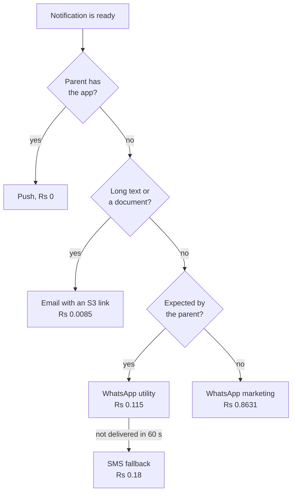
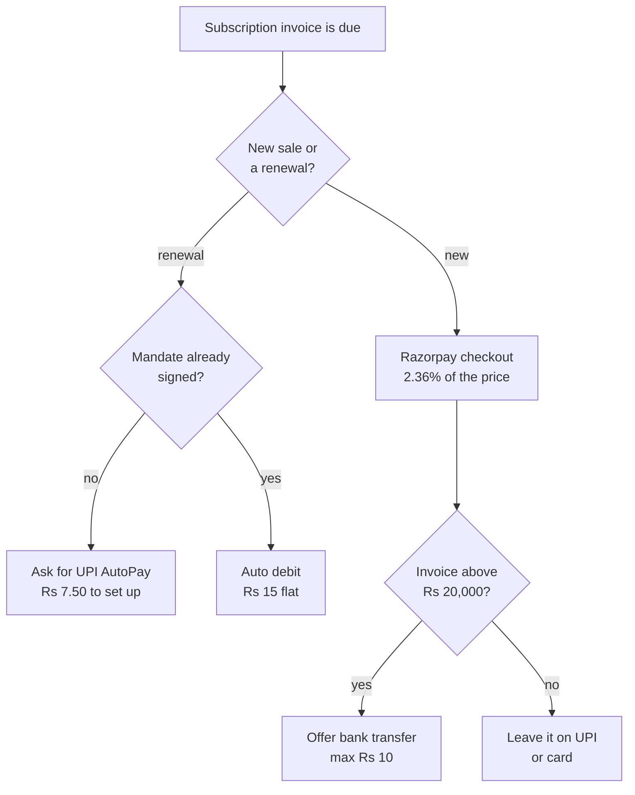

# Messaging and Payment Costs

**In simple words:** Two costs grow with every customer you add: the messages EduFlow sends to parents, and the fee a payment gateway keeps from every rupee you collect. Together they are 56% of the whole cost of service over five years, about Rs 10.95 crore. This chapter gives the exact per-message and per-transaction price in India, UAE, USA and Australia, shows who pays for what, and gives the rules that keep the bill small.

## The two lines and what they cost

The BRD financial model has one line for messages and one for gateway fees. Both are cost of service, so both sit above gross profit.

| Line, Rs lakh | Year 1 | Year 2 | Year 3 | Year 4 | Year 5 |
|---|---|---|---|---|---|
| Total revenue | 23.25 | 190 | 793 | 2,609 | 7,533 |
| Usage revenue (messages sold) | 1.28 | 12.94 | 63.53 | 235.29 | 712.94 |
| Message cost (85% of usage revenue) | 1.09 | 11 | 54 | 200 | 606 |
| Message cost as a share of revenue | 4.7% | 5.8% | 6.8% | 7.7% | 8.0% |
| Gateway fees | 0.77 | 3 | 16 | 52 | 151 |
| Gateway rate used | 1.5% of cash | 1.8% | 2.0% | 2.0% | 2.0% |
| **Both lines together** | **1.86** | **14** | **70** | **252** | **757** |

Five-year totals: messages Rs 872.09 lakh plus gateway Rs 222.77 lakh = Rs 1,094.86 lakh (Rs 10.95 crore). That is 9.8% of Rs 111.48 crore of revenue and 56% of the Rs 1,948.66 lakh cost of service.

Two formulas drive the whole table:

- **Message cost = 85% of usage revenue.** Usage revenue is 6% of recurring revenue in Year 1. EduFlow sells messages at Meta cost plus 15%, so 100 divided by 115 = 87% goes back out as cost; the model rounds to 85%. Year 3 check: 85% x Rs 63.53 lakh = Rs 54 lakh.
- **Gateway fee = a rate x money collected.** Years 2 to 5 use a rate on revenue. Year 1 uses 1.5% on cash collected with GST inside, a bigger base.

> **Note:** Year 1 gateway fees look high against revenue (3.3%) only because of that base. Cash collected is Rs 43,53,500 against revenue of Rs 23,25,000, 1.87 times more, because a yearly plan takes twelve months of money at once.

## What Year One costs, at three levels

**Minimum** is the bare bootstrap: free tiers, push and email first, the smallest SMS pack. **Recommended** equals the BRD plan. **Maximum** is the sensible upper end; above it the money is waste.

| Item | When to pay | Minimum | Recommended | Maximum | Can you avoid or reduce it? |
|---|---|---|---|---|---|
| DLT principal entity, one time | Dec 2026 | Rs 5,900 | Rs 5,900 | Rs 5,900 | No. TRAI needs it before any business SMS |
| Meta business verification, one time | Dec 2026 | Rs 0 | Rs 0 | Rs 0 | Already free. Only paperwork costs time |
| First MSG91 SMS pack, one time | Dec 2026 | Rs 1,250 | Rs 1,250 | Rs 5,400 | Yes. Buy 5,000, not 30,000 |
| Own WhatsApp messages, Oct to Mar | monthly | Rs 900 | Rs 1,500 | Rs 3,000 | Yes. Utility templates, not marketing |
| Own SMS wallet, Nov to Mar | monthly | Rs 700 | Rs 1,400 | Rs 3,000 | Yes. Only as the OTP fallback |
| Amazon SES email, Oct to Mar | monthly | Rs 600 | Rs 1,100 | Rs 2,500 | Yes. Send S3 links, not attachments |
| Customer message cost, Jan to Mar | monthly | Rs 7,500 | Rs 7,500 | Rs 7,500 | No. Customers repay it at cost plus 15% |
| Customer message cost, Apr to Sep | monthly | Rs 50,600 | Rs 1,01,200 | Rs 2,02,400 | No. It rises with paying customers |
| WhatsApp support number SIM, Dec to Sep | monthly | Rs 3,740 | Rs 3,740 | Rs 3,740 | Yes, but do not. One clean number matters |
| **Messaging total** | | **Rs 71,190** | **Rs 1,23,590** | **Rs 2,33,440** | |

Recommended arithmetic: Rs 5,900 + Rs 1,250 + Rs 1,500 + Rs 1,400 + Rs 1,100 + Rs 7,500 + Rs 1,01,200 + Rs 3,740 = Rs 1,23,590. Of that, Rs 1,08,700 is the BRD's message cost line (Rs 1.09 lakh). The other Rs 14,890 sits in legal (DLT Rs 5,900), hosting (Rs 5,250) and misc (the Rs 3,740 SIM).

| Item | When to pay | Minimum | Recommended | Maximum | Can you avoid or reduce it? |
|---|---|---|---|---|---|
| Razorpay account, setup and yearly fee | Dec 2026 | Rs 0 | Rs 0 | Rs 0 | Already free. No AMC, no refund fee |
| Gateway fees on own billing, Jan to Mar | monthly | Rs 1,050 | Rs 12,600 | Rs 24,400 | Yes. Mandates and the Cashfree offer |
| Gateway fees on own billing, Apr to Sep | monthly | Rs 21,900 | Rs 64,200 | Rs 85,900 | Yes. Move renewals to UPI AutoPay |
| Instant settlement, if switched on | per payout | Rs 0 | Rs 0 | Rs 12,900 | Yes. T+1 settlement is free |
| Instant refunds, about 100 cases | per refund | Rs 0 | Rs 0 | Rs 1,500 | Yes. Normal refunds cost nothing |
| **Payments total** | | **Rs 22,950** | **Rs 76,800** | **Rs 1,24,700** | |

Recommended arithmetic: Rs 12,600 + Rs 64,200 = Rs 76,800, which the BRD rounds to Rs 0.77 lakh. Both areas together cost Rs 2,00,390 at Recommended, which is 8.4% of the Rs 23,77,500 Year 1 budget. Minimum is Rs 94,140 and Maximum is Rs 3,58,140.

> **Rule:** Every price here is before 18% GST unless the row says otherwise. Once EduFlow is GST-registered that GST returns as input tax credit (ITC) in the same month, so the real cost is the list price. Put the GSTIN on the Meta, MSG91, AWS, Razorpay and Twilio accounts on day one.

## How WhatsApp charges

Meta bills per delivered template message. Only two things change the price: the template's category (marketing, utility, authentication or service) and the country code it reaches.

| Rule | What it means for EduFlow |
|---|---|
| Customer service window (CSW) | Opens for 24 hours when a parent messages first. Replies inside it were free until 30 Sep 2026 |
| Charged from 1 Oct 2026 | Service replies and in-window utility templates move to the utility rate, after about 1,000 free per business number a month (Estimate) |
| Payment method deadline | A card must be on the Meta account by 30 Sep 2026, or service messages stop |
| Free entry point window | Every message is free for 72 hours after a click-to-WhatsApp ad or page button |
| Volume tiers | Utility and authentication rates fall at high monthly volume, counted portfolio-wide |
| Daily limit | 250 unique users a day before verification; then 2,000, 10,000, 100,000 and unlimited |

Business verification is free. It needs the certificate of incorporation, GST certificate, address proof and domain or email proof (see Master Price List).

> **Warning:** The canon Year 1 target is 60,000 active students. One business number at the 10,000-a-day tier cannot send one notice to every parent. Plan the tier upgrade, or a number per institute, before the first school group signs.

### Per-message rates by market

List prices at the first volume tier, before GST or VAT. Rupees use the planning rates: US$1 = Rs 85, A$1 = Rs 56, AED 1 = Rs 23.

| Market | Marketing | Utility and authentication | Times India |
|---|---|---|---|
| India | Rs 0.8631 | Rs 0.115 | 1.0 |
| UAE | Rs 4.90 from 1 Oct 2026 | Rs 1.33 | 5.7 and 11.6 |
| USA and Canada | Rs 2.13 | Rs 0.29 | 2.5 and 2.5 |
| Australia | Rs 7.16 from 1 Oct 2026 | Rs 0.96 | 8.3 and 8.3 |

In India a marketing message costs 7.5 times a utility message (Rs 0.8631 divided by Rs 0.115). Anything a parent is waiting for (fee due, receipt, absence, result) is utility. Only a promotion is marketing.

## SMS in India, and the DLT register

DLT (Distributed Ledger Technology) is the TRAI register every Indian business must join before sending business SMS. Register on one portal only; the entity data is shared with the rest.

| Portal | Fee | Validity | Cost over five years | Verdict |
|---|---|---|---|---|
| Vodafone Idea (Vilpower) | Rs 5,000, GST not stated | 5 years | Rs 5,900 with GST | Use this one |
| Jio (TrueConnect) | Rs 5,900 incl. GST | Reported 1 year | About Rs 29,500 | Avoid the yearly renewal |

Sender ID and template registration have no listed fee. Telemarketer registration (Rs 5,000 plus a Rs 50,000 deposit) is for aggregators, so MSG91 pays it. MSG91 has no monthly fee: you load a prepaid wallet and the price falls with pack size.

| Pack | Cash out, plus 18% GST | Price per SMS | Margin at the Rs 0.25 resale price |
|---|---|---|---|
| 5,000 SMS | Rs 1,250 | Rs 0.25 | Rs 0. Buy it only to test templates |
| 16,500 SMS | Rs 3,300 | Rs 0.20 | Rs 0.05, or 20% |
| 30,000 SMS | Rs 5,400 | Rs 0.18 | Rs 0.07, or 28%. This is the BRD's cost |
| 60,000 to 9,62,500 SMS | Rs 10,200 to Rs 1,54,000 | Rs 0.17 to 0.16 | Rs 0.08 to 0.09, or 32% to 36% |
| Negotiated, on request | Quote | Rs 0.13 | Rs 0.12, or 48% |

Break-even on the 30,000 pack: Rs 5,400 divided by Rs 0.25 = 21,600 messages. Buy it only when customers send more than 5,000 SMS a month.

## SMS outside India

| Market | Outbound SMS | Number or sender ID | One-time registration | Notes |
|---|---|---|---|---|
| USA | Rs 0.71 plus Rs 0.30 to 0.43 carrier fee | Rs 98 a month long code | Rs 383 low volume, Rs 3,910 standard | Plus Rs 1,275 campaign vetting |
| USA, monthly campaign fee | Rs 170 to Rs 850 | included | none | Unregistered traffic is blocked |
| Australia | Rs 4.38 a segment | Rs 701 a month, or a free alphanumeric ID | ACMA register, fee not confirmed | Required since 1 Jul 2026 |
| UAE | Rs 10.00 a message | Sales quote only | none listed | WhatsApp utility at Rs 1.33 is 7.5 times cheaper |

A2P 10DLC (application-to-person ten-digit long code) is the US carrier register. A standard brand costs about Rs 5,185 one time (Rs 3,910 brand plus Rs 1,275 vetting) and about Rs 948 a month (Rs 850 campaign plus Rs 98 number). An Indian company may register with its own tax identity.

> **Warning:** International SMS is not priced in the canon; the Rs 1,250-per-5,000 pack is India only. At Rs 4.38 in Australia, 5,000 messages cost Rs 21,900. Sell a separate international pack, or ship push, email and WhatsApp first.

## Email and push

| Channel | Vendor and plan | Price | What to use it for |
|---|---|---|---|
| Outbound email | Amazon SES, a la carte | Rs 8.50 per 1,000, so Rs 0.0085 each | Report cards, fee statements, circulars, receipts |
| Attachment data | Amazon SES | Rs 10.20 per GB sent | Never. Send an S3 pre-signed link instead |
| Push notification | Firebase Cloud Messaging | Rs 0, unlimited | Everything the parent app can carry |

New SES accounts start on Essentials at Rs 13.60 per 1,000; switch to a la carte on day one. Email is 13.5 times cheaper than a WhatsApp utility message (Rs 0.115 divided by Rs 0.0085) and push is free.

**Figure: The message channel ladder**

Climb one step only when the cheaper step fails.

## What a three-hundred-student school really sends

One institute on the Growth plan at Rs 2,499 a month. Sharma Classes in Patna has 350 students: multiply by 1.17.

| Message | Category | Count a month | Rate | Meta cost |
|---|---|---|---|---|
| Absence alert, 6% of 300 x 22 days | Utility | 396 | Rs 0.115 | Rs 45.54 |
| Fee due reminder, 300 x 1 | Utility | 300 | Rs 0.115 | Rs 34.50 |
| Fee overdue reminder, 75 x 2 | Utility | 150 | Rs 0.115 | Rs 17.25 |
| Fee receipt, 220 payments | Utility | 220 | Rs 0.115 | Rs 25.30 |
| Homework and notice broadcast, 300 x 4 | Utility | 1,200 | Rs 0.115 | Rs 138.00 |
| Exam and report card alert, 300 x 2 | Utility | 600 | Rs 0.115 | Rs 69.00 |
| Parent login OTP, 300 x 1.5 | Authentication | 450 | Rs 0.115 | Rs 51.75 |
| Admission or event promotion, 300 x 1 | Marketing | 300 | Rs 0.8631 | Rs 258.93 |
| **Heavy profile total** | | **3,616** | | **Rs 640.27** |

Check: Rs 381.34 of utility and authentication plus Rs 258.93 of marketing = Rs 640.27. At cost plus 15% that is Rs 736.31, plus 18% GST = Rs 868.85 invoiced. The margin is Rs 96.04 a month.

The **light profile** moves homework, notices, attendance and exam schedules to push and in-app. Only fee reminders (300), overdue chasers (150), receipts (220), report card alerts (300) and login OTPs (450) go on WhatsApp: 1,420 x Rs 0.115 = Rs 163.30, charged at Rs 187.80.

| Profile | Messages a month | EduFlow's cost | Charged to the school | Share of the Rs 2,499 plan |
|---|---|---|---|---|
| Light, push first | 1,420 | Rs 163.30 | Rs 187.80 | 7.5% |
| Heavy, WhatsApp for everything | 3,616 | Rs 640.27 | Rs 736.31 | 29.5% |

> **Warning:** The BRD assumes usage revenue is 6% of recurring revenue. The light profile is 7.5%, close enough. The heavy profile is 29.5%, five times the plan. Messages do not hurt gross margin, because they are sold at cost plus 15%. They hurt the customer's bill, and a surprise bill is a churn reason. Show the running wallet total on the dashboard from day one.

One promotion to 300 parents costs Rs 258.93, which is 40% of the heavy bill and buys 2,251 utility messages instead. Before sending a marketing template, ask whether an in-app banner would do.

### Which credit pack to sell

At Meta cost plus 15%, a utility or authentication message costs the school Rs 0.13225 and a marketing message Rs 0.9926.

| Pack | Price plus 18% GST | Utility messages | Marketing messages | Right for |
|---|---|---|---|---|
| Rs 499 | Rs 588.82 | 3,772 | 502 | Under 150 students, light use |
| Rs 1,999 | Rs 2,358.82 | 15,115 | 2,014 | 150 to 600 students |
| Rs 7,999 | Rs 9,438.82 | 60,484 | 8,059 | Above 600 students, or a school group |

The heavy school burns the Rs 1,999 pack in 2.7 months (Rs 1,999 divided by Rs 736.31); the light one takes 10.6 months.

## What EduFlow's own messages cost

Messages carrying a school's name to its parents are the school's, paid from its wallet. Messages to EduFlow's own leads and institute admins are EduFlow's cost, and sit inside the hosting line, not the message line.

| Own message | Category | Count in Sep 2027 | Rate | Cost |
|---|---|---|---|---|
| Admin login OTP, 420 orgs x 2 users x 3 | Authentication | 2,520 | Rs 0.115 | Rs 289.80 |
| Demo confirmation and reminder, 150 x 2 | Utility | 300 | Rs 0.115 | Rs 34.50 |
| Invoice and payment receipt, 120 x 2 | Utility | 240 | Rs 0.115 | Rs 27.60 |
| Renewal reminder, 120 x 2 | Utility | 240 | Rs 0.115 | Rs 27.60 |
| Support replies over the 1,000 free | Service | 800 | Rs 0.115 | Rs 92.00 |
| Promotion to the lead list | Marketing | 800 | Rs 0.8631 | Rs 690.48 |
| **Total** | | **4,900** | | **Rs 1,161.98** |

Add the SMS fallback when WhatsApp delivery fails, about 10% of OTPs: 252 x Rs 0.18 = Rs 45.36. The own-message bill in September 2027 is about Rs 1,207 a month, 4.3% of the Rs 28,000 hosting line. The BRD books Rs 400 of WhatsApp and Rs 400 of MSG91 a month by March 2027, and the January example (Rs 228.12 with GST against a Rs 250 budget) fits.

The single promotion is 59% of that bill. Reply inside the free entry-point window after a click-to-WhatsApp ad instead: every message is free for 72 hours.

## Payment gateway fees in India

Razorpay charges no setup fee, no annual maintenance charge and no refund fee. Settlement is T+1. The platform fee carries 18% GST, claimable as ITC. MDR (merchant discount rate) is the separate fee the card or UPI network sets.

| Method | Razorpay Standard | On the Rs 2,948.82 Growth invoice |
|---|---|---|
| UPI, RuPay debit, cards, netbanking, wallets | 2% | Rs 58.98 fee, Rs 69.60 leaves the account |
| Corporate and business cards | 2.15% | Rs 63.40 fee |
| International cards | up to 3% | up to Rs 88.46 fee |
| Card subscriptions, recurring | 2.9% | Rs 85.52 fee |
| UPI QR code | 0.99% | Rs 29.19 fee |
| Smart Collect, bank transfer | 1% or Rs 10, whichever is lower | Rs 10 fee |

For comparison: Cashfree charges 1.95% and settles T+1 by 8 pm, PayU 2% with T+2, PhonePe 1.99%.

### What the government sets

| Rule | Effect |
|---|---|
| UPI payment up to Rs 2,000 | 0% MDR, unchanged |
| UPI payment above Rs 2,000, from 15 Oct 2026 | 0.4% MDR paid by the merchant, capped at Rs 300 |
| School and college fee collections | A flat or capped rate is promised, not yet published |
| Passing UPI MDR to the payer | Not allowed. A UPI convenience fee breaks the rule |
| Gateway platform fee on UPI | 1.95% to 2% on top of any MDR. UPI is not free |

> **Rule:** Each institute keeps its own gateway account for student fees and stays the merchant for its own money. EduFlow never collects fees on a school's behalf. Pass-through applies to cards and netbanking only, because NPCI bars passing UPI MDR to the parent.

## What collecting your own subscriptions costs

Year 1 cash collected from customers is Rs 7,12,800 in January to March plus Rs 36,40,700 in April to September = Rs 43,53,500. With 18% GST the gross charged is Rs 43,53,500 x 1.18 = Rs 51,37,130.

| Route | Rate on the gross | Year 1 fee on Rs 51,37,130 | Against the plan |
|---|---|---|---|
| BRD plan | 1.5% | Rs 77,057 | booked as Rs 0.77 lakh |
| Razorpay Standard, ITC claimed | 2% | Rs 1,02,743 | Rs 25,686 more |
| Razorpay card subscriptions | 2.9% | Rs 1,48,977 | Rs 71,920 more |
| Cashfree PG standard | 1.95% | Rs 1,00,174 | Rs 23,117 more |
| UPI AutoPay, Rs 15 a debit | 0.51% | Rs 26,199 | Rs 50,858 less |

Per payment, on a Growth plan of Rs 2,499 plus GST = Rs 2,948.82:

| Route | Fee after the GST credit | As a share of Rs 2,499 |
|---|---|---|
| Razorpay checkout, card or UPI | Rs 58.98 | 2.36% |
| Cashfree checkout | Rs 57.48 | 2.30% |
| Razorpay card subscriptions | Rs 85.52 | 3.42% |
| Razorpay Smart Collect, bank transfer | Rs 10.00 | 0.40% |
| Cashfree UPI AutoPay debit | Rs 15.00 | 0.60% |
| Yearly plan of Rs 24,990 by UPI AutoPay | Rs 15.00 once | 0.06% |

**How to land on the plan's 1.5%.** Solve for the share s of collection value on a flat-fee mandate: 2% x (1 minus s) plus 0.51% x s = 1.5%, so s = 0.5 divided by 1.49 = 33.6%. Move about one third of collections onto UPI AutoPay or eNACH mandates and the blend is 1.499%. That closes the whole Rs 25,686 gap.

> **Tip:** Cashfree's new-merchant offer is 0% on the first Rs 20,00,000 of volume, for sign-ups from 21 July 2026 and ending 31 March 2027. The whole January-to-March gross of Rs 8,41,104 sits inside it, likely saving about Rs 16,822. It is an offer, not a promise; read the exclusions (Amex, Diners, corporate cards, EMI, prepaid, Pay Later) first.

**Figure: Choosing the cheapest collection route**

A yearly plan does not cut a percentage fee: 2% of Rs 29,488.20 is still 2.36% of the price. It cuts a flat fee twelve ways. Eleven debits saved at Rs 15 is Rs 165 a customer a year, plus eleven fewer renewal reminders and receipts.

## Collecting money abroad

Stripe India has been invite-only since May 2024, so an Indian company cannot simply open Stripe US, AU or UAE accounts. Each needs a local entity, or a merchant of record (MoR) that sells in its own name and files the sales tax.

| Market | Route | All-in fee on one Growth payment | Share of the price |
|---|---|---|---|
| USA, US$79 | Stripe US cards, Billing, Tax | US$3.54, or Rs 301 | 4.5% |
| USA, US$79 | Paddle as merchant of record | US$4.45, or Rs 378 | 5.6% |
| Australia, A$119 | Stripe AU cards, Billing, Tax | A$3.75, or Rs 210 | 3.15% |
| UAE, AED 299 | Stripe UAE cards, Billing, Tax | AED 13.26, or Rs 305 | 4.4% |
| India, Rs 2,499 | Razorpay Standard | Rs 58.98 | 2.36% |

Stripe Atlas gives a US entity for Rs 42,500 one time plus Rs 8,500 a year, US tax filings extra. Paddle needs no entity but takes 5% plus Rs 42.50.

> **Warning:** The BRD's 1.8% for Year 2 and 2.0% from Year 3 are below list prices. India at list is about 2.36% of the price and international runs 3.15% to 5.6%. With international at about 16% of Year 3 revenue, the blended list rate is about 2.6% (Estimate: it assumes 100 of 1,500 customers pay 2.7 times more). Reaching 2.0% needs mandates in India and a negotiated Razorpay rate, not just hope.

## Rules that keep the bill small

1. **Utility, never marketing, for anything expected.** Rs 0.115 against Rs 0.8631 is 7.5 times. Write fee, attendance, exam and receipt templates so they pass Meta's utility review.
2. **Climb the ladder only on failure.** Push (Rs 0), in-app (Rs 0), email (Rs 0.0085), WhatsApp utility (Rs 0.115), SMS (Rs 0.17 to 0.25).
3. **Email carries anything long.** Report cards, fee statements and circulars go by SES with an S3 pre-signed link. Never attach a PDF: attachment data costs Rs 10.20 a GB.
4. **Give each institute its own WhatsApp number.** The free allowance of about 1,000 service messages is per number per month. At 120 customers that is Rs 0.115 x 1,000 x 120 = Rs 13,800 a month; at 500 customers in Year 2 it is Rs 6,90,000 a year (Estimate: the allowance is a partner figure, not on Meta's page).
5. **Buy SMS in the 30,000 pack once demand is real**, because Rs 0.18 against Rs 0.25 is the difference between a 28% margin and no margin. **Put UPI first at checkout, but not at 2%:** the QR route is 0.99% and a mandate is Rs 15 flat.
7. **Sell yearly plans and negotiate at Rs 5 lakh a month.** Twelve debits become one, saving Rs 165 a customer a year on a mandate, and Razorpay goes below 2% above that volume. **Read one number on the first Monday of each month:** message cost divided by usage revenue. Past 85%, a template has slipped into the marketing category.

| Temptation | What it costs | What to do instead |
|---|---|---|
| Marketing templates for fee reminders | 7.5 times the utility rate | Rewrite it and get it recategorised |
| One shared WhatsApp number for all tenants | Rs 13,800 a month of lost free allowance at 120 customers | One verified number per institute |
| Buying the 30,000 SMS pack in December | Rs 5,400 idle in a wallet | The Rs 1,250 pack until customers pass 5,000 SMS |
| Card-on-file subscriptions at 2.9% | Rs 71,920 above the plan in Year 1 | UPI AutoPay or eNACH mandates |

## Key takeaways

- Messages and gateway fees cost Rs 1,86,000 in Year 1 and Rs 10.95 crore over five years: 9.8% of five-year revenue and 56% of all cost of service.
- Messages are sold, not absorbed. Rs 872 lakh of five-year message cost comes with Rs 1,026 lakh of usage revenue. The risk is the customer's bill, not your margin.
- In India utility is Rs 0.115 and marketing is Rs 0.8631, a 7.5 times gap. Push is free and email is Rs 0.0085. Almost every saving here is a message moved down that ladder.
- A 300-student school sends 1,420 messages a month push-first (Rs 187.80 charged) or 3,616 WhatsApp-first (Rs 736.31). Show the wallet balance in the app so no owner is surprised.
- Razorpay's real 2% costs Rs 1,02,743 in Year 1 against the plan's Rs 77,057. Put about one third of collections on UPI AutoPay or eNACH mandates at Rs 15 a debit and the blend lands on 1.5%.
- One-time switches are small: DLT on the Vodafone Idea portal at Rs 5,900 for five years, Meta verification free, Razorpay free, first SMS pack Rs 1,250.
- Two numbers to fix before Year 2: an international message pack price (Australia SMS is 17.5 times India's) and the gateway rate, which is below list price in every market.
