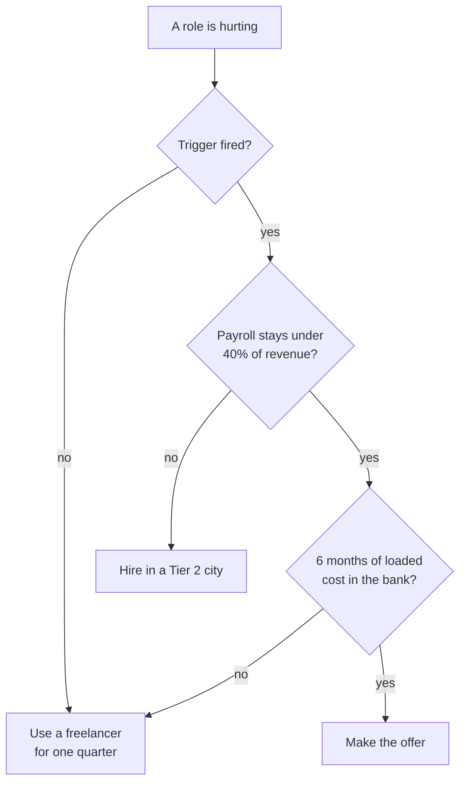

# People Costs and Salary Benchmarks

**In simple words:** This chapter tells you what one person really costs in India in 2026, role by role and city by city. It shows the gap between the salary you promise and the money that leaves the bank, the laws that widen that gap as the team grows, and what the same person costs abroad. Every payroll total matches the BRD plan, with a Minimum and a Maximum around it.

## How to read the money in this chapter

- **CTC** means cost to company: the whole yearly cost of one person, not take-home pay. **Loaded cost** = gross pay + employer statutory dues + insurance + the equipment share. The BRD plan uses loaded cost from Year 2.
- **Tier 2** means Patna, Lucknow, Indore and Jaipur. **Metro** means Delhi NCR, Bengaluru and Pune.
- Every salary figure is an **Estimate**. Salary sites average job posts or self-reported profiles; they are not price lists (see Master Price List).
- Salaries carry no GST. Group health insurance, laptops, tool seats and paid hiring services carry 18% GST, all claimable now that the company is GST-registered. Individual health and term policies have carried no GST since 22 September 2025.
- Provident fund, state insurance, gratuity and bonus carry no GST and can never be claimed back.

> **Rule:** Never budget on the salary. Budget on the loaded cost. In Year 1 the gap is 2%. By Year 3 it is 15% to 19% for a low-wage role.

## The one rule that decides every hire

The canon hires on triggers, not on dates. A role is funded by the revenue it unlocks.

**Figure: Should you hire this person now?**

Three gates, in order: the trigger, the payroll share of revenue, and six months of cash for that person. If any fails, the answer is a freelancer for one quarter. The plan holds payroll at 27% to 39% of revenue, against 50% to 60% for a normal people-heavy SaaS company (Estimate, a common rule of thumb).

## What a person really costs: three worked examples

### Year 1, team of four: the customer success executive

The BRD pays Rs 30,000 a month from April 2027. With fewer than 10 employees, no statutory cost is due.

| Component | Monthly | Yearly | Why this number |
|---|---|---|---|
| Basic and dearness allowance | Rs 15,000 | Rs 1,80,000 | Labour Codes: 50% of pay or more |
| House rent allowance | Rs 7,500 | Rs 90,000 | 50% of basic; saves the employee tax |
| Special allowance | Rs 7,500 | Rs 90,000 | The balancing figure |
| **Gross pay (the BRD's CTC)** | **Rs 30,000** | **Rs 3,60,000** | Top of the Tier 2 band |
| Provident fund, state insurance, gratuity, bonus | Rs 0 | Rs 0 | Thresholds are 10 or 20 people |
| Group health cover, 18% GST inside | Rs 700 | Rs 8,400 | Not in the BRD. Buy it anyway |
| **Real employer cost** | **Rs 30,700** | **Rs 3,68,400** | On-cost is 2.3% of gross |

### Year 2, team of fourteen: the support executive

At 10 people, state insurance and gratuity switch on. Provident fund does not, because that threshold is 20.

| Component | Rate | Monthly | Working |
|---|---|---|---|
| Gross pay | n/a | Rs 18,000 | Basic and DA Rs 9,000, HRA Rs 4,500, special Rs 4,500 |
| Employer state insurance | 3.25% of gross | Rs 585 | 3.25% x Rs 18,000; under the Rs 21,000 limit |
| Gratuity accrual | 4.81% of basic and DA | Rs 433 | 4.81% x Rs 9,000, which is 2.4% of CTC |
| Group health cover, GST inside | n/a | Rs 700 | Pooled SME plan |
| **Real employer cost** | | **Rs 19,718** | On-cost Rs 1,718, or 9.5% of gross |

Yearly cost = Rs 19,718 x 12 = **Rs 2,36,616**.

### Year 3, team of forty: the engineer the plan pays for

The plan's Year 3 engineering loaded cost is Rs 1,40,000 a month. Work backwards to see what salary that buys.

| Component | Rate | Monthly | Working |
|---|---|---|---|
| Gross pay | n/a | Rs 1,21,000 | Rs 14.5 lakh a year: a metro mid to senior developer |
| Provident fund and charges | 13% of PF wages | Rs 3,250 | Basic Rs 60,500 is over the ceiling, so 13% x Rs 25,000 |
| Employer state insurance | n/a | Rs 0 | Gross is far above the Rs 21,000 limit |
| Gratuity accrual | 4.81% of basic and DA | Rs 2,910 | 4.81% x Rs 60,500 |
| Group health, with family | n/a | Rs 1,000 | Rs 12,000 a year, 18% GST inside |
| AI coding seat and dev tools | n/a | Rs 10,000 | The BRD's engineer tool line |
| Laptop share | Rs 70,000 over 36 months | Rs 1,944 | Written off over three years |
| **Loaded cost** | | **Rs 1,40,104** | Matches the plan's Rs 1,40,000 |

> **Founder note:** Only Rs 1,21,000 of that Rs 1,40,000 reaches the person. Rs 19,104 is law, insurance and tools. Quote loaded cost in every budget conversation, never salary.

## When each statutory cost switches on

The four Labour Codes started on 21 November 2025. State rules are still being notified, so confirm every line with the CA before the hire that crosses a threshold.

| Cost | Switches on at | Employer rate | Most it can cost | EduFlow crosses it |
|---|---|---|---|---|
| Provident fund plus insurance and admin charges | 20 employees | 13% of PF wages | Rs 3,250 a month each | Year 3 (14 to 40 people) |
| State insurance (ESI) | 10 people | 3.25% of gross up to Rs 21,000 | Rs 682.50 a month each | Year 2 (4 to 14 people) |
| Gratuity accrual | 10 employees | 4.81% of basic and DA | About 2.4% of CTC | Year 2 |
| Statutory bonus | 20 employees | 8.33% to 20% of wages up to Rs 21,000 | Rs 16,800 a year each | Year 3 |
| Professional tax | State rule | Deducted from pay, not an employer cost | Rs 2,500 a year each | Nil in UP, Delhi, Haryana, Rajasthan |
| Labour welfare fund | State rule | Employer Rs 4.50 to Rs 150 a year | Rs 150 a year each | Nil in Bihar, UP, Rajasthan |

The provident fund ceiling rose from Rs 15,000 to Rs 25,000 on 16 September 2026, the first change since 2014. The BRD was built on Rs 15,000, so from Year 3 each covered person costs at most Rs 3,250 a month instead of Rs 1,950: about 4% more on a Rs 80,000 salary, which the Year 3 loaded cost absorbs.

**Statutory bonus, worked.** Bonus is calculated on Rs 7,000 or the state minimum wage, whichever is higher, not on full pay. At 8.33% on Rs 7,000 that is 8.33% x Rs 7,000 x 12 = **Rs 6,997 a year**. At the maximum 20% it is Rs 16,800. Budget the minimum.

**The worst case, stacked.** A Year 3 support person on Rs 20,000 gross triggers every switch at once: provident fund Rs 1,300 (13% of Rs 10,000) + state insurance Rs 650 (3.25% of Rs 20,000) + gratuity Rs 481 (4.81% of Rs 10,000) + bonus Rs 583 a month + health Rs 700 = Rs 3,714 on top. Real cost = Rs 23,714 a month, **18.6% above the salary**.

> **Warning:** Two rules bite quietly. Fixed-term staff now earn gratuity after one year, not five, so short contracts no longer avoid it. And any allowance above 50% of pay is added back to wages, so cutting basic to save provident fund does not work. Set basic and DA at 50% of CTC in the first offer letter.

## Salary benchmarks for every role

Annual CTC in rupees lakh, written **minimum / typical / high**. "Typical" is the midpoint of the band, not a measured median. Ranges come from Indeed India job posts and PayScale profiles (see Master Price List).

### Customer-facing roles

| Role | Tier 2 | Metro | First hired |
|---|---|---|---|
| Onboarding and customer success executive | 2.4/3.0/3.6 | 3.6/4.8/6.0 | Apr 2027 |
| Support executive | 1.8/2.2/2.6 | 2.6/3.3/4.0 | Year 2 |
| Inside sales executive, fixed pay | 2.2/2.9/3.6 | 3.5/4.8/6.0 | Jul 2027 |
| Field sales executive | 1.8/2.4/3.0 | 2.4/3.2/4.0 | Year 2 |
| Sales manager or sales lead | 4.0/5.5/7.0 | 7.0/9.5/12.0 | Year 2 |

Sales roles get incentives on top of fixed pay, commonly 10% to 30%: on the BRD's Rs 25,000 a month that is Rs 3,000 to Rs 7,500 once the ramp ends. Field sales also needs travel money: 50 km a day x 24 days x Rs 3.50 a km = **Rs 4,200 a month**, reimbursed against a trip log, never paid as salary.

### Product and engineering roles

| Role | Tier 2 | Metro | First hired |
|---|---|---|---|
| Full-stack engineer, 0 to 2 years | 2.5/3.5/4.5 | 4.0/5.5/7.0 | Year 3 |
| Full-stack engineer, 3 to 5 years | 5.0/7.0/9.0 | 8.0/11.5/15.0 | Aug 2027 |
| Full-stack engineer, 6 years and above | 9.0/12.5/16.0 | 15.0/21.5/28.0 | Year 2 |
| QA engineer | 3.0/4.2/5.5 | 5.0/7.0/9.0 | Year 2 |
| UI and UX designer | 3.0/4.0/5.0 | 5.0/7.5/10.0 | Year 2 |
| DevOps or SRE engineer | 5.0/6.5/8.0 | 8.0/11.0/14.0 | Year 3 |
| Engineering manager | 18.0/24.0/30.0 | 30.0/40.0/50.0 | Year 3 |
| Product manager | 10.0/13.0/16.0 | 15.0/20.0/25.0 | Year 3 |

The BRD's first engineer at Rs 70,000 a month is Rs 8.4 lakh a year: above every Tier 2 city average (Lucknow Rs 5.00 lakh, Indore Rs 5.70 lakh, Jaipur Rs 6.57 lakh) and at the floor of the metro mid band. It buys a strong 3-to-5-year developer working remotely from a Tier 2 city.

### Finance, people and admin roles

| Role | Tier 2 | Metro | First hired |
|---|---|---|---|
| Accounts executive | 1.8/2.4/3.0 | 3.0/3.75/4.5 | Year 3 |
| HR executive | 2.0/2.6/3.2 | 3.0/3.75/4.5 | Year 3 |

Before Year 3 the CA retainer does the accounts work and the founder does the people work. An accounts executive at Rs 20,000 a month beats a metro CA retainer only once daily entries fill the day, at about 500 customers.

> **Tip:** The plan's Year 2 general and admin loaded cost of Rs 60,000 a month is far above a Tier 2 accounts or HR executive. It holds only if it also carries CA and legal fees, or if the one hire is a finance lead. Decide which before you make the offer.

## Freelancers, contractors and interns

| Option | Price | What it fits | The limit |
|---|---|---|---|
| Freelance developer, junior | Rs 1,275 to 2,125 an hour | A one-week fix, a migration script | Owns nothing long term |
| Freelance developer, mid | Rs 2,550 to 4,250 an hour | Bridging Aug to Dec 2027 | 4 times the hourly cost of staff |
| Freelance developer, senior | Rs 3,400 to 5,950 an hour | A security review, the AWS move | Never for routine feature work |
| Web development intern | Rs 3,000 to 15,000 a month | Test writing, imports, docs | No production deploy access |
| Digital marketing intern | Rs 4,000 to 20,000 a month | Content, listings, social posts | No customer promises |
| Tele-caller, half day, Patna | Rs 6,000 to 9,000 a month | Lead calling from Feb 2027 | Inside the marketing budget |

**The cost check that settles it.** The Year 3 engineer loads to Rs 1,40,104 a month for about 176 working hours: **Rs 796 an hour**. A mid freelancer at the Rs 3,400 midpoint is 4.3 times dearer. Freelancers win on short, one-off work and lose the moment it repeats every month. Design is the exception: use a freelance designer until Year 2.

A freelancer registered for GST adds 18%, which you claim back; one under the Rs 20 lakh turnover limit charges none. Tax is deducted at source on professional fees before you pay (Estimate: the standard rate is 10%; the CA confirms it, and see the *Legal, Compliance, Tax and Accounting* chapter).

## Benefits, equipment and tool seats

| Item | Price | GST | Rule |
|---|---|---|---|
| Group health, employee only | Rs 2,500 to 6,500 a year | +18% | Buy from the first hire, not the tenth |
| Group health, with spouse and children | Rs 6,000 to 12,000 a year | +18% | The BRD's Rs 700 a month buys the entry plan |
| Group health, with parents | Rs 15,000 to 25,000 a year | +18% | Year 3 and above only |
| Laptop, 16 GB Windows | Rs 62,800 to 77,490 | Inside | The minimum sensible developer machine |
| Laptop, the plan figure | Rs 70,000 per net new person | Inside | What the BRD budgets from Year 2 |
| Laptop, MacBook Air M5 16 GB | Rs 1,49,900 | Inside | Only if the person already works on macOS |
| Tool seat, non-engineer | Rs 2,000 a month | +18% | Email, CRM, password vault, support inbox |
| AI coding seat and dev tools | Rs 10,000 a month | +18% | Start the engineer on Claude Pro at Rs 1,700 |
| Support tools, per support person | Rs 5,000 a month | +18% | In cost of service, not in payroll |

Equipment follows one formula from Year 2: **Rs 70,000 x net new people in the year**.

| Year | Opening team | Closing team | Net new | Equipment cost |
|---|---|---|---|---|
| Year 2 | 4 | 14 | 10 | Rs 7,00,000 |
| Year 3 | 14 | 40 | 26 | Rs 18,20,000 |
| Year 4 | 40 | 95 | 55 | Rs 38,50,000 |
| Year 5 | 95 | 220 | 125 | Rs 87,50,000 |

These are the exact equipment lines in the BRD cash view. Year 1 laptops sit inside the Misc line instead: Rs 35,000 in April, Rs 35,000 in July and Rs 60,000 in August 2027. Tool seats at the end of Year 3 are 14 engineers x Rs 10,000 + 26 others x Rs 2,000 = **Rs 1,92,000 a month**, about Rs 23 lakh a year, inside the BRD's Rs 40 lakh engineering tools line.

## The people budget, level by level

Minimum is the bare bootstrap, Recommended equals the BRD plan, Maximum is the sensible upper end. The rupee figures are the six months from April to September 2027 and tie exactly to the *Months 7 to 12: First Hires and Growth* chapter.

| Item | When to pay | Minimum | Recommended | Maximum | Can you avoid or reduce it? |
|---|---|---|---|---|---|
| Founder pay | Month after MRR Rs 1 lakh | Rs 1,20,000 | Rs 2,70,000 | Rs 4,05,000 | Yes, delay it, but keep 6 months of personal reserve |
| Customer success executive | 30 paying orgs | Rs 1,32,000 | Rs 1,80,000 | Rs 2,70,000 | No past 30 customers. Reduce by hiring in Patna |
| Inside sales executive | MRR Rs 3 lakh | Rs 0 | Rs 75,000 | Rs 1,35,000 | Yes in Year 1. No once MRR passes Rs 5 lakh |
| Full-stack engineer | MRR Rs 4.5 lakh | Rs 60,000 | Rs 1,05,000 | Rs 1,68,000 | A freelancer works only to about MRR Rs 6 lakh |
| **Year 1 salary total** | | **Rs 3,12,000** | **Rs 6,30,000** | **Rs 9,78,000** | |
| Group health cover | From the first hire | Rs 0 | Rs 700 each a month | Rs 2,100 each a month | Reduce with a pooled plan; never skip past 3 people |
| Statutory dues | 10 and 20 people | Rs 0 in Year 1 | 9% to 19% of gross from Year 2 | 19% of gross | No. It is the law |
| Laptop per person | On joining | Rs 62,800 | Rs 70,000 | Rs 1,49,900 | Reduce: 32 GB only for engineers. GST claimable |
| Tool seat, non-engineer | On joining | Rs 0 on free tiers | Rs 2,000 a month | Rs 5,000 a month | Free Zoho Payroll and CRM tiers cover Year 1 |
| AI coding seat | On joining | Rs 1,700 a month | Rs 10,000 a month | Rs 17,000 a month | Move up after two usage-limit hits in a week |
| Hiring channel | Per hire | Rs 0 | Rs 2,000 to 5,000 | Rs 8,260 a month | Yes. Free posts fill Tier 2 junior roles |
| Referral bonus | 6 months after joining | Rs 0 | Rs 15,000 junior, Rs 50,000 senior | Rs 1,00,000 | Yes, but it is the cheapest senior channel |
| Search firm fee | Year 3, head roles | Rs 0 | 8% to 12% of first-year CTC | 15% | Yes below a function head |

**How the three Year 1 columns are built.** Minimum = founder Rs 20,000 x 6 + customer success Rs 22,000 x 6 + no sales hire + freelance engineer Rs 30,000 x 2 = Rs 1,20,000 + Rs 1,32,000 + Rs 60,000 = Rs 3,12,000. Recommended = founder (Rs 30,000 x 3 + Rs 60,000 x 3) + customer success Rs 30,000 x 6 + inside sales Rs 25,000 x 3 + engineer Rs 70,000 x 1.5 = Rs 2,70,000 + Rs 1,80,000 + Rs 75,000 + Rs 1,05,000 = Rs 6,30,000. Maximum = founder (Rs 45,000 x 3 + Rs 90,000 x 3) + metro customer success Rs 45,000 x 6 + inside sales Rs 45,000 x 3 + senior engineer Rs 1,12,000 x 1.5 = Rs 4,05,000 + Rs 2,70,000 + Rs 1,35,000 + Rs 1,68,000 = Rs 9,78,000.

## What people cost outside India

The canon opens the UAE in Year 2 and pilots the USA and Australia in Year 3. One local hire changes the shape of the payroll line.

| Country | Pay used for planning | Pay in Rs a year | On top of pay | Loaded Rs a month | Times a Tier 2 hire |
|---|---|---|---|---|---|
| India, Tier 2 | Rs 3.6 lakh | Rs 3,60,000 | Health only | Rs 30,700 | 1.0 |
| India, metro | Rs 6.0 lakh | Rs 6,00,000 | PF, gratuity, health | Rs 55,453 | 1.8 |
| UAE, Dubai | AED 1,56,634 | Rs 36,02,582 | Visa, end-of-service | Rs 3,16,154 | 10.3 |
| USA | US$80,000 | Rs 68,00,000 | About 25% taxes and benefits | Rs 7,08,333 | 23.1 |
| Australia | A$1,10,000 | Rs 61,60,000 | About 12% superannuation | Rs 5,74,933 | 18.7 |

Working, at the canon rates of US$1 = Rs 85, A$1 = Rs 56 and AED 1 = Rs 23:

- **UAE.** Salary AED 13,053 a month x 23 = Rs 3,00,219. End-of-service benefit about 6% of basic (Estimate: UAE law gives roughly 21 days of basic pay a year for the first five years) = Rs 10,808. Visa AED 3,500 + slot AED 1,850 = Rs 1,23,050, over 24 months = Rs 5,127. Total Rs 3,16,154. Medical cover is compulsory for a visa holder and is quoted separately by the free zone.
- **USA.** US$80,000 base x 1.25 for payroll taxes and health insurance (Estimate: 7.65% Social Security and Medicare, plus unemployment insurance and a health plan) = US$1,00,000 a year = Rs 85,00,000, or Rs 7,08,333 a month. An Employer of Record avoids running payroll in each state for a monthly fee (Estimate: US$500 to US$800; no vendor page was checked, so get a written quote).
- **Australia.** A$1,10,000 x 1.12 for superannuation (Estimate: about 12% of ordinary pay; confirm the rate with the local accountant) = A$1,23,200 a year = Rs 68,99,200, or Rs 5,74,933 a month. A resident director service costs A$6,000 + GST, about Rs 3,36,000 a year, on top (see Master Price List).

> **Rule:** One Dubai account executive costs the same as ten Tier 2 support people, and one US customer success manager twenty-three. Sell abroad through partners until the country's own revenue covers its own payroll.

## Payroll by year

The BRD works out payroll with one formula, so you can change any input.

> **Rule:** Payroll in a year = for each function, average headcount x average loaded monthly cost x 12. Average headcount = (opening + closing) divided by 2.

| Function | Loaded cost Y2 | Loaded cost Y3 | Loaded cost Y4 | Loaded cost Y5 |
|---|---|---|---|---|
| Product and engineering | Rs 1,00,000 | Rs 1,40,000 | Rs 1,70,000 | Rs 2,00,000 |
| Sales and marketing | Rs 55,000 | Rs 80,000 | Rs 1,00,000 | Rs 1,20,000 |
| Customer success and support | Rs 35,000 | Rs 50,000 | Rs 65,000 | Rs 80,000 |
| General and admin | Rs 60,000 | Rs 90,000 | Rs 1,20,000 | Rs 1,40,000 |

Worked check for engineering in Year 3: the team goes from 5 to 14, so (5 + 14) divided by 2 = 9.5 people x Rs 1,40,000 x 12 = **Rs 159.6 lakh**, shown as Rs 160 lakh.

| Payroll, Rs lakh | Year 1 | Year 2 | Year 3 | Year 4 | Year 5 |
|---|---|---|---|---|---|
| Product and engineering | 2.40 | 39 | 160 | 449 | 1,152 |
| Sales and marketing | 2.10 | 21 | 91 | 300 | 864 |
| Customer success and support | 1.80 | 8 | 33 | 109 | 336 |
| General and admin | 0 | 4 | 27 | 94 | 244 |
| **Recommended total** | **6.30** | **72** | **311** | **952** | **2,596** |

Year 3 check: 160 + 91 + 33 + 27 = 311. Year 5 check: 1,152 + 864 + 336 + 244 = 2,596. In Year 1 the founder counts as half engineering and half sales.

The other two levels keep the same headcount and change only the pay. Minimum hires in Tier 2 cities at the bottom of the band, with two of every five roles on contract: **Minimum = plan x 0.70**. Maximum pays metro rates at the top of the band with full family benefits: **Maximum = plan x 1.35**. Year 1 is the exception, because its Minimum drops two hires outright.

| Payroll, Rs lakh | Year 1 | Year 2 | Year 3 | Year 4 | Year 5 |
|---|---|---|---|---|---|
| Minimum | 3.12 | 50 | 218 | 666 | 1,817 |
| **Recommended (the plan)** | **6.30** | **72** | **311** | **952** | **2,596** |
| Maximum | 9.78 | 97 | 420 | 1,285 | 3,505 |
| Total revenue | 23.25 | 190 | 793 | 2,609 | 7,533 |
| Recommended as a share of revenue | 27% | 38% | 39% | 36% | 34% |
| Maximum as a share of revenue | 42% | 51% | 53% | 49% | 47% |

Worked: Year 3 Minimum = 311 x 0.70 = 217.7, shown as 218. Year 5 Maximum = 2,596 x 1.35 = 3,504.6, shown as 3,505, and 3,505 divided by 7,533 = 46.5%, shown as 47%.

> **Warning:** The BRD's separate stress case keeps the pay and makes the team 50% larger: payroll x 1.5, so Rs 3,894 lakh in Year 5, and the EBITDA margin falls from 19% to about 2%. If bigger team and higher pay happened together, payroll would pass 70% of revenue and the company would need outside money every year.

## What an ESOP costs in cash

An ESOP (employee stock option pool) is a block of shares kept aside for staff. The BRD sets it at 10% to 12%. Options are not a cash cost, but running the scheme is.

| Item | When | Price | Note |
|---|---|---|---|
| Scheme drafting and board resolutions | Once, before the first grant | Rs 50,000 to Rs 1,50,000 | Estimate: between the Rs 25,000 to Rs 75,000 legal-document pack and the Rs 75,000 to Rs 3 lakh seed agreement fee |
| Registered valuer report | Every year and every grant | From Rs 25,000 | Still needed after angel tax ended |
| Merchant banker valuation | Only with foreign investors | Rs 65,000 to Rs 2 lakh | Not needed before the seed round |
| ROC filings through a CA or CS | Per resolution and allotment | Rs 2,500 to Rs 7,000, plus Rs 400 for PAS-3 | Allotment return within 15 days |
| Part-time company secretary | Yearly from Year 2 | Rs 8,000 to Rs 20,000 | Not required by law yet |

One-time set-up: Rs 50,000 + Rs 25,000 = **Rs 75,000** at the low end, Rs 1,50,000 + Rs 75,000 = **Rs 2,25,000** at the high end. Yearly after that: valuation Rs 25,000 + filings and company secretary Rs 10,000 to Rs 25,000 = **Rs 35,000 to Rs 50,000**.

**The non-cash charge.** In the BRD's seed case the company has 10,00,000 shares at Rs 160 each, with 1,00,000 in the pool. At an exercise price of Rs 10, the accounting charge is Rs 150 per option: 1,00,000 x Rs 150 = **Rs 1.5 crore**, spread over four years of vesting, about Rs 37.5 lakh a year of book cost with no cash leaving the bank. It cuts reported profit, so plan for it before promising an EBITDA number.

> **Warning:** Never promise equity in a conversation. Until the board approves a scheme and issues a grant letter, a verbal promise is a future dispute, not a benefit. Start with Rs 15 lakh of authorised capital at Rs 1 a share: raising it to Rs 1 crore later costs about Rs 1,70,000 in government fees.

## Hiring mistakes that cost the most

| Mistake | What it costs | The rule that stops it |
|---|---|---|
| Hiring before the trigger fires | The engineer hired 16 April 2027 instead of 16 August costs 4 extra months x Rs 70,000 = Rs 2,80,000, 44% of the Year 1 salary budget | No trigger, no hire. Read last month's closing MRR |
| Hiring a senior when a mid will do | A metro senior at Rs 20 lakh instead of the plan's Rs 8.4 lakh costs Rs 11.6 lakh more a year | Hire the band the work needs |
| Paying metro rates for Tier 2 work | Five engineers at metro midpoints: 5 x (Rs 11.5 lakh minus Rs 7 lakh) = Rs 22.5 lakh a year | Pay for the city the person lives in, plus a remote premium |
| Keeping a wrong hire for six months | 6 x Rs 1,40,000 = Rs 8,40,000 for a Year 3 engineer, plus hiring again | A written 90-day goal. Miss it, end it inside probation |
| Cutting basic below 50% to save provident fund | Back contributions with damages and interest | Basic and DA at 50% of CTC in the first offer letter |
| Using fixed-term contracts to avoid gratuity | Gratuity vests at one year for fixed-term staff, so the cost returns, plus a dispute | Accrue gratuity from the tenth employee, whatever the contract says |
| Missing a statutory switch-on | Crossing 10 people without state insurance, or 20 without provident fund: back dues plus damages | The CA checks headcount on the first Monday of each month |
| Paying a search firm for a junior | 8% to 12% of Rs 8.4 lakh is Rs 67,200 to Rs 1,00,800, for a role a free Indeed post fills | Search firms only for a function head, from Year 3 |
| Budgeting salary instead of loaded cost | 15% to 19% of the payroll line missing every month from Year 3 | Every budget line says loaded cost, with the build-up shown |

> **Best practice:** Track payroll divided by revenue every month. The plan says 27%, 38%, 39%, 36% and 34% in Years 1 to 5. If it passes 45% for two months in a row, freeze hiring that week.

## Sources

The overseas pay figures are not in the Master Price List. They were read as web-search summaries on 22 September 2026, so all three are Estimates.

- ERI SalaryExpert, "Account Executive Salary in Dubai, United Arab Emirates" (2026), https://www.salaryexpert.com/salary/job/account-executive/united-arab-emirates/dubai
- ZipRecruiter, "SaaS Customer Success Manager Salary" (September 2026), https://www.ziprecruiter.com/Salaries/Saas-Customer-Success-Manager-Salary
- Scalerr, "Customer Success Manager Salary Benchmarks 2026", https://scalerr.com/customer-success-manager-salary.html

## Key takeaways

- Budget loaded cost, never salary. The gap is 2.3% in Year 1, 9.5% in Year 2 and up to 18.6% in Year 3. The plan's Rs 1,40,000 engineer takes home Rs 1,21,000; the rest is law, insurance and tools.
- Statutory costs switch on at headcount, not revenue: state insurance and gratuity at 10 people (Year 2), provident fund and bonus at 20 (Year 3). The new Rs 25,000 ceiling costs up to Rs 3,250 a month per covered person.
- Tier 2 pay is the bootstrap bet. A mid full-stack engineer costs Rs 5 to 9 lakh in Patna or Lucknow against Rs 8 to 15 lakh in a metro. The BRD's Rs 8.4 lakh buys metro skill at a Tier 2 cost of living.
- The Year 1 salary budget is Rs 3,12,000 at Minimum, Rs 6,30,000 at Recommended and Rs 9,78,000 at Maximum, all tying to the *Months 7 to 12: First Hires and Growth* chapter.
- Payroll by year is Rs 6.30 lakh, Rs 72 lakh, Rs 311 lakh, Rs 952 lakh and Rs 2,596 lakh: 27% to 39% of revenue. Minimum is the plan x 0.70 and Maximum x 1.35, which hits 53% of revenue in Year 3.
- One Dubai hire costs the same as 10 Tier 2 people, one US hire the same as 23. Use partners abroad until a country's revenue pays its own payroll.
- An ESOP costs Rs 75,000 to Rs 2,25,000 once and Rs 35,000 to Rs 50,000 a year in cash, plus about Rs 37.5 lakh a year of non-cash charge on a 10% pool. Never promise equity before a board-approved scheme exists.
