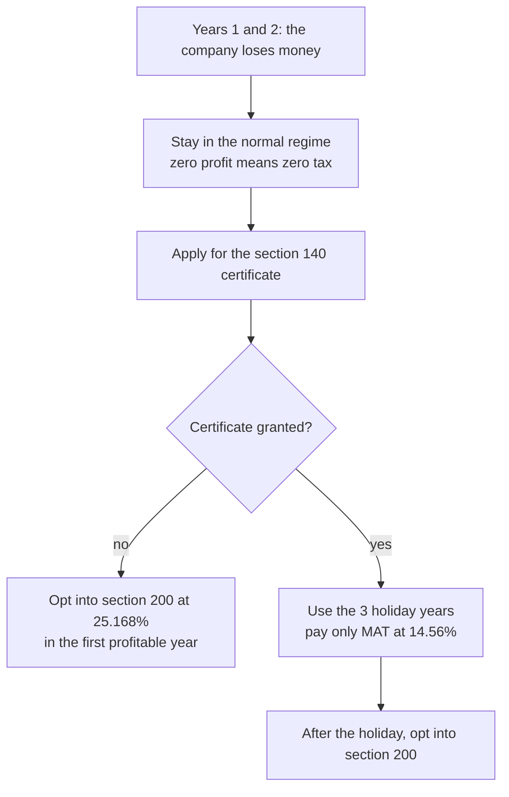

# Legal, Compliance, Tax and Accounting Costs

**In simple words:** This chapter is the price of staying legal after the company exists. It gives you a yearly calendar of every filing, what each one costs, and what happens if you miss it. It explains GST, income tax and TDS in plain language, with the arithmetic shown. The Recommended bill is Rs 2,31,000 in Year 1 and Rs 1.50 crore in Year 5, which is 9.9% of revenue falling to 2.0%.

## What this chapter covers and what it does not

*Before Day 1: One-Time Setup Costs* buys the company, the GST number and the trademark. This chapter is what those things cost to keep alive every year afterwards, plus the security tests, certificates and insurance that large buyers ask for.

Two things stay outside. Foreign entities in the UAE, USA and Australia are priced in *International Expansion Costs*. Payment gateway fees and message costs are in *Messaging and Payment Costs*.

Three budget levels are used everywhere, as in the rest of this guide.

- **Minimum:** free tiers, the founder files what he can himself, only what is legally unavoidable.
- **Recommended:** the BRD plan, number for number.
- **Maximum:** the sensible upper end. Above it, the money is waste.

> **Rule:** "+ GST" means 18% is added on top. "with GST" means the 18% is already inside the number. Government fees (MCA, IP India, stamp duty) carry no GST at all. Once the GSTIN exists, the 18% on a CA, lawyer, insurance or software bill comes back as input tax credit, so the real cost of those lines is the base fee.

## The financial year is not the business year

The canon business Year 1 runs October 2026 to September 2027. The company's financial year runs 1 April to 31 March. These never line up, and every date below follows the financial year.

The company is incorporated in October 2026, so its first financial year is a six-month stub ending 31 March 2027. Its first audit, first ITR-6 and first annual filings all belong to that stub, and the MCA forms fall due in October and November 2027, which is business Year 2. The BRD pays for that work in August 2027, inside Year 1. That timing is right: the work happens before the deadline.

## The yearly compliance calendar

Government fees below use the Rs 15,00,000 authorised capital set in *Before Day 1: One-Time Setup Costs*, which puts every MCA form in the Rs 5 lakh to 25 lakh slab at Rs 400.

| When | What is due | Form | Government fee | If late |
|---|---|---|---|---|
| 7th of every month | Pay the TDS deducted last month | Challan 281 | The tax | Interest 1% to 1.5% a month |
| 11th of every month | Sales invoices, monthly filer | GSTR-1 | Rs 0 | Rs 50 a day, cap Rs 2,000 |
| 13th of a quarter's first two months | B2B invoices under QRMP | IFF | Rs 0 | Customers cannot claim credit |
| 20th of every month | GST summary and payment | GSTR-3B | The tax | Rs 50 a day plus 18% a year |
| 25th of a quarter's first two months | GST payment under QRMP | PMT-06 | The tax | Interest at 18% a year |
| 22nd or 24th after a quarter | Quarterly GST return under QRMP | GSTR-3B | The tax | Rs 50 a day, cap Rs 2,000 |
| 31 May | TDS return, January to March | 24Q, 26Q | Rs 0 | Rs 200 a day |
| 15 June | Form 16 to every staff member | Form 16 | Rs 0 | Rs 100 a day per person |
| 15 Jun, 15 Sep, 15 Dec, 15 Mar | Advance tax 15%, 45%, 75%, 100% | Challan 280 | The tax | About 1% a month |
| 30 June | Loans and deposits, including director loans | DPT-3 | Rs 400 | Daily penalty |
| 30 June, every third year | Director KYC | DIR-3 KYC | Rs 0 | Rs 5,000, number deactivated |
| 15 July | Foreign assets and liabilities | FLA return | Rs 0 | Counts as a FEMA breach |
| 31 July | TDS return, April to June | 24Q, 26Q | Rs 0 | Rs 200 a day |
| By 30 September | Sign audited accounts, hold the AGM | None | Rs 0 | Company-law penalty |
| 15 October | TDS return, July to September | 24Q, 26Q | Rs 0 | Rs 200 a day |
| Within 15 days of the AGM | Auditor for the next five years | ADT-1 | Rs 400 | 2 to 12 times the fee |
| About 30 October | Financial statements to the MCA | AOC-4 | Rs 400 | Rs 100 a day, no cap |
| 31 October | Company income tax return | ITR-6 | Rs 0 | Rs 5,000 late fee |
| About 29 November | Annual return to the MCA | MGT-7A or MGT-7 | Rs 400 | Rs 100 a day, no cap |
| 30 November | Last day to claim last year's input credit | GSTR-3B | Rs 0 | The credit is gone |
| 31 December | Yearly report on a foreign subsidiary | APR | Rs 0 | Rs 7,500 plus interest |
| 15 January | TDS return, October to December | 24Q, 26Q | Rs 0 | Rs 200 a day |
| 31 March | Renew the export undertaking for next year | RFD-11 (LUT) | Rs 0 | Exports need IGST paid first |

Government fees for a normal year are small: AOC-4 Rs 400 + MGT-7A Rs 400 + DPT-3 Rs 400 = Rs 1,200, and ADT-1 Rs 400 once every five years. The money goes to the people who prepare the forms, not to the government.

> **Best practice:** Put all twenty-three rows in one shared calendar with a reminder seven days before each date, and give the CA edit access. Every penalty in this chapter is a calendar failure, not a money failure.

## The audit, the tax return and the accountant

Every Private Limited company is audited every year, even with zero sales. There is no small-company exemption today. A 2026 amendment bill may create one, but it is not law, so the budget keeps the audit.

| Revenue in the financial year | Online bundle, with GST | Local CA route, with GST | First reached in |
|---|---|---|---|
| Up to Rs 50 lakh | Rs 18,879 | Rs 17,110 to 46,020 | FY 2026-27 |
| Rs 50 lakh to Rs 1 crore | Rs 22,419 | Rs 25,000 to 55,000 (Estimate) | FY 2027-28 |
| Rs 1 crore to Rs 10 crore | Rs 31,859 | Rs 40,000 to 90,000 (Estimate) | FY 2028-29 |
| Above Rs 10 crore, tax audit added | Not offered | Rs 1.5 to 4 lakh (Estimate) | FY 2030-31 |

The online bundle is EZTax at Rs 15,999, Rs 18,999 and Rs 26,999 plus 18% GST, and it covers the audit, ITR-6, AOC-4, MGT-7A, DIR-3 KYC and DPT-3 together (see Master Price List). The local CA route adds up three separate fees: audit Rs 8,000 to 40,000, ITR-6 Rs 4,000 to 12,000 and ROC filing Rs 2,500 to 7,000, so Rs 14,500 to Rs 59,000 plus GST, which is Rs 17,110 to Rs 69,620 with GST. All of that GST is claimable.

The tax audit is a second, separate audit under the income tax law. It starts above Rs 1 crore of turnover, but the limit rises to Rs 10 crore when cash receipts and cash payments are each 5% or less of the total. EduFlow collects by UPI, card and netbanking, so the Rs 10 crore limit applies and the tax audit starts around FY 2030-31.

| Stage | What the CA does | Fee a month, + GST | Cost a year, with GST |
|---|---|---|---|
| Oct 2026 to Mar 2027, no staff | Books, GST returns, one director | Rs 5,000 | Rs 70,800 |
| Apr to Jun 2027, 2 people | Adds payroll and TDS returns | Rs 7,000 | Rs 99,120 |
| Jul 2027 to Mar 2028, 4 people | Adds Form 16, export invoices | Rs 9,000 | Rs 1,27,440 |
| Year 2, 14 people | Adds the subsidiary and consolidation | Rs 20,000 | Rs 2,83,200 |
| Year 3, 40 people | Adds transfer pricing and three GSTINs | Rs 30,000 | Rs 4,24,800 |
| Years 4 and 5 | In-house finance head; CA for audit and tax | Rs 40,000 to 60,000 | Rs 5,66,400 to 8,49,600 |

Arithmetic for the Year 2 row: Rs 20,000 x 12 = Rs 2,40,000, plus 18% GST of Rs 43,200, which is Rs 2,83,200 billed and Rs 2,40,000 of real cost after the credit. The BRD plans Rs 5,000 a month in Year 1, which sits inside the Tier 2 market band of Rs 3,000 to Rs 8,000. Delhi NCR would be Rs 5,000 to Rs 15,000.

### The company secretary

A whole-time company secretary is required only at Rs 10 crore of **paid-up** capital. After the Rs 4 crore seed round the company has 12,50,000 shares of Rs 1, so paid-up capital is Rs 12,50,000 and the rest of the money sits in securities premium. EduFlow therefore never needs a whole-time CS in the five plan years. A part-time practising CS for minutes, registers and board papers costs Rs 8,000 to Rs 20,000 a year today.

Two things change that. An MGT-8 certificate from a practising CS is needed at Rs 10 crore of paid-up capital **or** Rs 50 crore of turnover, and Year 5 revenue of Rs 75.33 crore crosses the turnover trigger (Estimate).

> **Warning:** The second change is bigger and easy to miss. A company that has a subsidiary is not a "small company", whatever its size (Companies Act section 2(85)). The day the UAE subsidiary is created in Year 2, EduFlow loses MGT-7A, must file the full MGT-7, must add a cash flow statement and consolidated accounts, must hold four board meetings a year instead of two, and loses the 50% penalty concession. Budget Rs 50,000 to Rs 1,50,000 a year more in audit and CS fees from that day (Estimate, from the extra work involved). Confirm it with your CA before the entity is set up.

## GST in simple words

GST at 18% is added to every EduFlow subscription. The canon prices exclude tax, so the customer pays more than the plan price.

| Plan | Price in the canon | GST at 18% | What the customer pays |
|---|---|---|---|
| Growth, monthly | Rs 2,499 | Rs 449.82 | Rs 2,948.82 |
| Growth, yearly | Rs 24,990 | Rs 4,498.20 | Rs 29,488.20 |
| Pro, yearly | Rs 59,990 | Rs 10,798.20 | Rs 70,788.20 |
| Enterprise, from | Rs 14,999 a month | Rs 2,699.82 | Rs 17,698.82 |

That 18% is not a cost to EduFlow. It is somebody else's money passing through the bank account. But it matters twice.

First, it is a cash-flow trap. You hold it for up to three months, and it is easy to mistake for profit. The BRD bootstrap rule is exact: own cash = bank balance minus GST due minus customer advances.

Second, it is a real price rise for one half of the market. Sharma Classes, a coaching institute above the Rs 20 lakh registration limit, claims the Rs 4,498 back, so its real price stays Rs 24,990. Bright Future Public School provides exempt education services, is usually not registered, and cannot claim it, so its real price is Rs 29,488.20. Quote schools the price with GST from the first call, or the sale dies at the accountant's desk.

### A worked GST month

September 2027, the last month of Year 1, with closing MRR of Rs 6,00,000.

| Step | Working | Amount |
|---|---|---|
| GST collected on subscriptions | Rs 6,00,000 x 18% | Rs 1,08,000 |
| Credit on rupee invoices in the month | Rs 1,08,000 x 18 / 118 | Rs 16,475 |
| Reverse-charge tax on foreign bills | Rs 74,200 x 18% | Rs 13,356 |
| Same reverse-charge tax claimed back | The same month's GSTR-3B | minus Rs 13,356 |
| **Net GST paid in cash by 20 October** | 1,08,000 minus 16,475 | **Rs 91,525** |

The rupee invoices are the BRD September lines that carry Indian GST: marketing Rs 73,000, legal and CA Rs 15,000 and misc Rs 20,000. Both that figure and the output GST land on Rs 1,08,000 by chance; one is 18% of revenue, the other is the month's rupee-billed spend. Reverse charge nets to zero, so it never appears in the final number.

### Input tax credit, reverse charge and OIDAR

| What you buy | Bill | How the tax works | Real cost |
|---|---|---|---|
| Claude Max 20x, billed in US dollars | Rs 17,000 | Pay Rs 3,060 IGST in cash, claim it the same month | Rs 17,000 |
| Vercel Pro, billed in US dollars | Rs 1,700 | Pay Rs 306 IGST, claim it back | Rs 1,700 |
| CA retainer, Indian invoice | Rs 9,000 + Rs 1,620 | Normal credit in GSTR-2B | Rs 9,000 |
| Advocate's fee, Indian invoice | Rs 25,000 | Reverse charge Rs 4,500, claimed back | Rs 25,000 |
| Laptop, Indian retail invoice | Rs 80,000 with GST | Credit = 80,000 x 18 / 118 | Rs 67,797 |
| Claude with no GSTIN on the account | Rs 17,000 + Rs 3,060 | Vendor charges OIDAR tax; nothing to claim | Rs 20,060 |

The last row is the expensive mistake. Without the GSTIN on the vendor account, the foreign vendor charges the 18% itself and you cannot recover it: Rs 3,060 a month, or Rs 36,720 a year, on the Claude plan alone.

Two credit rules decide whether the money comes back. The supplier must have reported the invoice, so it shows in your GSTR-2B. And the claim must be made by 30 November after the financial year ends. Miss that date and the credit is gone for ever.

### Monthly filing or QRMP

| Point | Monthly filing | QRMP |
|---|---|---|
| Who can use it | Anyone | Turnover up to Rs 5 crore |
| Paperwork a year | 24 returns | 8 returns plus 8 challans |
| Customer sees the invoice | Every month | Only if the IFF is filed by the 13th |
| CA work | Rs 1,500 to 4,000 a month | About one third of that |
| When EduFlow must switch | Above Rs 5 crore turnover | Until then |

QRMP with the IFF filed every month is the right choice from registration. At about Rs 500 a return, monthly filing costs Rs 12,000 a year and QRMP costs Rs 4,000, so the saving is about Rs 8,000 a year (Estimate). Skipping the IFF to save a little more is false economy: a GST-registered coaching institute waits up to three months for its credit and will say so.

Two more free filings matter. GSTR-9, the annual return, is optional up to Rs 2 crore of turnover, so it costs nothing until Year 3. The LUT (Form RFD-11) is free, is filed once a financial year, and lets UAE, USA and Australia invoices leave at 0% without paying IGST first.

## Income tax for a new company

**Figure: Choosing the income tax route**

The choice is one-way, so it is made once and it is made late. Section 200 (the old section 115BAA) cannot be reversed after it is chosen, and choosing it blocks the startup tax holiday for ever. While the company is loss-making the rate is irrelevant, so there is nothing to gain by choosing early.

| Route | Rate on taxable profit | Minimum tax | The catch |
|---|---|---|---|
| Section 200, old 115BAA | 25.168% | None | One-way; blocks the holiday |
| Normal regime | 26% up to Rs 1 crore of profit | MAT 14.56% of book profit | Higher rate, surcharge rises with profit |
| Normal plus section 140 holiday | 0% for three chosen years | MAT 14.56% | Needs a separate board certificate |

The section 140 holiday (the old section 80-IAC) exempts 100% of profit for any three consecutive years out of the first ten. It needs an Inter-Ministerial Board certificate on top of DPIIT recognition. About 3,700 certificates exist against 2.07 lakh recognised startups, which is about 1.8%, and roughly half of applications are approved. Apply, but do not put the saving in the plan.

Worked example, Year 3 EBITDA of Rs 85 lakh:

1. Section 200: Rs 85,00,000 x 25.168% = Rs 21,39,280.
2. Holiday year with MAT: Rs 85,00,000 x 14.56% = Rs 12,37,600.
3. Saving in that year = Rs 21,39,280 minus Rs 12,37,600 = Rs 9,01,680.

Over the three best years, Years 3, 4 and 5, EBITDA is Rs 85 lakh + Rs 334 lakh + Rs 1,416 lakh = Rs 1,835 lakh. The saving is Rs 18,35,00,000 x (25.168% minus 14.56%) = Rs 1,94,65,680, about Rs 1.95 crore. MAT is now a final tax with no credit carried forward, so the holiday saves about 10.6 points, not 25.

The BRD books income tax as 25% of positive EBITDA: Rs 3 lakh, Rs 21 lakh, Rs 84 lakh and Rs 354 lakh in Years 2 to 5, Rs 462 lakh in total. Section 200 on the same EBITDA of Rs 1,847 lakh gives Rs 464.85 lakh. The gap over five years is Rs 3 lakh, or 0.6%, so the BRD's simplification holds.

> **Warning:** EBITDA is not taxable profit. Depreciation on laptops and servers, disallowed expenses and carried-forward losses all change it, and carried-forward losses alone will wipe out the Year 2 tax. Treat every tax number in this guide as a planning figure and let the CA compute the real one.

Angel tax is no longer a risk. The old section 56(2)(viib) was removed for every class of investor from FY 2024-25. A registered valuer's report costing Rs 25,000 upwards is still needed for the seed round under the Companies Act, and a merchant banker's report at Rs 65,000 to Rs 2 lakh is needed if a foreign investor subscribes.

### TDS on what you pay out

TDS means you hold back part of a payment and send it to the tax department yourself. It starts with the first salary or the first large contractor bill.

| Payment | Rate | Practical trigger |
|---|---|---|
| Salary | Slab rate of the person | Taxable salary, from April 2027 |
| Contractor or freelancer | 1% to an individual, 2% to a company | A single bill or a yearly total |
| Professional fee: CA, lawyer, designer | 10% | A yearly total with one vendor |
| Rent on an office | 10% | Monthly rent above the limit |
| Commission to a channel partner | 5% | A yearly total |

Thresholds move with every Finance Act, so the CA sets them; the rates above are the stable part (Estimate). Worked example on the CA's own bill at Rs 9,000 a month: GST adds Rs 1,620, TDS at 10% deducts Rs 900, so the cheque is Rs 9,000 + Rs 1,620 minus Rs 900 = Rs 9,720, and Rs 900 goes to the government by the 7th. The late fee on a TDS return is Rs 200 a day, capped at the TDS in that quarter.

## Legal work, contracts and the trademark

| Stage | What you buy | Cost | Tax treatment |
|---|---|---|---|
| Nov 2026 | Terms, privacy policy, DPA, parent consent | Rs 25,000 to 75,000 one-time | 18% reverse charge, claimable |
| Before May 2027 | DPDP notices, consent wording, retention policy | Rs 40,000 to 75,000 one-time | 18% reverse charge, claimable |
| Year 1 to 2 | School contract, reseller and employment templates | Rs 10,000 to 25,000 each (Estimate) | 18% reverse charge |
| Year 2 | Seed round: term sheet, SHA, SSA, valuation, filings | Rs 1.5 to 5 lakh one-time | 18% reverse charge |
| Year 3 onward | Retainer for contracts, tenders and disputes | Rs 25,000 to 50,000 a month (Estimate) | 18% reverse charge |

Lawyer fees from an individual advocate or a law firm carry 18% GST under reverse charge, which means EduFlow pays the tax and claims it back. CA and CS fees are normal forward charge: the 18% is on their invoice and is claimed in the usual way.

The trademark has a long tail. The Rs 4,500 a class filing fee is paid once, but most applications draw an examination report, so keep Rs 3,000 to Rs 7,500 for a reply in Year 1 and Rs 5,000 to Rs 15,000 for a hearing if the reply is not accepted. Opposing a look-alike mark costs Rs 2,700 a class in government fees. Renewal is Rs 9,000 a class every ten years, with no small-entity rate, so classes 9 and 42 cost Rs 18,000 in government fees in October 2036 plus Rs 2,000 to Rs 5,000 a class in attorney fees. Late renewal adds a Rs 4,500 surcharge.

## Security, data protection and insurance by stage

| Stage | What to buy | Recommended | Why at that point |
|---|---|---|---|
| Dec 2026 | Freelance tenant-isolation and login test | Rs 20,000 | Children's data goes live in January |
| Before May 2027 | DPDP notices and consent work | Rs 50,000 | Parental consent duties begin |
| Year 2 | Formal web and API VAPT with a report | Rs 1,00,000 | The first school group asks for one |
| Year 2 | Cyber insurance, Rs 1 crore cover | Rs 60,000 | Groups ask for the certificate |
| Year 2 | D&O insurance, Rs 1 crore cover | Rs 50,000 | Investors ask before taking a board seat |
| Year 3 | ISO 27001, first year | Rs 3,00,000 | UAE schools and large Indian groups |
| Year 3 | SOC 2 Type 2 with an automation platform | Rs 7,00,000 | USA pilots will not start without it |
| Year 3 | US and Australia privacy counsel | Rs 2,40,000 | FERPA, COPPA and Privacy Act reviews |

The December 2026 test at Rs 20,000 is a real check of tenant isolation and login, but it is not an accepted VAPT report. Indian vendors say anything under about Rs 25,000 is an automated scan export. The report a school group will accept costs Rs 40,000 to Rs 1.5 lakh; Cybersecify's startup package is Rs 74,999 for one scope with a retest.

ISO 27001 splits into a consultant at Rs 1 to 2 lakh and a certification body audit at Rs 70,000 to Rs 1 lakh, so Rs 1.7 to 3 lakh in year one. Surveillance audits are Rs 60,000 to Rs 80,000 in years two and three, and recertification is Rs 1.5 to 2.5 lakh in year four, giving Rs 4 to 6.5 lakh over three years including tooling. SOC 2 Type 2 from an Indian-staffed CPA firm is Rs 3 to 6 lakh a report, and the whole first-year path with a platform, the audit, a pentest and staff time is Rs 7 to 14 lakh. Use an Indian compliance platform at Rs 2 to 5 lakh a year; Vanta at a median of Rs 17 lakh and Drata at Rs 21.3 lakh are US-sized contracts.

Cyber insurance is Rs 25,000 to Rs 70,000 a year for Rs 50 lakh to Rs 1 crore of cover in the broker market, and Mitigata publishes an offer from Rs 95,000 for Rs 1 crore. D&O insurance for an Indian startup or SME starts at about Rs 25,000 to Rs 80,000 a year for Rs 1 crore of cover, and roughly Rs 2.5 to 5 lakh for each US$1 million of cover at larger limits (Estimate; web search, September 2026, see Sources). Both premiums carry 18% GST, which is claimable.

GDPR itself costs nothing in the plan years, because there is no EU market on the roadmap. The canon follows GDPR principles as a baseline, which is a design decision inside the product, not a bill.

> **Rule:** Never buy a certificate before a named buyer asks for it in writing. ISO 27001 and SOC 2 together cost Rs 10 to 20 lakh in the first year. The BRD sets aside Rs 20 lakh of the seed round for exactly this, from April 2028. That is the right month, not sooner.

## The yearly running bill at Year 1 and Year 2 size

| Item | When to pay | Minimum | Recommended | Maximum | Can you avoid or reduce it? |
|---|---|---|---|---|---|
| CA retainer (monthly, + GST, claimable) | Every month | Rs 36,000 | Rs 60,000 | Rs 96,000 | Partly. Tier 2 CA, clean books, QRMP |
| Audit, ITR-6 and ROC bundle (yearly, with GST) | August | Rs 18,879 | Rs 35,000 | Rs 69,620 | No. Every company is audited |
| ROC government fees (yearly, no GST) | Oct to Nov | Rs 1,200 | Rs 1,600 | Rs 1,600 | No. Rs 400 a form |
| Part-time company secretary (yearly, + GST) | On engagement | Rs 0 | Rs 0 | Rs 20,000 | Yes, until a subsidiary exists |
| Compliance extras (monthly, + GST) | From January | Rs 0 | Rs 36,000 | Rs 60,000 | Partly. Contract reviews only |
| Cyber insurance, Rs 1 crore (yearly, + GST) | Year 2 | Rs 0 | Rs 60,000 | Rs 95,000 | Yes in Year 1, no once groups ask |
| D&O insurance, Rs 1 crore (yearly, + GST) | After the seed round | Rs 0 | Rs 50,000 | Rs 80,000 | Yes until an investor takes a board seat |
| Trademark renewal (once in 10 years) | Oct 2036 | Rs 9,000 | Rs 18,000 | Rs 28,000 | Partly. One class instead of two |

## The Year 1 to Year 5 budget

Year 1 at Recommended is the BRD "legal and compliance" line, and it splits exactly:

| What it buys | Amount | Months |
|---|---|---|
| One-time setup: registration, GST, trademark, legal pack, DLT, security test | Rs 88,000 | Oct to Dec 2026 |
| CA retainer: Rs 5,000 x 6, Rs 7,000 x 3, Rs 9,000 x 3 | Rs 78,000 | Oct 2026 to Sep 2027 |
| Compliance extras at Rs 3,000 a month from January | Rs 27,000 | Jan to Sep 2027 |
| First audit, ITR-6 and annual filings | Rs 35,000 | Aug 2027 |
| ROC government fees and filing help | Rs 3,000 | Sep 2027 |
| **Year 1 total** | **Rs 2,31,000** | |

Check: 88,000 + 78,000 + 27,000 + 35,000 + 3,000 = Rs 2,31,000.

| Year | Revenue | Minimum | Recommended | Maximum | Share of revenue |
|---|---|---|---|---|---|
| Year 1 | Rs 23.25 lakh | Rs 1,07,365 | Rs 2,31,000 | Rs 4,67,500 | 9.9% |
| Year 2 | Rs 1.90 crore | Rs 7.80 lakh | Rs 12.00 lakh | Rs 18.00 lakh | 6.3% |
| Year 3 | Rs 7.93 crore | Rs 16.25 lakh | Rs 25.00 lakh | Rs 37.50 lakh | 3.2% |
| Year 4 | Rs 26.09 crore | Rs 39.00 lakh | Rs 60.00 lakh | Rs 90.00 lakh | 2.3% |
| Year 5 | Rs 75.33 crore | Rs 97.50 lakh | Rs 1.50 crore | Rs 2.25 crore | 2.0% |

The Year 1 columns are the three stage chapters added up. Minimum: Rs 23,565 for October and November, from *Before Day 1: One-Time Setup Costs* and *The Build Sprint: Day 1 to Day 60*, plus Rs 34,900 from *Pilot and Launch: Month 3 to Month 6* and Rs 48,900 from *Months 7 to 12: First Hires and Growth*, which is Rs 1,07,365. Maximum: Rs 1,36,000 plus Rs 1,33,500 plus Rs 1,98,000 = Rs 4,67,500.

From Year 2 the rule is simple: Minimum = Recommended x 0.65 and Maximum = Recommended x 1.5. Check for Year 3: Rs 25 lakh x 0.65 = Rs 16.25 lakh and Rs 25 lakh x 1.5 = Rs 37.50 lakh.

What sits inside the Recommended column:

| Line, Rs lakh | Year 2 | Year 3 | Year 4 | Year 5 |
|---|---|---|---|---|
| CA retainer, audit and tax return | 3.00 | 5.00 | 12.00 | 30.00 |
| Company secretary and ROC fees | 0.25 | 0.60 | 1.50 | 4.00 |
| Legal retainer and contracts | 1.20 | 2.50 | 8.00 | 25.00 |
| Seed round legal work | 3.00 | 0 | 0 | 0 |
| Security tests (VAPT) | 1.00 | 2.00 | 6.00 | 15.00 |
| Certificates: ISO 27001, SOC 2, automation | 0 | 10.00 | 14.00 | 25.00 |
| Data protection work | 0.75 | 0.50 | 4.00 | 10.00 |
| Cyber and D&O insurance | 1.10 | 2.50 | 8.00 | 25.00 |
| Trademark, foreign tax and filings | 1.70 | 1.90 | 6.50 | 16.00 |
| **Total** | **12.00** | **25.00** | **60.00** | **150.00** |

Year 2 check: 3.00 + 0.25 + 1.20 + 3.00 + 1.00 + 0 + 0.75 + 1.10 + 1.70 = 12.00. The Year 2 CA line is Rs 20,000 a month, which is Rs 2,40,000 after the claimable GST, plus a Rs 60,000 audit and filing bundle.

These figures are a part of one BRD line, not a new line:

| BRD general and admin, Rs lakh | Year 2 | Year 3 | Year 4 | Year 5 |
|---|---|---|---|---|
| Legal, compliance, tax and accounting (this chapter) | 12 | 25 | 60 | 150 |
| Office, travel, foreign entities and everything else | 13 | 35 | 120 | 330 |
| **BRD line "legal, audit, office, insurance, travel, foreign entities"** | **25** | **60** | **180** | **480** |

The split inside the BRD line is an Estimate made here; the totals are the BRD's own.

## Penalties that cost the most if missed

| If you miss | The penalty | How big it gets |
|---|---|---|
| INC-20A within 180 days | Rs 25,000 on the company plus Rs 1,000 a day per director, capped at Rs 1 lakh each | Rs 2,25,000 with two directors |
| AOC-4 and MGT-7A | Rs 100 a day each, with no cap | Rs 12,000 at 60 days, Rs 73,000 at one year |
| PAS-3 after allotting shares | Rs 1,000 a day, up to Rs 25 lakh each on company and directors | The largest single risk in a funding round |
| GSTR-1 and GSTR-3B | Rs 50 a day, capped Rs 2,000 a return, plus 18% a year on the tax | Rs 48,000 a year if both stop for 12 months |
| Input tax credit after 30 November | The credit simply disappears | Rs 36,720 a year on the Claude plan alone |
| TDS return | Rs 200 a day, capped at the TDS in that quarter | Rs 18,000 on a quarter holding Rs 18,000 |
| DIR-3 KYC | Rs 5,000 and the director number is deactivated | Blocks every MCA filing until paid |
| Foreign subsidiary report (APR) | Rs 7,500 plus 0.025% a year of the delay | Blocks further money leaving India |
| COPPA, once you sell in the USA | Up to US$53,088, about Rs 45 lakh, a violation | Counted per child record |
| Form 5472 for a US subsidiary | US$25,000, about Rs 21.25 lakh, a failure | Any India-to-USA charge triggers the form |

The arithmetic on the worst two: INC-20A is Rs 25,000 + 2 x Rs 1,00,000 = Rs 2,25,000, and AOC-4 with MGT-7A a year late is 2 forms x 365 days x Rs 100 = Rs 73,000. Both are pure calendar failures.

## Money mistakes in this area

| Mistake | What it costs | Do this instead |
|---|---|---|
| Buying tools without the GSTIN on the vendor account | Rs 3,060 a month on Claude, Rs 36,720 a year | Enter the GSTIN at checkout, pay in US dollars |
| Incorporating at Rs 1 lakh authorised capital | About Rs 1,70,000 of SH-7 fees before the seed round | Rs 15 lakh authorised capital at Rs 1 face value |
| Filing the trademark before Udyam arrives | Rs 4,500 extra a class, Rs 9,000 for two | Udyam the day the PAN arrives, then file |
| Choosing section 200 in a loss-making year | Locks out a holiday worth up to Rs 1.95 crore | Stay in the normal regime until profit arrives |
| Buying ISO 27001 or SOC 2 before a buyer asks | Rs 10 to 20 lakh in the first year | A written request from a named customer first |
| Treating GST collected as revenue | Rs 1,08,000 a month of other people's money at Year 1 exit MRR | Own cash = bank minus GST due minus advances |
| Monthly GST filing when QRMP is allowed | About Rs 8,000 a year of CA fees | QRMP with the IFF filed every month |
| Paying metro CA rates for Tier 2 work | Rs 5,000 to 7,000 a month, Rs 60,000 to 84,000 a year | A Patna or Lucknow CA at Rs 3,000 to 8,000 |
| Setting up the UAE subsidiary without telling the CA | Small-company status is lost; Rs 50,000 to 1,50,000 a year of extra filings | Price the change before the entity is created |

## Sources

Two facts in this chapter are not in the Master Price List. They were read as web-search summaries on 22 September 2026; the pages themselves were not opened, so both are Estimates.

- Mitigata, "D&O Insurance Premium Cost in India 2026", https://mitigata.com/blog/dno-insurance-premium-cost/
- CAIRR, "Section 2(85) Small Company, Companies Act 2013", https://ca2013.com/section-285-small-company/

## Key takeaways

- The Recommended bill is Rs 2,31,000 in Year 1, then Rs 12 lakh, Rs 25 lakh, Rs 60 lakh and Rs 1.50 crore. As a share of revenue it falls from 9.9% to 2.0%, and it sits inside the BRD general and admin line of Rs 25, 60, 180 and 480 lakh.
- Government fees are tiny and professional fees are everything. A normal year costs Rs 1,200 in MCA fees and Rs 60,000 to Rs 1,27,440 for the CA who prepares the forms.
- GST collected is not income. At Year 1 exit MRR you hold Rs 1,08,000 a month that belongs to the government. Own cash = bank balance minus GST due minus customer advances.
- Put the GSTIN on every foreign vendor account on day one. It is the difference between Rs 17,000 and Rs 20,060 a month for Claude, or Rs 36,720 a year.
- Do not choose the section 200 tax route while loss-making. It cannot be reversed and it blocks a section 140 holiday worth about Rs 1.95 crore across Years 3 to 5, even though only about 1.8% of recognised startups hold the certificate.
- Security certificates are sales tools, not hygiene. ISO 27001 and SOC 2 cost Rs 10 to 20 lakh in year one and belong in Year 3, funded by the Rs 20 lakh compliance share of the seed round. The Rs 20,000 December 2026 test is the only one that cannot wait.
- Every large penalty here is a missed date, not a shortage of money. INC-20A can cost Rs 2,25,000 and a year of late AOC-4 and MGT-7A costs Rs 73,000, so the shared compliance calendar is the cheapest control you own.
