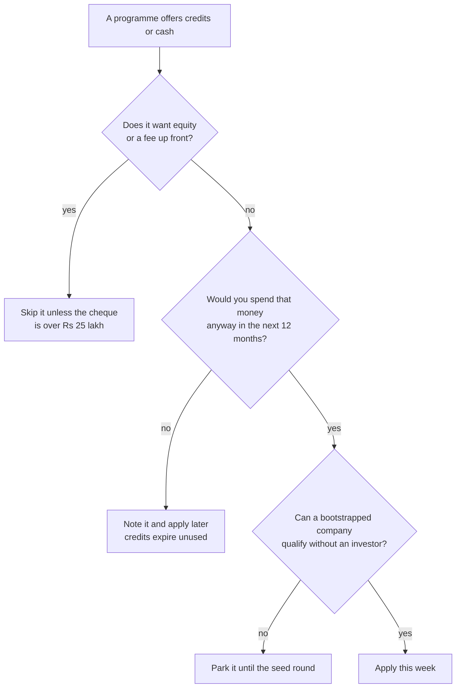

# Free Credits, Grants and Startup Programs

**In simple words:** This chapter lists every realistic way to get money or software without giving away a share of EduFlow. For each one it gives the researched amount, who may apply, how to apply, and the honest chance of getting it. The short answer is uncomfortable: credits are worth about Rs 42,000 in Year 1 and about Rs 2,54,000 in Year 2, which is under 2% of what you spend, and no government grant belongs in the plan.

## The five kinds of money people call free

| Kind | What you get | What it really costs you |
|---|---|---|
| Credit | One vendor's own bill drops to zero for a while | Nothing, but it expires unused |
| Discount | A percentage off a list price | Nothing, but only on paid plans |
| Grant | Cash you never repay | Weeks of paperwork and milestone reports |
| Soft loan | Cash at zero or low interest | Repayment, and sometimes a guarantee |
| Equity money | Cash for a share of the company | 2% to 8% of everything you ever build |

Only the first four are free. The fifth is the most expensive money in this chapter, and it is the one handed out most freely.

> **Rule:** A credit is worth what you would have spent anyway, never the headline number. AWS Activate says Rs 4,25,000. EduFlow's whole AWS bill in Year 1 is about Rs 8,000 (Estimate, from the S3 and SES lines of the plan). That credit is worth Rs 8,000 in Year 1.

**Figure: Is a programme worth applying for?**

Most programmes die at the second or the fourth box. Equity asks and investor-only eligibility remove about two thirds of the famous offers for a solo bootstrapped founder.

## Cloud and AI credits

| Programme | Headline | Bootstrapped | Main condition | Year 1 use |
|---|---|---|---|---|
| AWS Activate Founders | US$5,000, Rs 4,25,000 | Yes | Pre-Series B, paid AWS plan, new to Activate | Rs 8,000 |
| AWS Activate Portfolio | US$200,000, Rs 1.7 crore | No | Referral ID from an accelerator or investor | Rs 0 |
| Google for Startups, Start | US$2,000, Rs 1,70,000 | Yes | Under 5 years old, pre-funded | Rs 0 |
| Google for Startups, Scale | US$200,000, Rs 1.7 crore | No | Institutional equity funding | Rs 0 |
| Microsoft for Startups | US$1,000 then US$4,000 | Yes | Activate within 90 days, card on file | Rs 0 |
| Claude for Startups | Reported US$100,000 | No | Institutional equity; API credits only | Rs 0 |
| Vercel for Startups | US$30,000, Rs 25.5 lakh | No | A funding round plus an approved partner | Rs 0 |
| Railway Startup Program | US$5,000, Rs 4,25,000 | Yes | Batches of about 10 startups (Estimate) | Rs 0 |

All amounts are from the Master Price List except Railway, which is not in it; see the Sources list.

Three of these are technically open to EduFlow and worth nothing in Year 1. Google Cloud and Microsoft Azure are not in the canon stack, so their credits buy servers you will never switch on. Do not open accounts to chase them.

AWS Activate is different, because AWS is in the stack from Day 1 (S3 for files, SES for email) and becomes the whole stack at the 1,000-customer stage, where hosting is Rs 1,70,000 a month (see *Infrastructure and Software Costs by Scale*). The credit is one-time and AWS does not publish how long it lasts.

> **Tip:** Do not claim AWS Activate in October 2026. Claim it in the quarter before the move to AWS. At the 500-customer stage the AWS share of the bill is already large enough that Rs 4,25,000 of credits is used, not wasted. Claimed too early, most of it expires against a Rs 700 a month S3 bill.

Vercel, Claude and the big Google and Microsoft tiers all need a funding round. The Claude Max subscription at Rs 17,000 a month stays a real cost, because Anthropic's startup credits are API credits and would not pay a subscription even if EduFlow qualified.

Railway runs a startup programme that granted US$5,000 each to about ten startups in its first batch, and gives every new account a US$5 trial credit plus US$1 a month on the free plan (Estimate; see Sources). Ten slots a batch is not a plan. Treat the Railway bill of about Rs 75,000 in Year 1 (Estimate, from the Rs 2,000 to Rs 8,700 monthly path in the plan) as money you will pay.

## Developer and product tool credits

| Programme | Headline | Bootstrapped | Main condition | Year 1 use |
|---|---|---|---|---|
| Sentry for Startups | US$5,000, Rs 4,25,000 | Yes | Under 2 years old, under US$5M raised, new payer | Rs 22,000 |
| PostHog for Startups | US$50,000 plus US$12,000 | Yes | Under 2 years old, under US$5M raised | Rs 0 |
| GitHub for Startups | US$10,000, Rs 8,50,000 | No | Outside funding plus a GitHub partner | Rs 0 |
| Notion for Startups | Business free 3 to 6 months | Yes | Under 100 staff, no earlier Notion promotion | Rs 0 |

Sentry is the single best fit in the whole chapter. The plan starts the Sentry Team plan in December 2026 at Rs 2,200 a month. Credits run 12 months from the grant, so the arithmetic is:

1. Year 1 cover: December 2026 to September 2027 is 10 months. 10 x Rs 2,200 = Rs 22,000.
2. Year 2 cover: October and November 2027 at the larger Year 2 bill of about Rs 6,000 a month (Estimate: Team plan Rs 2,210 plus extra error bands at Rs 308 per 10,000 errors). 2 x Rs 6,000 = Rs 12,000.
3. Total used = Rs 22,000 + Rs 12,000 = Rs 34,000 out of a Rs 4,25,000 headline, which is 8%.

PostHog gives the largest headline number in this chapter and is worth nothing in Year 1, because the free allowance of 1 million events a month covers a product with 60,000 students. It becomes real in Year 2, when the plan is above the free allowance. Apply then, not now.

GitHub credits need a funding round, and GitHub Free already covers a one-person monorepo. Notion is not in the budget at all, so its three free months save Rs 0; if you do add it later, the saving is about Rs 5,100 per member for three months.

## Business tool credits

| Programme | Headline | Bootstrapped | Main condition | Year 1 use |
|---|---|---|---|---|
| Zoho for Startups, DPIIT | Rs 1,00,000 + Rs 86,000 | Yes | DPIIT recognised, no paid Zoho history | Rs 9,000 |
| Zoho for Startups, tax exempt | Rs 2,00,000 + Rs 1,00,000 | Later | The section 140 exemption certificate | Rs 0 |
| Freshworks, DPIIT | US$4,000, Rs 3,40,000 | Yes | Redeem within 1 year of a paid plan | Rs 3,000 |
| Freshworks, tax exempt | US$10,000, Rs 8,50,000 | Later | The section 140 exemption certificate | Rs 0 |
| HubSpot for Startups | 90% or 30% off year one | No | An approved partner or verified funding | Rs 0 |
| Razorpay Startup Perks | Rs 6 lakh of fee-free volume | No | Angel or venture funding | Rs 0 |
| Razorpay Rize | Free community and deals | Yes | Sign up with the company documents | Rs 0 |
| Stripe Atlas perks | US$2,500 of Stripe credits | Later | Only with a US Atlas company (Year 3) | Rs 0 |

Zoho is the one credit a bootstrapped Indian founder gets almost automatically, and it needs one thing first: DPIIT recognition. The wallet is valid 360 days. The plan spends Rs 750 a month on Zoho Books and Rs 250 a month on a CRM from January 2027, so:

- January to September 2027 is 9 months. 9 x (Rs 750 + Rs 250) = Rs 9,000 saved in Year 1.
- October 2027 to January 2028 is 4 months of Year 2 before the wallet expires, at a Year 2 Zoho bill of about Rs 8,000 a month (Estimate: Books, five Zoho CRM Standard seats at Rs 800 and three Desk seats). 4 x Rs 8,000 = Rs 32,000.
- Total from one free application = Rs 41,000.

> **Warning:** Zoho and Freshworks both disqualify a company that already has paid history. Apply in November 2026, before the first Zoho invoice in January 2027. One month of impatience costs Rs 41,000.

The shared support inbox at Rs 300 a month from December 2026 can be Freshdesk instead, which the Freshworks credits cover: 10 months x Rs 300 = Rs 3,000 in Year 1.

HubSpot and Razorpay Startup Perks both need funding, and the Razorpay perk is small anyway: Rs 6 lakh of fee-free volume saves about Rs 12,000 at 2%. Razorpay Rize itself is free and worth an evening: communities, founder deals and an investor database, with no equity and no fee.

## The two free registrations that unlock the rest

Neither costs a rupee, and between them they are the gate for almost every Indian programme in this chapter.

| Registration | Time | Cost | What it opens |
|---|---|---|---|
| Udyam (MSME) | Same day as the PAN | Rs 0 | Trademark at Rs 4,500 a class, CGTMSE |
| DPIIT startup recognition | 1 to 2 weeks | Rs 0 | Zoho, Freshworks, CGSS, section 140, tender relief |

DPIIT needs a Private Limited, LLP, partnership or cooperative, under 10 years old, with turnover under Rs 200 crore. EduFlow qualifies from its first week. *Before Day 1: One-Time Setup Costs* already puts both in the October 2026 week and prices them at Rs 0.

The trademark rebate is worth naming because it is already inside the plan, not on top of it. Two classes at Rs 4,500 instead of Rs 9,000 saves Rs 9,000 in government fees, and the BRD's Rs 15,000 trademark line assumes the rebate is in hand. Without Udyam at filing, the same trademark costs about Rs 24,000. The patent rebate of 80% is real and worth Rs 0 to EduFlow, because no patent is planned in Years 1 to 5. The SIPP scheme that paid the attorney's fee ended on 31 March 2026, so the Rs 3,000 attorney fee per class stays.

## Central government schemes

| Scheme | What it gives | Status for EduFlow |
|---|---|---|
| Startup India Seed Fund | Grant up to Rs 20 lakh, debt up to Rs 50 lakh | Closed to new applications 31 May 2026 |
| Section 140 tax holiday | 100% of profit exempt, 3 of the first 10 years | Apply, but do not budget it |
| Credit Guarantee for Startups | Guarantee on loans up to Rs 20 crore | Only useful if you take a loan |
| CGTMSE | Guarantee on collateral-free loans up to Rs 10 crore | Same; needs Udyam |
| Mudra Shishu, Kishore, Tarun | Loans up to Rs 50,000, Rs 5 lakh, Rs 10 lakh | Available; the interest is real |
| Mudra Tarun Plus | Rs 10 lakh to Rs 20 lakh | Only after repaying a Tarun loan |
| Self-certification and tender relief | 6 labour and 3 environment laws, GeM relief | Free with DPIIT; matters at state tenders |

The famous one is gone. The Startup India Seed Fund Scheme closed to new startup applications on 31 May 2026, with incubators finishing selection by 30 June 2026, and no new cycle had been notified by September 2026. Any adviser who offers to "get you SISFS money" in 2026 is selling a closed scheme.

The tax holiday is the largest number in this chapter and it is not cash. Section 140 of the Income-tax Act 2025 (the old section 80-IAC) exempts 100% of profit for three consecutive years out of the first ten. *Legal, Compliance, Tax and Accounting Costs* works the saving out in full: across Years 3 to 5, EBITDA of Rs 1,835 lakh at the 10.6-point gap between section 200 and minimum alternate tax is worth about Rs 1.95 crore. It needs an Inter-Ministerial Board certificate on top of DPIIT, about 1.8% of recognised startups hold one, and roughly half of applications are approved. Apply in February 2027. Keep the plan's tax line unchanged until the certificate is in hand.

The two guarantee schemes are often described as free money. They are not. They let a bank lend without collateral; you still pay interest and a guarantee fee.

> **Example:** A Rs 20 lakh working-capital loan at 11% costs Rs 2,20,000 of interest a year, plus a CGTMSE guarantee fee of 0.37% to 1.20% a year, which is Rs 7,400 to Rs 24,000. The all-in cost is about Rs 2,35,000 a year, or 11.75%. In Year 1 the plan already raises Rs 20,29,000 from customers as yearly prepaid advances, at 0% interest and 0% dilution. The cheapest lender EduFlow has is its own customers.

A Mudra Kishore loan of Rs 5,00,000 at 11% over three years costs about Rs 89,000 of interest (Estimate, reducing balance, EMI about Rs 16,370). It is a fair way to bridge a bad quarter. It is a poor way to fund growth that customer advances already fund.

## MeitY programmes

| Programme | Amount | Instrument | Fit |
|---|---|---|---|
| TIDE 2.0 | Rs 4 lakh idea stage, Rs 7 lakh MVP stage | Grant | Education is eligible; last call closed Aug 2025 |
| GENESIS | EIR up to Rs 10 lakh, pilot up to Rs 40 lakh | Grant | Tier 2 and 3 founders; Patna and Lucknow qualify |
| GENESIS matching | Up to Rs 50 lakh, one to one | Equity | Dilutes; treat it as a funding round |
| SAMRIDH | Average Rs 30 lakh, up to Rs 40 lakh | Equity | A SAFE that converts; not free money |

GENESIS is the best-matched government programme for this founder. It is run through incubators, Incubation Centre IIT Patna is one of them, it targets founders from Tier 2 and Tier 3 cities, and both Patna and Lucknow qualify. The rules are tight: a DPIIT startup up to two years old, with no more than Rs 10 lakh of external funding. The Rs 6,00,000 of founder capital is the founder's own money, not external funding, so EduFlow fits on that test. The EIR 3.0 call ran from 4 August to 3 September 2026 and has closed, so the realistic action is to register interest with IC IIT Patna and watch for the next call.

SAMRIDH is money for equity dressed as a government scheme. The instrument is a SAFE that converts to preference shares, and the government matches an accelerator's cheque. It belongs in the funding chapter, not here.

## State startup policies

The state where the company is registered decides which of these you can touch. You cannot hold Bihar and Uttar Pradesh benefits at the same time. Decide this before incorporation in October 2026, not after.

| Benefit | Bihar | Uttar Pradesh, 2020 policy | Uttar Pradesh, 2026 policy |
|---|---|---|---|
| Seed money | Rs 10 lakh, 0% loan, 10 years | Not a direct seed line | Up to Rs 15 lakh |
| Monthly allowance | No | Rs 17,500 for 12 months | Rs 20,000 for 24 months |
| Prototype grant | No | Up to Rs 5 lakh | Up to Rs 10 lakh |
| Marketing help | No | Up to Rs 7.5 lakh | Not yet published |
| Incubation cost | Up to Rs 2 lakh reimbursed | Free for 6 to 12 months | Not yet published |
| Patent help | Domestic filing free | Rs 2 lakh India, Rs 10 lakh abroad | Not yet published |
| Status | Policy 2022, in force | In force, still listed | Approved July 2026, guidelines pending |

Bihar in numbers: Rs 10,00,000 interest-free for ten years, with a two-year moratorium, released on milestones in two tranches reported as Rs 4 lakh and Rs 6 lakh. Women founders and SC or ST founders get 5% more, differently abled founders 15% more. The company must be a Private Limited or LLP registered and operating in Bihar with a resident founder, and the decision takes about three to four months. Against an 11% bank loan, ten years at 0% avoids about Rs 6,50,000 of interest (Estimate). An announcement at Avinya Bihar 2.0 in January 2026 raised the figure to Rs 25 lakh, but it has not been notified. Plan on Rs 10 lakh.

Uttar Pradesh in numbers: the listed 2020 policy pays Rs 17,500 a month for 12 months, which is Rs 2,10,000 a year, through a recognised incubator such as AKTU Innovation Hub in Lucknow, which incubates free for six months with six more on performance. The 2026 policy doubles this to Rs 20,000 for 24 months, which is Rs 4,80,000, but the operating guidelines had not been published by September 2026, so it is not claimable yet.

Delhi has nothing claimable. The 2025 draft policy was never notified, and the 2026 Start-up and Incubation Policy of Rs 400 crore runs through Delhi university incubators only, with amounts unpublished.

> **Founder note:** The state choice is a business decision, not a subsidy decision. Bihar's Rs 10 lakh is a loan you repay; Lucknow's free incubation is worth Rs 36,000 to Rs 1,20,000 a year of desk rent. Neither should move the company away from where its first customers are.

## Incubators and accelerators, and what they take

| Incubator | Where | What it gives | What it takes |
|---|---|---|---|
| IC IIT Patna | Bihta, Bihar | GENESIS, NIDHI-PRAYAS, EIR routes | Fees and equity not published |
| VenturePark (BIA) | Patna | Co-working, mentoring, investor connects | Fees and equity not published |
| IIML-EIC | Noida, not Lucknow | 24-month programme, seed for the top quarter | Equity; founders keep 51% or more |
| NASSCOM 10,000 Startups | Five metros, none near Patna | Partner credit kit | Zero equity |
| T-Hub Lab32 | Hyderabad | 100-day market-readiness cohort | Equity-free; fee not published |
| Typical Indian incubator | Anywhere | Desk, mentors, scheme access | 2% to 5% equity, or Rs 3,000 to 10,000 a seat |

Two of these are worth an email in October 2026 and neither needs you to move. IC IIT Patna is a GENESIS host, which is the only live grant route that matches this founder's profile. NASSCOM 10,000 Startups takes zero equity and hands over a partner credit kit, although it has no warehouse in Patna or Lucknow. T-Hub's Lab32 is equity-free and runs 100-day cohorts for startups with a working MVP, which EduFlow will have from December 2026; its programme fee is not published, so ask in writing (Estimate; see Sources).

The equity question has one arithmetic answer. The BRD's seed round assumes a pre-money value of Rs 16 crore around March 2028.

1. A 3% incubator stake is worth 3% x Rs 16,00,00,000 = Rs 48,00,000 at that price.
2. If the incubator gives Rs 10,00,000 of value, the implied price is Rs 10,00,000 divided by 3%, which is Rs 3,33,33,333, about Rs 3.33 crore.
3. Rs 16 crore divided by Rs 3.33 crore is 4.8, so you would be selling shares at about one fifth of their March 2028 price.

> **Rule:** Never give equity for a benefit worth less than Rs 25 lakh. At the BRD's own valuation, 2% is Rs 32 lakh and 5% is Rs 80 lakh. A desk, a mentor and an introduction are not worth that.

## What the programmes cost you to hold

Every Recommended figure here is Rs 0, because the BRD plan takes no grant, no loan and no incubator seat. That is the correct plan.

| Item | When to pay | Minimum | Recommended | Maximum | Can you avoid or reduce it? |
|---|---|---|---|---|---|
| DPIIT recognition (one-time) | Oct 2026 | Rs 0 | Rs 0 | Rs 0 | Already free. Never pay an agent |
| Udyam registration (one-time) | Oct 2026 | Rs 0 | Rs 0 | Rs 0 | Already free. Ignore look-alike sites |
| Section 140 application (one-time) | Feb 2027 | Rs 0 | Rs 0 | Rs 15,000 | Yes. The CA files it inside the retainer |
| Incubator seat (monthly, + GST) | On joining | Rs 0 | Rs 0 | Rs 1,20,000 a year | Yes. Remote incubation is usually free |
| CGTMSE fee on a Rs 20 lakh loan (yearly) | With the loan | Rs 7,400 | Rs 0 | Rs 24,000 | Yes. Do not take the loan |
| Mudra Kishore interest, Rs 5 lakh, 3 years | Monthly EMI | Rs 0 | Rs 0 | Rs 89,000 total | Yes. Customer advances cost 0% |
| Grant or subsidy consultant (one-time) | On signing | Rs 0 | Rs 0 | Rs 0 | Yes, always. Nothing here needs one |

> **Rule:** Government registrations, grants and loans in this chapter carry no GST, because a grant or a loan is not a supply. Indian vendor credits such as Zoho reduce the invoice, so the 18% GST falls with it; since that GST was claimable anyway, your real saving is the base price, not the base price plus GST. Confirm the treatment with the CA before the first wallet redemption.

## What all of this is worth in Year 1 and Year 2

Credits first. These are savings against lines that already exist in the BRD plan, so they reduce spend; they do not add cash.

| Credit source | Year 1 minimum | Year 1 likely | Year 1 best | Year 2 likely | Year 2 best |
|---|---|---|---|---|---|
| Zoho for Startups | Rs 9,000 | Rs 9,000 | Rs 9,000 | Rs 32,000 | Rs 96,000 |
| Sentry for Startups | Rs 0 | Rs 22,000 | Rs 26,400 | Rs 12,000 | Rs 12,000 |
| Freshworks for Startups | Rs 0 | Rs 3,000 | Rs 3,000 | Rs 60,000 | Rs 1,20,000 |
| AWS Activate Founders | Rs 0 | Rs 8,000 | Rs 8,000 | Rs 1,00,000 | Rs 1,75,000 |
| PostHog for Startups | Rs 0 | Rs 0 | Rs 0 | Rs 50,000 | Rs 1,00,000 |
| **Total credits** | **Rs 9,000** | **Rs 42,000** | **Rs 46,400** | **Rs 2,54,000** | **Rs 5,03,000** |

Year 2 minimum is Rs 32,000, the Zoho wallet alone. The arithmetic behind the less obvious cells: Sentry best case is Rs 2,200 x 12 = Rs 26,400 if the Team plan starts in October rather than December. AWS Year 2 assumes S3, SES and CloudFront are 25% of the Rs 7,00,000 Year 2 hosting line, which is Rs 1,75,000 (Estimate). PostHog Year 2 assumes about 2 million events a month above the free allowance at Rs 4,250 per extra million: 2 x Rs 4,250 x 12 = Rs 1,02,000, rounded to Rs 1,00,000. Freshworks Year 2 assumes the support-tool part of the plan's Rs 5,000 per support person a month, about Rs 1,20,000.

Put beside total spend, the picture is honest.

| Measure | Year 1 | Year 2 |
|---|---|---|
| Total cost in the plan | Rs 23,77,500 | Rs 1.78 crore |
| Likely credits | Rs 42,000 | Rs 2,54,000 |
| Credits as a share of spend | 1.8% | 1.4% |

Check: Rs 42,000 divided by Rs 23,77,500 is 1.77%. Rs 2,54,000 divided by Rs 1,78,00,000 is 1.43%. Year 2 total cost is revenue of Rs 190 lakh minus EBITDA of Rs 12 lakh.

Cash from schemes is a separate question, and the answer is a plan of zero.

| Cash source | Type | Amount | Minimum | Likely | Best case |
|---|---|---|---|---|---|
| Bihar seed fund | 0% loan, 10 years | Rs 10,00,000 | Rs 0 | Rs 0 | Rs 10,00,000 |
| MeitY GENESIS EIR | Grant | Rs 10,00,000 | Rs 0 | Rs 0 | Rs 10,00,000 |
| UP allowance, if UP-registered | Grant via incubator | Rs 2,10,000 | Rs 0 | Rs 0 | Rs 2,10,000 |
| Mudra Kishore | Loan at 9% to 12% | Rs 5,00,000 | Rs 0 | Rs 0 | Rs 5,00,000 |
| **Total cash** | | | **Rs 0** | **Rs 0** | **Rs 25,00,000** |

Best case is Bihar plus GENESIS plus Mudra: Rs 10,00,000 + Rs 10,00,000 + Rs 5,00,000 = Rs 25,00,000, and only Rs 10,00,000 of that is a grant that is never repaid. The UP row is an alternative to Bihar, not an addition, so it stays out of the total. Likely is Rs 0, because nothing here is open and unconditional today: SISFS is closed, the GENESIS call has closed, and the Bihar and UP routes need the company to sit in that state.

> **Warning:** The BRD funds Year 1 with Rs 6,00,000 of founder capital and no grant money. Keep it that way. Every hour spent chasing a Rs 10 lakh scheme is an hour not spent on the 15% free-to-paid conversion target, and one extra Growth customer at Rs 24,990 a year is money that arrives in a week, not in four months.

## The application calendar for the next six months

| When | What to do | Cost | Why that month |
|---|---|---|---|
| Oct 2026, week 1 | Udyam, the day the PAN arrives | Rs 0 | Halves the trademark fee to Rs 4,500 a class |
| Oct 2026, week 2 | DPIIT startup recognition | Rs 0 | Gate for Zoho, Freshworks, CGSS, section 140 |
| Oct 2026, week 2 | Trademark, classes 9 and 42 | Rs 15,000 | The Rs 4,500 rate needs the certificate at filing |
| Oct 2026, week 3 | Razorpay Rize sign-up | Rs 0 | Free, and it takes one evening |
| Oct 2026, week 4 | Email IC IIT Patna and NASSCOM | Rs 0 | Register interest before the next GENESIS call |
| Nov 2026 | Zoho for Startups, before any Zoho invoice | Rs 0 | Paid history disqualifies the company |
| Nov 2026 | Freshworks for Startups | Rs 0 | Same rule, before the support inbox is paid |
| Nov 2026 | Bihar seed fund, only if Bihar-registered | Rs 0 | It takes 3 to 4 months to decide |
| Dec 2026 | Sentry for Startups, the week Team starts | Rs 0 | Credits run 12 months from the grant date |
| Jan 2027 | Create a PostHog account, then apply | Rs 0 | Credits are useful once past the free tier |
| Feb 2027 | Section 140 application through the CA | Rs 0 | Needs DPIIT; about half are approved |
| Mar 2027 | Review what expires and what to claim next | Rs 0 | Unused credit value is lost, never refunded |

> **Best practice:** Put one line in the monthly review: credits expiring in the next 90 days. Sentry, Zoho, Freshworks, PostHog and AWS credits all expire. An expiring credit is a bill arriving next month.

## Programmes to walk away from

| Warning sign | What it usually is | What to do |
|---|---|---|
| A fee to "get you" DPIIT, Udyam or a grant | A form-filling agent | File it yourself; both are free portals |
| A site charging Rs 1,000 to 2,000 for Udyam | A look-alike domain | Use the official Udyam portal only |
| "SISFS funding available now" | A closed scheme being resold | Closed to new applicants since 31 May 2026 |
| 5% to 8% equity for a cohort seat | An accelerator with a small cheque | Refuse below a Rs 25 lakh benefit |
| A credit that forces an Enterprise plan | Vercel and GitHub startup terms | Check the price when the credit ends |
| A grant that needs relocation | A state scheme outside your market | Customers first, subsidy second |
| Paid awards, rankings and listing fees | Advertising sold as recognition | No buyer of school software reads them |
| An incubator that will not put fees in writing | An open-ended equity ask | Ask by email; no written answer, no deal |

The credit-to-Enterprise trap deserves the most care, because it costs money rather than time. A credit that only runs on an Enterprise contract leaves you, twelve months later, on a plan priced for a funded company. Before accepting any credit, write down the list price of the plan it puts you on, and check that you could pay it on the day the credit dies.

## How to treat credits in the budget

Four rules keep this chapter from damaging the plan.

1. Never reduce a Recommended budget line because a credit might arrive. Recommended equals the BRD plan, and the BRD plans zero credits and zero grants.
2. When a credit is granted, keep the budget line and let the saving show as favourable variance in the monthly review. That variance is buffer, not new spending power.
3. Claim a credit in the quarter you will use it, not the quarter you find it. AWS Activate is the clearest case: claimed in October 2026 it covers Rs 8,000, claimed before the AWS move it covers a Rs 1,70,000 monthly bill.
4. Treat a loan as a loan. The Bihar seed fund at Rs 10 lakh is cash today and a repayment from Year 3, and it is smaller than the Rs 20,29,000 of customer advances the plan already collects in Year 1.

## Sources

Two facts in this chapter are not in the Master Price List. Both were read as web-search summaries on 24 September 2026, not opened as pages, so both are Estimates.

- Railway, startup programme announcement and free-trial credits, https://x.com/Railway/status/1781010427301732703 and https://docs.railway.com/pricing/free-trial
- T-Hub, "Startup Programs at T-Hub", https://www.t-hub.co/programs, with programme detail from Startup Grants India, https://www.startupgrantsindia.com/providers/t-hub-hyderabad

## Key takeaways

- Credits are worth about Rs 42,000 in Year 1 and about Rs 2,54,000 in Year 2, which is 1.8% and 1.4% of total spend. They are worth claiming and they are not a funding strategy.
- Two free registrations do most of the work. Udyam on the day the PAN arrives and DPIIT in the same fortnight unlock the Rs 4,500 trademark rate, the Zoho and Freshworks wallets, the guarantee schemes and the section 140 tax holiday.
- Apply to Zoho and Freshworks in November 2026, before any Zoho or Freshworks invoice exists. Paid history disqualifies you, and that one month of timing is worth Rs 41,000 across Years 1 and 2.
- Claim AWS Activate late, not early. Rs 4,25,000 of credits against a Rs 8,000 Year 1 AWS bill is waste; the same credit against the AWS move at the 1,000-customer stage is real money.
- Plan for zero grant money. SISFS closed on 31 May 2026, the GENESIS call has closed, and the Bihar Rs 10 lakh and UP routes depend on where the company is registered. Best case across Years 1 and 2 is Rs 25,00,000, of which only Rs 10,00,000 is a grant.
- The section 140 tax holiday is the biggest number here, worth about Rs 1.95 crore across Years 3 to 5, and only about 1.8% of recognised startups hold the certificate. Apply in February 2027 and leave the plan's tax line unchanged until it is granted.
- Never give equity for a benefit under Rs 25 lakh. At the BRD's Rs 16 crore pre-money, a 3% incubator stake is Rs 48 lakh, which prices your shares at about one fifth of what they should fetch in March 2028.
